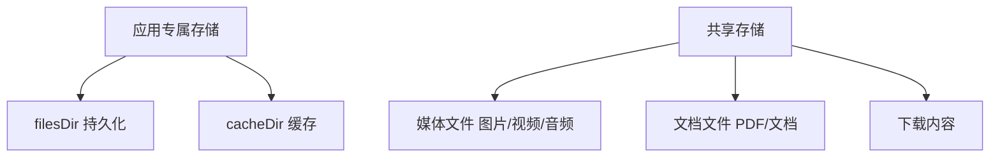
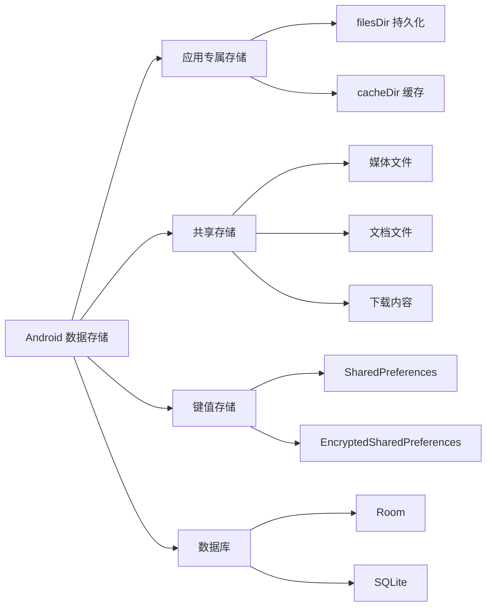

# 1.1.1 关于存储应用数据和文件

夏日的傍晚，蝉鸣声一浪一浪地从远处的树梢涌来。四个女孩儿窝在露营地的帐篷外，铺了一张格子野餐布，懒洋洋地躺着，头顶是被晚霞染成蜜桃色的天空。

黛琳侧过身，把一根冰棍递给洛芙，声音软软的，带着一丝漫不经心的认真："今天我们来聊聊数据存储吧——就是 Android 应用怎么'记住'东西的那件事。"

"记住东西？"洛芙接过冰棍，舔了一口，眼睛弯成了月牙，"就像我记住你今天穿了一件好看的裙子那种记住？"

"差不多！"希尔噗嗤一声笑出来，翻了个身趴在布上，下巴搁在手背上，"不过应用记东西，要比你记裙子靠谱多了。"

伊莎轻轻笑着，摘下耳机，把音乐声音调小了一点，"其实你想想，我们每天用的那些 app——微信记得你的聊天记录，相册记得你拍的照片，备忘录记得你写的小心情——这些'记住'，背后都是数据存储在默默工作。"

"哇……"洛芙仰头望着天，若有所思，"那 Android 是怎么存这些东西的呀？"

黛琳坐起来，随手在野餐布旁边的草地上折了一根小树枝，在空气里比划着："Android 的数据存储，大概分三种方式。你把它想象成我们的露营行李——"

她竖起一根手指："**第一种，应用专属存储。** 就是你的私人背包，只有你自己能翻，别人碰都碰不到。"

又竖起第二根："**第二种，共享存储。** 就像营地的公共储物柜，大家都能放东西进去，也能经过允许拿别人的东西。"

第三根手指弯弯地翘起来："**第三种，Preferences 和数据库。** 这个嘛……有点像你的日记本，可以记很多很多有条理的事情，还能随时翻出来查。"

洛芙歪着头，把冰棍在嘴边转了一圈："听起来好像……还挺好懂的？"

"当然好懂。"希尔已经打开了笔记本电脑，屏幕的光在暮色里泛着柔和的蓝，"来，我们一个一个说。"

### 应用专属存储

"先说私人背包——应用专属存储。"希尔把电脑转过来让大家都能看见，"这块地方，只有你的应用能进去，其他应用想看？没门。就算是系统，也得等你的应用被卸载了才会把这里清空。"

"哦，就像我的日记本，我妈都不能看那种。"洛芙心领神会。

"对！就是那种感觉。"希尔笑着点头，"代码写起来也很简单——"

```kotlin
// 在应用专属存储中创建文件并写入
// filesDir 指向 /data/data/<包名>/files/，只有本应用可访问
val file = File(filesDir, "my_secret_note.txt")
file.writeText("这是我的小秘密～")

// 读取文件全部内容，返回 String
val content = file.readText()

// 使用缓存目录存放临时文件
// cacheDir 指向 /data/data/<包名>/cache/，系统空间不足时可能自动清理
val cacheFile = File(cacheDir, "temp_data.json")
cacheFile.writeText("这是临时数据")
```

"这里有两个小格子，"希尔用手指在屏幕上点了点，"`filesDir` 是持久化存储——就像你行李箱最底层压着的东西，不会轻易消失；`cacheDir` 是缓存——就像你口袋里随手塞的纸巾，系统觉得空间不够了，可能会悄悄帮你扔掉。"

"那……如果我要存图片呢？"洛芙凑近屏幕，眼睛里倒映着代码的光，"比如我们今天拍的那些照片？"

"问得好！"希尔打了个响指，"图片这种大文件，要这样存——"

```kotlin
// 将位图压缩保存到应用专属存储
// BitmapFactory.decodeResource() 从 res/drawable 加载图片为 Bitmap 对象
val bitmap = BitmapFactory.decodeResource(resources, R.drawable.camp_photo)
val photoFile = File(filesDir, "camp_photo.jpg")

// 用 FileOutputStream + use {} 写入，保证流自动关闭
// compress() 参数：格式、质量（0-100）、输出流
FileOutputStream(photoFile).use { out ->
    bitmap.compress(Bitmap.CompressFormat.JPEG, 90, out)
}
```

"哇，好像……没有我想象的那么可怕嘛！"洛芙松了口气，舒舒服服地往后靠了靠。

黛琳轻声补了一句："不过要记住，应用专属存储里的文件，在应用被卸载的时候，会跟着一起消失。就像你离开营地，自己的东西得自己带走——留下来的，就真的不见了。"

"所以……不能把特别重要的东西只存在这里？"洛芙若有所思。

"聪明。"黛琳弯起眼睛，"如果是用户很在意的数据，比如他们辛苦写的日记，最好有备份策略。但如果只是应用自己用的配置、缓存，放这里就很合适。"

### 共享存储

"接下来说公共储物柜——共享存储。"黛琳接过话头，表情认真了一点点，但眼神还是温柔的，"这个稍微复杂一些，不过也没什么好怕的。"

伊莎把手里的草茎在指间绕了一圈，慢悠悠地打了个比方："你想象一下，营地里有一个大家都能用的晾衣架。你把衣服挂上去，别人路过能看见；你也能看见别人的衣服——但是，你不能随便把别人的衣服拿走，得先打招呼，得到允许才行。"

"哦！就是要申请权限那种感觉。"洛芙恍然大悟。

"对。"黛琳点头，"在 Android 里，访问共享存储，需要先检查有没有权限——"

```kotlin
// 检查并请求共享存储读取权限
// ContextCompat.checkSelfPermission() 返回当前权限状态
if (ContextCompat.checkSelfPermission(this, 
        Manifest.permission.READ_EXTERNAL_STORAGE) 
    != PackageManager.PERMISSION_GRANTED) {
    // 未授权，弹出系统权限请求对话框
    // requestCode 1001 用于在 onRequestPermissionsResult 中识别本次请求
    ActivityCompat.requestPermissions(this,
        arrayOf(Manifest.permission.READ_EXTERNAL_STORAGE),
        1001)
}
```

"而且从 Android 10 开始，"黛琳说着，随手在笔记本上画了一张小图，"还多了一个叫做 Scoped Storage 的东西——限定作用域的存储。简单说，就是把共享存储分得更细了，每个应用只能看到自己相关的那一块，不能随便乱翻别人的文件。"



"这张图一看就清楚了，"黛琳把电脑推到大家面前，"左边是你的私人背包，右边是公共储物柜，各司其职，互不干扰。"

洛芙歪着头想了想："那……如果我做了一个拍照应用，用户拍的照片，应该存哪里？"

"这个问题问得很妙！"希尔兴奋地坐直了，"如果照片只是应用自己用的，比如头像缓存，存到应用专属存储就好；但如果用户希望照片出现在手机相册里，让其他应用也能看到——那就得存到共享存储的媒体区域。"

"所以要看用户的需求。"洛芙点点头。

"对，永远先想用户需要什么。"黛琳轻声说，语气里有一种不急不缓的笃定。

### 键值存储：SharedPreferences

"还有一种特别可爱的存储方式，"伊莎把草茎扔到一边，撑起身子，眼睛亮亮的，"叫做 SharedPreferences。"

"可爱？"洛芙被这个形容词逗乐了，"存储方式还能可爱？"

"当然可以！"伊莎笑着比划，"你想象一下，你桌子上贴了一堆便利贴——'深色模式：开'、'通知：关'、'用户名：洛芙'——就是这种感觉。轻轻松松，一眼就能找到。"

"哦哦哦！"洛芙眼睛一亮，"就是那种小小的、用来记设置的东西！"

"对！"伊莎点头，"代码也很简洁——"

```kotlin
// 保存键值对到 SharedPreferences
// getSharedPreferences() 参数：文件名、访问模式（MODE_PRIVATE = 仅本应用可读写）
val prefs = getSharedPreferences("my_camp_settings", Context.MODE_PRIVATE)
prefs.edit().apply {
    putString("camp_name", "星空露营地")   // 字符串类型
    putInt("tent_count", 5)               // 整数类型
    putBoolean("fire_allowed", true)      // 布尔类型
    apply()  // 异步写入磁盘（不阻塞主线程）
}

// 读取已保存的键值对（第二个参数是找不到 key 时的默认值）
val campName = prefs.getString("camp_name", "默认营地")
val tentCount = prefs.getInt("tent_count", 0)
val fireAllowed = prefs.getBoolean("fire_allowed", false)
```

"看，就像在便利贴上写字，然后再把便利贴撕下来读一读。"伊莎指着代码，声音轻快得像在念一首小诗，"不过呢——"她话锋一转，带着一点小小的俏皮，"SharedPreferences 只适合存很小很小的东西。如果你想把用户所有的聊天记录都塞进去……那便利贴可要贴满整面墙了。"

"那聊天记录这种大量数据，要用什么？"洛芙问。

"数据库。"三个人异口同声。

### 数据库：Room

"说到数据库，"希尔的眼睛亮了一下，"Android 里最好用的，是 Room。"

"Room？"洛芙把这个词在嘴里滚了一圈，"听起来像是一个房间。"

"可以这么理解！"希尔笑道，"它就像是一个有条有理的大房间，里面有很多抽屉，每个抽屉都贴着标签，你想找什么，直接告诉它，它帮你找出来。不需要你自己去翻那些乱七八糟的 SQL 语句。"

"对象映射数据库，"黛琳补充道，语气像是在解释一件理所当然的事，"就是让你用操作 Kotlin 对象的方式来操作数据库。写起来很自然，读起来也很清晰。"

```kotlin
// 定义数据表结构（Entity = 数据库中的一张表）
// @Entity 注解告诉 Room 这个类对应一张名为 "campers" 的表
@Entity(tableName = "campers")
data class Camper(
    @PrimaryKey(autoGenerate = true) val id: Long = 0,  // 自增主键
    val name: String,
    val age: Int,
    val skill: String  // 技能：比如"烹饪"、"搭帐篷"、"讲故事"
)

// 定义数据访问接口（DAO = Data Access Object）
// @Dao 注解标记的接口，Room 会自动生成实现类
@Dao
interface CamperDao {
    // 查询所有露营者，返回 Flow（数据变化时自动通知）
    @Query("SELECT * FROM campers")
    fun getAllCampers(): Flow<List<Camper>>
    
    // 按技能筛选（:skill 是参数占位符）
    @Query("SELECT * FROM campers WHERE skill = :skill")
    fun getCampersBySkill(skill: String): Flow<List<Camper>>
    
    // suspend = 必须在协程中调用，Room 会自动切到后台线程执行
    @Insert
    suspend fun insert(camper: Camper)
    
    @Delete
    suspend fun delete(camper: Camper)
}

// 定义数据库（连接 Entity 和 DAO）
// version 用于数据库升级管理
@Database(entities = [Camper::class], version = 1)
abstract class CampDatabase : RoomDatabase() {
    abstract fun camperDao(): CamperDao
}

// 创建数据库实例（通常在 Application 或用依赖注入管理）
val db = Room.databaseBuilder(
    applicationContext,
    CampDatabase::class.java,
    "camp_database"          // 数据库文件名
).build()

val dao = db.camperDao()

// 插入一条记录（需要在协程中调用）
dao.insert(Camper(name = "洛芙", age = 18, skill = "讲故事"))

// 观察数据变化（Flow 是 Kotlin 的响应式数据流）
// 数据库中数据一旦变化，collect 块会自动重新执行
dao.getAllCampers().collect { campers ->
    campers.forEach { println("${it.name}: ${it.skill}") }
}
```

洛芙盯着屏幕看了好一会儿，眨了眨眼："好多注解……但是……感觉好像能看懂？"

"对！就是这种感觉。"希尔拍了拍她的肩膀，"Room 的设计很聪明，它把复杂的事情藏在背后，留给你的是一个干净、好读的接口。你只需要告诉它：这是我的数据长什么样，这是我要做的操作——剩下的，它来搞定。"

"而且，"黛琳轻轻说，"你看代码里有个 `Flow`——这是 Kotlin 的响应式数据流。意思是，数据库里的数据一旦变了，你的界面会自动跟着更新，不需要你手动去刷新。就像……"她想了想，"就像你在看一本会自己翻页的书。"

"哇。"洛芙小声感叹，"Android 好聪明。"

"是你好聪明。"伊莎笑着揉了揉她的头发，"能把这些都理解，已经很厉害了。"

### 最佳实践

夜色渐深，草地上的露水开始悄悄凝结，空气里多了一丝清凉的甜。黛琳把膝盖抱起来，望着远处若隐若现的萤火虫，轻声说：

"最后，我来说几条用起来最顺手的原则——不是规定，是经验。"

她掰着手指，语气像是在和朋友分享一个小秘密：

"**第一，根据数据的性质选存储方式。** 只有你的应用会用的数据，就放私人背包；需要和其他应用分享的，才放公共储物柜。不要大包大揽，也不要委屈自己。

**第二，能用数据库就用数据库。** 数据库可以查询、排序、过滤，比直接操作文件灵活太多了。而且 Room 写起来真的不难。

**第三，敏感数据一定要加密。** 密码、登录令牌这种东西，绝对不能直接扔进普通的 SharedPreferences。要用 EncryptedSharedPreferences，或者其他加密方案。这不是可选项，是必须的。

**第四，及时清理不需要的数据。** 缓存文件不是越多越好，用完了就清。用户不需要的数据，也不要替他们'保管'——那叫占地方。"

洛芙点点头。

夜色已经很深了，萤火虫不知道什么时候全散了，只剩下头顶密密麻麻的星星。远处偶尔传来一声夜鸟的叫，又很快被虫鸣淹没。

"所以说，"伊莎仰头望着天，声音轻轻的，"存储方式是帮应用'记住'事情的方法——选哪一种，要看那件事值得被记住多久。"

洛芙抱着膝盖，没有说话。草地上的露水凉凉地沁到了她的脚踝，但她不想动。脑子里那些应用专属存储、共享存储、SharedPreferences、Room，正在一点一点地变得清晰，像星星一颗一颗地亮起来。

"早点睡，"黛琳站起来，拍了拍裙子上的草屑，"明天跟你讲 `filesDir` 的细节。"

"好。"洛芙应了一声，但一直到帐篷的拉链声在身后响起，她还坐在那里，看着星空。

---

### 技术总结

> **Android 数据存储** —— Android 提供了多种数据存储方式，包括应用专属存储（filesDir、cacheDir）、共享存储（媒体文件、文档）、键值存储（SharedPreferences）和数据库（Room），每种方式适用于不同的场景。

#### 今日关键词

1. **应用专属存储**：只有创建它的应用才能访问的存储区域，适合存储私有数据
2. **共享存储**：多个应用可以访问的存储区域，需要权限，分为媒体存储和文档存储
3. **SharedPreferences**：轻量级键值存储，适合保存设置和简单配置
4. **Room**：Android 的对象映射数据库，提供类型安全的数据库操作
5. **Scoped Storage**：Android 10 引入的限定作用域存储，提高数据安全性

#### 结构图



#### 反模式与陷阱

1. **把敏感信息存在普通 SharedPreferences**：密码、令牌等敏感数据会被泄露
   - 修复：使用 EncryptedSharedPreferences

2. **在主线程操作数据库**：会导致 UI 卡顿
   - 修复：使用协程（suspend 函数）或 Flow

3. **不申请权限就访问共享存储**：会导致崩溃
   - 修复：先检查并请求必要权限

4. **使用绝对路径存储文件**：不同设备路径可能不同
   - 修复：使用 Context 提供的目录方法

5. **不清理缓存文件**：可能导致存储空间耗尽
   - 修复：定期清理或使用 cacheDir（系统会自动清理）

#### 设计思想

1. **数据隔离原则**：每个应用的数据应该相互隔离，保护用户隐私
2. **最小权限原则**：只请求必要的存储权限
3. **分层存储**：根据数据的访问模式和重要性选择合适的存储方式

### 🏕️ 动手练习

---

#### Task 1 · 便利贴日记本 ★

**目标**：用 SharedPreferences 实现一个最简单的单条笔记应用，能保存和读取一段文字。

**你需要做的事：**

1. 新建一个 Android 项目（Empty Activity）
2. 在 `activity_main.xml` 中添加：
   - 一个 `EditText`，用于输入笔记内容
   - 一个"保存"按钮
   - 一个 `TextView`，用于显示上次保存的内容
3. 在 `MainActivity.kt` 中：
   - 点击"保存"时，把 `EditText` 的内容写入 SharedPreferences（key 用 `"note_content"`）
   - 应用启动时，自动读取上次保存的内容并显示在 `TextView` 上

**验收标准：**
- [ ] 输入文字 → 点击保存 → 关闭应用重新打开 → 文字依然显示
- [ ] `EditText` 为空时点击保存，`TextView` 显示"暂无笔记"

**提示：**
```kotlin
val prefs = getSharedPreferences("note_prefs", Context.MODE_PRIVATE)
// 保存
prefs.edit().putString("note_content", text).apply()
// 读取（第二个参数是默认值）
val saved = prefs.getString("note_content", "暂无笔记")
```

---

#### Task 2 · 照片保险箱 ★★

**目标**：把一张 drawable 图片保存到应用专属存储（`filesDir`），再从文件读取并显示出来，验证"存进去能取出来"的完整流程。

**你需要做的事：**

1. 在 `res/drawable` 中放一张图片（比如 `camp_photo.png`）
2. 布局中添加：
   - 一个"保存图片"按钮
   - 一个"读取图片"按钮
   - 一个 `ImageView` 用于显示
3. 点击"保存图片"：
   - 用 `BitmapFactory.decodeResource` 加载 drawable
   - 用 `FileOutputStream` 压缩保存到 `filesDir/camp_photo.jpg`
   - 保存成功后用 Toast 提示
4. 点击"读取图片"：
   - 从 `filesDir/camp_photo.jpg` 读取文件
   - 用 `BitmapFactory.decodeFile` 解码
   - 显示在 `ImageView` 中

**验收标准：**
- [ ] 先点保存，再点读取，`ImageView` 正确显示图片
- [ ] 在文件管理器中能找到 `data/data/<包名>/files/camp_photo.jpg`（模拟器可用 Device Explorer 查看）
- [ ] 未保存就点读取时，Toast 提示"文件不存在，请先保存"

**提示：**
```kotlin
val file = File(filesDir, "camp_photo.jpg")
// 检查文件是否存在
if (!file.exists()) { /* 提示用户 */ return }
val bitmap = BitmapFactory.decodeFile(file.absolutePath)
```

---

#### Task 3 · 露营者名单 ★★★

**目标**：用 Room 数据库实现一个可以增删查的露营者名单，数据持久化，重启应用后不丢失。

**你需要做的事：**

1. 添加 Room 依赖到 `build.gradle`：
   ```kotlin
   implementation("androidx.room:room-runtime:2.6.1")
   implementation("androidx.room:room-ktx:2.6.1")
   ksp("androidx.room:room-compiler:2.6.1")
   ```
2. 定义 `Camper` 实体（`id`、`name`、`skill` 三个字段）
3. 定义 `CamperDao`，包含：
   - `getAllCampers(): Flow<List<Camper>>`
   - `insert(camper: Camper)`
   - `delete(camper: Camper)`
4. 定义 `CampDatabase`
5. 布局中添加：
   - 姓名输入框、技能输入框、"添加"按钮
   - 一个 `RecyclerView` 显示名单，每行右侧有"删除"按钮
6. 用 `lifecycleScope.launch` + `Flow.collect` 监听数据变化，自动刷新列表

**验收标准：**
- [ ] 输入姓名和技能 → 点添加 → 列表立即出现新条目
- [ ] 点删除 → 条目立即消失
- [ ] 关闭应用重新打开 → 数据依然存在
- [ ] 列表为空时显示"还没有露营者，快来添加吧～"

**提示：**
```kotlin
// 在 ViewModel 或 Activity 中监听 Flow
lifecycleScope.launch {
    dao.getAllCampers().collect { list ->
        adapter.submitList(list)
    }
}
// 插入数据要在协程里
lifecycleScope.launch {
    dao.insert(Camper(name = name, skill = skill))
}
```

---

#### Task 4 · 我的设置页 ★★

**目标**：实现一个设置页面，用 SharedPreferences 保存多种类型的用户偏好，重启后自动恢复。

**你需要做的事：**

1. 布局中添加以下控件（每个控件旁边有说明文字）：
   - `Switch`：深色模式（Boolean）
   - `Switch`：消息通知（Boolean）
   - `SeekBar`：字体大小，范围 12–24（Int）
   - `EditText`：用户昵称（String）
   - "保存设置"按钮
2. 应用启动时，从 SharedPreferences 读取所有设置并恢复控件状态
3. 点击"保存设置"时，把所有控件的当前值写入 SharedPreferences
4. 用一个 `TextView` 实时预览当前字体大小效果

**验收标准：**
- [ ] 修改任意设置 → 保存 → 重启应用 → 所有设置恢复到上次保存的状态
- [ ] `SeekBar` 拖动时，预览文字的字体大小实时变化
- [ ] 昵称为空时保存，下次读取显示默认值"旅行者"

**提示：**
```kotlin
val prefs = getSharedPreferences("user_settings", Context.MODE_PRIVATE)
// 一次性写入多个值
prefs.edit().apply {
    putBoolean("dark_mode", switchDark.isChecked)
    putInt("font_size", seekBar.progress + 12)
    putString("nickname", editNickname.text.toString().ifBlank { "旅行者" })
    apply()
}
```

---

#### Task 5 · 数据大搬家 ★★★

**目标**：把已有 SharedPreferences 中的笔记数据，一次性迁移到 Room 数据库，并验证迁移后原数据完整。

**前置条件**：先完成 Task 1（便利贴日记本），确保 SharedPreferences 中已有数据。

**你需要做的事：**

1. 定义一个 `Note` 实体（`id`、`title`、`content`）和对应的 Room 数据库
2. 编写迁移函数 `migrateFromPrefs(context: Context)`：
   - 读取 SharedPreferences 中的 `"note_content"`
   - 如果不为空，插入一条 `Note` 记录（title 用 `"从便利贴迁移"`）
   - 迁移完成后，清空 SharedPreferences 中的旧数据（`editor.remove("note_content")`）
   - 用一个标志位 `"migrated"` 防止重复迁移
3. 在 `Application.onCreate()` 或 `MainActivity.onCreate()` 中调用迁移函数
4. 用 `RecyclerView` 显示 Room 中的所有笔记

**验收标准：**
- [ ] 首次运行（有旧 SharedPreferences 数据）：迁移后 Room 列表中出现旧笔记
- [ ] 再次启动：不会重复迁移（标志位生效）
- [ ] 迁移后 SharedPreferences 中的旧 key 已被清除

**提示：**
```kotlin
fun migrateFromPrefs(context: Context, dao: NoteDao) {
    val prefs = context.getSharedPreferences("note_prefs", Context.MODE_PRIVATE)
    val alreadyMigrated = prefs.getBoolean("migrated", false)
    if (alreadyMigrated) return

    val oldContent = prefs.getString("note_content", null)
    if (!oldContent.isNullOrBlank()) {
        // 注意：这里需要在协程中调用
        dao.insert(Note(title = "从便利贴迁移", content = oldContent))
    }
    prefs.edit().putBoolean("migrated", true).remove("note_content").apply()
}
```

---

#### Task 6 · 加密保险箱 ★★★★

**目标**：用 `EncryptedSharedPreferences` 实现一个密码管理器，存储的内容在文件系统层面是加密的，肉眼无法直接读取。

**你需要做的事：**

1. 添加依赖：
   ```kotlin
   implementation("androidx.security:security-crypto:1.1.0-alpha06")
   ```
2. 创建 `EncryptedSharedPreferences` 实例：
   ```kotlin
   val masterKey = MasterKey.Builder(context)
       .setKeyScheme(MasterKey.KeyScheme.AES256_GCM)
       .build()
   val encryptedPrefs = EncryptedSharedPreferences.create(
       context, "secret_vault",
       masterKey,
       EncryptedSharedPreferences.PrefKeyEncryptionScheme.AES256_SIV,
       EncryptedSharedPreferences.PrefValueEncryptionScheme.AES256_GCM
   )
   ```
3. 布局：服务名输入框、账号输入框、密码输入框（`inputType="textPassword"`）、保存按钮、查询按钮、结果显示区
4. 保存时以"服务名"为 key，存储"账号|密码"拼接字符串
5. 查询时输入服务名，显示对应的账号和密码

**验收标准：**
- [ ] 保存后用 Device Explorer 找到 `shared_prefs/secret_vault.xml`，内容是乱码（加密成功）
- [ ] 查询能正确返回对应的账号和密码
- [ ] 输入不存在的服务名时，提示"未找到该服务的记录"

---

#### Task 7 · 相册浏览器 ★★★★

**目标**：用 `MediaStore` + `ContentResolver` 读取手机共享存储中的图片，以网格形式展示，点击可全屏查看。

**你需要做的事：**

1. 在 `AndroidManifest.xml` 中声明权限（Android 13+ 用 `READ_MEDIA_IMAGES`，低版本用 `READ_EXTERNAL_STORAGE`）
2. 在运行时请求权限（`ActivityResultContracts.RequestPermission`）
3. 权限获取后，用 `ContentResolver.query` 查询 `MediaStore.Images.Media.EXTERNAL_CONTENT_URI`，获取图片 URI 列表
4. 用 `RecyclerView` + `GridLayoutManager(3)` 展示缩略图（推荐用 Glide 或 Coil 加载）
5. 点击图片，跳转到全屏 Activity 显示大图

**验收标准：**
- [ ] 首次启动弹出权限请求，拒绝后显示"需要权限才能查看相册"并提供跳转设置的按钮
- [ ] 授权后，网格正确显示手机中的图片
- [ ] 点击任意图片，全屏显示该图片

**提示：**
```kotlin
val projection = arrayOf(
    MediaStore.Images.Media._ID,
    MediaStore.Images.Media.DISPLAY_NAME
)
val cursor = contentResolver.query(
    MediaStore.Images.Media.EXTERNAL_CONTENT_URI,
    projection, null, null,
    "${MediaStore.Images.Media.DATE_ADDED} DESC"
)
cursor?.use {
    val idCol = it.getColumnIndexOrThrow(MediaStore.Images.Media._ID)
    while (it.moveToNext()) {
        val uri = ContentUris.withAppendedId(
            MediaStore.Images.Media.EXTERNAL_CONTENT_URI,
            it.getLong(idCol)
        )
        uriList.add(uri)
    }
}
```

---

#### Task 8 · 离线新闻缓存 ★★★★★

**目标**：模拟一个新闻列表应用，网络数据优先，无网络时自动降级到本地 Room 缓存，实现 Repository 模式。

**你需要做的事：**

1. 定义 `Article` 实体（`id`、`title`、`summary`、`cachedAt` 时间戳）
2. 定义 `ArticleDao`，包含 `getAll(): Flow<List<Article>>`、`insertAll(list)`、`deleteAll()`
3. 创建 `ArticleRepository`：
   ```kotlin
   class ArticleRepository(private val dao: ArticleDao, private val api: NewsApi) {
       val articles: Flow<List<Article>> = dao.getAll()

       suspend fun refresh() {
           try {
               val remote = api.fetchArticles()
               dao.deleteAll()
               dao.insertAll(remote.map { it.toEntity() })
           } catch (e: Exception) {
               // 网络失败，静默降级，Flow 自动返回缓存数据
           }
       }
   }
   ```
4. 用 `MockWebServer`（或直接 `throw IOException()` 模拟断网）测试离线场景
5. 界面用 `SwipeRefreshLayout` 支持下拉刷新，刷新时调用 `repository.refresh()`
6. 列表底部显示"最后更新时间"（从 `cachedAt` 字段读取）

**验收标准：**
- [ ] 有网络时：下拉刷新，列表更新为最新数据，`cachedAt` 更新
- [ ] 断网时：下拉刷新，Toast 提示"网络不可用，显示缓存数据"，列表仍显示上次缓存
- [ ] 首次启动无缓存且无网络：显示"暂无数据，请检查网络连接"
- [ ] `Flow` 驱动 UI，数据库变化时界面自动刷新，无需手动调用 `notifyDataSetChanged()`

---

#### 💬 面试热身：用自己的话回答这些问题

> 不用写代码，试着用一两句话说清楚就好。能说清楚，才是真的懂了。

**Q1**：应用专属存储（`filesDir`）在应用卸载后会怎样？如果用户想保留数据该怎么办？

**Q2**：`SharedPreferences.edit().commit()` 和 `.apply()` 有什么区别？什么时候该用哪个？

**Q3**：Room 支持复合主键吗？如果支持，怎么定义？

**Q4**：Room 数据库从版本 1 升级到版本 2，需要新增一列，该怎么写 Migration？

**Q5**：Android 10 引入 Scoped Storage 的主要目的是什么？它解决了什么问题？

---

> 存储是 Android 开发的基石。掌握好数据存储，就等于掌握了让应用"记住"用户的能力。从最简单的 SharedPreferences 开始，一步步深入到 Room 数据库——每一步都值得认真对待。

---

### 🍭 洛芙的小小日记本

今天学会了数据存储！原来应用记东西，就像我们出门带行李——有私人背包、有公共储物柜、有便利贴、还有一个超级整洁的大房间。黛琳说得对，先想清楚用户需要什么，再选合适的方式——这好像不只是写代码的道理。明天继续加油！✨
