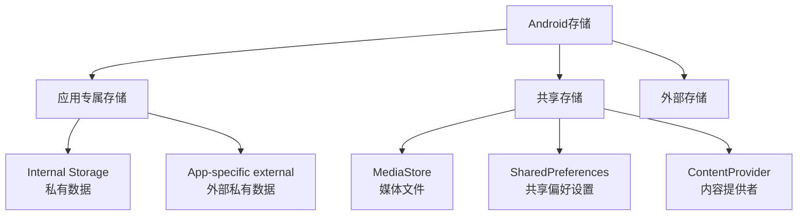

# 1.1.1 春湖边的数据宝箱

春天的湖边，冰雪刚刚消融，湖水清澈见底。露营编程旅团的姑娘们在这里迎来了新成员——洛芙。

“欢迎加入露营编程旅团！”伊莎笑着说，“我们今天是春季第一次露营，也是洛芙的第一课！”

洛FR背着新背包，眼睛里闪烁着好奇的光芒：“姐姐们，我们要学什么呢？”

“我们来学Android开发中最重要的话题之一——数据存储。”黛琳说道，她找了一块平坦的石头坐下，“就像露营需要带合适的装备一样，开发App也需要选择合适的数据存储方式。”

## 1.1.1.1 为什么需要数据存储

“你们想过没有，”黛琳抛出一个问题，“为什么App需要存储数据？”

“因为...不然每次打开App数据都没了？”洛FR猜测道。

“对！”黛琳打了个响指，“就像我们露营时要把食物保存在帐篷里，而不是每次吃饭都现找。App也需要'存放数据的地方'。”

她继续说道：“用户下次打开App时，期望看到之前保存的设置、登录状态、浏览记录...这些都离不开数据存储。”

## 1.1.1.2 Android的存储位置

“在Android中，数据可以存放在几个不同的地方，”黛琳在地上画了起来。



“你们看，”黛琳指着图解释道，“Android把存储分成几大块。”

**1. 应用专属存储（App-specific storage）**
- 只能你的App访问
- 卸载App时会被删除
- 适合存放App的私有数据

**2. 共享存储（Shared storage）**
- 可以被其他App访问
- 适合存放需要分享的文件

**3. 外部存储**
- 可移动的SD卡等
- 需要申请权限

## 1.1.1.3 选择存储方式的依据

“那我该怎么选择呢？”洛FR问。

“这是个好问题，”黛琳说道，“选择存储方式要考虑几个因素。”

| 因素 | 问题 |
|------|------|
| 数据类型 | 是设置？文件？数据库？ |
| 访问权限 | 只有自己用？还是需要分享？ |
| 数据大小 | 少量数据还是大量文件？ |
| 生命周期 | 临时还是长期保存？ |

“简单来说，”黛琳总结道：
- **简单设置** → SharedPreferences
- **结构化数据** → Room数据库
- **私有文件** → 应用专属存储
- **需要分享的文件** → 共享存储

## 1.1.1.4 各存储方式的特点

伊莎插嘴道：“让我来补充几个常见的存储方式！”

**SharedPreferences**
```kotlin
// 保存简单设置
val prefs = getSharedPreferences("settings", MODE_PRIVATE)
prefs.edit().putString("username", "洛芙").apply()

// 读取
val name = prefs.getString("username", "")
```

**Room数据库**
```kotlin
// 定义实体
@Entity
data class User(val name: String, val age: Int)

// 增删改查
userDao.insert(User("洛芙", 18))
```

**应用专属文件**
```kotlin
// 保存文件
val file = File(context.filesDir, "data.txt")
file.writeText("Hello")

// 读取
val content = file.readText()
```

## 1.1.1.5 存储的安全考虑

“还有一点很重要，”黛琳表情变得认真起来，“就是数据安全。”

“在Android 10之后，Google引入了Scoped Storage（分区存储），”她继续说道，“简单来说，就是让每个App只能访问自己的数据，保护用户隐私。”

```kotlin
// 不要直接访问外部存储
// ❌ 错误方式
val externalFile = File("/storage/emulated/0/MyApp/data.txt")

// ✅ 正确方式：使用应用专属存储
val internalFile = File(context.filesDir, "data.txt")
```

---

## 1.1.1.6 专业技术总结

本章我们学习了Android数据存储的基本概念。

**核心要点：**

1. **数据存储是App的基础** - 用户期望数据持久化
2. **三种主要存储位置** - 应用专属、共享、外部
3. **根据需求选择** - 数据类型、访问权限、大小、生命周期
4. **常见存储方式** - SharedPreferences、Room、文件
5. **注意安全** - 遵循Scoped Storage规则

**选择指南：**

| 场景 | 推荐方式 |
|------|---------|
| 简单设置 | SharedPreferences |
| 结构化数据 | Room |
| 私有文件 | filesDir |
| 缓存文件 | cacheDir |
| 共享媒体 | MediaStore |
| 共享文档 | SAF |

---

> **学习建议**
> 
> 1. 了解每种存储方式的特点
> 2. 思考不同场景下应该如何选择
> 3. 关注Android版本对存储的影响
> 4. 下一章我们将学习应用专属存储

---

## 洛芙的小小日记本

> 今天学会啦！原来Android有这么多存储方式，就像露营有不同的装备。春天来了，桃花开得好美呀！🌸📱
