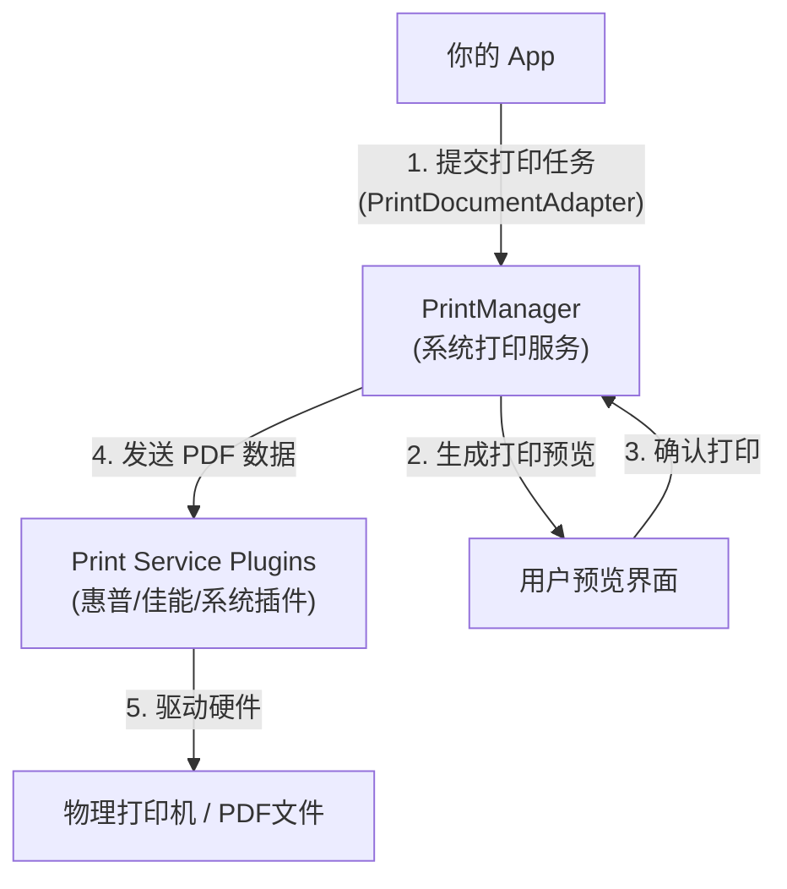
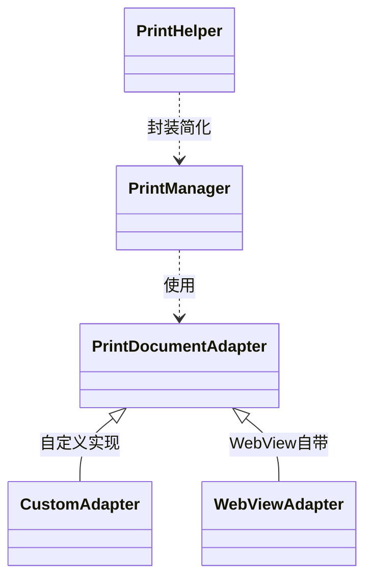

# 1.10.1 关于文件打印

## 1.10.1 从屏幕到纸张的魔法

营地的活动室被布置成了一个临时的暗房。窗帘拉得严严实实，只留下一盏红色的安全灯。空气中弥漫着显影液那种特殊的酸涩味道。

洛芙把一张刚刚显影的照片用夹子夹在绳子上。照片上是那晚的篝火，虽然是在纸上，但那些跳动的火苗仿佛依然有温度。

"有时候，"伊莎站在红色的暗光里，声音变得有些迷离，"仅仅把记忆留在屏幕上是不够的。你需要把它变成实实在在的物质，握在手里，贴在墙上，或者夹进日记本里。"

"这就是打印的意义。"黛琳推开门走了进来，手里拿着一叠打印纸。外面的强光瞬间涌入，让习惯了红光的洛芙眯起了眼睛。

"在 Android 世界里，打印不仅仅是连接一台惠普或佳能打印机那么简单。"黛琳关上门，打开了正常的照明灯。"它是一个完整的框架——把你的数据（图片、HTML、或者自定义绘图）转换成打印机能理解的语言（PDF）。"

### Android 打印架构

希尔把一张图纸贴在白板上。

> 图 1：Android 打印架构。App 不直接和打印机对话，而是通过 PrintManager 和 PrintDocumentAdapter。

"你看，"希尔指着中间的 `PrintManager`。"你不需要知道用户家里用的是什么牌子的打印机，也不需要写驱动程序。你只需要负责**生成内容**。"

"怎么生成？"洛芙问。

"通过 `PrintDocumentAdapter`。"黛琳解释道。"它是你和打印系统之间的翻译官。系统问你：'这一页长什么样？'，你就通过 Adapter 告诉它。"

### 三种打印方式

伊莎把三样东西放在桌子上：一张照片，一份网页截图，和一支画笔。

1. **打印照片 (`PrintHelper`)**
   "这是最简单的。"伊莎拿起照片。"如果你只是想打印一张 Bitmap，Android 提供了 `PrintHelper` 类。它不仅仅是打印，还能自动处理缩放、居中、甚至色彩模式（彩色/黑白）。代码少得可怜。"

2. **打印 HTML (`WebView`)**
   "如果你想打印一份复杂的报表，"伊莎拿起网页截图，"最简单的办法是把它写成 HTML，然后用 `WebView` 加载。`WebView` 自带了一个强大的 `PrintDocumentAdapter`，可以把网页直接转成打印稿。"

3. **自定义打印 (`PrintDocumentAdapter`)**
   "如果你想要极致的控制，"伊莎拿起画笔，"比如把发票的每一条线、每一个字都精确地画在 A4 纸的一定位置上，那你就得自己写 Adapter。你需要用 `Canvas` 去绘制 PDF 的每一页。"

### 打印的仪式感

"听起来……如果不算自定义的话，好像并不难？"洛芙试探着问。

"代码确实不难。"黛琳点头。"难的是**仪式感**。"

"仪式感？"

"一旦按下了打印键，数据就离开了数字世界，变成了物理实体。"黛琳看着挂在绳子上的那张照片。"你不能撤回，不能修改，不能动态刷新。所以，在按下那个按钮之前，仅仅是'预览'这一步，就充满了敬畏。"

"而且，"希尔冷不丁地补充道，"纸是很贵的。墨盒更贵。如果你的 App 打印出来的东西乱七八糟，用户会恨死你的——因为你浪费了他们的真金白银。"

洛芙看着绳子上的照片。那是她第一次觉得，原来 App 里的数据也可以这么"重"。它不再是 0 和 1 的电流，它变成了纸张的纹理，变成了墨水的每一滴渗透。

"好了，"希尔拍了拍手。"暗房体验结束。准备好去写代码，把你的数据变成墨水了吗？"

---

### 技术总结

> **关于文件打印 (Printing files)** —— Android 提供了统一的打印框架 (`PrintManager`)。应用通过提供 `PrintDocumentAdapter` 生成打印内容（PDF）。对于常见场景，可以使用 `PrintHelper`（打印图片）或 `WebView`（打印 HTML）来简化开发。自定义打印则需要通过复写 `onWrite` 和 `onLayout` 方法直接绘制 PDF。

#### 今日关键词

1. **PrintManager**：系统服务，负责管理打印任务、连接打印服务插件。
2. **PrintDocumentAdapter**：核心抽象类，用于生成打印内容。包含 `onLayout`（计算页数和大小）和 `onWrite`（绘制内容到 PDF）。
3. **PrintHelper**：androidx 提供的工具类，专门用于快速打印 Bitmap。
4. **WebView.createPrintDocumentAdapter()**：将 HTML 网页转换为打印适配器的捷径。
5. **PDF**：Android 打印系统的通用中间格式。所有内容最终都会被转换为 PDF 传递给打印服务。

#### 结构图

#### 设计哲学：解耦

Android 打印框架的核心是**解耦**。
App 只负责生成 PDF（内容）。
Android 系统负责 UI 交互（预览、选打印机、设置纸张）。
打印机厂商（HP、Epson 等）负责底层的打印服务插件。
三者各司其职，App 开发者不需要关心硬件细节。

---

#### 🏕️ 动手练习

#### 面试热身

1. **Q1**：Android 打印框架的核心类是什么？它负责什么？
2. **Q2**：`PrintDocumentAdapter` 的 `onLayout` 和 `onWrite` 分别在什么时候被调用？
3. **Q3**：如果要打印一张 Bitmap，最简单的方法是什么？
4. **Q4**：为什么说 PDF 是 Android 打印系统的通用语言？
5. **Q5**：WebView 可以用来打印吗？它的原理是什么？

---

> 💡 打印是 App 与现实世界的接口。当用户决定打印你的内容，说明这份内容值得被物理保存。

---

### 🍭 洛芙的小小日记本

今天在暗房里待了一下午。看着那些显影液里的影像慢慢浮现，我突然明白了黛琳说的"仪式感"。我们在屏幕上滑动得太快了，以至于忘记了信息的重量。打印让我慢了下来。当我把一张代码生成的图片变成真正的照片握在手里时，那种感觉……就像是我的代码终于在这个世界上留下了实实在在的痕跡。
