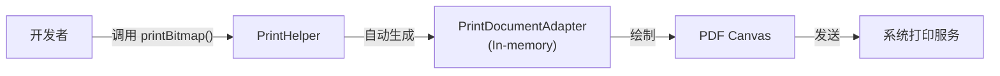

# 1.10.2 打印照片

## 1.10.2 凝固时间的机器

午后的阳光懒洋洋地洒在野餐垫上，旁边的便携式打印机发出轻微的"嗡嗡"声，像一只正在打盹的蜜蜂。一张刚才在溪边拍的合影正缓慢地从出纸口吐出来。

"如果只想打印一张照片，"希尔拿起那张还散发着温热墨香的相纸，"能不能别搞那么复杂的 Adapter？我不想算坐标，也不想画 Canvas。"

黛琳从背包里拿出一瓶冰镇柠檬水，拧开盖子，气泡"嘶"地一声冒了出来。"当然可以。Android 提供了一个专门的工具人——`PrintHelper`。"

"它就像那种傻瓜相机，"伊莎补充道，"你只需要给它一张图片，剩下的缩放、排版、驱动打印机，它全包了。"

### 极简的 PrintHelper

洛芙打开电脑，在树荫下敲下了一行代码。

```kotlin
// 1. 获取 PrintHelper 实例
val photoPrinter = PrintHelper(context)

// 2. 设置缩放模式 (ScaleMode)
// 有两种模式：FIT (适应纸张) 和 FILL (填满纸张)
photoPrinter.scaleMode = PrintHelper.SCALE_MODE_FIT

// 3. 开始打印
// bitmap 是你想要打印的图片对象
val bitmap = BitmapFactory.decodeResource(resources, R.drawable.our_camp_memory)
photoPrinter.printBitmap("My Camp Photo", bitmap)
```

"就这三行？"洛芙惊讶地眨了眨眼。一阵风吹过，卷起几片落叶落在键盘上。

"就这三行。"黛琳点头。"当你调用 `printBitmap` 后，系统会直接弹出打印预览界面。用户选打印机，点确认，结束。"

### 缩放模式的选择

"那个 `scaleMode` 有什么讲究吗？"洛芙指着第二行代码。

希尔拿起两块饼干和两个不同大小的盘子。

"看，"她把一块圆形饼干放在一个长方形盘子里。"这就是 `SCALE_MODE_FIT`。饼干（图片）完整地保留了下来，但盘子（纸张）两边会有留白。"

接着，她把另一块大饼干强行塞进一个小盘子，掰掉了边缘多余的部分，让饼干填满了整个盘底。

"这就是 `SCALE_MODE_FILL`。图片会填满整个纸张，不留白边，但图片的上下或左右边缘会被裁掉。"

洛芙若有所思地点点头。"风景照适合 FILL，更有沉浸感；但是合影……如果用了 FILL，站在边上的希尔可能就被裁掉了。"

"喂！"希尔抗议道，但我看她其实挺开心的。

### 打印机里的"黑箱"

"虽然这类代码简单，"黛琳的声音变得严谨起来，"但你要知道 PrintHelper 在后台做了什么。它其实是自动帮你生成了一个 `PrintDocumentAdapter`，并在 `onLayout` 里计算图片大小，在 `onWrite` 里把 Bitmap 画到了 PDF 的 Canvas 上。"

洛芙看着打印机吐出的第二张照片。那是她们三个人的笑脸，在阳光下显得格外灿烂。

"虽然我不懂那些复杂的 PDF 绘制指令，"洛芙笑着说，"但 `PrintHelper` 帮我留住了这一刻。"

---

### 技术总结

> **打印照片 (Printing photos)** —— 使用 `androidx.print.PrintHelper` 可以极简地实现图片打印。核心方法是 `printBitmap(jobName, bitmap)`。通过 `setScaleMode()` 可以控制图片是适应纸张 (`SCALE_MODE_FIT`) 还是填满纸张 (`SCALE_MODE_FILL`)。这是打印单张即时图片的首选方案。

#### 今日关键词

1. **PrintHelper**：AndroidX 提供的图片打印工具类。
2. **SCALE_MODE_FIT**：完整显示图片，纸张可能留白。
3. **SCALE_MODE_FILL**：填满纸张，图片边缘可能被裁剪。
4. **Bitmap**：打印的数据源必须是 Bitmap 对象。

#### 结构图



#### 反模式与陷阱

1. **在主线程加载大图**：`BitmapFactory.decodeResource` 如果图片过大，会阻塞 UI 甚至 OOM。
   * **修复**：在后台线程加载 Bitmap，确保存活后再调用打印。
2. **忘记回收 Bitmap**：图片打印完成后，原始的 Bitmap 对象如果不及时 `recycle()`，可能导致内存泄漏（虽然 PrintHelper 内部会处理它的副本，但你的源对象还得你自己管）。

---

#### 🏕️ 动手练习

#### Task 1 · 打印你的 Logo ★

**目标**：使用 PrintHelper 打印一张资源图片。

**你需要做的事**：
1. 准备一张小的 Logo 图片放在 `res/drawable`。
2. 在 Activity 里用 `BitmapFactory` 解码它。
3. 创建 `PrintHelper` 并打印。

**验收标准**：
- [ ] 点击按钮后弹出系统打印预览
- [ ] 预览中能看到 Logo

#### Task 2 · 体验裁切 ★★

**目标**：对比 FIT 和 FILL 的区别。
**你需要做的事**：
1. 准备一张长宽比和 A4 纸（约 1:1.414）差异很大的图片（比如正方形）。
2. 分别设置 `SCALE_MODE_FIT` 和 `SCALE_MODE_FILL` 进行打印预览。
3. 观察预览界面的区别。

**验收标准**：
- [ ] 清楚看到 FIT 有留白，FILL 被裁切

#### Task 3 · 打印回调 (进阶) ★★★

**目标**：监听打印任务的完成。

**你需要做的事**：
1. `printBitmap` 有一个重载版本接受 `OnPrintFinishCallback`。
2. 传入一个回调，在打印界面关闭后弹出一个 Toast："打印结束（在这个阶段其实不知道是成功还是取消）"。

**验收标准**：
- [ ] 打印/取消后能收到回调通知

---

#### 面试热身

1. **Q1**：`PrintHelper` 是为了解决什么问题而设计的？
2. **Q2**：`SCALE_MODE_FIT` 和 `SCALE_MODE_FILL` 的本质区别是什么？
3. **Q3**：为什么不能直接传一个图片 URI 给 PrintHelper？（提示：API 限制，它只收 Bitmap，你需要自己把 URI 转成 Bitmap）
4. **Q4**：`printBitmap` 方法会阻塞主线程吗？（提示：会启动 UI，但生成 PDF 的过程是在系统服务中异步进行的）
5. **Q5**：如果我想打印多张照片在同一页，`PrintHelper` 能做到吗？（提示：不能，它是一张图一页。如果要拼图，得自己先在 Canvas 上把图拼成一个大 Bitmap，或者用自定义 Adapter）

---

### 🍭 洛芙的小小日记本

今天用 `PrintHelper` 打印了第一张照片。看着屏幕上的像素点变成纸上的墨迹，这种感觉真奇妙。代码不仅仅是逻辑的堆砌，它也可以是连接数字记忆和物理世界的桥梁。伊莎说得对，有时候，只有摸得到的记忆，才算数。
