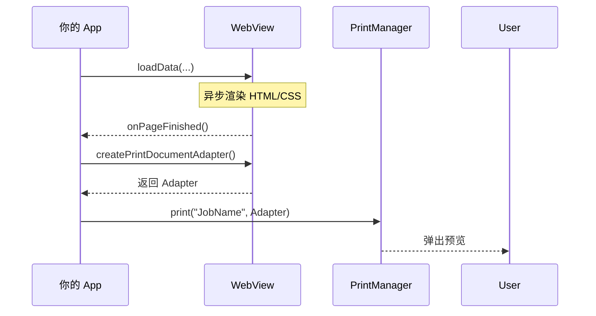

# 1.10.3 打印 HTML 文档

## 1.10.3 像印刷报纸一样

伊莎捧着一杯热腾腾的姜茶，看着洛芙在笔记本上排版明天的"露营菜单"。

"如果我想把这张菜单打印出来，或者更复杂一点——把我们这一周的开销账单打印成一份漂亮的报表，"伊莎吹了吹茶杯上的热气，"用画 Bitmap 的方式会不会太累了？你需要计算每一行字的高度，每一条横线的位置……"

"那简直是噩梦。"洛芙打了个寒战，想起了以前用尺子画表格被墨水弄脏手指的日子。

"所以，如果你已经会写 HTML 和 CSS，"黛琳从背包里拿出一张折叠得整整齐齐的旧报纸，"为什么不利用它们呢？Android 的 WebView 引擎不仅仅是个浏览器，它还是个极其出色的排版工。"

### WebView 的隐藏技能

"HTML 负责结构，CSS 负责美化。"希尔指着屏幕上的代码。"这一套逻辑在 Web 开发里用了几十年了，极其成熟。你想让标题居中、想让表格带条纹、想让字体变红——几行 CSS 就搞定。然后，把这一整坨 HTML 扔给 `WebView`，让它帮你生成打印稿。"

```kotlin
class PrintHtmlActivity : AppCompatActivity() {

    private var myWebView: WebView? = null

    private fun doWebViewPrint() {
        // 1. 创建即用即抛的 WebView 实例
        val webView = WebView(this)
        webView.webViewClient = object : WebViewClient() {

            override fun onPageFinished(view: WebView, url: String) {
                // 3. 页面加载完成后，立刻发起打印
                createWebPrintJob(view)
                // 打印任务提交后 webView 就不再需要了，设为 null 帮助回收
                myWebView = null
            }
        }

        // 2. 加载一段 HTML 字符串
        val htmlDocument = """
            <html>
                <body>
                    <h1>露营菜单</h1>
                    <p>早餐：培根煎蛋 + 热可可</p>
                    <p>午餐：三明治 + 苹果</p>
                    
                </body>
            </html>
        """
        
        // baseUrl 设为 null 意味着不支持加载相对路径资源（除非那是 assets 里的）
        webView.loadDataWithBaseURL(null, htmlDocument, "text/HTML", "UTF-8", null)
        
        // 持有引用防止在加载完成前被 GC 回收
        myWebView = webView
    }

    private fun createWebPrintJob(webView: WebView) {
        // 4. 获取打印适配器
        val printAdapter = webView.createPrintDocumentAdapter("MyMenu Document")
        
        // 5. 提交给 PrintManager
        val printManager = getSystemService(PRINT_SERVICE) as PrintManager
        printManager.print("MyMenu_Job", printAdapter, PrintAttributes.Builder().build())
    }
}
```

### 为什么还要等 `onPageFinished`？

洛芙指着第一步的代码。"为什么不能直接 `loadData` 后马上 `print`？"

"因为 WebView 渲染是异步的。"伊莎解释道，她的声音像是在讲一个关于时间的故事。"就算只有几行字，WebView 也需要时间去排版、去解析 CSS。如果你在它还没画完的时候就喊'打印！'，那就像是……"

"在蛋糕还没进烤箱的时候就拿出来吃了。"希尔抢答道，手里还拿着那一半饼干。

"没错。一片空白。"黛琳点头。"所以必须在 `onPageFinished` 回调里，确保一切就绪了，再生成 `PrintDocumentAdapter`。"

### 如何处理图片？

"那个 `` 标签引用的图片怎么办？"洛芙问。"如果它是网络图片呢？"

"如果是网络图片，"希尔说，"那加载时间就更长了。而且要注意，如果你的 WebView 本身没有网络权限，或者图片太大加载失败，打印出来就是个破碎的图标。"

"通常为了稳定，"黛琳建议道，"我们会把图片转换成 Base64 嵌入在 HTML 里，或者放在 `assets` 目录里并通过 `file:///android_asset/` 引用。这样能保证打印出来的内容永远是完整的。"

窗外的夕阳把帐篷染成了金色。洛芙看着屏幕上那份排版精美的菜单，HTML 和 CSS 的力量让枯燥的数据瞬间有了呼吸。

"不仅如此，"伊莎补充道，"你还可以用 CSS 的 `@media print` 规则来专门控制打印样式。比如屏幕上显示深色模式，打印时自动变成省墨的黑白模式。这才是真正的魔法。"

---

### 技术总结

> **打印 HTML 文档 (Printing HTML documents)** —— 利用 `WebView` 加载 HTML/CSS 内容，然后通过 `webView.createPrintDocumentAdapter()` 生成打印任务。这是处理复杂排版（表格、图文混排）最高效的方式。必须注意在 `onPageFinished` 回调中执行打印，以确保内容渲染完毕。

#### 今日关键词

1. **WebView**：不仅是浏览器控件，也是强大的 PDF 生成器。
2. **loadDataWithBaseURL**：加载 HTML 字符串并指定 BaseURL（用于解析相对路径）。
3. **createPrintDocumentAdapter**：WebView 的核心方法，一键生成适配器。
4. **onPageFinished**：关键回调。不能在加载完成前打印。

#### 结构图



#### 反模式与陷阱

1. **提前打印**：在 `loadData` 后紧接着调用 `createPrintDocumentAdapter`。
   * **后果**：打印出一张白纸。
   * **修复**：必须在 `WebViewClient.onPageFinished` 里调用。
2. **WebView 被回收**：WebView 是一个很重的对象。如果是局部变量，且在回调回来之前被 GC 回收了，回调就不会执行。
   * **修复**：在 Activity 级别持有 WebView 的引用（如 `myWebView` 成员变量），直到打印任务提交后再置空。

---

#### 🏕️ 动手练习

#### Task 1 · 打印一份简历 ★

**目标**：用 HTML 编写一份简单简历并打印。

**你需要做的事**：
1. 写一段 HTML 字符串（包含 `<h1>姓名</h1>`，`<p>技能：Anroid</p>`）。
2. 用 WebView 加载它。
3. 在回调里调用打印。

**验收标准**：
- [ ] 打印预览中能看到正确格式化的简历

#### Task 2 · 引入 CSS ★★

**目标**：美化你的简历。

**你需要做的事**：
1. 在 HTML 的 `<head>` 里加 `<style>`。
2. 设置 `h1 { color: red; }`。
3. 再次打印。

**验收标准**：
- [ ] 预览中的标题变红了（如果打印机支持彩色）

#### Task 3 · 打印 Asset 图片 (进阶) ★★★

**目标**：打印本地资源图片。

**你需要做的事**：
1. 把一张 `logo.png` 放在 `assets/` 目录。
2. 在 HTML 里写 ``。
3. `loadDataWithBaseURL` 的第一个参数传入 `"file:///android_asset/"`。

**验收标准**：
- [ ] 打印出来的页面包含图片

---

#### 面试热身

1. **Q1**：为什么一定要在 `onPageFinished` 里执行打印？
2. **Q2**：`loadData` 和 `loadDataWithBaseURL` 有什么关键区别？（提示：处理相对路径资源的能力）
3. **Q3**：如果我想隐藏网页上的"打印"按钮，不让它出现在打印纸上，怎么做？（提示：CSS `@media print { .btn-print { display: none; } }`）
4. **Q4**：WebView 在打印时支持 JavaScript 吗？（提示：支持，但在打印快照生成的那一刻，JS 改变的 DOM 会被捕获）
5. **Q5**：这种方法的缺点是什么？（提示：WebView 组件很重，消耗内存大，不适合极其频繁的后台批量打印）

---

### 🍭 洛芙的小小日记本

今天把写在 HTML 里的"露营计划"打印出来了。看着那些原本只存在于代码里的 `<p>` 和 `<div>` 变成了纸上整齐的文字，突然觉得 Web 技术和 Android 其实是一家人。它们都在努力把信息变得更好看、更易读。伊莎说，技术没有高低之分，只有"适合"与"不适合"。用来排版，WebView 就是最棒的艺术家。
