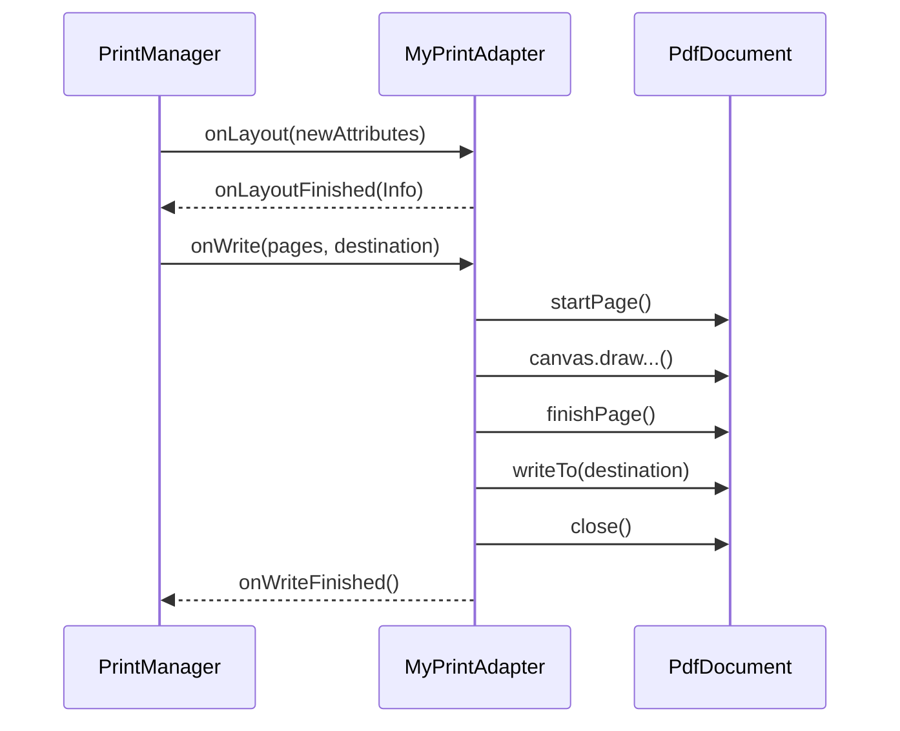

# 1.10.4 打印自定义文档

## 1.10.4 手绘 PDF 的艺术家

夜深了，帐篷里的煤油灯光调到了最暗。大家围坐在一起，面前摊开着一张复杂的营地规划图。

"有时候，"伊莎用铅笔在图纸上勾勒出一条完美的弧线，"那些自动化的工具（PrintHelper, WebView）都救不了你。比如这张图，每一棵树的位置、每一条路径的长度，都需要精确到毫米。而且，我要在这个角落画一个 Logo，在那个角落写上今天的日期。"

"这时候，"黛琳接过话，把一本画册推到洛芙面前。"你就需要亲自拿起画笔。在 Android 里，这叫 **自定义 PrintDocumentAdapter**。"

"听起来像是个大工程。"洛芙看着那密密麻麻的网格纸。

"确实。但它是唯一能给你**像素级控制权**的方法。"希尔说。"你不再是告诉打印机'打印这张图'，而是告诉它：'在坐标 (100, 200) 画一条线，在坐标 (300, 400) 写个字'。"

### 核心：PrintDocumentAdapter

"我们要继承 `PrintDocumentAdapter`，"黛琳打开了一个新的 Kotlin 文件，"这个类有两个必须要实现的方法：`onLayout` 和 `onWrite`。"

#### Step 1: onLayout (计算图纸)

"首先是 `onLayout`。"伊莎解释道。"当用户改变了打印设置（比如从 A4 变成了 B5，或者从竖向变成了横向），系统就会问你：'在新的纸张大小下，你打算画几页？每页多大？'"

```kotlin
override fun onLayout(
    oldAttributes: PrintAttributes?,
    newAttributes: PrintAttributes,
    cancellationSignal: CancellationSignal?,
    callback: LayoutResultCallback?,
    extras: Bundle?
) {
    // 1. 响应取消操作
    if (cancellationSignal?.isCanceled == true) {
        callback?.onLayoutCancelled()
        return
    }

    // 2. 计算页数（这里假设只有1页）
    val info = PrintDocumentInfo.Builder("MyizeCampPlan.pdf")
        .setContentType(PrintDocumentInfo.CONTENT_TYPE_DOCUMENT)
        .setPageCount(1) // 如果不确定，可以填 UNKNOWN_PAGE_COUNT
        .build()

    // 3. 告诉系统：准备好了
    // 如果布局其实没变（newAttributes == oldAttributes），可以用 false 优化
    callback?.onLayoutFinished(info, true)
}
```

"看，这就像是建筑师在画草图前的测量。"希尔指着 `newAttributes`。"你得知道纸有多大，才能决定画什么。"

#### Step 2: onWrite (下笔绘制)

"然后是重头戏 `onWrite`。"黛琳的声音变得专注。"系统会给你一个真实的文件描述符（FileDescriptor），你需要把内容画进去。在 Android 里，就是画在一个 PDF 的 Canvas 上。"

```kotlin
override fun onWrite(
    pages: Array<out PageRange>?,
    destination: ParcelFileDescriptor?,
    cancellationSignal: CancellationSignal?,
    callback: WriteResultCallback?
) {
    // 1. 创建 PdfDocument 实例
    val pdfDocument = PdfDocument()

    try {
        // 2. 开始第一页
        // pageInfo 需要从 onLayout 里存下来的属性里获取
        val pageInfo = PdfDocument.PageInfo.Builder(595, 842, 1).create() // A4 尺寸示例
        val page = pdfDocument.startPage(pageInfo)

        // 3. 获取 Canvas 并绘制！
        val canvas = page.canvas
        
        // 就像画自定义 View 一样
        val paint = Paint().apply { color = Color.BLACK; textSize = 30f }
        canvas.drawText("营地规划图 v1.0", 50f, 50f, paint)
        canvas.drawRect(100f, 100f, 300f, 300f, paint) // 画个帐篷位置
        
        // 4. 结束这一页
        pdfDocument.finishPage(page)

        // 5. 写入文件流
        FileOutputStream(destination?.fileDescriptor).use { out ->
            pdfDocument.writeTo(out)
        }

        // 6. 报告成功
        callback?.onWriteFinished(arrayOf(PageRange.ALL_PAGES))

    } catch (e: Exception) {
        callback?.onWriteFailed(e.message)
    } finally {
        // 7. 必须关闭 document
        pdfDocument.close()
    }
}
```

洛芙看着那行 `canvas.drawText`。"竟然真的是 `Canvas`！那岂不是跟我写自定义 View 一模一样？"

"一模一样。"希尔打了个响指。"所以你以前学的 `drawCircle`、`drawPath`、`drawBitmap` 全都能用。唯一的区别是，这也是画在 PDF 页面上的，而不是屏幕像素上。"

### 严谨的艺术家

"但是要注意，"伊莎提醒道，"在这个过程里，任何时候用户都可能点击'取消'。所以你得时刻检查 `cancellationSignal.isCanceled`。如果用户不想看了，你还在那儿拼命画图，那就是在浪费电量。"

"还有，"黛琳补充道，"所有的绘制操作都应该放在后台线程，尤其是当你要画很多页或者处理大图片的时候。千万别卡住主线程 UI。"

洛芙看着屏幕上已经生成的 PDF 预览，那上面的线条清晰锐利，每一个字都精准地落在她想要的位置。这种完全掌控的感觉，就像亲自搭建一个精密的乐高城堡。

"只要你会画 Canvas，"洛芙合上电脑，满足地叹了口气，"你就能把整个世界打印下来。"

---

### 技术总结

> **打印自定义文档 (Printing custom documents)** —— 通过继承 `PrintDocumentAdapter` 实现最高的打印自由度。必须重写 `onLayout()`（计算页数和元数据）和 `onWrite()`（使用 `PdfDocument` 和 `Canvas` 绘制内容）。适用于报表、发票、填空表单等对格式要求极高的场景。

#### 今日关键词

1. **PrintDocumentAdapter**：自定义打印的核心基类。
2. **onLayout()**：响应打印属性变化（如纸张大小），计算文档信息 (`PrintDocumentInfo`)。
3. **onWrite()**：执行实际绘制。使用 `PdfDocument` 生成页面，获取 Canvas 进行绘制。
4. **CancellationSignal**：必须响应用户的取消操作。
5. **PdfDocument**：Android 用于生成 PDF 文件的类。

#### 结构图



#### 反模式与陷阱

1. **忽略 CancellationSignal**：这是最不优雅的行为。用户点取消了，App 还在后台狂算。
   * **修复**：在 `onWrite` 的关键步骤（如每一页开始前）都要检查 `isCanceled`。
2. **资源泄漏**：`PdfDocument` 用完必须 `close()`，文件流也是。
   * **修复**：使用 `try-finally` 或 `use` 块。
3. **硬编码尺寸**：假设纸张永远是 A4。
   * **修复**：在 `onLayout` 里从 `newAttributes.mediaSize` 获取真实的宽高。

---

#### 🏕️ 动手练习

#### Task 1 · 搭建 Adapter 框架 ★

**目标**：创建一个空的 `MyPrintAdapter`。

**你需要做的事**：
1. 继承 `PrintDocumentAdapter`。
2. 实现 `onLayout` 和 `onWrite`。
3. 在 `onLayout` 里简单返回一个固定页数的 Info。

**验收标准**：
- [ ] 编译通过，能被 `printManager.print` 调用

#### Task 2 · 绘制几何图形 ★★

**目标**：在 PDF 上画画。

**你需要做的事**：
1. 在 `onWrite` 里创建 `PdfDocument`。
2. 获取 Canvas。
3. 画一个红色的圆和一个黑色的矩形。
4. 写入文件。

**验收标准**：
- [ ] 打印预览里能看到红色圆圈和矩形

#### Task 3 · 响应纸张变化 (进阶) ★★★

**目标**：自适应纸张大小。

**你需要做的事**：
1. 在 `onLayout` 里读取 `newAttributes.mediaSize`。
2. 在 `onWrite` 里根据这个尺寸创建 `PageInfo`。
3. 把文字画在页面的正中间（需要计算坐标）。

**验收标准**：
- [ ] 切换 A4/B5 纸张时，预览里的文字始终居中

---

#### 面试热身

1. **Q1**：`PrintDocumentAdapter` 的生命周期是怎样的？`onLayout` 会被调用多次吗？（提示：会，每次改变设置如横竖屏、纸张大小时都会调）
2. **Q2**：`onWrite` 里的 `pages` 参数有什么用？（提示：用户可能只选了打印"第1-3页"，你只需要画这些页，不要画全部）
3. **Q3**：如何处理多页打印？（提示：循环调用 `startPage` -> `finishPage`）
4. **Q4**：`PdfDocument` 是线程安全的吗？（提示：不是。通常建议在单线程里按顺序生成页面）
5. **Q5**：自定义打印比 WebView 打印的优势在哪里？（提示：性能更好，控制更精准，无 Web 依赖）

---

### 🍭 洛芙的小小日记本

今天就像是回到了美术课。只不过我的画笔是代码，画布是 PDF。希尔说得对，当一切自动化工具都无法满足你的挑剔时，唯一的办法就是自己动手。虽然计算坐标很累，但看到每一个像素都乖乖听话的样子，这种成就感无可替代。
