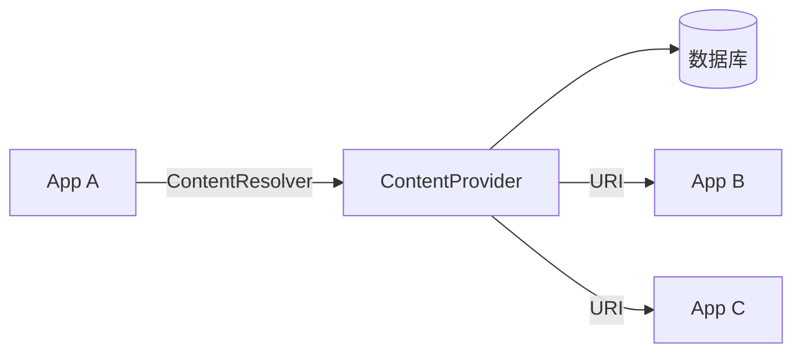

# 1.11.1 数据桥梁Content Provider

“除了文件共享，还有一种更规范的数据共享方式——Content Provider，”黛琳说道。

洛FR问：“那是什么？”

“就像一个'数据桥梁'，让不同的App可以相互访问数据，”黛琳解释道。

## 1.11.1.1 什么是Content Provider

“Content Provider是Android的四大组件之一，”黛琳介绍道，“它提供了一套标准的方法来访问应用数据。”

**常见用途：**
- 共享自己App的数据给其他App
- 访问系统数据（联系人、短信等）
- 在App内部实现数据分层

## 1.11.1.2 工作原理

“它的原理是这样的，”黛琳画图解释。



**数据通过URI来标识：**
```
content://com.example.provider/users/1
    │        │              │
    │        │              └── 表名/ID
    │        └── Authority（授权）
    └── 协议头
```

## 1.11.1.3 系统提供的Provider

“Android系统提供了很多Content Provider，”黛琳列举道。

| Provider | URI | 用途 |
|----------|-----|------|
| ContactsContract | content://contacts/ | 联系人 |
| MediaStore | content://media/ | 媒体文件 |
| CalendarContract | content://calendar/ | 日历 |
| CallLog | content://call_log/ | 通话记录 |

```kotlin
// 访问联系人
val cursor = contentResolver.query(
    ContactsContract.Contacts.CONTENT_URI,
    arrayOf(ContactsContract.Contacts._ID, 
            ContactsContract.Contacts.DISPLAY_NAME),
    null, null, null
)
```

## 1.11.1.4 自定义Provider

“如果要共享自己App的数据，可以自定义Provider，”黛琳继续说道。

```kotlin
class MyProvider : ContentProvider() {
    
    override fun onCreate(): Boolean {
        return true
    }
    
    override fun query(uri: Uri, projection: Array<String>?, 
                       selection: String?, selectionArgs: Array<String>?,
                       sortOrder: String?): Cursor? {
        // 查询数据
    }
    
    override fun insert(uri: Uri, values: ContentValues?): Uri? {
        // 插入数据
    }
    
    override fun update(uri: Uri, values: ContentValues?, 
                       selection: String?, selectionArgs: Array<String>?): Int {
        // 更新数据
    }
    
    override fun delete(uri: Uri, selection: String?, 
                       selectionArgs: Array<String>?): Int {
        // 删除数据
    }
    
    override fun getType(uri: Uri): String {
        // 返回MIME类型
    }
}
```

---

## 1.11.1.5 专业技术总结

本章我们学习了Content Provider。

**核心要点：**

1. **Content Provider是数据共享机制** - Android四大组件之一
2. **通过URI访问** - content://schema/authority/path
3. **标准CRUD操作** - query、insert、update、delete
4. **系统提供很多Provider** - 联系人、媒体、日历等
5. **可以自定义Provider** - 共享自己App的数据

**URI格式：**

```
content://authority/path/id
```

---

> **学习建议**
> 
> 1. 理解URI的结构
> 2. 学习使用系统Provider
> 3. 下一章学习Provider基础
> 4. 考虑是否真的需要自定义Provider

---

## 洛芙的小小日记本

> Content Provider好像一个"数据桥梁"，让App之间可以相互访问数据。春天🌸的花瓣飘呀飘～
