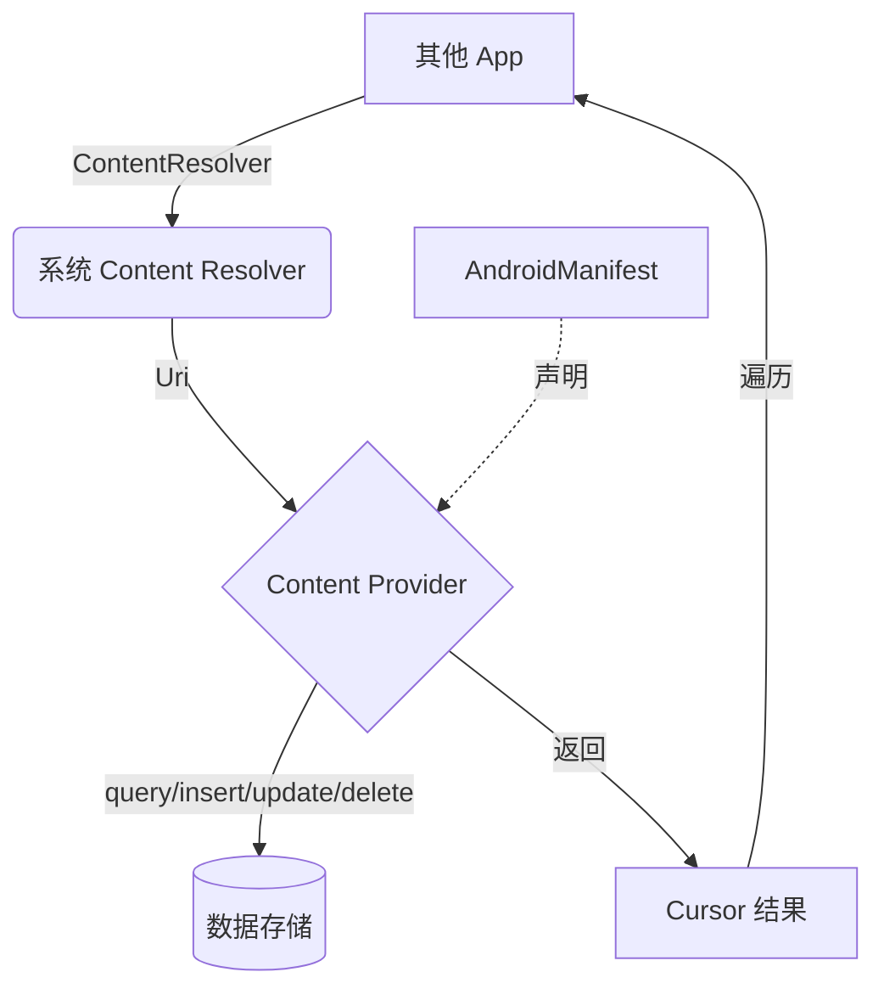

# 1.11.1 关于 Content Provider

“嗒、嗒、嗒——”

雨点打在帐篷顶上，洛芙蜷缩在睡袋里，怀里抱着温热的保温杯。外面雨下得很大，营地的排水沟已经变成了小溪。

“这种天气最适合讲故事了。”伊莎轻声说，拨了拨酒精灯，火苗跳了一下，照亮了四张专注的脸。

黛琳正在白板上画一个奇怪的圆圈图：“今天我们讲一个很特别的东西——Content Provider。”

“提供者？”洛芙歪着头，“给谁提供？”

“给你手机里的其他应用。”黛琳说，“想象一下，你的露营日记应用里记录了很多地点、天气，日记——这时候，别的应用说'让我看看你的日记吧'，你应该怎么回答？”

“才不要随便给别人看！”洛芙摇头。

希尔笑了：“所以咯，Content Provider 就是那个'守门人'。它来决定：谁可以看，看多少、什么时候看。”

---

### Content Provider 是什么

雨声渐渐小了，远处的山林被洗得发亮。

“简单说，”黛琳画完图转过身来，“Content Provider 就是数据共享的桥梁。”

她指向白板：

```
┌─────────────────────────────────────────┐
│            你的 App（数据拥有者）        │
│  ┌─────────────────────────────────┐  │
│  │       Content Provider          │  │
│  │  "我有一些数据，谁要？"         │  │
│  └─────────────────────────────────┘  │
└──────────────────┬──────────────────────┘
                   │ 标准接口
                   ▼
┌─────────────────────────────────────────┐
│           其他 App（数据请求者）          │
│  "我要查天气/我要读联系人"             │
└─────────────────────────────────────────┘
```

“Content Provider 像什么？”伊莎问。

“像——”希尔想了想，“像便利店的透明玻璃柜。顾客只能看到店员展示出来的东西，而且必须通过柜台，不能自己动手拿。”

“也像图书馆的借阅系统，”黛琳补充，“你不能直接闯进书库搬书，必须通过管理员，登记、预约、限时归还。”

洛芙明白了：“所以它是'有管理的共享'？”

“对，”黛琳微笑，“这是 Android 系统里最安全的跨应用数据共享方式。”

---

### 为什么要用 Content Provider

雨停了，山林里弥漫着泥土和青草的清香。

“最大的好处是——”黛琳竖起手指，“你不需要知道数据存在哪里、怎么存。Content Provider 统一了访问方式。”

她举例：

- 通讯录：Google 官方的 Content Provider，所有 app 都能通过它读取联系人
- 日历：系统日历的 Content Provider
- 媒体库：图片/视频/音频的 Content Provider

“这就是为什么你下载一个'通讯录备份 app'，它就能读取你的联系人——因为系统在背后提供了统一的 Content Provider 接口。”

洛芙想象着：“就像……所有露营营地都有同一个'物资申领窗口'？不管哪个营地，拿东西的流程都一样？”

“完全正确。”黛琳点头。

---

### Content Provider 的四大金刚

希尔把电脑转过来，屏幕上是一个简单的结构图：

```kotlin
// Content Provider 的四个核心方法，就像四个看门守卫

class CampDataProvider : ContentProvider() {

    // 1. 查询数据
    // 相当于：图书馆管理员说"让我找找这本书"
    override fun query(
        uri: Uri,           // 要查询的东西的"地址"
        projection: Array<out String>?,  // 要哪些字段（列）
        selection: String?,  // 筛选条件（WHERE）
        selectionArgs: Array<out String>?,  // 筛选条件的值
        sortOrder: String?  // 排序方式
    ): Cursor? {
        // 返回一个"游标"，像书单一样，一行一行给你数据
        return null
    }

    // 2. 插入数据
    // 相当于：读者"我想捐一本书"
    override fun insert(uri: Uri, values: ContentValues?): Uri? {
        // 返回新数据的"地址"（Uri）
        return null
    }

    // 3. 更新数据
    // 相当于：图书馆管理员"这本书被借走了，更新状态"
    override fun update(
        uri: Uri,
        values: ContentValues?,
        selection: String?,
        selectionArgs: Array<out String>?
    ): Int {
        // 返回更新了多少行
        return 0
    }

    // 4. 删除数据
    // 相当于：图书管理员"这本书已经归还，从系统移除"
    override fun delete(uri: Uri, selection: String?, selectionArgs: Array<out String>?): Int {
        // 返回删了多少行
        return 0
    }

    // 5. 初始化（Provider 第一次被访问时调用）
    override fun onCreate(): Boolean {
        return true
    }
}
```

“哇……”洛芙看着代码，“感觉像在写一个'数据商店'的店员手册。”

“比喻很贴切，”黛琳笑了，“这四个方法就是店员要做的四件事：查、增，改、删。”

---

### Uri：数据的门牌号

“还有一个很重要的概念——Uri。”黛琳又在白板上画了一个例子：

```
content://com.campapp.provider/journal/5
│        │                    │   │
│        │                    │   └──┬─ 具体 ID（这本日记的第5篇）
│        │                    └──────┬─ 数据类型（journal 日记）
│        └───────────────────────────── 提供者域名（com.campapp.provider）
└──────────────────────────────────── 协议头（告诉系统"这是 Content Provider"）
```

“这个 Uri 就是数据的'门牌号'。”黛琳解释，“不管数据藏在哪个角落，只要给对 Uri，Provider 就能找到它。”

洛芙抢答：“就像只要知道地址，无论多远都能找到那个营地！”

“对，”黛琳微笑，“而且这个地址是系统统一的，任何 app 都能用。”

---

### ContentResolver：数据的快递员

“如果你不是数据的拥有者，而是想别人数据的那个 app——你应该怎么请求？”

洛芙摇头。

希尔递过来手机：“用 ContentResolver，就像你叫外卖，不需要知道厨房在哪、厨师是谁，你只需要告诉平台'我要一份宫保鸡丁'，平台会分配一个快递员去取。”

```kotlin
// ContentResolver：帮你"叫数据外卖"

class MyActivity : AppCompatActivity() {

    private val resolver: ContentResolver = contentResolver

    // 1. 查询数据
    // 叫一份"日记列表"
    fun queryJournals() {
        // content:// 是协议头
        // com.campapp.provider 是提供者
        // journal 是数据类型
        val uri = Uri.parse("content://com.campapp.provider/journal")

        val cursor = resolver.query(
            uri,                    // 要查询的 Uri
            null,                   // 要哪些列（null = 全部）
            "location = ?",         // 筛选条件
            arrayOf("湖畔"),        // 筛选参数
            "created_at DESC"       // 排序：最新的在前
        )

        cursor?.use {
            while (it.moveToNext()) {
                // 读取每一行
                val title = it.getString(it.getColumnIndex("title"))
                val content = it.getString(it.getColumnIndex("content"))
                Log.d("Journal", "标题: $title, 内容: $content")
            }
        }
    }

    // 2. 插入数据
    fun addJournal() {
        val uri = Uri.parse("content://com.campapp.provider/journal")

        val values = ContentValues().apply {
            put("title", "雨天的帐篷")
            put("content", "雨水打在帐篷上的声音像鼓点")
            put("location", "南山")
            put("created_at", System.currentTimeMillis())
        }

        val newUri = resolver.insert(uri, values)
        Log.d("Journal", "新日记的地址是: $newUri")
    }

    // 3. 更新数据
    fun updateJournal(id: Long) {
        val uri = Uri.parse("content://com.campapp.provider/journal/$id")

        val values = ContentValues().apply {
            put("content", "修改后的内容——雨停了，山谷里有彩虹")
        }

        val rows = resolver.update(uri, values, null, null)
        Log.d("Journal", "更新了 $rows 行")
    }

    // 4. 删除数据
    fun deleteJournal(id: Long) {
        val uri = Uri.parse("content://com.campapp.provider/journal/$id")

        val rows = resolver.delete(uri, null, null)
        Log.d("Journal", "删除了 $rows 行")
    }
}
```

伊莎轻声说：“你看，ContentResolver 做的事情很纯粹——它只是'跑腿的'。它不管数据存哪里、怎么存，它只管把你的请求送过去，然后把结果带回来。”

洛芙看着代码，若有所思：“所以如果我想让其他 app 也能读我的日记……”

“就写一个 Content Provider。”黛琳点头，“就像开一家民宿，登记一下，系统就知道怎么帮你接待客人了。”

---

### Provider 注册：开门迎客

“最后一步，”希尔说，“你的 Provider 写好了，怎么让系统知道？”

“在 AndroidManifest 里注册。”她指向配置文件：

```xml
<!-- AndroidManifest.xml -->
<manifest ... >

    <!-- 声明这是一个 Content Provider -->
    <provider
        android:name=".CampDataProvider"           <!-- Provider 的类名 -->
        android:authorities="com.campapp.provider"  <!-- 权威标识，相当于"店名" -->
        android:exported="true"                     <!-- true = 允许其他 app 访问 -->
        android:grantUriPermissions="true"           <!-- 允许临时授权 -->
    />

</manifest>
```

“exported = true 表示什么？”洛芙问。

“表示这家店是对外营业的。”希尔解释，“如果是 false，就只有你自己的 app 能访问，相当于'不公开的私人日记本'。”

黛琳补充：“exported = false 是默认推荐。除非你有充分的理由必须共享数据，否则保持最小权限原则。”

---

雨后的山谷挂着彩虹，像一座桥架在两座山之间。

“好啦，”伊莎伸了个懒腰，“今天的故事就到这里——Content Provider，就是那个帮你安全地把数据分享给其他 app 的'守门人'。”

洛芙看向窗外：“明天我们也去踩水坑吧？”

“那得先问过希尔肯不肯。”伊莎眨眼。

希尔笑着打响指：“问得好！明天我们来做实验——写一个真正的 Provider！”

黛琳收好白板：“记住这个比喻就好：Content Provider = 有管理的共享 = 便利店透明柜 = 图书馆借阅窗口。”

洛芙把最后一口热可可喝完：“那……晚安？”

“晚安。”三个声音同时回答。

帐篷外的雨已经完全停了，山谷里回响着青蛙的低唱，和远处隐约的溪流声。

---

### 技术总结

> **Content Provider** —— Android 系统中实现跨应用数据共享的核心组件。它提供了一套标准的 CRUD 接口（query/insert/update/delete），让不同应用可以安全、受控地共享数据，而无需了解彼此的内部实现。Provider 通过 Uri 作为数据的唯一标识，通过 ContentResolver 作为客户端的访问代理，是 Android 数据层架构的重要组成部分。

#### 今日关键词

1. **Content Provider**：数据提供者，对外提供统一的 CRUD 接口
2. **ContentResolver**：数据请求者，通过 Uri 向 Provider 发起请求
3. **Uri**：统一资源标识符，数据在系统中的"门牌号"
4. **ContentValues**：键值对容器，用于插入/更新数据
5. **Cursor**：游标，遍历查询结果的"数据指针"
6. **authorities**：Provider 的唯一标识，相当于"店名"

#### 结构图



#### 反模式与陷阱

1. **没有设置权限控制**：exported = true 但没有权限验证。  
   修复：使用 `android:permission` 或代码级权限检查。

2. **暴露敏感数据**：把密码、隐私内容通过 Provider 共享。  
   修复：敏感数据绝不通过 Content Provider 共享。

3. **Uri 写死**：硬编码 Uri，升级 Provider 后不兼容。  
   修复：使用 authority 常量或动态获取。

4. **没有处理批量操作**：频繁单条插入性能差。  
   修复：使用 `bulkInsert()` 批量插入。

5. **忘记关闭 Cursor**：导致内存泄漏。  
   修复：用 `use {}` 自动关闭。

#### 设计思想

- **最小权限原则**：Provider 默认不公开（exported = false）
- **统一接口**：不管数据来源如何，访问方式一致
- **安全可控**：通过权限机制控制谁能访问
- **解耦思维**：数据提供者和使用者互不依赖实现细节

### 🏕️ 动手练习

#### Task 1 · 搭建最小 Provider ★

**目标**：创建最简单的 Content Provider，能返回硬编码数据。  
**步骤**：
1. 新建类继承 `ContentProvider`，实现 `onCreate()`、`query()` 返回固定数据。  
2. 在 AndroidManifest 注册，authority 设为 `com.camp.provider`。  
3. 另一个 app 用 `ContentResolver.query()` 测试读取。  
**验收**：
- [ ] Provider 能被正确注册
- [ ] 另一个 app 能读到返回的数据

---

#### Task 2 · 真实数据 CRUD ★★

**目标**：Provider 操作真实数据（如 SQLite 或 Room）。  
**步骤**：
1. Provider 的 `query/insert/update/delete` 连接数据库。  
2. 用 ContentValues 封装参数。  
3. 返回正确的 Uri 和影响行数。  
**验收**：
- [ ] 能增删改查
- [ ] 返回值符合规范（insert 返回新 Uri，update/delete 返回行数）

---

#### Task 3 · Uri 匹配器 ★★

**目标**：用 UriMatcher 处理不同 Uri。  
**步骤**：
```kotlin
val matcher = UriMatcher(UriMatcher.NO_MATCH).apply {
    addURI("com.camp.provider", "journal", JOURNAL_LIST)
    addURI("com.camp.provider", "journal/#", JOURNAL_ITEM)
}
```
在 `query()` 中根据 matcher 判断是列表还是单条。  
**验收**：
- [ ] `/journal` 返回列表
- [ ] `/journal/5` 返回 ID=5 的单条

---

#### Task 4 · 权限控制 ★★★

**目标**：添加自定义权限保护 Provider。  
**步骤**：
1. 定义 `<permission android:name="com.camp.READ">`。  
2. Provider 加 `android:readPermission="com.camp.READ"`。  
3. 请求方在 Manifest 声明 `<uses-permission android:name="com.camp.READ">`。  
**验收**：
- [ ] 无权限 app 访问被拒绝
- [ ] 有权限 app 能正常访问

---

#### Task 5 · 批量操作 ★★★

**目标**：实现 bulkInsert() 提升性能。  
**步骤**：
1. 实现 `bulkInsert(Uri, Array<ContentValues>)`。  
2. 循环调用单条插入，或用事务批量提交。  
**验收**：
- [ ] 批量插入比逐条插入快
- [ ] 事务保证原子性

---

#### Task 6 · 监听数据变化 ★★★★

**目标**：数据变化时通知观察者。  
**步骤**：
1. 在 insert/update/delete 里调用 `context.contentResolver.notifyChange(uri, null)`。  
2. Client 端用 `ContentObserver` 监听。  
**验收**：
- [ ] Provider 数据变化后，Client 自动收到通知

---

#### Task 7 · 文件 Provider ★★★★★

**目标**：用 FileProvider 安全分享文件。  
**步骤**：
1. 用 `<provider android:name="FileProvider">`。  
2. 配置 `file_paths` XML。  
3. 用 `getUriForFile()` 获取文件 Uri 并授权。  
**验收**：
- [ ] 能分享图片/文件给其他 app（如相机、相册）

---

#### Task 8 · 自定义域名的艺术 ★★★★

**目标**：设计合理的 authority 命名。  
**步骤**：
1. authority 用反转域名：`com.campapp.provider`  
2. 考虑多 app 共享数据时的命名冲突。  
**验收**：
- [ ] 命名符合 Android 规范，易于识别和维护

---

#### 💬 面试热身

1. Content Provider 和 SQLite 直接访问的区别是什么？  
2. 为什么要用 Content Provider 而不是直接共享数据库文件？  
3. ContentResolver 如何保证线程安全？  
4. Uri 的结构是什么？authority 和 path 分别代表什么？  
5. 如何实现一个高效的 Content Provider？（可从索引、批量操作、缓存等角度回答）

---

> Content Provider 是 Android 系统中一个优雅的设计——它让数据像图书馆一样可以被有序借阅，而不是像乱糟糟的仓库谁都能闯。它教会我们的不仅是技术，更是一种「安全共享」的思维方式。

### 🍭 洛芙的小小日记本

今天淋雨了，但是学会了 Content Provider！  
黛琳说它像便利店的透明柜——只展示该展示的。  
我想以后我的日记也要这样：用心写的就藏起来，给别人看的都是筛选过的。  
明天踩水坑！☔️🌈
