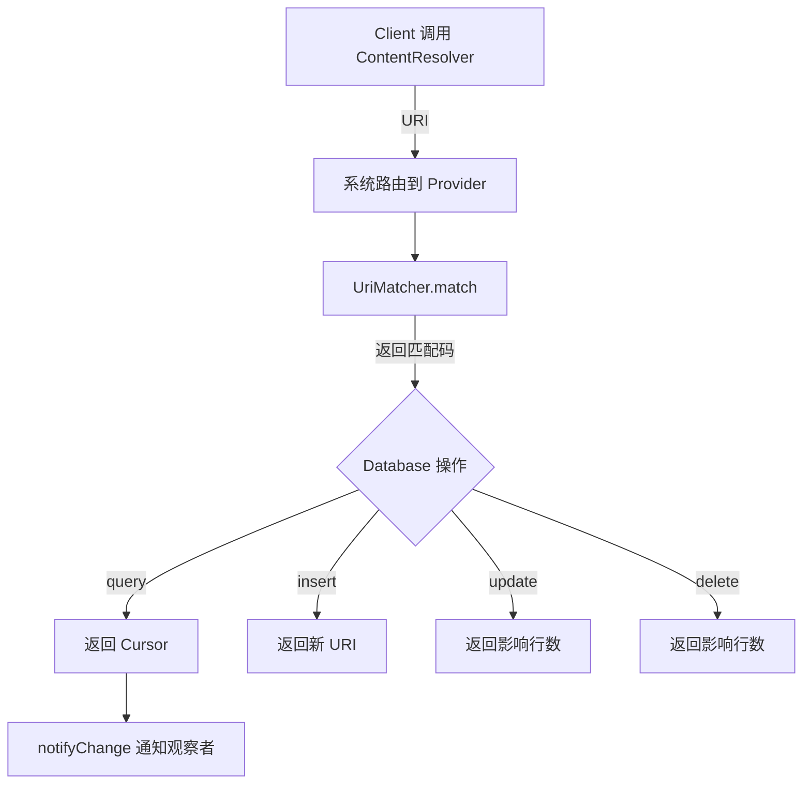

# 1.11.2 Content Provider 基础

雨停了。

准确地说，是从半夜开始停的。洛芙在睡袋里翻了个身，迷迷糊糊间听到帐篷顶上不再有“嗒嗒”的声音，只有偶尔一两滴水珠滑落，滴在前一晚她们挖好的排水沟里，发出清脆的“滴答”声。

清晨是被鸟叫醒的。

带着水汽的、清亮的鸟鸣，让人心情舒畅。洛芙把帐篷的拉链拉开一条缝往外看——

整个世界都是湿漉漉的。

草叶上挂满了晶莹的露水，昨夜的雨水在平地上汇成了一个个小水坑，倒映着刚睡醒的天空。远处的山像被洗过一样，轮廓格外清晰，空气里弥漫着泥土和青草混合的清香。

“洛芙！起来了！”

希尔的声音从外面传来，伴随着一阵阵水花溅起的声音。

洛芙钻出帐篷，看呆了三秒钟——希尔正挽着裤腿，在最大的那个水坑里跳来跳去，溅起一人高的水花。

“你在干什么？！”洛芙裹紧外套缩了缩脖子。

“踩水坑啊！”希尔 grins（露出灿烂的笑容），朝她招手，“你昨天不是说今天要踩水坑吗？快来，这儿有个超大的！”

伊莎和黛琳坐在旁边的石头上，每人捧着一杯热可可，看着希尔发疯。伊莎的头发还乱糟糟的，黛琳则已经拿出了一个小型白板。

“先别闹了，”黛琳举起白板笔，“昨天我们讲了 Provider 的概念，今天来点实际的——我们来实现一个最简单的 Provider。”

“等一下！”洛芙一只脚已经踩进了水坑，听到这话又缩了回去，“ Provider 还能现在现场写？”

“为什么不能？”黛琳笑着把白板架好，“帐篷里 WiFi 信号好，我们就在这儿现场写代码。”

---

### 从零开始：实现第一个 Provider

黛琳在白板上画了一个简单的结构图：

```kotlin
// 这是一个"日记本" Provider 的骨架
class DiaryProvider : ContentProvider() {

    // 1. Provider 启动时调用，做初始化
    override fun onCreate(): Boolean {
        return true  // 初始化成功
    }

    // 2. 查询数据
    override fun query(
        uri: Uri,
        projection: Array<out String>?,
        selection: String?,
        selectionArgs: Array<out String>?,
        sortOrder: String?
    ): Cursor? {
        // 稍后实现
        return null
    }

    // 3. 插入数据
    override fun insert(uri: Uri, values: ContentValues?): Uri? {
        // 稍后实现
        return null
    }

    // 4. 更新数据
    override fun update(
        uri: Uri,
        values: ContentValues?,
        selection: String?,
        selectionArgs: Array<out String>?
    ): Int {
        // 稍后实现
        return 0
    }

    // 5. 删除数据
    override fun delete(uri: Uri, selection: String?, selectionArgs: Array<out String>?): Int {
        // 稍后实现
        return 0
    }

    // 6. 返回数据的 MIME 类型
    override fun getType(uri: Uri): String {
        // 稍后实现
        return ""
    }
}
```

“这就是 Provider 的全部了吗？”洛芙盯着白板，“好像比我想的简单？”

“骨架简单，”希尔已经从水坑里爬上来了，裤腿湿漉漉的滴水，“里面的东西可复杂了。光是 URI 匹配就够你喝一壶的。”

---

### URI 匹配：找到正确的数据

黛琳又在白板上画了一堆 URI：

```
content://com.campapp.provider/diary          # 所有日记列表
content://com.campapp.provider/diary/5       # ID = 5 的那篇日记
content://com.campapp.provider/diary/5/tag   # 那篇日记的所有标签
```

“Android 系统怎么知道你想访问哪个数据？”黛琳问。

“通过 URI ！”洛芙抢答。

“对，但更关键的是——Provider 怎么把 URI 转换成具体的操作？”黛琳画出 UriMatcher 的用法：

```kotlin
// URI 匹配器：像路由器一样，把请求分到正确的处理方法

// 1. 定义匹配码
companion object {
    const val DIARIES = 1      // 代表"所有日记列表"
    const val DIARY_ID = 2     // 代表"单条日记"
    const val DIARY_TAGS = 3   // 代表"日记的标签"
}

// 2. 创建匹配器并注册 URI 模式
val uriMatcher = UriMatcher(UriMatcher.NO_MATCH).apply {
    // addURI(authority, path, matchCode)
    addURI("com.campapp.provider", "diary", DIARIES)
    addURI("com.campapp.provider", "diary/#", DIARY_ID)   // # = 数字
    addURI("com.campapp.provider", "diary/#/tag", DIARY_TAGS)
}

// 3. 在 query() 里根据匹配码决定做什么
override fun query(uri: Uri, ...): Cursor? {
    return when (uriMatcher.match(uri)) {
        DIARIES -> {
            // 查询所有日记
            queryAllDiaries()
        }
        DIARY_ID -> {
            // 从 URI 里提取 ID，比如 content://.../diary/5 → id = 5
            val id = ContentUris.parseId(uri)
            queryDiaryById(id)
        }
        DIARY_TAGS -> {
            val id = ContentUris.parseId(uri)
            queryTagsForDiary(id)
        }
        else -> throw IllegalArgumentException("Unknown URI: $uri")
    }
}
```

“这个 # 号是什么意思？”洛芙问。

“通配符。”希尔抢答，“# 代表任意数字，* 代表任意字符串。这样一个 addURI 就能匹配一堆 URI。”

伊莎补充：“就像地址簿里的快捷方式——你说'北京市'，能匹配'北京市朝阳区'、'北京市海淀区'，而不是只能精确匹配'北京市'。”

---

### ContentUris：URI 的工具箱

“还有个很常用的工具——ContentUris。”黛琳在白板上写下：

```kotlin
// ContentUris：操作 URI 的工具类

// 1. 从 URI 中提取 ID（针对 /diary/5 这样的格式）
val id = ContentUris.parseId(uri)
// 等价于: uri.lastPathSegment?.toLongOrNull()

// 2. 给 URI 追加 ID（生成新的 URI）
val newUri = ContentUris.withAppendedId(baseUri, id)
// content://com.campapp.provider/diary + 5 → content://com.campapp.provider/diary/5
```

“这个太常用了，”希尔说，“每次写 insert() 要返回新数据的 URI，都得用它。”

---

### MIME 类型：告诉系统这是什么

“还有一个方法不能少——getType()。”黛琳的表情认真了一点，“它告诉调用者：你请求的这条数据，是什么类型的？”

```kotlin
override fun getType(uri: Uri): String {
    return when (uriMatcher.match(uri)) {
        DIARIES -> {
            // 多个日记项，用 vnd.android.cursor.dir 表示"目录"
            "vnd.android.cursor.dir/vnd.com.campapp.provider.diary"
        }
        DIARY_ID -> {
            // 单个日记项，用 vnd.android.cursor.item 表示"单项"
            "vnd.android.cursor.item/vnd.com.campapp.provider.diary"
        }
        else -> throw IllegalArgumentException("Unknown URI: $uri")
    }
}
```

“为什么要分 dir 和 item？”洛芙不解。

“Android 系统要看这个决定怎么显示啊，”希尔解释，“如果是 dir，系统可能用列表展示；如果是 item，可能用详情页。系统要知道数据的'形状'才能正确渲染。”

---

### Contract Class：给调用者的说明书

“最后——也是最重要的——Contract Class。”黛琳把白板翻到新的一页，写下：

```kotlin
// Contract Class：Provider 的"使用说明书"
// 约定好所有的 URI、列名常量，让调用者不要写错

class DiaryContract {
    companion object {
        // Provider 的"店名"，必须和 AndroidManifest 里的一致
        const val AUTHORITY = "com.campapp.provider"

        // 基 URI：content://com.campapp.provider
        val BASE_CONTENT_URI: Uri = Uri.parse("content://$AUTHORITY")

        // 日记的路径和完整 URI
        object Diary {
            const val PATH = "diary"
            val CONTENT_URI: Uri = Uri.withAppendedPath(BASE_CONTENT_URI, PATH)

            // 列名常量
            const val COLUMN_ID = "_id"
            const val COLUMN_TITLE = "title"
            const val COLUMN_CONTENT = "content"
            const val COLUMN_CREATED_AT = "created_at"

            // MIME 类型
            const val CONTENT_TYPE = "vnd.android.cursor.dir/vnd.$AUTHORITY.diary"
            const val CONTENT_ITEM_TYPE = "vnd.android.cursor.item/vnd.$AUTHORITY.diary"
        }
    }
}
```

“这也太复杂了吧……”洛芙看着这么多常量，头晕。

“复杂是为了安全。”伊莎轻声说，“你想——如果有人直接在代码里写 'content://com.campapp.provider/diary'，哪一天你的 authority 改了，所有调用都要改。但如果用 Contract Class——”

“只改一处！”洛芙明白了，“所有人都引用 `DiaryContract.Diary.CONTENT_URI`，改的时候只改 Contract 就好。”

“对，”黛琳微笑，“而且列名用常量，不会因为拼错字导致崩溃。编译时就能发现错误。”

---

### 完整的 Provider 骨架

希尔把代码整理了一下，展示给大家：

```kotlin
class DiaryProvider : ContentProvider() {

    companion object {
        const val AUTHORITY = "com.campapp.provider"
        val BASE_URI = Uri.parse("content://$AUTHORITY")

        const val DIARIES = 1
        const val DIARY_ID = 2

        val uriMatcher = UriMatcher(UriMatcher.NO_MATCH).apply {
            addURI(AUTHORITY, "diary", DIARIES)
            addURI(AUTHORITY, "diary/#", DIARY_ID)
        }
    }

    private lateinit var dbHelper: DiaryDbHelper

    override fun onCreate(): Boolean {
        dbHelper = DiaryDbHelper(context!!)
        return true
    }

    override fun query(uri: Uri, projection: Array<out String>?, selection: String?,
                       selectionArgs: Array<out String>?, sortOrder: String?): Cursor? {
        val db = dbHelper.readableDatabase
        val cursor = when (uriMatcher.match(uri)) {
            DIARIES -> db.query(DiaryContract.Diary.TABLE_NAME, projection,
                               selection, selectionArgs, null, null, sortOrder)
            DIARY_ID -> {
                val id = ContentUris.parseId(uri)
                db.query(DiaryContract.Diary.TABLE_NAME, projection,
                        "${DiaryContract.Diary.COLUMN_ID} = ?",
                        arrayOf(id.toString()), null, null, null)
            }
            else -> throw IllegalArgumentException("Unknown URI: $uri")
        }
        cursor.setNotificationUri(context?.contentResolver, uri)
        return cursor
    }

    override fun insert(uri: Uri, values: ContentValues?): Uri? {
        if (uriMatcher.match(uri) != DIARIES) {
            throw IllegalArgumentException("Invalid URI for insert: $uri")
        }
        val db = dbHelper.writableDatabase
        val id = db.insert(DiaryContract.Diary.TABLE_NAME, null, values)
        if (id > 0) {
            val newUri = ContentUris.withAppendedId(DiaryContract.Diary.CONTENT_URI, id)
            context?.contentResolver?.notifyChange(newUri, null)
            return newUri
        }
        return null
    }

    override fun update(uri: Uri, values: ContentValues?, selection: String?,
                        selectionArgs: Array<out String>?): Int {
        val db = dbHelper.writableDatabase
        val rows = when (uriMatcher.match(uri)) {
            DIARIES -> db.update(DiaryContract.Diary.TABLE_NAME, values, selection, selectionArgs)
            DIARY_ID -> {
                val id = ContentUris.parseId(uri)
                db.update(DiaryContract.Diary.TABLE_NAME, values,
                        "${DiaryContract.Diary.COLUMN_ID} = ?", arrayOf(id.toString()))
            }
            else -> throw IllegalArgumentException("Unknown URI: $uri")
        }
        if (rows > 0) {
            context?.contentResolver?.notifyChange(uri, null)
        }
        return rows
    }

    override fun delete(uri: Uri, selection: String?, selectionArgs: Array<out String>?): Int {
        val db = dbHelper.writableDatabase
        val rows = when (uriMatcher.match(uri)) {
            DIARIES -> db.delete(DiaryContract.Diary.TABLE_NAME, selection, selectionArgs)
            DIARY_ID -> {
                val id = ContentUris.parseId(uri)
                db.delete(DiaryContract.Diary.TABLE_NAME,
                        "${DiaryContract.Diary.COLUMN_ID} = ?", arrayOf(id.toString()))
            }
            else -> throw IllegalArgumentException("Unknown URI: $uri")
        }
        if (rows > 0) {
            context?.contentResolver?.notifyChange(uri, null)
        }
        return rows
    }

    override fun getType(uri: Uri): String {
        return when (uriMatcher.match(uri)) {
            DIARIES -> DiaryContract.Diary.CONTENT_TYPE
            DIARY_ID -> DiaryContract.Diary.CONTENT_ITEM_TYPE
            else -> throw IllegalArgumentException("Unknown URI: $uri")
        }
    }
}
```

洛芙看着这长长的一段代码，突然笑出声。

“笑什么？”希尔问。

“我在想……这 Provider 就像一个民宿前台，”洛芙说，“有人来住宿（query），前台查记录；有人来入住（insert），前台登记新人；有人要换房间（update），前台改记录；有人要退房（delete），前台销记录。UriMatcher 就是房号本，Contract Class 就是操作手册。”

伊莎鼓掌：“这个比喻太贴切了！”

黛琳笑着点头：“没错。Provider 就是那个'守门人+前台+管理员'三位一体的角色。它不直接管数据，但它知道数据在哪、怎么操作。”

---

雨后的阳光格外温柔，洒在水坑上，亮晶晶的像撒了一把碎金子。

“走吧，”希尔伸出手拉洛芙，“水坑还没踩完呢！”

洛芙笑着跳进了最近的那个水坑，冰凉的水花溅了她一脚，但她不在乎。

“明天我们要不要把这个 Provider 真的写出来？”她一边踩水一边问。

“当然，”黛琳收拾着白板，“明天我们就来实现一个真正能用的 Provider。把数据层搭起来。”

“那我要把这个写进日记里！”洛芙又跳进另一个水坑，“《踩水坑学会 Provider 基础》——标题都想好了！”

伊莎笑着摇头：“你这是踩水坑还是踩代码？”

“都是踩！”洛芙 grinning，“都要溅起水花！”

四个人笑成一团，惊飞了旁边树枝上的几只小鸟。阳光、笑声、水花，还有远处渐渐升起的炊烟——这就是她们的露营日常。

---

### 技术总结

> **Content Provider 基础** —— 本章详细讲解了如何从零实现一个 Content Provider，包括 Provider 的生命周期方法、UriMatcher 的 URI 路由、ContentUris 的 ID 提取与拼接、MIME 类型的定义，以及最重要的 Contract Class 设计模式。理解这些基础概念，是掌握跨应用数据共享的关键。

#### 今日关键词

1. **UriMatcher**：URI 路由匹配器，根据 URI 模式返回对应的操作码
2. **ContentUris**：操作 URI 的工具类，parseId() 提取 ID，withAppendedId() 拼接 ID
3. **Contract Class**：Provider 的使用说明书，集中定义所有 URI 和列名常量
4. **MIME Type**：vnd.android.cursor.dir（目录）vs vnd.android.cursor.item（单项）
5. **notifyChange()**：数据变化时通知观察者刷新

#### 核心流程图



#### 反模式与陷阱

1. **没有处理不存在的 URI**：所有 URI 都应该在 UriMatcher 中有匹配分支，否则抛异常。  
   修复：添加 default 分支处理未知 URI。

2. **URI 匹配顺序错误**：addURI 的顺序会影响匹配结果。  
   修复：更具体的路径（如带 # 的）要放在更通用的路径之后。

3. **忘记 notifyChange()**：数据变了但不通知调用者刷新。  
   修复：在 insert/update/delete 中调用 notifyChange。

4. **Cursor 没关**：查询完的 Cursor 没关闭会导致内存泄漏。  
   修复：用 `use {}` 自动关闭，或让调用者负责关闭。

5. **权限暴露**：exported = true 但没有权限控制。  
   修复：添加 android:readPermission / writePermission。

#### 设计思想

- **单一职责**：Provider 只负责"怎么操作数据"，不关心数据从哪来
- **统一入口**：不管底层是 SQLite、Room 还是文件，对外接口一致
- **类型安全**：Contract Class 把所有常量集中管理，减少拼写错误
- **观察者模式**：notifyChange + ContentObserver 实现数据同步

### 🏕️ 动手练习

#### Task 1 · URI 匹配器 ★

**目标**：实现 UriMatcher 处理多种 URI。  
**步骤**：
1. 继承 ContentProvider，实现空壳。  
2. 创建 UriMatcher，添加三条 URI 匹配规则：  
   - `/diary` → DIARIES  
   - `/diary/#` → DIARY_ID  
   - `/tag` → TAGS  
3. 在 query() 中根据匹配码返回不同数据。  
**验收**：
- [ ] 不同 URI 返回不同结果
- [ ] 未知 URI 抛异常

---

#### Task 2 · 完整 CRUD 操作 ★★

**目标**：实现 query/insert/update/delete 四个方法。  
**步骤**：
1. 使用 Room 或 SQLite 作为底层存储。  
2. 四个方法分别调用数据库的 query/insert/update/delete。  
3. insert 返回带 ID 的 URI，update/delete 返回影响行数。  
**验收**：
- [ ] 能增删改查
- [ ] insert 后能用返回的 URI 再查回来

---

#### Task 3 · Contract Class 设计 ★★

**目标**：编写规范的 Contract Class。  
**步骤**：
1. 定义 AUTHORITY 常量。  
2. 定义 BASE_CONTENT_URI。  
3. 用内部类定义 PATH、CONTENT_URI、列名常量。  
4. 定义 CONTENT_TYPE 和 CONTENT_ITEM_TYPE。  
**验收**：
- [ ] 调用者可以通过 Contract 访问所有信息
- [ ] 改 AUTHORITY 只需改一处

---

#### Task 4 · MIME 类型返回 ★

**目标**：正确返回 vnd 类型。  
**步骤**：
1. 实现 getType() 方法。  
2. 对目录 URI 返回 vnd.android.cursor.dir。  
3. 对单项 URI 返回 vnd.android.cursor.item。  
**验收**：
- [ ] 用 adb shell 可以看到正确的 MIME type

---

#### Task 5 · 数据变化通知 ★★★

**目标**：实现数据变化的观察者通知。  
**步骤**：
1. 在 insert/update/delete 中调用 `context.contentResolver.notifyChange(uri, null)`。  
2. 另一个 Activity 用 `ContentObserver` 监听变化。  
3. 数据变化时自动刷新 UI。  
**验收**：
- [ ] A 应用改了数据，B 应用立刻收到通知

---

#### Task 6 · 带排序和分页的查询 ★★★

**目标**：实现完整的 query 参数支持。  
**步骤**：
1. 处理 projection（列筛选）。  
2. 处理 selection/selectionArgs（WHERE 条件）。  
3. 处理 sortOrder（排序）。  
4. 处理 limit 参数实现分页。  
**验收**：
- [ ] 可以按列排序
- [ ] 可以分页加载

---

#### Task 7 · 批量操作 ★★★★

**目标**：实现 bulkInsert。  
**步骤**：
1. 开启事务。  
2. 循环插入所有 ContentValues。  
3. 提交事务。  
4. 一次性 notifyChange。  
**验收**：
- [ ] 1000 条数据插入比逐条快 5 倍以上

---

#### Task 8 · Provider 调试技巧 ★★★

**目标**：用 adb 调试 Provider。  
**步骤**：
1. 用 `adb shell content query --uri content://...` 测试查询。  
2. 用 `--projection` 指定列。  
3. 用 `--where` 添加筛选条件。  
**验收**：
- [ ] 能用命令行查到数据

---

#### 💬 面试热身

1. UriMatcher 的匹配顺序重要吗？为什么？  
2. ContentProvider 和 Room 是什么关系？可以一起用吗？  
3. 为什么 insert() 要返回 URI 而不是 ID？  
4. getType() 的作用是什么？没有它会怎样？  
5. 如何保证 Provider 的线程安全？

---

> Provider 就像一个专业的前台——它不需要知道客人的长短，但它知道每个房间在哪、怎么登记、怎么退房。好的 Provider 让数据调用者如沐春风，不知道背后有多少复杂逻辑。这就是"优雅"。

### 🍭 洛芙的小小日记本

今天踩水坑了！还学会了 Provider！  
黛琳说 Provider 像民宿前台，我说我像来踢馆的（踩水花的）。  
明天要写真正的 Provider 了，好期待！  
雨后的天空好干净，像刚洗过的蓝色画布。🌈💧
