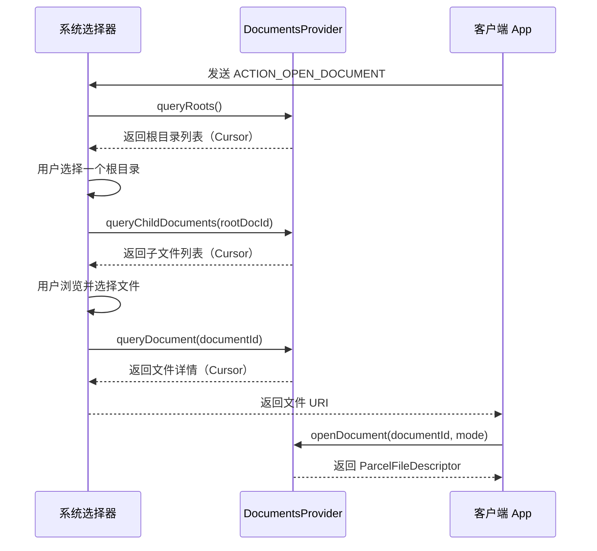
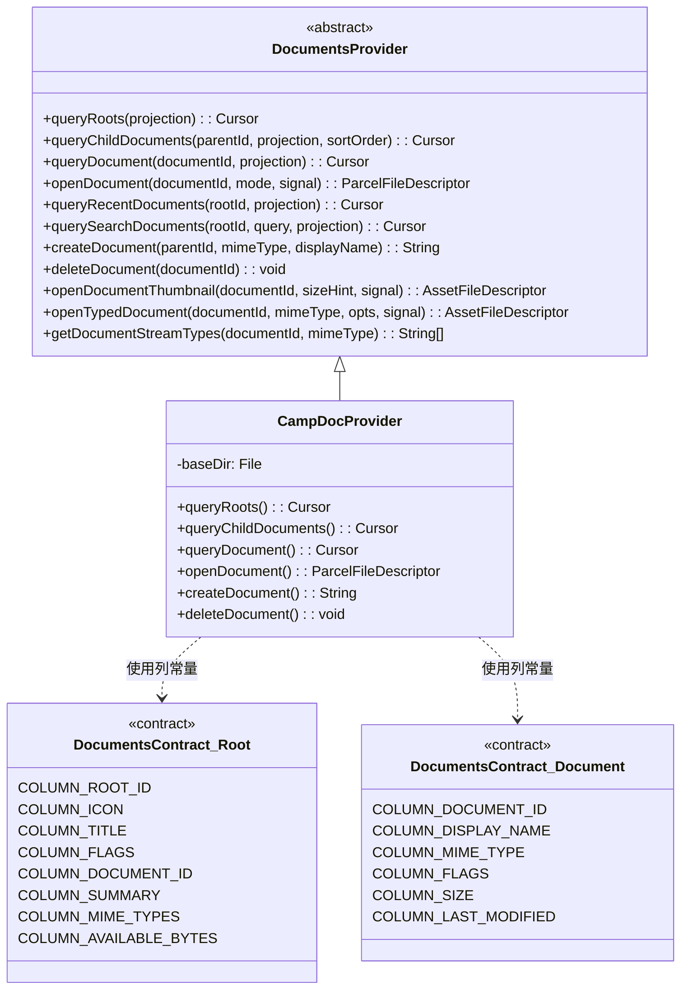
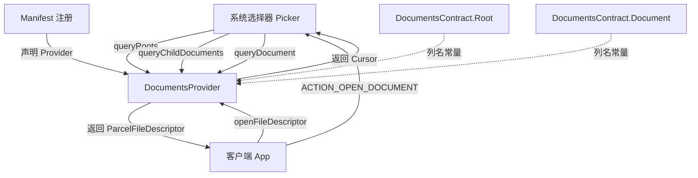

# 1.11.5 创建自定义 Document Provider

## 1.11.5 露营档案馆——打造属于自己的文档驿站

夕阳把湖面染成一层薄薄的金箔。

洛芙蹲在帐篷边上，正对着手机发愁。她刚才把露营日志写进了自己做的小 App 里，存了一堆照片和文字文件。希尔凑过来，手里拎着一盏刚装好的露营灯，灯芯还没点亮。

"洛芙，你那个 App 里的露营日志能不能让别人也能选到？"希尔单刀直入，"就是上次黛琳讲的那个 SAF 系统选择器——我想让别的 App 在弹出文件选择器的时候，也能看到你存的那些日志文件。"

洛芙歪了歪头："你是说……让我的 App 变成像 Google Drive 那样的文件来源？"

"没错！"希尔咧嘴一笑。

"可是……上次我们只学了怎么用 SAF 去选别人家的文件，"洛芙抓了抓头发，"如果要让我的 App 也出现在那个选择器里，是不是需要写一个什么……Provider？"

黛琳放下手里的书，走过来。夕阳在她镜片上跳了一下。

"你说得对。上次我们是站在客户端的角度去调用 SAF。今天，我们要换一个视角——站在供应商的角度，**创建一个自定义的 Document Provider**。"

伊莎从远处的石头上站起来，伸了个懒腰，晚风把她的头发吹得微微飘起。

"你想象一下，"伊莎慢慢走过来，"SAF 的那个系统选择器，就像一个大集市。Google Drive 是一个摊位，本地存储是一个摊位。如果你想让自己的 App 也成为集市里的一个摊位——你就得按照集市的规矩，搭好你的摊子。"

洛芙眼睛亮了："那规矩是什么？"

黛琳微微一笑："规矩就是——实现 `DocumentsProvider` 这个抽象类。"

---

"我们一步一步来，"黛琳蹲下来，在地上捡了根树枝当笔，"首先，要在清单文件里注册你的 Provider。"

希尔已经打开了电脑，屏幕亮光在暮色里格外显眼。

"注册一个自定义 Document Provider，需要在 `AndroidManifest.xml` 里声明一个 `<provider>` 标签，"黛琳说，"而且有好几个属性必须写对，少一个都不行。"

她一条一条数：

"第一，`android:name`——就是你写的 DocumentsProvider 子类的全限定类名。"

"第二，`android:authorities`——这是你的 Provider 的唯一标识，通常用包名加上 `.documents`。"

"第三，`android:exported` 必须设成 `true`，否则别的 App 根本看不到你的 Provider。"

"第四，`android:grantUriPermissions` 也必须是 `true`——这样系统才能把你的文件的访问权限授予别的 App。"

"第五，要加上 `android.permission.MANAGE_DOCUMENTS` 权限。这个权限把你的 Provider 限制为只有系统才能访问——安全性很重要。"

"第六，必须声明一个 Intent Filter，action 是 `android.content.action.DOCUMENTS_PROVIDER`——这样系统在扫描可用的文档来源时，才能找到你。"

洛芙一边听一边在本子上画，然后抬头问："能看看代码吗？"

希尔把电脑转过来：

```xml
<!-- AndroidManifest.xml -->
<manifest ... >
    <uses-sdk
        android:minSdkVersion="19"
        android:targetSdkVersion="34" />

    <application ... >
        <provider
            android:name="com.example.camp.CampDocProvider"
            android:authorities="com.example.camp.documents"
            android:grantUriPermissions="true"
            android:exported="true"
            android:permission="android.permission.MANAGE_DOCUMENTS">
            <intent-filter>
                <action android:name="android.content.action.DOCUMENTS_PROVIDER" />
            </intent-filter>
        </provider>
    </application>
</manifest>
```

"哇，这些属性还真不少。"洛芙感叹。

"每一个都有用，"黛琳语气温和但笃定，"`MANAGE_DOCUMENTS` 这个权限尤其关键。如果你不加，任何 App 都能直接访问你的 Provider——那就绕过了系统选择器，安全性就没了。"

---

### 兼容 Android 4.3 及更低版本

"等一下，"洛芙举手，"如果用户的手机很老呢？"

黛琳点点头："好问题。`ACTION_OPEN_DOCUMENT` 这个 Intent 是 Android 4.4（API 19）才引入的。如果你的 App 还要兼容 4.3 及更低版本，就需要处理一下 `ACTION_GET_CONTENT`。"

"问题是——如果你同时支持 Document Provider 和 `ACTION_GET_CONTENT`，你的 App 会在系统选择器里出现两次，"希尔补充，"一次是作为 Document Provider，一次是作为 GET_CONTENT 的响应者。用户会很困惑。"

"所以推荐的做法是：在 Android 4.4 及以上的设备上，禁用 `ACTION_GET_CONTENT` 的 Intent Filter，"黛琳说，"用资源文件来控制。"

她快速写下思路：

"在 `res/values/bool.xml` 里，设置 `<bool name="atMostJellyBeanMR2">true</bool>`。"

"在 `res/values-v19/bool.xml` 里，覆盖为 `false`。"

"然后在 Manifest 里，用 `android:enabled` 属性引用这个布尔值，来动态启用或禁用对应的 Activity Alias。"

洛芙若有所思地点点头。

---

### 契约类——不用自己写

"接下来说说 Contract，"黛琳换了个话题，"你还记得上次讲 Content Provider 的时候，我们说过要写契约类吗？"

"记得！"洛芙兴奋地说，"就是那个定义了列名、URI、MIME 类型的 `public final class`。"

"没错。但这次——你不用自己写。"

洛芙愣住了。

伊莎笑着解释："SAF 已经替你准备好了两个契约类。你想象一下：集市给每个摊主都发了统一的摊位牌——你只要按上面的格式摆好货物就行。"

黛琳在白板上写下两个名字：

- **`DocumentsContract.Root`**——描述"根目录"的信息，比如根目录的 ID、标题、图标、支持的功能等。
- **`DocumentsContract.Document`**——描述"文档"的信息，比如文档 ID、显示名称、MIME 类型、大小、最后修改时间等。

"当系统查询你的 Provider 时，你需要返回一个 Cursor，"黛琳继续，"Cursor 的列名就是这两个契约类里定义的常量。"

希尔已经敲出了代码：

```kotlin
// 查询根目录时返回的默认列
// 每一列对应 DocumentsContract.Root 中的一个常量
private val DEFAULT_ROOT_PROJECTION: Array<String> = arrayOf(
    DocumentsContract.Root.COLUMN_ROOT_ID,
    DocumentsContract.Root.COLUMN_MIME_TYPES,
    DocumentsContract.Root.COLUMN_FLAGS,
    DocumentsContract.Root.COLUMN_ICON,
    DocumentsContract.Root.COLUMN_TITLE,
    DocumentsContract.Root.COLUMN_SUMMARY,
    DocumentsContract.Root.COLUMN_DOCUMENT_ID,
    DocumentsContract.Root.COLUMN_AVAILABLE_BYTES
)

// 查询文档时返回的默认列
// 每一列对应 DocumentsContract.Document 中的一个常量
private val DEFAULT_DOCUMENT_PROJECTION: Array<String> = arrayOf(
    DocumentsContract.Document.COLUMN_DOCUMENT_ID,
    DocumentsContract.Document.COLUMN_MIME_TYPE,
    DocumentsContract.Document.COLUMN_DISPLAY_NAME,
    DocumentsContract.Document.COLUMN_LAST_MODIFIED,
    DocumentsContract.Document.COLUMN_FLAGS,
    DocumentsContract.Document.COLUMN_SIZE
)
```

"根目录的 Cursor 有几个必填列——"黛琳扳着手指数："`COLUMN_ROOT_ID`、`COLUMN_ICON`、`COLUMN_TITLE`、`COLUMN_FLAGS`、`COLUMN_DOCUMENT_ID`。这五个缺一不可。"

"文档的 Cursor 也有必填列：`COLUMN_DOCUMENT_ID`、`COLUMN_DISPLAY_NAME`、`COLUMN_MIME_TYPE`、`COLUMN_FLAGS`、`COLUMN_SIZE`、`COLUMN_LAST_MODIFIED`。"

洛芙认真地在本子上画了个表格。

---

### 子类化 DocumentsProvider——四个必须实现的方法

"好，现在到最核心的部分了，"黛琳站起来，晚风吹动了她的衣角，"你需要创建一个类，继承 `DocumentsProvider` 这个抽象类。"

"至少——至少要实现四个方法，"她一个一个说：

"**`queryRoots()`**——告诉系统你有哪些根目录。"

"**`queryChildDocuments()`**——列出某个目录下的所有子文件和子文件夹。"

"**`queryDocument()`**——返回某个特定文件的信息。"

"**`openDocument()`**——打开一个文件，返回一个文件描述符让别的 App 读写。"

伊莎又来了一个比喻："你可以这样想——`queryRoots()` 是告诉来客'我的摊位在哪'，`queryChildDocuments()` 是让来客'看看货架上有什么'，`queryDocument()` 是让来客'看看某件货物的详细信息'，`openDocument()` 是把货物'递到来客手里'。"

洛芙恍然大悟："哦哦哦！这个比喻好清晰！"

下面是这四个核心方法的协作流程：



"这张图，"黛琳指着屏幕上的时序图，"对应的就是用户从打开选择器到最终拿到文件的整个流程。每一步都对应一个你需要实现的方法。"

---

### 定义根目录——queryRoots()

"先来看 `queryRoots()`，"希尔敲着键盘，"这个方法返回一个 Cursor，里面包含了你的 Provider 所有根目录的信息。大多数 Provider 只有一个根——就像我们的露营日志 App 只有一个主文件夹。"

```kotlin
// queryRoots() 返回一个包含所有根目录信息的 Cursor
// 系统选择器调用此方法来发现可用的文档来源
override fun queryRoots(projection: Array<String>?): Cursor {
    val result = MatrixCursor(resolveRootProjection(projection))

    // 如果用户未登录，返回空 Cursor
    // 这样你的 Provider 就不会出现在选择器列表里
    if (!isUserLoggedIn()) {
        return result
    }

    // 每调用一次 newRow() 就新增一个根目录
    // 如果有多个账户，可以添加多行
    result.newRow().apply {
        add(DocumentsContract.Root.COLUMN_ROOT_ID, ROOT)
        add(DocumentsContract.Root.COLUMN_SUMMARY,
            context.getString(R.string.root_summary))

        // FLAG_SUPPORTS_CREATE：根目录下至少有一个目录支持创建文档
        // FLAG_SUPPORTS_RECENTS：最近使用的文档会出现在"最近"分类里
        // FLAG_SUPPORTS_SEARCH：支持搜索
        add(DocumentsContract.Root.COLUMN_FLAGS,
            DocumentsContract.Root.FLAG_SUPPORTS_CREATE or
            DocumentsContract.Root.FLAG_SUPPORTS_RECENTS or
            DocumentsContract.Root.FLAG_SUPPORTS_SEARCH)

        // 根目录的显示标题（如"露营日志"）
        add(DocumentsContract.Root.COLUMN_TITLE,
            context.getString(R.string.title))

        // 根目录对应的文档 ID，一旦分享出去就不能再改
        add(DocumentsContract.Root.COLUMN_DOCUMENT_ID,
            getDocIdForFile(baseDir))

        // 子文件的 MIME 类型，用于过滤
        add(DocumentsContract.Root.COLUMN_MIME_TYPES,
            getChildMimeTypes(baseDir))

        add(DocumentsContract.Root.COLUMN_AVAILABLE_BYTES,
            baseDir.freeSpace)
        add(DocumentsContract.Root.COLUMN_ICON,
            R.drawable.ic_launcher)
    }

    return result
}
```

"注意那个 `isUserLoggedIn()` 检查，"黛琳特意强调，"如果你的存储服务需要登录——比如一个云盘——当用户没登录时，返回空 Cursor 就好。这样你的 Provider 会从选择器里消失，不会让用户看到一个用不了的选项。"

洛芙小声念着代码里的注释，然后问："那如果根目录会动态变化呢？比如用户登录了、或者插了个 U 盘？"

"好问题，"黛琳微笑，"这时候你需要通知系统刷新。用 `ContentResolver.notifyChange()` 就行。"

```kotlin
// 当根目录发生变化时（如用户登录/登出），通知系统刷新
// buildRootsUri() 构建指向你的 Provider 所有根目录的 URI
val rootsUri: Uri = DocumentsContract.buildRootsUri(
    BuildConfig.DOCUMENTS_AUTHORITY
)
context.contentResolver.notifyChange(rootsUri, null)
```

"就像在集市里翻了一下摊位上的招牌，"伊莎说，"告诉路过的人：'嘿，我的货变了，重新看一眼吧。'"

---

### 列出文档——queryChildDocuments()

"用户选了你的根目录之后，系统会调用 `queryChildDocuments()` 来列出根目录下的所有子文件，"希尔说，"之后每次用户点进一个子文件夹，也会调用这个方法。"

```kotlin
// queryChildDocuments() 返回指定目录下所有子文件/子文件夹的信息
// parentDocumentId：父目录的文档 ID
// projection：调用方需要的列，为 null 时使用默认列
// sortOrder：排序方式
override fun queryChildDocuments(
    parentDocumentId: String?,
    projection: Array<String>?,
    sortOrder: String?
): Cursor {
    return MatrixCursor(resolveDocumentProjection(projection)).apply {
        val parent: File = getFileForDocId(parentDocumentId)
        // 遍历父目录下的所有文件，逐个添加到 Cursor 中
        parent.listFiles()?.forEach { file ->
            includeFile(this, null, file)
        }
    }
}
```

"这段代码很直白，"洛芙说，"遍历文件夹，把每个文件的信息塞进 Cursor。"

"对，`includeFile()` 是你自己写的辅助方法，"希尔点头，"负责读取文件的名字、大小、MIME 类型、修改时间等信息，然后添加到 MatrixCursor 的一行里。"

---

### 获取文档信息——queryDocument()

"`queryDocument()` 和 `queryChildDocuments()` 返回的信息结构是一样的，"黛琳说，"区别在于它只返回一个特定文件的信息，而不是整个目录。"

```kotlin
// queryDocument() 返回单个文件的详细信息
// documentId：目标文件的文档 ID
override fun queryDocument(
    documentId: String?,
    projection: Array<String>?
): Cursor {
    return MatrixCursor(resolveDocumentProjection(projection)).apply {
        includeFile(this, documentId, null)
    }
}
```

"简洁，"洛芙赞叹。

"是的。系统在很多场景下都会调用它——比如判断文件类型、显示文件详情等，"黛琳说。

"另外，"希尔突然想起来，"如果你的文件支持缩略图预览，可以重写 `openDocumentThumbnail()` 方法，并在文件的 flags 里加上 `FLAG_SUPPORTS_THUMBNAIL`。"

```kotlin
// openDocumentThumbnail() 为指定文档返回缩略图
// sizeHint：建议的缩略图尺寸，返回的图片不要超过此尺寸的两倍
// signal：取消信号，长时间操作时应定期检查
override fun openDocumentThumbnail(
    documentId: String?,
    sizeHint: Point?,
    signal: CancellationSignal?
): AssetFileDescriptor {
    val file = getThumbnailFileForDocId(documentId)
    val pfd = ParcelFileDescriptor.open(
        file, ParcelFileDescriptor.MODE_READ_ONLY
    )
    return AssetFileDescriptor(pfd, 0, AssetFileDescriptor.UNKNOWN_LENGTH)
}
```

"注意！"黛琳抬起手指，"官方文档特别警告：缩略图的尺寸不要超过 `sizeHint` 的两倍。如果你返回一张超大图片，系统可能会出问题。"

---

### 打开文档——openDocument()

"最后是 `openDocument()`，"黛琳的语气变得郑重，"这是整个 Provider 里最关键的方法。用户选好了文件，客户端 App 调用 `openFileDescriptor()` 来读写——最终就会调到你这里。"

"你需要返回一个 `ParcelFileDescriptor`，"她继续，"它就像一根管道——客户端通过这根管道来读取或写入文件内容。"

```kotlin
// openDocument() 打开指定文件并返回 ParcelFileDescriptor
// documentId：文件的文档 ID
// mode：打开模式（"r" 只读, "w" 写入, "rw" 读写等）
// signal：取消信号
override fun openDocument(
    documentId: String,
    mode: String,
    signal: CancellationSignal
): ParcelFileDescriptor {
    Log.v(TAG, "openDocument, mode: $mode")

    val file: File = getFileForDocId(documentId)
    val accessMode: Int = ParcelFileDescriptor.parseMode(mode)
    val isWrite: Boolean = mode.contains("w")

    return if (isWrite) {
        val handler = Handler(context.mainLooper)
        // 以写模式打开时，附加一个关闭监听器
        // 当客户端写完并关闭文件时，回调触发——可用于同步到云端
        try {
            ParcelFileDescriptor.open(file, accessMode, handler) {
                Log.i(TAG,
                    "File $documentId closed! Time to sync to server.")
            }
        } catch (e: IOException) {
            throw FileNotFoundException(
                "Failed to open document $documentId in mode $mode"
            )
        }
    } else {
        // 只读模式直接打开
        ParcelFileDescriptor.open(file, accessMode)
    }
}
```

洛芙盯着代码看了一会儿："那个写模式下的回调好聪明——文件关闭的时候自动触发同步！"

"对，"希尔说，"如果你做的是云存储，这个回调就是把本地修改推送到服务器的最佳时机。"

"还有一个进阶技巧，"黛琳补充，"如果你要处理很大的文件，或者需要从网络流式传输，可以考虑用 `createReliablePipe()` 或 `createReliableSocketPair()` 来创建一对 `ParcelFileDescriptor`——返回一端给客户端，自己通过另一端用流式传输写入数据。"

---

### 支持最近文档与搜索

希尔喝了一口水，继续说："如果你在 `queryRoots()` 里设了 `FLAG_SUPPORTS_RECENTS`，就需要实现 `queryRecentDocuments()` 方法。"

"它的功能是返回你的 Provider 中最近修改过的文档列表。"

```kotlin
// queryRecentDocuments() 返回最近修改的文档
// rootId：根目录 ID
// 实现思路：遍历文件树，用优先队列按修改时间排序
override fun queryRecentDocuments(
    rootId: String?,
    projection: Array<String>?
): Cursor {
    val result = MatrixCursor(resolveDocumentProjection(projection))
    val parent: File = getFileForDocId(rootId)

    // 用优先队列维护最近修改的文件，按 lastModified 排序
    val lastModifiedFiles = PriorityQueue<File>(
        5,
        Comparator { i, j ->
            Long.compare(i.lastModified(), j.lastModified())
        }
    )

    // 广度优先遍历文件树
    val pending: MutableList<File> = mutableListOf(parent)
    while (pending.isNotEmpty()) {
        val file = pending.removeAt(0)
        if (file.isDirectory) {
            file.listFiles()?.let { pending.addAll(it) }
        } else {
            lastModifiedFiles.add(file)
        }
    }

    // 从队列中取出最近修改的文件，添加到 Cursor
    for (i in 0 until minOf(MAX_LAST_MODIFIED + 1,
                             lastModifiedFiles.size)) {
        val file = lastModifiedFiles.remove()
        includeFile(result, null, file)
    }
    return result
}
```

"如果还设了 `FLAG_SUPPORTS_SEARCH`，"黛琳说，"你就需要实现 `querySearchDocuments()` 方法，用关键词在文件树里搜索文件名。逻辑类似——遍历、匹配、返回 Cursor。"

---

### 支持文档创建和删除

伊莎靠在树干上，晚霞映在她的眼睛里。

"如果你希望用户能在你的 Provider 里创建新文件，"她说，"你需要做两件事。"

"第一，在 `queryChildDocuments()` 返回的目录的 flags 里加上 `FLAG_DIR_SUPPORTS_CREATE`。"

"第二，重写 `createDocument()` 方法。"

```kotlin
// createDocument() 在指定父目录下创建新文档
// parentDocumentId：父目录 ID
// mimeType：新文档的 MIME 类型
// displayName：新文档的显示名称
// 返回：新文档的文档 ID
override fun createDocument(
    parentDocumentId: String,
    mimeType: String,
    displayName: String
): String {
    val parent = getFileForDocId(parentDocumentId)
    val file = File(parent, displayName)

    // 如果是目录类型，创建目录；否则创建空文件
    if (mimeType == DocumentsContract.Document.MIME_TYPE_DIR) {
        file.mkdirs()
    } else {
        file.createNewFile()
    }

    return getDocIdForFile(file)
}
```

"删除也类似，"希尔补充，"在文档的 flags 里加上 `FLAG_SUPPORTS_DELETE`，然后重写 `deleteDocument()`。"

```kotlin
// deleteDocument() 删除指定文档
// documentId：要删除的文档 ID
override fun deleteDocument(documentId: String) {
    val file = getFileForDocId(documentId)
    file.delete()
}
```

洛芙小小地叹了口气："增删改查，老朋友了。"

---

### 支持虚拟文件

"还有一个特别有意思的概念，"黛琳说，声音轻了一些，像在讲一个秘密，"**虚拟文件**。"

"虚拟文件？"洛芙眨眨眼。

"有些文件没有直接的字节流表示——比如一个在线文档、一个动态生成的报表。它们不能直接用 `openDocument()` 返回一个普通的文件流，"黛琳解释，"但它们可以被转换成别的格式。比如一个在线文档可以导出为 PDF 或图片。"

"在 SAF 里，这类文件叫虚拟文件。它的 `COLUMN_FLAGS` 里会带上 `FLAG_VIRTUAL_DOCUMENT`，`COLUMN_MIME_TYPE` 可以设置为任意类型——但客户端不能直接用 `openDocument()` 来读取它。"

"客户端必须用 `openTypedDocument()` 来请求一种它能处理的格式，"希尔接话，"比如请求 `image/png` 格式。"

```kotlin
// 声明支持的转换 MIME 类型
val SUPPORTED_MIME_TYPES: Array<String> =
    arrayOf("image/png", "image/jpg")

// openTypedDocument() 将虚拟文件转换为请求的格式并返回
// mimeTypeFilter：客户端请求的 MIME 类型
override fun openTypedDocument(
    documentId: String?,
    mimeTypeFilter: String,
    opts: Bundle?,
    signal: CancellationSignal?
): AssetFileDescriptor? {
    return try {
        when (mimeTypeFilter) {
            "image/jpg" -> openJpgDocument(documentId)
            "image/png", "image/*", "*/*" ->
                openPngDocument(documentId)
            else -> throw IllegalArgumentException(
                "Invalid mimeTypeFilter $mimeTypeFilter"
            )
        }
    } catch (ex: Exception) {
        Log.e(TAG, ex.message ?: "Unknown error")
        null
    }
}

// getDocumentStreamTypes() 返回指定文档支持转换到的 MIME 类型列表
override fun getDocumentStreamTypes(
    documentId: String,
    mimeTypeFilter: String
): Array<String> {
    return when (mimeTypeFilter) {
        "*/*", "image/*" -> SUPPORTED_MIME_TYPES
        else -> SUPPORTED_MIME_TYPES
            .filter { it == mimeTypeFilter }
            .toTypedArray()
    }
}
```

"所以虚拟文件就像是——"洛芙想了想，"一份菜单？它本身不是食物，但你可以根据它点出一道菜？"

伊莎拍了拍手："比喻得好！"

---

### 安全考虑

暮色已经很深了。希尔给露营灯加满了油，温暖的光在水面上荡开。

黛琳的语气变得严肃："最后说一下安全。作为一个 Document Provider，你的首要职责是——**只在用户登录后暴露数据**。"

"在 `queryRoots()` 里，如果用户没登录，返回空 Cursor。这很重要。"

```kotlin
// 安全检查：用户未登录时，不暴露任何根目录
override fun queryRoots(projection: Array<String>?): Cursor {
    val result = MatrixCursor(resolveRootProjection(projection))
    if (!isUserLoggedIn()) {
        return result  // 空 Cursor，Provider 从选择器中消失
    }
    // ... 正常构建根目录 ...
    return result
}
```

"然后，当用户登录或登出时，调用 `notifyChange()` 来刷新："

```kotlin
// 用户登录/登出时，通知系统刷新 Provider 的根目录列表
private fun onLoginButtonClick() {
    loginOrLogout()
    contentResolver.notifyChange(
        DocumentsContract.buildRootsUri(AUTHORITY),
        null
    )
}
```

"这样，"黛琳总结，"你的 Provider 就像一个有门禁的摊位——没有钥匙的人连摊位都看不到。"

---

### 反模式对比——不安全的 Provider

"来看一个反面教材，"希尔拉出两段代码。

**❌ 坏味道：不检查登录状态，不加 MANAGE_DOCUMENTS 权限**

```xml
<!-- 错误示例：缺少 android:permission 属性 -->
<provider
    android:name="com.example.UnsafeProvider"
    android:authorities="com.example.documents"
    android:grantUriPermissions="true"
    android:exported="true">
    <!-- 没有 MANAGE_DOCUMENTS 权限限制 -->
    <intent-filter>
        <action android:name="android.content.action.DOCUMENTS_PROVIDER" />
    </intent-filter>
</provider>
```

```kotlin
// 错误示例：queryRoots() 不检查登录状态
override fun queryRoots(projection: Array<String>?): Cursor {
    val result = MatrixCursor(resolveRootProjection(projection))
    // 直接返回所有根目录，无论用户是否登录
    result.newRow().apply {
        add(DocumentsContract.Root.COLUMN_ROOT_ID, ROOT)
        // ... 其他列 ...
    }
    return result
}
```

**✅ 重构后：加上权限和登录检查**

```xml
<!-- 正确示例：加上 MANAGE_DOCUMENTS 权限 -->
<provider
    android:name="com.example.SafeProvider"
    android:authorities="com.example.documents"
    android:grantUriPermissions="true"
    android:exported="true"
    android:permission="android.permission.MANAGE_DOCUMENTS">
    <intent-filter>
        <action android:name="android.content.action.DOCUMENTS_PROVIDER" />
    </intent-filter>
</provider>
```

```kotlin
// 正确示例：先检查登录状态再返回数据
override fun queryRoots(projection: Array<String>?): Cursor {
    val result = MatrixCursor(resolveRootProjection(projection))
    if (!isUserLoggedIn()) {
        return result  // 未登录则返回空
    }
    result.newRow().apply {
        add(DocumentsContract.Root.COLUMN_ROOT_ID, ROOT)
        // ... 其他列 ...
    }
    return result
}
```

"区别一目了然，"洛芙点头，"一个是敞开大门，一个是装了门禁。"

---

### 整体结构图

黛琳最后画了一张全景图：



希尔写了一段简单的测试输出，验证 Provider 是否正确注册：

```
// 运行输出示例（Logcat）
V/CampDocProvider: queryRoots called, user logged in: true
V/CampDocProvider: Root added: camp_root, title: 露营日志
V/CampDocProvider: queryChildDocuments called for: /camp/root
V/CampDocProvider:   -> day1_log.txt (text/plain, 2048 bytes)
V/CampDocProvider:   -> sunset_photo.jpg (image/jpeg, 1048576 bytes)
V/CampDocProvider:   -> recipes/ (vnd.android.document/directory)
V/CampDocProvider: openDocument called: day1_log.txt, mode: r
```

"看，"希尔指着输出，"每一步都清清楚楚。当系统选择器打开时，先查根目录，再查子文件，最后打开文件——和我们画的时序图一模一样。"

---

湖面上最后一丝金色光芒消失了。露营灯亮着，把四个人的影子拉得长长的。

洛芙合上笔记本，仰头看着刚露出来的第一颗星。

"今天学的东西好多……但其实逻辑很清楚，"她轻轻说，"就是把自己的文件系统，用四个方法'翻译'成系统选择器能理解的语言。"

伊莎点点头，声音像晚风一样轻："是啊——你给别人打开一扇门的方式，决定了别人如何看到你收藏的世界。"

远处的山轮廓模糊了，蛙鸣声一阵一阵地响起来。洛芙觉得有一股暖意从胸口升起，不知道是因为露营灯的光，还是因为今天又往前走了一步。

---

### 技术总结

> **DocumentsProvider** —— Android 存储访问框架（Storage Access Framework, SAF）中的抽象内容提供者，开发者通过继承它来将自己的文件存储服务（如云盘、本地归档）接入系统统一的文件选择器界面。

#### 今日关键词

- **DocumentsProvider**：SAF 中用于自定义文档来源的抽象类，需实现 queryRoots、queryChildDocuments、queryDocument、openDocument 四个核心方法。
- **DocumentsContract.Root**：SAF 提供的契约类，定义了根目录查询时 Cursor 必须包含的列名常量。
- **DocumentsContract.Document**：SAF 提供的契约类，定义了文档查询时 Cursor 必须包含的列名常量。
- **MatrixCursor**：Android 提供的内存中 Cursor 实现，用于手动构建查询结果行。
- **ParcelFileDescriptor**：跨进程传递文件描述符的包装类，客户端通过它读写文档内容。
- **queryRoots()**：返回 Provider 所有根目录信息的方法，系统选择器启动时调用。
- **queryChildDocuments()**：列出指定目录下所有子文件的方法，用户浏览文件夹时调用。
- **openDocument()**：打开指定文件并返回 ParcelFileDescriptor 的方法，用户选定文件后调用。
- **虚拟文件（Virtual File）**：没有直接字节流表示的文件，需通过 openTypedDocument() 转换为特定格式后才能读取。
- **FLAG_SUPPORTS_CREATE / FLAG_SUPPORTS_DELETE**：标记目录或文档是否支持创建/删除操作的标志位。
- **MANAGE_DOCUMENTS 权限**：限制 Provider 只能被系统访问的权限，是安全性的基础保障。

结构图：



#### 复杂度与影响

- **queryRoots()** 通常只返回 1-2 行数据，开销极低。
- **queryChildDocuments()** 的性能取决于目录中的文件数量。对于大型目录（数千文件），建议分页或延迟加载。
- **openDocument()** 在写模式下会创建回调线程，需注意 Handler 的生命周期管理。
- 使用虚拟文件时，格式转换（如文档→图片）可能涉及较大的 CPU 和内存开销。

#### 反模式与陷阱（≥3 条）

1. **不加 MANAGE_DOCUMENTS 权限**：任何 App 都能直接访问你的 Provider，绕过系统选择器 → 修复：在 `<provider>` 标签中加 `android:permission="android.permission.MANAGE_DOCUMENTS"`。
2. **同时支持 Document Provider 和 ACTION_GET_CONTENT**：App 在选择器中出现两次，用户困惑 → 修复：在 Android 4.4+ 设备上用资源限定符禁用 ACTION_GET_CONTENT。
3. **queryRoots() 不检查登录状态**：未登录用户也能看到你的 Provider 但无法使用 → 修复：未登录时返回空 Cursor。
4. **openDocumentThumbnail() 返回超大图片**：超过 sizeHint 两倍的缩略图可能导致系统异常 → 修复：按 sizeHint 缩放图片。
5. **文档 ID 在分享后发生变化**：会导致持久化的 URI 权限失效 → 修复：确保 COLUMN_DOCUMENT_ID 一旦分享就不再改变。

#### 设计哲学——统一接口与解耦

1. **供应商模式**：SAF 将文件来源抽象为 Provider，客户端无需知道文件的实际存储位置（本地、云端、USB），只需通过统一接口访问。
2. **最小权限原则**：MANAGE_DOCUMENTS 权限确保只有系统能直接访问 Provider，客户端必须通过选择器获得授权。
3. **契约驱动**：DocumentsContract 提供了标准化的列名和标志位，Provider 和客户端共享同一套"语言"。
4. **延迟绑定**：根目录可以动态变化（登录/登出、设备插拔），系统通过 notifyChange 机制保持同步。
5. **渐进式功能**：核心只需四个方法，搜索、最近文档、创建、删除、虚拟文件等功能可按需逐步添加。

#### 🏕️ 动手练习

**基础入门（必做）**

**Task 1 ★ —— 注册一个最简 Document Provider**

- **目标**：在 Manifest 中正确声明一个自定义 DocumentsProvider，使其出现在系统选择器中。
- **你需要做的事**：
  1. 创建一个类 `MyDocProvider` 继承 `DocumentsProvider`，四个必须方法先返回空 Cursor 或 null。
  2. 在 `AndroidManifest.xml` 中声明 `<provider>`，包含所有必要属性。
  3. 安装 App，打开系统文件选择器查看是否出现你的 Provider。
- **验收标准**：
  - [ ] `<provider>` 包含 `android:permission="android.permission.MANAGE_DOCUMENTS"`
  - [ ] `<intent-filter>` 包含 `DOCUMENTS_PROVIDER` action
  - [ ] 系统选择器中能看到你的 Provider 名称
- **提示**：
  ```kotlin
  class MyDocProvider : DocumentsProvider() {
      override fun onCreate(): Boolean = true
      override fun queryRoots(projection: Array<String>?): Cursor =
          MatrixCursor(arrayOf())
      // ... 其他方法类似
  }
  ```

**Task 2 ★★ —— 实现 queryRoots()**

- **目标**：让系统选择器显示你的 Provider 的名称、图标和摘要信息。
- **你需要做的事**：
  1. 定义 `DEFAULT_ROOT_PROJECTION` 数组。
  2. 在 `queryRoots()` 中构建 MatrixCursor 并填入根目录信息。
  3. 设置 `COLUMN_TITLE` 为你的应用名。
- **验收标准**：
  - [ ] 选择器中显示正确的标题和图标
  - [ ] `COLUMN_DOCUMENT_ID` 指向一个有效的目录
  - [ ] `COLUMN_FLAGS` 至少包含 `FLAG_SUPPORTS_CREATE`
- **提示**：
  ```kotlin
  result.newRow().apply {
      add(Root.COLUMN_ROOT_ID, "my_root")
      add(Root.COLUMN_TITLE, "我的文件")
      // ...
  }
  ```

**Task 3 ★★ —— 实现文件列表浏览**

- **目标**：用户点进根目录后能看到文件列表。
- **你需要做的事**：
  1. 在应用的 `filesDir` 下预先创建几个测试文件。
  2. 实现 `queryChildDocuments()`，遍历目录并构建 Cursor。
  3. 实现辅助方法 `includeFile()` 和 `getFileForDocId()`。
- **验收标准**：
  - [ ] 选择器中能看到预创建的文件
  - [ ] 文件名、大小、修改时间显示正确
  - [ ] 子目录可以继续展开
- **提示**：
  ```kotlin
  parent.listFiles()?.forEach { file ->
      newRow().apply {
          add(Document.COLUMN_DOCUMENT_ID, getDocIdForFile(file))
          add(Document.COLUMN_DISPLAY_NAME, file.name)
          add(Document.COLUMN_MIME_TYPE,
              if (file.isDirectory) Document.MIME_TYPE_DIR
              else "application/octet-stream")
          // ...
      }
  }
  ```

**Task 4 ★★★ —— 实现文件打开与读取**

- **目标**：客户端 App 能通过 SAF 选择并读取你 Provider 中的文件内容。
- **你需要做的事**：
  1. 实现 `openDocument()`，支持只读模式。
  2. 写一个客户端 Activity，用 `ACTION_OPEN_DOCUMENT` 选择文件并读取内容。
  3. 在 Logcat 中输出文件内容验证。
- **验收标准**：
  - [ ] 客户端能成功读取文件内容
  - [ ] 只读模式下 ParcelFileDescriptor 正常工作
  - [ ] 选择不存在的文件时抛出 FileNotFoundException
- **提示**：
  ```kotlin
  val pfd = ParcelFileDescriptor.open(file,
      ParcelFileDescriptor.MODE_READ_ONLY)
  ```

**Task 5 ★★★ —— 添加安全检查**

- **目标**：在 Provider 中加入登录状态检查和动态刷新。
- **你需要做的事**：
  1. 在 `queryRoots()` 中加入 `isUserLoggedIn()` 检查。
  2. 实现登录/登出按钮，切换状态后调用 `notifyChange()`。
  3. 验证：未登录时 Provider 不出现，登录后出现。
- **验收标准**：
  - [ ] 未登录时系统选择器中看不到 Provider
  - [ ] 登录后 Provider 立即出现
  - [ ] 登出后 Provider 立即消失
- **提示**：
  ```kotlin
  contentResolver.notifyChange(
      DocumentsContract.buildRootsUri(AUTHORITY), null
  )
  ```

**进阶推荐**

**Task 6 ★★★★ —— 实现写入模式与云同步回调**

- **目标**：支持写模式打开文件，并在文件关闭时触发同步逻辑。
- **你需要做的事**：
  1. 在 `openDocument()` 中区分读/写模式。
  2. 写模式下使用带 `OnCloseListener` 的 `ParcelFileDescriptor.open()`。
  3. 在回调中模拟云同步操作（Log 输出即可）。
- **验收标准**：
  - [ ] 客户端以写模式打开文件后修改内容
  - [ ] 文件关闭时 Logcat 输出同步日志
  - [ ] IOException 时正确抛出 FileNotFoundException
- **提示**：
  ```kotlin
  ParcelFileDescriptor.open(file, accessMode, handler) {
      Log.i(TAG, "File closed, syncing...")
  }
  ```

**Task 7 ★★★★ —— 支持创建和删除文档**

- **目标**：让用户能在你的 Provider 中创建和删除文件。
- **你需要做的事**：
  1. 在目录的 flags 中加入 `FLAG_DIR_SUPPORTS_CREATE`。
  2. 在文档的 flags 中加入 `FLAG_SUPPORTS_DELETE`。
  3. 实现 `createDocument()` 和 `deleteDocument()`。
  4. 在系统选择器或客户端中验证创建/删除功能。
- **验收标准**：
  - [ ] 能在 Provider 中创建新文本文件
  - [ ] 能创建新子目录
  - [ ] 能删除已有文件
  - [ ] 操作后文件列表正确更新
- **提示**：创建后记得调用 `notifyChange()` 通知系统刷新。

**Task 8 ★★★★★ —— 实现虚拟文件支持**

- **目标**：创建一个虚拟文件，支持按请求格式转换输出。
- **你需要做的事**：
  1. 在某个文档的 flags 中设置 `FLAG_VIRTUAL_DOCUMENT`。
  2. 重写 `openTypedDocument()` 和 `getDocumentStreamTypes()`。
  3. 实现至少两种格式的转换（如 PNG 和 JPEG）。
  4. 客户端用 `openTypedAssetFileDescriptor()` 请求特定格式。
- **验收标准**：
  - [ ] 虚拟文件在选择器中正确显示
  - [ ] 直接 openDocument 访问虚拟文件时被正确拒绝
  - [ ] openTypedDocument 能按请求 MIME 类型返回内容
  - [ ] getDocumentStreamTypes 返回正确的支持类型列表
- **提示**：
  ```kotlin
  override fun getDocumentStreamTypes(
      documentId: String, mimeTypeFilter: String
  ): Array<String> = when (mimeTypeFilter) {
      "*/*", "image/*" -> SUPPORTED_MIME_TYPES
      else -> SUPPORTED_MIME_TYPES.filter { it == mimeTypeFilter }
          .toTypedArray()
  }
  ```

**面试热身**

- **Q1**：请用自己的话解释 DocumentsProvider 的四个核心方法各自的职责和调用时机。
- **Q2**：为什么 SAF 要求 Document Provider 声明 `MANAGE_DOCUMENTS` 权限？如果不加会怎样？
- **Q3**：虚拟文件和普通文件的区别是什么？客户端如何判断一个文件是虚拟文件？
- **Q4**：当 Provider 的根目录发生动态变化（如用户登出）时，如何通知系统更新选择器？
- **Q5**：如果你的 Document Provider 需要从网络下载文件再返回给客户端，你会怎么设计 `openDocument()` 的实现？

#### 参考实现要点

1. 始终在 `<provider>` 标签中声明 `android:permission="android.permission.MANAGE_DOCUMENTS"`，确保只有系统能直接访问 Provider。
2. 文档 ID 一旦通过 URI 分享出去就不能再改变，否则持久化权限会失效。
3. 在 `queryRoots()` 中检查用户登录状态，未登录时返回空 Cursor 以隐藏 Provider。
4. 对于大文件或网络文件，考虑使用 `createReliablePipe()` 进行流式传输，并定期检查 `CancellationSignal`。
5. 缩略图不要超过 `sizeHint` 的两倍大小，否则可能导致系统异常。

---

> 创建 Document Provider 的本质是"用四个方法把自己的文件世界翻译成系统能理解的语言"。先从最小实现开始（queryRoots + queryChildDocuments + queryDocument + openDocument），确保基本功能跑通后，再逐步加入创建、删除、搜索、虚拟文件等高级功能。安全性始终放在第一位——MANAGE_DOCUMENTS 权限和登录检查缺一不可。

---

### 🍭 洛芙的小小日记本

今天学了怎么让自己的 App 变成"文件摊位"——在系统的集市里，按规矩摆好货架，装好门禁。原来给别人打开一扇门，也是一门技术呢。明天试试搭一个真正能用的云日志 Provider！
