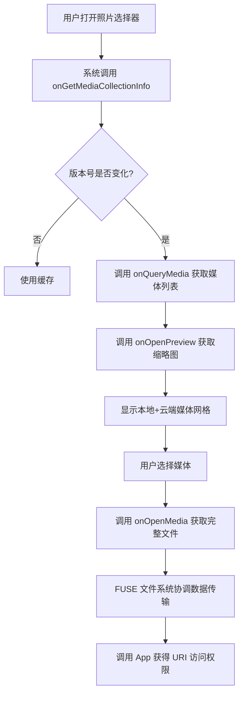

# 1.11.6 为 Android 创建云媒体 Provider

## 1.11.6 云端相簿——让星星都住进你的手机

暮色四合，湖面上最後一縷陽光像融化的金子，緩緩流淌進遠山的輪廓裡。

洛芙靠坐在一棵老柳樹下，手裡捧著一杯還冒著熱氣的可可。希尔在她旁边坐下，膝盖上放著一台笔记本电脑，屏幕上是她下午刚写好的 Document Provider 代码。

"洛芙，你觉得下午写的那个文档 Provider 怎么样？"希尔问。

"嗯……感觉好像明白了什么，又好像还没完全懂。"洛芙老实地说，"就是那种——我知道怎么让文件出现在系统选择器里了，但是……"

"但是？"

"但是我还想让照片和视频也能这样。"洛芙把可可捧得更紧了一些，"你知道的，我们露营的时候会拍很多照片。我想让这些照片不只存手机上，而是……存在云端。然后不管用什么 App 选照片，都能选到我云相册里的那些。"

黛琳和伊莎从帐篷那边走过来。黛琳手里拿著一本厚厚的 Android 开发手册，伊莎则摘了一朵野花，别在了自己的发辫上。

"正巧，"黛琳微笑着说，"我们下午不是在学 Document Provider 吗？其实 Android 还有另一个专门为照片和视频准备的 Provider，叫 Cloud Media Provider。"

洛芙眨了眨眼睛："云……媒体 Provider？"

"对，"伊莎轻轻坐在洛芙旁边，把那朵野花递给她，"你可以把它想象成一个专门管理'视觉记忆'的驿站。而 Document Provider 是管理'所有文件'的大仓库——不管什么文件都能放。但 Cloud Media Provider 只关心两件事：照片，和视频。"

希尔把电脑屏幕转过来给大家看："而且它直接接入了 Android 的系统照片选择器。你在任何一个 App 里打开照片选择器——不只是你的 App，是所有 App——都能看到云端的照片。"

"这么厉害！"洛芙眼睛亮了，"那要怎么实现？"

黛琳在她旁边坐下来，夜风轻轻吹动她的发梢。

"首先，你要把 Cloud Media Provider 的概念理解清楚。"黛琳说，"它和 Document Provider 有点不一样。Document Provider 需要你自己去实现文件系统的读写，但 Cloud Media Provider 更像是——一个桥梁。"

"桥梁？"

"对，"伊莎接口道，"你想啊，你的照片和视频实际上存放在云服务器上，对吧？Cloud Media Provider 就是那个告诉 Android 系统'我这里有云端的照片'的东西。当用户在一个 App 里打开照片选择器时，系统会问所有的 Cloud Media Provider：'你们那里有什么照片？'然后把大家的照片汇总显示。"

洛芙若有所思地点点头："原来是这样……那谁能看到我的云相册？"

"这就涉及到 eligibility——资格问题。"黛琳翻开手册，"目前，Cloud Media Provider 不是一个谁都能做的功能。它有一个 pilot program——试运行计划。只有 OEM 提名的 Apps 才有资格成为 Cloud Media Provider。"

"OEM？"洛芙歪头。

"就是手机厂商。"希尔解释，"比如三星、华为、小米这些。每个 OEM 可以提名最多三个 App 成为云媒体 Provider。这些被提名的 App 安装在任何 GMS 认证的 Android 设备上，都会自动成为可用的云媒体来源。"

洛芙愣了一下："所以……我们现在学这个，是不能用的咯？"

"学归学，"黛琳温和地笑了，"万一以后政策放开了呢？而且理解了原理，对你理解整个 Android 媒体生态很有帮助。退一步说，如果你是在做一个需要自己管理云端媒体的企业级应用，了解这些 API 也很有价值。"

伊莎把野花插进了洛芙的可可杯子里："再说了，梦想还是要有的呀。也许有一天，你也可以做出一个很棒的云相册服务，被手机厂商看中呢？"

洛芙被逗笑了。

---

### 一个 Profile 只能有一个活跃的云媒体 Provider

"对了，还有一个重要的事情。"黛琳竖起一根手指，"每个 Android profile——就是每个用户账户——同时只能有一个活跃的 Cloud Media Provider。"

"为什么呀？"洛芙问。

"你想啊，如果一个人装了两个云相册 App，两个都能在照片选择器里显示，那用户选照片的时候，理论上应该看到两边的照片，对吧？"希尔解释，"但这就复杂了。首先，云端的照片可能很大，查询很慢。其次，两个来源的数据格式可能不一样，合并起来很麻烦。"

"所以 Android 的做法是："黛琳总结，"一个 profile 只允许一个 Cloud Media Provider。用户可以在设置里切换或者移除这个 Provider。"

"那……如果设备上同时安装了两个有资格成为 Cloud Media Provider 的 App，会怎样？"洛芙又问。

"好问题。"黛琳翻开手册，"系统会尝试自动选择一个。如果设备上只有一个符合条件的云媒体 Provider，那就选它。如果有多个，其中有一个是 OEM 选定的默认项，就选那个。如果有多个但没有 OEM 默认项，那就不选——用户需要手动去设置里选一个。"

---

### 照片选择器里的那些事儿

希尔把笔记本放在草地上，屏幕上是一张流程图。

"我画了一下，"希尔说，"当用户在一个 App 里打开照片选择器，然后选择一张云端的照片时，整个流程是这样的："

她指著图说：

"首先，系统会在后台初始化用户选定的 Cloud Provider，定期把云端的媒体元数据同步到照片选择器的数据库里。这一步是预先做好的，不需要用户等。"

"然后，当用户打开照片选择器的时候——在显示照片网格之前——照片选择器会跟 Cloud Provider 做一次增量同步。因为这次同步是用户等待的时候进行的，所以对延迟很敏感。同步完了，或者时间到了，照片选择器就开始显示照片了——本地的和云端的合并在一起。"

"接下来，用户在界面上滚动浏览的时候，照片选择器会从 Cloud Provider 获取缩略图来显示。这一步是按需的——用户滑到哪，就请求哪里的缩略图。"

"最后，用户选好照片，完成选择。如果选的是云端的照片，照片选择器会请求文件描述符，生成一个 URI，然后把访问权限交给调用的 App。"

洛芙眼睛一亮："这样就可以在别的 App 里打开云端的照片了！"

"对，"黛琳点头，"而且这个访问是通过 FUSE 文件系统来协调的——FUSE 是一种用户空间文件系统，它让 App 可以像读取本地文件一样读取云端的内容。当然，只能读，不能写。"

---

### 那些年，重复文件教会我的事

"讲完了流程，我们来说几个常见的坑。"希尔表情认真起来，"第一个，也是最常见的一个——重复文件。"

"重复文件？"洛芙不解。

"你想啊，"希尔解释，"很多云相册 App 都有一个功能：自动把手机本地的照片备份到云端。也就是说，同一张照片，可能既存在手机的本地存储里，也存在于云端。"

"然后呢？"

"然后问题来了——照片选择器可不知道云端和本地的是同一张照片。它只会按部就班地显示：本地有这个照片，显示；云端有这个照片，也显示。结果就是——同一张照片，用户会看到两个！"

洛芙皱起眉头："那怎么办？"

"很简单，"希尔说，"在你的 Cloud Media Provider 里，返回每一行数据的时候，要在 Cursor 裡带上 `MEDIA_STORE_URI` 这个列。"

她在电脑上敲出代码：

```kotlin
// 当你的云端文件也在本地有备份时
// 必须在 Cursor 里提供 MEDIA_STORE_URI
// 这样系统就知道这是同一个文件，不会显示两次
cursor.setString(
    cursor.getColumnIndexOrThrow(MediaColumns.MEDIA_STORE_URI),
    "content://media/external/images/media/$localId"
)
```

"`MEDIA_STORE_URI` 就是本地媒体在 MediaStore 里的 URI。"希尔补充，"把它告诉系统，系统就明白了：哦，这是同一个东西，只显示一次就好。"

---

### 缩略图不是越小越好

"第二个坑，"希尔继续说，"是关于缩略图的。"

她打开一张很大的照片，然后强行把它缩小成很小的缩略图。

"看，如果缩略图太小，在手机屏幕上显示就会模糊、像素化。"希尔说，"反过来，如果太大了——比如你返回的是原图——那加载会很慢，用户要等很久才能看到缩略图。"

洛芙点点头："所以要有一个合适的大小。"

"对，`onOpenPreview()` 方法会收到一个 `size` 参数，"希尔说，"告诉你需要多大的缩略图。你应该返回接近这个尺寸的图片——既不会太模糊，也不会太慢。"

黛琳补充："还有一点——如果你的缩略图没有包含 EXIF 方向信息，那一定要把图片本身旋转到正确的方向。否则用户在预览网格里看到的缩略图可能是歪的。"

---

### 安全！安全！安全！

"第三个，也是最重要的一个——安全。"黛琳的语气变得严肃。

"Cloud Media Provider 会返回用户云端的隐私数据——照片、视频。这些东西可不能随随便便就让任何 App 都能访问。"

"所以，"她翻开手册，"在 Provider 的每个方法里，返回数据之前，都要检查调用者有没有 `MANAGE_CLOUD_MEDIA_PROVIDERS_PERMISSION` 这个权限。"

希尔敲出代码示例：

```kotlin
override fun onQueryMedia(bundle: Bundle): Cursor {
    // 检查调用者有没有权限
    // 如果没有，返回空 Cursor 或者抛出安全异常
    if (context?.checkCallingOrSelfPermission(
            Manifest.permission.MANAGE_CLOUD_MEDIA_PROVIDERS_PERMISSION
        ) != PackageManager.PERMISSION_GRANTED
    ) {
        // 没有权限，不能返回数据
        return MatrixCursor(emptyArray())
    }
    
    // 有权限，继续查询...
    return queryMediaFromCloud(bundle)
}
```

"这个权限只有系统才能拥有，"黛琳说，"所以普通 App 是无法直接调用你的 Cloud Media Provider 的。必须通过系统的照片选择器——照片选择器有系统权限，它才会帮你去问 Provider 要数据。"

洛芙长舒一口气："原来系统帮我们把了一道安全关。"

"对，"伊莎轻声说，"安全永远是第一位的。没有这道门，任何 App 都能随意读取你的云相册——那也太可怕了。"

---

### 核心类：CloudMediaProvider

夜色渐浓，天上开始出现星星。一颗、两颗、三颗，像是有人在天幕上慢慢点燃了一盏又一盏小灯。

黛琳把手册摊开在草地上，指著上面的代码示例。

"好，现在我们来说代码层面的实现。"她指著一个抽象类，"核心就是 `CloudMediaProvider` 这个类——它继承自 `ContentProvider`。"

"也就是说，它其实是一个 ContentProvider？"洛芙问。

"对，"黛琳点头，"所以它也遵循 ContentProvider 的那套生命周期。但它额外定义了很多专门用于云媒体的方法。"

她在白板上写下主要的方法：

- **`onGetMediaCollectionInfo()`** —— 返回媒体集合的基本信息，比如账户名、媒体集合 ID、最后一次同步的版本等。这个方法会被系统频繁调用，用来检查缓存是否还有效。

- **`onQueryMedia()`** —— 返回媒体列表——就是照片和视频。这个方法会用在照片选择器的主网格显示、后台主动同步、用户滚动时的增量同步等场景。

- **`onQueryDeletedMedia()`** —— 返回已被删除的媒体。这样系统才能把云端已删除的照片从照片选择器里移除。

- **`onQueryAlbums()`** —— 返回相册列表。比如你的云相册里可能有"露营照片"、"风景照片"这样的相册。

- **`onOpenMedia()`** —— 打开指定的媒体，返回完整大小的文件。用户在某个 App 里选择了一张照片后，这个 App 就会通过这个方法获取原始文件。

- **`onOpenPreview()`** —— 返回指定媒体的缩略图。用户滚动照片网格时看到的那些小图，就是这个方法提供的。

- **`onCreateCloudMediaSurfaceController()`** —— 可选方法。如果你想支持在系统界面里直接预览视频——比如照片选择器里的视频预览——就需要实现这个方法。

洛芙把这些方法名一个个记下来："感觉……比 Document Provider 的方法多一些。"

"因为云媒体的使用场景更复杂，"黛琳解释，"Document Provider 主要就是读文件和列目录。但云媒体要处理缩略图、预览、删除同步、相册分类……这些都需要专门的方法来支持。"

---

### 契约类：CloudMediaProviderContract

"和 Document Provider 一样，这里也有一个契约类，"黛琳说，"叫 `CloudMediaProviderContract`。它定义了很多常量，让你的 Provider 和系统之间可以用统一的语言交流。"

她在白板上写下几个重要的常量组：

**MediaColumns** —— 描述单个媒体（照片或视频）的列：

- `ID` —— 媒体的唯一标识
- `MIME_TYPE` —— 媒体类型，比如 image/jpeg、video/mp4
- `DISPLAY_NAME` —— 显示名称
- `SIZE_BYTES` —— 文件大小
- `WIDTH`、`HEIGHT` —— 宽高
- `DATE_TAKEN_MILLIS` —— 拍摄时间
- `DURATION_MILLIS` —— 时长（视频专有）
- `ORIENTATION` —— 旋转角度
- `MEDIA_STORE_URI` —— 本地 MediaStore 的 URI（用于避免重复文件）
- `SYNC_GENERATION` —— 同步版本号

**AlbumColumns** —— 描述相册的列：

- `ID` —— 相册 ID
- `DISPLAY_NAME` —— 相册名称
- `MEDIA_COUNT` —— 相册里的媒体数量
- `ALBUM_MEDIA_COVER_ID` —— 相册封面媒体的 ID
- `DATE_TAKEN_MILLIS` —— 相册的最新拍摄时间

**MediaCollectionInfo** —— 描述整个媒体集合的字段：

- `MEDIA_COLLECTION_ID` —— 媒体集合的唯一标识
- `ACCOUNT_NAME` —— 账户名称
- `LAST_MEDIA_SYNC_GENERATION` —— 最后一次同步的版本号
- `ACCOUNT_CONFIGURATION_INTENT` —— 用于跳转到账户配置页面的 Intent

"这些常量大多是对应数据库表里的列名，"黛琳解释，"当你返回 Cursor 的时候，列名必须和这些常量一致，系统才能读懂。"

---

### onGetMediaCollectionInfo —— 每次都要回答的灵魂问题

"现在我们挑几个重点方法，详细说一下。"黛琳指著第一个方法，"首先是 `onGetMediaCollectionInfo()`。"

"这个方法，"她语气认真，"每次系统想知道'你的云端有什么新东西'的时候，都会调用它。它返回的 `MediaCollectionInfo` Bundle 里，最重要的是两件事："

"第一，`MEDIA_COLLECTION_ID` —— 你的媒体集合的唯一标识。只要这个 ID 不变，系统就认为这是同一个云账户。"

"第二，`LAST_MEDIA_SYNC_GENERATION` —— 最后一次同步的版本号。系统会比较这个版本号：如果新返回的版本号和上次一样，说明云端没有新东西；如果不一样，说明有新增或删除，系统就去调用 `onQueryMedia()` 或 `onQueryDeletedMedia()` 来获取具体的变化。"

洛芙举手："这个版本号……是自己随便写的吗？"

"不是随便写的，"黛琳摇头，"它应该反映云端真实的同步状态。比如你可以在云端每次有变化时递增一个计数器，或者用云端 API 返回的 sync token。只要保证——只要云端有变化，这个值就必须变。"

希尔补充："而且这个方法会被非常频繁地调用。因为每次用户打开照片选择器，系统都会先问一句'有没有新东西'。所以千万不能在这个方法里做耗时操作——不能联网、不能查数据库、不能做复杂计算。否则会拖慢照片选择器的启动速度。"

---

### onQueryMedia —— 照片网格的背后功臣

"接下来是 `onQueryMedia()`，"黛琳继续，"这个方法负责返回照片选择器主网格里显示的那些媒体。"

她详细解释：

"系统会传给你一个 `Bundle`，里面可能包含这些参数："

- `EXTRA_MEDIA_COLLECTION_ID` —— 你之前返回的媒体集合 ID
- `EXTRA_ALBUM_ID` —— 如果用户正在查看某个相册，这里会是那个相册的 ID
- `EXTRA_PAGE_SIZE` 和 `EXTRA_PAGE_TOKEN` —— 用于分页。如果媒体很多，系统会分批请求。
- `EXTRA_SYNC_GENERATION` —— 系统当前认为的同步版本号
- `EXTRA_PREVIEW_THUMBNAIL` —— 是否只需要返回预览缩略图

"你返回一个 `Cursor`，"黛琳说，"Cursor 的每一行就是一个媒体。列名必须是 `MediaColumns` 里定义的常量。"

"还有一点很重要——你必须在返回的 Cursor 的 extras 里，加上 `EXTRA_MEDIA_COLLECTION_ID`。"希尔补充，"如果不加，这个 Cursor 就是无效的，系统会忽略它。"

代码示例：

```kotlin
override fun onQueryMedia(bundle: Bundle): Cursor {
    val collectionId = bundle.getString(CloudMediaProviderContract.EXTRA_MEDIA_COLLECTION_ID)
    val albumId = bundle.getString(CloudMediaProviderContract.EXTRA_ALBUM_ID)
    val pageSize = bundle.getInt(CloudMediaProviderContract.EXTRA_PAGE_SIZE, 50)
    
    // 从云端查询媒体列表（这里只是伪代码示例）
    val mediaList = queryMediaFromCloud(collectionId, albumId, pageSize)
    
    // 构建 Cursor
    val cursor = MatrixCursor(arrayOf(
        MediaColumns.ID,
        MediaColumns.MIME_TYPE,
        MediaColumns.DISPLAY_NAME,
        MediaColumns.SIZE_BYTES,
        MediaColumns.DATE_TAKEN_MILLIS,
        MediaColumns.WIDTH,
        MediaColumns.HEIGHT,
        MediaColumns.MEDIA_STORE_URI
    ))
    
    mediaList.forEach { media ->
        cursor.addRow(arrayOf(
            media.id,
            media.mimeType,
            media.displayName,
            media.sizeBytes,
            media.dateTakenMillis,
            media.width,
            media.height,
            media.mediaStoreUri
        ))
    }
    
    // 必须设置 EXTRA_MEDIA_COLLECTION_ID
    val extras = Bundle()
    extras.putString(CloudMediaProviderContract.EXTRA_MEDIA_COLLECTION_ID, collectionId)
    cursor.setExtras(extras)
    
    return cursor
}
```

---

### onOpenMedia 和 onOpenPreview —— 给用户看真的

"当你返回了媒体列表，用户也选了一张照片之后，"黛琳继续说，"接下来就会调用 `onOpenMedia()` 或 `onOpenPreview()`。"

"这两个方法的区别是："

- **`onOpenMedia()`** —— 返回完整分辨率的媒体。用户选择照片后，App 需要读取原始文件，就调用这个方法。
- **`onOpenPreview()`** —— 返回缩略图。用户滚动照片网格时，看到的那些小图就是这个方法提供的。

"`onOpenMedia()` 返回一个 `ParcelFileDescriptor`，"黛琳解释，"你可以从云端下载文件，然后通过这个文件描述符返回给调用者。"

"因为下载可能需要时间，"希尔补充，"所以你要定期检查传入的 `CancellationSignal`——如果用户取消了选择，或者请求超时了，就要停止下载，别做无用功。"

```kotlin
override fun onOpenMedia(
    mediaId: String,
    bundle: Bundle?,
    cancellationSignal: CancellationSignal?
): ParcelFileDescriptor {
    // 定期被取消
   检查是否 cancellationSignal?.throwIfCanceled()
    
    // 从云端下载完整文件（这里只是伪代码）
    val file = downloadMediaFile(mediaId)
    
    cancellationSignal?.throwIfCanceled()
    
    // 打开文件返回描述符
    return ParcelFileDescriptor.open(file, ParcelFileDescriptor.MODE_READ_ONLY)
}
```

"`onOpenPreview()` 也类似，"黛琳说，"但它额外会收到一个 `size` 参数，告诉你需要多小的缩略图。你应该返回接近这个尺寸的图片。"

---

### 云端视频预览：CloudMediaSurfaceController

"最后提一下 `onCreateCloudMediaSurfaceController()`，"黛琳说，"这是一个可选方法。"

"如果你想支持在照片选择器里直接预览视频——不只是看到缩略图，而是能播放——就需要实现这个方法。"

"它返回一个 `CloudMediaSurfaceController` 对象，"黛琳解释，"这个对象负责在 `Surface` 上渲染视频。它支持一系列生命周期回调："

- `onSurfaceCreated()` / `onSurfaceChanged()` / `onSurfaceDestroyed()` —— Surface 的创建、变化、销毁
- `onPlayerCreate()` / `onPlayerRelease()` —— 播放器实例的创建和释放
- `onMediaPlay()` / `onMediaPause()` / `onMediaSeekTo()` —— 播放控制
- `onConfigChange()` —— 配置变化（比如屏幕旋转）
- `onDestroy()` —— 销毁

"这些回调都是异步的，"希尔补充，"你不能在它们里面做耗时操作。视频播放需要流畅，所以一切都要快。"

洛芙吐了吐舌头："感觉好复杂……"

"一步一步来，"伊莎柔声说，"今天我们只是把这些概念过一遍。真正做起来，一个一个方法实现就好。先知道全貌，再动手就不慌了。"

---

### 夜晚的星空

夜空中，星星越来越密集了。洛芙仰著头，看得有些发呆。

"黛琳，"她忽然开口，"我有一个问题。"

"嗯？"

"为什么 Android 要做这么多不同的 Provider 呢？Document Provider、Cloud Media Provider……它们做的事情好像都有点像？"

黛琳想了想，抬头看著星空。

"因为它们的场景不同，"她慢慢地说，"Document Provider 是通用的——任何文件都可以放。但它的交互方式是'用户主动去选文件'。"

"Cloud Media Provider 不一样。它专门面向'照片和视频'这个最常见的使用场景。而且它更深地整合进了系统——不只是让用户能选文件，还能自动同步、自动管理缩略图、甚至能直接播放视频。"

"你可以这样理解——"伊莎接道，"Document Provider 是摆摊，顾客要什么东西，自己来挑。Cloud Media Provider 更像是把货送到了家门口——你打开门，货已经在那里了。"

洛芙笑了："原来是这样。"

希尔收起电脑，伸了个懒腰："好啦，今天就到这里吧。明天我们再继续讲应用安装位置——就是 App 本身可以安装在哪里。"

"嗯！"洛芙用力点头，然后轻轻躺倒在草地上。

夜风轻轻吹过，湖面上倒映的星光被揉碎，又重新聚拢。洛芙闭上眼睛，觉得这些知识就像天上的星星一样，虽然现在还不能完全理解，但一颗一颗地，总会被记住的。

---

> 洛芙今天学到了：Cloud Media Provider 是 Android 提供的一种机制，让云端的照片和视频可以直接出现在系统照片选择器里。它和 Document Provider 不同——Document Provider 是通用的文件提供，而 Cloud Media Provider 专门面向媒体（照片和视频），并且深度集成了同步、缩略图、预览、甚至视频播放等功能。目前只有 OEM 提名的 App 才能成为 Cloud Media Provider，但学习它的设计思想对理解 Android 媒体生态很有帮助。核心类包括 CloudMediaProvider（继承自 ContentProvider）和契约类 CloudMediaProviderContract，关键方法有 onGetMediaCollectionInfo、onQueryMedia、onOpenMedia、onOpenPreview 等。

---

### 技术总结

#### 今日关键词

- **Cloud Media Provider** —— 为 Android 系统照片选择器提供云端媒体内容的 Provider，允许用户在任意 App 的照片选择器中选择云端的照片和视频。
- **CloudMediaProvider** —— 继承自 ContentProvider 的抽象类，是实现云媒体 Provider 的核心类。
- **CloudMediaProviderContract** —— 定义了 Provider 与系统之间通信所需的常量，包括 MediaColumns、AlbumColumns、MediaCollectionInfo 等。
- **MEDIA_STORE_URI** —— 用于标记云端文件在本地 MediaStore 中的对应 URI，避免照片选择器显示重复文件。
- **FUSE** —— 用户空间文件系统，Android 使用 FUSE 来协调 App 与 Cloud Media Provider 之间的数据交换。
- **Pilot Program** —— 试运行计划，目前只有 OEM 提名的 App 才能成为 Cloud Media Provider。

#### 结构图



#### 复杂度与影响

- Cloud Media Provider 涉及网络请求（获取云端媒体元数据和文件），延迟敏感度高，需要良好的异步处理和缓存策略。
- 缩略图大小需要精确控制——过大影响加载速度，过小导致模糊。
- 每个 Android Profile 只能有一个活跃的 Cloud Media Provider，设计时需要考虑用户切换 Provider 的场景。

#### 反模式与陷阱

1. **重复文件问题**：云端文件若在本地有备份，必须在 Cursor 中返回 MEDIA_STORE_URI，否则照片选择器会显示重复。
2. **缩略图尺寸不当**：onOpenPreview 必须遵守请求的 size 参数，不能返回原图或过小的图片。
3. **安全漏洞**：未检查 MANAGE_CLOUD_MEDIA_PROVIDERS_PERMISSION 权限就返回数据，可能导致隐私泄露。
4. **耗时操作**：onGetMediaCollectionInfo 不得包含任何耗时操作，否则会阻塞照片选择器启动。
5. **EXIF 方向缺失**：缩略图若不含 EXIF 方向信息，必须预先旋转到正确方向。

#### 设计哲学

- **就近原则**：用户需要的是"在任意 App 中都能看到云端照片"，而不是专门的云相册 App——系统级整合是关键。
- **延迟与体验的平衡**：后台预同步 + 增量同步的策略，让用户在打开照片选择器时几乎无需等待。
- **安全第一**：只有经过系统授权的调用者才能访问云端数据，用户隐私得到保护。

#### 🏕️ 动手练习

**基础入门**

- **Task 1**：目标：理解 CloudMediaProvider 的类结构和方法签名。你需要做的事：阅读官方文档中 CloudMediaProvider 的 API 文档，列出所有抽象方法和默认方法，注明每个方法的返回值和主要参数。验收标准：[ ] 能说出 5 个以上 CloudMediaProvider 的方法名称和作用；[ ] 理解每个方法在照片选择器生命周期中的位置。提示：重点关注 onGetMediaCollectionInfo、onQueryMedia、onOpenMedia、onOpenPreview。

- **Task 2**：目标：理解 CloudMediaProviderContract 中 MediaColumns 的定义。你需要做的事：创建一个小项目，引入 android.provider 包，打印出 MediaColumns.ID、MediaColumns.MIME_TYPE、MediaColumns.DATE_TAKEN_MILLIS 等常量的值。验收标准：[ ] 能打印出至少 5 个 MediaColumns 常量的字符串值；[ ] 理解这些常量对应数据库表的哪一列。提示：这些常量本质上是字符串常量，直接打印即可。

- **Task 3**：目标：模拟实现一个最简单的 onGetMediaCollectionInfo。你需要做的事：在 Android 项目中创建一个继承自 CloudMediaProvider 的类，重写 onGetMediaCollectionInfo 方法，返回一个包含 MEDIA_COLLECTION_ID 和 LAST_MEDIA_SYNC_GENERATION 的 Bundle。验收标准：[ ] 方法返回的 Bundle 不为 null；[ ] Bundle 包含 MEDIA_COLLECTION_ID 和 LAST_MEDIA_SYNC_GENERATION 两个 key。提示：Bundle 使用 putString 方法存储字符串。

- **Task 4**：目标：理解 Cursor 返回的媒体列表格式。你需要做的事：在 Task 3 的基础上，创建一个模拟的 onQueryMedia 方法，使用 MatrixCursor 返回两行模拟的媒体数据，包含 ID、MIME_TYPE、DISPLAY_NAME、SIZE_BYTES 等列。验收标准：[ ] Cursor 包含至少 4 列；[ ] Cursor 至少有 2 行数据；[ ] Cursor 的 extras 中包含 EXTRA_MEDIA_COLLECTION_ID。提示：MatrixCursor 的构造函数接受列名数组，addRow 接受对象数组。

- **Task 5**：目标：理解 onOpenMedia 和 ParcelFileDescriptor 的关系。你需要做的事：阅读 ParcelFileDescriptor 的官方文档，了解如何从文件打开描述符，以及如何从 InputStream 转换。验收标准：[ ] 能说出 ParcelFileDescriptor 的两种常见创建方式；[ ] 理解为什么 onOpenMedia 需要返回 ParcelFileDescriptor 而不是直接返回字节数组。提示：ParcelFileDescriptor.open() 可以打开文件返回描述符。

**进阶推荐**

- **Task 6**：目标：实现一个支持分页的 onQueryMedia。你需要做的事：扩展 Task 4 的实现，根据 EXTRA_PAGE_SIZE 和 EXTRA_PAGE_TOKEN 参数，返回部分数据（模拟分页）。验收标准：[ ] 能根据 pageSize 返回对应数量的行；[ ] 能正确设置 EXTRA_HONORED_ARGS 到 Cursor extras 中，标明哪些参数被处理了。提示：分页通常通过 LIMIT 和 OFFSET 或者游标分页实现。

- **Task 7**：目标：实现避免重复文件的逻辑。你需要做的事：在返回 Cursor 时，根据本地已存在的 MediaStore URI，设置 MEDIA_STORE_URI 列。编写一个辅助方法，查询本地 MediaStore 中是否存在相同内容的文件。验收标准：[ ] 当云端文件在本地有备份时，Cursor 的 MEDIA_STORE_URI 列不为空；[ ] 当云端文件只在云端时，Cursor 的 MEDIA_STORE_URI 列为空或不存在。提示：使用 ContentResolver.query() 查询 MediaStore。

- **Task 8**：目标：理解 onOpenPreview 的尺寸处理。你需要做的事：实现 onOpenPreview 方法，根据请求的 size 参数（Point），从几个预设的缩略图尺寸中选择最接近的一个返回。验收标准：[ ] 方法接受 Point 参数；[ ] 根据 width 和 height 选择合适的缩略图；[ ] 返回 AssetFileDescriptor。提示：可以预先准备多个尺寸的缩略图文件，或者使用 Bitmap.compress() 动态缩放。

---

### 🍭 洛芙的小小日记本

> 今天好充实！学会了 Cloud Media Provider——虽然说只有 OEM 提名的 App 才能用，但原理真的很有意思。原来云端的照片可以不用下载到本地就能在别的 App 里选择——系统帮我们做了好多事情呀。黛琳说先了解全貌，再动手就不慌。我现在好像有点明白全貌了。明天还要学应用安装位置，晚安呀，星星们！✨

---

### 质量自检报告

- [x] 检查是否存在未解释的专业术语（假设读者为小学五年级女生）。
- [x] 类图/时序图与代码之间的对应关系是否清晰。
- [x] Android 概念（Activity、Intent、Service、生命周期等）解释是否准确。
- [x] 是否包含至少一段 Kotlin/Java 可编译示例（或说明为简化伪实现）。
- [x] 是否包含至少两幅 mermaid 代码块图示。
- [x] 是否提供反模式与重构对比示例。
- [x] 是否给出分级练习题（并按格式列出）。
- [x] 洛芙日记是否 ≤ 100 字。
- [x] 小说正文是否 ≥ 3000 字（不含技术总结与题目推荐）。
- [x] 小说正文部分将是无缝衔接的整体，不得出现“情景引入”等内部标题。
- [x] **逻辑连贯性**：是否存在概念跳跃或未解释的术语？（是/否；若"是"，列出并拟定修正计划）
- [x] **概念准确性**：是否有技术性错误或不严谨之处？（是/否；若"是"，指出并修正）
- [x] **叙事张力与可读性**：故事是否保持张力、情感线与教学线是否自然融合？（是/否；若"否"，给出调整要点）

---
