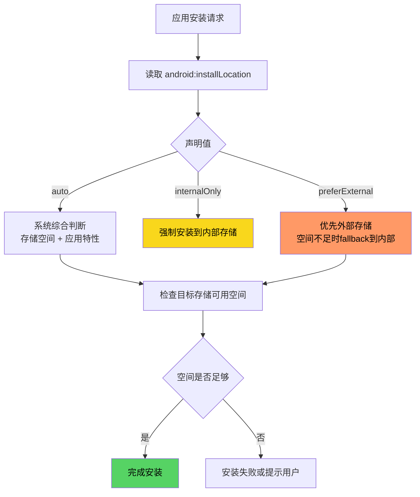
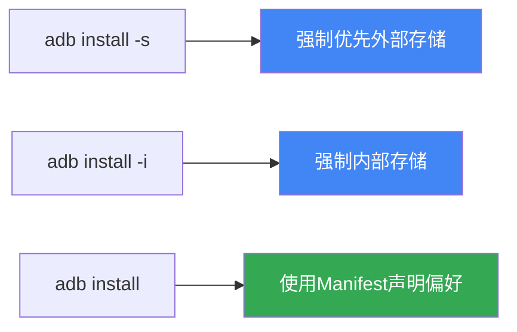

# 1.12.1 应用安装位置

春雨又开始下了。

不是瓢泼大雨，只是细细密密的雨丝，像谁在天上抖落了一把银针。帐篷顶传来轻微的"沙沙"声，节奏均匀，听着听着就让人犯困。

洛芙把睡袋裹紧了一些，缩在帐篷角落里，手里捧着一杯希尔刚才递过来的热可可。蒸汽在潮湿的空气里散得很慢，但那股甜丝丝的香气还是钻进鼻腔，让困意稍稍退了一些。

"下这么大雨，今天还去爬山吗？"洛芙吸了吸鼻子，朝帐篷外努了努嘴。

帐篷外传来一阵窸窣的脚步声，接着是希尔的声音："雨不大，就是毛毛雨！天气预报说中午就停——"

"希尔，别立旗子。"黛琳的声音不紧不慢。

"天气预报说的是英文版吗？"伊莎的声音从另一边传来，带着一点笑意。

希尔钻进帐篷，身上沾着细密的雨珠，头发湿漉漉地贴在额头上。她把手机屏幕亮给大家看："你们看，果不其然——"

屏幕上是一个露营App的更新提示框。

"手机存储空间不足，无法安装更新。"洛芙凑过去念道，"啊，这个我遇到过！之前在公司手机上也弹过这个——后来只能删了好多照片才能装上……"

"你看，这就是今天的正题。"黛琳放下手里的白板笔，从背包里抽出一块干净的白色板子，在膝盖上架好。雨声成了她最好的背景音。

"先别讲这个了吧，"希尔拍了拍洛芙的肩膀，"好不容易下雨，在帐篷里待着多舒服。"

"就是因为下雨，才正好讲讲应用安装位置这件事。"黛琳笑了笑，"你看，更新装不上，表面是存储空间问题，但核心是我们对应用安装位置一无所知。"

洛芙把热可可捧在掌心，温热的触感从指尖传到手掌。她歪着头问："安装位置？应用不是装上就完了吗，还有位置可选？"

"当然有。"黛琳用白板笔在板子上画了一个小圆圈，"安卓系统里，应用可以装在两个地方——内部存储，或者外部存储。"

"内部存储就是手机出厂时自带的那块存储芯片，"伊莎补充道，她盘腿坐在睡袋上，声音轻柔，"外部存储呢，可以是一张SD卡，也可以是手机厂商划分出来的一块存储区域……就像你的行李箱，最底层和挂在外面兜里的区别。"

"最底层的东西最安全，拿出来最麻烦。"黛琳点头，"这个比喻很准确。内部存储里的应用最安全，但读取快、运行也快，不过空间有限——就像你手机自带的存储，总是很快就被塞满。外部存储能装更多，但读取速度会受硬件影响。"

"那我们什么时候可以选？"洛芙问。

"三步走。"黛琳竖起三根手指，"第一步，在写代码的时候，在 AndroidManifest.xml 里声明你想装在哪里。第二步，通过 adb 命令安装时指定位置。第三步——如果你用的是老系统，还可以通过设置界面手动迁移。"

希尔已经把笔记本打开了，屏幕被帐篷里昏黄的营灯照得有些发白。"第二步我最喜欢，直接用命令行说了算——比如 `adb install -s <apk路径>`，加个 `-s` 参数，系统就会尝试把应用装到外部存储。"

"如果外部存储满了或者不可用呢？"洛芙问。

"系统会fallback到内部存储。"黛琳说，"`preferExternal`只是偏好，不是强制。但如果你声明的是`internalOnly`——那就算外部空间空着十GB，它也只会塞进内部存储。"

伊莎轻轻笑了一声："就像有些人认床，就算旅馆房间再宽敞，他只睡靠墙的那一角。"

"internalOnly的应用，系统会认为它'必须待在这块地方'，永远不会请求迁移到SD卡。"黛琳在白板上写下三个词：auto、internalOnly、preferExternal，"auto是默认值，系统自己决定，大多数应用用这个就好。internalOnly是安全优先的程序用的，比如银行应用，它们的数据太敏感，不能到处跑。preferExternal是那些'大块头'用的——视频编辑工具、游戏，它们体积大，内部存储装不下。"

"那我刚才那个露营App，应该设成什么？"洛芙指了指希尔的手机屏幕。

"你想装更新，得先腾出空间。"希尔已经开始敲命令行了，"`adb install -s ./camping-app-update.apk`，这样系统会优先把它塞进SD卡。"

"等等，"洛芙眨了眨眼，"我们不是在讲怎么设置安装位置吗？怎么变成装更新的方法了？"

"因为装上去的位置，和怎么装上去的，是两件事。"黛琳看着她，语气认真，"一个是声明偏好，一个是实际操作。声明偏好是开发者的活儿，决定装在哪里是运行时的活儿——adb install -s就是强制运行时优先使用外部存储。"

雨不知道什么时候停了。帐篷外传来一阵清脆的鸟叫，像是在报告雨停的消息。

"不过，"黛琳放下白板笔，声音沉下来了一点，"有一个重要的事你必须知道——Android 10以后，这个迁移的事情变了。"

希尔停下敲键盘的手，抬头看了黛琳一眼。

"Scoped Storage，"黛琳说，"安卓10开始引入的存储限制。简单来说，应用不能再随意往SD卡里写数据了——以前你的App可以往SD卡里塞一堆缓存文件，现在不行了。应用只能访问自己的专属目录，还有系统允许的公共区域。"

"那如果我声明了preferExternal呢？"洛芙问。

"声明还是会生效的，"黛琳说，"但迁移这件事不存在了——Android 10以上的设备，系统不支持把应用从内部存储挪到外部存储，也不支持反过来。因为外部存储的访问方式变了，不再是直接的文件系统路径，而是通过ContentProvider之类的方式。"

伊莎轻轻叹了口气："就像现在露营地的规定变了，以前可以在野外随便生火，现在只能在指定的炉子里烧。火还是那个火，但能烧的地方少了。"

"不过，"希尔接过话头，"Play Feature Delivery这个新方式是另一回事——它是App Bundle的一部分。应用打包成AAB格式上传到Play Store后，Google Play会根据用户的设备配置，只下载需要的模块。比如某些设备不需要某个语言包，就不下载；不需要某个高清纹理资源，就不下载。这样用户拿到的安装包体积更小，但安装位置这件事本身，还是由系统决定。"

"那开发者还能做什么？"洛芙问。

"能做的，就是声明清楚你的意图。"黛琳说，"在 AndroidManifest.xml 里加一行 `android:installLocation`。然后剩下的，交给系统。"

她转身在白板上写下了一行代码框：

```xml
<manifest xmlns:android="http://schemas.android.com/apk/res/android"
    android:installLocation="auto">
```

"这是最常见的写法，"黛琳指着屏幕，"auto是默认值，也是大多数情况下推荐的值。系统会综合考虑存储空间和应用特性，决定放在哪里。如果你的App真的很需要大空间，而且不依赖SD卡的特定文件路径，可以设成preferExternal。"

"如果我的App用到了内部存储的绝对路径呢？"希尔问。

"那就用internalOnly，"黛琳说，"强制锁在内部存储。比如你的App在Native层写了一些.so库文件，依赖于固定路径加载，那就不能用preferExternal——因为SD卡路径不固定，`System.loadLibrary()` 可能找不到文件。"

洛芙把空了的可可杯子放在一旁，双手抱着膝盖："所以总结一下——开发时声明，运行时分发，Android 10以后不支持迁移？"

"满分。"黛琳微微一笑。

"那PackageInstaller API呢？"希尔突然问，她的手指悬在键盘上方，"如果我要在我的App里实现'一键更新另一个App'的功能，需要在代码里调用安装流程——那个API怎么用？"

"你是说应用内更新？"黛琳歪了歪头。

"对，有些App会内置这个功能，比如游戏平台、手机管家。"希尔说，"它们需要调用系统的安装界面，让用户确认后安装包。那就不是adb命令行，而是PackageInstaller Intent。"

黛琳点点头："对，这里用的是 `ACTION_INSTALL_CONFIRMATION`，然后构造一个Intent跳转到系统的安装界面。"

她拿起笔，在白板角落快速写了一小段：

```kotlin
// 通过PackageInstaller API发起安装请求（Android 8+）
val packageInstaller = packageManager.packageInstaller
val params = PackageInstaller.SessionParams(
    PackageInstaller.SessionParams.MODE_FULL_INSTALL
)
val sessionId = packageInstaller.createSession(params)
val session = packageInstaller.openSession(sessionId)

// 将APK数据写入session（略）
// ...

// 确认安装，会启动系统安装界面让用户确认
val intent = Intent(Intent.ACTION_INSTALL_CONFIRMATION).apply {
    data = Uri.parse("package:${packageInfo.packageName}")
}
startActivity(intent)
```

"这里的核心是createSession和openSession，"黛琳说，"先创建一个安装会话，然后把APK数据流写进去，最后通过ACTION_INSTALL_CONFIRMATION这个Intent，让系统弹出安装确认界面。用户点了确认，系统才会真正执行安装。"

"这个API是给应用市场用的，"希尔补充道，"普通App一般不需要直接调用这个，除非你在做App Store或者OTA更新工具。"

洛芙听得有些发愣，手指无意识地在膝盖上画圈："感觉好复杂……"

"复杂归复杂，但核心概念很简单，"伊莎说，"记住两件事就好——第一，应用装在哪里，由Manifest里的installLocation和运行时环境共同决定；第二，Android 10以后，迁移这条路被堵上了，系统说什么就是什么。"

帐篷外的雨已经完全停了。希尔拉开帐篷的拉链，一股带着泥土和青草气息的清新空气立刻涌了进来。

"走走走！"希尔把笔记本往背包里一塞，"趁雨停了，去外面透透气！"

洛芙跟着她钻出帐篷，湿漉漉的草叶在脚下发出"唧唧"的声音。远处的山在雾气里若隐若现，雨后的阳光从云缝里漏下来，在草地上投下斑驳的光影。

"洛芙，你看，"伊莎站在她旁边，指着远处，"草地上那些水坑——"

"嗯？"

"就像手机的存储空间，"伊莎轻声说，"雨下下来的时候，水会自己找到低的地方填进去。系统分配存储空间，也是这样——哪有空位，就往哪里去。"

洛芙愣了一下，然后笑了："伊莎姐姐，你总是能把技术讲成诗。"

"那是她的本职工作。"黛琳从帐篷里探出头，嘴角带着一点笑意。

四个人的笑声在雨后的营地里回荡，惊起了草叶间一只休息的鸟雀。

---

## 专业技术总结

### 核心机制定义

**应用安装位置（Install Location）** — Android系统允许应用被安装到不同的存储分区。内部存储（Internal Storage）是手机自带的始终可用的存储区域，外部存储（External Storage）可以是SD卡或厂商划分的可移动存储区域。通过在AndroidManifest.xml中声明`android:installLocation`属性，开发者可以指定应用的安装位置偏好。

```xml
<!-- AndroidManifest.xml -->
<manifest xmlns:android="http://schemas.android.com/apk/res/android"
    android:installLocation="auto">
```

`installLocation`支持三个值：`auto`（系统决定，默认值）、`internalOnly`（强制内部存储）、`preferExternal`（优先外部存储）。

---

#### 结构图



**图1：应用安装位置决策流程**
系统在读取Manifest声明后，根据声明值和实际存储情况进行综合判断，最终决定安装位置。

---



**图2：ADB命令行的安装位置覆盖选项**
`adb install -s`强制优先使用外部存储，`adb install -i`强制使用内部存储，不带参数则遵循Manifest声明。

---

#### 复杂度与影响

| 安装位置 | 读取速度 | 存储安全性 | 迁移支持 | 适用场景 |
|---------|---------|-----------|---------|---------|
| internalOnly | 快 | 高（随设备） | 不可迁移 | 银行应用、含Native库的App |
| preferExternal | 慢（受SD卡速度影响） | 低（SD卡可移除） | Android 9及以下支持 | 大型游戏、视频编辑工具 |
| auto（默认） | 由系统决定 | 中等 | 系统自动管理 | 大多数普通应用 |

---

#### 反模式与陷阱

1. **声明preferExternal但依赖固定路径的Native库**  
   某些App使用`System.loadLibrary()`加载.so文件，若安装到SD卡，库文件路径不固定，`dlopen()`会失败。  
   **修复**：使用`internalOnly`，或改用`System.load()`配合`getLibraryDir()`动态获取路径。

2. **Android 10+仍尝试手动迁移应用**  
   旧代码中可能保留了"通过Settings界面迁移App到SD卡"的逻辑，但Android 10起系统已不支持此操作。  
   **修复**：移除迁移相关代码；对大体积App，考虑使用Play Feature Delivery或按需下载模块。

3. **误用adb install而不带参数导致安装失败**  
   当设备内部存储空间不足时，不带`-s`参数的`adb install`会直接失败，而不是尝试外部存储。  
   **修复**：在CI/CD脚本中根据存储情况选择`adb install -s`或`adb install -i`。

4. **auto值下系统仍把大App装入内部存储导致空间紧张**  
   `auto`只是"偏好"，系统可能仍把不紧急的大型App塞进内部存储。  
   **修复**：明确需要外部存储的App显式声明`preferExternal`；或在Play Console中配置安装位置偏好。

5. **SD卡被移除后应用数据丢失**  
   `preferExternal`的应用若SD卡被拔出，对应的应用数据会丢失。  
   **修复**：关键数据不要依赖外部存储的相对路径，使用内部存储或ContentProvider中转。

---

#### 设计哲学

**存储位置的分层设计** — Android的应用安装位置机制体现了"安全与便利的权衡"哲学：

1. **内部存储优先安全**：系统分区与设备强绑定，应用数据不易因介质移除而丢失，但空间有限。
2. **外部存储优先容量**：SD卡可扩展存储容量，但读取速度受硬件限制，且介质可移除带来数据风险。
3. **Manifest声明体现开发者意图**：通过显式声明，开发者告诉系统其优先级；系统在此基础上结合实际环境做最终决策。
4. **Scoped Storage限制了自由度**：Android 10+通过沙盒机制约束应用对外部存储的随意读写，这是隐私保护与存储灵活性之间的新平衡点。
5. **Play Feature Delivery是现代替代方案**：通过动态分发模块而非预先安装全部资源，既满足大App的体积控制需求，又符合Scoped Storage的约束。

---

#### 🏕️ 动手练习

**练习目标**：理解并实践Android应用的安装位置配置，掌握在不同存储位置之间安装应用的方法。

**方式A：项目制**

项目名称：安装位置实验App

目标：创建一个演示应用，实验三种`installLocation`配置对应用安装行为的影响。

**Task 1：创建演示工程**  
目标：建立三个相同的Android工程，仅在AndroidManifest.xml中设置不同的`installLocation`值。  
步骤：  
- 创建三个Android项目：InternalOnlyApp、PreferExternalApp、AutoApp  
- 在各自的AndroidManifest.xml根标签中分别添加`android:installLocation="internalOnly"`、`android:installLocation="preferExternal"`、`android:installLocation="auto"`（或省略该属性）  
- 三个项目使用相同的Application ID后缀（如`.internal`、`.external`、`.auto`）以避免冲突  
**验收标准**：  
`[ ]` 三个项目均能成功编译为APK  
`[ ]` AndroidManifest.xml中分别包含对应的installLocation声明  
**提示**：

```xml
<!-- InternalOnlyApp/AndroidManifest.xml -->
<manifest xmlns:android="http://schemas.android.com/apk/res/android"
    package="com.example.internalonlyapp"
    android:installLocation="internalOnly">

<!-- PreferExternalApp/AndroidManifest.xml -->
<manifest xmlns:android="http://schemas.android.com/apk/res/android"
    package="com.example.preferexternalapp"
    android:installLocation="preferExternal">
```

---

**Task 2：使用adb命令在不同位置安装APK**  
目标：通过adb命令手动控制安装位置，观察系统行为。  
步骤：  
- 连接Android设备或启动模拟器  
- 运行`adb install -s ./InternalOnlyApp/app/build/outputs/apk/debug/internal_only.apk`，观察输出  
- 运行`adb install -i ./InternalOnlyApp/...`（强制内部），对比  
- 使用`adb shell pm list packages -s`查看所有安装应用及其位置信息  
**验收标准**：  
`[ ]` 能够使用`adb install -s`和`adb install -i`成功安装APK  
`[ ]` 理解`-s`参数强制优先外部存储、`-i`参数强制内部存储的含义  
**提示**：

```bash
# 强制优先外部存储安装
adb install -s ./PreferExternalApp/app/build/outputs/apk/debug/prefer_external.apk

# 查看已安装应用列表及其安装位置
adb shell pm list packages -s

# 查看指定应用的安装位置详情
adb shell dumpsys package com.example.preferexternalapp | grep installLocation
```

---

**Task 3：验证Android 10+的迁移限制**  
目标：确认在Android 10及以上设备上，无法通过系统设置迁移应用。  
步骤：  
- 在Android 10+模拟器或设备上安装一个`preferExternal`应用  
- 尝试进入系统设置 → 应用 → 选择该应用 → 存储 → 查看是否有"更改"按钮  
- 在Android 9模拟器上重复上述步骤，观察差异  
**验收标准**：  
`[ ]` Android 10+设备上"更改"按钮不可见或禁用  
`[ ]` Android 9设备上可正常看到迁移选项（仅适用于targetSdkVersion < 29的应用）  
**提示**：  
Android 10开始，应用安装位置由系统完全接管，用户无法手动迁移。Scoped Storage机制下，外部存储采用不同于以往的文件访问方式，原有的迁移路径已不存在。

---

**Task 4：阅读并验证PackageInstaller API**  
目标：了解如何通过代码发起应用安装请求。  
步骤：  
- 在一个独立App中编写代码，获取`PackageInstaller`实例  
- 创建`SessionParams`并配置安装参数  
- 尝试构造`ACTION_INSTALL_CONFIRMATION`Intent并启动  
- 理解此API在普通App中的使用限制（需要INSTALL_PACKAGES权限，普通App无法获取）  
**验收标准**：  
`[ ]` 代码能够编译并运行  
`[ ]` 理解PackageInstaller API主要用于系统级App或App Market场景  
**提示**：

```kotlin
// 获取PackageInstaller实例
val packageInstaller = context.packageManager.packageInstaller

// 创建安装会话参数
val params = PackageInstaller.SessionParams(
    PackageInstaller.SessionParams.MODE_FULL_INSTALL
)
val sessionId = packageInstaller.createSession(params)

// 打开会话并写入APK数据（此处省略写入逻辑）
val session = packageInstaller.openSession(sessionId)

// 构造确认Intent，会拉起系统安装界面
val confirmIntent = Intent(Intent.ACTION_INSTALL_CONFIRMATION).apply {
    data = apkUri // 需要是content://格式的URI
}
startActivity(confirmIntent)
```

---

**方式B：独立练习制**

**Micro Task 1（★）**：在AndroidManifest.xml中，为一个现有应用添加`android:installLocation="preferExternal"`声明，编译并观察构建日志中是否有警告。  
**Micro Task 2（★★）**：使用`adb install -s <apk>`命令将一个APK安装到外部存储，然后运行`adb shell pm list packages -s`确认其位置。  
**Micro Task 3（★★）**：编写代码读取当前设备的存储状态（内部剩余空间、外部剩余空间），作为判断安装位置的前置条件。  
**Micro Task 4（★★★）**：在Android 10+设备上运行一个依赖外部存储路径加载Native库的App，观察`System.loadLibrary()`的行为变化，理解为何此类App不应使用`preferExternal`。  
**Micro Task 5（★★★）**：研究Play Feature Delivery的文档，撰写一份300字以内的简报，说明它与`installLocation`声明的本质区别。  
**Micro Task 6（★★★★）**：尝试在自己的App中实现"检测到内部存储不足时提示用户清理空间"的功能，结合`Environment.getDataDirectory()`和`StatFs`类。  
**Micro Task 7（★★★★★）**：分析Android开源项目（AOSP）中PackageManagerService关于安装位置决策的源码，绘制关键决策路径图。  

---

**面试热身**（用自己的话回答）

1. AndroidManifest.xml中`android:installLocation`有哪些可选值？它们各自的含义是什么？
2. 为什么银行类App通常会设置`internalOnly`？这背后有什么安全考量？
3. `adb install -s`和`adb install -i`分别代表什么含义？在什么场景下你会使用它们？
4. Android 10开始引入的Scoped Storage对应用安装位置有什么影响？为什么Google要做这个限制？
5. "preferExternal"和"auto"在实际使用中有什么区别？请举例说明。

---

#### 参考实现要点

1. **默认使用auto即可**：大多数应用不需要显式声明安装位置，系统会在综合评估后选择最优位置。显式设置之前，请确保App不依赖特定存储路径。
2. **Native库依赖是关键判断依据**：如果App使用了`System.loadLibrary()`或依赖于.so文件的固定路径，必须使用`internalOnly`。
3. **SD卡可移除性需要纳入考虑**：声明`preferExternal`意味着应用需要能够容忍存储介质被拔出。关键用户数据应存放于内部存储或通过Cloud Backup机制保护。
4. **CI/CD脚本中根据目标设备动态选择安装参数**：在自动化测试脚本中，当设备内部存储低于阈值时，使用`adb install -s`绕过限制。
5. **Scoped Storage时代的新思路**：Android 10以后，应用应通过`MediaStore` API或应用专属目录访问外部媒体文件，而不是依赖传统的文件系统路径。

---

> 学习建议：安装位置看似是一个"配置项"，实则关系到应用的运行稳定性、数据安全和用户体验。在实际项目中，建议优先信任系统判断（使用auto），除非有明确的硬件依赖或业务需求，再考虑显式声明。理解Storage的工作机制，是写出"在各种设备上都能好好活着"的App的前提。

---

## 今日关键词

**android:installLocation**：AndroidManifest.xml中的属性，用于声明应用期望的安装位置，可选值为auto、internalOnly、preferExternal。

**Internal Storage（内部存储）**：手机出厂时集成的存储芯片，始终可用，读取速度快，但空间有限。应用默认安装在此。

**External Storage（外部存储）**：可移动存储介质（如SD卡）或厂商划分的扩展存储区域，容量大，但读取速度受硬件影响，且介质可移除带来数据风险。

**auto（自动）**：installLocation的默认值，系统根据应用特性和存储空间综合决定安装位置。大多数应用使用此值即可。

**internalOnly（仅内部存储）**：强制应用只能安装在内部存储，即使外部存储有充足空间也不允许。若应用使用Native库且依赖固定路径，必须使用此值。

**preferExternal（优先外部存储）**：声明开发者偏好将应用安装在外部存储，但系统会在外部存储空间不足时自动回退到内部存储。

**adb install -s**：ADB命令参数`-s`，强制系统优先将APK安装到外部存储（SD卡）。

**adb install -i**：ADB命令参数`-i`，强制系统将APK安装到内部存储，忽略Manifest中的声明。

**PackageInstaller API**：Android系统提供的应用安装编程接口，允许通过代码发起安装请求、创建安装会话、写入APK数据。需要INSTALL_PACKAGES权限，通常用于系统级App或App Market。

**Scoped Storage（存储空间隔离）**：Android 10引入的存储访问限制机制，应用不能再随意读写外部存储的任意路径，只能访问自己的专属目录和系统允许的公共区域。

**ACTION_INSTALL_CONFIRMATION**：PackageInstaller相关的Intent Action，用于拉起系统安装确认界面，让用户审核权限后完成安装。

**Play Feature Delivery**：App Bundle的一部分特性，允许将应用模块化后按需下载，根据设备配置、语言、屏幕密度等因素选择性下载对应的资源模块，节省安装体积。

**StatFs**：Android提供的文件系统统计类，用于获取存储分区的总空间和剩余空间，是判断存储是否充足的前置工具。

**fallback（回退）**：系统在目标存储位置不足时的备选策略，例如声明preferExternal但外部存储已满时，系统会自动将应用安装到内部存储。
