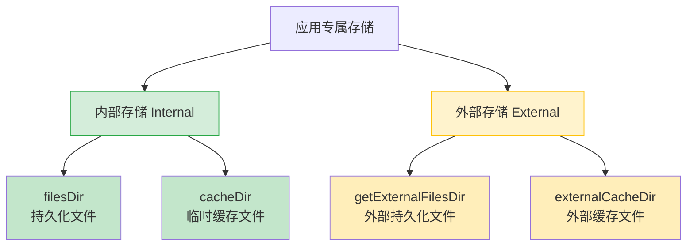
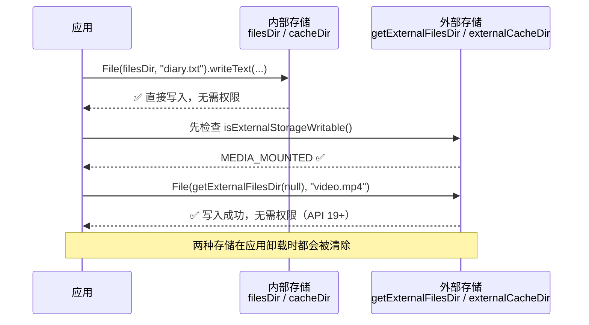
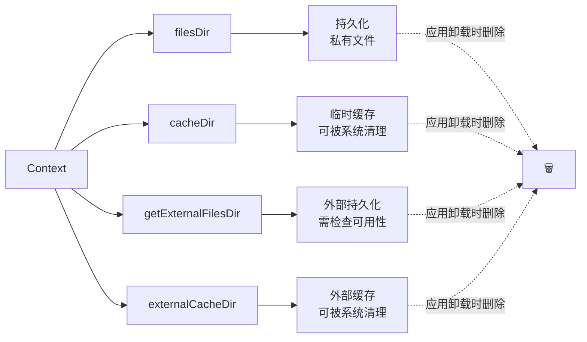

# 1.2.1 Access app-specific files

---
chapter_id: '1.2.1'
title: '保存到应用专属存储'
official_title: 'Access app-specific files'
official_url: 'https://developer.android.com/training/data-storage/app-specific'
topic_url: 'https://developer.android.com/training/data-storage'
status: 'done'
volume_priority: 8
volume_grade: 'A'
chapter_importance: 5

plot_summary:
  time: '清晨'
  location: '山间营地'
  scene: '写日记应用'
  season: '早秋'
  environment: '薄雾、草叶露水、松针泥土清香、山雀叫声'
  topic: '应用专属存储'
  discussion: 'filesDir、cacheDir的使用'
  problem_solved: '学习如何把数据存在应用自己的目录里'
  difficulty: '基础文件操作'
  next_topic: '共享存储'
---

## 1.2.1 保存到应用专属存储

> 本篇对应官方文档：https://developer.android.com/training/data-storage/app-specific

清晨的山间营地还裹在一层薄薄的雾气里，草叶上挂满了露水，空气凉丝丝的，带着松针和泥土混在一起的清甜。远处的山雀已经开始叫了，一声接一声，像在催谁起床。

洛芙就是被催起来的那个。

昨晚黛琳讲的存储方式在她脑子里转了一夜——`filesDir`、`cacheDir`、Room——她越想越兴奋，索性裹着薄毯爬出睡袋，打开笔记本电脑，趁大家还在睡，偷偷写了人生中第一个带输入框和保存按钮的日记应用。

半小时后，她信心满满地在模拟器里输入了一段文字，点了保存，屏幕下方的 `TextView` 乖乖显示出了内容。她满意地看着那行字，觉得自己简直是天才。

然后她关掉模拟器，重新打开。

空白。

洛芙盯着屏幕愣了两秒。晨风吹过来，把她的刘海拂到了眼睛上，她也没去拨。

帐篷的拉链声响了，希尔光着脚踩在湿漉漉的草地上走过来，手里端着两杯刚煮好的热可可，蒸汽在晨雾中慢慢散开。她往洛芙的屏幕上瞄了一眼，秒懂——然后忍不住笑出了声。

"别笑嘛！"洛芙的脸一下子红了。

"不是笑你，"希尔把可可递过来，在她旁边坐下，牛仔裤沾上了草叶上的水珠也不在意，"我第一次写应用的时候也干过这事。你是把内容存到变量里了吧？"

"……嗯。"洛芙小声承认，双手把温热的杯子捧在胸前。

"变量在内存里，应用一关就没了——就像你在沙滩上写字，潮水一来就冲走了。"希尔的声音变得温柔起来，"你得把它刻到石头上。还记得昨晚黛琳说的吗？`filesDir`，那就是你的石头。"

洛芙拍了一下额头，眼睛倏地亮了："应用专属存储！"

"对。来，我帮你改。"

### 应用专属存储的两个格子

希尔把洛芙的电脑拉过来，膝盖上搁着，晨光从树缝间漏下来，在键盘上投下斑驳的光影。

"昨晚黛琳讲了大概，今天把细节展开。"她边改代码边说，"Android 给每个应用分了两块专属地盘——内部存储和外部存储。两块都是你的，别的应用碰不到，卸载时也会一起被清掉。内部存储小但绝对安全，外部存储大但可能不稳定。每块地盘里又分持久化和缓存，一共四个格子——"



> 图 1：应用专属存储的四个目录，绿色为内部存储，黄色为外部存储。

"你的日记应该进哪个格子？"希尔喝了一口可可问。

洛芙想了想："`filesDir`——持久化的那个！日记是心血，绝对不能被清掉。"

"满分。"希尔弯着眼睛笑了。

### 写入和读取

希尔三下五除二把保存按钮的逻辑改好了：

```kotlin
// 依赖：无需额外依赖，标准 Android SDK 即可
// 以下代码在 Activity 或 Fragment 中使用

// 初始化日记文件对象，指向应用内部存储
// filesDir 是 Context 的属性，指向应用内部存储的持久化目录
// 路径通常为 /data/data/<包名>/files/
val diaryFile = File(filesDir, "my_diary.txt")

// 写入文本到文件（覆盖写）
// writeText() 是 Kotlin 标准库提供的扩展函数，将字符串以 UTF-8 编码写入文件
diaryFile.writeText("今天露营，天气很好，学了好多东西。")

// 在文件末尾追加内容（不覆盖原有内容）
diaryFile.appendText("\n晚上还有篝火！")

// 读取文件全部内容，返回 String
val content = diaryFile.readText()
println(content)
// 输出：
// 今天露营，天气很好，学了好多东西。
// 晚上还有篝火！
```

"`filesDir` 是 `Context` 的属性，Activity 里直接用，不需要任何权限——内部存储完全私有，自己帐篷里拿东西不用打招呼。"

洛芙跑了一遍：输入、保存、关闭、打开——文字还在。她开心地晃了晃脚，拖鞋差点从脚尖飞出去。"还在！真的还在！"她的声音比她自己预期的响了一点，远处一只山雀被吓得扑棱着翅膀飞走了。

### 用流来读写

"除了 `File` 的便捷方法，"希尔继续说，远处有人在煮咖啡，风里隐隐飘来一丝焦香，"Android 还有两个更原生的 API——`openFileOutput` 和 `openFileInput`，用流的方式来读写。"

伊莎不知道什么时候也醒了，披着一件薄开衫，端着一杯花果茶坐到旁边来。她的头发还没有完全扎好，几缕碎发在晨风里轻轻飘着，整个人带着一种刚从梦里走出来的柔软感。

"数据像水，文件像桶，"她闻言接了一句，声音还带着一点没睡醒的沙哑，"'openFileOutput' 往桶里倒水，'openFileInput' 从桶里舀水——流就是连接它们的那根管子。"

```kotlin
// 用流写入文件（覆盖写）
// openFileOutput() 是 Context 提供的方法
// 参数1：文件名（不含路径，文件自动存入 filesDir 目录）
// 参数2：文件模式。MODE_PRIVATE 表示私有，每次写入覆盖原内容
val filename = "camp_diary.txt"
val content = "今天学了应用专属存储！"

// 打开文件输出流，并用 use {} 保证自动关闭
// openFileOutput 返回 FileOutputStream
// .use {} 是 Kotlin 扩展函数，块执行完毕后自动 close()，即使发生异常
context.openFileOutput(filename, Context.MODE_PRIVATE).use { outputStream ->
    // 将字符串转为 UTF-8 字节数组后写入
    outputStream.write(content.toByteArray(Charsets.UTF_8))
}

// 用流读取文件内容
// openFileInput() 返回 FileInputStream，bufferedReader() 将字节流包装为带缓冲的字符流，提高读取效率
val result = context.openFileInput(filename).bufferedReader().use { reader ->
    reader.readText()  // 一次性读取全部内容
}
println(result)
// 输出：今天学了应用专属存储！
```

"注意 `use` 块——执行完会自动关流。"希尔指着代码说。

"不关会怎样？"洛芙问，虽然她隐约觉得答案不会是什么好事。

"文件句柄泄漏。"希尔的表情严肃了那么一两秒——在她这种人身上，这已经算很严肃了，"系统能同时打开的文件数是有限的，如果你一直打开不关，就像一直开着水龙头——总有一刻水管会爆。所以要么 `use`，要么 `finally` 里手动关。"

洛芙点点头。一只蜻蜓掠过她的屏幕上方，翅膀在晨光里闪了一下。她认认真真地在心里把“永远用`use`”这几个字画了个圈。

### 缓存文件

"说完持久化，再说缓存。"希尔切到下一段代码，"缓存存在 `cacheDir`，放那种'有更好，没有也无所谓'的东西——图片缩略图、网络请求的临时结果。系统存储不足时可能自动清理，但别依赖——用完了自己删。"

```kotlin
// 创建带随机后缀的临时文件，避免文件名冲突
// File.createTempFile() 参数：前缀、后缀、存放目录
// 生成的文件名类似 thumb_1234567890.jpg
val tempFile = File.createTempFile("thumb_", ".jpg", cacheDir)

// 也可以用 File 构造器直接指定文件名
val cacheFile = File(cacheDir, "network_response.json")
cacheFile.writeText("""{"status": "ok", "data": []}""")

// 手动删除缓存文件（两种方式）
cacheFile.delete()                        // 方式一：File 对象的 delete() 方法
context.deleteFile("network_response.json") // 方式二：Context 提供的 deleteFile()
```

"就像露营结束自己收拾营地。"伊莎吹了吹杯口的热气，笑着补了一句，"留一地狼藉等别人打扫，那可太不像话了。"

"而且系统清理 `cacheDir` 是按文件大小来的，不是按时间，"希尔补充道，"它会先清最大的文件——所以你永远不知道哪个缓存会先消失。自己该删删，别赌运气。"

### 外部存储

这时黛琳也起来了，头发还有点乱，但眼神已经清醒。她看了一眼屏幕上的代码，坐到折叠椅上，双手捧着一杯热白开水——黛琳永远是热白开水。

"大文件——视频、音频、数据集——内部存储装不下，就要用外部存储。"黛琳的声音不紧不慢，像这座山本身在说话，"外部存储不一定是 SD 卡，很多手机会把内置存储的一部分划出来充当外部存储。但不管来源如何，外部存储有一个特点——它可能不稳定。读写之前，永远要先确认它在不在。"

```kotlin
// Environment.getExternalStorageState() 返回外部存储的当前状态
// MEDIA_MOUNTED 表示已挂载且可读写（最理想的状态）
fun isExternalStorageWritable(): Boolean {
    return Environment.getExternalStorageState() == Environment.MEDIA_MOUNTED
}

// MEDIA_MOUNTED_READ_ONLY 表示只读——能读不能写
// 例如某些设备在 USB 连接模式下会变成只读
fun isExternalStorageReadable(): Boolean {
    return Environment.getExternalStorageState() in setOf(
        Environment.MEDIA_MOUNTED,
        Environment.MEDIA_MOUNTED_READ_ONLY
    )
}
```

"比如 SD 卡被拔出来呢？"洛芙问，她已经学会了在写代码之前先想"会出什么问题"——这让她自己都有点惊讶。

"那就是 `MEDIA_REMOVED`，"黛琳微微一笑，"所以检查状态这一步永远不能省。"

"设备有多张 SD 卡呢？"洛芙越问越起劲。

"用 `ContextCompat.getExternalFilesDirs()`——注意是复数——返回所有可用的外部目录，第一个是主存储。"

```kotlin
// 获取所有外部存储目录（返回数组，可能包含多张 SD 卡的目录）
val externalDirs = ContextCompat.getExternalFilesDirs(applicationContext, null)
// 第一个元素是主外部存储，优先使用
val primaryExternal = externalDirs[0]

// getExternalFilesDir() 获取外部存储的持久化目录
// 参数 null 表示应用的根目录；也可以传 Environment.DIRECTORY_PICTURES 等常量指定子目录
val externalFile = File(context.getExternalFilesDir(null), "large_video.mp4")

// externalCacheDir 是外部存储的缓存目录，适合存放较大的临时文件
val externalCacheFile = File(context.externalCacheDir, "preview.jpg")
```

"从 API 19 开始，访问应用专属的外部存储目录不需要权限。"黛琳说，晨风把她额前的碎发吹起来又放下，"只有访问共享存储——比如相册、下载文件夹——才需要。后面会讲。"



> 图 2：内部存储直接访问，外部存储需先检查可用性。两种都不需要权限（API 19+）。

### 查询可用空间

"写大文件之前，"黛琳说，"先查一下空间够不够。写到一半失败，文件就损坏了——而且用户不会觉得这是系统的问题，他们只会觉得你的应用不靠谱。"

```kotlin
// StorageManager 是 Android 提供的存储管理器（需要 API 26+）
val storageManager = getSystemService(Context.STORAGE_SERVICE) as StorageManager

// getUuidForPath() 获取指定目录所在存储卷的唯一标识
val appSpecificInternalDirUuid: UUID = storageManager.getUuidForPath(filesDir)

// getAllocatableBytes() 返回系统可分配给应用的最大字节数
// 注意：这个值可能大于当前空闲空间，因为系统会把它能清理的其他应用缓存也算进去
val availableBytes: Long = storageManager.getAllocatableBytes(appSpecificInternalDirUuid)

val requiredBytes = 50 * 1024 * 1024L  // 假设需要 50MB

if (availableBytes >= requiredBytes) {
    // allocateBytes() 预先分配空间（可选但推荐）
    // 如果系统需要，它会先清理其他应用的缓存来腾出空间
    storageManager.allocateBytes(appSpecificInternalDirUuid, requiredBytes)
    // 空间足够，写入文件
} else {
    // 空间不足，启动系统的存储管理界面，引导用户手动清理
    val storageIntent = Intent().apply {
        action = StorageManager.ACTION_MANAGE_STORAGE
    }
    startActivity(storageIntent)
}
```

"所以 `getAllocatableBytes()` 比 `File.freeSpace` 更准确？"洛芙问。

黛琳点头："它考虑了系统能清理的空间，给你的是一个更乐观但更真实的数字。"

### 三个常见的坑

太阳升高了一些，雾气快散完了，草叶上的露水开始反光，亮晶晶的，像有人在草地上撒了一把碎钻石。希尔伸了个懒腰，关节发出轻轻的咔嗒声。

"顺便说几个坑——都是血泪史。"

**坑一：在主线程做文件 IO。** 文件读写耗时不确定，主线程做会卡 UI，严重的话触发 ANR。

```kotlin
// ❌ 主线程直接写文件
// onCreate() 在主线程执行，如果 hugeString 很大，用户会看到界面卡死
class MainActivity : AppCompatActivity() {
    override fun onCreate(savedInstanceState: Bundle?) {
        super.onCreate(savedInstanceState)
        File(filesDir, "big_file.txt").writeText(hugeString) // 阻塞主线程！
    }
}

// ✅ 切换到 IO 协程
// Dispatchers.IO 是专为 IO 操作设计的线程池，不会阻塞主线程
class MainActivity : AppCompatActivity() {
    override fun onCreate(savedInstanceState: Bundle?) {
        super.onCreate(savedInstanceState)
        lifecycleScope.launch(Dispatchers.IO) {
            File(filesDir, "big_file.txt").writeText(hugeString)
        }
    }
}
```

**坑二：硬编码路径。** 不同设备路径不同，包名变了也会失效。永远用 `Context` 拿路径。

```kotlin
// ❌ 硬编码路径——换一台设备或改个包名就找不到文件了
val file = File("/data/data/com.example.app/files/diary.txt")

// ✅ 通过 Context 获取——系统保证路径正确
val file = File(filesDir, "diary.txt")
```

**坑三：不检查外部存储状态。** SD 卡拔出时直接访问会抛 IOException。

```kotlin
// ❌ 直接访问——如果 SD 卡被拔出，这行会抛出 IOException
val file = File(getExternalFilesDir(null), "video.mp4")
file.writeBytes(videoData)

// ✅ 先检查状态，不可用时降级或提示
if (isExternalStorageWritable()) {
    File(getExternalFilesDir(null), "video.mp4").writeBytes(videoData)
} else {
    showToast("外部存储不可用，请检查 SD 卡")
}
```

"记住这三个，"希尔竖起三根手指，表情难得地认真，"能避免 80% 的文件操作 bug。我是说真的——八成。"

### 洛芙的日记应用 v2

洛芙放下可可杯——杯子已经快见底了，杯沿上留着一圈浅浅的巧克力印子。她重新打开 Android Studio，深吸一口气。这一次，她心里有了一张清晰的地图。

她不再把所有代码塞进 Activity——昨晚黛琳提过 Repository 模式，她决定试试。把文件操作藏到幕后去，让 Activity 只管画画面。

```kotlin
// DiaryRepository.kt
// 职责：封装日记文件的所有读写操作
// 好处：Activity 不需要知道数据存在文件里还是数据库里
class DiaryRepository(private val context: Context) {

    // 使用 get() 属性委托，每次访问时获取最新的 File 对象
    private val diaryFile: File
        get() = File(context.filesDir, "diary.txt")

    // suspend 表示这是一个挂起函数，必须在协程中调用
    // withContext(Dispatchers.IO) 将执行切换到 IO 线程池，避免阻塞主线程
    suspend fun saveDiary(content: String) = withContext(Dispatchers.IO) {
        diaryFile.writeText(content, Charsets.UTF_8)
    }

    suspend fun loadDiary(): String = withContext(Dispatchers.IO) {
        // 首次运行时文件不存在，需要检查
        if (diaryFile.exists()) {
            diaryFile.readText(Charsets.UTF_8)
        } else {
            ""  // 返回空字符串，由 UI 层决定如何显示
        }
    }

    // 追加模式：在现有内容后面添加新条目，带时间戳
    suspend fun appendEntry(entry: String) = withContext(Dispatchers.IO) {
        val timestamp = System.currentTimeMillis()
        diaryFile.appendText("\n[$timestamp] $entry", Charsets.UTF_8)
    }
}

// MainActivity.kt
// 注意：Activity 中没有任何 File 对象的直接操作
class MainActivity : AppCompatActivity() {

    // lazy 延迟初始化，首次访问时才创建 Repository 实例
    private val repository by lazy { DiaryRepository(this) }

    override fun onCreate(savedInstanceState: Bundle?) {
        super.onCreate(savedInstanceState)
        setContentView(R.layout.activity_main)

        // lifecycleScope 是与 Activity 生命周期绑定的协程作用域
        // Activity 销毁时会自动取消未完成的协程，避免内存泄漏
        lifecycleScope.launch {
            val content = repository.loadDiary()
            editText.setText(content)
        }

        btnSave.setOnClickListener {
            val content = editText.text.toString()
            lifecycleScope.launch {
                repository.saveDiary(content)
                Toast.makeText(this@MainActivity, "已保存 ✓", Toast.LENGTH_SHORT).show()
            }
        }
    }
}
```

她在模拟器上跑了一遍：

```
// 运行输出（Logcat）
D/DiaryApp: 日记加载成功，内容长度：0（首次运行，文件不存在）
D/DiaryApp: 日记保存成功，路径：/data/data/com.example.diary/files/diary.txt
D/DiaryApp: 日记加载成功，内容长度：42
```

关闭，重新打开——数据还在。

洛芙长长地呼了口气，靠到椅背上。仰起头，透过树梢间的缝隙，能看到一小片干干净净的蓝天——雾已经全散了，阳光暖暖地照下来，照在她的脸上、手臂上、屏幕上那行小小的"已保存 ✓"上。

"Activity 只管 UI，文件操作全在 Repository 里。"她自言自语地复述了一遍。

"以后数据源从文件换成数据库，Activity 一行都不用改。"黛琳在旁边轻声说。

"而且你今天做的比你以为的更多，"伊莎忽然开口了。她把花果茶放到膝盖上，认真地看着洛芙，"你不只是学会了 `filesDir` 怎么用——你学会了一件更重要的事：数据应该待在哪里，取决于它要活多久。"

洛芙愣了一下，然后慢慢地笑了。

远处的山雀又开始叫了。太阳晒暖了她的肩膀。可可杯里最后一口已经凉了，但她觉得这个早晨的味道，刚刚好。

---

### 技术总结

> **应用专属存储（App-Specific Storage）** —— Android 为每个应用分配的私有存储区域，分为内部存储（`filesDir`、`cacheDir`）和外部存储（`getExternalFilesDir()`、`externalCacheDir`）。其他应用无法访问，应用卸载时自动清除，无需申请存储权限（API 19+）。

#### 今日关键词

1. **filesDir**：内部存储的持久化目录，存放需要长期保留的私有文件，应用卸载时删除。
2. **cacheDir**：内部存储的缓存目录，存放临时文件，系统在存储不足时可能自动清理。
3. **getExternalFilesDir()**：外部存储的持久化目录，容量更大，API 19+ 无需权限，但需检查可用性。
4. **externalCacheDir**：外部存储的缓存目录，同上，用于存放较大的临时文件。
5. **MEDIA_MOUNTED**：外部存储状态常量，表示存储已挂载且可读写。
6. **StorageManager**：用于查询存储空间信息，`getAllocatableBytes()` 返回可分配的最大字节数。
7. **Dispatchers.IO**：Kotlin 协程的 IO 调度器，专为文件、网络等 IO 操作设计，避免阻塞主线程。

#### 结构图



#### 复杂度与影响

* **性能**：文件 IO 是阻塞操作，必须在 `Dispatchers.IO` 或后台线程执行，避免 ANR。
* **空间**：内部存储空间有限（通常几 GB），大文件优先考虑外部存储；写入前用 `getAllocatableBytes()` 检查空间。
* **可靠性**：外部存储可能不可用（SD 卡拔出、未挂载），访问前必须检查 `Environment.getExternalStorageState()`。

#### 反模式与陷阱

1. **在主线程执行文件 IO**：导致 UI 卡顿甚至 ANR。修复：使用 `lifecycleScope.launch(Dispatchers.IO)` 或 `withContext(Dispatchers.IO)`。

2. **硬编码文件绝对路径**：不同设备路径不同，包名变更后路径失效。修复：始终通过 `Context.filesDir`、`Context.cacheDir` 等属性获取路径。

3. **不检查外部存储可用性**：SD 卡拔出时直接访问会抛出 IOException。修复：访问前调用 `Environment.getExternalStorageState()` 检查状态。

4. **缓存文件不清理**：长期积累导致存储空间耗尽。修复：不需要时主动调用 `file.delete()` 或 `context.deleteFile()`，不要依赖系统自动清理。

5. **不使用 `use` 关闭流**：文件句柄泄漏，系统资源耗尽。修复：使用 Kotlin 的 `use` 扩展函数，或在 `finally` 块中手动关闭。

#### 数据隔离设计思想

1. **最小权限原则**：应用专属存储无需权限，只在必要时（访问共享存储）才申请权限。
2. **数据生命周期与应用绑定**：专属存储的数据随应用卸载而删除，避免用户设备上留下垃圾数据。
3. **分层存储策略**：根据数据的重要性和大小选择合适的目录——重要数据用 `filesDir`，临时数据用 `cacheDir`，大文件用外部存储。
4. **IO 操作异步化**：所有文件操作都应在后台线程执行，保持 UI 线程流畅。
5. **封装数据访问层**：用 Repository 模式隔离文件操作细节，UI 层不直接操作文件。

### 🏕️ 动手练习

#### Task 1 · 最简日记本 ★

**目标**：用 `filesDir` 实现一个单文件日记应用，能保存和读取文字内容，重启后数据不丢失。

**你需要做的事：**

1. 新建 Android 项目（Empty Activity）
2. 布局中添加：`EditText`（输入日记）、"保存"按钮、"读取"按钮、`TextView`（显示内容）
3. 点击"保存"：把 `EditText` 内容写入 `File(filesDir, "diary.txt")`
4. 点击"读取"：从文件读取内容显示在 `TextView`
5. 应用启动时自动读取并显示上次保存的内容

**验收标准：**
- [ ] 输入内容 → 保存 → 关闭应用 → 重新打开 → 内容依然存在
- [ ] 文件不存在时，`TextView` 显示"还没有日记，快来写第一篇吧～"
- [ ] 用 Device Explorer 能在 `data/data/<包名>/files/` 下找到 `diary.txt`

**提示：**
```kotlin
lifecycleScope.launch(Dispatchers.IO) {
    val file = File(filesDir, "diary.txt")
    file.writeText(editText.text.toString())
    withContext(Dispatchers.Main) {
        Toast.makeText(this@MainActivity, "已保存", Toast.LENGTH_SHORT).show()
    }
}
```

#### Task 2 · 图片缓存实验 ★★

**目标**：把一张 drawable 图片保存到 `cacheDir`，再从缓存读取显示，然后手动删除缓存，验证删除后文件消失。

**你需要做的事：**

1. 在 `res/drawable` 放一张图片（如 `camp.png`）
2. 布局添加："缓存图片"按钮、"读取缓存"按钮、"清除缓存"按钮、`ImageView`
3. 点击"缓存图片"：用 `BitmapFactory.decodeResource` 加载图片，用 `FileOutputStream` 压缩保存到 `File(cacheDir, "camp_thumb.jpg")`
4. 点击"读取缓存"：用 `BitmapFactory.decodeFile` 读取并显示
5. 点击"清除缓存"：调用 `file.delete()`，清除后 `ImageView` 显示占位图

**验收标准：**
- [ ] 缓存 → 读取 → `ImageView` 正确显示图片
- [ ] 清除后再点"读取缓存"，Toast 提示"缓存不存在，请先缓存图片"
- [ ] Device Explorer 中能观察到文件的创建和删除

**提示：**
```kotlin
val cacheFile = File(cacheDir, "camp_thumb.jpg")
FileOutputStream(cacheFile).use { out ->
    bitmap.compress(Bitmap.CompressFormat.JPEG, 80, out)
}
```

#### Task 3 · 外部存储日志记录器 ★★★

**目标**：把应用的操作日志写入外部存储，每次操作追加一行，包含时间戳和操作描述。

**你需要做的事：**

1. 实现 `isExternalStorageWritable()` 检查函数
2. 布局添加：三个按钮（"记录操作A"、"记录操作B"、"查看日志"）、`TextView` 显示日志内容
3. 点击操作按钮时，向 `File(getExternalFilesDir(null), "app_log.txt")` 追加一行：`[时间戳] 操作描述\n`
4. 点击"查看日志"时，读取文件内容显示在 `TextView`
5. 外部存储不可用时，Toast 提示并降级写入 `filesDir`

**验收标准：**
- [ ] 多次点击操作按钮，日志文件内容累积增加（不覆盖）
- [ ] 外部存储不可用时（可用 `adb shell sm set-virtual-disk true` 模拟），自动降级到内部存储
- [ ] 日志文件中每行包含正确的时间戳

**提示：**
```kotlin
val logFile = if (isExternalStorageWritable()) {
    File(getExternalFilesDir(null), "app_log.txt")
} else {
    File(filesDir, "app_log.txt")  // 降级
}
logFile.appendText("[${System.currentTimeMillis()}] $action\n")
```

#### Task 4 · 存储空间守卫 ★★★

**目标**：在写入大文件前检查可用空间，空间不足时引导用户清理，空间足够时正常写入。

**你需要做的事：**

1. 布局添加：`SeekBar`（模拟文件大小，1MB–200MB）、"写入文件"按钮、空间信息 `TextView`
2. 应用启动时，用 `StorageManager.getAllocatableBytes()` 查询可用空间并显示
3. 点击"写入文件"时：
   - 计算 `SeekBar` 对应的字节数
   - 若可用空间足够，写入对应大小的文件（用 `ByteArray` 填充）
   - 若不足，启动 `Intent(StorageManager.ACTION_MANAGE_STORAGE)` 引导用户清理
4. 写入完成后刷新空间显示

**验收标准：**
- [ ] 空间显示正确（单位 MB，保留一位小数）
- [ ] 文件大小超过可用空间时，跳转到系统存储管理页面
- [ ] 写入成功后，可用空间数字减少

**提示：**
```kotlin
val storageManager = getSystemService(Context.STORAGE_SERVICE) as StorageManager
val uuid = storageManager.getUuidForPath(filesDir)
val availableBytes = storageManager.getAllocatableBytes(uuid)
val availableMB = availableBytes / (1024 * 1024f)
```

#### Task 5 · Repository 封装练习 ★★★

**目标**：把 Task 1 的日记应用重构为 Repository 模式，Activity 不直接操作文件，所有 IO 操作封装在 `DiaryRepository` 中。

**前置条件**：先完成 Task 1。

**你需要做的事：**

1. 新建 `DiaryRepository(context: Context)` 类，包含：
   - `suspend fun save(content: String)`
   - `suspend fun load(): String`
   - `suspend fun clear()`
2. 所有方法内部使用 `withContext(Dispatchers.IO)` 切换线程
3. `MainActivity` 中通过 `lifecycleScope.launch` 调用 Repository 方法，不直接操作 `File`
4. 新增"清除日记"按钮，调用 `repository.clear()`

**验收标准：**
- [ ] `MainActivity` 中没有任何 `File`、`FileOutputStream` 等直接文件操作代码
- [ ] 保存、读取、清除功能正常
- [ ] 所有文件操作都在 IO 线程执行（可在 Repository 方法内加 Log 验证线程名）

**提示：**
```kotlin
class DiaryRepository(private val context: Context) {
    private val file get() = File(context.filesDir, "diary.txt")

    suspend fun save(content: String) = withContext(Dispatchers.IO) {
        file.writeText(content, Charsets.UTF_8)
    }

    suspend fun load(): String = withContext(Dispatchers.IO) {
        if (file.exists()) file.readText(Charsets.UTF_8) else ""
    }
}
```

#### Task 6 · 多文件日记本（按日期分文件）★★★★

**目标**：每天的日记存为独立文件（文件名为日期，如 `2024-07-15.txt`），支持按日期列出所有日记、读取指定日期的日记。

**你需要做的事：**

1. 文件命名规则：`SimpleDateFormat("yyyy-MM-dd").format(Date()) + ".txt"`
2. 实现 `listDiaryDates(): List<String>`：读取 `filesDir` 下所有 `.txt` 文件名（去掉扩展名），按日期倒序排列
3. 实现 `loadDiary(date: String): String`：读取指定日期的日记文件
4. 布局：日期列表（`RecyclerView`）+ 日记内容区域，点击日期显示对应内容
5. 新增"今天写日记"入口，写入当天的文件

**验收标准：**
- [ ] 写入多天日记后，列表正确显示所有日期（倒序）
- [ ] 点击任意日期，正确显示该天的日记内容
- [ ] 同一天多次写入，内容覆盖（不追加）

**提示：**
```kotlin
fun listDiaryDates(): List<String> {
    return filesDir.listFiles()
        ?.filter { it.extension == "txt" }
        ?.map { it.nameWithoutExtension }
        ?.sortedDescending()
        ?: emptyList()
}
```

#### Task 7 · 自动备份到外部存储 ★★★★

**目标**：实现"一键备份"功能，把内部存储的日记文件复制到外部存储，并在外部存储不可用时给出友好提示。

**你需要做的事：**

1. 在 Task 5 的基础上，新增 `BackupRepository(context: Context)`，包含：
   - `suspend fun backup(): BackupResult`（返回成功/失败/存储不可用）
   - `suspend fun restore(): String?`（从外部存储恢复）
2. 备份路径：`File(getExternalFilesDir(null), "backup/diary_backup.txt")`
3. 备份前检查外部存储状态和可用空间
4. 布局新增"备份"和"恢复"按钮，显示备份状态（上次备份时间）

**验收标准：**
- [ ] 备份成功后，在 Device Explorer 中能找到外部存储的备份文件
- [ ] 外部存储不可用时，Toast 提示"外部存储不可用，备份失败"
- [ ] 恢复功能能把备份文件内容写回内部存储

#### Task 8 · 存储压力测试 ★★★★★

**目标**：模拟存储空间不足的场景，验证应用的降级策略和错误处理是否健壮。

**你需要做的事：**

1. 实现一个 `StorageStressTest` 工具类，能向 `cacheDir` 写入大量文件直到接近存储上限
2. 在压力测试过程中，观察 `getAllocatableBytes()` 的变化
3. 当可用空间低于 10MB 时，自动停止写入并触发清理逻辑
4. 清理逻辑：删除所有 `cacheDir` 下超过 7 天的文件
5. 编写单元测试验证清理逻辑（用 `File` 的 `lastModified()` 模拟旧文件）

**验收标准：**
- [ ] 压力测试能正确检测到空间不足并停止
- [ ] 清理逻辑只删除超过 7 天的文件，不误删新文件
- [ ] 单元测试通过，覆盖"有旧文件"和"没有旧文件"两种场景

#### 💬 面试热身：用自己的话回答这些问题

> 不用写代码，试着用一两句话说清楚就好。能说清楚，才是真的懂了。

**Q1**：`filesDir` 和 `cacheDir` 有什么区别？什么情况下用哪个？

**Q2**：访问应用专属的外部存储目录，需要申请 `READ_EXTERNAL_STORAGE` 权限吗？为什么？

**Q3**：`Environment.getExternalStorageState()` 返回 `MEDIA_MOUNTED_READ_ONLY` 时，能写入文件吗？

**Q4**：为什么不能在主线程做文件 IO？如果一定要在主线程读一个很小的文件（比如几十字节），会有问题吗？

**Q5**：`StorageManager.getAllocatableBytes()` 和直接读 `File.freeSpace` 有什么区别？哪个更准确？

> 文件存储是最基础的数据持久化方式。掌握好 `filesDir`、`cacheDir` 和外部存储的区别，养成在 IO 线程操作文件的习惯，再用 Repository 模式封装细节——这三件事做好了，你的应用就有了一个可靠的"记忆系统"。

### 🍭 洛芙的小小日记本

今天天没亮就爬起来写代码了，结果数据存在变量里、一关应用就没了——被希尔一句话点醒。现在终于懂了：变量在内存，文件在磁盘，想让数据活过今天，就得给它一个真正的家。窗外的雾散了，太阳出来了。✨
