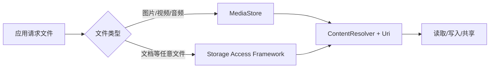
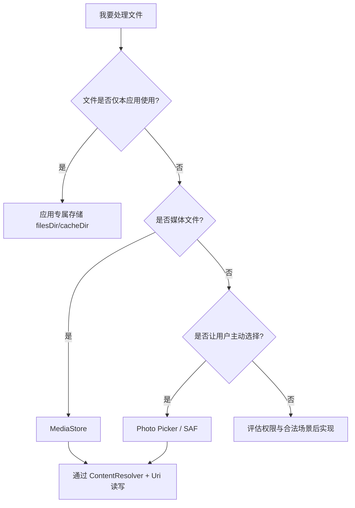
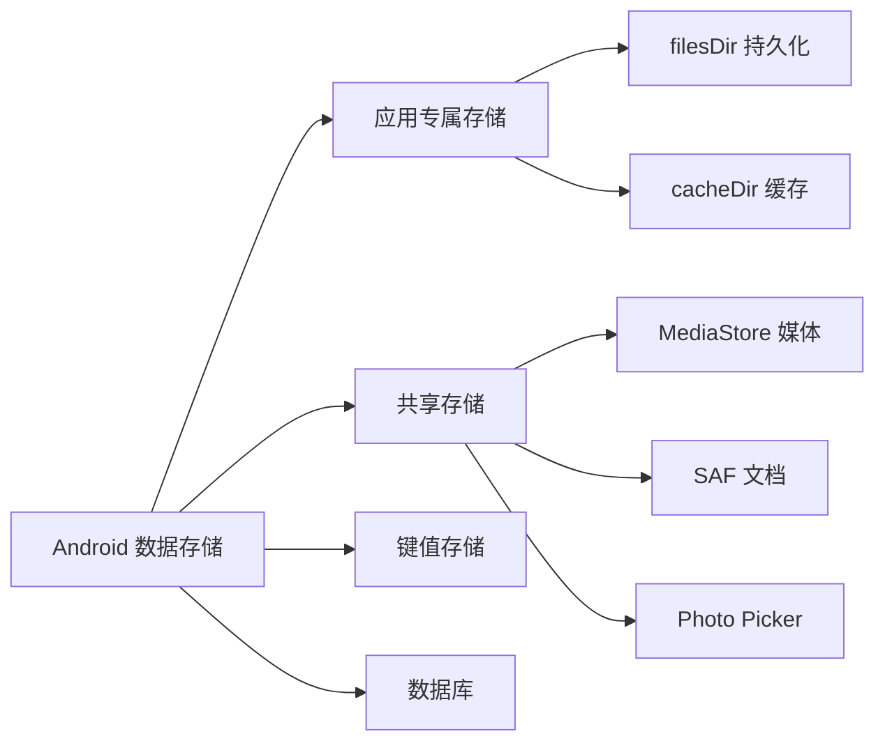

# 1.3.1 关于共享存储

> 本篇对应官方文档：https://developer.android.com/training/data-storage/shared

夜幕降临，露营地的篝火噼啪作响，跳动的火光在四位少女的脸上投下温暖的光影。星空格外璀璨，仿佛整个银河都倾泻在了这片草甸之上。

“今天我们来讲讲共享存储吧。”黛琳轻声说道，她的目光望向远处的森林，“在 Android 的世界里，数据就像露营时的物资——有些要随身携带，有些要藏在营地里，还有些要和其他营地分享。”

洛芙正靠在伊莎的肩膀上，听到这里，好奇地眨了眨眼：“共享存储？和我们平时写代码有什么关系吗？”

“当然有。”希尔笑着递过来一块烤好的棉花糖，“每一个 Android 应用都像是一个小小的露营地——它有自己的'仓库'，有自己'藏宝箱'，还有和其他'营地'交流的'信使'。今天我们要学的，就是怎么管理这些仓库和箱子。”

“那……共享存储到底是什么呀？”洛芙咬了一口棉花糖，甜味在嘴里化开。

伊莎微微一笑，指着星空说道：“你看天上的星星，每一颗都像是应用里的一个数据。有的星星永远待在那里，像是我们存在手机里的照片；有的星星则会飞来飞去，像是我们正在看的视频。”

“而在 Android 中，”黛琳接过话头，“数据存储的方式主要有三种：

第一种是**应用专属存储**——就像是你的私人背包，只有你自己能放进去、拿出来。

第二种是**共享存储**——就像是营地的公共仓库，你可以放东西进去，别的应用如果得到允许，也可以来拿。

第三种是**Preferences 和数据库**——就像是你的日记本，可以用来记录和管理大量的、结构化的信息。”

洛芙似懂非懂地点了点头：“那……我们具体该怎么用呢？”

“来，我们一个一个来。”希尔打开笔记本电脑，屏幕的光芒在黑暗中格外醒目，“先从最简单的开始。”

黛琳把地图卷轴摊开，声音很轻，却有种不容置疑的稳：“今天的任务是'共享存储'。”

“听起来就很危险……”洛芙下意识缩了缩脖子。

希尔笑出声，把烤得刚刚好的蘑菇串递给她：“危险倒不至于，但如果你乱来，确实会踩坑踩到怀疑人生。”

伊莎把一盏小油灯挂在树枝上，灯光柔柔地落下来：“共享存储就像露营地中央的公共仓库。不是你一个人的帐篷，也不是完全开放的集市。它有规则，有管理员，有钥匙，有门禁。”

洛芙抱着膝盖，盯着火苗发呆：“那我先问最基础的——为什么要有'共享存储'？我把东西都放在应用自己的目录里不就行了吗？”

黛琳看了她一眼，露出一丝几乎看不见的笑意：“问得很好。因为现实里，你总有一些文件，天生就需要'被别人看到'。”

“比如？”

“你在相机 App 拍了一张照片，”黛琳用树枝在地上画了个圆，“你希望图库看得到，微信看得到，修图软件也看得到。若它一直锁在应用私有目录里，其他应用就像被挡在你帐篷外，根本进不来。”

伊莎接上她的话：“所以，Android 世界把文件空间分成了'私有森林'和'公共湖岸'。共享存储，就是那片湖岸。”

洛芙若有所思：“那岂不是谁都能拿走我的文件？”

“不会。”黛琳把地图翻到下一页，“这就进入今天第一条主线：共享不等于裸奔。”

希尔打开电脑，屏幕上的代码映出四个人的倒影。

“我们先立一个最简单的世界观。”她敲下一行注释。

```kotlin
/**
 * Shared storage: 可被系统/其他应用访问的公共文件空间。
 * 典型内容：图片、视频、音频、下载文件、文档。
 */
```

“在很久以前，”伊莎托着下巴，语气像讲童话，“大家可以随便在公共湖岸跑来跑去，想拿什么就拿什么。后来系统发现，隐私和安全会出问题，于是有了更严格的规则。”

黛琳点头：“Android 10 开始，Scoped Storage（分区存储）成为主旋律。你可以把它理解为：公共仓库被改造成了'分区柜台'，每个访问都要走正门，不再允许应用直接横穿仓库。”

洛芙眨眨眼：“所以我不能直接拿绝对路径硬读文件了？”

“对。那是旧时代做法。”

希尔在屏幕上写下第一段“坏味道代码”。

```kotlin
// ❌ 旧时代思路（不推荐）
// 直接使用绝对路径访问共享存储文件
// 这种方式在 Android 10+ 可能失效
val file = File("/sdcard/DCIM/Camera/test.jpg")
val bytes = file.readBytes()
```

“这段代码在新系统上，可能直接扑街。”希尔耸耸肩，“权限、路径、作用域，全都可能出问题。”

她紧接着写下“重构后方案”。

```kotlin
// ✅ 新时代思路：通过 MediaStore 访问共享媒体
// 1. 定义要查询的列（返回哪些字段）
val projection = arrayOf(
    MediaStore.Images.Media._ID,          // 图片唯一标识符
    MediaStore.Images.Media.DISPLAY_NAME  // 图片显示名称
)

// 2. 定义查询条件（这里按文件名精确匹配）
val selection = "${MediaStore.Images.Media.DISPLAY_NAME} = ?"
val selectionArgs = arrayOf("test.jpg")

// 3. 通过 ContentResolver 查询系统媒体库
contentResolver.query(
    MediaStore.Images.Media.EXTERNAL_CONTENT_URI,  // 外部媒体内容的 Uri
    projection,      // 要返回的列
    selection,      // WHERE 条件
    selectionArgs,  // WHERE 参数
    null            // 排序方式（null 为默认排序）
)?.use { cursor ->
    // 4. 遍历查询结果
    val idCol = cursor.getColumnIndexOrThrow(MediaStore.Images.Media._ID)
    val nameCol = cursor.getColumnIndexOrThrow(MediaStore.Images.Media.DISPLAY_NAME)
    while (cursor.moveToNext()) {
        // 5. 读取每条记录
        val id = cursor.getLong(idCol)
        val name = cursor.getString(nameCol)
        // 6. 构造完整 Uri（可用于后续读取文件内容）
        val uri = ContentUris.withAppendedId(MediaStore.Images.Media.EXTERNAL_CONTENT_URI, id)
        Log.d("SharedStorage", "found=$name uri=$uri")
    }
}
```

“看到没有？”黛琳用笔尖点了点屏幕，“你不是去'闯仓库'，而是通过 ContentResolver 这个'仓库管理员'来办事。”

洛芙轻声重复：“我拿着 URI，通过系统给我的入口去读取……”

“没错。”伊莎笑了，“你不是翻墙进王宫，而是拿着通行证，从正门进入。”

洛芙噗地笑出来：“你这个比喻好有画面感。”

风又大了一点，火焰在夜里晃了晃。

黛琳把第二张图画出来。



> 图 1：应用请求文件时的路径选择——媒体文件走 MediaStore，文档走 SAF。

“图里这条分叉，就是你今天必须记住的。”黛琳说，“媒体文件优先走 MediaStore；文档类通用访问，常走 SAF（Storage Access Framework）。”

“我懂一点了！”洛芙举手，“那 Photo Picker 呢？它算哪条路？”

希尔眼睛一亮：“好问题。 Photo Picker 是系统给你的'精选入口'，你让用户选图，系统帮你处理访问授权，开发者成本更低，隐私也更好。”

```kotlin
// Photo Picker：让用户从系统图库选择一张图片
// 使用 Activity Result API 接收结果
private val pickMedia = registerForActivityResult(
    ActivityResultContracts.PickVisualMedia()
) { uri ->
    // uri 为用户选择的图片 Uri，可能为 null（用户取消）
    if (uri != null) {
        Log.d("PhotoPicker", "Selected URI: $uri")
        // 通过 uri 读取文件内容（需要自行处理流关闭）
        contentResolver.openInputStream(uri)?.use { input ->
            // 在这里处理输入流，例如复制到私有目录
            val buffer = input.readBytes()
            Log.d("PhotoPicker", "Read ${buffer.size} bytes")
        }
    }
}

// 启动 Photo Picker
fun openPicker() {
    // 请求仅图片，不允许视频
    pickMedia.launch(PickVisualMediaRequest(ActivityResultContracts.PickVisualMedia.ImageOnly))
}
```

“这个接口我喜欢！”洛芙拍了下手，“用户有掌控感，代码也不算重。”

“对。”黛琳说，“当业务允许用户手选，优先考虑 Photo Picker。你会少掉一大堆权限处理噩梦。”

“那如果我要把图片保存到共享存储呢？”

希尔把外套披在洛芙肩上，顺手写下第三段代码。

```kotlin
// 将图片写入共享存储（MediaStore）
// 1. 构建要写入的元数据
val values = ContentValues().apply {
    // 设置文件名（带时间戳防止重复）
    put(MediaStore.Images.Media.DISPLAY_NAME, "camp_${System.currentTimeMillis()}.jpg")
    // 设置 MIME 类型
    put(MediaStore.Images.Media.MIME_TYPE, "image/jpeg")
    // 设置存储路径（相对路径，放在相册的子目录）
    put(MediaStore.Images.Media.RELATIVE_PATH, "Pictures/CampDiary")
}

// 2. 插入新记录，获取分配给该文件的 Uri
val uri = contentResolver.insert(MediaStore.Images.Media.EXTERNAL_CONTENT_URI, values)

// 3. 打开输出流写入图片数据
uri?.let {
    contentResolver.openOutputStream(it)?.use { out ->
        // 将 Bitmap 压缩为 JPEG 格式写入
        bitmap.compress(Bitmap.CompressFormat.JPEG, 90, out)
    }
}
```

“你看，重点是 RELATIVE_PATH。”希尔说，“它让你在公共空间里把文件放到合适目录，比如 Pictures/CampDiary。”

洛芙点头：“那删除呢？”

“先别急。”黛琳抬手示意，“删除、覆盖、批量修改，在新系统有额外限制，尤其 Android 11+。你可能需要请求用户确认操作。系统在保护用户文件，不让应用悄悄乱改。”

伊莎低头拨了拨火堆：“像露营地的公约。你可以整理公用物资，但不能半夜把大家的帐篷都换位置。”

“哈哈哈哈——”洛芙笑得眼睛弯起来，“我记住了。”

夜深了，湖面开始起雾。

洛芙忽然安静下来，盯着自己手里那杯热可可：“我有时候会觉得，Android 的规则越来越多，写代码好像越来越难。”

希尔沉默了两秒，语气意外地认真：“规则多，不一定是坏事。它逼你写更可持续、更尊重用户的代码。”

黛琳点头：“工程世界和冒险故事一样。真正的高手，不是靠'捷径'赢，而是靠在约束里仍然优雅地解题。”

伊莎轻轻碰了碰洛芙的肩：“你现在觉得难，是因为你已经在从'会写功能'走向'会做产品'。这不是退步，是升级。”

火光跳动了一下。

洛芙抬起头，眼里那点迟疑慢慢散开：“那我来总结看看，对不对——

第一，公共文件访问要走系统通道，少碰绝对路径。

第二，媒体优先 MediaStore，用户选图优先 Photo Picker。

第三，共享存储要尊重权限和用户确认，别试图偷偷摸摸。

第四，代码要站在未来版本也能跑的角度来写。”

黛琳难得笑得明显了些：“满分。”

希尔抬手和她击掌。

伊莎看着她们，眼神温柔得像月光落在水面。

“欢迎来到'工程师的成年礼'。”

洛芙忽然说：“我们能不能再画一张'决策图'？我想以后排查问题的时候，一眼就能判断该走哪条路。”

“当然。”

黛琳在笔记本上敲下最后一张图。



> 图 2：文件存储路径决策图——根据文件用途和类型选择合适的存储方式。

“好清晰……”洛芙盯着图，像看一张能穿越迷雾的航海图。

“记住它。”黛琳说，“每次你不确定，就回到这张图。工程能力就是被重复练出来的。”

希尔把最后一根烤肠递给她：“Learn by doing, by repeat。不是口号，是方法。”

伊莎补了一句：“也是你会慢慢喜欢上自己的方式。”

洛芙低头笑了笑，把那句英文默默在心里重复了三遍。

火堆渐渐变小，夜色越来越深。

可她知道，脑子里那盏灯，已经亮了。

---

### 技术总结

> **共享存储（Shared Storage）**：Android 提供的公共文件空间，适用于需要在系统或应用之间共享的媒体/文档数据。现代 Android 强调通过 URI + ContentResolver 访问，结合 MediaStore、Photo Picker 与 SAF，实现安全、可控、可持续的数据读写。

#### 今日关键词

1. **Shared Storage**：应用可共享访问的公共文件区域，不等于无限制访问。
2. **Scoped Storage**：Android 10+ 的分区存储策略，限制应用随意访问公共文件。
3. **MediaStore**：管理媒体文件（图像/视频/音频）的标准入口。
4. **ContentResolver**：通过 URI 与系统数据提供方交互的统一接口。
5. **Photo Picker**：系统级选图器，降低权限负担并提升隐私体验。
6. **SAF**：Storage Access Framework，通用文档访问框架。

#### 结构图



#### 反模式与陷阱

1. **硬编码绝对路径（/sdcard/...）**：新系统易失败。  
   修复：改为 MediaStore/SAF + Uri 访问。

2. **先写功能后补权限**：线上高概率崩溃。  
   修复：先设计权限流，再实现读写流。

3. **把用户可见文件放私有目录**：跨应用不可见，体验差。  
   修复：按需求放入共享存储合适分类目录。

4. **批量删除不做用户确认**：高版本受限或失败。  
   修复：走系统建议流程，尊重用户确认。

#### 设计思想

- **最小权限**：能不申请就不申请，能由用户主动选择就别全量读取。
- **通道优先**：优先系统提供的官方通道（MediaStore/Photo Picker/SAF）。
- **版本前瞻**：写今天能跑、明天也能跑的代码。

### 🏕️ 动手练习

#### Task 1 · Photo Picker 初体验 ★

**目标**：实现一个按钮，点击后打开系统 Photo Picker，让用户选择一张图片，并在 ImageView 中显示。

**你需要做的事：**

1. 新建 Android 项目（Empty Activity）
2. 布局添加：`ImageView`（显示选中的图片）、"选择图片"按钮
3. 使用 `Activity Result API` + `PickVisualMedia` 注册 Photo Picker
4. 在 `ActivityResultCallback` 中获取用户选择的 Uri，并在 ImageView 中显示
5. 处理用户取消选择的情况（Uri 为 null）

**验收标准：**
- [ ] 点击按钮后弹出系统图库界面
- [ ] 选中图片后，ImageView 正确显示该图片
- [ ] 用户点击取消时，ImageView 保持原样或显示占位图
- [ ] 在 Android 13+ 设备上测试通过

**提示：**
```kotlin
private val pickMedia = registerForActivityResult(
    ActivityResultContracts.PickVisualMedia()
) { uri ->
    if (uri != null) {
        imageView.setImageURI(uri)
    }
}

fun onPickButtonClick() {
    pickMedia.launch(PickVisualMediaRequest(ActivityResultContracts.PickVisualMedia.ImageOnly))
}
```

---

#### Task 2 · MediaStore 图片查询器 ★★

**目标**：查询设备相册中的所有图片，以列表形式展示（只显示名称，不加载图片内容）。

**你需要做的事：**

1. 布局添加：`RecyclerView`（显示图片名称列表）、"刷新 "按钮
2. 使用 `ContentResolver.query()` 查询 `MediaStore.Images.Media.EXTERNAL_CONTENT_URI`
3. 投影列：`MediaStore.Images.Media._ID`、`MediaStore.Images.Media.DISPLAY_NAME`、`MediaStore.Images.Media.DATE_ADDED`
4. 将查询结果封装为数据类 `ImageItem`，在 RecyclerView 中显示
5. 添加"正在加载…"和"无图片"两种状态的空处理

**验收标准：**
- [ ] 进入页面自动加载图片列表
- [ ] RecyclerView 正确显示每张图片的名称和添加时间
- [ ] 无图片时显示"暂无图片"
- [ ] 点击"刷新"按钮重新查询

**提示：**
```kotlin
val projection = arrayOf(
    MediaStore.Images.Media._ID,
    MediaStore.Images.Media.DISPLAY_NAME,
    MediaStore.Images.Media.DATE_ADDED
)
val cursor = contentResolver.query(
    MediaStore.Images.Media.EXTERNAL_CONTENT_URI,
    projection, null, null,
    "${MediaStore.Images.Media.DATE_ADDED} DESC"
)
```

---

#### Task 3 · 保存图片到相册 ★★★

**目标**：将应用内的一张 drawable 图片保存到系统相册的指定目录，并在相册应用中可见。

**你需要做的事：**

1. 在 `res/drawable` 放一张测试图片（如 `camp.png`）
2. 布局添加："保存到相册"按钮、状态显示 TextView
3. 使用 `MediaStore.Images.Media.EXTERNAL_CONTENT_URI` + `ContentValues` 构建写入请求
4. 设置 `DISPLAY_NAME`（带时间戳防止重复）、`MIME_TYPE`、`RELATIVE_PATH`（如 `Pictures/CampDiary`）
5. 用 `ContentResolver.insert()` 获取分配的新 Uri，用 `openOutputStream()` 写入图片数据
6. 保存成功后，显示"保存成功 ✓"

**验收标准：**
- [ ] 点击按钮后，图片成功保存到 `Pictures/CampDiary` 目录
- [ ] 打开系统相册或文件管理器，能看到保存的图片
- [ ] 文件名包含正确的时间戳
- [ ] 多次保存不会覆盖，而是创建新文件

**提示：**
```kotlin
val values = ContentValues().apply {
    put(MediaStore.Images.Media.DISPLAY_NAME, "camp_${System.currentTimeMillis()}.jpg")
    put(MediaStore.Images.Media.MIME_TYPE, "image/jpeg")
    put(MediaStore.Images.Media.RELATIVE_PATH, "Pictures/CampDiary")
}
val uri = contentResolver.insert(MediaStore.Images.Media.EXTERNAL_CONTENT_URI, values)
contentResolver.openOutputStream(uri)?.use { out ->
    bitmap.compress(Bitmap.CompressFormat.JPEG, 90, out)
}
```

---

#### Task 4 · 图片选择器封装 ★★★

**目标**：封装一个通用的 `ImagePicker` 管理类，支持单选和多选，供应用中多处调用。

**你需要做的事：**

1. 新建 `ImagePicker.kt` 单例类，封装以下功能：
   - `pickSingle(context, onResult)`：单选
   - `pickMultiple(context, onResult)`：多选（返回 List<Uri>）
2. 在 `ActivityResultContracts.PickMultipleVisualMedia` 的回调中处理结果
3. 封装权限检查（无需权限，但检查 Activity 可用性）
4. 在 MainActivity 和 SecondActivity 中分别调用，验证复用正常

**验收标准：**
- [ ] 单选模式：选中一张图片后返回单个 Uri
- [ ] 多选模式：选中多张图片后返回 Uri 列表
- [ ] 用户取消选择时，回调收到空列表或 null
- [ ] 两处调用（不同 Activity）都能正常工作

**提示：**
```kotlin
object ImagePicker {
    fun pickSingle(activity: Activity, onResult: (Uri?) -> Unit) {
        val contract = ActivityResultContracts.PickVisualMedia()
        val launcher = activity.registerForActivityResult(contract) { uri -> onResult(uri) }
        launcher.launch(PickVisualMediaRequest(ActivityResultContracts.PickVisualMedia.ImageOnly))
    }
    
    fun pickMultiple(activity: Activity, onResult: (List<Uri>) -> Unit) {
        val contract = ActivityResultContracts.PickMultipleVisualMedia(10) // 最多10张
        val launcher = activity.registerForActivityResult(contract) { uris -> onResult(uris) }
        launcher.launch(PickVisualMediaRequest(ActivityResultContracts.PickVisualMedia.ImageOnly))
    }
}
```

---

#### Task 5 · 媒体文件删除器 ★★★★

**目标**：实现一个功能，选中某张图片后弹出确认对话框，同意后从系统相册中删除该图片。

**你需要做的事：**

1. 在 Task 2 的基础上，增加列表项的点击事件
2. 点击某张图片后，弹出 AlertDialog 确认删除
3. 使用 `ContentResolver.delete()` + 要删除的图片 Uri 执行删除
4. 删除成功后刷新列表，移除该项
5. 处理删除失败的情况（如权限不足、文件不存在）

**验收标准：**
- [ ] 点击列表项，弹出确认对话框
- [ ] 点击"确认删除"后，图片从系统中删除
- [ ] 删除成功后，RecyclerView 列表更新（该项消失）
- [ ] 取消删除时无任何变化

**提示：**
```kotlin
fun deleteImage(uri: Uri): Int {
    return contentResolver.delete(uri, null, null)
}
```

---

#### Task 6 · 文档选择器（SAF） ★★★

**目标**：使用 Storage Access Framework 让用户选择一个 PDF 文件，将文件内容读取并显示文件名和大小。

**你需要做的事：**

1. 布局添加："选择文档"按钮、文件名 TextView、文件大小 TextView
2. 使用 `ActivityResultContracts.OpenDocument()` 注册 SAF 选择器
3. 配置只允许选择 PDF 文件：`arrayOf("application/pdf")`
4. 选中后用 `contentResolver.openInputStream()` 读取文件
5. 用 `File.length()` 或流读取获取文件大小，显示给用户

**验收标准：**
- [ ] 点击按钮弹出系统文档选择器
- [ ] 选择 PDF 文件后，界面显示文件名和大小
- [ ] 选择其他类型文件时，选择器过滤掉（非 PDF 不显示）
- [ ] 取消选择时无变化

**提示：**
```kotlin
private val openDocument = registerForActivityResult(
    ActivityResultContracts.OpenDocument()
) { uri ->
    uri?.let {
        val inputStream = contentResolver.openInputStream(it)
        val fileName = uri.lastPathSegment ?: "未知文件"
        val size = inputStream?.available()?.toLong() ?: 0
        textView.text = "$fileName, 大小: $size bytes"
    }
}

fun onSelectDocument() {
    openDocument.launch(arrayOf("application/pdf"))
}
```

---

#### Task 7 · 批量导出图片 ★★★★

**目标**：实现一个功能，将应用专属存储中的多张图片批量导出到用户指定的目录（使用 SAF 选择目录）。

**你需要做的事：**

1. 在 `filesDir` 中预存 3 张测试图片
2. 使用 `ActivityResultContracts.OpenDocumentTree()` 让用户选择导出目标目录
3. 遍历 `filesDir` 中的所有图片文件
4. 用 `DocumentFile` API 在目标目录创建副本
5. 显示导出进度和结果（成功数量、失败数量）

**验收标准：**
- [ ] 点击"导出"按钮后，弹出目录选择器
- [ ] 用户选择目录后，图片成功复制到该目录
- [ ] 导出完成后，显示"导出成功 X 张"
- [ ] 部分失败时，显示"成功 X 张，失败 Y 张"

**提示：**
```kotlin
private val directoryPicker = registerForActivityResult(
    ActivityResultContracts.OpenDocumentTree()
) { uri ->
    uri?.let { exportImages(it) }
}

fun exportImages(targetDirUri: Uri) {
    val documentFile = DocumentFile.fromTreeUri(context, targetDirUri)
    filesDir.listFiles().forEach { file ->
        val destFile = documentFile.createFile("image/jpeg", file.name)
        context.contentResolver.openOutputStream(destFile?.uri)?.use { out ->
            file.inputStream().use { inp -> inp.copyTo(out) }
        }
    }
}
```

---

#### Task 8 · 跨应用图片分享 ★★★★★

**目标**：实现一个图片分享功能，将应用内的图片分享给其他应用（如微信、邮件），使用 FileProvider。

**你需要做的事：**

1. 在 `res/xml` 创建 `file_paths.xml`，配置 FileProvider 共享路径
2. 在 `AndroidManifest.xml` 注册 FileProvider
3. 在布局添加："分享图片"按钮
4. 点击后，将 `filesDir` 中的一张图片转换为 `content://` Uri（用 FileProvider）
5. 使用 `Intent(Intent.ACTION_SEND)` 触发系统分享选择器
6. 处理目标应用读取权限（`FLAG_GRANT_READ_URI_PERMISSION`）

**验收标准：**
- [ ] 点击"分享"按钮，弹出系统分享选择器
- [ ] 选择微信等应用后，图片能正常发送
- [ ] 分享的 Uri 有效期正确（使用 FLAG_GRANT_READ_URI_PERMISSION）
- [ ] 分享多张图片（ACTION_SEND_MULTIPLE）也能正常工作

**提示：**
```kotlin
fun shareImage(imageUri: Uri) {
    val shareIntent = Intent(Intent.ACTION_SEND).apply {
        type = "image/jpeg"
        putExtra(Intent.EXTRA_STREAM, imageUri)
        addFlags(Intent.FLAG_GRANT_READ_URI_PERMISSION)
    }
    startActivity(Intent.createChooser(shareIntent, "分享图片到..."))
}
```

---

#### 💬 面试热身：用自己的话回答这些问题

> 不用写代码，试着用一两句话说清楚就好。能说清楚，才是真的懂了。

**Q1**：为什么 Android 10 之后不推荐直接用绝对路径访问共享存储文件？

**Q2**：Photo Picker 和传统的 `READ_EXTERNAL_STORAGE` 权限方案相比，优势在哪里？

**Q3**：Scoped Storage（分区存储）的核心目的是什么？它如何保护用户隐私？

**Q4**：MediaStore 的 URI 和普通文件路径有什么区别？为什么推荐用 URI 访问媒体文件？

**Q5**：使用 SAF（Storage Access Framework）时，用户选择的目录 Uri 有效期是多久？需要一直检查权限吗？

---

> 学习建议：先把"查询 + 保存 + 选图"三条最短链路跑通，再做封装与优化。每次只改一个变量，快速验证，持续迭代。

### 🍭 洛芙的小小日记本

今天终于不怕"共享存储"了。它不是洪水猛兽，而是一套讲规矩的公共系统。最重要的不是背 API，而是学会选路：MediaStore、Photo Picker、SAF 各司其职。我会用"做+重复"把它变成本能。
