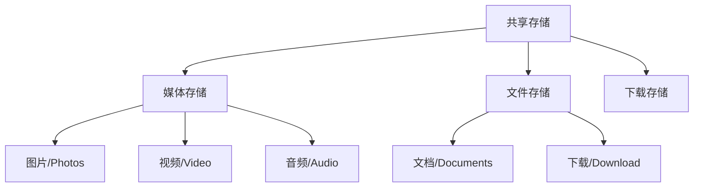

# 1.3.1 野餐时的分享时光

春日的下午，露营编程旅团在草地上野餐。洛FR拿出手机，想把拍到的风景分享给朋友。

“哎呀，我的照片好像打不开朋友们的相册，”洛FR有些困惑。

黛琳笑着说：“这涉及到Android的共享存储机制。咱们今天就来说说这个！”

## 1.3.1.1 什么是共享存储

“想象一下，”黛琳比喻道，“普通的应用专属存储就像是你自己的背包，只有你能拿出来。但是共享存储就像是公共图书馆，大家都能访问。”

“在Android中，”她继续说道，“共享存储就是存放那些需要和其他App共享的数据的地方。”

**共享存储适合存放：**
- 照片和视频
- 音乐和音频文件
- 文档和PDF
- 下载的文件

## 1.3.1.2 共享存储的类型

“共享存储分几种类型，”黛琳扳着手指说道。



**1. 媒体存储（MediaStore）**
- 系统维护的媒体数据库
- 图片、视频、音频
- 其他App可以扫描到

**2. 文件存储**
- 公开的文件目录
- Documents、Download等
- 需要存储访问框架

## 1.3.1.3 分区存储的影响

“但是！”黛琳强调道，“从Android 10开始，Google引入了'分区存储'（Scoped Storage），改变了共享存储的规则。”

分区存储的核心原则：
1. App只能访问自己的文件
2. 访问媒体文件需要权限
3. 访问其他文件需要用户授权

```kotlin
// Android 10+ 的变化
// ❌ 以前：可以直接访问外部存储
val file = File(Environment.getExternalStorageDirectory(), "myfile.txt")

// ✅ 现在：使用应用专属目录
val file = File(getExternalFilesDir(null), "myfile.txt")
```

## 1.3.1.4 使用MediaStore

“如果要访问共享的媒体文件，可以用MediaStore API，”黛琳说道。

```kotlin
// 读取图片
fun loadImages(context: Context): List<Uri> {
    val images = mutableListOf<Uri>()
    
    // 查询媒体存储
    val projection = arrayOf(
        MediaStore.Images.Media._ID,
        MediaStore.Images.Media.DISPLAY_NAME
    )
    
    context.contentResolver.query(
        MediaStore.Images.Media.EXTERNAL_CONTENT_URI,
        projection,
        null,
        null,
        null
    )?.use { cursor ->
        val idColumn = cursor.getColumnIndexOrThrow(MediaStore.Images.Media._ID)
        while (cursor.moveToNext()) {
            val id = cursor.getLong(idColumn)
            val uri = ContentUris.withAppendedId(
                MediaStore.Images.Media.EXTERNAL_CONTENT_URI,
                id
            )
            images.add(uri)
        }
    }
    
    return images
}
```

## 1.3.1.5 使用存储访问框架

“如果要访问任意文件，可以用SAF（Storage Access Framework），”黛琳继续说道。

```kotlin
// 打开文件选择器
fun openFile() {
    val intent = Intent(Intent.ACTION_OPEN_DOCUMENT).apply {
        addCategory(Intent.CATEGORY_OPENABLE)
        type = "*/*"  // 或者 "image/*"
    }
    startActivityForResult(intent, REQUEST_CODE)
}

// 处理结果
override fun onActivityResult(requestCode: Int, resultCode: Int, data: Intent?) {
    if (requestCode == REQUEST_CODE && resultCode == RESULT_OK) {
        data?.data?.let { uri ->
            // 获得文件的永久访问权限
            val takeFlags = Intent.FLAG_GRANT_READ_URI_PERMISSION
            contentResolver.takePersistableUriPermission(uri, takeFlags)
            
            // 读取文件
            contentResolver.openInputStream(uri)?.use { stream ->
                // 处理内容
            }
        }
    }
}
```

---

## 1.3.1.6 专业技术总结

本章我们学习了共享存储。

**核心要点：**

1. **共享存储用于分享** - 需要和其他App共享的数据
2. **分区存储是趋势** - Android 10+的新规则
3. **MediaStore API** - 访问图片、视频、音频
4. **SAF** - 存储访问框架，访问任意文件
5. **权限很重要** - 需要申请相应权限

**存储方式选择：**

| 场景 | 方式 |
|------|------|
| 自己的文件 | 应用专属存储 |
| 媒体文件 | MediaStore |
| 用户选择的文件 | SAF |
| 需要分享的文件 | 共享存储 |

---

> **学习建议**
> 
> 1. 尝试用MediaStore读取照片
> 2. 体验SAF文件选择器
> 3. 理解分区存储的意义
> 4. 下一章我们将学习媒体文件的具体访问

---

## 洛芙的小小日记本

> 共享存储就像公共图书馆，大家都能借书看！但是分区存储让每个人只能看自己的书。野餐的草莓🍓真甜呀！
