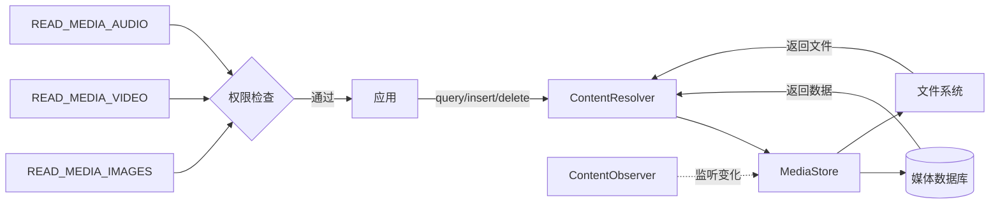

# 1.3.2 媒体

> 本篇对应官方文档：https://developer.android.com/training/data-storage/managed-media

五月的早晨，露营地的天空蓝得像可以从头顶直接跳进去。昨夜的雨把每一片叶子都洗得晶亮亮的，草叶上凝结的露珠像钻石一样闪烁着倒映着整个世界的光芒。远处的湖面上飘着一层薄薄的雾气，在初升的太阳底下渐渐散开，就像谁不小心打翻了一杯牛奶。

洛芙起了个大早，踩着湿漉漉的草地走到湖边。湖水清澈见底，水草在水底悠闲地摇摆着，偶尔有一两条银色的小鱼嗖地一下窜过去，留下一道转瞬即逝的银光。

她忍不住蹲下来，把手指轻轻放进水里——凉丝丝的，却让人心里格外安静。

“这么早？”黛琳的声音从身后传来。她穿着那件洗得发白的蓝色亚麻衬衫头发在晨风里轻轻飘动着，手里依然捧着她那杯永远温热的白开水。

“我在想，”洛芙没有回头，仍然盯着水面，“我们昨天学了共享存储……可是我还有好多问题。比如，那些照片、音乐、视频——它们是怎么被系统管理的呀？我总不能每个应用都自己去扫描一遍手机吧？”

黛琳在她旁边坐下来，看着湖面上正在冉冉升起的太阳：“你问得正好。今天要学的就是——媒体文件的管理。”

“媒体文件？”

“对。”黛琳点点头，“照片、音乐、 videos——这些是手机里最常见也最重要的文件。 Android 专门为它们准备了一个管理系统，叫做 MediaStore。 它就像一个巨大的图书馆目录，帮你把散落在各处的媒体文件整理得井井有条。”

洛芙的眼睛亮了起来：“图书馆目录？那太好了！我最怕的就是在手机里找不到自己拍的照片了。”

### 认识 MediaStore

希尔不知道什么时候也来了，背着她那个永远鼓鼓囊囊的背包。她把背包往草地上一放，整个人大大咧咧地躺了下去，双手枕在脑袋下面，翘着二郎腿晃呀晃的。

“MediaStore啊，”她懒洋洋地说，“你可以把它想象成一个超级图书管理员。这个管理员每天都在后台逛来逛去，把手机里所有的媒体文件都登记在案——谁拍的、在哪个文件夹、有多大、什么时候创建的——全都记得清清楚楚。”

“那我们怎么去找这些书呢？”洛芙问。

“问得好！”希尔一下子坐起来，精神来了，“来，看看这个——”

她打开笔记本电脑，屏幕在清晨的阳光下一时间显得有点暗，但很快就调整好了。

```kotlin
// MediaStore 查询示例：查找所有图片
// 1. 定义要查询哪些信息（就像借书时你要知道书名、作者、编号）
val projection = arrayOf(
    MediaStore.Images.Media._ID,                    // 图片的唯一标识符，相当于"图书编号"
    MediaStore.Images.Media.DISPLAY_NAME,         // 图片的文件名，相当于"书名"
    MediaStore.Images.Media.DATE_ADDED,            // 图片被添加到 MediaStore 的时间
    MediaStore.Images.Media.DATE_TAKEN,            // 图片实际拍摄的时间
    MediaStore.Images.Media.SIZE,                  // 文件大小（字节）
    MediaStore.Images.Media.DATA,                  // 文件的绝对路径（不推荐使用）
    MediaStore.Images.Media.MIME_TYPE              // 文件的 MIME 类型（如 image/jpeg）
)

// 2. 定义查询条件（可选，这里查询所有图片）
val selection = "${MediaStore.Images.Media.MIME_TYPE} LIKE ?"
val selectionArgs = arrayOf("image/%")

// 3. 定义排序方式（按拍摄时间倒序，最新的在最前面）
val sortOrder = "${MediaStore.Images.Media.DATE_TAKEN} DESC"

// 4. 执行查询
// contentResolver.query() 就像告诉图书管理员："帮我找所有图片，按时间排序"
contentResolver.query(
    MediaStore.Images.Media.EXTERNAL_CONTENT_URI,  // 这是"图片库"的入口地址
    projection,         // 要查询哪些信息
    selection,          // 查询条件
    selectionArgs,     // 条件参数
    sortOrder          // 排序方式
)?.use { cursor ->     // .use {} 确保查询完成后自动关闭游标
    // 5. 遍历结果
    val idColumn = cursor.getColumnIndexOrThrow(MediaStore.Images.Media._ID)
    val nameColumn = cursor.getColumnIndexOrThrow(MediaStore.Images.Media.DISPLAY_NAME)
    val dateColumn = cursor.getColumnIndexOrThrow(MediaStore.Images.Media.DATE_TAKEN)
    
    while (cursor.moveToNext()) {
        val id = cursor.getLong(idColumn)
        val name = cursor.getString(nameColumn)
        val date = cursor.getLong(dateColumn)
        
        Log.d("MediaStore", "找到图片: $name, 拍摄于: $date")
    }
}
```

伊莎不知道什么时候也走到了湖边，手里端着一杯刚泡好的花果茶，淡淡的甜香混在清晨的空气里。她听见代码，也凑过来看。

“你们看，”伊莎轻声说，声音像清晨的微风，“这多像安妮在故事书里做的那样——把所有珍贵的东西都编上号，整整齐齐地摆在记忆的架子上。”

洛芙笑了：“伊莎姐又在用比喻了！不过真的挺形象的——那个图书管理员每天都在后台忙来忙去的，不累吗？”

“不累的，”希尔 grins，“它可勤快了。而且它很聪明——你拍新照片的时候，它会自动发现并登记。你删文件的时候，它也会自动更新目录。”

黛琳补充道：“这就是 MediaStore 的好处——你不用自己去找文件，只需要问它就行了。它会帮你搞定一切。”

### 查询不同类型的媒体

“那……如果是音乐呢？”洛芙问，“我想做个播放器，是不是也能这样查？”

“当然可以！”希尔打了个响指，“MediaStore 对不同类型的媒体有不同的'分馆'——图片馆、音视频馆、下载馆……来，看看这个：”

```kotlin
// 查询音频文件（音乐）
// 音频的"分馆"入口是 Audio.Media.EXTERNAL_CONTENT_URI
val audioProjection = arrayOf(
    MediaStore.Audio.Media._ID,
    MediaStore.Audio.Media.DISPLAY_NAME,       // 歌曲名
    MediaStore.Audio.Media.ARTIST,             // 艺术家
    MediaStore.Audio.Media.ALBUM,              // 专辑
    MediaStore.Audio.Media.DURATION,           // 时长（毫秒）
    MediaStore.Audio.Media.DATA                // 文件路径
)

// 查询所有音乐
val audioCursor = contentResolver.query(
    MediaStore.Audio.Media.EXTERNAL_CONTENT_URI,
    audioProjection,
    null, null, null
)

// 处理音频结果
audioCursor?.use {
    val idIdx = it.getColumnIndexOrThrow(MediaStore.Audio.Media._ID)
    val nameIdx = it.getColumnIndexOrThrow(MediaStore.Audio.Media.DISPLAY_NAME)
    val artistIdx = it.getColumnIndexOrThrow(MediaStore.Audio.Media.ARTIST)
    val durationIdx = it.getColumnIndexOrThrow(MediaStore.Audio.Media.DURATION)
    
    while (it.moveToNext()) {
        val name = it.getString(nameIdx)
        val artist = it.getString(artistIdx)
        val duration = it.getLong(durationIdx)
        // 毫秒转换为 分:秒 格式
        val minutes = duration / 1000 / 60
        val seconds = (duration / 1000) % 60
        
        Log.d("Music", "$artist - $name (${minutes}:${String.format("%02d", seconds)})")
    }
}
```

“看到了吗？”希尔说，“不管是图片还是音乐，查询的方式都差不多——就是换了个'分馆地址'。”

洛芙点点头，又问：“那视频呢？”

“视频也是一样的。”黛琳接过话，“来，看这个——”

```kotlin
// 查询视频文件
val videoProjection = arrayOf(
    MediaStore.Video.Media._ID,
    MediaStore.Video.Media.DISPLAY_NAME,
    MediaStore.Video.Media.DATE_ADDED,
    MediaStore.Video.Media.DURATION,           // 视频时长（毫秒）
    MediaStore.Video.Media.SIZE,                // 文件大小
    MediaStore.Video.Media.WIDTH,               // 视频宽度
    MediaStore.Video.Media.HEIGHT              // 视频高度
)

// 查询所有视频，按添加时间倒序
val videoCursor = contentResolver.query(
    MediaStore.Video.Media.EXTERNAL_CONTENT_URI,
    videoProjection,
    null,
    null,
    "${MediaStore.Video.Media.DATE_ADDED} DESC"
)

videoCursor?.use {
    val nameIdx = it.getColumnIndexOrThrow(MediaStore.Video.Media.DISPLAY_NAME)
    val durationIdx = it.getColumnIndexOrThrow(MediaStore.Video.Media.DURATION)
    val sizeIdx = it.getColumnIndexOrThrow(MediaStore.Video.Media.SIZE)
    
    while (it.moveToNext()) {
        val name = it.getString(nameIdx)
        val duration = it.getLong(durationIdx)
        val sizeMB = it.getLong(sizeIdx) / (1024 * 1024)  // 转换为 MB
        
        Log.d("Video", "$name (${duration/1000}s, ${sizeMB}MB)")
    }
}
```

“原来是这样！”洛芙兴奋地说，“我之前还想说要是有个现成的列表就好了——原来系统早就给我们准备好了！”

### 用 ContentResolver 读取媒体内容

“那……查到之后呢？”洛芙问，“我知道了文件在哪，可是怎么真正'读'到它？比如我要在 ImageView 里显示一张图片？”

希尔又要开始演示了。她新建了一个 Android 项目，飞快地敲着代码。

“这个啊，有两种方式。第一种最简单——直接用系统的 ImageView 加载功能。”

```kotlin
// 方法一：直接用 ImageView 加载（最简单）
// 1. 从 MediaStore 查询获取图片的 Uri
val imageUri = ContentUris.withAppendedId(
    MediaStore.Images.Media.EXTERNAL_CONTENT_URI,
    imageId  // 你之前查询到的图片 ID
)

// 2. 直接设置给 ImageView
imageView.setImageURI(imageUri)

// ImageView 会自动处理流、缓存、缩放等一切事务
// 适合列表展示等场景，简单到没朋友
```

“太简单了吧！”洛芙惊呼。

“第二种呢？”黛琳问。

“第二种更灵活，适合需要特殊处理的情况。”希尔继续敲代码。

```kotlin
// 方法二：手动读取媒体流（更灵活）
// 适用于：缩放处理、滤镜、复制到其他位置等场景

// 1. 获取图片 Uri
val imageUri = ContentUris.withAppendedId(
    MediaStore.Images.Media.EXTERNAL_CONTENT_URI,
    imageId
)

// 2. 打开输入流
contentResolver.openInputStream(imageUri)?.use { inputStream ->
    // 3. 解码为 Bitmap
    // BitmapFactory.Options 用来配置解码参数
    val options = BitmapFactory.Options().apply {
        inJustDecodeBounds = true  // 第一步：只读取图片信息，不加载到内存
    }
    
    // 先获取图片尺寸
    BitmapFactory.decodeStream(inputStream, null, options)
    
    // 4. 计算合适的缩放比例（避免 OOM）
    // 目标：将图片缩放到 ImageView 的大小
    options.inSampleSize = calculateInSampleSize(options, targetWidth, targetHeight)
    options.inJustDecodeBounds = false  // 真正加载到内存
    
    // 5. 重新打开流并解码
    contentResolver.openInputStream(imageUri)?.use { stream ->
        val bitmap = BitmapFactory.decodeStream(stream, null, options)
        imageView.setImageBitmap(bitmap)
    }
}

/**
 * 计算缩放比例
 * @param options 图片信息（已通过 inJustDecodeBounds = true 获取）
 * @param reqWidth 目标宽度
 * @param reqHeight 目标高度
 */
fun calculateInSampleSize(
    options: BitmapFactory.Options,
    reqWidth: Int,
    reqHeight: Int
): Int {
    val height = options.outHeight
    val width = options.outWidth
    var inSampleSize = 1

    if (height > reqHeight || width > reqWidth) {
        val halfHeight = height / 2
        val halfWidth = width / 2
        // 一直除以 2，直到尺寸小于目标尺寸
        while (halfHeight / inSampleSize >= reqHeight && halfWidth / inSampleSize >= reqWidth) {
            inSampleSize *= 2
        }
    }
    return inSampleSize
}
```

“看起来好复杂……”洛芙歪着头。

“复杂是复杂，”希尔解释道，“但这套流程是必须的——你要考虑性能啊！不做缩放的话，几百兆的大图直接往内存里塞，手机会直接卡死。”

黛琳点点头：“这就是工程——不是最优雅的代码，而是最实用的代码。”

### 监听媒体变化

伊莎一直安静地听着，这时候忽然开口了：“可是……如果用户在手机图库里删了一张照片，你们的应用怎么知道呢？”

“对哦！”洛芙也反应过来了，“总不能每次都重新查一遍吧？”

希尔嘿嘿一笑：“当然有更好的办法——用 ContentObserver 监听变化！”

```kotlin
// 监听图片库变化
// 当系统检测到图片被添加、删除、修改时，会触发这个 Observer
class ImageChangeObserver(
    private val contentResolver: ContentResolver
) : ContentObserver(Handler(Looper.getMainLooper())) {

    // 当数据发生变化时，这个方法会被调用
    override fun onChange(selfChange: Boolean) {
        super.onChange(selfChange)
        Log.d("MediaObserver", "检测到图片库变化，刷新数据！")
        // 这里可以触发数据重新加载
    }

    // 注册观察者
    fun register() {
        // 监听外部存储的图片 Uri
        contentResolver.registerContentObserver(
            MediaStore.Images.Media.EXTERNAL_CONTENT_URI,
            true,  // 是否监听子目录的变化
            this
        )
    }

    // 注销观察者
    fun unregister() {
        contentResolver.unregisterContentObserver(this)
    }
}

// 使用
val observer = ImageChangeObserver(contentResolver)
observer.register()

// 当不再需要监听时（比如 Activity 销毁）
// observer.unregister()
```

“哇！”洛芙的眼睛闪闪发光，“这就像是给图书馆管理员留了个电话号码——有什么变动就马上通知你！”

“对，”黛琳说，“这样你就不用一直轮询查询了，省电又高效。”

### 创建和删除媒体

“那……如果我想在相册里'创建'一张照片呢？”洛芙又问，“比如用户在我的应用里画了一幅画，我想把它保存到相册里让其他应用也能看到？”

希尔看向黛琳：“这个你来？”

黛琳点点头，接过电脑。

“创建媒体文件和创建普通文件不太一样——你要通过 MediaStore 来'登记'这个新文件，系统会帮你放到正确的位置。”

```kotlin
// 创建一张图片并添加到相册
// 1. 构建图片的"简历"（ContentValues）
val values = ContentValues().apply {
    // 文件名（带时间戳，避免重复）
    put(MediaStore.Images.Media.DISPLAY_NAME, "my_art_${System.currentTimeMillis()}.jpg")
    
    // MIME 类型
    put(MediaStore.Images.Media.MIME_TYPE, "image/jpeg")
    
    // 图片宽度和高度（可选，但推荐填写）
    put(MediaStore.Images.Media.WIDTH, bitmap.width)
    put(MediaStore.Images.Media.HEIGHT, bitmap.height)
    
    // 相对路径（Android 10+）
    // 放在 "Pictures/我的画作" 文件夹下
    put(MediaStore.Images.Media.RELATIVE_PATH, "Pictures/我的画作")
    
    // 或者用 DEPATED_RELATIVE_PATH（旧版兼容）
    // put(MediaStore.Images.Media.DATA, "${Environment.getExternalStorageDirectory()}/Pictures/我的画作/my_art.jpg")
    
    // 添加时间（可选，默认是当前时间）
    put(MediaStore.Images.Media.DATE_ADDED, System.currentTimeMillis() / 1000)
}

// 2. 让 MediaStore 分配一个"书号"（Uri）
val uri = contentResolver.insert(
    MediaStore.Images.Media.EXTERNAL_CONTENT_URI,
    values
)

// 3. 打开"书页"（输出流），写入实际数据
uri?.let { imageUri ->
    contentResolver.openOutputStream(imageUri)?.use { outputStream ->
        // 将 Bitmap 压缩为 JPEG 格式写入
        bitmap.compress(Bitmap.CompressFormat.JPEG, 95, outputStream)
    }
    
    Log.d("MediaStore", "图片已保存到相册: $imageUri")
}
```

“如果用户想删除一张照片呢？”洛芙问。

“删除也很简单。”黛琳说。

```kotlin
// 删除一张图片
// 1. 方式一：通过 ID 删除（推荐）
val imageId = 123L  // 你之前查询到的图片 ID
val uri = ContentUris.withAppendedId(MediaStore.Images.Media.EXTERNAL_CONTENT_URI, imageId)
val deletedRows = contentResolver.delete(uri, null, null)

if (deletedRows > 0) {
    Log.d("MediaStore", "图片删除成功")
} else {
    Log.d("MediaStore", "图片删除失败，可能已被删除")
}

// 2. 方式二：直接用 Uri 删除（如果你已经有 Uri）
val existingUri = ContentUris.withAppendedId(
    MediaStore.Images.Media.EXTERNAL_CONTENT_URI,
    imageId
)
contentResolver.delete(existingUri, null, null)
```

“要小心哦，”伊莎提醒道，“删除之前最好先问用户确认——毕竟这是用户的照片，不是我们应用的东西。”

洛芙认真点头：“知道了。尊重用户的数据，这是基本原则。”

### 权限的新变化

太阳已经升得老高了，湖面上的雾气完全散开了，露出下面清澈的、带着微微绿色的湖水。几只白鹭从湖面上掠过，翅膀在阳光下一闪一闪的。

“对了，”洛芙忽然想起来一个问题，“我们刚才好像没申请什么权限？查 MediaStore 不需要权限的吗？”

希尔点点头：“问得好！Android 的权限系统这几年变过好几次——”

“在 Android 10 之前，”黛琳接上，“你需要一个很宽泛的权限：READ_EXTERNAL_STORAGE。 一旦用户同意，你就能读取手机上所有的媒体文件。”

“在 Android 10 之后呢？”洛芙问。

“分区存储来了，”希尔说，“虽然你还是可以申请 READ_EXTERNAL_STORAGE， 但系统会让你只读取'你的应用创建的媒体'和'用户选择的媒体'。不是所有文件都能乱读了。”

“那 Android 13 呢？”黛琳又问。

“Android 13 更精细了——它把权限拆成了三个：READ_MEDIA_IMAGES、READ_MEDIA_VIDEO、READ_MEDIA_AUDIO。”希尔解释道，“你想读图片就去申请读图片的权限，读音乐就去申请读音乐的权限——更细粒度，更安全。”

```kotlin
// Android 13+ 请求媒体权限
// 在 AndroidManifest.xml 中声明
/*
<uses-permission android:name="android.permission.READ_MEDIA_IMAGES" />
<uses-permission android:name="android.permission.READ_MEDIA_VIDEO" />
<uses-permission android:name="android.permission.READ_MEDIA_AUDIO" />
*/

// 检查权限
fun hasMediaPermission(context: Context): Boolean {
    return if (Build.VERSION.SDK_INT >= Build.VERSION_CODES.TIRAMISU) {
        // Android 13+：分别检查
        ContextCompat.checkSelfPermission(
            context,
            Manifest.permission.READ_MEDIA_IMAGES
        ) == PackageManager.PERMISSION_GRANTED
    } else {
        // Android 12 及以下
        ContextCompat.checkSelfPermission(
            context,
            Manifest.permission.READ_EXTERNAL_STORAGE
        ) == PackageManager.PERMISSION_GRANTED
    }
}

// 请求权限
fun requestMediaPermission(activity: Activity) {
    val permissions = if (Build.VERSION.SDK_INT >= Build.VERSION_CODES.TIRAMISU) {
        arrayOf(
            Manifest.permission.READ_MEDIA_IMAGES,
            Manifest.permission.READ_MEDIA_VIDEO,
            Manifest.permission.READ_MEDIA_AUDIO
        )
    } else {
        arrayOf(Manifest.permission.READ_EXTERNAL_STORAGE)
    }
    
    ActivityCompat.requestPermissions(
        activity,
        permissions,
        REQUEST_CODE_MEDIA_PERMISSION
    )
}
```

“所以，”洛芙总结道，“如果用户用的是新手机，我们最好用新的细粒度权限；如果用户用的是老手机，就用老权限兼容。”

“完全正确。”黛琳笑着说。

伊莎眺望着远方的湖面几只鸟正在那里悠闲地飞来飞去：“你看，Android 也在进步——从什么都能看到只能看该看的。 这也是一种成长吧。”

### 洛芙的图片展示应用

洛芙打开自己的笔记本电脑眼睛里闪着光：“我想做一个应用——显示相册里的所有照片！就用我们今天学的这些！”

她飞快地写着代码，希尔在旁边看着，偶尔指点一下。

```kotlin
// 洛芙的图片展示应用 - MainActivity.kt
class MainActivity : AppCompatActivity() {

    private lateinit var recyclerView: RecyclerView
    private lateinit var adapter: ImageAdapter
    
    override fun onCreate(savedInstanceState: Bundle?) {
        super.onCreate(savedInstanceState)
        setContentView(R.layout.activity_main)
        
        recyclerView = findViewById(R.id.recyclerView)
        adapter = ImageAdapter()
        recyclerView.adapter = adapter
        
        // 检查并请求权限
        if (hasMediaPermission(this)) {
            loadImages()
        } else {
            requestMediaPermission(this)
        }
    }

    // 加载图片列表
    private fun loadImages() {
        lifecycleScope.launch(Dispatchers.IO) {
            val images = queryAllImages()
            withContext(Dispatchers.Main) {
                adapter.submitList(images)
            }
        }
    }

    // 查询所有图片
    private fun queryAllImages(): List<MediaImage> {
        val images = mutableListOf<MediaImage>()
        
        val projection = arrayOf(
            MediaStore.Images.Media._ID,
            MediaStore.Images.Media.DISPLAY_NAME,
            MediaStore.Images.Media.DATE_TAKEN
        )
        
        contentResolver.query(
            MediaStore.Images.Media.EXTERNAL_CONTENT_URI,
            projection,
            null, null,
            "${MediaStore.Images.Media.DATE_TAKEN} DESC"
        )?.use { cursor ->
            val idColumn = cursor.getColumnIndexOrThrow(MediaStore.Images.Media._ID)
            val nameColumn = cursor.getColumnIndexOrThrow(MediaStore.Images.Media.DISPLAY_NAME)
            
            while (cursor.moveToNext()) {
                val id = cursor.getLong(idColumn)
                val name = cursor.getString(nameColumn)
                val uri = ContentUris.withAppendedId(
                    MediaStore.Images.Media.EXTERNAL_CONTENT_URI,
                    id
                )
                images.add(MediaImage(id, name, uri))
            }
        }
        
        return images
    }

    override fun onRequestPermissionsResult(
        requestCode: Int,
        permissions: Array<out String>,
        grantResults: IntArray
    ) {
        super.onRequestPermissionsResult(requestCode, permissions, grantResults)
        if (requestCode == REQUEST_CODE_MEDIA_PERMISSION) {
            if (grantResults.isNotEmpty() && grantResults[0] == PackageManager.PERMISSION_GRANTED) {
                loadImages()
            } else {
                Toast.makeText(this, "需要权限才能显示图片", Toast.LENGTH_SHORT).show()
            }
        }
    }
}

// 图片数据类
data class MediaImage(
    val id: Long,
    val name: String,
    val uri: Uri
)

// RecyclerView Adapter
class ImageAdapter : RecyclerView.Adapter<ImageAdapter.ViewHolder>() {
    
    private var images: List<MediaImage> = emptyList()
    
    fun submitList(newImages: List<MediaImage>) {
        images = newImages
        notifyDataSetChanged()
    }
    
    override fun onCreateViewHolder(parent: ViewGroup, viewType: Int): ViewHolder {
        val view = LayoutInflater.from(parent.context)
            .inflate(R.layout.item_image, parent, false)
        return ViewHolder(view)
    }
    
    override fun onBindViewHolder(holder: ViewHolder, position: Int) {
        holder.bind(images[position])
    }
    
    override fun getItemCount() = images.size
    
    class ViewHolder(itemView: View) : RecyclerView.ViewHolder(itemView) {
        private val imageView: ImageView = itemView.findViewById(R.id.imageView)
        
        fun bind(image: MediaImage) {
            // 直接用 ImageView 加载，简单高效
            imageView.setImageURI(image.uri)
        }
    }
}
```

代码写完的时候，太阳已经移到头顶了。洛芙运行了一下模拟器——一排排的照片整整齐齐地出现在屏幕上，就像一本翻开的相册。

“成功了！”洛芙高兴得差点从草地上跳起来。

黛琳、伊莎和希尔都鼓起掌来。

“你看，”伊莎温柔地说，“这就是 MediaStore 的力量——它帮你管理好了所有珍贵的记忆，你只需要负责展示就好了。”

洛芙看着屏幕上一张张熟悉或不熟悉的照片，心里忽然涌起一种很奇怪的感觉——这些照片，每一张背后都有一个故事，一个瞬间，一个永远不会再来一次的时刻。

而她，现在可以用代码，把这些故事和瞬间，带给更多人看。

“谢谢你们，”她轻声说，声音有点哽咽，“今天我又学到了好多。”

黛琳拍了拍她的肩膀：“这只是个开始。MediaStore 还有更多好玩的功能——音频、视频……慢慢探索吧。”

远处传来午餐的铃声。伊莎站起身，裙子上沾满了草叶和阳光。

“走吧，”她笑着说，“下午再继续——还有更多精彩在等着我们呢。”

洛芙最后回头看了一眼湖面——阳光在那里跳跃着，闪烁着，就像无数颗小星星。

她忽然觉得，今天真是一个美好的日子。

---

### 技术总结

> **媒体（Media）**—— Android 通过 MediaStore 提供统一的媒体文件管理系统，涵盖图片、音频、视频三类内容。开发者可通过 ContentResolver 查询、创建、删除媒体文件，系统会自动索引并维护目录。Android 13+ 引入细粒度媒体权限（READ_MEDIA_IMAGES/VIDEO/AUDIO），提升用户隐私保护。

#### 今日关键词

1. **MediaStore**：Android 的媒体文件管理系统，相当于一个自动维护的"图书馆目录"。
2. **ContentResolver**：与 MediaStore 交互的统一接口，负责执行查询、插入、删除操作。
3. **ContentObserver**：媒体变化监听器，当系统媒体库发生变化时自动回调通知应用。
4. **分区存储**：Android 10+ 引入的存储权限模型，限制应用随意访问用户媒体。
5. **细粒度权限**：Android 13+ 将媒体权限拆分为图片、视频、音频三类，分别授权。

#### 结构图



#### 反模式与陷阱

1. **直接读取 DATA 字段的绝对路径**：Android 10+ 可能失效，应使用 Uri 访问。  
   修复：用 ContentUris.withAppendedId() 构建 Uri。

2. **不做缩放直接加载大图**：导致 OOM，应用崩溃。  
   修复：用 BitmapFactory.Options.inSampleSize 计算缩放比例。

3. **不申请权限直接查询**：Android 6.0+ 必须动态申请。  
   修复：先检查权限，再执行查询。

4. **不注销 ContentObserver**：导致内存泄漏。  
   修复：在 onDestroy 中调用 unregisterContentObserver()。

5. **查询不使用索引字段**：查询速度慢。  
   修复：用 DATE_ADDED、DATE_TAKEN 等索引字段排序。

#### 设计思想

- **索引优先**：MediaStore 维护索引，应用通过索引访问而非直接扫描文件系统。
- **变化监听**：用 Observer 替代轮询，省电又实时。
- **Uri 统一入口**：用 ContentResolver + Uri 屏蔽底层实现差异。
- **权限最小化**：Android 13+ 细粒度权限，只申请需要的。

### 🏕️ 动手练习

#### Task 1 · 照片展示墙 ★

**目标**：查询设备相册中的所有图片，以网格形式展示在屏幕上。

**你需要做的事：**

1. 新建 Android 项目（Empty Activity）
2. 布局使用 RecyclerView + GridLayoutManager（2 列）
3. 查询 MediaStore.Images，获取图片 Uri 和名称
4. 在 Adapter 中用 ImageView.setImageURI() 加载图片
5. 处理权限申请

**验收标准：**
- [ ] 权限申请成功，显示图片网格
- [ ] 图片按拍摄时间倒序排列
- [ ] 滑动手势流畅

**提示：**
```kotlin
val uri = ContentUris.withAppendedId(
    MediaStore.Images.Media.EXTERNAL_CONTENT_URI,
    imageId
)
imageView.setImageURI(uri)
```

---

#### Task 2 · 音乐播放器 ★★

**目标**：查询设备中的所有音乐，显示歌曲名、艺术家、时长，点击播放。

**你需要做的事：**

1. 查询 MediaStore.Audio，获取歌曲信息
2. 列表显示：歌名 - 艺术家 - 时长（分:秒）
3. 点击列表项，使用 MediaPlayer 播放
4. 显示播放状态（正在播放/暂停）

**验收标准：**
- [ ] 显示所有音乐（按标题排序）
- [ ] 点击播放/暂停正常
- [ ] 退出页面停止播放

**提示：**
```kotlin
val durationMs = cursor.getLong(cursor.getColumnIndexOrThrow(MediaStore.Audio.Media.DURATION))
val minutes = durationMs / 1000 / 60
val seconds = (durationMs / 1000) % 60
```

---

#### Task 3 · 图片拍摄并保存到相册 ★★★

**目标**：调用系统相机拍照，保存到相册"我的作品"文件夹。

**你需要做的事：**

1. 用 CameraX 或 Intent 调用系统相机拍照
2. 获取拍摄的照片 Bitmap
3. 通过 MediaStore 创建新图片记录（RELATIVE_PATH = Pictures/我的作品）
4. 用 ContentResolver.openOutputStream() 写入数据
5. 成功后 Toast 提示

**验收标准：**
- [ ] 拍照成功
- [ ] 相册中能看到"我的作品"文件夹
- [ ] 文件名包含时间戳

**提示：**
```kotlin
val values = ContentValues().apply {
    put(MediaStore.Images.Media.DISPLAY_NAME, "IMG_${System.currentTimeMillis()}.jpg")
    put(MediaStore.Images.Media.RELATIVE_PATH, "Pictures/我的作品")
}
val uri = contentResolver.insert(MediaStore.Images.Media.EXTERNAL_CONTENT_URI, values)
```

---

#### Task 4 · 图片变化监听 ★★★

**目标**：监听相册变化，当图片被添加/删除时自动刷新列表。

**你需要做的事：**

1. 创建 ContentObserver 子类
2. 在 onChange() 中触发数据重新加载
3. 在 onResume() 注册，onPause() 注销
4. 测试：手动在相册删除/添加图片，验证列表自动刷新

**验收标准：**
- [ ] 外部删除图片，列表自动更新
- [ ] 外部添加图片，列表自动更新
- [ ] 页面不可见时不会监听

**提示：**
```kotlin
class MyObserver : ContentObserver(Handler(Looper.getMainLooper())) {
    override fun onChange(selfChange: Boolean) {
        // 触发数据刷新
    }
}
```

---

#### Task 5 · 大图缩放展示 ★★★

**目标**：加载大图时做缩放处理，避免 OOM。

**你需要做的事：**

1. 查询图片获取原始尺寸（inJustDecodeBounds = true）
2. 根据目标 View 大小计算 inSampleSize
3. 真正加载缩放后的图片
4. 在 ImageView 中展示

**验收标准：**
- [ ] 加载 4K 图片不崩溃
- [ ] 缩放后图片质量可接受
- [ ] 加载速度明显快于原图

**提示：**
```kotlin
options.inSampleSize = calculateInSampleSize(options, targetWidth, targetHeight)
options.inJustDecodeBounds = false
val bitmap = BitmapFactory.decodeStream(...)
```

---

#### Task 6 · 视频缩略图列表 ★★★★

**目标**：查询视频列表，显示缩略图和基本信息。

**你需要做的事：**

1. 查询 MediaStore.Video
2. 用 ThumbnailUtils.createVideoThumbnail() 获取缩略图
3. 显示：缩略图、名称、时长、大小
4. 点击进入视频播放

**验收标准：**
- [ ] 视频列表显示缩略图
- [ ] 时长显示为 分:秒 格式
- [ ] 点击播放正常

**提示：**
```kotlin
val thumbnail = ThumbnailUtils.createVideoThumbnail(
    videoPath,
    MediaStore.Images.Thumbnails.MINI_KIND
)
```

---

#### Task 7 · 按文件夹分类展示 ★★★★

**目标**：按相册文件夹分组显示图片。

**你需要做的事：**

1. 查询时用 BUCKET_DISPLAY_NAME 获取文件夹名
2. 按文件夹名分组，构建 Map<String, List<Image>>
3. 列表显示：文件夹名 + 第一张图片 + 图片数量
4. 点击进入文件夹详情页

**验收标准：**
- [ ] 正确识别各文件夹（Camera, Screenshots, Download 等）
- [ ] 分组数量正确
- [ ] 点击进入详情页显示该文件夹所有图片

**提示：**
```kotlin
val bucketColumn = cursor.getColumnIndexOrThrow(MediaStore.Images.Media.BUCKET_DISPLAY_NAME)
val bucket = cursor.getString(bucketColumn)
```

---

#### Task 8 · 媒体收藏夹 ★★★★★

**目标**：实现"收藏"功能，收藏的图片保存在应用的私有收藏夹（不通过 MediaStore）。

**你需要做的事：**

1. 创建收藏表（Room 数据库）或 SharedPreferences 存储收藏的图片 ID
2. 列表显示所有图片，收藏的图片显示心形图标
3. 点击心形切换收藏状态
4. 收藏页显示所有已收藏图片
5. 卸载应用后重新安装，收藏数据保留（需持久化）

**验收标准：**
- [ ] 收藏/取消收藏正常
- [ ] 收藏数据持久化
- [ ] 收藏页正确显示

**提示：**
```kotlin
// 存储收藏的 ID 列表
val prefs = getSharedPreferences("favorites", Context.MODE_PRIVATE)
val favorites = prefs.getStringSet("image_ids", emptySet())?.toMutableSet()
```

---

#### 💬 面试热身：用自己的话回答这些问题

> 不用写代码，试着用一两句话说清楚就好。能说清楚，才是真的懂了。

**Q1**：MediaStore 是什么？它和直接读写文件有什么区别？

**Q2**：ContentObserver 的作用是什么？为什么用它比定时轮询好？

**Q3**：Android 13 的细粒度媒体权限是什么？为什么要这样设计？

**Q4**：加载大图时为什么要做缩放处理？不做会怎样？

**Q5**：为什么推荐用 Uri 而不是绝对路径访问媒体文件？

---

> MediaStore 就像一个尽职的图书馆管理员——你不需要知道每本书放在哪里，只需要告诉它你要什么，它就会帮你找到。学习好 MediaStore 的使用，就是学会如何与系统的媒体库优雅地对话。

### 🍭 洛芙的小小日记本

今天学会了 MediaStore！原来手机里的照片、音乐、视频都被它管理得井井有条。我做了一个图片展示应用，看到那些照片的时候，心里好感动——每一张背后都是一个故事啊。谢谢希尔、黛琳、伊莎，今天也是收获满满的一天！✨
