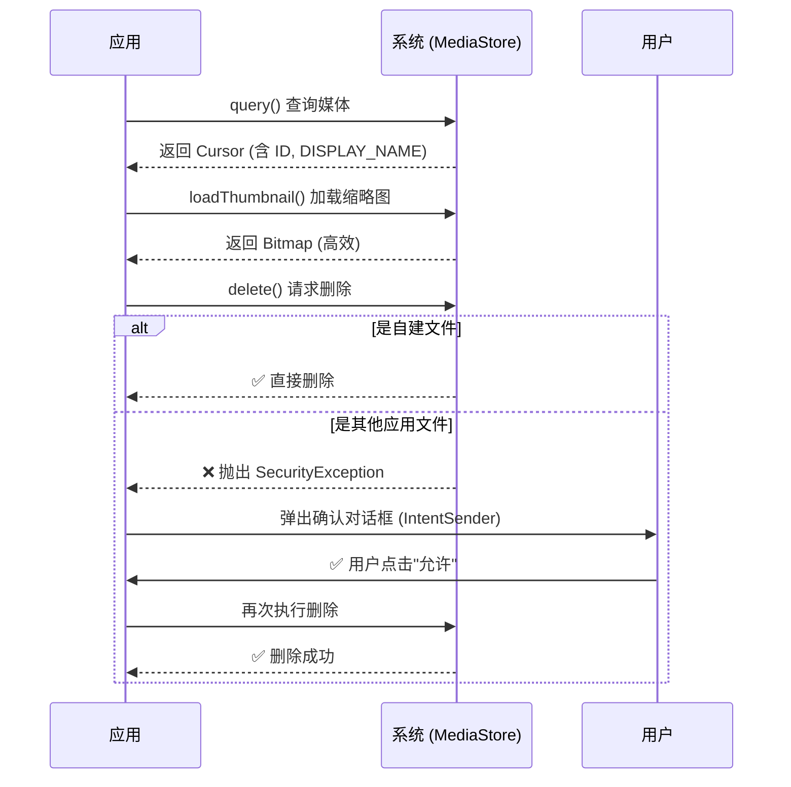
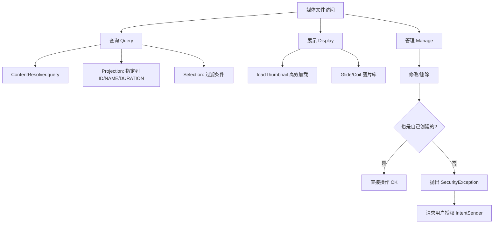

# 1.3.2 Access media files from shared storage

---
chapter_id: '1.3.2'
title: '访问共享存储中的媒体文件'
official_title: 'Access media files from shared storage'
official_url: 'https://developer.android.com/training/data-storage/shared/media'
topic_url: 'https://developer.android.com/training/data-storage'
status: 'done'
volume_priority: 8
volume_grade: 'A'
chapter_importance: 5

plot_summary:
  time: '午后'
  location: '湖边'
  scene: '挑选照片'
  season: '秋季'
  environment: '湖水波光、柳树摇曳'
  topic: '访问媒体文件'
  discussion: '如何读取图片、音频、视频'
  problem_solved: '学习MediaStore API访问共享媒体'
  difficulty: '权限请求'
  next_topic: '照片选择器'
---

## 1.3.2 访问共享存储中的媒体文件

> 本篇对应官方文档：https://developer.android.com/training/data-storage/shared/media

午后的阳光把湖面照得像铺了一层碎金子，波光粼粼的，晃得人眼睛有点花。四个人在湖边支起了两根钓鱼竿，不过比起钓鱼，大家似乎更享受这种不用说话的安静。

洛芙坐在折叠椅上，腿上搁着笔记本电脑，眉头却越皱越紧。

"怎么了？"坐在旁边负责看鱼漂的希尔懒懒地问了一句，手里的草帽随着动作扇起一点微风。

"卡住了。"洛芙把屏幕转过去，"我把昨晚学的 MediaStore 查询用上了，想做一个照片墙。可是这列表滑起来……就像生锈的齿轮一样，一卡一顿的。"

希尔探头看了一眼，嘴角立刻扬了起来："哈，经典的'生吞大鱼'事故。"

"生吞大鱼？"

"你那是 1200 万像素的原图，每一张都好几兆。"希尔指着代码里的 `BitmapFactory.decodeStream`，"你让 RecyclerView 在几毫秒内把这些大家伙全都读进内存还要缩放显示，主线程不累死才怪。你的应用没 OOM（内存溢出）崩掉已经是奇迹了。"

洛芙缩了缩脖子："那……我该怎么办？"

伊莎正在画板上涂抹着湖水的颜色，闻言轻轻插了一句："看风景的时候，你不会用显微镜去看每一片叶子。你需要的是缩略图。"

"正解。"希尔打了个响指，"今天的主题就是——怎么优雅地处理这群游来游去的大鱼。"

---

### 高效加载：缩略图魔法

黛琳放下手里的书，把遮阳伞往洛芙那边倾斜了一点。"Android 早就想到了这个问题。从 Android 10 (API 29) 开始，系统提供了一个专门的 API 来获取缩略图，叫 `loadThumbnail`。"

"它比我自己压缩更快吗？"洛芙问。

"快得多。"黛琳解释道，"因为系统在扫描媒体文件时，通常已经生成并缓存了缩略图。你调用这个 API，就像直接去拿索引卡片，而不是去搬运整个档案柜。"

```kotlin
// 高效加载缩略图（API 29+）
// loadThumbnail() 是 ContentResolver 的扩展方法
// 参数1：文件的 Uri
// 参数2：需要的尺寸（Size 对象）
// 参数3：取消信号（可选）
try {
    val size = Size(640, 480) // 请求的缩略图尺寸
    val thumbnail = contentResolver.loadThumbnail(uri, size, null)
    imageView.setImageBitmap(thumbnail)
} catch (e: IOException) {
    // 加载失败的处理
    e.printStackTrace()
}
```

"那 API 29 以下呢？"洛芙现在的直觉已经非常敏锐了，"还有很多旧手机呢。"

"旧版本稍微麻烦一点，"希尔在键盘上敲了几行，"得用 `MediaStore.Images.Thumbnails.getThumbnail`。不过现在大多用 Glide 或 Coil 这样的图片库，它们内部自动处理了这些版本差异。但懂原理很重要——库也是在用这些 API。"

洛芙试着把代码换成了 `loadThumbnail`，重新运行。这一次，列表滑动得像丝绸一样顺滑，再也没有那讨厌的卡顿感。

"舒服了。"她长叹一口气，整个人瘫在椅子里。

### 权限的变迁：从一吧抓到分门别类

"顺便复习一下门票。"黛琳指着湖面，"以前我们要进这个湖抓鱼，只要申请一张大通票 `READ_EXTERNAL_STORAGE`。但从 Android 13 (API 33) 开始，这张通票作废了。"

洛芙坐直了身子："作废了？"

"对。现在是分票制。"黛琳在沙地上画了三个圈，"你想抓图片，就申请 `READ_MEDIA_IMAGES`；想抓视频，申请 `READ_MEDIA_VIDEO`；想抓音频，申请 `READ_MEDIA_AUDIO`。如果你只申请了图片权限，那么视频文件对你来说就是隐形的。"

```kotlin
// Android 13+ (API 33) 的权限请求逻辑
val permissions = if (Build.VERSION.SDK_INT >= Build.VERSION_CODES.TIRAMISU) {
    arrayOf(
        Manifest.permission.READ_MEDIA_IMAGES,
        Manifest.permission.READ_MEDIA_VIDEO
    )
} else {
    // 旧版本依然使用 READ_EXTERNAL_STORAGE
    arrayOf(Manifest.permission.READ_EXTERNAL_STORAGE)
}

// 请求权限...
```

"这就叫——"伊莎停下画笔，看着远处的飞鸟，"最小权限原则。你不需要知道我在听什么歌，只要看我想展示的照片就好。"

### 修改与删除：请客气的敲门

"那……如果我想删掉一张照片呢？"洛芙问，"比如这张糊掉的。"

"如果是你自己应用拍的，存的时候就是你，那随便删。"希尔说，"但如果是别的应用拍的——比如系统相机——那就不一样了。在 Android 10 以后，你不能直接删别人的文件，会抛出 `SecurityException`。"

"那怎么办？不能删？"

"能删，但要'敲门'。"希尔把鱼竿提起来看了一眼，鱼饵还在，"捕获到异常后，系统会给你一个 `IntentSender`。你用它弹出一个系统对话框，问用户：'某某应用想删除这张照片，同意吗？' 用户点了同意，你才能动手。"

"好麻烦……"洛芙嘟囔。

"这叫尊重。"黛琳淡淡地说，"还是那个比喻：这是公共营地。你不能因为觉得别人的帐篷丑，就直接把它拆了。你得先问主人。"

```kotlin
// 删除媒体文件的正确姿势（兼容 Scoped Storage）
fun deleteMedia(uri: Uri) {
    try {
        // 尝试直接删除
        contentResolver.delete(uri, null, null)
    } catch (e: SecurityException) {
        // 捕获安全异常
        val recoverableSecurityException = e as? RecoverableSecurityException
        if (recoverableSecurityException != null) {
            // Android 10 (API 29) 特定处理：
            // 获取 IntentSender，用来请求用户授权
            val intentSender = recoverableSecurityException.userAction.actionIntent.intentSender
            
            // 启动系统弹窗（需要 Activity Result API 配合处理回调）
            startIntentSenderForResult(
                intentSender, 
                DELETE_REQUEST_CODE, 
                null, 0, 0, 0, null
            )
        } else {
            // Android 11+ (API 30) 处理方式略有不同（通常使用 MediaStore.createDeleteRequest）
            // 这里为了简化逻辑，先展示异常捕获的核心思想
            throw e 
        }
    }
}
```

"注意，Android 11 又改版了，有了 `MediaStore.createDeleteRequest`，可以批量申请。"希尔补充道，"API 变来变去是 Android 的常态，习惯就好。"

洛芙看着那个 `try-catch` 块，若有所思："所以代码也是要讲礼貌的。"

### 视频与音频的特殊处理

"除了图片，湖里还有别的鱼。"伊莎指了指水面下的阴影，"视频和音频有它们独特的属性——时长。"

"直接读文件大小不行吗？"

"大小不代表时长。"黛琳摇头，"你需要查询特定的列，比如 `MediaStore.Video.Media.DURATION`。而且别忘了，从 Android 10 开始，获取这些元数据可能需要 `ACCESS_MEDIA_LOCATION` 权限——尤其是照片的地理位置信息（Exif）。那就是藏在鱼肚子里的秘密了，系统保护得更严。"



> 图 1：媒体文件的查询、加载与删除流程，重点在于处理删除时的权限请求。

### 真正的"相册"

太阳开始西斜，湖面变成了暖暖的橙色。

洛芙把代码重新梳理了一遍：高效加载缩略图、细粒度的权限申请、礼貌的删除请求。她忽然发现，这不仅仅是在写功能，而是在维护一种秩序——应用与系统、应用与用户之间的秩序。

"好了。"她合上电脑，伸了个大大的懒腰，"不仅照片墙流畅了，感觉逻辑也通了。"

"通了就好。"希尔突然手腕一抖，鱼竿猛地弯成了弓形，"哎！有货！伊莎，快拿抄网！"

平静的湖面瞬间热闹起来。水花四溅中，一条银光闪闪的大鱼被拉出了水面。

"哇——！"洛芙兴奋地跳起来，"好大！"

"这就是我们今天的战利品！"希尔笑着大喊。

黛琳看着她们手忙脚乱的样子，嘴角微微上扬。她端起茶杯，轻轻吹开浮在上面的茶叶。

"数据也是一样。"她轻声说，"只有用对方法，在这个巨大的湖里，你才能钓到你想要的那一条，而不是被水草缠住。"

微风拂过，芦苇荡沙沙作响，像是也在为这次丰收鼓掌。

---

### 专业技术总结

> **MediaStore API 进阶** —— 在访问共享媒体文件时，不仅要通过 URI 查询，还需关注性能与权限细节。使用 `loadThumbnail` 替代全图加载以提升列表性能；适配 Android 13 的细粒度媒体权限；在修改或删除非私有文件时，正确处理 `SecurityException` 并请求用户授权。

#### 今日关键词

1. **loadThumbnail()**：Android 10+ 提供的高效缩略图加载 API，自动处理尺寸缩放与缓存，避免 OOM。
2. **READ_MEDIA_IMAGES/VIDEO/AUDIO**：Android 13+ 引入的细粒度媒体权限，替代了旧的 `READ_EXTERNAL_STORAGE`。
3. **RecoverableSecurityException**：当应用试图修改/删除非自己创建的文件时抛出的异常，包含请求用户授权的 Intent。
4. **MediaStore.createDeleteRequest()**：Android 11+ 提供的批量删除请求 API，简化了授权流程。
5. **ContentObserver**：用于监听 MediaStore 数据变化的机制（文中未展开，但属相关概念）。

#### 结构图



#### 反模式与陷阱

1. **在主线程 decodeStream**：直接加载原图会导致 UI 卡顿甚至 OOMCrash。
   - 修复：使用 `loadThumbnail` 或 Glide/Coil，并在后台线程处理。

2. **忽略 Android 13 权限差异**：只申请 `READ_EXTERNAL_STORAGE` 会导致在 Android 13+ 设备上无法读取媒体。
   - 修复：根据 SDK 版本动态申请 `READ_MEDIA_*`。

3. **捕获异常不处理**：删除失败时吞掉 `SecurityException`，用户以为删了其实没删。
   - 修复：捕获并检查是否为 `RecoverableSecurityException`，引导用户授权。

---

### 🏕️ 动手练习

#### Task 1 · 丝滑照片墙 ★★★

**目标**：优化之前的照片列表，使用 `loadThumbnail` 替代直接加载，体验性能提升。

**你需要做的事：**
1. 依然使用 `RecyclerView` 展示系统相册图片。
2. 在 `onBindViewHolder` 中，使用 `contentResolver.loadThumbnail(uri, Size(200, 200), null)` 加载缩略图。
3. 对比使用 `BitmapFactory.decodeStream(openInputStream(uri))` 的效果（可以特意找一些大图测试）。
4. （可选）尝试集成 Coil 或 Glide 库，看看一行代码 `load(uri)` 背后它们帮你做了什么。

**验收标准：**
- [ ] 列表快速滑动时无明显卡顿
- [ ] 内存占用维持在较低水平（Profiler 监控）

**提示：**
```kotlin
// 自定义加载逻辑
val size = Size(200, 200)
try {
    val thumb = context.contentResolver.loadThumbnail(uri, size, null)
    holder.imageView.setImageBitmap(thumb)
} catch (e: IOException) {
    holder.imageView.setImageResource(R.drawable.placeholder)
}
```

#### Task 2 · 礼貌的删除者 ★★★★

**目标**：实现一个"删除最近一张照片"的按钮，并正确处理权限请求。

**你需要做的事：**
1. 查询 MediaStore 获取最新一张图片的 Uri。
2. 点击按钮尝试删除该 Uri。
3. `try-catch` 捕获 `SecurityException`。
4. 如果是 `RecoverableSecurityException`，启动系统的授权弹窗。
5. 在 `onActivityResult` 中接收用户授权结果，如果成功，再次执行删除。

**验收标准：**
- [ ] 删除自己应用拍的照片：直接删除成功
- [ ] 删除系统相机拍的照片：弹出系统确认框 "允许 xxx 删除这张照片吗？"
- [ ] 用户点允许后，文件确实被删除
- [ ] 用户点拒绝，提示"删除取消"

**提示：**
```kotlin
// 捕获异常的处理逻辑
val pendingIntent = exception.userAction.actionIntent
startIntentSenderForResult(pendingIntent.intentSender, REQUEST_DELETE, null, 0, 0, 0, null)
```

#### Task 3 · 视频时长统计员 ★★★

**目标**：扫描手机里的视频，计算总时长。

**你需要做的事：**
1. 申请 `READ_MEDIA_VIDEO` 权限。
2. 查询 `MediaStore.Video.Media.EXTERNAL_CONTENT_URI`。
3. 投影列包含 `MediaStore.Video.Media.DURATION`。
4. 遍历 Cursor，累加时长（注意单位是毫秒）。
5. 将总毫秒数格式化为 "HH:mm:ss" 显示。

**验收标准：**
- [ ] 准确显示视频总时长
- [ ] 只有视频文件被统计，图片不计入

---

### 🍭 洛芙的小小日记本

原来代码也有礼貌！以前总想着用绝对路径去"硬抢"文件，现在懂了，无论是用 loadThumbnail 节省内存，还是用 IntentSender 申请删除，都是在尊重用户和系统。希尔钓到的那条大鱼真漂亮，今晚有鱼汤喝啦！✨
