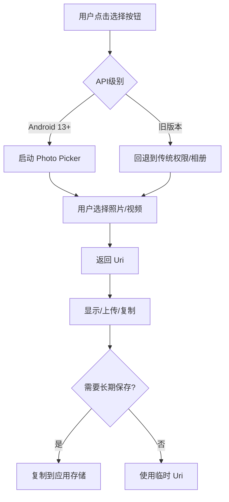

# 1.3.3 照片选择器概览


六月的傍晚，天空变成了一幅渐变的油画——靠近地平线的地方是温柔的橙红色，往上一点点变成了粉红，再往上就是淡淡的紫色，最后和深蓝色的天幕融合在一起。露营地边的白桦林在晚风中轻轻摇晃着叶子，发出沙沙的响声，像是在低声呢喃着什么古老的故事。

黛琳、伊莎、希尔和洛芙四个人围坐在篝火边，火苗跳动着，在每个人的脸上投下温暖的光影。远处的草地上，萤火虫开始出现了——一点点金色的光，在草丛中闪烁，就像有人不小心把星星撒在了人间。

“真美啊。”洛芙双手托着腮，眼睛里映着火光和萤火虫的光芒。

“所以我们更应该记录下来。”希尔笑着说，手里摆弄着一部旧相机，“你们知道吗？以前要让自己应用里的用户选一张照片，可麻烦了——要申请权限，用户还担心这个那个的……”

“现在呢？”洛芙问。

“现在？”希尔把相机放在一边，眼睛亮了起来，“现在有了一个超级方便的东西——照片选择器 Photo Picker。”

“照片……选择器？”洛芙重复着这个陌生的词。

伊莎轻轻拨了拨篝火，让火苗烧得更旺一些：“你可以把它想象成——”

“一个魔法窗口！”希尔抢着说，“用户点击一下，就能从相册里挑选照片或视频，然后直接送到你的应用手里。整个过程简单得像呼吸一样。”

黛琳补充道：“而且最重要的是——用户不需要授予任何权限。你的应用根本碰不到用户的相册大门——是系统亲自把照片递给你的。”

“哇！”洛芙惊叹道，“那岂不是很安全？”

“非常安全。”黛琳点点头，“这是 Android 最大的优点之一——在保护用户隐私的同时，还能让开发者轻松完成任务。”

### 什么是照片选择器

希尔打开笔记本电脑，屏幕的光在渐渐暗下来的天色里显得格外明亮。

“来，让我给你们展示一下——”

```kotlin
// 照片选择器：让用户从相册中选择照片/视频
// 使用 Activity Result API 实现
// 核心类：PickVisualMediaRequest, PickVisualMedia

// 第一步：注册一个 Activity Result 回调
// 这就像在邮局租了一个邮箱——等邮递员把信送来
private val pickMedia = registerForActivityResult(
    ActivityResultContracts.PickVisualMedia()  // 选择器契约
) { uri ->
    // uri 就是用户选择的照片/视频的"地址"
    // 如果用户什么都没选就直接关闭了，这个 uri 就是 null
    if (uri != null) {
        Log.d("PhotoPicker", "用户选择了照片: $uri")
        // 在这里处理选中的照片：显示、复制、上传 etc.
    } else {
        Log.d("PhotoPicker", "用户取消了选择")
    }
}

// 第二步：触发选择器
// 这就像打开那个魔法窗口，让用户挑选
fun openPhotoPicker() {
    // 启动选择器
    // PickVisualMediaRequest 告诉选择器：我们想要什么类型的媒体
    pickMedia.launch(
        PickVisualMediaRequest(
            // 限制只选择图片（不要视频）
            ActivityResultContracts.PickVisualMedia.ImageOnly
        )
    )
}
```

“太简单了吧！”洛芙看着这短短几行代码，眼睛瞪得大大的，“就这么简单就能让用户选照片？”

“就这么简单。”希尔笑着说，“你不相信的话，我们可以试试——”

她三下五除二在 Android Studio 里新建了一个项目，三分钟后，一个带着"选择照片"按钮的界面就出现了。

洛芙点击了一下按钮——

屏幕上弹出了一个优雅的界面，就像一本翻开的相册。用户可以浏览自己所有的照片，挑选一张，或者点击右上角切换到"视频"标签。

用户选中了一张风景照片，点了一下"完成"。

然后——那张照片就出现在了应用里。

“太神奇了！”洛芙激动得拍起手来，“比我自己写的那些权限代码简单了一百倍！”

### 为什么要用照片选择器

伊莎端着一杯花果茶，轻轻啜了一口：“你知道吗？这不仅仅是'简单'的问题。”

“还有什么？”洛芙问。

“还有——信任。”伊莎的声音温柔得像月光，“你想啊，如果你的应用要申请'读取相册'的权限——用户会怎么想？他们会想：啊，这个应用要看我的照片？它会不会偷偷上传？它会不会一直盯着我的隐私？”

洛芙若有所思地点点头：“确实……如果是我，我也不太愿意随便给这个权限。”

“但照片选择器不一样。”黛琳说，“用户不需要授予任何权限。你的应用只是'借'了一张照片，用完就还——相册的大门始终是关着的。”

希尔补充道：“而且啊——用户可以选择只给你看某一张照片，而不是把整个相册都打开。这是一种'授权粒度'的进步。”

“对！”洛芙明白了，“这就像是我请朋友来家里，我可以让他进客厅，但如果我不想让他进卧室——他就进不去。”

“完全正确。”伊莎笑了，“这就是'最小权限原则'——只给应用它需要的那个小权限，而不是一大把。”

### 进阶使用：选择多张照片

“那……如果我想让用户一次选很多张照片呢？”洛芙问。

希尔嘿嘿一笑：“问得好！来，看看这个——”

```kotlin
// 照片选择器进阶：支持多选
// 使用 PickMultipleVisualMedia 契约

// 注册支持多选的 Activity Result
// 参数 10 表示最多选择 10 张照片
private val pickMultipleMedia = registerForActivityResult(
    ActivityResultContracts.PickMultipleVisualMedia(10)  // 最多选 10 张
) { uris ->
    // uris 是一个 List<Uri>，包含用户选择的所有照片
    if (uris.isNotEmpty()) {
        Log.d("PhotoPicker", "用户选择了 ${uris.size} 张照片")
        
        // 遍历处理每张照片
        uris.forEachIndexed { index, uri ->
            Log.d("PhotoPicker", "第 ${index + 1} 张: $uri")
            // 这里可以处理每张照片：复制、上传、显示 etc.
        }
    } else {
        Log.d("PhotoPicker", "用户取消了选择")
    }
}

// 启动多选模式
fun openMultiPhotoPicker() {
    pickMultipleMedia.launch(
        // 这次我们允许选择图片
        PickVisualMediaRequest(
            ActivityResultContracts.PickVisualMedia.ImageOnly
        )
    )
}
```

“如果用户选的是视频呢？”洛芙又问。

“那就用 VideoOnly 模式——”

```kotlin
// 只允许选择视频
private val pickVideo = registerForActivityResult(
    ActivityResultContracts.PickVisualMedia(
        ActivityResultContracts.PickVisualMedia.VideoOnly  // 只允许视频
    )
) { uri ->
    uri?.let {
        Log.d("PhotoPicker", "用户选择了视频: $uri")
    }
}

fun openVideoPicker() {
    pickVideo.launch(
        PickVisualMediaRequest(
            ActivityResultContracts.PickVisualMedia.VideoOnly
        )
    )
}

// 或者两者都要（图片和视频都可以选）
private val pickAny = registerForActivityResult(
    ActivityResultContracts.PickVisualMedia()  // 不限制类型
) { uri ->
    // 这里需要根据 uri 的 MIME 类型判断是图片还是视频
    uri?.let {
        val mimeType = contentResolver.getType(it)
        when {
            mimeType?.startsWith("image/") == true -> Log.d("PhotoPicker", "选择了图片")
            mimeType?.startsWith("video/") == true -> Log.d("PhotoPicker", "选择了视频")
        }
    }
}
```

“天哪……”洛芙看着这些代码，“原来可以这么灵活！”

“对，”黛琳说，“你可以根据业务需求选择不同的模式——单选、多选、只图片、只视频、或者两者都要。”

### 处理选中的照片

选中了照片之后，接下来要做什么？

希尔开始讲解实际使用场景。

“一般来说，你会做几件事：显示出来、读取内容、或者复制到自己的存储——”

```kotlin
// 处理选中的照片：显示在 ImageView 中（最简单）
fun displayImage(imageUri: Uri) {
    // ImageView 会自动处理流、缓存、缩放等
    imageView.setImageURI(imageUri)
}

// 如果需要更复杂的处理——比如上传到服务器
fun uploadImage(imageUri: Uri) {
    // 1. 打开输入流
    contentResolver.openInputStream(imageUri)?.use { inputStream ->
        // 2. 读取数据
        val bytes = inputStream.readBytes()
        
        // 3. 上传到服务器（比如 Retrofit）
        viewModelScope.launch {
            api.uploadImage(bytes)
            Log.d("Upload", "图片上传成功")
        }
    }
}

// 如果需要把照片复制到自己的存储（比如应用专属目录）
fun copyToAppStorage(imageUri: Uri): Uri? {
    // 1. 在应用专属存储中创建新文件
    val destFile = File(filesDir, "user_selected_${System.currentTimeMillis()}.jpg")
    
    // 2. 复制内容
    contentResolver.openInputStream(imageUri)?.use { input ->
        FileOutputStream(destFile).use { output ->
            input.copyTo(output)
        }
    }
    
    // 3. 返回新文件的 Uri
    return Uri.fromFile(destFile)
}

// 注意事项：使用完 Uri 后，如果是临时访问权限，可能需要重新获取
// 照片选择器返回的 Uri 通常有临时的"读取权限"
// 如果你需要长期保存这个"访问权"，可以调用 takePersistableUriPermission
fun persistPermission(imageUri: Uri) {
    try {
        // 持久化读取权限（需要 FLAG_GRANT_PERSISTABLE_URI_PERMISSION）
        val takeFlags = Intent.FLAG_GRANT_READ_URI_PERMISSION
        contentResolver.takePersistableUriPermission(imageUri, takeFlags)
        Log.d("Permission", "权限已持久化")
    } catch (e: SecurityException) {
        // 某些 Provider 不支持持久化权限
        Log.w("Permission", "无法持久化权限: ${e.message}")
    }
}
```

“记住一点，”黛琳特别提醒道，“照片选择器返回的 Uri 通常带有临时权限。如果你需要长期保存（比如应用退出后下次还想用），记得调用 `takePersistableUriPermission`。”

洛芙认真点头：“知道了。这就像借书一样——如果想把书留在家里看久一点，得去图书馆办个长期借阅手续。”

### 兼容性和注意事项

“那……是不是所有手机都能用这个功能？”洛芙问。

希尔的表情变得认真了一些：“这个问题问得好。照片选择器从 Android 13（API 33）开始正式提供，但如果你的应用需要兼容更老的版本——”

“那怎么办？”洛芙问。

“有两种策略——”

```kotlin
// 策略一：运行时检测，有选择器就用，没有就用老方法
fun pickPhotoWithFallback() {
    if (Build.VERSION.SDK_INT >= Build.VERSION_CODES.TIRAMISU) {
        // Android 13+，直接用照片选择器
        pickMedia.launch(PickVisualMediaRequest(ActivityResultContracts.PickVisualMedia.ImageOnly))
    } else {
        // Android 12 及以下，回退到传统方式
        // 1. 先申请权限
        requestLegacyStoragePermission()
        // 2. 再打开相册
        openLegacyGallery()
    }
}

// 策略二：用系统提供的兼容性方法
// ActivityResultContracts.PickVisualMedia 在老版本上会自动回退到系统选择器
// 但功能和权限行为可能不同
private val compatiblePicker = registerForActivityResult(
    ActivityResultContracts.PickVisualMedia()
) { uri ->
    // 这个契约在所有 API 版本都能工作
    // 只是返回的 Uri 权限行为可能不同
}
```

伊莎插话道：“还有一点要注意——”

“是什么？”

“即使是照片选择器，返回的 Uri 也不一定是永久有效的。”伊莎说，“有些 Uri 会在权限过期后失效。所以如果你的应用需要长期保存用户选择的照片，最好复制到自己的存储里——就像刚才希尔演示的那样。”

洛芙总结道：“我明白了！Photo Picker 就是——

第一，能不用权限就用权限，减少用户顾虑。

第二，Android 13+ 直接用，多选单选都很简单。

第三，选完尽快复制到自己的存储，别依赖临时 Uri。

第四，老版本用兼容方案或者回退到传统权限。”

黛琳笑了：“总结得非常好。”

### 洛芙的作业应用

篝火里的木柴发出噼啪的声音，火星子像小星星一样飞到夜空里去。洛芙看着远处的萤火虫，心里忽然有了一个想法。

“我想做一个作业应用，”她说，“让学生可以上传自己拍的照片作为作业提交！”

“这个想法不错！”希尔说。

“那——用照片选择器最合适了。”黛琳说，“学生不需要给任何权限，直接上传照片。简单又安全。”

洛芙立刻打开笔记本电脑，开始写代码。

```kotlin
// 洛芙的作业应用 - HomeWorkActivity.kt
class HomeWorkActivity : AppCompatActivity() {

    private lateinit var homeworkAdapter: HomeworkAdapter
    private val homeworkItems = mutableListOf<HomeworkItem>()
    
    // 注册照片选择器（支持多选，最多 5 张）
    private val pickHomeworkPhotos = registerForActivityResult(
        ActivityResultContracts.PickMultipleVisualMedia(5)
    ) { uris ->
        if (uris.isNotEmpty()) {
            // 用户选择了照片，开始处理
            processSelectedPhotos(uris)
        }
    }
    
    // 处理选中的照片
    private fun processSelectedPhotos(uris: List<Uri>) {
        uris.forEach { uri ->
            // 复制到应用存储（用作业 ID 命名，避免重复）
            val homeworkFile = copyToHomeworkStorage(uri)
            if (homeworkFile != null) {
                homeworkItems.add(
                    HomeworkItem(
                        id = System.currentTimeMillis(),
                        imageUri = Uri.fromFile(homeworkFile),
                        uploadTime = System.currentTimeMillis()
                    )
                )
            }
        }
        // 刷新列表
        homeworkAdapter.notifyDataSetChanged()
    }
    
    // 复制到作业存储目录
    private fun copyToHomeworkStorage(sourceUri: Uri): File? {
        val homeworkDir = File(filesDir, "homework_photos")
        if (!homeworkDir.exists()) homeworkDir.mkdirs()
        
        val destFile = File(homeworkDir, "homework_${System.currentTimeMillis()}.jpg")
        
        return try {
            contentResolver.openInputStream(sourceUri)?.use { input ->
                FileOutputStream(destFile).use { output ->
                    input.copyTo(output)
                }
            }
            destFile
        } catch (e: Exception) {
            Log.e("Homework", "复制文件失败: ${e.message}")
            null
        }
    }
    
    // 触发选择器
    fun onAddPhotoClick() {
        pickHomeworkPhotos.launch(
            PickVisualMediaRequest(ActivityResultContracts.PickVisualMedia.ImageOnly)
        )
    }
}

// 作业项数据类
data class HomeworkItem(
    val id: Long,
    val imageUri: Uri,
    val uploadTime: Long
)
```

代码写完的时候，月亮已经升起来了。银色的月光洒在湖面上，萤火虫在草丛中飞舞得更欢快了，好像在庆祝什么喜事。

“成功了！”洛芙看着模拟器上显示的照片——那是一张灿烂的笑脸，就像六月的阳光一样温暖。

黛琳、伊莎和希尔都鼓起掌来。

“你知道吗？”伊莎轻声说，“这可能就是技术的意义——不是冷冰冰的代码，而是让人们的生活变得更简单、更美好。”

洛芙看着手机屏幕上那张灿烂的笑脸，心里忽然充满了感激。

“谢谢你们，”她说，“今天我又学到了一个让世界变得更美好的工具。”

希尔笑着捏了捏她的脸：“那你可得好好用它啊——让更多学生可以轻松地交作业。”

“那是必须的！”洛芙笑着说，眼睛亮晶晶的，像天上的星星，又像草丛里的萤火虫。

夜深了，露营地里安静下来。远处传来青蛙的低唱，还有风吹过白桦林的沙沙声。

明天又会学到什么呢？

洛芙怀着这样的期待，慢慢进入了梦乡。

---

### 技术总结

> **照片选择器（Photo Picker）**—— Android 13+ 提供的系统级 UI 组件，允许用户从相册中选择照片或视频，而应用无需请求任何存储权限。选择器返回的 Uri 带有临时读取权限，应用可通过 `takePersistableUriPermission` 持久化权限，或将内容复制到自有存储以长期保存。

#### 今日关键词

1. **PickVisualMedia**：照片选择器的核心契约，基于 Activity Result API。
2. **PickVisualMediaRequest**：选择请求，指定可选类型（ImageOnly/VideoOnly/不限）。
3. **PickMultipleVisualMedia**：多选模式，指定最多可选数量。
4. **临时权限**：选择器返回的 Uri 带临时读取权限，需及时使用或复制。
5. **takePersistableUriPermission**：将临时权限持久化，但并非所有 Provider 都支持。

#### 结构图



#### 反模式与陷阱

1. **不检查 Uri 是否为 null**：用户可能取消选择，Uri 为 null。  
   修复：始终检查 `if (uri != null)`。

2. **不处理权限丢失**：临时权限可能过期，Uri 失效。  
   修复：及时复制到自有存储或持久化权限。

3. **多选数量写死**：硬编码最大数量。  
   修复：根据业务需求合理设置，注意性能。

4. **老版本不做兼容**：只考虑新 API。  
   修复：用 if-else 判断 API 级别，做兼容处理。

5. **不做错误处理**：文件复制失败、上传失败等未处理。  
   修复：加 try-catch，给用户友好提示。

#### 设计思想

- **零权限体验**：应用无需任何存储权限即可获取用户照片，降低用户顾虑。
- **最小授权粒度**：用户选择具体的照片，而非开放整个相册。
- **系统级 UI**：由系统统一提供，确保界面一致性和隐私安全。
- **渐进增强**：新 API 提供更好体验，老版本有兼容方案。

### 🏕️ 动手练习

#### Task 1 · 最简照片选择器 ★

**目标**：实现一个按钮，点击后打开照片选择器，选中的照片显示在 ImageView 中。

**你需要做的事：**

1. 新建 Android 项目（Empty Activity）
2. 布局添加：ImageView、"选择照片"按钮
3. 用 PickVisualMedia 注册 ActivityResult
4. 选中后在 ImageView 显示

**验收标准：**
- [ ] 点击按钮弹出系统选择器
- [ ] 选中照片后正确显示
- [ ] 取消选择无报错

**提示：**
```kotlin
private val pickMedia = registerForActivityResult(
    ActivityResultContracts.PickVisualMedia()
) { uri -> uri?.let { imageView.setImageURI(it) } }
```

---

#### Task 2 · 多选照片墙 ★★

**目标**：实现多选照片，选择后以网格形式展示。

**你需要做的事：**

1. 使用 PickMultipleVisualMedia(9) 限制最多 9 张
2. RecyclerView + GridLayoutManager(3列) 显示缩略图
3. 显示选中数量

**验收标准：**
- [ ] 最多可选 9 张
- [ ] 网格正确显示缩略图
- [ ] 显示"已选 X/9 张"

---

#### Task 3 · 照片上传功能 ★★★

**目标**：选择照片后上传到模拟服务器地址。

**你需要做的事：**

1. 选择照片后读取为 ByteArray
2. 用 Retrofit/Multipart 上传
3. 显示上传进度
4. 成功/失败 Toast 提示

**验收标准：**
- [ ] 上传成功 Toast 提示
- [ ] 上传失败有错误处理
- [ ] 可以连续上传多张

---

#### Task 4 · 照片复制到私有目录 ★★★

**目标**：选择照片后复制到应用专属存储。

**你需要做的事：**

1. 用 contentResolver.openInputStream 读取
2. 复制到 filesDir/photos 目录
3. 用 Uri.fromFile() 转换为本地 Uri
4. 列表显示已复制的照片

**验收标准：**
- [ ] 照片成功复制到私有目录
- [ ] 应用重启后仍可访问
- [ ] 显示复制后的文件列表

---

#### Task 5 · 视频选择器 ★★★

**目标**：只允许选择视频，选择后显示视频缩略图和时长。

**你需要做的事：**

1. 用 PickVisualMediaRequest(VideoOnly)
2. 用 MediaMetadataRetriever 获取缩略图
3. 显示缩略图 + 时长（分:秒）
4. 点击可播放

**验收标准：**
- [ ] 只能选视频
- [ ] 显示视频缩略图
- [ ] 显示时长

---

#### Task 6 · 混合选择器 ★★★★

**目标**：同时支持图片和视频，在列表中区分显示。

**你需要做的事：**

1. 不限制类型（PickVisualMedia）
2. 根据 Uri 的 MIME 类型区分
3. 图片显示缩略图，视频显示视频帧
4. 列表正确区分两种类型

**验收标准：**
- [ ] 可以选择图片和视频
- [ ] 正确显示缩略图/帧
- [ ] 显示正确的类型标签

---

#### Task 7 · 权限兼容处理 ★★★★

**目标**：在所有 Android 版本上都能工作。

**你需要做的事：**

1. 检测 API 级别
2. Android 13+ 用 Photo Picker
3. Android 12- 用传统权限方式
4. 权限被拒绝时给友好提示

**验收标准：**
- [ ] Android 13+ 用新方式（无需权限）
- [ ] Android 12- 用老方式（需要权限）
- [ ] 权限拒绝有提示

---

#### Task 8 · 作业提交应用 ★★★★★

**目标**：完整实现一个作业提交功能。

**你需要做的事：**

1. 照片选择器选择多张照片
2. 复制到私有目录
3. 填写作业描述
4. 提交到服务器
5. 本地记录已提交作业

**验收标准：**
- [ ] 完整流程可跑通
- [ ] 本地保存提交记录
- [ ] 卸载重装后可查看历史

---

#### 💬 面试热身

**Q1**：Photo Picker 相比传统权限方案的优势是什么？

**Q2**：Photo Picker 返回的 Uri 有什么特点？需要注意什么？

**Q3**：如何实现多选功能？最多能选多少？

**Q4**：如果需要长期保存用户选择的照片，该怎么做？

**Q5**：如何兼容老版本的 Android？

---

> 照片选择器是 Android 在隐私保护方面的重大进步——它让用户可以放心地把特定照片交给应用，而不必担心应用"看到"整个相册。学习使用 Photo Picker，不仅是学习一个 API，更是学习如何在用户体验和隐私安全之间找到完美的平衡点。

### 🍭 洛芙的小小日记本

今天太开心了！学会了 Photo Picker——一个不需要任何权限就能让用户选照片的神奇工具。还做了一个作业提交应用，可以让学生们轻松交照片作业！谢谢希尔、黛琳、伊莎，有你们真好～ ✨
