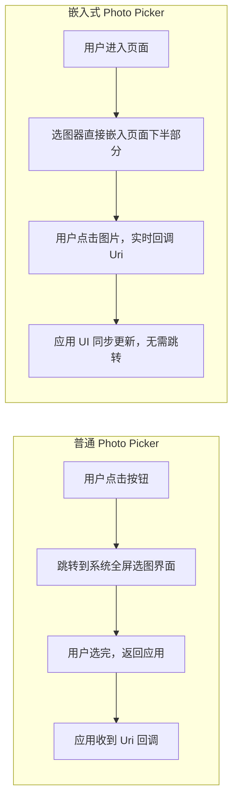
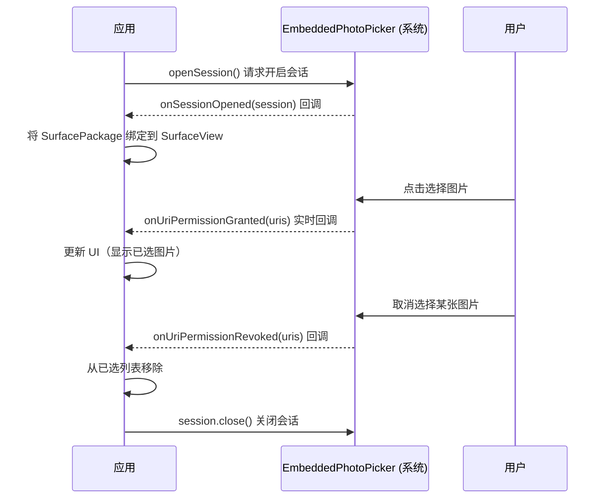
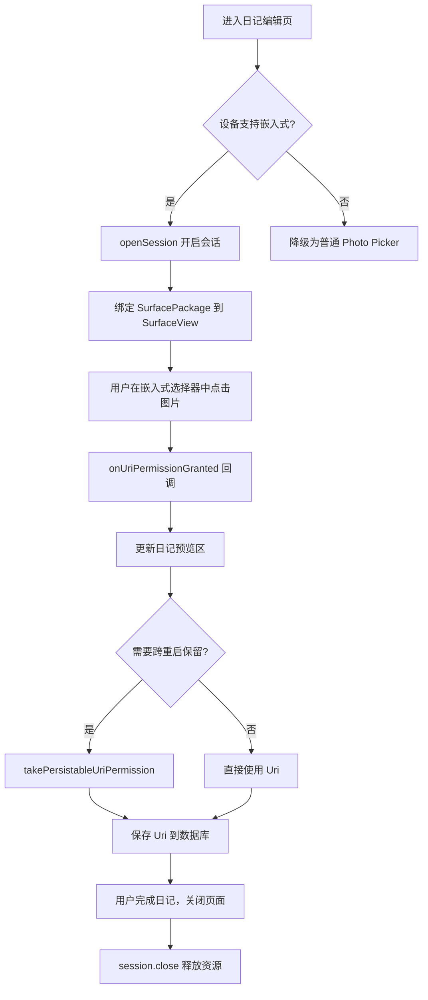

# 1.3.4 Embedded Photo Picker

---
chapter_id: '1.3.4'
title: '嵌入式照片选择器'
official_title: 'Embedded Photo Picker'
official_url: 'https://developer.android.com/training/data-storage/shared/photopicker#embedded'
topic_url: 'https://developer.android.com/training/data-storage'
status: 'done'
volume_priority: 8
volume_grade: 'A'
chapter_importance: 5

plot_summary:
  time: '早晨'
  location: '帐篷内'
  scene: '尝试嵌入式选择器'
  season: '秋季'
  environment: '帐篷内温馨'
  topic: '嵌入式照片选择器'
  discussion: '如何在应用内嵌入照片选择器'
  problem_solved: '实现嵌入式Photo Picker'
  difficulty: 'API集成'
  next_topic: '访问文档和其他文件'
---

## 1.3.4 嵌入式照片选择器

> 本篇对应官方文档：https://developer.android.com/training/data-storage/shared/photopicker#embedded

雨下了一整个下午。

帐篷外的草地积了浅浅的水洼，每一滴落下来的雨都在水面上开出一个小圆圈，又很快消失。四个人窝在最大的那顶帐篷里，伊莎在画速写，希尔在拆一个坏掉的手电筒，黛琳靠着睡袋卷在看书，洛芙则盯着自己的屏幕，眉心拧成了一个结。

"你在做什么？"伊莎头也没抬，铅笔在纸上沙沙地走。

"我在想，"洛芙把电脑转过来，"我要做一个'露营日记'功能，让用户在写日记的时候，直接在页面里选照片——不是跳出去，是就在这个界面里选。"

希尔放下手电筒，凑过来看了一眼："你说的是嵌入式照片选择器。"

"嵌入式？"

"对。"希尔把手电筒的零件推到一边，"以前的 Photo Picker，点一下按钮，系统会弹出一个全屏的选图界面，选完再回来。用户体验上有一个'跳出去再回来'的割裂感。嵌入式的意思是——选图器直接长在你的页面里，就像一个普通的 View 一样，用户不用离开你的应用。"

洛芙眼睛亮了："就像……把图书馆搬进了书房？"

"差不多。"希尔笑了，"而且这个'图书馆'还是系统渲染的，不是你自己画的——所以隐私保护和普通 Photo Picker 一样，你的应用看不到用户没有选的那些照片。"

黛琳翻了一页书，没有抬头，轻声补了一句："Android 14 (API 34) 加上 SDK Extensions 15 才支持。"

"那旧设备呢？"洛芙问。

"降级回普通的 Photo Picker。"希尔已经打开了电脑，"Jetpack 库帮你处理了这个兼容逻辑，你不用自己写 if-else。"

---

### 它和普通 Photo Picker 的区别

雨声渐渐变小，变成了屋檐滴水的声音，一下一下，很有节奏。

"先把两种模式放在一起比一比。"希尔在屏幕上画了一张图。



> 图 1：普通 Photo Picker 与嵌入式 Photo Picker 的交互流程对比。

"嵌入式的核心优势，"希尔指着右边那列，"是**连续选择**。用户可以一边看日记编辑区，一边在下面的选图器里点来点去，每点一张，上面的预览区就实时更新。不需要'选完→确认→返回'这三步。"

"这对写日记来说太合适了！"洛芙拍了一下手，"用户可以边写边配图，感觉更自然。"

"对。"黛琳终于放下书，"不过要记住，嵌入式选择器是用 `SurfaceView` 渲染的，系统在独立的层上绘制它，你的应用无法在它上面叠加任何东西——这是安全设计，防止应用伪造界面欺骗用户。"

洛芙把这条记下来。

---

### 添加依赖

"先把库加进来。"希尔切到 `build.gradle`。

```kotlin
// 在 build.gradle.kts (Module: app) 中添加依赖
// Jetpack Photo Picker 库，包含嵌入式选择器支持
dependencies {
    // 版本需 1.0.0 或更高，才包含嵌入式 API
    implementation("androidx.photopicker:photopicker:1.0.0")
}
```

"这个库会自动处理设备兼容性，"希尔说，"如果设备不支持嵌入式，它会自动降级到普通的 Photo Picker 流程。"

---

### 核心流程：Session 的生命周期

"嵌入式选择器的核心概念是 `EmbeddedPhotoPickerSession`。"黛琳拿过电脑，开始写注释，"你可以把它理解为一次'选图会话'——打开、交互、关闭，有完整的生命周期。"



> 图 2：EmbeddedPhotoPickerSession 的完整生命周期——从开启到关闭，每一步都有对应的回调。

"注意这里有两个关键回调，"希尔指着图，"一个是 `onUriPermissionGranted`，用户选了图就触发；另一个是 `onUriPermissionRevoked`，用户取消选择就触发。这就是'连续选择'的实现基础。"

---

### 代码实现

"好，开始写代码。"希尔把电脑推到洛芙面前，"你来敲，我来说。"

洛芙搓了搓手，把手指搭在键盘上。

**第一步：检查设备支持，创建选择器实例**

```kotlin
// 检查当前设备是否支持嵌入式 Photo Picker
// 需要 Android 14 (API 34) + SDK Extensions 15
val isEmbeddedPickerAvailable = EmbeddedPhotoPicker.isAvailable(context)

if (isEmbeddedPickerAvailable) {
    // 设备支持，使用嵌入式选择器
    setupEmbeddedPicker()
} else {
    // 设备不支持，降级到普通 Photo Picker
    setupRegularPicker()
}
```

**第二步：配置选择器外观，开启会话**

```kotlin
// 配置嵌入式选择器的外观和行为
val featureInfo = EmbeddedPhotoPickerFeatureInfo.Builder()
    // 设置强调色（可选，默认跟随系统动态颜色）
    // 传入颜色的 ARGB 整数值
    .setAccentColor(getColor(R.color.camp_green))
    .build()

// 开启一次选图会话
// 参数：FeatureInfo（外观配置）、Executor（回调执行线程）、Client（回调接口）
embeddedPhotoPicker.openSession(
    featureInfo,
    mainExecutor,
    object : EmbeddedPhotoPickerClient {

        // 会话成功开启，可以开始渲染选择器
        override fun onSessionOpened(session: EmbeddedPhotoPickerSession) {
            this@MainActivity.session = session
            // 将系统渲染的 SurfacePackage 绑定到布局中的 SurfaceView
            surfaceView.setChildSurfacePackage(session.surfacePackage)
        }

        // 会话开启失败（如设备不支持）
        override fun onSessionError(throwable: Throwable) {
            Log.e("EmbeddedPicker", "Session error: ${throwable.message}")
            // 降级处理
            setupRegularPicker()
        }

        // 用户选择了图片，收到授权的 Uri 列表
        override fun onUriPermissionGranted(uris: List<Uri>) {
            // 实时更新 UI，将新选中的图片加入预览区
            selectedUris.addAll(uris)
            updatePreview()
        }

        // 用户取消选择了某些图片
        override fun onUriPermissionRevoked(uris: Set<Uri>) {
            // 从已选列表中移除被取消的图片
            selectedUris.removeAll(uris)
            updatePreview()
        }
    }
)
```

"这里最重要的是 `surfaceView.setChildSurfacePackage`，"希尔说，"这一行把系统渲染的选图界面'贴'到你的 SurfaceView 上。从视觉上看，它就像你自己画的 View，但实际上是系统在独立渲染的。"

"所以我的应用碰不到它？"洛芙问。

"对。你能拿到的，只有用户主动选择后系统给你的 Uri。"

**第三步：通知选择器配置变化**

```kotlin
// 当 Activity 配置发生变化时（如旋转屏幕），通知选择器
override fun onConfigurationChanged(newConfig: Configuration) {
    super.onConfigurationChanged(newConfig)
    // 通知选择器适应新的配置（如横竖屏切换）
    session?.notifyConfigurationChanged(newConfig)
}

// 当选择器的显示区域大小改变时，通知选择器重新布局
fun onPickerViewResized(width: Int, height: Int) {
    // 参数：新的宽度和高度（单位：像素）
    session?.notifyResized(width, height)
}
```

**第四步：关闭会话，释放资源**

```kotlin
// 在 Activity 销毁时，关闭会话并释放资源
override fun onDestroy() {
    super.onDestroy()
    // 关闭会话，系统会回收相关资源
    session?.close()
}
```

"记住，`session.close()` 要在 `onDestroy` 里调用，"希尔说，"不然系统的渲染资源会泄漏，就像钓完鱼忘了收鱼竿。"

---

### 持久化 Uri 权限

"还有一件事，"黛琳接过话，"嵌入式选择器给你的 Uri，默认权限只到应用重启为止。如果你要做'下次打开还能看到这张图'的功能，需要主动持久化权限。"

```kotlin
// 持久化 Uri 访问权限（跨重启）
// 默认权限在设备重启后失效，调用此方法可延长有效期
fun persistUriPermission(uri: Uri) {
    val flag = Intent.FLAG_GRANT_READ_URI_PERMISSION
    // takePersistableUriPermission() 将临时权限转为持久权限
    // 需要在 onUriPermissionGranted 回调中调用
    contentResolver.takePersistableUriPermission(uri, flag)
}
```

"就像你借了营地的公共工具，"伊莎放下铅笔，"用完当天要还，但如果你申请了'长期借用'，下次来还能继续用。"

---

### 整合全貌

"我来把整个流程串起来。"洛芙在草稿纸上画了一张图。



> 图 3：嵌入式照片选择器在"露营日记"功能中的完整集成流程。

"好清晰。"希尔点了点头，"你现在已经把整个链路想通了。"

---

### 雨停了

帐篷外的雨声不知道什么时候停了。

洛芙把代码跑起来，在模拟器上看着那个嵌入式选图界面稳稳地出现在日记编辑区的下方——就像一扇开在地板上的小窗，透过它能看见整个相册。她点了一张露营的照片，上面的预览区立刻出现了缩略图。

"成了。"她轻声说。

帐篷外，积水里映着一块蓝天，云朵从上面慢慢漂过去。

"你知道这个功能最妙的地方是什么吗？"伊莎拿起画板，走到帐篷门口，"用户不会感觉到'选图'这件事——它就是写日记的一部分，就像你写字时顺手翻了一下旁边的相册。"

洛芙看着屏幕上那个小小的选图窗口，慢慢地笑了。

---

### 专业技术总结

> **嵌入式照片选择器（Embedded Photo Picker）** —— Android 14 (API 34) + SDK Extensions 15 引入的新型媒体选择方式，允许将系统级选图界面直接嵌入应用布局，实现无跳转的连续选图体验。通过 `EmbeddedPhotoPickerSession` 管理会话生命周期，通过 `SurfaceView.setChildSurfacePackage` 渲染系统界面，通过 `onUriPermissionGranted/Revoked` 回调实时同步选择状态。

#### 今日关键词

1. **EmbeddedPhotoPicker**：嵌入式照片选择器的入口类，用于检查可用性和开启会话。
2. **EmbeddedPhotoPickerSession**：代表一次选图会话，管理选择器的生命周期和交互。
3. **EmbeddedPhotoPickerClient**：回调接口，包含 `onSessionOpened`、`onUriPermissionGranted`、`onUriPermissionRevoked` 等方法。
4. **SurfaceView.setChildSurfacePackage**：将系统渲染的选图界面绑定到应用布局中。
5. **takePersistableUriPermission**：将临时 Uri 权限转为持久权限，跨重启保留访问能力。
6. **EmbeddedPhotoPickerFeatureInfo**：配置选择器外观（如强调色）的构建器类。

#### 对比总结

| 特性 | 普通 Photo Picker | 嵌入式 Photo Picker |
|---|---|---|
| 交互方式 | 全屏跳转 | 嵌入页面 |
| 连续选择 | 不支持（选完一次性返回） | 支持（实时回调） |
| 最低 API | Android 4.4 (API 19) | Android 14 (API 34) + Ext 15 |
| 隐私保护 | 系统渲染，应用不可见未选内容 | 同上 |
| 适用场景 | 简单选图（头像、附件） | 富文本编辑、相册类应用 |

#### 反模式与陷阱

1. **不检查设备支持直接使用**：在不支持的设备上会崩溃。
   - 修复：调用 `EmbeddedPhotoPicker.isAvailable()` 检查，并提供降级方案。

2. **忘记关闭 Session**：`session.close()` 未调用，导致系统渲染资源泄漏。
   - 修复：在 `onDestroy()` 中调用 `session?.close()`。

3. **Uri 权限未持久化**：重启后 Uri 失效，用户看到"图片加载失败"。
   - 修复：对需要跨重启保留的 Uri 调用 `takePersistableUriPermission`。

4. **在 SurfaceView 上叠加自定义 View**：系统会阻止此操作（安全设计），叠加层不会显示。
   - 修复：将自定义 UI 放在 SurfaceView 的外部，而不是上方。

---

### 🏕️ 动手练习

#### Task 1 · 嵌入式选图体验 ★★★

**目标**：在一个简单的 Activity 中集成嵌入式照片选择器，实现点击图片后在 ImageView 中显示的效果。

**你需要做的事：**
1. 添加 `androidx.photopicker:photopicker:1.0.0` 依赖。
2. 布局中添加：一个 `SurfaceView`（占屏幕下半部分）、一个 `ImageView`（显示已选图片）。
3. 调用 `EmbeddedPhotoPicker.isAvailable()` 检查支持性。
4. 调用 `openSession()` 开启会话，在 `onSessionOpened` 中绑定 `SurfacePackage`。
5. 在 `onUriPermissionGranted` 中更新 `ImageView`。
6. 在 `onDestroy` 中关闭 Session。

**验收标准：**
- [ ] 进入页面，SurfaceView 区域显示系统图库
- [ ] 点击图库中的图片，ImageView 立刻更新
- [ ] 再次点击同一张图片（取消选择），ImageView 清空
- [ ] 退出页面后重新进入，无崩溃

**提示：**
```kotlin
// 检查支持性并开启会话
if (EmbeddedPhotoPicker.isAvailable(this)) {
    embeddedPhotoPicker.openSession(featureInfo, mainExecutor, client)
} else {
    // 降级到普通 Photo Picker
}
```

---

#### Task 2 · 日记配图功能 ★★★★

**目标**：实现一个"露营日记"编辑页，支持在编辑文字的同时，通过嵌入式选择器选择多张配图，最终保存日记（文字 + 图片 Uri 列表）。

**你需要做的事：**
1. 布局：上半部分为 `EditText`（日记内容）+ 横向 `RecyclerView`（已选图片预览），下半部分为 `SurfaceView`（嵌入式选择器）。
2. 实现连续选择：每次 `onUriPermissionGranted` 触发时，将新图片追加到 RecyclerView。
3. 实现取消选择：`onUriPermissionRevoked` 触发时，从 RecyclerView 中移除对应图片。
4. 点击"保存"按钮，将日记内容和所有已选 Uri 存入 Room 数据库（Uri 以逗号分隔的字符串存储）。
5. 对已选 Uri 调用 `takePersistableUriPermission`，确保下次打开日记时图片仍可加载。

**验收标准：**
- [ ] 可以同时编辑文字和选择图片
- [ ] 已选图片实时显示在预览区
- [ ] 取消选择后预览区同步移除
- [ ] 保存后重启应用，日记内容和图片均可正常读取

---

#### Task 3 · 降级兼容方案 ★★★

**目标**：为 Task 1 或 Task 2 添加完整的降级逻辑，确保在不支持嵌入式选择器的设备上也能正常选图。

**你需要做的事：**
1. 检测设备是否支持嵌入式选择器。
2. 不支持时，隐藏 `SurfaceView`，显示一个"选择图片"按钮。
3. 按钮点击后，使用普通的 `PickVisualMedia` 启动标准 Photo Picker。
4. 两种路径的回调最终汇聚到同一个 `updateSelectedImages(uris: List<Uri>)` 函数。

**验收标准：**
- [ ] 在支持的设备（API 34+）上：显示嵌入式选择器
- [ ] 在不支持的设备上：显示按钮，点击后弹出标准 Photo Picker
- [ ] 两种路径选图后，UI 行为完全一致

---

#### 💬 面试热身：用自己的话回答这些问题

> 不用写代码，试着用一两句话说清楚就好。能说清楚，才是真的懂了。

**Q1**：嵌入式照片选择器和普通 Photo Picker 在用户体验上最大的区别是什么？

**Q2**：为什么嵌入式选择器使用 `SurfaceView` 而不是普通的 `View`？这样设计的安全意义是什么？

**Q3**：`onUriPermissionGranted` 和 `onUriPermissionRevoked` 分别在什么时候触发？如何利用它们实现"实时同步已选图片"？

**Q4**：如果用户选了一张图片，应用保存了 Uri，但重启后发现图片加载失败，最可能的原因是什么？如何修复？

---

### 🍭 洛芙的小小日记本

今天学了嵌入式照片选择器，感觉像是把图书馆搬进了书房——用户不用出门，书就在手边。最神奇的是，系统帮我渲染界面，我只负责接收用户的选择，隐私和安全都不用操心。雨后的营地好清新，今晚要写一篇真正的露营日记！📷
