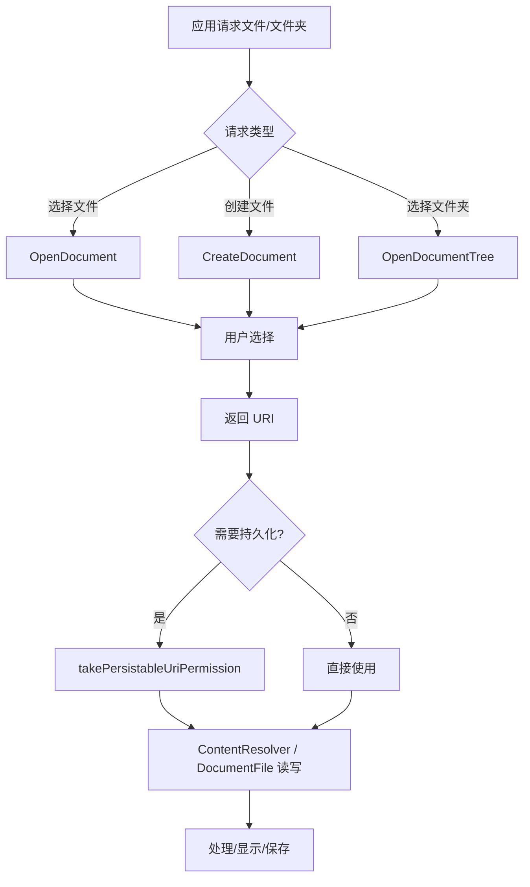

# 1.3.5 访问共享存储中的文档和其他文件

六月的夜晚，萤火虫在草丛中飞舞，像一粒粒金色的星星。露营地的篝火还在燃烧着，发出噼啪的声响。黛琳，伊莎、希尔和洛芙围坐在火堆旁，火光在她们的脸上投下温暖的光影。

“今天我们学了什么來着？”洛芙托着腮，眼睛看着远处闪烁的萤火虫，“好像学了很多，但又有点混乱……”

“没关系，”黛琳轻声说，“我们来整理一下。前面我们学了图片，音乐，视频——今天要学的，是文档和其他类型的文件。”

“文档？”洛芙的眼睛亮了起来，“就是 PDF、Word、Excel 那些吗？”

“对的，”希尔笑着说，“还有音频文件，视频文件——只要不是图片，音乐，视频的，都归到'其他文件'这一类。”

伊莎拨了拨篝火，让火苗烧得更旺一些：“就像一个大家庭里，图片，音乐，视频是已经分好房间的孩子，而文档和其他文件，是还没有分配房间的——它们需要自己的管理方式。”

### 什么是文档和其他文件

黛琳打开笔记本电脑，屏幕的光在黑暗中显得格外明亮。

“在 Android 里，文档和其他文件不像图片那样有专门的 MediaStore 表，”她解释道，“它们存储的方式更加分散——可能在 Downloads 文件夹，可能在 Documents 文件夹，还可能在各种应用创建的文件夹里。”

“那……怎么找到它们呢？”洛芙问。

“用 SAF，”希尔接话，“Storage Access Framework——存储访问框架，就像一个万能的图书馆管理员，你告诉它你想找什么，它就去帮你找。”

```kotlin
// 使用 Storage Access Framework (SAF) 访问文档
// 1. 创建文档选择器（就像打开图书馆的大门）
private val openDocument = registerForActivityResult(
    ActivityResultContracts.OpenDocument()  // OpenDocument 契约：让用户选择一个文件
) { uri ->
    // uri 就是用户选择的文件的"地址"
    // 如果用户什么都没选就关闭了，这个 uri 就是 null
    if (uri != null) {
        Log.d("SAF", "用户选择了文件: $uri")
        // 在这里处理选中的文件：读取内容、显示、编辑 etc.
    }
}

// 2. 触发文档选择器
// 你可以限制用户只能选择特定类型的文件
fun openPdfDocument() {
    openDocument.launch(
        arrayOf("application/pdf")  // 只允许选择 PDF 文件
    )
}

// 或者不限制类型，所有文件都可以选
fun openAnyFile() {
    openDocument.launch(arrayOf("*/*"))  // */* 表示所有文件类型
}
```

“这就是 SAF 吗？”洛芙问，“感觉比 MediaStore 简单多了——不用写查询语句，直接让用户自己选。”

“对，”黛琳点点头，“这就是 SAF 的最大优点——用户不需要担心应用会'偷看'自己的文件。用户自己选择要给应用看什么，应用才能看到什么。”

### 选择多种类型的文件

“如果我想让用户同时选 PDF 和 Word 文档呢？”洛芙又问。

“那就传入多个 MIME 类型——”

```kotlin
// 允许选择多种类型的文件
fun openDocumentWithMultipleTypes() {
    openDocument.launch(
        arrayOf(
            "application/pdf",           // PDF 文档
            "application/msword",      // Word 文档 (.doc)
            "application/vnd.openxmlformats-officedocument.wordprocessingml.document"  // Word 文档 (.docx)
        )
    )
}

// 常见文档类型的 MIME 类型对照
val documentMimeTypes = mapOf(
    "pdf" to "application/pdf",
    "doc" to "application/msword",
    "docx" to "application/vnd.openxmlformats-officedocument.wordprocessingml.document",
    "xls" to "application/vnd.ms-excel",
    "xlsx" to "application/vnd.openxmlformats-officedocument.spreadsheetml.sheet",
    "ppt" to "application/vnd.ms-powerpoint",
    "pptx" to "application/vnd.openxmlformats-officedocument.presentationml.presentation",
    "txt" to "text/plain",
    "csv" to "text/csv",
    "json" to "application/json",
    "xml" to "application/xml",
    "zip" to "application/zip"
)
```

### 读取文件内容

选中了文件之后，最重要的是——读取它的内容。

希尔开始演示几种常见的读取方式：

```kotlin
// 方法一：用 ContentResolver 打开输入流（最常用）
fun readFileContent(uri: Uri): String? {
    return try {
        contentResolver.openInputStream(uri)?.use { inputStream ->
            // 读取为文本（适用于文本类文件：txt, json, xml, csv 等）
            inputStream.bufferedReader().readText()
        }
    } catch (e: Exception) {
        Log.e("SAF", "读取文件失败: ${e.message}")
        null
    }
}

// 方法二：读取二进制数据（适用于任何文件）
fun readFileAsBytes(uri: Uri): ByteArray? {
    return try {
        contentResolver.openInputStream(uri)?.use { inputStream ->
            inputStream.readBytes()  // 读取为字节数组
        }
    } catch (e: Exception) {
        Log.e("SAF", "读取文件失败: ${e.message}")
        null
    }
}

// 方法三：获取文件信息
fun getFileInfo(uri: Uri): FileInfo? {
    return try {
        contentResolver.query(uri, null, null, null, null)?.use { cursor ->
            if (cursor.moveToFirst()) {
                // 获取文件名
                val displayName = cursor.getString(
                    cursor.getColumnIndex(OpenableColumns.DISPLAY_NAME)
                )
                // 获取文件大小
                val size = cursor.getLong(
                    cursor.getColumnIndex(OpenableColumns.SIZE)
                )
                FileInfo(displayName, size)
            } else null
        }
    } catch (e: Exception) {
        null
    }
}

data class FileInfo(
    val displayName: String,
    val size: Long  // 字节数
)
```

### 创建和写入文件

“那……如果我想创建一个新文件呢？”洛芙问，“比如用户在应用里写了一份文档，我想保存到 Downloads 文件夹？”

“这个问题问得好！”希尔打了个响指，“SAF 不仅可以读，还可以'写'——让用户选择一个保存位置，然后写入文件。”

```kotlin
// 创建新文件并写入内容
// 使用 CreateDocument 契约
private val createDocument = registerForActivityResult(
    ActivityResultContracts.CreateDocument("text/plain")  // 创建纯文本文件
) { uri ->
    // uri 是用户选择的保存位置的"地址"
    if (uri != null) {
        try {
            // 打开输出流并写入内容
            contentResolver.openOutputStream(uri)?.use { outputStream ->
                val content = "这是我在露营时写的日记～"
                outputStream.write(content.toByteArray(Charsets.UTF_8))
            }
            Log.d("SAF", "文件创建成功: $uri")
        } catch (e: Exception) {
            Log.e("SAF", "写入文件失败: ${e.message}")
        }
    }
}

// 触发创建文件界面
fun createNewDiary() {
    // 参数：默认文件名
    createDocument.launch("my_camp_diary_${System.currentTimeMillis()}.txt")
}
```

“如果用户想保存为 PDF 呢？”洛芙又问。

“那就改变 MIME 类型——”

```kotlin
// 创建 PDF 文档
private val createPdf = registerForActivityResult(
    ActivityResultContracts.CreateDocument("application/pdf")
) { uri ->
    // 同理，写入 PDF 内容
    uri?.let { /* 写入 PDF 数据 */ }
}

fun createPdfReport() {
    createPdf.launch("camp_report_${System.currentTimeMillis()}.pdf")
}

// 创建任意类型的文件
private val createAny = registerForActivityResult(
    ActivityResultContracts.CreateDocument("*/*")  // 用户选择文件类型
) { uri ->
    // 用户选择保存位置后写入
}

fun saveAsAny() {
    createAny.launch("my_document")
}
```

### 选择文件夹

“有时候，”黛琳忽然开口了，“我们不是要选择一个文件，而是要选择一个文件夹——比如让用户指定一个备份目录。”

“选择文件夹？”洛芙问，“怎么做？”

“用 OpenDocumentTree——”

```kotlin
// 选择文件夹（目录）
private val openDirectory = registerForActivityResult(
    ActivityResultContracts.OpenDocumentTree()  // OpenDocumentTree：让用户选择一个文件夹
) { uri ->
    // uri 是用户选择的文件夹的"地址"
    if (uri != null) {
        Log.d("SAF", "用户选择了文件夹: $uri")
        
        // 注意：获得的 URI 通常需要"持久化权限"，这样以后还能访问这个文件夹
        val takeFlags = Intent.FLAG_GRANT_READ_URI_PERMISSION or
                       Intent.FLAG_GRANT_WRITE_URI_PERMISSION
        contentResolver.takePersistableUriPermission(uri, takeFlags)
    }
}

// 触发文件夹选择器
fun selectBackupFolder() {
    openDirectory.launch(null)  // 不需要初始 URI
}

// 使用选中的文件夹：列出其中所有文件
fun listFilesInFolder(treeUri: Uri) {
    // 将 treeUri 转换为"孩子"的 URI
    val childrenUri = DocumentsContract.buildChildDocumentsUriUsingTree(
        treeUri,
        DocumentsContract.getTreeDocumentId(treeUri)
    )
    
    val documents = mutableListOf<DocumentFile>()
    
    contentResolver.query(
        childrenUri,
        arrayOf(
            DocumentsContract.Document.COLUMN_DOCUMENT_ID,
            DocumentsContract.Document.COLUMN_DISPLAY_NAME,
            DocumentsContract.Document.COLUMN_MIME_TYPE
        ),
        null, null, null
    )?.use { cursor ->
        val idColumn = cursor.getColumnIndex(DocumentsContract.Document.COLUMN_DOCUMENT_ID)
        val nameColumn = cursor.getColumnIndex(DocumentsContract.Document.COLUMN_DISPLAY_NAME)
        val mimeColumn = cursor.getColumnIndex(DocumentsContract.Document.COLUMN_MIME_TYPE)
        
        while (cursor.moveToNext()) {
            val id = cursor.getString(idColumn)
            val name = cursor.getString(nameColumn)
            val mime = cursor.getString(mimeColumn)
            
            // 转换为 DocumentFile 对象，便于操作
            val childUri = DocumentsContract.buildDocumentUriUsingTree(treeUri, id)
            val documentFile = DocumentFile.fromSingleUri(this, childUri)
            
            documents.add(documentFile)
            Log.d("SAF", "找到文件: $name, 类型: $mime")
        }
    }
}
```

伊莎轻声补充道：“DocumentFile 是 SAF 提供的一个很方便的工具类——它把'Uri'包装成'文件对象'，让你可以用操作文件的方式来操作它们。”

### DocumentFile 的便捷操作

希尔继续演示 DocumentFile 的用法：

```kotlin
// 使用 DocumentFile 操作文件和文件夹（更面向对象）
fun documentFileOperations(treeUri: Uri) {
    // 1. 从 TreeUri 创建 DocumentFile
    val folder = DocumentFile.fromTreeUri(this, treeUri)
    
    // 2. 列出文件夹中的所有文件
    folder.listFiles().forEach { file ->
        Log.d("SAF", "文件: ${file.name}, 大小: ${file.length()}")
    }
    
    // 3. 创建新文件
    val newFile = folder.createFile("text/plain", "new_diary.txt")
    newFile?.let {
        // 写入内容
        it.openOutputStream()?.use { output ->
            output.write("Hello, Camp!".toByteArray())
        }
    }
    
    // 4. 创建子文件夹
    val subFolder = folder.createDirectory("backup_photos")
    
    // 5. 查找特定文件
    val targetFile = folder.findFile("important.pdf")
    
    // 6. 删除文件
    targetFile?.delete()
    
    // 7. 判断类型
    if (file.isDirectory) {
        Log.d("SAF", "这是一个文件夹")
    }
    if (file.isFile) {
        Log.d("SAF", "这是一个文件")
    }
    
    // 8. 获取 MIME 类型
    val mimeType = file.type  // 如 "application/pdf"
}
```

### 处理权限

“对了，”洛芙忽然想起一个问题，“之前你说过的'持久化权限'——那是什么？”

黛琳点点头：“这是个很重要的问题。”

“SAF 返回的 URI，通常带有临时权限，”希尔解释道，“如果你不特殊处理的话，下次可能就访问不了了。”

```kotlin
// 持久化权限：让应用一直可以访问这个 URI
fun persistPermission(uri: Uri) {
    try {
        // FLAG_GRANT_READ_URI_PERMISSION：读取权限
        // FLAG_GRANT_WRITE_URI_PERMISSION：写入权限
        // 两个都加上的话，读写都可以
        val takeFlags = Intent.FLAG_GRANT_READ_URI_PERMISSION or
                       Intent.FLAG_GRANT_WRITE_URI_PERMISSION
        
        // 持久化这个权限
        contentResolver.takePersistableUriPermission(uri, takeFlags)
        
        Log.d("SAF", "权限已持久化")
    } catch (e: SecurityException) {
        // 某些 Provider 不支持持久化权限
        Log.w("SAF", "无法持久化权限: ${e.message}")
    }
}

// 检查是否已经有权限
fun hasPermission(uri: Uri): Boolean {
    val persistedUris = contentResolver.persistedUriPermissions
    return persistedUris.any { it.uri == uri && it.isReadPermission }
}

// 如果权限丢失了（比如用户从设置里撤销了），需要重新请求
fun checkAndRequestPermission(uri: Uri) {
    if (!hasPermission(uri)) {
        // 权限丢失，需要提示用户重新授权
        Log.w("SAF", "权限已丢失，需要重新授权")
    }
}
```

“还有一个问题，”黛琳补充道，“有时候权限会过期——比如设备重启后，或者用户从设置里手动撤销了。所以在使用 URI 之前，最好先检查一下权限是否还有效。”

### 洛芙的日记备份应用

洛芙打开笔记本电脑，眼睛闪闪发光：“我想做一个应用——把日记备份到用户选择的文件夹里！”

“那正好用上我们今天学的！”希尔笑着说。

洛芙开始写代码：

```kotlin
// 洛芙的日记备份应用 - BackupActivity.kt
class BackupActivity : AppCompatActivity() {

    private lateinit var backupAdapter: BackupAdapter
    private var selectedFolderUri: Uri? = null
    
    // 选择备份文件夹
    private val selectFolder = registerForActivityResult(
        ActivityResultContracts.OpenDocumentTree()
    ) { uri ->
        uri?.let {
            // 持久化权限
            val takeFlags = Intent.FLAG_GRANT_READ_URI_PERMISSION or
                           Intent.FLAG_GRANT_WRITE_URI_PERMISSION
            try {
                contentResolver.takePersistableUriPermission(it, takeFlags)
                selectedFolderUri = it
                // 刷新文件列表
                loadBackupFiles()
            } catch (e: Exception) {
                Toast.makeText(this, "无法获取权限: ${e.message}", Toast.LENGTH_SHORT).show()
            }
        }
    }
    
    // 备份日记文件
    private val backupDiary = registerForActivityResult(
        ActivityResultContracts.CreateDocument("text/plain")
    ) { uri ->
        uri?.let {
            try {
                // 读取应用内的日记文件
                val diaryFile = File(filesDir, "diary.txt")
                if (diaryFile.exists()) {
                    // 复制到用户选择的目录
                    contentResolver.openOutputStream(it)?.use { output ->
                        diaryFile.inputStream().use { input ->
                            input.copyTo(output)
                        }
                    }
                    Toast.makeText(this, "备份成功！", Toast.LENGTH_SHORT).show()
                    loadBackupFiles()  // 刷新列表
                }
            } catch (e: Exception) {
                Toast.makeText(this, "备份失败: ${e.message}", Toast.LENGTH_SHORT).show()
            }
        }
    }
    
    // 加载已备份的文件列表
    private fun loadBackupFiles() {
        selectedFolderUri?.let { uri ->
            val folder = DocumentFile.fromTreeUri(this, uri)
            val files = folder.listFiles()
                .filter { it.isFile && it.name?.endsWith(".txt") == true }
                .map { BackupFile(it.name ?: "", it.lastModified(), it.length()) }
            
            backupAdapter.submitList(files)
        }
    }
    
    // 开始备份
    fun startBackup() {
        val fileName = "diary_backup_${SimpleDateFormat("yyyy-MM-dd").format(Date())}.txt"
        backupDiary.launch(fileName)
    }
    
    // 选择文件夹
    fun chooseFolder() {
        selectFolder.launch(null)
    }
}

// 备份文件数据类
data class BackupFile(
    val name: String,
    val lastModified: Long,
    val size: Long
)
```

代码写完的时候，月亮已经升到了头顶。银色的月光洒在湖面上，萤火虫还在草丛中飞舞，就像夢境一样。

“成功了！”洛芙看着模拟器上显示的备份记录，开心地说。

黛琳，伊莎和希尔都鼓起掌来。

“你看，”伊莎温柔地说，“这就是 SAF 的力量——让用户掌控自己的数据，而你的应用只是一个帮手的角色。”

洛芙点点头，心里充满了感激：“谢谢你们——今天我又学会了一个保护用户隐私的工具。”

希尔笑着捏了捏她的脸：“那就把这个工具用好啊——让更多人的日记都能安全地备份起来。”

“那是必须的！”洛芙笑着说，眼睛亮晶晶的，像天上的星星，又像草丛里的萤火虫。

夜深了，露营地里安静下来。远处传来青蛙的低唱，还有风吹过白桦林的沙沙声。

明天又会学到什么呢？

洛芙怀着这样的期待，慢慢进入了梦乡。

---

### 技术总结

> **文档和其他文件（Documents and Other Files）**—— Android 通过 Storage Access Framework (SAF) 提供统一的文档访问能力。SAF 让用户通过系统选择器选择文件或文件夹，应用获得临时或持久化的 URI 权限后可通过 ContentResolver 或 DocumentFile 进行读写操作。SAF 不需要任何存储权限，对用户隐私友好，是访问非媒体文件的首选方案。

#### 今日关键词

1. **Storage Access Framework (SAF)**：存储访问框架，提供统一的文档/文件夹选择和管理能力。
2. **OpenDocument**：让用户选择一个文件，返回该文件的 URI。
3. **CreateDocument**：让用户选择保存位置，创建新文件。
4. **OpenDocumentTree**：让用户选择一个文件夹，返回该文件夹的 URI。
5. **DocumentFile**：SAF 提供的面向对象 API，用于操作文件和文件夹。
6. **takePersistableUriPermission**：将临时 URI 权限持久化，以便后续访问。

#### 结构图



#### 反模式与陷阱

1. **不检查 URI 是否为 null**：用户可能取消选择。  
   修复：始终检查 `if (uri != null)`。

2. **不持久化权限导致下次无法访问**：临时权限会失效。  
   修复：用 `takePersistableUriPermission` 持久化。

3. **不处理权限被撤销的情况**：权限可能被用户手动撤销。  
   修复：使用前检查 `persistedUriPermissions`。

4. **不释放权限**：长期不用的权限应该释放。  
   修复：用 `releasePersistableUriPermission` 释放。

5. **大文件直接读入内存**：可能导致 OOM。  
   修复：用流式读写，不要一次性读入。

#### 设计思想

- **用户授权原则**：用户选择给什么，应用才能访问什么。
- **零权限体验**：SAF 不需要任何存储权限，对用户友好。
- **持久化策略**：需要长期访问时持久化权限，注意权限可能的失效。
- **面向对象封装**：DocumentFile 提供更友好的 API。

### 🏕️ 动手练习

#### Task 1 · PDF 阅读器 ★

**目标**：实现一个功能，让用户选择 PDF 文件并在应用内显示。

**步骤**：

1. 在 build.gradle 添加依赖：
   ```kotlin
   implementation("androidx.pdf:pdf-viewer:1.0.0-alpha02")  // 或使用 AndroidPdfViewer
   ```

2. 布局添加 PDFView 组件：
   ```xml
   <PDFView
       android:id="@+id/pdfView"
       android:layout_width="match_parent"
       android:layout_height="match_parent"/>
   ```

3. 选择 PDF 文件并渲染：
   ```kotlin
   // 在 Activity 中
   private val openPdf = registerForActivityResult(
       ActivityResultContracts.OpenDocument()
   ) { uri ->
       uri?.let { pdfView.fromUri(it).load() }
   }
   
   fun selectPdf() {
       openPdf.launch(arrayOf("application/pdf"))
   }
   ```

4. 在 onCreate 中调用 selectPdf()。

**验收标准**：
- [ ] 点击按钮弹出文件选择器
- [ ] 选中 PDF 后正确渲染显示
- [ ] 支持缩放

---

#### Task 2 · 文件信息查看器 ★★

**目标**：显示用户选择的文件的基本信息。

**步骤**：

1. 选择任意文件：
   ```kotlin
   private val openFile = registerForActivityResult(
       ActivityResultContracts.OpenDocument()
   ) { uri ->
       uri?.let { showFileInfo(it) }
   }
   ```

2. 显示文件信息：
   ```kotlin
   fun showFileInfo(uri: Uri) {
       val cursor = contentResolver.query(uri, null, null, null, null)
       cursor?.use {
           if (it.moveToFirst()) {
               val name = it.getString(it.getColumnIndex(OpenableColumns.DISPLAY_NAME))
               val size = it.getLong(it.getColumnIndex(OpenableColumns.SIZE))
               val sizeStr = formatSize(size)  // 转换为 KB/MB
               textView.text = "文件名: $name\n大小: $sizeStr"
           }
       }
   }
   
   fun formatSize(bytes: Long): String {
       return when {
           bytes < 1024 -> "$bytes B"
           bytes < 1024 * 1024 -> "${bytes / 1024} KB"
           else -> "${bytes / (1024 * 1024)} MB"
       }
   }
   ```

**验收标准**：
- [ ] 能选择任意类型文件
- [ ] 正确显示文件名和大小
- [ ] 大小单位转换正确（KB/MB/GB）

---

#### Task 3 · 文本编辑器 ★★★

**目标**：创建和编辑文本文件。

**步骤**：

1. 布局：EditText + 保存按钮 + 打开按钮。

2. 创建新文件：
   ```kotlin
   private val createFile = registerForActivityResult(
       ActivityResultContracts.CreateDocument("text/plain")
   ) { uri ->
       uri?.let { currentFileUri = it }
   }
   
   fun createNew() {
       createFile.launch("note_${System.currentTimeMillis()}.txt")
   }
   ```

3. 打开已有文件：
   ```kotlin
   private val openFile = registerForActivityResult(
       ActivityResultContracts.OpenDocument()
   ) { uri ->
       uri?.let {
           currentFileUri = it
           val text = contentResolver.openInputStream(it)?.bufferedReader()?.readText()
           editText.setText(text)
       }
   }
   ```

4. 保存文件：
   ```kotlin
   fun save() {
       currentFileUri?.let { uri ->
           contentResolver.openOutputStream(uri)?.use { out ->
               out.write(editText.text.toString().toByteArray())
           }
           Toast.makeText(this, "已保存", Toast.LENGTH_SHORT).show()
       }
   }
   ```

**验收标准**：
- [ ] 能创建新文本文件
- [ ] 能打开已有文件编辑
- [ ] 保存后文件内容正确

---

#### Task 4 · 文件管理器 ★★★

**目标**：浏览用户选择的文件夹中的所有文件。

**步骤**：

1. 选择文件夹：
   ```kotlin
   private val selectFolder = registerForActivityResult(
       ActivityResultContracts.OpenDocumentTree()
   ) { uri ->
       uri?.let { loadFiles(it) }
   }
   ```

2. 列出文件：
   ```kotlin
   fun loadFiles(treeUri: Uri) {
       val folder = DocumentFile.fromTreeUri(this, treeUri)
       val files = folder.listFiles()
           .filter { it.isFile }
           .map { FileItem(it.name ?: "", it.length(), it.lastModified()) }
       adapter.submitList(files)
   }
   ```

3. RecyclerView 显示。

**验收标准**：
- [ ] 能选择文件夹
- [ ] 能列出所有文件
- [ ] 显示文件名和大小

---

#### Task 5 · 批量备份 ★★★★

**目标**：将应用内的多个文件备份到用户选择的文件夹。

**步骤**：

1. 准备好要备份的文件列表（如 filesDir 下的所有 .txt 文件）。

2. 选择目标文件夹（用 OpenDocumentTree）。

3. 遍历复制：
   ```kotlin
   fun backupFiles(targetFolder: DocumentFile) {
       val sourceDir = filesDir
       sourceDir.listFiles()
           .filter { it.extension == "txt" }
           .forEach { file ->
               val destFile = targetFolder.createFile("text/plain", file.name)
               destFile?.let { dest ->
                   contentResolver.openOutputStream(dest.uri)?.use { out ->
                       file.inputStream().use { inp -> inp.copyTo(out) }
                   }
               }
           }
   }
   ```

**验收标准**：
- [ ] 能选择目标文件夹
- [ ] 批量复制成功
- [ ] 目标文件夹能看到备份文件

---

#### Task 6 · 文件搜索 ★★★★

**目标**：在用户选择的文件夹中搜索特定文件。

**步骤**：

1. 选择根文件夹。

2. 递归搜索：
   ```kotlin
   fun search(folder: DocumentFile, keyword: String): List<DocumentFile> {
       val result = mutableListOf<DocumentFile>()
       folder.listFiles().forEach { file ->
           if (file.isDirectory) {
               result.addAll(search(file, keyword))
           } else if (file.name?.contains(keyword) == true) {
               result.add(file)
           }
       }
       return result
   }
   ```

3. 显示搜索结果列表。

**验收标准**：
- [ ] 能递归搜索子文件夹
- [ ] 能按文件名过滤
- [ ] 搜索结果点击可打开文件

---

#### Task 7 · 文件夹监控 ★★★★

**目标**：监控用户选择的文件夹，新文件自动备份。

**步骤**：

1. 选择监控文件夹并持久化权限。

2. 注册 ContentObserver：
   ```kotlin
   class FolderObserver(handler: Handler) : ContentObserver(handler) {
       override fun onChange(selfChange: Boolean) {
           // 检测到变化，触发备份
           backupNewFiles()
       }
   }
   
   val observer = FolderObserver(Handler(Looper.getMainLooper()))
   contentResolver.registerContentObserver(folderUri, true, observer)
   ```

3. 备份新文件逻辑。

**验收标准**：
- [ ] 能在后台监控文件夹
- [ ] 新文件自动触发备份
- [ ] onDestroy 时取消监控

---

#### Task 8 · 跨应用文件分享 ★★★★★

**目标**：实现文件分享功能，让用户可以分享应用内的文件到其他应用。

**步骤**：

1. 先将文件复制到缓存目录（filesDir 或 cacheDir）。

2. 获取文件 URI（用 FileProvider）：
   ```kotlin
   val fileUri = FileProvider.getUriForFile(
       this,
       "${packageName}.fileprovider",
       cacheFile
   )
   ```

3. 触发分享：
   ```kotlin
   fun shareFile(fileUri: Uri) {
       val intent = Intent(Intent.ACTION_SEND).apply {
           type = "text/plain"
           putExtra(Intent.EXTRA_STREAM, fileUri)
           addFlags(Intent.FLAG_GRANT_READ_URI_PERMISSION)
       }
       startActivity(Intent.createChooser(intent, "分享到..."))
   }
   ```

4. 在 AndroidManifest 注册 FileProvider。

**验收标准**：
- [ ] 能触发系统分享面板
- [ ] 其他应用能接收文件
- [ ] 权限正确传递

---

#### 💬 面试热身

**Q1**：SAF 和 MediaStore 有什么区别？分别适用于什么场景？

**Q2**：为什么要用 takePersistableUriPermission？什么时候不需要？

**Q3**：DocumentFile 相比 ContentResolver 的优势是什么？

**Q4**：如何处理用户撤销权限的情况？

**Q5**：SAF 需要申请存储权限吗？为什么？

---

> SAF 是 Android 在文件访问方面的重大创新——它把"选择权"完全交给用户，让应用只能访问用户明确允许的文件。这不仅是技术，更是一种对用户隐私的尊重。学习使用 SAF，不仅是学习一个 API，更是学习如何做一个值得用户信任的应用。

### 🍭 洛芙的小小日记本

今天太棒了！学会了 SAF——存储访问框架！终于可以做一个可以备份日记的应用了！而且用户不需要给任何权限，超安全！谢谢希尔、黛琳，伊莎～明天继续加油！✨
