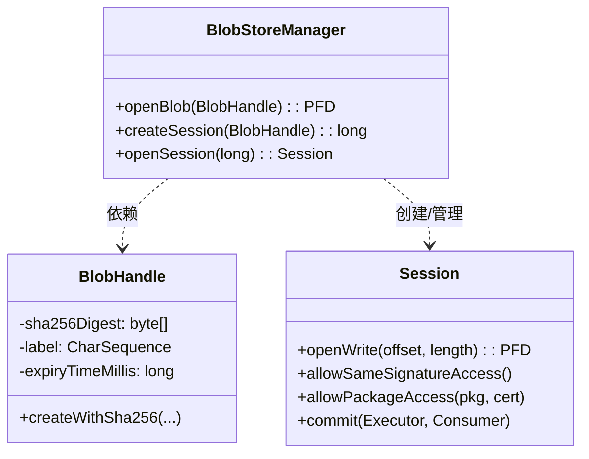

# 1.3.6 访问共享数据集

---
chapter_id: '1.3.6'
title: '访问共享数据集'
official_title: 'Access shared datasets'
official_url: 'https://developer.android.com/training/data-storage/shared/datasets'
topic_url: 'https://developer.android.com/training/data-storage'
status: 'done'
volume_priority: 8
volume_grade: 'A'
chapter_importance: 5

plot_summary:
  time: '清晨'
  location: '湖边帐篷'
  scene: '晨光中学习'
  season: '秋季'
  environment: '阳光金粉、湖面波光、水鸟鸣叫'
  topic: '共享数据集'
  discussion: '多应用间共享数据'
  problem_solved: '理解 Shared Storage Access Framework'
  difficulty: '多应用协作'
  next_topic: '管理所有文件'
---

## 1.3.6 访问共享数据集

清晨的阳光透过帐篷的缝隙，像细碎的金粉一样洒在洛芙的睡袋上。远处的湖面泛着粼粼波光，几只水鸟正在低空掠过，发出清脆的鸣叫。

洛芙揉着惺忪的睡眼钻出帐篷，发现希尔已经架起了简易炉灶，摩卡壶里正咕嘟咕嘟地冒着咖啡的香气。

“早安，洛芙！”希尔递过来一杯热腾腾的咖啡，“今天的徒步路线确认好了吗？”

“正在下呢……”洛芙叹了口气，举起手机展示那个正在缓慢爬行的进度条，“这个‘高清地形地貌离线包’也太大了！五百多兆啊！而且黛琳姐和伊莎姐的手机上也要下同样的包，这不是浪费吗？大家的存储空间都很宝贵的说。”

黛琳正坐在折叠椅上整理登山杖，闻言抬起头：“如果我们四个人的手机里存的都是同一份数据，确实是一种资源浪费。但在以前，Android 的沙盒机制让应用之间很难安全地共享这种大文件。”

“不过那是老皇历了，”希尔往吐司上抹了一层厚厚的草莓酱，咬了一大口，“Android 11 引入了一个超级好用的功能——**BlobStoreManager**（共享数据集）。它就像是我们营地的**公共物资仓库**。”

“公共物资仓库？”洛芙好奇地眨了眨眼。

“对，”希尔打了个响指，“只要数据的**内容**是一模一样的，系统就只会在仓库里存一份。无论是一百个应用还是一千个应用要用它，它都只占那一份的空间。这就叫‘内容寻址存储’。”

洛芙的眼睛瞬间亮了：“听起来好厉害！就像我们大家都把重装备扔进了一个异次元口袋，谁要用就去拿，但其实并不占用背包的负重！”

### 什么是 BlobStoreManager？

“没错，”黛琳接过话茬，“这个机制的核心在于——系统不看文件名，只看**内容**。它通过数据的哈希值（Hash）来识别身份。如果你有一块数据，算出来的 SHA-256 哈希值和仓库里现有的某块数据一样，系统就会直接把你指向那块已有的数据，而不会重新拷贝。”

“那具体怎么做呢？”洛芙迫不及待地打开了笔记本电脑。

### 第一步：制作身份牌 (BlobHandle)

希尔擦了擦嘴角的果酱，凑到洛芙屏幕前：“首先，你需要给你的数据办一张‘身份证’。在 BlobStore 里，这张身份证叫 `BlobHandle`。”

“它包含四个关键信息：数据的 SHA-256 哈希值、标签、过期时间和分类标签。”

```kotlin
// 1. 计算数据的 SHA-256 哈希值
// 假设我们要共享的是一个巨大的地图数据文件 map_data.bin
val mapData = loadMapBytes() // 模拟获取数据
val sha256Digest = calculateSha256(mapData) 

// 2. 创建 BlobHandle (身份证)
val blobHandle = BlobHandle.createWithSha256(
    sha256Digest,             // 数据的唯一指纹 (256位)
    "OfflineMap_v1",          // 用户可见的标签 (Label)
    System.currentTimeMillis() + TimeUnit.DAYS.toMillis(30), // 过期时间 (30天后自动清理)
    "map_module"              // 分类 Tag
)

/**
 * 希尔的小贴士：
 * 这个 calculateSha256 是我们要自己写的工具函数哦！
 * 哈希值必须绝对精确，哪怕差一个比特，系统也会认为它是另一份完全不同的数据。
 */
fun calculateSha256(data: ByteArray): ByteArray {
    val digest = java.security.MessageDigest.getInstance("SHA-256")
    return digest.digest(data)
}
```

“过期时间很重要，”伊莎提醒道，“就像鲜牛奶有保质期一样，共享数据如果长期没人用，系统需要知道什么时候可以清理它。”

### 第二步：去仓库查询 (Check Availability)

“有了身份证，我们就可以去仓库问问管理员：‘这里有我要的东西吗？’”希尔敲击键盘演示道。

```kotlin
val blobStoreManager = context.getSystemService(Context.BLOB_STORE_SERVICE) as BlobStoreManager

try {
    // 拿着身份证去仓库提货
    // openBlob 返回的是一个文件描述符 (ParcelFileDescriptor)
    val pfd = blobStoreManager.openBlob(blobHandle)
    
    // 如果没有抛出异常，说明仓库里有货！
    // 我们直接打开读取流，就像读本地文件一样
    ParcelFileDescriptor.AutoCloseInputStream(pfd).use { inputStream ->
        // 加载地图数据...
        Log.d("CampLog", "太棒了！仓库里有现成的地图数据，直接加载！")
        loadMapFromStream(inputStream)
    }
} catch (e: SecurityException) {
    // 仓库里可能有这个文件，但它是私有的，或者拥有者没给你权限
    Log.e("CampLog", "东西在，但你没权限拿。")
} catch (e: IOException) {
    // 最常见的情况：仓库里根本没有这个文件
    Log.d("CampLog", "仓库里没有，看来我得自己下载并贡献一份了。")
    downloadAndContribute(blobStoreManager, blobHandle)
}
```

“就像去图书馆借书，”洛芙点点头，“有就借走，没有就被告知‘查无此书’。”

### 第三步：贡献数据 (Writer Session)

“如果仓库里没有，你就得负责把数据‘搬’进去。”希尔的神情变得严肃起来，“这是一个‘重体力活’，所以我们需要开启一个**会话 (Session)**。”

“为什么不直接写进去？”洛芙问。

“因为数据可能很大呀，”黛琳解释道，“几百兆的文件，可能需要分多次写入，中间如果断网或者应用崩溃了，Session 机制能保证数据完整性——要么全成功，要么全失败，不会留下一堆残缺的垃圾文件。”

```kotlin
fun downloadAndContribute(manager: BlobStoreManager, handle: BlobHandle) {
    // 1. 创建一个写入会话，系统会返回一个 sessionId
    val sessionId = manager.createSession(handle)
    
    // 2. 打开这个会话
    manager.openSession(sessionId).use { session ->
        try {
            // 3. 打开写入流，开始往里灌数据
            // 这里我们模拟下载过程，实际上你会从网络流中读取并写入
            val outputStream = ParcelFileDescriptor.AutoCloseOutputStream(
                session.openWrite(0, -1) // offset=0, length=-1表示自动检测长度
            )
            
            outputStream.use { out ->
                // 假设这是从网络下载的数据块
                val buffer = ByteArray(1024)
                // while (read from network) { out.write(buffer) } ...
                out.write(dummyMapData) 
            }

            // 4. 【关键】设置访问控制
            // 允许拥有【相同签名】的应用访问（也就是我们自家的其他 App）
            session.allowSameSignatureAccess()
            
            // 如果想分享给别的公司的 App，需要知道对方的包名和证书指纹
            // session.allowPackageAccess("com.friend.app", friendCertBytes)
            
            // 5. 提交！
            // 提交是异步的，我们需要一个 Executor 来接收结果
            session.commit(mainExecutor) { result ->
                if (result == 0) {
                     Log.d("CampLog", "任务完成！数据已入库，其他 App 可以用了！")
                } else {
                     Log.e("CampLog", "提交失败，错误码：$result")
                }
            }
        } catch (e: Exception) {
            // 如果出了错，记得放弃会话，清理垃圾
            session.abandon() 
        }
    }
}
```

“注意 `allowSameSignatureAccess()`，”希尔特意圈了出来，“这就像是说：‘这箱物资，只有拿着我们要塞通行证（相同签名）的人才能领。’这是最安全的共享方式。”

### 流程可视化

洛芙在沙地上用树枝画了一个流程图，一边画一边确认：

```mermaid
flowchart TD
    Start[开始: 需要大文件] --> CalcHash{计算 SHA-256}
    CalcHash --> CreateHandle[创建 BlobHandle]
    CreateHandle --> CheckExist{调用 openBlob 检查}
    
    CheckExist -->|成功 (无异常)| Read[直接读取 InputStream]
    CheckExist -->|失败 (IOException)| CreateSession[创建 Session]
    
    CreateSession --> WriteData[写入数据 openWrite]
    WriteData --> SetPerm[设置权限 allowAccess]
    SetPerm --> Commit[提交 commit]
    
    Commit --> SysCheck{系统由 Hash 校验数据}
    SysCheck -->|哈希匹配| Success[入库成功]
    SysCheck -->|哈希不匹配| Fail[提交失败 (数据损坏)]
```

> 图 1：BlobStoreManager 的数据共享与贡献流程。

### 反模式与适用场景

“听起来很完美，”洛芙看着屏幕，“那我们是不是所有文件都可以往里存？”

“千万别！”黛琳摇了摇头，“`BlobStoreManager` 有它特定的适用场景。”

| 场景 | 推荐做法 | 为什么？ |
| :--- | :--- | :--- |
| **大型静态模型/数据包** (地图、AI模型) | ✅ **BlobStoreManager** | 显著节省空间，多 App 共享 |
| **用户照片/视频** | ❌ MediaStore | 媒体文件有专门的优化和管理方式 |
| **小配置文件** (JSON/XML) | ❌ SharedPreferences / Files | BlobStore 的 API 开销太大，得不偿失 |
| **经常修改的文件** | ❌ Database / Files | Blob 是**不可变**的！改一个字节整个哈希都变了 |

“记住，”希尔总结道，“它是用来存‘大块头、不常变’的东西的。就像仓库里存的帐篷和发电机，而不是你也每天都要用的牙刷。”

---

### 技术总结

> **BlobStoreManager** 是 Android 11 (API 30) 引入的一种**内容寻址存储 (Content-Addressable Storage)** 机制。它允许应用共享标准的二进制数据块 (BLOBs)，通过 SHA-256 哈希值唯一标识。其核心价值在于**系统级去重**和**跨应用安全共享**，特别适合分发大型游戏资源、机器学习模型或地图数据。

#### 今日关键词
1.  **BlobHandle**：数据的唯一标识符，核心是 SHA-256 哈希，而非文件名。
2.  **Session**：写入数据的事务会话，支持断点续传，必须 `commit()` 才能生效。
3.  **Content-Addressable**：内容即地址。如果内容改变，它就是另一个完全不同的 Blob。
4.  **Access Control**：通过 `allowSameSignatureAccess()` 精确控制特定 App 或同签名 App 的访问权限。

#### 结构图



> 图 2：BlobStoreManager 核心类关系图。

---

### 🏕️ 动手练习：从修补匠到物资官

为了让你真正掌握这个强大的工具，我们要完成一套完整的“物资管理系统”。

#### Task 1 · 打造工具锤 (SHA-256 Helper) ★
**目标**：BlobStore 的一切都建立在哈希之上。你需要先造一个趁手的工具。
**你需要做的事**：
1. 创建一个单例对象 `HashUtils`。
2. 编写一个函数 `calculateSha256(input: ByteArray): ByteArray`。
3. 编写一个重载函数 `calculateSha256(file: File): ByteArray`（选做）。
**提示代码**：
```kotlin
object HashUtils {
    fun calculateSha256(data: ByteArray): ByteArray {
        val digest = java.security.MessageDigest.getInstance("SHA-256")
        return digest.digest(data)
    }
}
```

#### Task 2 · 试探仓库 (Ping the Depot) ★★
**目标**：学会创建 `BlobHandle` 并检查存在性。
**你需要做的事**：
1. 定义一个字符串 `"Hello BlobStore" ` 并获取它的字节数组。
2. 使用 `HashUtils` 计算它的哈希值。
3. 创建 `BlobHandle`。
4. 调用 `blobStoreManager.openBlob(handle)`。
5. 捕获并打印 `SecurityException` (权限不足) 或 `IOException` (不存在)。

#### Task 3 · 第一次入库 (First Commit) ★★★
**目标**：成功将数据写入共享仓库。
**你需要做的事**：
1. 延续 Task 2，在捕获到 `IOException` 时进入写入流程。
2. `createSession` -> `openSession`。
3. `session.openWrite` 获取输出流，写入那是字符串的字节。
4. **关键**：调用 `session.allowSameSignatureAccess()`。
5. 调用 `session.commit()` 并监听回调。
**验收标准**：
- [ ] Logcat 显示提交成功 (Result == 0)。
- [ ] 再次运行 Task 2 的代码，这次应该**不报错**，而是成功返回 PFD。

#### Task 4 · 终极物资官 (The Supply Officer) ★★★★★
**目标**：封装一个生产环境可用的 `SharedResourceLoader` 类。
**你需要做的事**：
创建一个类，输入 URL 和 预期的 Hash，自动处理“检查-下载-缓存”全流程。
**步骤**：
1. `fun getResource(url: String, expectedHash: ByteArray): InputStream`
2. 先尝试 `openBlob`，如果成功直接返回流。
3. 失败则 `createSession`。
4. 使用 OkHttp 或 HttpURLConnection 下载流，一边读网络流一边写 Session 流（流对接，不要一次性读入内存！）。
5. 下载完成后 `commit`。
6. 使用 `CountDownLatch` 或 `suspendCoroutine` 等待 commit 结果。
7. 如果成功，再次 `openBlob` 返回流。

**提示代码 (伪代码框架)**：
```kotlin
// 这是一个协程版本的示意
suspend fun getSharedData(hash: ByteArray): InputStream = withContext(Dispatchers.IO) {
    val handle = BlobHandle.createWithSha256(hash, "Label", expiry, "Tag")
    try {
        // 1. 尝试直接获取
        ParcelFileDescriptor.AutoCloseInputStream(blobManager.openBlob(handle))
    } catch (e: IOException) {
        // 2. 没找到，开始下载并写入
        val sessionId = blobManager.createSession(handle)
        blobManager.openSession(sessionId).use { session ->
            // ... 下载并写入 session.openWrite() ...
            // ... session.commit() 并挂起等待结果 ...
        }
        // 3. 再次打开
        ParcelFileDescriptor.AutoCloseInputStream(blobManager.openBlob(handle))
    }
}
```

---

### 🍭 洛芙的小小日记本

今天就像学会了使用魔法空间！原来的我只会把东西死死地抱在怀里（存私有目录），现在我知道了可以把大家通用的东西放在那个神奇的“云端仓库”里。虽然算 SHA-256 有点像在做复杂的数学题，但是一想到能帮用户的手机省下好几百兆的空间，就觉得所有的努力都超值！
P.S. 希尔做的草莓酱涂吐司真的太好吃了，明天徒步一定要多带两片！🍓

