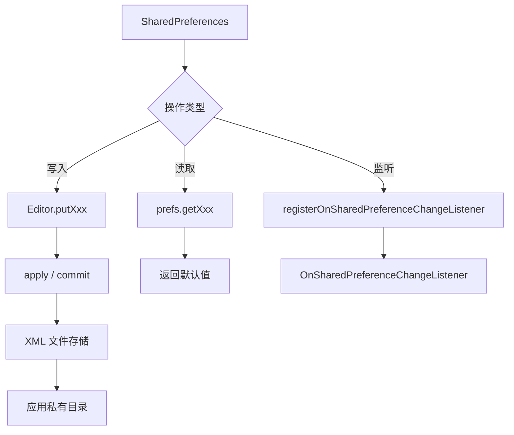

# 1.5.1 使用 SharedPreferences 保存简单数据

清晨的第一缕阳光透过帐篷的缝隙洒进来，洛芙揉了揉眼睛，发现大家已经起来了。

“洛芙醒了！”伊莎的声音从外面传来，“快来看，我们发现了一个超棒的地方！”

洛芙走出帐篷，发现大家在一棵大树下摆好了早餐。阳光穿过树叶，在草地上留下斑驳的光影。远处，湖面上笼罩着一层薄薄的雾气，就像仙境一样。

“昨天我们学了 SAF，”黛琳一边切着水果一边说，“今天我们来学一个更简单的东西——SharedPreferences。”

“SharedPreferences？”洛芙坐下来，好奇地问，“是什么？”

“就是——把你的小秘密藏起来的地方，”伊莎笑着说，“比如你的露营喜好、设置选项、还有……嗯，比如说，你最喜欢哪个帐篷位置？”

洛芙想了想：“那是不是就像一个随身携带的小本子？可以记一些不重要但想记住的东西？”

“对！”希尔打了个响指，“就是那种感觉。SharedPreferences 就是 Android 里的'小本本'，专门用来记那些不需要数据库、但又不想丢失的简单数据。”

### 什么是 SharedPreferences

黛琳打开笔记本电脑，屏幕在阳光下闪闪发亮。

“SharedPreferences 是 Android 提供的一种轻量级存储方式，”她解释道，“专门用来存储'键值对'——就像一个字典，每个数据都有一个名字（键），和一个值。”

```kotlin
// 获取 SharedPreferences 对象
// 方式一：在 Activity 中直接获取（当前 Activity 私有）
val prefs = getSharedPreferences("my_camp_notes", Context.MODE_PRIVATE)

// 方式二：如果是 Activity 内部使用，可以用更简单的方式
val prefs = getPreferences(Context.MODE_PRIVATE)

// 方式三：获取应用全局的 SharedPreferences
val prefs = PreferenceManager.getDefaultSharedPreferences(this)
```

希尔补充道：“'MODE_PRIVATE' 表示这个文件只有你的应用可以访问——这是最安全的模式。”

### 存储数据

“那……怎么把东西写进去呢？”洛芙问。

“用 Editor——”

```kotlin
// 存储数据的基本步骤
fun saveCampPreference(key: String, value: String) {
    val prefs = getSharedPreferences("camp_settings", Context.MODE_PRIVATE)
    
    // 获取编辑器
    val editor = prefs.edit()
    
    // 存储各种类型的数据
    editor.putString("camp_name", "湖畔露营地")      // 字符串
    editor.putInt("tent_count", 4)                  // 整数
    editor.putBoolean("fire_allowed", true)         // 布尔值
    editor.putFloat("temperature", 22.5f)           // 浮点数
    editor.putLong("last_visit", System.currentTimeMillis())  // 长整数
    
    // 如果 key 已存在，会自动覆盖
    
    // 保存到磁盘（异步，会立即返回）
    editor.apply()
    
    // 或者用 commit()（同步，会返回是否成功）
    // val success = editor.commit()
}
```

“apply 和 commit 的区别？”洛芙问。

“好问题！”希尔说，“apply 是异步的，不阻塞主线程，但不会告诉你是否保存成功。commit 是同步的，会阻塞主线程，但会返回 true/false 告诉你结果。一般用 apply 就够了。”

```kotlin
// 常见的存储操作示例
class CampPreferenceManager(private val context: Context) {
    
    private val prefs = context.getSharedPreferences("camp_settings", Context.MODE_PRIVATE)
    
    // 保存用户名
    fun setUserName(name: String) {
        prefs.edit().putString("user_name", name).apply()
    }
    
    // 保存用户年龄
    fun setUserAge(age: Int) {
        prefs.edit().putInt("user_age", age).apply()
    }
    
    // 保存是否喜欢露营
    fun setLovesCamping(love: Boolean) {
        prefs.edit().putBoolean("loves_camping", love).apply()
    }
    
    // 保存露营次数
    fun incrementCampCount() {
        val currentCount = prefs.getInt("camp_count", 0)
        prefs.edit().putInt("camp_count", currentCount + 1).apply()
    }
    
    // 清除所有数据
    fun clearAll() {
        prefs.edit().clear().apply()
    }
}
```

### 读取数据

“写进去了，怎么读出来呢？”洛芙又问。

“那就更简单了——”

```kotlin
// 读取数据
fun readCampPreference() {
    val prefs = getSharedPreferences("camp_settings", Context.MODE_PRIVATE)
    
    // 读取字符串（第二个参数是默认值，如果 key 不存在就返回这个）
    val campName = prefs.getString("camp_name", "未知营地")
    
    // 读取整数
    val tentCount = prefs.getInt("tent_count", 1)
    
    // 读取布尔值
    val fireAllowed = prefs.getBoolean("fire_allowed", false)
    
    // 读取浮点数
    val temperature = prefs.getFloat("temperature", 0f)
    
    // 读取长整数
    val lastVisit = prefs.getLong("last_visit", 0L)
    
    // 如果 key 不存在，返回默认值
    val notExist = prefs.getString("not_exist_key", "默认值")
    // notExist 的值是 "默认值"
    
    // 检查 key 是否存在
    val exists = prefs.contains("camp_name")  // true 或 false
}
```

伊莎轻声说：“默认值很重要——如果你不确定某个 key 一定存在，一定要给一个默认值，这样程序就不会崩溃。”

### 监听数据变化

“如果数据变了，我能知道吗？”洛芙问。

“能的！”黛琳笑着说，“注册一个监听器——”

```kotlin
// 监听 SharedPreferences 的变化
class CampPreferenceActivity : AppCompatActivity() {
    
    private lateinit var prefs: SharedPreferences
    
    private val preferenceChangeListener = SharedPreferences.OnSharedPreferenceChangeListener { 
        sharedPreferences, key ->
        // 当有数据变化时，这个方法会被调用
        Log.d("Prefs", "key: $key 的值发生了变化")
        
        // 可以根据 key 做不同的处理
        when (key) {
            "user_name" -> {
                val newName = sharedPreferences.getString(key, "")
                Log.d("Prefs", "用户名变成了: $newName")
            }
            "theme" -> {
                val newTheme = sharedPreferences.getString(key, "light")
                Log.d("Prefs", "主题变成了: $newTheme")
            }
        }
    }
    
    override fun onCreate(savedInstanceState: Bundle?) {
        super.onCreate(savedInstanceState)
        prefs = getSharedPreferences("camp_settings", Context.MODE_PRIVATE)
        
        // 注册监听器
        prefs.registerOnSharedPreferenceChangeListener(preferenceChangeListener)
    }
    
    override fun onDestroy() {
        super.onDestroy()
        // 一定记得取消注册！
        prefs.unregisterOnSharedPreferenceChangeListener(preferenceChangeListener)
    }
}
```

### 洛芙的露营设置应用

洛芙眼睛闪闪发光：“我想做一个露营设置应用！可以保存我的露营偏好！”

“那太好了！”希尔笑着说，“来，我们一起做。”

```kotlin
// 洛芙的露营设置应用 - CampSettingsActivity.kt
class CampSettingsActivity : AppCompatActivity() {
    
    private lateinit var prefs: SharedPreferences
    private lateinit var binding: ActivityCampSettingsBinding
    
    override fun onCreate(savedInstanceState: Bundle?) {
        super.onCreate(savedInstanceState)
        binding = ActivityCampSettingsBinding.inflate(layoutInflater)
        setContentView(binding.root)
        
        prefs = getSharedPreferences("camp_settings", Context.MODE_PRIVATE)
        
        loadSettings()
        setupListeners()
    }
    
    // 加载设置
    private fun loadSettings() {
        // 读取各项设置
        binding.etCampName.setText(prefs.getString("camp_name", ""))
        binding.etFavoritePlace.setText(prefs.getString("favorite_place", ""))
        binding.switchFireAllow.isChecked = prefs.getBoolean("fire_allowed", false)
        binding.switchPetAllow.isChecked = prefs.getBoolean("pet_allowed", false)
        binding.sliderTemperature.value = prefs.getFloat("preferred_temp", 20f)
        binding.tvCampCount.text = "露营次数: ${prefs.getInt("camp_count", 0)}"
    }
    
    // 设置点击事件
    private fun setupListeners() {
        // 保存按钮
        binding.btnSave.setOnClickListener {
            saveSettings()
            Toast.makeText(this, "设置已保存", Toast.LENGTH_SHORT).show()
        }
        
        // 重置按钮
        binding.btnReset.setOnClickListener {
            prefs.edit().clear().apply()
            loadSettings()
            Toast.makeText(this, "已重置", Toast.LENGTH_SHORT).show()
        }
        
        // 增加露营次数
        binding.btnAddCamp.setOnClickListener {
            val count = prefs.getInt("camp_count", 0)
            prefs.edit().putInt("camp_count", count + 1).apply()
            binding.tvCampCount.text = "露营次数: ${count + 1}"
        }
    }
    
    // 保存设置
    private fun saveSettings() {
        prefs.edit().apply {
            putString("camp_name", binding.etCampName.text.toString())
            putString("favorite_place", binding.etFavoritePlace.text.toString())
            putBoolean("fire_allowed", binding.switchFireAllow.isChecked)
            putBoolean("pet_allowed", binding.switchPetAllow.isChecked)
            putFloat("preferred_temp", binding.sliderTemperature.value)
            apply()
        }
    }
}
```

对应的布局文件：

```xml
<!-- activity_camp_settings.xml -->
<LinearLayout
    android:layout_width="match_parent"
    android:layout_height="match_parent"
    android:orientation="vertical"
    android:padding="16dp">
    
    <TextView
        android:layout_width="wrap_content"
        android:layout_height="wrap_content"
        android:text="🏕️ 露营设置"
        android:textSize="24sp"
        android:textStyle="bold"/>
    
    <EditText
        android:id="@+id/etCampName"
        android:layout_width="match_parent"
        android:layout_height="wrap_content"
        android:hint="露营名称"/>
    
    <EditText
        android:id="@+id/etFavoritePlace"
        android:layout_width="match_parent"
        android:layout_height="wrap_content"
        android:hint="最喜欢的露营地点"/>
    
    <Switch
        android:id="@+id/switchFireAllow"
        android:layout_width="wrap_content"
        android:layout_height="wrap_content"
        android:text="允许生火"/>
    
    <Switch
        android:id="@+id/switchPetAllow"
        android:layout_width="wrap_content"
        android:layout_height="wrap_content"
        android:text="允许带宠物"/>
    
    <TextView
        android:layout_width="wrap_content"
        android:layout_height="wrap_content"
        android:text="偏好温度"/>
    
    <com.google.android.material.slider.Slider
        android:id="@+id/sliderTemperature"
        android:layout_width="match_parent"
        android:layout_height="wrap_content"
        android:valueFrom="0"
        android:valueTo="40"
        android:stepSize="1"/>
    
    <TextView
        android:id="@+id/tvCampCount"
        android:layout_width="wrap_content"
        android:layout_height="wrap_content"/>
    
    <Button
        android:id="@+id/btnSave"
        android:layout_width="match_parent"
        android:layout_height="wrap_content"
        android:text="保存设置"/>
    
    <Button
        android:id="@+id/btnReset"
        android:layout_width="match_parent"
        android:layout_height="wrap_content"
        android:text="重置"/>
    
    <Button
        android:id="@+id/btnAddCamp"
        android:layout_width="match_parent"
        android:layout_height="wrap_content"
        android:text="增加露营次数"/>
</LinearLayout>
```

### 使用 PreferenceFragment

“如果我想做一个'设置'页面，有更简单的方式吗？”洛芙问。

“有！”黛琳说，“用 PreferenceFragment——”

```kotlin
// 使用 PreferenceFragment 快速创建设置页面
class SettingsFragment : PreferenceFragmentCompat() {
    
    override fun onCreatePreferences(savedInstanceState: Bundle?, rootKey: String?) {
        // 加载 preferences XML 文件
        setPreferencesFromResource(R.xml.preferences, rootKey)
        
        // 监听设置变化
        findPreference<SwitchPreferenceCompat>("fire_allowed")
            ?.setOnPreferenceChangeListener { preference, newValue ->
                Log.d("Settings", "fire_allowed 变成了: $newValue")
                true  // 返回 true 表示接受这个变化
            }
        
        // 获取值
        val campName = findPreference<EditTextPreference>("camp_name")?.text
        Log.d("Settings", "camp_name: $campName")
    }
}
```

对应的 XML 文件：

```xml
<!-- res/xml/preferences.xml -->
<PreferenceScreen xmlns:app="http://schemas.android.com/apk/res-auto">
    
    <PreferenceCategory app:title="露营信息">
        <EditTextPreference
            app:key="camp_name"
            app:title="露营名称"
            app:summary="给你的露营起个名字"/>
        
        <EditTextPreference
            app:key="favorite_place"
            app:title="最喜欢的地点"/>
    </PreferenceCategory>
    
    <PreferenceCategory app:title="露营偏好">
        <SwitchPreferenceCompat
            app:key="fire_allowed"
            app:title="允许生火"
            app:defaultValue="false"/>
        
        <SwitchPreferenceCompat
            app:key="pet_allowed"
            app:title="允许带宠物"
            app:defaultValue="false"/>
        
        <ListPreference
            app:key="weather_preference"
            app:title="天气偏好"
            app:entries="@array/weather_entries"
            app:entryValues="@array/weather_values"
            app:defaultValue="sunny"/>
    </PreferenceCategory>
    
    <PreferenceCategory app:title="统计">
        <Preference
            app:key="camp_count"
            app:title="露营次数"
            app:selectable="false"/>
    </PreferenceCategory>
</PreferenceScreen>
```

在 Activity 中使用：

```kotlin
class SettingsActivity : AppCompatActivity() {
    override fun onCreate(savedInstanceState: Bundle?) {
        super.onCreate(savedInstanceState)
        setContentView(R.layout.activity_settings)
        
        if (savedInstanceState == null) {
            supportFragmentManager
                .beginTransaction()
                .replace(R.id.settings_container, SettingsFragment())
                .commit()
        }
    }
}
```

早餐结束后，大家收拾好东西，准备今天的行程。洛芙看着手机里自己做的露营设置应用，心里充满了成就感。

“SharedPreferences 真的很方便呢！”洛芙开心地说，“不需要数据库，就能保存设置。”

“对，”黛琳笑着说，“而且数据会一直保存在手机里，就算关机也不会丢失。”

希尔补充道：“不过要记住——SharedPreferences 只适合存简单数据。如果数据量大或者需要复杂查询，还是得用 Room 数据库。”

伊莎指着远处的湖：“就像那个湖，如果只是装一杯水，用杯子就够了。但如果要装一个湖的水，就得用水库了。”

大家都会心地笑了起来。

阳光越来越强烈，新的一天露营之旅又要开始了。

---

### 技术总结

> **SharedPreferences** —— Android 提供的一种轻量级键值对存储方式，适用于保存应用的设置、用户偏好、小量数据等。数据以 XML 文件形式存储在应用私有目录中，默认模式下只有应用自身可以访问。SharedPreferences 操作简单，无需数据库，适合存储简单的配置信息。

#### 今日关键词

1. **SharedPreferences**：Android 轻量级键值对存储。
2. **Editor**：SharedPreferences 的编辑器，用于写入数据。
3. **apply()**：异步保存数据到磁盘，不阻塞调用线程。
4. **commit()**：同步保存数据，会返回成功/失败布尔值。
5. **getDefaultSharedPreferences()**：获取应用全局默认的 SharedPreferences。
6. **PreferenceFragment**：快速创建设置页面的 Fragment。

#### 结构图



#### 反模式与陷阱

1. **在主线程进行大量读写**：大量数据会用 commit 阻塞主线程。  
   修复：用 `apply()` 异步写入，或在子线程操作。

2. **不检查 key 是否存在就读取**：可能导致使用默认值但开发者未意识到。  
   修复：用 `contains()` 检查 key 是否存在。

3. **用 SharedPreferences 存大量数据**：性能差，不适合大数据。  
   修复：用 Room 数据库或文件存储。

4. **不取消注册监听器**：可能导致内存泄漏。  
   修复：在 onDestroy 中调用 `unregisterOnSharedPreferenceChangeListener`。

5. **敏感数据用 SharedPreferences**：不够安全。  
   修复：用 EncryptedSharedPreferences 或其他加密方式。

#### 设计思想

- **轻量优先**：简单数据用简单方式处理。
- **异步为王**：避免阻塞主线程影响用户体验。
- **默认值思维**：永远给读取操作一个安全的默认值。
- **隐私默认**：MODE_PRIVATE 是最安全的访问模式。

### 🏕️ 动手练习

#### Task 1 · 用户信息存储 ★

**目标**：保存用户的姓名和年龄。

**步骤**：

1. 在 Activity 中获取 SharedPreferences：
   ```kotlin
   val prefs = getSharedPreferences("user_info", Context.MODE_PRIVATE)
   ```

2. 创建两个 EditText 分别用于输入姓名和年龄，一个 Button 用于保存。

3. 保存时：
   ```kotlin
   binding.btnSave.setOnClickListener {
       val name = binding.etName.text.toString()
       val age = binding.etAge.text.toString().toIntOrNull() ?: 0
       prefs.edit().putString("name", name).apply()
       prefs.edit().putInt("age", age).apply()
   }
   ```

4. 在 onCreate 中读取并显示：
   ```kotlin
   binding.tvResult.text = "姓名: ${prefs.getString("name", "未设置")}\n年龄: ${prefs.getInt("age", 0)}"
   ```

**验收标准**：
- [ ] 能输入姓名和年龄
- [ ] 点击保存后数据被保存
- [ ] 重新打开应用后数据仍然存在

---

#### Task 2 · 设置页面开关 ★★

**目标**：实现一个设置页面，包含多个开关选项。

**步骤**：

1. 创建布局：Switch 或 SwitchMaterial 组件若干（深色模式、通知、位置权限等）。

2. 保存开关状态：
   ```kotlin
   binding.switchDarkMode.setOnCheckedChangeListener { _, isChecked ->
       prefs.edit().putBoolean("dark_mode", isChecked).apply()
   }
   ```

3. 在 onCreate 中恢复状态：
   ```kotlin
   binding.switchDarkMode.isChecked = prefs.getBoolean("dark_mode", false)
   ```

**验收标准**：
- [ ] 多个 Switch 组件
- [ ] 开关状态切换后保存
- [ ] 应用重启后状态保持

---

#### Task 3 · 计数器应用 ★★

**目标**：实现一个简单的计数器，记录按钮点击次数。

**步骤**：

1. 布局：一个 TextView 显示计数，一个 Button 点击增加。

2. 读取保存的计数：
   ```kotlin
   var count = prefs.getInt("click_count", 0)
   binding.tvCount.text = count.toString()
   ```

3. 点击后保存：
   ```kotlin
   binding.btnIncrease.setOnClickListener {
       count++
       binding.tvCount.text = count.toString()
       prefs.edit().putInt("click_count", count).apply()
   }
   ```

4. 添加重置功能：
   ```kotlin
   binding.btnReset.setOnClickListener {
       count = 0
       binding.tvCount.text = "0"
       prefs.edit().putInt("click_count", 0).apply()
   }
   ```

**验收标准**：
- [ ] 点击按钮计数增加
- [ ] 计数被保存
- [ ] 重启后计数保持
- [ ] 重置功能正常

---

#### Task 4 · 用户偏好设置 ★★★

**目标**：实现一个完整的用户偏好设置页面。

**步骤**：

1. 使用 PreferenceFragmentCompat 方式：
   ```kotlin
   class SettingsFragment : PreferenceFragmentCompat() {
       override fun onCreatePreferences(savedInstanceState: Bundle?, rootKey: String?) {
           setPreferencesFromResource(R.xml.settings_prefs, rootKey)
       }
   }
   ```

2. 创建 XML 配置文件：
   ```xml
   <PreferenceScreen xmlns:app="http://schemas.android.com/apk/res-auto">
       <SwitchPreferenceCompat
           app:key="notifications"
           app:title="接收通知"
           app:defaultValue="true"/>
       <ListPreference
           app:key="theme"
           app:title="主题"
           app:entries="@array/theme_entries"
           app:entryValues="@array/theme_values"/>
   </PreferenceScreen>
   ```

3. 在 Activity 中使用：
   ```kotlin
   supportFragmentManager.beginTransaction()
       .replace(R.id.container, SettingsFragment())
       .commit()
   ```

**验收标准**：
- [ ] PreferenceFragment 正常显示
- [ ] SwitchPreference 和 ListPreference 都能正常工作
- [ ] 设置被正确保存

---

#### Task 5 · 数据变化监听 ★★★

**目标**：监听 SharedPreferences 的变化并响应。

**步骤**：

1. 在 Activity 中注册监听：
   ```kotlin
   val listener = SharedPreferences.OnSharedPreferenceChangeListener { _, key ->
       Log.d("Prefs", "$key 发生了变化")
   }
   prefs.registerOnSharedPreferenceChangeListener(listener)
   ```

2. 在另一个地方修改数据测试：
   ```kotlin
   binding.btnModify.setOnClickListener {
       prefs.edit().putInt("test_value", (0..100).random()).apply()
   }
   ```

3. 在 onDestroy 取消注册：
   ```kotlin
   prefs.unregisterOnSharedPreferenceChangeListener(listener)
   ```

**验收标准**：
- [ ] 监听器被正确注册
- [ ] 数据变化时回调被触发
- [ ] 正确取消注册避免内存泄漏

---

#### Task 6 · 加密存储 ★★★★

**目标**：使用 EncryptedSharedPreferences 存储敏感数据。

**步骤**：

1. 添加依赖：
   ```kotlin
   implementation("androidx.security:security-crypto:1.1.0-alpha06")
   ```

2. 创建加密的 SharedPreferences：
   ```kotlin
   val masterKey = MasterKey.Builder(this)
       .setKeyScheme(MasterKey.KeyScheme.AES256_GCM)
       .build()
   
   val encryptedPrefs = EncryptedSharedPreferences.create(
       this,
       "secure_prefs",
       masterKey,
       EncryptedSharedPreferences.PrefKeyEncryptionScheme.AES256_SIV,
       EncryptedSharedPreferences.PrefValueEncryptionScheme.AES256_GCM
   )
   ```

3. 正常使用：
   ```kotlin
   encryptedPrefs.edit().putString("password", "secret123").apply()
   val password = encryptedPrefs.getString("password", "")
   ```

**验收标准**：
- [ ] EncryptedSharedPreferences 正常创建
- [ ] 数据被加密存储
- [ ] 读取时自动解密

---

#### Task 7 · 多用户数据隔离 ★★★★

**目标**：实现用户切换，每个用户有独立的设置。

**步骤**：

1. 每个用户用不同的文件名：
   ```kotlin
   fun getUserPrefs(userId: String): SharedPreferences {
       return getSharedPreferences("user_${userId}_prefs", Context.MODE_PRIVATE)
   }
   ```

2. 切换用户时加载对应数据：
   ```kotlin
   var currentUserId = "user1"
   
   fun switchUser(newUserId: String) {
       currentUserId = newUserId
       loadUserSettings()
   }
   ```

**验收标准**：
- [ ] 不同用户的设置相互隔离
- [ ] 切换用户后加载对应设置

---

#### Task 8 · 设置同步到云端 ★★★★★

**目标**：将用户设置同步到服务器。

**步骤**：

1. 定义数据模型：
   ```kotlin
   data class UserSettings(
       val userId: String,
       val darkMode: Boolean,
       val notifications: Boolean,
       val theme: String
   )
   ```

2. 实现同步逻辑：
   ```kotlin
   fun syncToCloud() {
       val settings = UserSettings(
           userId = getCurrentUserId(),
           darkMode = prefs.getBoolean("dark_mode", false),
           notifications = prefs.getBoolean("notifications", true),
           theme = prefs.getString("theme", "light") ?: "light"
       )
       // 发送到服务器
       api.saveSettings(settings).enqueue { /* 处理响应 */ }
   }
   ```

3. 从云端恢复：
   ```kotlin
   fun restoreFromCloud() {
       api.getSettings(getCurrentUserId()).enqueue { response ->
           response.body()?.let { settings ->
               prefs.edit().apply {
                   putBoolean("dark_mode", settings.darkMode)
                   putBoolean("notifications", settings.notifications)
                   putString("theme", settings.theme)
                   apply()
               }
           }
       }
   }
   ```

**验收标准**：
- [ ] 设置能上传到服务器
- [ ] 能从服务器下载并恢复设置
- [ ] 离线时正常工作

---

#### 💬 面试热身

**Q1**：SharedPreferences 的数据存储在哪里？是进程隔离的吗？

**Q2**：apply() 和 commit() 的区别是什么？

**Q3**：SharedPreferences 能存多大的数据？有什么限制？

**Q4**：如何监听 SharedPreferences 的变化？

**Q5**：SharedPreferences 是线程安全的吗？

---

> SharedPreferences 是 Android 开发中最常用的数据持久化方式之一。它就像露营时的随身小本子——轻便、简单、够用。学会正确使用 SharedPreferences，能让你的应用给用户带来更好的体验。下次露营时，记得带上你的"小本本"！

### 🍭 洛芙的小小日记本

今天太开心了！学会了 SharedPreferences！做了一个露营设置应用，可以保存我喜欢的地方、是否允许生火、露营次数……而且数据会一直都在！黛琳说这个就像随身小本本，真的好像啊！谢谢希尔、黛琳、伊莎～明天继续加油！✨
