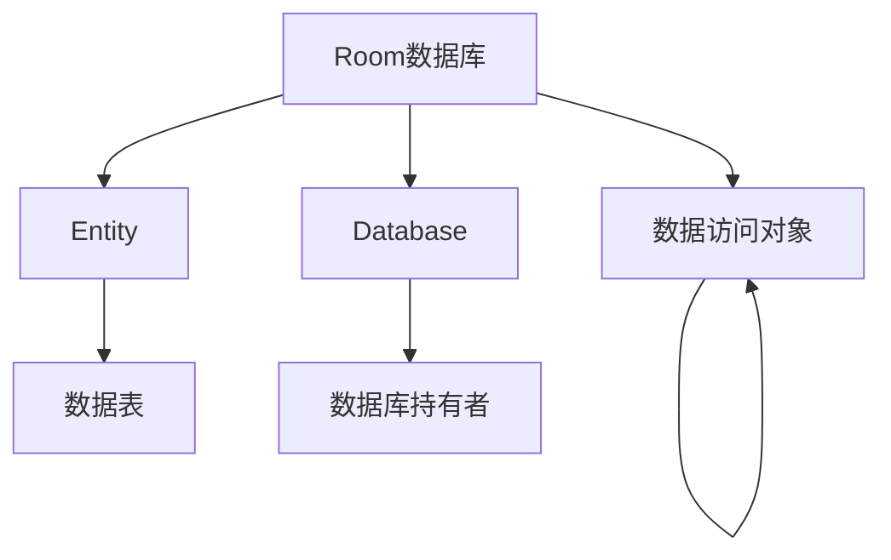

# 1.6.1 数据管家Room

营地阳光正好，黛琳在给洛FR讲解一个强大的数据存储工具。

“在Android中，如果要存大量结构化数据，就要用到数据库，”黛琳说道，“而Room是Google推荐的数据库方案。”

## 1.6.1.1 什么是Room

“Room就像是一个智能的文件柜，”黛琳比喻道，“它帮你组织、存储、查询数据，比直接用SQLite方便多了。”

**Room的优势：**
- 编译时检查SQL
- 减少模板代码
- 配合协程使用

## 1.6.1.2 Room的三个组件

“Room有三个核心组件，”黛琳扳着手指说道。



**1. Entity（实体）** - 定义数据表
**2. DAO（数据访问对象）** - 定义增删改查方法
**3. Database（数据库）** - 持有数据库实例

## 1.6.1.3 添加依赖

“首先要在build.gradle中添加依赖，”黛琳说道。

```kotlin
// build.gradle (app)
dependencies {
    val roomVersion = "2.6.1"
    
    implementation("androidx.room:room-runtime:$roomVersion")
    implementation("androidx.room:room-ktx:$roomVersion")  // Kotlin扩展
    annotationProcessor("androidx.room:room-compiler:$roomVersion")
    
    // 如果用KSP
    ksp("androidx.room:room-compiler:$roomVersion")
}
```

## 1.6.1.4 创建Entity

“然后定义数据实体，”黛琳继续说道。

```kotlin
@Entity(tableName = "users")
data class User(
    @PrimaryKey(autoGenerate = true)
    val id: Long = 0,
    
    val name: String,
    val email: String,
    val age: Int
)
```

## 1.6.1.5 创建DAO

“定义数据访问对象，”黛琳说道。

```kotlin
@Dao
interface UserDao {
    
    @Query("SELECT * FROM users")
    fun getAllUsers(): List<User>
    
    @Query("SELECT * FROM users WHERE id = :id")
    fun getUserById(id: Long): User?
    
    @Insert
    fun insert(user: User): Long
    
    @Update
    fun update(user: User)
    
    @Delete
    fun delete(user: User)
    
    @Query("DELETE FROM users")
    fun deleteAll()
}
```

## 1.6.1.6 创建Database

“最后创建数据库类，”黛琳总结道。

```kotlin
@Database(entities = [User::class], version = 1)
abstract class AppDatabase : RoomDatabase() {
    
    abstract fun userDao(): UserDao
    
    companion object {
        @Volatile
        private var INSTANCE: AppDatabase? = null
        
        fun getDatabase(context: Context): AppDatabase {
            return INSTANCE ?: synchronized(this) {
                val instance = Room.databaseBuilder(
                    context.applicationContext,
                    AppDatabase::class.java,
                    "app_database"
                ).build()
                INSTANCE = instance
                instance
            }
        }
    }
}
```

## 1.6.1.7 使用数据库

“使用时就是这样：”黛琳说道。

```kotlin
class UserRepository {
    
    private val database = AppDatabase.getDatabase(context)
    private val userDao = database.userDao()
    
    // 增
    suspend fun insert(user: User) {
        userDao.insert(user)
    }
    
    // 查
    suspend fun getAll(): List<User> {
        return userDao.getAllUsers()
    }
    
    // 改
    suspend fun update(user: User) {
        userDao.update(user)
    }
    
    // 删
    suspend fun delete(user: User) {
        userDao.delete(user)
    }
}
```

---

## 1.6.1.8 专业技术总结

本章我们学习了Room数据库。

**核心要点：**

1. **Room是SQLite的封装** - Google推荐
2. **三个组件** - Entity、DAO、Database
3. **编译时检查** - 减少运行时错误
4. **配合协程** - 异步操作
5. **单例模式** - 获取数据库实例

**组件关系：**

```
Database → 包含 → DAO → 操作 → Entity
```

---

> **学习建议**
> 
> 1. 创建完整的Room Demo
> 2. 实现增删改查
> 3. 理解协程的使用
> 4. 下一章学习Entity的更多用法

---

## 洛芙的小小日记本

> Room好像一个超级整理师，帮我把数据分类放好。取用好方便！春天🌸真好！
