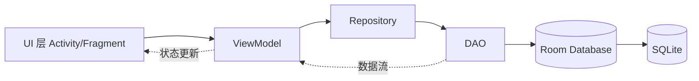

# 1.6.1 使用 Room 在本地数据库保存数据

清晨的光线，像蜂蜜一样，慢慢从白桦林的叶缝里流下来。

洛芙抱着平板，坐在昨晚篝火旁那块熟悉的石头上，眉头却皱得紧紧的。

“我昨天把露营记录存在 SharedPreferences 里了，”她嘟囔着，“可是……今天我想加‘天气’和‘心情’，再加‘按地点筛选’，代码一下就变乱了。字符串 key 到处飞，我快认不出来谁是谁了。”

希尔拿着保温杯，轻轻敲了敲她的头：“这不是你笨。是你已经走到了 SharedPreferences 的边界。”

“边界？”

黛琳把一张纸铺在地上，画了三列：标题、地点、日期。

“你现在的数据，不是‘一个设置项’，而是‘很多条结构化记录’。每条记录有相同字段，还要支持查询、排序、更新。”

伊莎笑着补了一句：“换句话说，你不再是在写便签纸，你是在经营一本真正的日记档案馆。”

洛芙抬头：“所以我需要……数据库？”

“对，”希尔点头，“而在 Android 里，最适合新手、也最现代的一条路，叫 Room。”

### 为什么是 Room，而不是直接 SQLite

她们沿着湖边慢慢走，水面上有晨风吹出来的小皱纹。

黛琳蹲下，用树枝在沙地上写下三行字：

- SQLite：原始但强大，自己写 SQL + 管理游标
- Room：SQLite 的安全封装层
- 结果：更少坑、更可维护、更适合团队

“Room 不是替代数据库本身，”她说，“它是帮你和数据库‘说人话’。尤其是编译期检查，能提前抓掉很多 SQL 错误。”

洛芙点点头，像终于听懂了地图的比例尺：“所以 Room 是‘正规档案馆管理员’。”

“准确。”希尔打了个响指。

### Room 的三件套：Entity、DAO、Database

“先别急着写大工程。”希尔说，“先做一件小而完整的事：存一条露营日记，再读出来。”

她把平板转给洛芙，屏幕上只有一段很短的代码。

```kotlin
// 1) Entity：定义“这条数据长什么样”
// 你可以把它理解成“日记表的一行模板”
@Entity(tableName = "camp_journal") // 表名：camp_journal
// data class 是 Kotlin 的数据类，天然适合承载“纯数据”
data class CampJournalEntity(
    // 主键 id：每条日记必须有唯一编号
    // autoGenerate = true 表示由数据库自动递增，不需要你手动维护
    @PrimaryKey(autoGenerate = true)
    val id: Long = 0,

    // 标题：例如“第一天到湖边营地”
    val title: String,

    // 内容：正文
    val content: String,

    // 地点：例如“湖畔”“松林”
    val location: String,

    // 创建时间：用毫秒时间戳，方便排序和后续格式化显示
    val createdAt: Long = System.currentTimeMillis()
)
```

“这段我懂！”洛芙眼睛亮了，“就像先定表格结构。”

“没错。第二件套——DAO。”

```kotlin
// 2) DAO：定义“我要怎么操作这张表”
// DAO = Data Access Object，负责增删改查接口
@Dao
interface CampJournalDao {

    // 查询全部，按 createdAt 倒序（最新在前）
    // 返回 Flow<List<...>>：数据变了会自动推送新列表
    @Query("SELECT * FROM camp_journal ORDER BY createdAt DESC")
    fun observeAll(): kotlinx.coroutines.flow.Flow<List<CampJournalEntity>>

    // 插入一条
    // suspend 表示需要在协程中调用，避免阻塞主线程
    @Insert(onConflict = OnConflictStrategy.REPLACE)
    suspend fun insert(item: CampJournalEntity)

    // 根据 id 删除
    @Query("DELETE FROM camp_journal WHERE id = :id")
    suspend fun deleteById(id: Long)
}
```

“为什么不是直接返回 List 呢？”洛芙问。

黛琳回答得很温柔：“因为你迟早会做列表页面。Flow 或 LiveData 能让 UI 自动跟随数据库变化，省掉手动刷新的麻烦。”

“第三件套——Database。”

```kotlin
// 3) Database：把 Entity 和 DAO 组织起来
@Database(
    entities = [CampJournalEntity::class], // 告诉 Room：我有哪几张表
    version = 1,                            // 数据库版本号，后续升级会用到
    exportSchema = false                    // 教学项目先关掉 schema 导出
)
abstract class CampDatabase : RoomDatabase() {
    // 暴露 DAO 给外部使用
    abstract fun journalDao(): CampJournalDao

    companion object {
        // 单例：整个进程只保留一个数据库实例，避免资源浪费和并发问题
        @Volatile private var INSTANCE: CampDatabase? = null

        fun get(context: Context): CampDatabase {
            // 如果已有实例就复用；没有就创建
            return INSTANCE ?: synchronized(this) {
                val instance = Room.databaseBuilder(
                    context.applicationContext,
                    CampDatabase::class.java,
                    "camp.db" // 本地数据库文件名
                ).build()
                INSTANCE = instance
                instance
            }
        }
    }
}
```

洛芙盯着屏幕几秒，忽然笑了：“我发现 Room 真的是‘搭骨架’。先定义数据长相，再定义动作，再定义总仓库。”

希尔点头：“你抓到核心了。”

### 把故事写进数据库：第一次真正落地

她们回到营地，帐篷边的小桌子上放着还温热的面包。

“现在我们做最关键的一步——把代码接到真实操作。”

希尔把操作拆成四步，写得像给初学者的登山路线：

1. 获取数据库实例
2. 拿到 DAO
3. 用协程插入数据
4. 用 Flow 观察并显示

```kotlin
class JournalDemoActivity : AppCompatActivity() {

    // 延迟初始化：onCreate 时再赋值
    private lateinit var db: CampDatabase
    private lateinit var dao: CampJournalDao

    override fun onCreate(savedInstanceState: Bundle?) {
        super.onCreate(savedInstanceState)

        // 第一步：拿数据库实例（单例）
        db = CampDatabase.get(applicationContext)

        // 第二步：拿 DAO
        dao = db.journalDao()

        // 第三步：插入一条示例数据（必须在协程中）
        lifecycleScope.launch {
            dao.insert(
                CampJournalEntity(
                    title = "清晨的湖边",
                    content = "今天的风很轻，像没说完的话。",
                    location = "湖畔"
                )
            )
        }

        // 第四步：观察全部数据并更新 UI
        // launchWhenStarted：界面可见时开始收集，避免无意义消耗
        lifecycleScope.launchWhenStarted {
            dao.observeAll().collect { list ->
                // 这里通常会交给 RecyclerView Adapter
                // 先用日志代替 UI，确认链路是通的
                Log.d("RoomDemo", "当前日记数量 = ${list.size}")
            }
        }
    }
}
```

“所以这就是完整闭环，”洛芙掰着手指，“定义→插入→查询→自动刷新。”

“对，”黛琳说，“你从‘会写 API’进化到了‘会搭系统’。”

### 新手最容易踩的 5 个坑

太阳又高了一点，湖面的雾已经完全散了。

伊莎从包里拿出便签纸，写下了“五个坑”，塞进洛芙手里：

1. **在主线程直接查数据库**：页面会卡顿，甚至 ANR。  
2. **把 Room 当 SharedPreferences 用**：只存一个布尔值没必要上数据库。  
3. **忘记版本迁移**：线上升级后可能崩溃。  
4. **DAO 返回普通 List，但期望自动更新 UI**：不会自动刷新。  
5. **把复杂业务都塞进 Activity**：后期维护会崩盘。

“把它们背下来，”希尔说，“你会少走很多弯路。”

洛芙点头，认真得像在接一份正式任命。

午前的风带着松针和草木香气。

洛芙把自己的「露营日记 App」第一版需求重新写了一遍：

- 一条日记：标题、内容、地点、时间
- 首页列表按时间倒序
- 可新增、可删除
- 后续再加搜索和筛选

“你看，”黛琳轻轻笑了，“你已经开始按‘迭代’思维做产品了。”

“而不是一口气做完所有功能。”伊莎补上。

洛芙长长呼了口气，像终于把一团纠缠很久的线理顺。

“Room 没有我想象中可怕。”

“它本来就不该可怕。”希尔说，“真正的力量不是一次写很多，而是每次都写对一点点。”

树影摇晃，湖水泛光。

---

### 技术总结

- 当数据从“单个设置项”进化为“多条结构化记录”时，优先考虑 Room。  
- Room 三件套：
  - **Entity**：表结构（数据长什么样）
  - **DAO**：操作接口（怎么查、怎么改）
  - **Database**：统一入口（把表和 DAO 组织起来）
- 新手最稳妥的实践顺序：
  1. 先做单表 CRUD
  2. 再接列表 UI
  3. 再上搜索/筛选
  4. 最后做迁移和复杂关系

#### 结构图



### 🏕️ 动手练习（可执行版）

#### Task 1 · 跑通最小 Room 项目（必做）★

**目标**：能插入 1 条数据并在日志里看到数量变化。  

**步骤**：
1. 在 app `build.gradle` 添加 Room + KTX + 协程依赖。  
2. 新建 `CampJournalEntity`（字段：id/title/content/location/createdAt）。  
3. 新建 `CampJournalDao`（`insert` + `observeAll`）。  
4. 新建 `CampDatabase`。  
5. 在 `Activity` 的 `onCreate` 里插入一条测试数据，并 `collect` 数据流。  

**验收标准**：
- [ ] App 启动后不崩溃  
- [ ] Logcat 出现 `当前日记数量 = 1` 或更大  

---

#### Task 2 · 做一个“新增日记”页面 ★★

**目标**：用户输入标题/内容/地点后，点击保存入库。  

**步骤**：
1. UI：3 个输入框 + 1 个保存按钮。  
2. 点击保存时做非空校验（标题和内容不能为空）。  
3. 通过 `lifecycleScope.launch` 调用 `dao.insert()`。  
4. 保存成功后 `finish()` 返回列表页。  

**验收标准**：
- [ ] 空标题时给出提示，不入库  
- [ ] 输入有效内容后可成功保存  

---

#### Task 3 · 列表展示与自动刷新 ★★

**目标**：首页显示所有日记，新增后自动出现。  

**步骤**：
1. 建 RecyclerView + Adapter。  
2. 在 Activity/Fragment 中 `collect dao.observeAll()`。  
3. 每次收到新列表时 `adapter.submitList(list)`。  

**验收标准**：
- [ ] 首次进入能看到已有数据  
- [ ] 新增后无需手动刷新就出现在列表  

---

#### Task 4 · 删除功能 ★★★

**目标**：长按列表项删除指定日记。  

**步骤**：
1. DAO 增加 `deleteById(id: Long)`。  
2. 列表项支持长按，弹确认对话框。  
3. 点击确认后调用删除。  

**验收标准**：
- [ ] 删除后列表立即减少  
- [ ] 删除取消时数据不变  

---

#### Task 5 · 关键词搜索（标题+正文）★★★

**目标**：输入关键词，过滤出匹配结果。  

**步骤**：
1. DAO 增加 `search(keyword)`，SQL 用 `LIKE`。  
2. 搜索框监听文字变化。  
3. 有关键词时展示搜索结果；关键词为空时展示全部。  

**验收标准**：
- [ ] 输入“湖”能查到含“湖”的记录  
- [ ] 清空搜索框后恢复全列表  

---

#### Task 6 · Repository + ViewModel 重构 ★★★★

**目标**：把数据库操作从 Activity 挪到数据层。  

**步骤**：
1. 新建 `JournalRepository`，封装 DAO 调用。  
2. 新建 `JournalViewModel`，只向 UI 暴露状态与方法。  
3. Activity 只做 UI 交互，不直接操作 DAO。  

**验收标准**：
- [ ] Activity 中不再出现 DAO 字段  
- [ ] 代码结构更清晰，职责分离明显  

---

#### Task 7 · 加一个“最近7天”筛选 ★★★★

**目标**：按时间范围过滤数据。  

**步骤**：
1. DAO 新增 `queryByRange(start, end)`。  
2. 计算当前时间和 7 天前时间戳。  
3. 按钮切换“全部/最近7天”两种模式。  

**验收标准**：
- [ ] 切换模式后列表内容变化正确  
- [ ] 时间范围逻辑正确（不多不少）  

---

#### Task 8 · 数据库版本升级演练 ★★★★★

**目标**：从 v1 升到 v2，新增 `weather` 字段并迁移。  

**步骤**：
1. Entity 新增字段 `weather: String = "未知"`。  
2. `@Database(version = 2)`。  
3. 编写 `Migration(1,2)`：`ALTER TABLE ... ADD COLUMN ...`。  
4. `databaseBuilder.addMigrations(migration1To2)`。  

**验收标准**：
- [ ] 升级后旧数据仍在  
- [ ] 新字段可正常读写  
- [ ] 不出现“Migration didn't properly handle”报错  

---

#### 💬 面试热身

1. Room 相比直接 SQLite 的三个核心优势是什么？  
2. 为什么数据库操作不能放在主线程？  
3. Flow / LiveData 在列表页自动刷新中的价值是什么？  
4. 什么情况下你不会用 Room，而会继续用 SharedPreferences？  
5. 线上版本升级时，为什么必须做 Migration？  

### 🍭 洛芙的小小日记本

今天我终于不再害怕“数据库”这三个字了。  
它没有我想象中那么凶。  
只要把问题拆小：先定义、再操作、再连接、再观察，
每一步都能走得很稳。  
我想把这句话送给明天的自己：
**“不要试图一次写完全部未来，只要先把今天这一条数据写对。”** ✨
