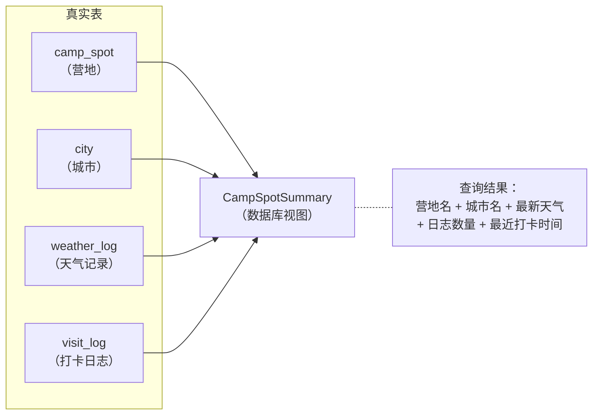
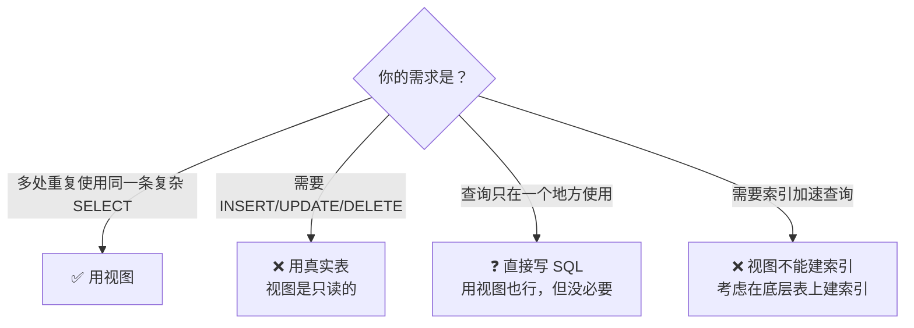
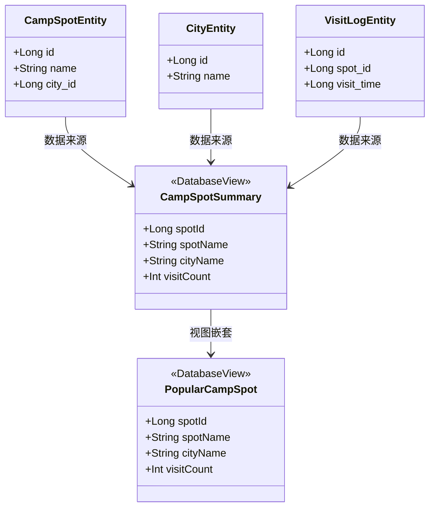

# 1.6.10 创建数据库视图

## 1.6.10 数据库视图：把复杂查询"冻"成一张虚拟表

"黛琳，我写的这个 DAO 方法——"洛芙盯着屏幕上密密麻麻的 SQL 语句，嘴角往下撇了一点，"已经是第四次在不同的地方用到了。"

午后的阳光从白桦林的树冠间筛下来，像一把碎金币撒在折叠桌上。刚才还在溪边洗杯子的希尔走过来，瞟了一眼洛芙的屏幕，吹了声口哨。

"这条 SQL 有……四个 JOIN？"

"五个。"洛芙伸出一只手，五指张开，有气无力地晃了晃。

她写的是一条查询：把营地的基本信息、归属城市、最新天气记录、露营日志数量和最近一次打卡时间全部拼到一起。第一次写的时候觉得自己很厉害，可当它在第四个 DAO 方法里原封不动地出现时，那种成就感已经变成了一种隐隐的不安。

"就像你写作文的时候，每次提到'我家楼下那条向东走三百米经过一个红色邮筒右转再走两百米的路'，你难道不会给它起个名字吗？"伊莎坐在毯子上，膝盖上搁着一杯冰柠檬水，冰块碰着玻璃壁发出叮叮的声响，"比如叫它'樱花小路'。"

"你是说——给这条查询起个名字，然后直接用名字调？"

"在数据库的世界里，这个名字叫做**视图**（View）。"黛琳合上手中的技术文档，声音平静得像镜面湖水，"它不是一张真正存储数据的表，而是一条 SELECT 查询被'冻结'成了一张**虚拟表**。你查它的时候，数据库会自动执行那条底层 SELECT 语句，把结果返回给你。"

洛芙的眼睛亮了一下。

"所以我写一次，到处用？"

"没错。而且 Room 对此有原生支持。"黛琳从毯子上站起来，走到白板前，拿起笔。

### 视图是什么？

"先搞清楚一个最基本的问题。"黛琳在白板上画了两个方框。

一个标着"Table（表）"，里面写了"真实存储数据"；另一个标着"View（视图）"，里面写了"不存储数据，只存储查询"。

"你可以把**视图**想成一面**魔镜**。"伊莎在旁边轻声补充，把柠檬水里的薄荷叶用吸管拨了拨，"镜子本身不存放东西，但你每次往里看，它都会把好几个房间的景象拼在一起展示给你。"



> 图 1：数据库视图的本质。四张真实表的数据通过一条 SELECT 查询拼合成一张虚拟表（CampSpotSummary）。视图本身不存储任何数据，每次查询视图时数据库自动执行底层的 SQL。

"视图有三个关键特征——"黛琳竖起三根手指。

"第一，**只读**。视图只能查，不能直接 INSERT、UPDATE 或 DELETE。想改数据，必须去改底层的真实表。"

"第二，**实时**。每次查询视图，数据库都会重新执行那条底层 SQL。所以视图返回的数据永远是最新的。"

"第三，**简化查询**。一条复杂的 JOIN 查询只需要写一次，之后在 DAO 中查视图就像查普通表一样简单。"

洛芙在笔记本上写下：**视图 = 只读 + 实时 + 简化查询**。

### Room 中创建视图：@DatabaseView

"那在 Room 里怎么创建视图？"洛芙的笔已经举了起来。

"用 `@DatabaseView` 注解。"希尔打开编辑器，手指在键盘边缘轻轻敲了两下。

"你还记得 `@Entity` 吧？它告诉 Room：'这个类对应一张**真实表**。' 而 `@DatabaseView` 告诉 Room：'这个类对应一张**虚拟表**——它的数据来自一条 SQL 查询。'"

```kotlin
// 代码片段 A：用 @DatabaseView 创建一个营地摘要视图
// 依赖：androidx.room:room-runtime + room-ktx

// @DatabaseView 注解声明一个数据库视图
// value 参数是底层 SELECT 查询——每次读取视图时数据库自动执行这条 SQL
// viewName 参数（可选）指定视图在数据库中的名称，默认使用类名
@DatabaseView(
    viewName = "camp_spot_summary",
    value = """
        SELECT
            cs.id           AS spotId,
            cs.name         AS spotName,
            c.name          AS cityName,
            wl.temperature  AS latestTemperature,
            COUNT(vl.id)    AS visitCount,
            MAX(vl.visit_time) AS lastVisitTime
        FROM camp_spot cs
        INNER JOIN city c ON cs.city_id = c.id
        LEFT JOIN weather_log wl ON wl.spot_id = cs.id
            AND wl.id = (
                SELECT MAX(w2.id)
                FROM weather_log w2
                WHERE w2.spot_id = cs.id
            )
        LEFT JOIN visit_log vl ON vl.spot_id = cs.id
        GROUP BY cs.id
    """
)
data class CampSpotSummary(
    val spotId: Long,           // 营地 ID
    val spotName: String,       // 营地名称
    val cityName: String,       // 所在城市
    val latestTemperature: Double?, // 最新温度（可能没有天气记录，所以 nullable）
    val visitCount: Int,        // 打卡总次数
    val lastVisitTime: Long?    // 最近一次打卡的时间戳
)
```

"哇——"洛芙的目光在注解的那个 `value` 参数上移动着，"这条 SQL 就是我之前写了四遍的那条？"

"是的。但从现在开始，你只需要写这**一次**。"希尔拍了一下桌面，可可杯里的液面晃了晃。

"注意几个细节——"黛琳走回来，用笔尖轻轻点着屏幕。

"第一，`@DatabaseView` 的 `value` 参数就是底层 SQL 查询。Room 在编译期会验证这条 SQL 的正确性——如果表名、列名拼错了，编译就会报错。"

"第二，`viewName` 是可选的。如果你不指定，Room 默认使用类名作为视图名。但最佳实践是显式指定一个 snake_case 的名称，和表名保持风格一致。"

"第三，视图类的字段名必须和 SELECT 的列别名**完全匹配**。比如 SQL 里写了 `cs.name AS spotName`，那 Kotlin 类里就必须有一个 `spotName` 字段。"

洛芙点了点头，在笔记本上画了一个从 `@Entity` 到 `@DatabaseView` 的对比箭头，标注："Entity = 真实表，DatabaseView = 虚拟表。"

### 注册视图到数据库

"光写了 `@DatabaseView` 还不够。"黛琳继续说，"你还需要告诉数据库：'我有这张视图，请帮我创建它。'"

"就像你有了一面魔镜，但还没有把它挂到墙上。"伊莎说。一只蜻蜓从她的玻璃杯上方掠过，翅膀在阳光里闪了一下。

```kotlin
// 代码片段 B：在 @Database 注解中注册视图
// views 参数接受一个 KClass 数组，列出所有需要创建的视图

@Database(
    entities = [
        CampSpotEntity::class,
        CityEntity::class,
        WeatherLogEntity::class,
        VisitLogEntity::class
    ],
    views = [CampSpotSummary::class],   // 在这里注册视图
    version = 2                          // 添加视图后需要升级数据库版本
)
abstract class CampDatabase : RoomDatabase() {
    abstract fun campSpotDao(): CampSpotDao
}
```

"注意 `views` 参数。"希尔指着那一行，"它和 `entities` 是平级的。`entities` 列真实表，`views` 列虚拟表。"

"还有一个重要的事情——"黛琳的声音微微加重了，"如果你的数据库已经存在了（比如用户已经在用这个 App），添加视图意味着**数据库结构发生了变化**。你必须把 `version` 加一，并且提供迁移逻辑。否则 App 会崩溃。"

"迁移的时候，视图用 `CREATE VIEW` 语句创建。"希尔补充道。

```kotlin
// 代码片段 C：为新增视图编写迁移脚本

val MIGRATION_1_2 = object : Migration(1, 2) {
    override fun migrate(db: SupportSQLiteDatabase) {
        // 创建视图的 SQL 语句
        // CREATE VIEW IF NOT EXISTS 避免重复创建
        db.execSQL("""
            CREATE VIEW IF NOT EXISTS camp_spot_summary AS
            SELECT
                cs.id           AS spotId,
                cs.name         AS spotName,
                c.name          AS cityName,
                wl.temperature  AS latestTemperature,
                COUNT(vl.id)    AS visitCount,
                MAX(vl.visit_time) AS lastVisitTime
            FROM camp_spot cs
            INNER JOIN city c ON cs.city_id = c.id
            LEFT JOIN weather_log wl ON wl.spot_id = cs.id
                AND wl.id = (
                    SELECT MAX(w2.id)
                    FROM weather_log w2
                    WHERE w2.spot_id = cs.id
                )
            LEFT JOIN visit_log vl ON vl.spot_id = cs.id
            GROUP BY cs.id
        """)
    }
}
```

"所以迁移脚本里的 SQL 必须和 `@DatabaseView` 的 `value` 里的 SQL **完全一致**？"洛芙问。

"是的。"黛琳点头，"Room 在编译期会生成一份 schema 文件来验证。如果两边不一致，编译会报错。"

### 在 DAO 中使用视图

"好了，视图创建好了，怎么用它？"洛芙搓了搓手，一副迫不及待的样子。

"和查普通表一模一样。"希尔的嘴角弯了起来。

```kotlin
// 代码片段 D：在 DAO 中查询视图
// 对 DAO 来说，视图和真实表没有任何区别
// 唯一的限制：视图是只读的，不能用 @Insert/@Update/@Delete

@Dao
interface CampSpotDao {

    // 查询所有营地摘要——直接 FROM 视图名
    @Query("SELECT * FROM camp_spot_summary ORDER BY visitCount DESC")
    fun observeAllSummaries(): Flow<List<CampSpotSummary>>

    // 按城市筛选
    @Query("SELECT * FROM camp_spot_summary WHERE cityName = :city")
    suspend fun findSummariesByCity(city: String): List<CampSpotSummary>

    // 查单条摘要
    @Query("SELECT * FROM camp_spot_summary WHERE spotId = :id")
    suspend fun findSummaryById(id: Long): CampSpotSummary?

    // 查打卡次数最多的营地
    @Query("SELECT * FROM camp_spot_summary ORDER BY visitCount DESC LIMIT 1")
    suspend fun findMostVisitedSpot(): CampSpotSummary?
}
```

"看到了吗？`SELECT * FROM camp_spot_summary`——就像它是一张真实的表一样。"希尔把屏幕转向洛芙，"五个 JOIN 的复杂查询，变成了一行简简单单的 SELECT。"

洛芙吸了一口气。

"之前我要在四个方法里复制粘贴那条巨长的 SQL，现在只要写视图名就行了……"

"而且视图还能用 `Flow` 做可观察查询。"黛琳补了一句，"底层任意一张表的数据变了——营地、城市、天气、打卡——视图的 Flow 都会自动推送新结果。"

希尔按下了运行按钮。Logcat 里打出了一串日志：

```
D/View: 查询视图 camp_spot_summary
D/View: 结果: [
  CampSpotSummary(spotId=1, spotName="星空湖畔", cityName="月溪镇",
    latestTemperature=18.5, visitCount=12, lastVisitTime=1708300800000),
  CampSpotSummary(spotId=2, spotName="白桦营地", cityName="云杉市",
    latestTemperature=22.0, visitCount=7, lastVisitTime=1708214400000)
]
D/View: 插入一条新打卡记录...
D/View: Flow 自动推送: visitCount 从 12 变为 13
```

"你看——插入一条打卡记录后，视图的 Flow 自动推送了新结果。"希尔指着最后一行，声音里带着一丝得意，"visitCount 从 12 变成了 13。你不需要手动刷新。"

洛芙缓缓点头。远处的溪水声变得更清亮了——太阳升高了，林间的薄雾彻底消散，空气里只剩下松针和阳光的味道。

### 反模式：视图 vs 直接写复杂 SQL

"我来给你对比一下有视图和没视图的区别。"希尔翻了一页。

```kotlin
// 代码片段 E-1：反模式——在每个 DAO 方法中重复复杂 SQL

// ❌ 没有视图：四个方法里都要复制粘贴同一条超长 SQL

@Query("""
    SELECT cs.id AS spotId, cs.name AS spotName, c.name AS cityName,
           wl.temperature AS latestTemperature, COUNT(vl.id) AS visitCount,
           MAX(vl.visit_time) AS lastVisitTime
    FROM camp_spot cs
    INNER JOIN city c ON cs.city_id = c.id
    LEFT JOIN weather_log wl ON wl.spot_id = cs.id
        AND wl.id = (SELECT MAX(w2.id) FROM weather_log w2 WHERE w2.spot_id = cs.id)
    LEFT JOIN visit_log vl ON vl.spot_id = cs.id
    GROUP BY cs.id
    ORDER BY visitCount DESC
""")
fun observeAllSummariesBad(): Flow<List<CampSpotSummary>>

// 下面还有 findSummariesByCity、findSummaryById、findMostVisited...
// 每个方法都要复制粘贴这整段 SQL，只改 WHERE 和 ORDER BY
```

```kotlin
// 代码片段 E-2：正确做法——用视图封装复杂 SQL

// ✅ 有视图：DAO 方法干净简洁

@Query("SELECT * FROM camp_spot_summary ORDER BY visitCount DESC")
fun observeAllSummariesGood(): Flow<List<CampSpotSummary>>

@Query("SELECT * FROM camp_spot_summary WHERE cityName = :city")
suspend fun findSummariesByCityGood(city: String): List<CampSpotSummary>

// 如果底层 SQL 需要修改（比如加一个新字段），
// 只需要改 @DatabaseView 的 value——所有 DAO 方法自动生效
```

"差别一目了然。"洛芙把两段代码来回看了三遍，"有视图的版本每个方法只有一行 SQL，没视图的版本每个方法都是一屏。"

"而且维护成本完全不同。"黛琳的声音沉稳中带着强调，"假设产品经理说：'摘要里需要加一个字段——最低温度。' 没有视图的话，你要在四个方法里改四遍 SQL。有视图的话，只需要改 `@DatabaseView` 的 `value` 一处。"

### 视图的边界

"不过，视图也不是万能的。"黛琳重新拿起白板笔。



> 图 2：什么时候用视图，什么时候不用。视图的核心价值是「复用复杂只读查询」，如果需要写入操作或建索引，应使用真实表。

"三条边界——"

"第一，**视图是只读的**。你不能对视图执行 INSERT、UPDATE 或 DELETE。Room 的 `@Insert`、`@Update`、`@Delete` 注解也不能用在视图类上。"

"就像魔镜只能看，不能伸手进去改里面的东西。"伊莎轻轻补了一句。

"第二，**视图不存储数据**。每次查询视图，数据库都要执行底层的 SQL。如果底层 SQL 非常复杂且表的数据量很大，查询可能会变慢。但通常来说，在底层表上建好索引就能解决性能问题。"

"第三，**视图本身不能建索引**。你只能在底层的真实表上建索引来加速视图的查询。"

"所以视图不是用来'加速'查询的？"洛芙确认道。

"不是。视图是用来'简化'和'复用'查询的。"黛琳说，"速度取决于底层表和索引。视图只是给你一个更干净的入口。"

### @DatabaseView 与 @Entity 的完整对比

希尔翻到一张对比表。

| 对比维度 | @Entity（真实表） | @DatabaseView（视图） |
|---------|-----------------|---------------------|
| 数据存储 | 真实存储在磁盘上 | 不存储，每次查询时动态计算 |
| 创建方式 | CREATE TABLE | CREATE VIEW |
| 读操作 | ✅ @Query SELECT | ✅ @Query SELECT |
| 写操作 | ✅ @Insert / @Update / @Delete | ❌ 只读 |
| 索引 | ✅ @Index | ❌ 不支持 |
| Flow 可观察 | ✅ 支持 | ✅ 支持 |
| 注册位置 | @Database(entities = [...]) | @Database(views = [...]) |
| 迁移 | CREATE TABLE | CREATE VIEW |

"最后一行很重要——迁移的时候，表用 `CREATE TABLE`，视图用 `CREATE VIEW`。"希尔用手指点了点。

洛芙把这张表整整齐齐地抄进了笔记本。

### 视图嵌套与多视图

"还有一个高级技巧。"黛琳的声音轻了一点，像是在说一个彩蛋，"视图可以基于视图。"

"什么？"

"就是说——你可以创建一个视图 A，然后再创建一个视图 B，B 的 SQL 里查的是 A 而不是真实表。"

```kotlin
// 代码片段 F：视图嵌套——视图 B 基于视图 A

// 视图 A：营地摘要（之前已定义）
@DatabaseView(
    viewName = "camp_spot_summary",
    value = """
        SELECT cs.id AS spotId, cs.name AS spotName, c.name AS cityName,
               COUNT(vl.id) AS visitCount
        FROM camp_spot cs
        INNER JOIN city c ON cs.city_id = c.id
        LEFT JOIN visit_log vl ON vl.spot_id = cs.id
        GROUP BY cs.id
    """
)
data class CampSpotSummary(
    val spotId: Long,
    val spotName: String,
    val cityName: String,
    val visitCount: Int
)

// 视图 B：热门营地（基于视图 A，只显示打卡 >= 10 次的营地）
@DatabaseView(
    viewName = "popular_camp_spots",
    value = """
        SELECT * FROM camp_spot_summary
        WHERE visitCount >= 10
        ORDER BY visitCount DESC
    """
)
data class PopularCampSpot(
    val spotId: Long,
    val spotName: String,
    val cityName: String,
    val visitCount: Int
)
```

"视图 B 的 SQL 里直接 `FROM camp_spot_summary`——用的是视图 A 的名字。"希尔说。

"不过有个注意点。"黛琳的眉毛微微挑了一下——这是她要说重要事情的信号，"视图 B 依赖视图 A，所以创建的时候 A 必须先于 B 存在。在 Room 中，你需要把两个视图都注册在 `@Database` 的 `views` 参数中，Room 会自动分析依赖关系并按正确顺序创建。"

```kotlin
// 代码片段 G：注册多个视图（含依赖关系）

@Database(
    entities = [CampSpotEntity::class, CityEntity::class, VisitLogEntity::class],
    views = [CampSpotSummary::class, PopularCampSpot::class], // 两个视图都注册
    version = 3
)
abstract class CampDatabase : RoomDatabase() {
    abstract fun campSpotDao(): CampSpotDao
}
```

"Room 会自动处理创建顺序？"洛芙的眼睛睁得更大了。

"是的。它在编译期分析 SQL 中的表名和视图名引用，自动确定依赖顺序。"黛琳简洁地确认。

---

下午的阳光已经从白色变成了蜜糖色。树影拉长了，在地面上画出一道道细长的深绿色条纹。洛芙靠在椅背上，笔记本摊在膝盖上，上面画满了视图和表之间的箭头关系图。

"以前我觉得写 SQL 是力气活——写得越多越累。"她轻轻合上本子，"今天才知道，好的数据库设计应该让你越写越轻松。视图就像是之前所有辛苦工作的一次'打包'。"

黛琳走过来，把洛芙的柠檬水换了一杯热的——下午了，林间的空气开始变凉。杯子里的热气升起来，在斜阳里变成一缕金色的烟。

"数据库的设计哲学和编程一样，"她低声说，"**不要重复自己。**"

远处有什么东西在溪水里翻了一下——也许是一尾鳟鱼。白桦树的叶子在风里轻轻翻转，露出银白色的背面。

---

### 技术总结

> **数据库视图（Database View）** —— SQL 数据库中的虚拟表，不存储实际数据。它将一条 SELECT 查询"冻结"为一个具名的虚拟表结构，每次查询时数据库自动执行底层 SQL 并返回最新结果。Room 通过 `@DatabaseView` 注解提供原生支持。

#### 今日关键词

1. **数据库视图（Database View）**：一条 SELECT 查询被保存为一张虚拟表。查询视图时，数据库自动执行底层 SQL 返回结果。视图不存储数据，是只读的。
2. **@DatabaseView**：Room 提供的注解，用于声明一个数据库视图。`value` 参数是底层 SELECT 查询，`viewName` 参数指定视图在数据库中的名称。
3. **虚拟表**：不真正存储数据的表结构。视图是虚拟表的一种实现——它有列名和类型定义，但数据来自动态执行的查询。
4. **只读**：视图不支持 INSERT、UPDATE、DELETE 操作。要修改数据必须操作底层真实表。
5. **视图嵌套**：一个视图的底层 SQL 可以引用另一个视图。Room 自动分析依赖顺序并按正确顺序创建视图。

#### 结构图



> 类图展示了三张真实表通过 JOIN 组合成视图 CampSpotSummary，以及 PopularCampSpot 视图基于 CampSpotSummary 的嵌套关系。

#### 反模式与陷阱

1. **在多个 DAO 方法中复制粘贴相同的复杂 SQL**：维护困难，修改一处漏改另一处导致数据不一致。
   * **修复**：用 `@DatabaseView` 封装复杂查询，DAO 方法直接查视图。

2. **添加视图后不升级数据库版本**：导致数据库 schema 不匹配，App 启动崩溃。
   * **修复**：添加视图后 `version + 1`，并编写包含 `CREATE VIEW` 的迁移脚本。

3. **试图对视图执行写入操作**：在视图类上使用 `@Insert`、`@Update`、`@Delete` 注解，编译报错。
   * **修复**：写入操作必须针对底层真实表的 Entity 类。

4. **视图底层 SQL 性能差却不建索引**：视图不存储数据，查询速度完全取决于底层 SQL。JOIN 多表时若底层表缺少索引，查询会很慢。
   * **修复**：在底层表的 JOIN 列和 WHERE 条件列上建索引（使用 `@Entity` 的 `indices` 参数）。

5. **迁移脚本中的 SQL 与 @DatabaseView 的 value 不一致**：Room 在编译期验证 schema，两处 SQL 不一致会导致编译失败。
   * **修复**：保持迁移脚本中的 CREATE VIEW SQL 与 `@DatabaseView(value = ...)` 完全一致。

#### 设计哲学：DRY 原则在数据库中的体现

1. **Don't Repeat Yourself（不要重复自己）**：视图的核心价值是消除 SQL 重复。一条复杂查询写一次，到处复用——这和编程中的函数抽取是同一个思想。
2. **关注点分离**：视图把"数据怎么拼合"（复杂 JOIN）和"数据怎么用"（简单 SELECT）分开。DAO 方法只关心"查什么"，不关心"怎么拼"。
3. **虚拟化 > 物化**：视图不存储数据，避免了数据冗余和一致性问题。每次查询都是实时计算，保证结果永远最新。
4. **Schema 即文档**：`@DatabaseView` 的 `value` 参数就是视图的定义。读这条 SQL 就能理解这张虚拟表的含义——代码即文档。
5. **渐进式复杂度管理**：先在真实表上建好结构和索引，再用视图封装复杂查询。如果需要进一步简化，可以用视图嵌套。每一层都在上一层的基础上减少复杂度。

---

#### 🏕️ 动手练习

#### Task 1 · 创建第一个视图 (My First View) ★

**目标**：创建一个将营地名称和城市名称拼合在一起的数据库视图。

**你需要做的事**：
1. 定义两个 Entity：`CampSpot`（id, name, cityId）和 `City`（id, name）。
2. 用 `@DatabaseView` 创建一个 `SpotWithCity` 视图，JOIN 两张表。
3. 在 `@Database` 的 `views` 参数中注册视图。
4. 在 DAO 中写一个查询视图的方法。

**验收标准**：
- [ ] 编译通过，无错误
- [ ] DAO 查询视图返回正确的营地名 + 城市名
- [ ] 视图类的字段名与 SQL 列别名完全匹配

**提示**：
```kotlin
@DatabaseView(
    value = "SELECT cs.id, cs.name, c.name AS cityName FROM camp_spot cs INNER JOIN city c ON cs.cityId = c.id"
)
data class SpotWithCity(val id: Long, val name: String, val cityName: String)
```

---

#### Task 2 · 视图只读验证 (Read-Only Check) ★★

**目标**：验证视图确实是只读的——尝试对视图执行写入操作并观察结果。

**你需要做的事**：
1. 在 DAO 中为视图类写一个 `@Insert` 方法。
2. 编译项目，观察编译错误信息。
3. 删除 `@Insert` 方法，改用对底层 Entity 的写入。

**验收标准**：
- [ ] 视图的 @Insert 方法导致编译错误
- [ ] 理解错误信息的含义
- [ ] 改用底层 Entity 写入后编译通过

---

#### Task 3 · 视图 + Flow 实时更新 (View + Flow) ★★

**目标**：验证视图的 Flow 查询在底层表数据变化时自动推送新结果。

**你需要做的事**：
1. DAO 中对视图添加 `fun observeAll(): Flow<List<SpotWithCity>>`。
2. 在 ViewModel 中 collect 这个 Flow。
3. 插入一条新的营地记录，观察 Flow 是否自动推送。

**验收标准**：
- [ ] 初始数据正确显示
- [ ] 插入新营地后 Flow 自动推送更新
- [ ] 更新城市名后 Flow 也自动推送

**提示**：
```kotlin
val spots: StateFlow<List<SpotWithCity>> = dao.observeAll()
    .stateIn(viewModelScope, SharingStarted.WhileSubscribed(5000), emptyList())
```

---

#### Task 4 · 视图迁移 (View Migration) ★★★

**目标**：在已有数据库中添加视图，编写正确的迁移脚本。

**你需要做的事**：
1. 从版本 1（无视图）开始。
2. 创建 `@DatabaseView`，将版本升到 2。
3. 编写 `Migration(1, 2)` 包含 `CREATE VIEW IF NOT EXISTS ...`。
4. 运行 App，验证迁移成功且视图可查询。

**验收标准**：
- [ ] 迁移脚本中的 SQL 与 @DatabaseView 的 value 一致
- [ ] 版本 1 的旧数据保留
- [ ] 视图查询返回正确结果

---

#### Task 5 · 视图 vs 直接 SQL 代码量对比 (Code Comparison) ★★★

**目标**：量化视图带来的代码简化效果。

**你需要做的事**：
1. 写 4 个 DAO 方法，每个都内联同一条复杂 SQL（无视图版本）。
2. 用视图重构，写同样 4 个 DAO 方法（有视图版本）。
3. 对比两个版本的总行数。
4. 模拟"加一个字段"的需求，分别修改两个版本，对比修改量。

**验收标准**：
- [ ] 无视图版本：4 个方法共约 60+ 行 SQL
- [ ] 有视图版本：4 个方法共约 8 行 SQL
- [ ] 加字段时无视图版本改 4 处，有视图版本改 1 处

---

#### Task 6 · 视图嵌套 (Nested Views) ★★★★

**目标**：创建两个视图，其中视图 B 基于视图 A。

**你需要做的事**：
1. 视图 A：营地摘要（名称、城市、打卡次数）。
2. 视图 B：热门营地（打卡 >= 5 次），FROM 视图 A。
3. 注册两个视图，验证 Room 自动处理创建顺序。
4. 查询视图 B，验证数据正确。

**验收标准**：
- [ ] 两个视图都注册在 @Database(views = [...]) 中
- [ ] 视图 B 的 SQL 中 FROM 的是视图 A 的名称
- [ ] 查询视图 B 只返回打卡 >= 5 次的营地

---

#### Task 7 · 视图性能测试 (View Performance) ★★★★

**目标**：测试视图在大数据量下的查询性能，并通过索引优化。

**你需要做的事**：
1. 插入 10000 条营地 + 50000 条打卡记录。
2. 查询视图，记录耗时。
3. 在底层表的 JOIN 列上添加索引。
4. 重新查询，对比耗时。

**验收标准**：
- [ ] 无索引时查询耗时 > 100ms
- [ ] 添加索引后查询耗时显著下降
- [ ] 理解：视图性能取决于底层表索引，而非视图本身

**提示**：
```kotlin
// 在 Entity 上添加索引
@Entity(
    tableName = "visit_log",
    indices = [Index("spot_id")]
)
data class VisitLogEntity(...)
```

---

#### Task 8 · 跨模块视图复用 (Cross-Module View) ★★★★★

**目标**：在多模块项目中共享视图定义。

**你需要做的事**：
1. 将视图的 data class 和 @DatabaseView 定义放在 `core-database` 模块。
2. 在 `feature-campsite` 和 `feature-statistics` 两个模块中分别通过 DAO 查询该视图。
3. 验证两个模块都能正常查询。

**验收标准**：
- [ ] 视图定义在 core-database 模块
- [ ] 两个 feature 模块各有自己的 DAO 方法查询同一视图
- [ ] 修改视图定义后两个模块自动生效

---

#### 面试热身

> 请尝试用自己的语言回答以下问题，能说清楚才是真的懂了。

1. **Q1**：数据库视图和真实表的核心区别是什么？视图存不存储数据？
2. **Q2**：Room 中如何创建数据库视图？需要哪些步骤？
3. **Q3**：为什么视图是只读的？如果你想修改视图中展示的数据，应该怎么做？
4. **Q4**：在已有数据库中新增视图后，为什么需要升级数据库版本？迁移脚本里怎么写？
5. **Q5**：视图能提高查询速度吗？如果视图查询很慢，你应该怎么优化？

#### 参考实现要点

1. **视图 SQL 的编译期验证**：Room 在编译期检查 `@DatabaseView` 的 SQL 语法和列名。利用这一点，尽量在编译期发现错误，而不是等到运行时。
2. **视图命名规范**：使用 snake_case 命名视图（如 `camp_spot_summary`），与表名风格保持一致。在 `viewName` 参数中显式指定。
3. **索引策略**：视图的查询性能取决于底层表。在所有 JOIN 列和 WHERE 条件列上建索引，然后用 `EXPLAIN QUERY PLAN` 验证查询计划。
4. **视图粒度**：一个视图应该对应一个明确的业务含义（如"营地摘要"、"热门营地"）。避免创建过于通用或过于复杂的视图。
5. **迁移脚本同步**：添加或修改视图时，@DatabaseView 的 value 和迁移脚本中的 CREATE VIEW 必须保持一致。严格来说，可以通过 Room 的 schema export 功能自动生成迁移脚本。

---

> 💡 视图是数据库世界里的"函数提取"——把重复出现的复杂查询封装成一个可复用的虚拟表。当你发现同一条 SQL 在多个 DAO 方法中出现时，就是创建视图的信号。记住：视图不加速查询，但它让你的代码更干净、更容易维护。

---

### 🍭 洛芙的小小日记本

原来数据库里也有"不要重复自己"这回事。一条写了四遍的 SQL，现在变成了一个视图名。黛琳说"设计应该让你越写越轻松"——我想我正在慢慢体会这句话的意思了。
