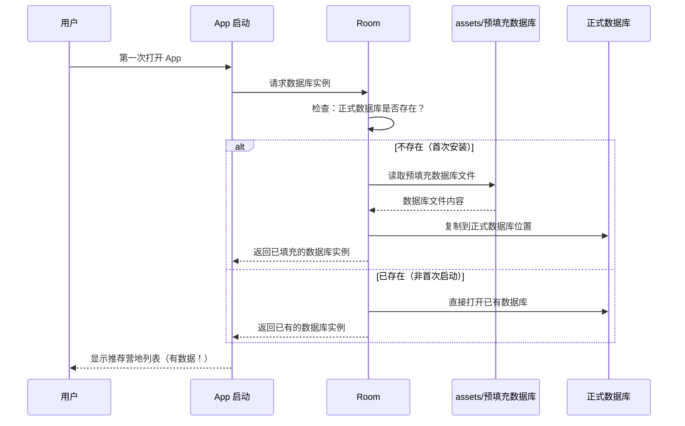
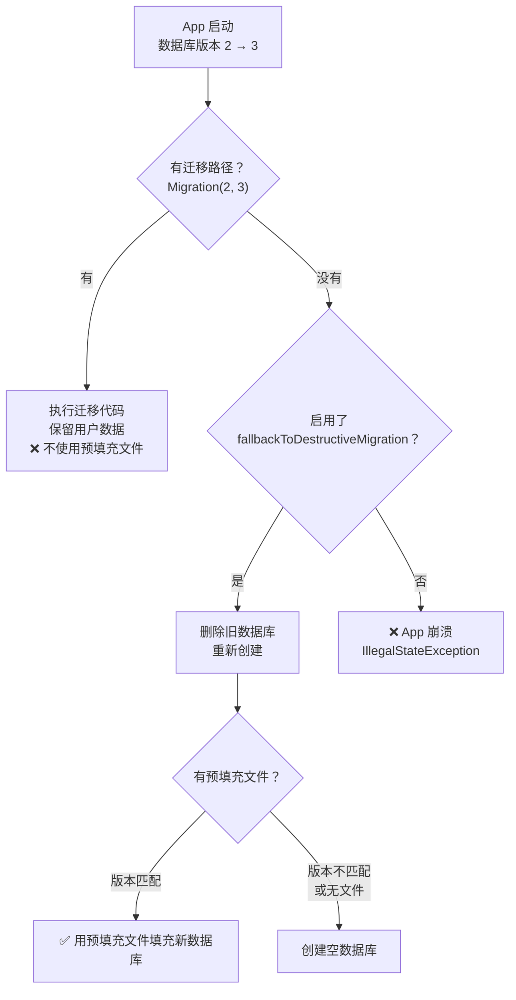
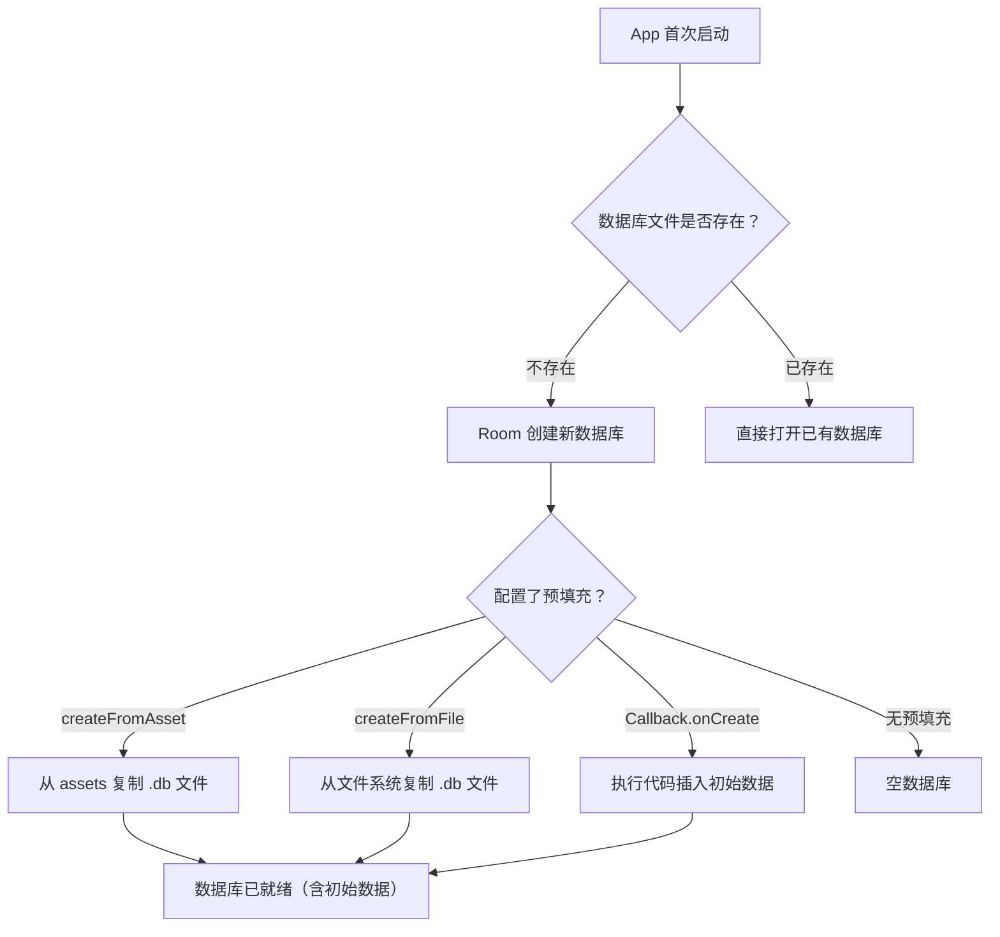

# 1.6.11 预填充 Room 数据库

## 1.6.11 预填充：让数据库一出生就有东西

傍晚的风从溪谷里吹上来，带着水汽和一点凉意。白桦林的叶子在夕阳里变成了半透明的金色，像一片片薄薄的琥珀。

洛芙正在帐篷外的折叠桌上调试一个新功能。她写了一个"推荐营地"页面——用户打开 App，就能看到一批精选的露营地点，每个地点附有名称、海拔、评分和一张缩略图的 URL。

问题是：这些数据是写死在代码里的。

"你在 Kotlin 代码里硬编码了二十条营地数据？"希尔端着一碗刚煮好的泡面从帐篷里钻出来，面汤的白雾和傍晚的山雾混在一起，热乎乎地飘散开。

"不这样的话，用户第一次打开 App，数据库是空的啊。"洛芙有些无奈地摊开手，"总不能让用户看到一个空白页面吧？"

"其实有一个更优雅的办法。"黛琳的声音从帐篷深处传来。她走出来的时候，肩上搭着一条薄毯子，手里拿着平板电脑。夕阳在她的镜片上映出两个小小的金色圆点。

"你可以把那些初始数据打包成一个**预填充数据库文件**（Pre-packaged Database），放在 App 的资源目录里。用户第一次打开 App 时，Room 自动把这个文件的内容复制到正式数据库里——数据库一出生就是满的。"

洛芙的眼睛一下子亮了，像帐篷顶上那颗刚升起来的星星。

"一出生就是满的？这也太方便了吧！"

"而且不用在代码里硬编码任何数据。"伊莎从帐篷里递出一杯热可可，杯壁上凝了一层细密的水珠，"数据在数据库文件里，代码只负责逻辑。干干净净。"

### 什么是预填充？

"先把概念理清楚。"黛琳在折叠桌上放下平板，打开了一张流程图。

"**预填充**（Prepopulate）的意思是：在 App 安装之后、用户第一次使用之前，数据库就已经包含了一批初始数据。"

"你可以把它想成——"伊莎的声音柔柔的，带着傍晚特有的那种温暖，"你搬进新家的时候，冰箱里已经放好了牛奶、鸡蛋和新鲜的草莓。你不需要自己先跑一趟超市。"



> 图 1：预填充的工作流程。首次启动时，Room 从 assets 目录读取预填充数据库文件并复制到正式数据库位置。后续启动直接使用已有数据库，不再重复预填充。

"关键点——Room 只在**数据库不存在**的时候预填充。"黛琳用手指点着时序图的分支节点，"一旦用户开始使用 App 并产生了自己的数据，预填充文件就不再被使用了。所以用户自己的数据永远是安全的。"

### 准备预填充数据库文件

"那我怎么创建那个预填充的数据库文件呢？"洛芙拿出笔记本。

"最简单的方式——用一个小工具创建一个 SQLite 数据库文件（比如 DB Browser for SQLite），往里面插入你想要的初始数据，然后把这个文件放到 Android 项目的 `assets` 目录里。"希尔吸了一口面条，发出"呲溜"一声。

"有三个要求——"黛琳竖起三根手指。

"第一，**数据库的表结构必须和你的 Room Entity 完全一致**。列名、类型、主键、外键——一个都不能差。因为 Room 在打开数据库时会验证 schema。"

"第二，**数据库文件的版本号必须和 `@Database(version = ...)` 一致**。Room 内部有一个叫 `room_master_table` 的系统表来记录版本信息。"

"第三，文件放在 `assets` 目录里，路径就是你传给 `createFromAsset()` 的参数。"

"等等——最简单的做法其实是这样——"希尔把筷子放下，擦了擦手，"你先正常跑一遍 App，让 Room 自动创建空数据库。然后用 Android Studio 的 **Database Inspector** 往里面插入初始数据，最后把那个 `.db` 文件导出来放到 `assets` 目录里。这样表结构和版本号自动就是对的。"

"哇，这个方法聪明。"洛芙在笔记本上画了一个五角星。

### createFromAsset：从 assets 目录预填充

"文件准备好了，代码怎么写？"洛芙迫不及待。

"一行代码。"黛琳的声音平静得像在说天气。

```kotlin
// 代码片段 A：从 assets 目录预填充数据库
// 前提：在 app/src/main/assets/database/ 目录下放置预填充数据库文件 camp_data.db

// createFromAsset() 接受一个相对于 assets 目录的路径
// Room 会在首次创建数据库时，将该文件复制到 App 的私有数据库目录
// 复制完成后，后续的 INSERT/UPDATE/DELETE 都作用于这份副本，不影响原始 assets 文件
Room.databaseBuilder(
    context.applicationContext,
    CampDatabase::class.java,
    "camp_database"
)
    .createFromAsset("database/camp_data.db")  // 预填充！
    .build()
```

"就这样？"洛芙的笔停在半空。

"就这样。"希尔笑了一下，面条差点从筷子上滑落。

"Room 在背后做了什么呢？"黛琳的教学本能让她没有就此打住，"第一次调用 `build()` 时，Room 发现正式数据库不存在。它就去 `assets/database/camp_data.db` 读取预填充文件，**复制**一份到 App 的私有数据库目录（通常是 `/data/data/包名/databases/camp_database`）。注意是**复制**，不是移动——原始的 assets 文件不会被修改。"

"复制完之后，用户的所有操作（插入、修改、删除）都作用在这份副本上。"伊莎补充道，拿起洛芙的可可杯帮她暖着手，"原始文件像一颗种子，副本是从种子长出来的树。树可以长新的枝叶，但种子永远不变。"

洛芙在笔记本上写下：**createFromAsset = assets 目录 → 复制 → 正式数据库（只在首次）**。

### createFromFile：从文件系统预填充

"如果预填充文件不在 assets 目录呢？比如——用户从服务器下载了一个数据库文件？"洛芙想到了一个场景。

"那就用 `createFromFile()`。"希尔抢答了。

```kotlin
// 代码片段 B：从文件系统预填充数据库
// 适用于：预填充文件不在 assets 中，而是在设备的文件系统上
// 比如用户下载了一个数据库文件到外部存储

// createFromFile() 接受一个 File 对象
// Room 同样会复制该文件（不是直接打开），所以需要读权限
val preloadedDbFile = File(context.filesDir, "downloaded/camp_data.db")

Room.databaseBuilder(
    context.applicationContext,
    CampDatabase::class.java,
    "camp_database"
)
    .createFromFile(preloadedDbFile)  // 从文件系统预填充
    .build()
```

"区别只有一个——"黛琳对比着两种方式，"createFromAsset 接受**字符串路径**（相对于 assets 目录），createFromFile 接受一个 **File 对象**（设备文件系统上的绝对路径）。其余逻辑完全相同：第一次创建数据库时复制文件，之后不再使用。"

| 方式 | 数据源 | 参数类型 | 适用场景 |
|------|-------|---------|---------|
| `createFromAsset()` | assets 目录 | String（相对路径） | 静态数据，和 App 一起发布 |
| `createFromFile()` | 设备文件系统 | File（绝对路径） | 动态数据，如从服务器下载 |

"大多数情况下，用 `createFromAsset()` 就够了。"希尔说，"初始数据直接打包在 APK 里，不需要网络，不需要权限，简单粗暴。"

### RoomDatabase.Callback：另一种预填充方式

"其实还有第三种方式——用代码预填充。"黛琳把毯子从肩上取下来叠好。天色暗了一点，帐篷里的营地灯自动亮了，暖黄色的光从帘缝里渗出来。

"如果你的初始数据不多——比如只有五六条——你可能不想为此专门维护一个数据库文件。这时候可以用 `RoomDatabase.Callback`。"

```kotlin
// 代码片段 C：用 RoomDatabase.Callback 在代码中预填充
// 适用于：初始数据量小，不值得维护一个单独的数据库文件

class CampDatabaseCallback(
    private val scope: CoroutineScope
) : RoomDatabase.Callback() {

    // onCreate 在数据库第一次被创建时调用（只调用一次）
    // 这是执行预填充逻辑的最佳时机
    override fun onCreate(db: SupportSQLiteDatabase) {
        super.onCreate(db)
        scope.launch {
            // 获取 DAO 实例并插入初始数据
            val dao = CampDatabase.getInstance(/* context */).campSpotDao()
            dao.insertSpots(
                listOf(
                    CampSpotEntity(name = "星空湖畔", cityId = 1, altitude = 1200),
                    CampSpotEntity(name = "白桦营地", cityId = 2, altitude = 800),
                    CampSpotEntity(name = "云杉谷", cityId = 3, altitude = 1500),
                )
            )
        }
    }
}

// 注册 Callback
Room.databaseBuilder(
    context.applicationContext,
    CampDatabase::class.java,
    "camp_database"
)
    .addCallback(CampDatabaseCallback(applicationScope))
    .build()
```

"三种方式各有优劣——"黛琳在白板上画了一张对比表。

| 方式 | 数据量 | 维护成本 | 灵活性 |
|------|-------|---------|-------|
| `createFromAsset()` | 大量 | 需要维护 .db 文件 | 低（数据随 APK 发布） |
| `createFromFile()` | 大量 | 需要文件来源 | 高（可从服务器下载） |
| `Callback.onCreate()` | 少量 | 纯代码，无文件 | 中（代码硬编码） |

"数据量大就用数据库文件，数据量小就用 Callback。"希尔把结论说得很干脆。

### 反模式：错误的预填充方式

"我来展示一种你**绝对不应该**用的方式。"希尔露出了那种"我要给你看恐怖片"的表情。

```kotlin
// 代码片段 D-1：反模式——在 Activity 里硬编码初始数据

// ❌ 错误：每次启动都检查数据库是否为空，为空就插入
// 问题1：逻辑复杂——需要自己判断"是不是第一次启动"
// 问题2：竞态条件——如果 Activity 被快速销毁重建，可能插入两次
// 问题3：违反职责分离——Activity 不应该负责数据初始化

class MainActivity : AppCompatActivity() {
    override fun onCreate(savedInstanceState: Bundle?) {
        super.onCreate(savedInstanceState)

        lifecycleScope.launch {
            val count = dao.countSpots()
            if (count == 0) {
                // 手动判断 + 手动插入 = 脆弱
                dao.insertSpots(hardcodedSpots)
            }
        }
    }
}
```

```kotlin
// 代码片段 D-2：正确做法——用 createFromAsset 或 Callback

// ✅ 正确：Room 自动管理首次创建逻辑
// Room 内部保证：只在数据库第一次被创建时预填充
// 不需要你手动检查 count == 0

Room.databaseBuilder(context, CampDatabase::class.java, "camp_database")
    .createFromAsset("database/camp_data.db")
    .build()

// 或者

Room.databaseBuilder(context, CampDatabase::class.java, "camp_database")
    .addCallback(CampDatabaseCallback(scope))
    .build()
```

"左边的代码自己判断'第一次启动'，但判断逻辑是脆弱的。"黛琳的语气平静但坚决，"如果用户清了缓存但没清数据库呢？如果 Activity 在插入过程中被杀了呢？这些边界情况你都得自己处理。而 `createFromAsset()` 和 `Callback.onCreate()` 由 Room 框架保证——它在数据库**创建**的那个瞬间执行，只执行一次，不会重复。"

### 预填充与数据库迁移

"还有一个高级场景。"黛琳的声音微微低了一点，像是在提醒一个容易被忽略的坑。

"如果你的 App 已经发布了，用户手机上有一个旧版数据库（比如版本 2），而你在新版 App 中把数据库升级到了版本 3——这时候预填充文件和迁移会怎么交互？"

"这取决于你有没有提供迁移路径。"希尔接过话。



> 图 2：预填充与迁移的交互逻辑。有迁移路径时，Room 执行迁移代码而不使用预填充文件（因为用户数据更重要）。只有在破坏性回退迁移（destructive fallback）时，如果预填充文件的版本匹配目标版本，Room 才会用它填充新创建的数据库。

"核心要点——"黛琳的手指在图上移动。

"**如果有明确的迁移路径（Migration），Room 优先执行迁移代码，不会使用预填充文件。**因为迁移的目的是保留用户已有的数据，而预填充文件只包含初始数据——用它覆盖用户数据就是灾难。"

"**只有在破坏性回退（fallback destructive migration）时**——也就是没有迁移路径、旧数据库被删除重建——Room 才会尝试用预填充文件填充新数据库。前提是预填充文件的版本号和目标版本一致。"

```kotlin
// 代码片段 E：预填充 + 迁移的组合使用

// 场景：数据库从版本 2 升到版本 3
// 有明确的迁移路径 → Room 执行迁移代码，不使用预填充文件
// 预填充文件仅供全新安装的用户使用

val MIGRATION_2_3 = object : Migration(2, 3) {
    override fun migrate(db: SupportSQLiteDatabase) {
        // 添加新列
        db.execSQL("ALTER TABLE camp_spot ADD COLUMN rating REAL DEFAULT 0.0")
    }
}

Room.databaseBuilder(
    context.applicationContext,
    CampDatabase::class.java,
    "camp_database"
)
    .createFromAsset("database/camp_data_v3.db") // 版本 3 的预填充文件
    .addMigrations(MIGRATION_2_3)                 // 版本 2→3 的迁移
    .build()

// 全新安装的用户：使用 camp_data_v3.db 预填充
// 从版本 2 升级的老用户：执行 MIGRATION_2_3，保留数据
```

"这段代码同时配置了预填充和迁移。"黛琳说，"Room 会根据用户的实际情况选择正确的路径：新用户走预填充，老用户走迁移。两条路都覆盖了。"

洛芙用力点了点头，在笔记本上画了两条并行的箭头——一条标"新用户 → 预填充"，一条标"老用户 → 迁移"。

### 完整示例：露营推荐 App 的预填充

"让我把今天学的整合到一个完整的例子里。"希尔新建了一个文件。

```kotlin
// 代码片段 F：完整的预填充数据库配置
// 依赖：implementation("androidx.room:room-runtime:2.6.1")
//       ksp("androidx.room:room-compiler:2.6.1")
//       implementation("androidx.room:room-ktx:2.6.1")

// 1. Entity 定义
@Entity(tableName = "recommended_spot")
data class RecommendedSpotEntity(
    @PrimaryKey(autoGenerate = true) val id: Long = 0,
    val name: String,                   // 营地名称
    val city: String,                   // 所在城市
    val altitude: Int,                  // 海拔（米）
    val rating: Double,                 // 评分（1.0-5.0）
    val thumbnailUrl: String            // 缩略图 URL
)

// 2. DAO
@Dao
interface RecommendedSpotDao {
    @Query("SELECT * FROM recommended_spot ORDER BY rating DESC")
    fun observeAll(): Flow<List<RecommendedSpotEntity>>

    @Query("SELECT * FROM recommended_spot WHERE city = :city")
    suspend fun findByCity(city: String): List<RecommendedSpotEntity>

    @Insert
    suspend fun insertAll(spots: List<RecommendedSpotEntity>)
}

// 3. Database（配含预填充）
@Database(
    entities = [RecommendedSpotEntity::class],
    version = 1
)
abstract class CampDatabase : RoomDatabase() {
    abstract fun recommendedSpotDao(): RecommendedSpotDao

    companion object {
        @Volatile private var INSTANCE: CampDatabase? = null

        fun getInstance(context: Context): CampDatabase {
            return INSTANCE ?: synchronized(this) {
                INSTANCE ?: Room.databaseBuilder(
                    context.applicationContext,
                    CampDatabase::class.java,
                    "camp_database"
                )
                    // 从 assets/database/recommended.db 预填充
                    .createFromAsset("database/recommended.db")
                    .build()
                    .also { INSTANCE = it }
            }
        }
    }
}
```

希尔按下运行按钮，Logcat 里打出了结果：

```
D/Prepop: 首次启动，数据库预填充完成
D/Prepop: 推荐营地列表：
  RecommendedSpot(id=1, name="星空湖畔", city="月溪镇", altitude=1200, rating=4.8)
  RecommendedSpot(id=2, name="白桦营地", city="云杉市", altitude=800, rating=4.5)
  RecommendedSpot(id=3, name="云杉谷", city="松风县", altitude=1500, rating=4.9)
  RecommendedSpot(id=4, name="萤火虫沼泽", city="月溪镇", altitude=600, rating=4.2)
D/Prepop: 共 4 条推荐营地（来自预填充数据库）
```

"用户第一次打开 App，看到的就是这四条推荐营地。"希尔竖起大拇指，"不用等网络请求，不用看空白页面。打开就有数据，体验丝滑。"

"如果用户自己添加了一条营地呢？"洛芙问。

"那它就和预填充的数据混在一起了——都在同一张表里。用户完全感觉不到哪些是预填充的、哪些是自己加的。"

"而且如果用户卸载重装 App——"黛琳说。

"预填充会重新执行。"洛芙接上了话，"因为卸载会删除数据库，下次安装就是全新的了。"

"完全正确。"黛琳眼角的弧线几乎可以称作微笑。

---

天完全暗了。帐篷顶上的星星一颗一颗地亮起来，像有人在深蓝色的幕布上洒了一把碎钻。营地灯发出温暖的黄光，把四个女孩的影子拉得长长的。

洛芙把笔记本合上，抱在胸前。溪水在暗处流淌，声音比白天更清晰了——也许是因为其他所有的声音都安静了下来。

"之前我总觉得——数据库是空的，是用户来以后才开始'生长'的。"她的声音很轻，像在自言自语，"今天才知道，你可以在 App 出生的那一刻就给它准备好一切。"

伊莎把一块毯子披在洛芙肩上，手指轻轻拍了拍她的肩膀。

"有些准备，是为了让第一眼就美好。"

松林深处传来一声夜鸟的叫声，细长、清亮，然后又归于寂静。

---

### 技术总结

> **预填充数据库（Prepopulate Database）** —— 在 App 首次创建 Room 数据库时，用预先准备好的数据库文件或代码逻辑为数据库填入初始数据。Room 提供 `createFromAsset()`（从 assets 目录）和 `createFromFile()`（从文件系统）两个 API，以及 `RoomDatabase.Callback.onCreate()` 回调。预填充只在数据库首次创建时执行一次。

#### 今日关键词

1. **预填充（Prepopulate）**：在数据库首次创建时，自动填入一批初始数据。用户第一次打开 App 就能看到内容，而不是空白页面。
2. **createFromAsset()**：Room 提供的 API，从 App 的 `assets` 目录读取一个预先准备的 `.db` 文件，复制到正式数据库位置。只在数据库首次创建时执行。
3. **createFromFile()**：Room 提供的 API，从设备文件系统的任意位置读取预填充数据库文件。适用于从服务器下载数据库文件的场景。
4. **RoomDatabase.Callback**：Room 的回调接口。`onCreate()` 在数据库首次创建时调用，可用于少量数据的代码预填充。
5. **Schema 一致性**：预填充数据库文件的表结构（列名、类型、约束）必须和 Room Entity 完全一致。版本号也必须匹配。
6. **预填充与迁移的交互**：有迁移路径时 Room 执行迁移代码（保留用户数据），不使用预填充文件。只有在破坏性回退迁移时才可能使用预填充文件重新填充。

#### 结构图



> 结构图展示了 Room 在 App 启动时的决策链：先检查数据库是否存在，不存在则根据预填充配置选择数据来源。

#### 复杂度与影响

- **首次启动时间**：预填充涉及文件复制操作。如果预填充数据库文件很大（> 10MB），首次启动时间会明显增加。建议预填充文件控制在合理大小内。
- **APK 体积**：`createFromAsset()` 的数据库文件会增加 APK 体积。如果初始数据量很大，考虑使用 `createFromFile()` 从服务器按需下载。
- **维护成本**：每次数据库 schema 变更，预填充文件也需要同步更新。否则 schema 不匹配会导致崩溃。

#### 反模式与陷阱

1. **在 Activity 中手动判断"是否首次启动"并插入数据**：逻辑脆弱，可能重复插入、竞态条件、职责不清。
   * **修复**：使用 `createFromAsset()` 或 `Callback.onCreate()`，让 Room 框架管理首次创建逻辑。

2. **预填充文件的 schema 与 Entity 不一致**：列名、类型或约束不匹配导致 Room 验证失败，App 崩溃。
   * **修复**：用 Room 的 schema export 功能导出 JSON schema，对照验证预填充文件。或者用"先跑 App 创建空数据库 → 导入数据 → 导出 .db 文件"的方式确保一致。

3. **预填充文件版本号与 @Database(version) 不一致**：Room 检查内部的 `room_master_table` 版本号，不一致时会报错或触发意外的迁移。
   * **修复**：确保预填充文件和 @Database 的版本号完全一致。

4. **预填充文件过大导致首次启动缓慢**：大文件（> 50MB）在首次启动时的文件复制操作会阻塞较长时间，影响用户体验。
   * **修复**：精简初始数据量，或在启动时显示加载进度。极大的数据集考虑使用 `createFromFile()` + 后台下载。

5. **在 Callback.onCreate() 里做同步操作**：`onCreate()` 在数据库创建线程上调用，做耗时操作会阻塞。
   * **修复**：在 `onCreate()` 中启动协程执行异步插入操作。

#### 设计哲学：首次体验即最佳体验

1. **第一印象原则**：用户第一次打开 App 时的体验决定了他们是否会继续使用。预填充确保用户看到的是有内容的页面，而不是空白。
2. **数据与代码分离**：初始数据放在数据库文件里，代码只负责逻辑。修改初始数据不需要改代码，改代码不影响初始数据。
3. **框架管理 > 手动管理**：首次创建、文件复制、版本检查——这些边界逻辑交给 Room 框架处理，而不是自己写 `if-else`。框架比手写代码更可靠。
4. **向前兼容**：同时配置 `createFromAsset()` 和 `Migration`，让新用户走预填充、老用户走迁移。两条路都覆盖，不留盲区。
5. **最小惊讶原则**：预填充只在数据库首次创建时执行，不会覆盖用户已有数据。用户的数据永远是安全的。

---

#### 🏕️ 动手练习

#### Task 1 · 创建预填充数据库 (My First Prepopulation) ★

**目标**：使用 DB Browser for SQLite 创建一个预填充数据库文件并在 App 中加载。

**你需要做的事**：
1. 下载并安装 DB Browser for SQLite。
2. 创建一个数据库，建一张 `recommended_spot` 表，插入 3 条数据。
3. 将 `.db` 文件放到 `app/src/main/assets/database/` 目录下。
4. 在 `Room.databaseBuilder` 中调用 `createFromAsset()`。
5. 运行 App，查看数据是否正确加载。

**验收标准**：
- [ ] App 首次启动时自动显示 3 条推荐营地
- [ ] 数据来自预填充文件，不是代码硬编码
- [ ] 第二次启动时不重复预填充

**提示**：
```kotlin
.createFromAsset("database/recommended.db")
```

---

#### Task 2 · Callback 预填充 (Code-Based Prepopulation) ★★

**目标**：使用 `RoomDatabase.Callback.onCreate()` 在代码中预填充少量数据。

**你需要做的事**：
1. 创建一个 `RoomDatabase.Callback` 子类。
2. 在 `onCreate()` 中启动协程，插入 3 条初始数据。
3. 用 `addCallback()` 注册。
4. 验证首次启动有数据，第二次启动不重复。

**验收标准**：
- [ ] 首次启动后数据库有 3 条记录
- [ ] 第二次启动记录数仍然是 3（不重复插入）
- [ ] Callback 中使用了协程（不阻塞）

---

#### Task 3 · 预填充 + 用户数据共存 (Mixed Data) ★★

**目标**：验证预填充数据和用户自行添加的数据能正常共存。

**你需要做的事**：
1. 预填充 3 条推荐营地。
2. 用户手动添加 2 条新营地。
3. 查询全部营地，确认共 5 条。
4. 卸载 App 重装，确认恢复为 3 条预填充数据。

**验收标准**：
- [ ] 预填充 + 用户数据混合查询正常
- [ ] 用户数据的 ID 不与预填充数据冲突
- [ ] 卸载重装后恢复为预填充初始状态

---

#### Task 4 · Schema 一致性验证 (Schema Validation) ★★★

**目标**：体验预填充文件 schema 不匹配时的错误。

**你需要做的事**：
1. 故意修改预填充文件的列名（让它和 Entity 不一致）。
2. 运行 App，观察崩溃日志。
3. 修复 schema，确认正常运行。

**验收标准**：
- [ ] Schema 不匹配时 Room 抛出异常
- [ ] 错误信息指出了哪个列不匹配
- [ ] 修复后 App 正常启动

---

#### Task 5 · createFromFile 动态预填充 (File System Prepopulation) ★★★

**目标**：从设备文件系统（非 assets）预填充数据库。

**你需要做的事**：
1. 将数据库文件放到 App 的 `filesDir` 目录（模拟从服务器下载）。
2. 使用 `createFromFile()` 预填充。
3. 验证数据正确加载。
4. 验证原始文件未被修改（Room 是复制而非移动）。

**验收标准**：
- [ ] 数据库从文件系统正确加载
- [ ] 原始文件仍然存在且内容不变
- [ ] 第二次启动不重复复制

**提示**：
```kotlin
val file = File(context.filesDir, "camp_data.db")
.createFromFile(file)
```

---

#### Task 6 · 预填充 + 迁移共存 (Prepopulation with Migration) ★★★★

**目标**：同时配置预填充和迁移，验证新用户走预填充、老用户走迁移。

**你需要做的事**：
1. 版本 1：创建 App，有预填充（V1 文件）。
2. 版本 2：添加新列，提供迁移和新的预填充文件（V2 文件）。
3. 测试场景 A：全新安装 → 应使用 V2 预填充文件。
4. 测试场景 B：从 V1 升级 → 应执行迁移，保留用户数据。

**验收标准**：
- [ ] 全新安装使用 V2 预填充文件
- [ ] 从 V1 升级执行迁移，用户数据不丢失
- [ ] 新列在两种场景下都正确存在

---

#### Task 7 · 大数据量预填充性能测试 (Large Prepopulation) ★★★★

**目标**：测试大数据量预填充文件对首次启动时间的影响。

**你需要做的事**：
1. 创建包含 10000 条记录的预填充数据库文件。
2. 测量首次启动时间（数据库初始化耗时）。
3. 创建包含 100 条记录的预填充文件，对比。
4. 分析：多大的文件会让用户感觉到明显延迟？

**验收标准**：
- [ ] 记录两种数据量的启动时间
- [ ] 分析首次启动瓶颈是在文件复制还是数据库打开
- [ ] 给出合理的预填充数据量建议

---

#### Task 8 · 多表预填充 (Multi-Table Prepopulation) ★★★★★

**目标**：预填充包含多张表（含外键关系）的数据库。

**你需要做的事**：
1. 设计 3 张表：城市、营地（外键 → 城市）、天气记录（外键 → 营地）。
2. 创建预填充文件，正确维护外键关系。
3. 插入数据时注意插入顺序（先城市，再营地，最后天气）。
4. 验证外键约束在预填充数据中生效。

**验收标准**：
- [ ] 3 张表都有预填充数据
- [ ] 外键关系正确（营地引用的城市 ID 存在）
- [ ] 查询关联数据返回正确结果

---

#### 面试热身

> 请尝试用自己的语言回答以下问题，能说清楚才是真的懂了。

1. **Q1**：`createFromAsset()` 和 `createFromFile()` 有什么区别？分别适用于什么场景？
2. **Q2**：预填充数据库文件的 schema 必须满足什么条件？如果不满足会怎样？
3. **Q3**：如果用户已经使用了 App（数据库已存在），此时升级 App 版本并更新了预填充文件。用户的数据会被预填充文件覆盖吗？为什么？
4. **Q4**：`RoomDatabase.Callback.onCreate()` 和 `createFromAsset()` 各适合什么场景？
5. **Q5**：预填充是在主线程还是后台线程执行的？如果预填充文件很大，会影响用户体验吗？

#### 参考实现要点

1. **确保 schema 一致性**：用 Room 的 `exportSchema = true` 导出 JSON schema，和预填充文件对照验证。或用"先运行 App 生成空数据库 → 插数据 → 导出"的方式。
2. **控制预填充文件大小**：预填充文件会增加 APK 体积。超过 10MB 考虑使用 `createFromFile()` + 后台下载。
3. **预填充 + 迁移双保险**：同时配置 `createFromAsset()` 和 `addMigrations()`，覆盖新老用户两种场景。
4. **Callback 中使用协程**：`onCreate()` 回调在数据库创建线程上执行。如果要插入数据，启动协程到 `Dispatchers.IO`。
5. **预填充文件版本管理**：每次升级数据库版本时，同步更新预填充文件。旧版本的预填充文件可以删除（已安装的用户不会再用到）。

---

> 💡 预填充是"以用户为中心"的设计理念在数据库层的体现——让用户第一次打开 App 就看到有意义的内容。技术上它很简单（一行 `createFromAsset()`），但它传递的产品哲学很深刻：**最好的体验，是从第一秒开始的。**

---

### 🍭 洛芙的小小日记本

伊莎说得对——有些准备是为了让第一眼就美好。一个 createFromAsset 就能让空空的数据库变得充实。下次写 App 的时候，我一定要让用户打开的第一瞬间就感受到温暖。
