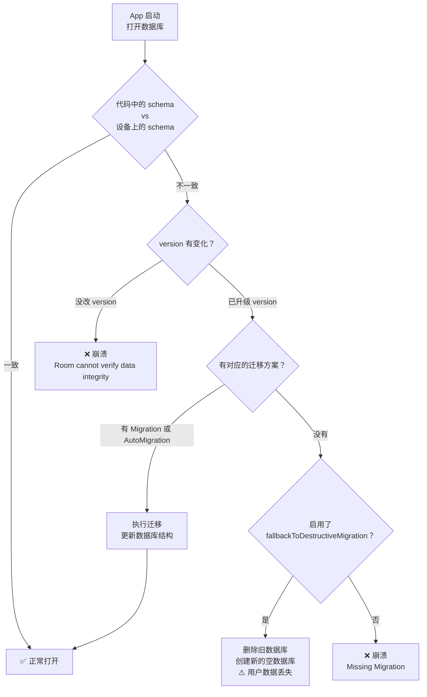
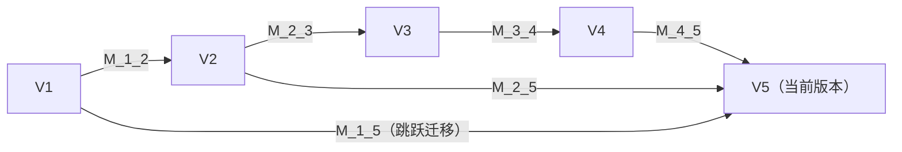
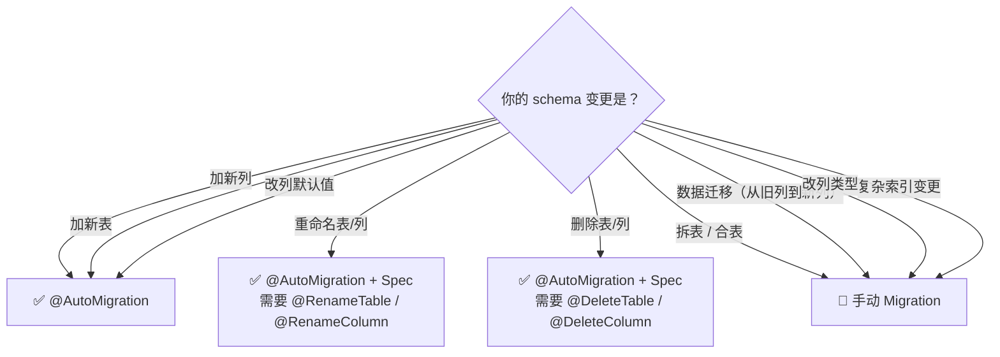
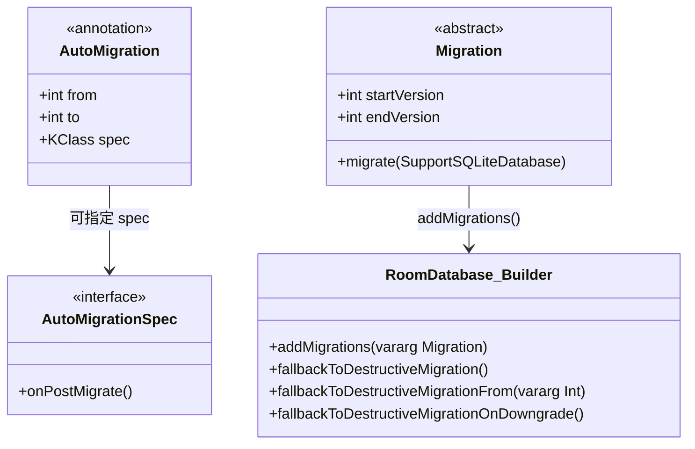

# 1.6.12 迁移 Room 数据库

## 1.6.12 数据库迁移：给行驶中的列车换轮子

清晨的溪水比往常更凉了一些，水面上飘着乳白色的雾气，像给营地系了一条丝巾。四个女孩坐在帐篷外面，折叠桌上放着几杯热气腾腾的可可。

“我不也没干什么坏事吗？”

洛芙盯着那一串红色的报错，声音里满是无辜。早晨的阳光透过树叶洒在她鼻尖上，但她现在的脸色比没睡醒还要苍白。

“我就是觉得 `CampSpot` 应该有个评分，所以……加了一行 `val rating: Double`。”她委屈地摊开手，“然后重新运行 App，它就彻底打不开了。连闪退都算好的，它是直接拒绝启动。”

希尔凑过来看了一眼控制台的红色字体，吹了一声口哨。

“恭喜你，引发了 **Schema Mismatch**（结构不匹配）。”

“听起来像是我把房子的承重墙拆了。”

“差不多。”黛琳正蹲在溪边的鹅卵石滩上，并没有急着看电脑。她手里拿着几块扁平的石头，正在小心翼翼地叠一座石塔。

“你看，”黛琳指着那座摇摇欲坠的石塔，“最下面的这块大石头是版本 1 的数据库结构（Schema）。上面的这块小石子是你刚才加的 `rating` 字段。”

她轻轻把那块小石子往石塔底部一塞——

*哗啦！*

整座石塔瞬间崩塌，散落一地。

“这就是 Room 的反应。”黛琳拍了拍手上的石粉，站起来，“当你改变了底层的结构——哪怕只是加了一块小石头——如果没有告诉 Room 怎么把旧结构‘平滑过渡’到新结构，它就会认为整个地基不再安全。为了保护数据不被压坏，它选择**自我毁灭**（Crash）。”

“这就是我们要讲的——**数据库迁移 (Migration)**。”希尔把一块完好的饼干递给洛芙，“给行驶中的列车换轮子，或者……给一座塔换地基。”

### 为什么需要迁移？

"先搞清楚一个问题——为什么改了 Entity 就会崩溃？"洛芙歪着头。

"因为 Room 在每次打开数据库时都会做一次**校验**。"黛琳在白板上画了一条时间线。

"它会比较两样东西：一是你在代码里定义的 Entity 类（期望的 schema），二是手机上实际存在的数据库文件（实际的 schema）。如果两边不一致，而且你没有提供迁移方案——Room 就会直接抛异常，App 崩溃。"



> 图 1：Room 在 App 启动时的 schema 校验流程。修改 Entity 后必须升级数据库版本并提供迁移方案，否则 App 会崩溃。

"所以每次我改了 Entity——加字段、删字段、改类型、加新表——都必须做迁移？"

"是的。"黛琳点头，"两步走：第一，把 `@Database(version = ...)` 的版本号加一；第二，提供从旧版本到新版本的迁移方案。"

### 自动迁移：@AutoMigration

"好消息是——大多数简单的变更，Room 可以自动帮你完成迁移。"希尔把饼干吃完，拍了拍手上的碎屑。

"从 Room 2.4.0 开始，你可以用 `@AutoMigration` 注解声明自动迁移。Room 会比较新旧版本的 schema，自动生成迁移代码。"

```kotlin
// 代码片段 A：使用 @AutoMigration 声明自动迁移
// 场景：版本 1 → 版本 2，新增了一个 rating 列

// 版本 1 的 Entity
@Entity(tableName = "camp_spot")
data class CampSpotEntity(
    @PrimaryKey(autoGenerate = true) val id: Long = 0,
    val name: String,
    val cityId: Long
)

// 版本 2 的 Entity（新增 rating 字段）
@Entity(tableName = "camp_spot")
data class CampSpotEntity(
    @PrimaryKey(autoGenerate = true) val id: Long = 0,
    val name: String,
    val cityId: Long,
    val rating: Double = 0.0  // 新增字段，有默认值
)

// 在 @Database 中声明自动迁移
@Database(
    version = 2,
    entities = [CampSpotEntity::class],
    autoMigrations = [
        AutoMigration(from = 1, to = 2)  // 从版本 1 自动迁移到版本 2
    ],
    exportSchema = true  // 必须导出 schema，AutoMigration 需要
)
abstract class CampDatabase : RoomDatabase() {
    abstract fun campSpotDao(): CampSpotDao
}
```

“就这么简单？”

“对于简单的加列、建表，真的就这么简单。”

希尔把笔记本转向洛芙，指着项目目录里新冒出来的一个文件夹 `schemas`。

“看这个。”

洛芙凑过去，看到里面躺着两个文件：`1.json` 和 `2.json`。希尔双击把它们并排打开，指着那一处高亮的差异。

“左边是你之前的数据库样子，右边是现在的。Room 就像在玩‘找茬游戏’——它一眼就看见右边多了一个 `rating` 字段。然后它在后台悄悄生成了一行 SQL：”

```sql
ALTER TABLE camp_spot ADD COLUMN rating REAL NOT NULL DEFAULT 0.0
```

“这就是 `@AutoMigration` 干的事。”希尔合上文件，“它帮你写了这行 SQL。但前提是——你得给它这两张‘照片’（JSON 文件）。”

“这就是为什么我们要开 `exportSchema = true`。”黛琳补充道，她把刚才那块掉落的小石子重新捡起来，放在一边，“没有旧照片，Room 怎么知道新房子哪里变了？”

### AutoMigrationSpec：处理歧义变更

"不过，有些变更 Room 无法自动推断。"黛琳的声音变得稍微严肃了一些。

"比如——你把一个表从 `User` 改名为 `AppUser`。Room 看到旧 schema 有 `User`，新 schema 有 `AppUser`，它搞不清这是**改名**还是**删掉 User 又新建了 AppUser**。这时候它需要你手动告诉它。"

```kotlin
// 代码片段 B：用 AutoMigrationSpec 处理表改名
// 场景：版本 2 → 版本 3，把 camp_spot 表改名为 campsite

@Database(
    version = 3,
    entities = [CampsiteEntity::class],
    autoMigrations = [
        AutoMigration(from = 1, to = 2),
        AutoMigration(
            from = 2,
            to = 3,
            spec = CampDatabase.RenameTableMigration::class  // 指定迁移规范
        )
    ]
)
abstract class CampDatabase : RoomDatabase() {
    // AutoMigrationSpec：告诉 Room 这是一次表改名
    @RenameTable(fromTableName = "camp_spot", toTableName = "campsite")
    class RenameTableMigration : AutoMigrationSpec

    abstract fun campSpotDao(): CampSpotDao
}
```

"Room 提供了四种迁移提示注解——"黛琳在白板上列了一个表。

| 注解 | 用途 | 示例 |
|------|------|------|
| `@RenameTable` | 表改名 | camp_spot → campsite |
| `@DeleteTable` | 删除表 | 删除 temp_cache 表 |
| `@RenameColumn` | 列改名 | name → spotName |
| `@DeleteColumn` | 删除列 | 删除 deprecated_field 列 |

"只有这四种歧义情况需要 Spec。"希尔说，"加列、加表这种没有歧义的变更，Room 直接自动处理。"

### 手动迁移：Migration 类

"如果变更更复杂——比如把一张表拆成两张呢？"洛芙提出了一个有趣的问题。

"那就需要**手动迁移**了。"黛琳的声音依然平静，但加了一点力度，"你需要自己写一个 `Migration` 类，告诉 Room 从旧版本到新版本应该执行哪些 SQL。"

```kotlin
// 代码片段 C：手动迁移——从版本 3 到版本 4
// 场景：给 campsite 表添加 altitude 列，并新建一个 weather_record 表

val MIGRATION_3_4 = object : Migration(3, 4) {
    override fun migrate(db: SupportSQLiteDatabase) {
        // 步骤1：给现有表添加新列
        db.execSQL(
            "ALTER TABLE campsite ADD COLUMN altitude INTEGER NOT NULL DEFAULT 0"
        )

        // 步骤2：创建新表
        db.execSQL("""
            CREATE TABLE IF NOT EXISTS weather_record (
                id INTEGER PRIMARY KEY AUTOINCREMENT NOT NULL,
                campsite_id INTEGER NOT NULL,
                temperature REAL NOT NULL,
                recorded_at INTEGER NOT NULL,
                FOREIGN KEY (campsite_id) REFERENCES campsite(id)
                    ON DELETE CASCADE
            )
        """)

        // 步骤3：为新表的外键列创建索引
        db.execSQL(
            "CREATE INDEX IF NOT EXISTS index_weather_record_campsite_id ON weather_record(campsite_id)"
        )
    }
}

// 注册手动迁移
Room.databaseBuilder(
    context.applicationContext,
    CampDatabase::class.java,
    "camp_database"
)
    .addMigrations(MIGRATION_3_4)
    .build()
```

"注意——`migrate()` 方法里你要写**原生 SQL**。"黛琳强调道，"Room 的注解（@Entity、@ColumnInfo）在这里帮不了你。你必须自己确保 SQL 和新版本的 Entity 完全匹配。"

“这也是手动迁移最可怕的地方。”希尔的声音压低了一些，像是要讲一个鬼故事，“在这里，Room 的安全网消失了。你是在悬崖边走钢丝。”

“写错一个字母，漏掉一个 `NOT NULL`，或者忘了建索引……编译的时候 Room 不会报错。直到用户通过应用商店更新了你的 App，第一次打开的那一瞬间——”

希尔做了一个爆炸的手势。

“崩溃。而且因为是在特定的迁移路径上崩溃，你甚至很难在后面复现它。”

洛芙打了个寒颤：“所以我必须写测试。”

“绝对必须。”黛琳肯定地点头，“没有测试的手动迁移，就像蒙着眼睛拆炸弹。”

### 多版本迁移链

"App 发布了好几个版本之后，迁移链会不会很长？"洛芙问。

"会。"黛琳走到白板前，画了一条长长的线。



> 图 2：多版本迁移链。Room 会自动选择最短路径——如果有从 V1 直接到 V5 的迁移，就不需要逐步走 V1→V2→V3→V4→V5。如果没有，Room 会把多个迁移串联执行。

"假设当前版本是 V5。一个从 V1 时代就安装了你 App 的用户升级到最新版——Room 怎么处理？"

"Room 会自动沿着迁移链走。"黛琳画出路径，"先执行 M_1_2，然后 M_2_3，然后 M_3_4，最后 M_4_5。按顺序执行四次迁移。"

"但如果你提供了一个从 V1 直接到 V5 的迁移（跳跃迁移），Room 会优先使用它——因为它更短。"

```kotlin
// 代码片段 D：提供多条迁移路径

// 逐步迁移
val MIGRATION_1_2 = object : Migration(1, 2) { ... }
val MIGRATION_2_3 = object : Migration(2, 3) { ... }
val MIGRATION_3_4 = object : Migration(3, 4) { ... }
val MIGRATION_4_5 = object : Migration(4, 5) { ... }

// 跳跃迁移（可选，提升老用户的更新速度）
val MIGRATION_1_5 = object : Migration(1, 5) {
    override fun migrate(db: SupportSQLiteDatabase) {
        // 一次性从 V1 改到 V5
        // 这比串联四次迁移更高效、更可靠
    }
}

Room.databaseBuilder(context, CampDatabase::class.java, "camp_database")
    .addMigrations(
        MIGRATION_1_2, MIGRATION_2_3, MIGRATION_3_4, MIGRATION_4_5,
        MIGRATION_1_5  // 跳跃迁移
    )
    .build()
```

"不过跳跃迁移需要谨慎——"黛琳提醒道，"你需要确保跳跃迁移的结果和逐步迁移的结果完全一致。否则不同用户的数据库 schema 可能不一样，这是灾难性的。"

### 破坏性迁移：最后的退路

“如果……我是说如果，”洛芙把一块因为形状不规则而怎么也塞不进去的石头在手里转来转去，“如果这些石头实在太难换了，我又不想费劲去磨平它们，哪怕只是暂时想偷个懒……”

“你可以把塔推倒重来。”

黛琳的话音刚落，那一堆好不容易叠起来的石头又一次塌了——这次是彻底散架。

“**破坏性迁移 (Destructive Migration)**。”希尔接过话，“当 Room 找不到从旧版本走到新版本的路时，如果你允许它破坏，它就会简单粗暴地删掉整个旧数据库文件，然后根据最新的代码创建一个全新的空数据库。”

“就像原来的房子不要了，连地基一起铲平，直接盖个新毛坯房。”伊莎轻声说，语气里带着一丝惋惜，“房子是新的，好的。但里面住的人——也就是用户辛辛苦苦存的所有数据——全都没了。”

```kotlin
// 代码片段 E：破坏性迁移——最后的退路

// fallbackToDestructiveMigration: 找不到迁移路径时，删除旧数据库重建
// ⚠️ 所有用户数据会丢失！只在开发阶段或数据可恢复时使用
Room.databaseBuilder(context, CampDatabase::class.java, "camp_database")
    .fallbackToDestructiveMigration()   // 危险！
    .build()

// 更精细的控制：
// 只在从特定版本迁移时破坏性重建
Room.databaseBuilder(context, CampDatabase::class.java, "camp_database")
    .fallbackToDestructiveMigrationFrom(1, 2)  // 只有从 V1 或 V2 迁移时才破坏
    .build()

// 只在降级时破坏性重建（版本从高到低）
Room.databaseBuilder(context, CampDatabase::class.java, "camp_database")
    .fallbackToDestructiveMigrationOnDowngrade()  // 只有降级时才破坏
    .build()
```

"三种破坏性迁移策略——"黛琳总结。

| 方法 | 触发条件 | 数据丢失范围 |
|------|---------|------------|
| `fallbackToDestructiveMigration()` | 任何缺失的迁移路径 | 全部丢失 |
| `fallbackToDestructiveMigrationFrom(versions)` | 仅从指定版本迁移时 | 全部丢失 |
| `fallbackToDestructiveMigrationOnDowngrade()` | 仅降级场景 | 全部丢失 |

"我的建议——**永远不要在生产环境用 `fallbackToDestructiveMigration()`**。"黛琳的语气严肃了，"开发阶段可以用它图方便。但一旦 App 上线，用户的数据就是你的责任。用手动迁移或自动迁移来正确处理 schema 变更。"

### 自动迁移 vs 手动迁移：如何选择？

"那我什么时候用自动迁移，什么时候用手动迁移？"洛芙举起笔。



> 图 3：如何选择迁移方式。简单的增加操作用 @AutoMigration，有歧义的改名/删除用 AutoMigrationSpec，复杂的结构重组用手动 Migration。

### 导出 Schema

"说到测试迁移，首先你需要**导出 schema**。"希尔打开了 `build.gradle` 文件。

"Room 可以在编译期把每个版本的数据库结构导出为 JSON 文件。这些文件用于自动迁移的对比，也可以用于迁移测试。"

```kotlin
// 代码片段 F：在 build.gradle 中配置 schema 导出

// build.gradle.kts (Module: app)
ksp {
    arg("room.schemaLocation", "$projectDir/schemas")
}

// 或者如果用的是 kapt
kapt {
    arguments {
        arg("room.schemaLocation", "$projectDir/schemas")
    }
}

// 同时在 @Database 注解中确认 exportSchema = true
@Database(
    version = 5,
    entities = [CampsiteEntity::class, WeatherRecordEntity::class],
    exportSchema = true  // 默认就是 true，显式写出更清晰
)
abstract class CampDatabase : RoomDatabase() { ... }
```

"编译后，你会在 `app/schemas/` 目录下看到类似 `com.camp.database.CampDatabase/1.json`、`2.json`、`3.json` 这样的文件。每个文件记录了对应版本的完整 schema。"

"这些 JSON 文件一定要**纳入版本管控**（Git）！"黛琳加重了语气，"它们是迁移的'蓝图'。丢了就没法做自动迁移了。"

### 完整迁移示例：营地 App 从 V1 到 V3

"让我把今天学的都串起来。"希尔开了一个新文件。

```kotlin
// 代码片段 G：完整的多版本迁移配置

// V1: 只有 camp_spot 表
// V2: camp_spot 加 rating 列 → 自动迁移
// V3: camp_spot 改名为 campsite → 自动迁移 + Spec

@Database(
    version = 3,
    entities = [CampsiteEntity::class],
    autoMigrations = [
        AutoMigration(from = 1, to = 2),            // V1→V2：加列，自动处理
        AutoMigration(
            from = 2, to = 3,
            spec = CampDatabase.V2ToV3Spec::class    // V2→V3：改名，需要 Spec
        )
    ],
    exportSchema = true
)
abstract class CampDatabase : RoomDatabase() {
    @RenameTable(fromTableName = "camp_spot", toTableName = "campsite")
    class V2ToV3Spec : AutoMigrationSpec

    abstract fun campsiteDao(): CampsiteDao

    companion object {
        @Volatile private var INSTANCE: CampDatabase? = null

        fun getInstance(context: Context): CampDatabase {
            return INSTANCE ?: synchronized(this) {
                INSTANCE ?: Room.databaseBuilder(
                    context.applicationContext,
                    CampDatabase::class.java,
                    "camp_database"
                )
                    // 自动迁移在 @Database 注解中声明，无需 addMigrations
                    .build()
                    .also { INSTANCE = it }
            }
        }
    }
}
```

洛芙看着这段代码，手里的笔在笔记本上画了一条从 V1 到 V3 的折线。

"V1 到 V2 加了一个列——Room 自动处理。V2 到 V3 改了表名——需要 Spec 告诉 Room 这是改名不是删表新建。两步自动迁移，零行手动 SQL。"

"到这里一切看起来都很美好。"希尔说。

"但一旦遇到拆表、合表、数据迁移——"黛琳的声音像一阵冷风从树梢掠过——"你就必须写手动 Migration 了。自动迁移处理不了数据层面的转换。"

---

晨雾散了一大半，阳光从树冠的缝隙里漏下来，在地面上画出金色的光斑。洛芙把笔记本合上，看着那条从 V1 到 V3 的折线。

"我觉得迁移就像——"她想了想，"你建了一座城市，然后要在居民不搬走的情况下改建道路和楼房。"

"精确。"黛琳难得用了一个这么肯定的词，"你的代码可以随时重写，但用户的数据不行。迁移就是对用户数据的尊重。"

伊莎把一朵不知什么时候摘的小白花别在洛芙的笔记本上。

"每一次迁移，都是一次承诺——你的数据，我负责到底。"

---

### 技术总结

> **数据库迁移（Database Migration）** —— 在数据库结构（schema）发生变化时，安全地将用户设备上的旧版数据库升级到新版，同时保留用户已有的数据。Room 支持**自动迁移**（`@AutoMigration`）和**手动迁移**（`Migration` 类），以及作为最后退路的**破坏性迁移**（`fallbackToDestructiveMigration()`）。

#### 今日关键词

1. **数据库迁移（Migration）**：在 schema 变化时安全地升级用户设备上的数据库。核心目标：升级结构，保留数据。
2. **@AutoMigration**：Room 2.4.0+ 提供的自动迁移注解。Room 对比新旧版本的 schema 文件，自动生成迁移 SQL。适用于加列、加表等简单变更。
3. **AutoMigrationSpec**：处理歧义变更（表改名、列改名、删表、删列）时，通过注解（@RenameTable 等）告诉 Room 如何处理。
4. **Migration 类**：手动迁移。继承 `Migration(startVersion, endVersion)` 并实现 `migrate()` 方法，手写原生 SQL 完成迁移。
5. **fallbackToDestructiveMigration()**：破坏性迁移。在的缺失迁移路径时删除旧数据库重建。用户数据会全部丢失。
6. **exportSchema**：将数据库的每个版本的 schema 导出为 JSON 文件。是 @AutoMigration 的前提，也是迁移测试的基础。

#### 结构图



> Room 迁移的核心类关系。@AutoMigration 注解在 @Database 中声明，Manual Migration 通过 addMigrations() 注册到 Builder。

#### 反模式与陷阱

1. **改了 Entity 但不升 version**：Room 发现 schema 不一致但 version 没变，直接崩溃。
   * **修复**：每次修改 Entity 后，`version + 1`。

2. **手动迁移的 SQL 与 Entity 不匹配**：列名、类型、NOT NULL 约束不一致导致 Room 校验失败。
   * **修复**：参照 Room 导出的 schema JSON 文件编写迁移 SQL，确保每个细节一致。

3. **在生产环境使用 `fallbackToDestructiveMigration()`**：用户数据全部丢失。
   * **修复**：只在开发阶段使用。生产环境必须提供完整的迁移路径。

4. **不导出 schema（`exportSchema = false`）**：无法使用 @AutoMigration，也无法测试迁移。
   * **修复**：保持 `exportSchema = true`，将 schema 文件纳入 Git 版本管控。

5. **跳跃迁移和逐步迁移结果不一致**：不同用户的数据库 schema 不同，导致难以排查的 bug。
   * **修复**：编写跳跃迁移后，用测试验证它与逐步迁移的结果完全一致。

#### 设计哲学：数据即承诺

1. **用户数据至上**：代码可以重写，数据不行。迁移的核心目标是在升级结构的同时保留用户每一条数据。
2. **渐进式进化**：数据库的 schema 像生物一样进化——每次只做小的、安全的改变。不要一次性做太大的结构重组。
3. **版本即历史**：每个 version 号就是数据库历史的一个锚点。schema JSON 文件是历史的快照。把它们纳入 Git，就像给每个时代拍一张照片。
4. **自动优先，手动兜底**：优先使用 @AutoMigration，简单安全。只有在自动迁移无能为力时才手动写 SQL。
5. **测试即保险**：迁移代码只在用户升级 App 时运行一次——你没有第二次机会。所以必须测试，必须验证。

---

#### 🏕️ 动手练习

#### Task 1 · 第一次自动迁移 (First AutoMigration) ★

**目标**：用 @AutoMigration 完成一次加列的自动迁移。

**你需要做的事**：
1. 版本 1：定义 `CampSpot`（id, name, cityId）。
2. 版本 2：加一个 `rating: Double = 0.0` 字段。
3. 在 @Database 中声明 `AutoMigration(from = 1, to = 2)`。
4. 运行 App，确认旧数据保留且新列存在。

**验收标准**：
- [ ] 编译通过，无 schema 不匹配错误
- [ ] 旧数据的 rating 默认值为 0.0
- [ ] 新插入的数据 rating 正常读写

---

#### Task 2 · AutoMigrationSpec 表改名 (RenameTable) ★★

**目标**：用 @RenameTable 处理表改名的自动迁移。

**你需要做的事**：
1. 版本 2 → 版本 3：把 camp_spot 改名为 campsite。
2. 编写 AutoMigrationSpec 类。
3. 验证旧表数据迁移到新表名。

**验收标准**：
- [ ] 旧表 camp_spot 不存在
- [ ] 新表 campsite 包含所有旧数据
- [ ] DAO 查询正常

---

#### Task 3 · 手动迁移：加表 (Manual Migration: New Table) ★★★

**目标**：手动编写 Migration，创建一张新表。

**你需要做的事**：
1. 定义 `WeatherRecord` Entity（id, campsiteId, temperature, recordedAt）。
2. 写 `Migration(3, 4)` 的 `migrate()` 方法。
3. 确保 CREATE TABLE 语句与 Entity 完全匹配。

**验收标准**：
- [ ] 迁移后新表存在且可插入数据
- [ ] 外键约束正常
- [ ] 索引已创建

---

#### Task 4 · 手动迁移：数据迁移 (Data Migration) ★★★★

**目标**：在迁移过程中把旧列的数据转移到新列。

**你需要做的事**：
1. 版本 4 → 版本 5：把 `city_name` 列从 campsite 表移到新建的 city 表。
2. 在 migrate() 中：创建 city 表 → 从 campsite 提取不重复的城市名插入 city → 在 campsite 中加 cityId 列 → 更新 cityId → 删除 city_name 列。
3. 验证数据正确迁移。

**验收标准**：
- [ ] city 表包含去重后的城市名
- [ ] campsite.cityId 正确关联
- [ ] 旧的 city_name 列已删除

---

#### Task 5 · 多版本迁移链 (Migration Chain) ★★★

**目标**：构建 V1→V5 的完整迁移链。

**你需要做的事**：
1. 提供 V1→V2、V2→V3、V3→V4、V4→V5 四个迁移。
2. 注册所有迁移后验证从 V1 到 V5 的升级。
3. 提供 V1→V5 的跳跃迁移。
4. 验证两条路径结果一致。

**验收标准**：
- [ ] 逐步迁移（V1→V2→...→V5）成功
- [ ] 跳跃迁移（V1→V5）成功
- [ ] 两种路径产生的数据库 schema 完全一致

---

#### Task 6 · 破坏性迁移对比 (Destructive Migration) ★★

**目标**：体验 fallbackToDestructiveMigration 的效果。

**你需要做的事**：
1. 从 V1 升到 V2，不提供迁移路径，不启用 fallback → 观察崩溃。
2. 启用 fallbackToDestructiveMigration → 观察数据丢失。
3. 改用正确的迁移 → 观察数据保留。

**验收标准**：
- [ ] 无迁移路径 + 无 fallback → IllegalStateException
- [ ] 启用 fallback → 数据全部丢失
- [ ] 正确迁移 → 数据保留

---

#### Task 7 · Schema 导出验证 (Schema Export) ★★

**目标**：导出并检查 Room 的 schema JSON 文件。

**你需要做的事**：
1. 配置 `room.schemaLocation`。
2. 编译项目，找到导出的 JSON 文件。
3. 阅读 JSON 内容，理解每个版本的表结构。
4. 比较两个版本的 JSON，理解 Room 如何判断变更。

**验收标准**：
- [ ] schemas/ 目录下有对应版本号的 JSON 文件
- [ ] JSON 包含完整的表定义（列名、类型、约束）
- [ ] 理解 Room 如何通过 JSON 对比生成自动迁移

---

#### Task 8 · 混合迁移策略 (Mixed Migration) ★★★★★

**目标**：在同一个项目中同时使用自动迁移和手动迁移。

**你需要做的事**：
1. V1→V2：自动迁移（加列）。
2. V2→V3：自动迁移 + Spec（改名）。
3. V3→V4：手动迁移（拆表 + 数据迁移）。
4. 验证所有三条迁移协同工作。

**验收标准**：
- [ ] 从 V1 到 V4 一次性升级成功
- [ ] 数据完整保留
- [ ] Schema 与 Entity 完全匹配

---

#### 面试热身

1. **Q1**：@AutoMigration 和手动 Migration 有什么区别？各适合什么场景？
2. **Q2**：什么时候需要 AutoMigrationSpec？请举两个必须用 Spec 的例子。
3. **Q3**：`fallbackToDestructiveMigration()` 在生产环境中能用吗？为什么？
4. **Q4**：如果同时定义了自动迁移和手动迁移（针对同一版本跨度），Room 会用哪个？
5. **Q5**：schema 导出为什么很重要？如果设置了 `exportSchema = false` 会影响什么？

#### 参考实现要点

1. **exportSchema 必须开**：它是 @AutoMigration 的前提，也是迁移测试的前提。导出的 JSON 文件纳入 Git。
2. **手动迁移 SQL 要精确**：列名、类型、NOT NULL、DEFAULT、FOREIGN KEY、INDEX 都必须与 Entity 完全一致。参照 schema JSON。
3. **优先自动迁移**：简单变更用 @AutoMigration，减少手写 SQL 的人为错误。
4. **测试每一条迁移路径**：使用 `MigrationTestHelper` 测试。确保从每个旧版本到最新版本的迁移都正确。
5. **迁移是单向的**：Room 只支持升级（从低版本到高版本）。降级要么提供手动 Migration，要么用 `fallbackToDestructiveMigrationOnDowngrade()`。

---

> 💡 迁移是 App 对用户数据的承诺。代码可以重写一百次，但用户的日记、照片、收藏——这些数据无法重来。写好迁移，就是对每一位用户说："你的数据，我负责到底。"

---

### 🍭 洛芙的小小日记本

今天学到了一件很重要的事——改代码虽然自由，但改了数据库就必须负责。每一次 version 的递增，都是对用户的一次无声承诺：放心，你的数据我会好好照看的。
