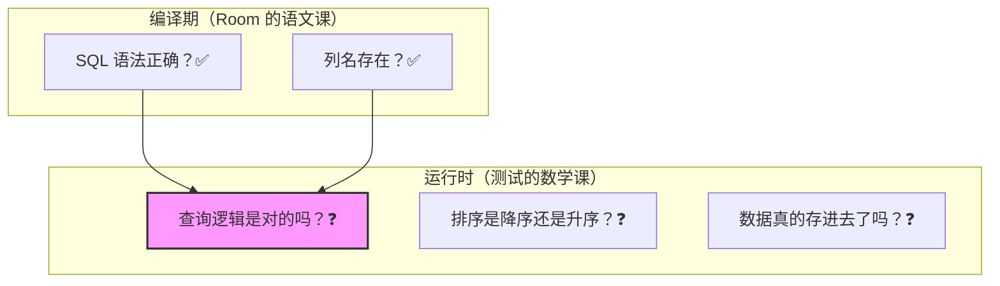
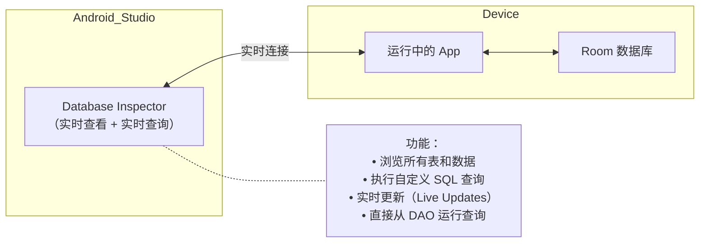
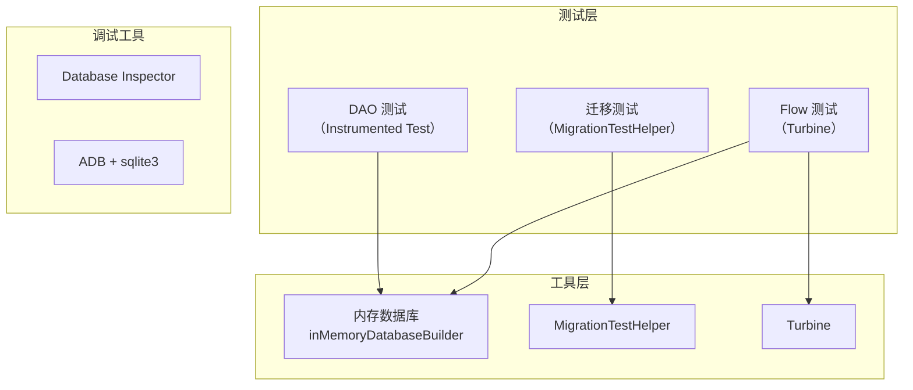

# 1.6.13 测试与调试数据库

## 1.6.13 测试与调试：给数据库做一次全面体检

“运行键是绿色的，但我总觉得它像个红色引爆器。”

上午十点，洛芙的手指悬在 `Run` 按钮上方，迟迟没有按下去。屏幕上的光标在 `deleteCampSpot()` 测试方法里无辜地闪烁。

“怎么，怕把电脑炸了？”希尔叼着一根蛋卷，凑过来看了一眼。

“我怕把真数据炸了，”洛芙缩回手，“这是数据库操作。如果我测试‘删除’功能，万一它真的连上手机里的数据库，把我在‘星空湖畔’好不容易存的记录删了怎么办？或者，测试插入了一堆乱七八糟的假数据，以后我要怎么清理？就像……把颜料泼在画布上，洗不掉了。”

“所以你需要一块‘沙画板’。”

伊莎正坐在溪边的石头上，手里拿着一根树枝，在湿润的沙地上画了一个圆圈。“看，我们可以在这里画城堡、画森林。不管画得多乱，只要潮水——我是说 `tearDown()` 方法——涌上来，一切就会归零。沙滩永远是干净的。”

黛琳把一杯冒着热气的咖啡放在折叠桌上，在这两个比喻之间搭了一座桥：“Room 有一个专门为此设计的机制叫 **内存数据库 (In-memory Database)**。它不是建在硬盘文件上的，而是建在 RAM 里的。它是一个完全的幻影——测试开始时诞生，测试结束时随风消散。”

“随风消散……”洛芙重复了一遍，手指终于落在了那个绿色的三角按钮上。

### 为什么编译器不够用？

测试跑通了，绿条亮起。但希尔并没有放过洛芙。

“来，看这个，”希尔指着 DAO 里的另一行代码，嘴角挂着一丝坏笑，“这行 SQL 有问题吗？”

```kotlin
@Query("SELECT * FROM camp_spot WHERE rating > :minRating ORDER BY rating ASC")
fun findTopSpots(minRating: Double): List<CampSpot>
```

“没问题啊，”洛芙盯着代码，“Room 编译通过了，甚至左边的行号都没有报红。”

“编译通过只能说明你‘语法’是对的——就像‘我吃桌子’这句话在语法上没问题一样。”希尔敲了一下回车，手动运行了一个查询，“但我想要的是‘评分最高的营地’（Top Spots），你却给我写了 `ASC`（升序）？这会把评分最低的烂营地排在最前面。”

洛芙恍然大悟：“啊！逻辑反了！”

“这就是为什么我们要写测试。”黛琳在旁边补充道，她随手画了一张简图，“编译器是语文老师，它只管你句子通不通顺；测试是数学老师，它管你题算没算对。”



> 图 1：编译器查语法，测试查逻辑。无论 Room 的编译检查多强大，它都无法发现类似“升序写成降序”这样的业务逻辑错误。


### 在 Android 设备上测试：推荐方案

“那我们在哪儿考？教室还是操场？”洛芙问。

“操场——也就是真机或者模拟器。”黛琳在白板上画了一个手机图标和一个电脑图标，然后在手机上画了一颗星星，“Room 的底层是 Android 平台的 SQLite。如果我们在电脑（JVM）上测，环境不一样，就像在平地上练游泳，关键时刻可能会淹死。”

“所以，我们直接在 Android 设备上跑测试。”希尔把键盘推到洛芙面前，“但记住，用内存数据库——`inMemoryDatabaseBuilder`。”

希尔在 `androidTest` 目录下新建了一个文件，手指飞快地敲击着。

```kotlin
// 代码片段 A：使用内存数据库进行 DAO 测试
// 位置：app/src/androidTest/java/...（Android Instrumented Test）
// 依赖：
//   androidTestImplementation("androidx.room:room-testing:2.6.1")
//   androidTestImplementation("androidx.test:runner:1.5.2")
//   androidTestImplementation("androidx.test.ext:junit:1.1.5")
//   androidTestImplementation("org.jetbrains.kotlinx:kotlinx-coroutines-test:1.7.3")

@RunWith(AndroidJUnit4::class)
class CampSpotDaoTest {

    private lateinit var database: CampDatabase
    private lateinit var dao: CampSpotDao

    @Before
    fun setUp() {
        // 创建内存数据库——不写磁盘，测试结束自动销毁
        // allowMainThreadQueries：测试中允许主线程操作（仅测试用！）
        val context = ApplicationProvider.getApplicationContext<Context>()
        database = Room.inMemoryDatabaseBuilder(
            context,
            CampDatabase::class.java
        )
            .allowMainThreadQueries()  // 仅测试用！生产代码绝不允许
            .build()

        dao = database.campSpotDao()
    }

    @After
    fun tearDown() {
        // 关闭数据库，释放资源
        database.close()
    }

    @Test
    fun insertAndReadCampSpot() = runTest {
        // 准备测试数据
        val spot = CampSpotEntity(
            name = "星空湖畔",
            cityId = 1,
            rating = 4.8
        )

        // 执行插入
        val id = dao.insert(spot)

        // 验证
        val loaded = dao.findById(id)
        assertThat(loaded).isNotNull()
        assertThat(loaded!!.name).isEqualTo("星空湖畔")
        assertThat(loaded.rating).isEqualTo(4.8)
    }

    @Test
    fun queryByCity_returnsCorrectResults() = runTest {
        // 插入多条测试数据
        dao.insert(CampSpotEntity(name = "星空湖畔", cityId = 1, rating = 4.8))
        dao.insert(CampSpotEntity(name = "白桦营地", cityId = 2, rating = 4.5))
        dao.insert(CampSpotEntity(name = "月溪露台", cityId = 1, rating = 4.2))

        // 按 cityId 查询
        val city1Spots = dao.findByCityId(1)

        // 验证：只返回 cityId=1 的两条记录
        assertThat(city1Spots).hasSize(2)
        assertThat(city1Spots.map { it.name })
            .containsExactly("星空湖畔", "月溪露台")
    }

    @Test
    fun deleteSpot_removesFromDatabase() = runTest {
        val spot = CampSpotEntity(name = "临时营地", cityId = 1, rating = 3.0)
        val id = dao.insert(spot)

        // 删除
        dao.deleteById(id)

        // 验证：查询返回 null
        val loaded = dao.findById(id)
        assertThat(loaded).isNull()
    }
}
```

"看到了吗——每个测试方法都遵循**三步法**：准备数据（Arrange）、执行操作（Act）、验证结果（Assert）。"黛琳指着屏幕。

"而且每次测试跑完之后，`@After` 里的 `database.close()` 会关闭内存数据库。下一个测试重新创建一个全新的空数据库——测试之间**互不干扰**。"

洛芙在笔记本上写下：**AAA 原则：Arrange → Act → Assert**。

### 测试 Flow 查询

"如果 DAO 方法返回的是 Flow 呢？怎么测试？"洛芙想到了上一章学过的 `observeAllSpots(): Flow`。

"用 `Turbine` 库。"希尔说，"它是专门测试 Kotlin Flow 的库。"

```kotlin
// 代码片段 B：测试 Flow 查询
// 额外依赖：androidTestImplementation("app.cash.turbine:turbine:1.0.0")

@Test
fun observeAllSpots_emitsUpdatesOnChange() = runTest {
    dao.observeAllSpots().test {
        // 初始状态：空列表
        val initial = awaitItem()
        assertThat(initial).isEmpty()

        // 插入一条记录
        dao.insert(CampSpotEntity(name = "星空湖畔", cityId = 1, rating = 4.8))

        // Flow 应该自动推送新列表
        val afterInsert = awaitItem()
        assertThat(afterInsert).hasSize(1)
        assertThat(afterInsert[0].name).isEqualTo("星空湖畔")

        // 再插入一条
        dao.insert(CampSpotEntity(name = "白桦营地", cityId = 2, rating = 4.5))

        // 再次推送
        val afterSecondInsert = awaitItem()
        assertThat(afterSecondInsert).hasSize(2)

        // 取消收集
        cancelAndConsumeRemainingEvents()
    }
}
```

"Turbine 的 `test { }` 块让你可以逐步接收 Flow 发射的值。"黛琳解释道，"每次调用 `awaitItem()` 就等待下一个新值。如果在超时时间内没有收到新值，测试失败。"

"注意——你不需要手动收集 Flow。Turbine 帮你处理了。你只管断言每一次推送的内容是否正确。"

### 测试迁移

"上一章学了迁移。迁移的测试怎么写？"洛芙追问。

"用 `MigrationTestHelper`。"黛琳拿出一页新的白板纸。

```kotlin
// 代码片段 C：测试数据库迁移
// 依赖：androidTestImplementation("androidx.room:room-testing:2.6.1")
// 前提：已导出 schema（room.schemaLocation 已配置）

@RunWith(AndroidJUnit4::class)
class MigrationTest {

    // MigrationTestHelper 使用导出的 schema JSON 文件来创建旧版数据库
    @get:Rule
    val helper = MigrationTestHelper(
        InstrumentationRegistry.getInstrumentation(),
        CampDatabase::class.java    // 你的 Database 类
    )

    @Test
    fun migrate1To2() {
        // 1. 创建版本 1 的数据库，插入一些测试数据
        helper.createDatabase("test-db", 1).apply {
            execSQL("""
                INSERT INTO camp_spot (id, name, cityId)
                VALUES (1, '星空湖畔', 1)
            """)
            close()
        }

        // 2. 执行迁移到版本 2
        val db = helper.runMigrationsAndValidate(
            "test-db",
            2,                  // 目标版本
            true,               // 验证后关闭
            MIGRATION_1_2       // 要测试的迁移对象
        )

        // 3. 验证迁移结果
        val cursor = db.query("SELECT * FROM camp_spot WHERE id = 1")
        cursor.moveToFirst()

        // 验证旧数据保留
        assertThat(cursor.getString(cursor.getColumnIndex("name")))
            .isEqualTo("星空湖畔")

        // 验证新列存在且有默认值
        assertThat(cursor.getDouble(cursor.getColumnIndex("rating")))
            .isEqualTo(0.0)

        cursor.close()
        db.close()
    }

    @Test
    fun migrateAll() {
        // 创建最旧版本的数据库
        helper.createDatabase("test-db", 1).apply {
            execSQL("INSERT INTO camp_spot (id, name, cityId) VALUES (1, '测试营地', 1)")
            close()
        }

        // 从 V1 一路迁移到最新版本
        Room.databaseBuilder(
            InstrumentationRegistry.getInstrumentation().targetContext,
            CampDatabase::class.java,
            "test-db"
        )
            .addMigrations(MIGRATION_1_2, MIGRATION_2_3, MIGRATION_3_4)
            .build()
            .apply {
                // 如果能打开且不崩溃，说明所有迁移都成功了
                openHelper.writableDatabase
                close()
            }
    }
}
```

"迁移测试的核心逻辑是——"黛琳总结：

"第一，用 `helper.createDatabase()` 创建一个指定**旧版本**的数据库，并插入一些测试数据。"

"第二，用 `helper.runMigrationsAndValidate()` 执行迁移并验证。这个方法会检查迁移后的 schema 是否符合预期。"

"第三，手动查询迁移后的数据库，**验证旧数据是否完整保留**，新结构是否正确创建。"

### 调试：Database Inspector

"测试之外，还有一个强大的调试工具——**Database Inspector**。"希尔打开了 Android Studio。

"从 Android Studio 4.1 开始，你可以在 App 运行时**实时查看数据库内容**。不需要停止 App，不需要导出文件，直接在 IDE 里看。"



> 图 2：Database Inspector 的工作方式。它通过实时连接到运行中的 App，让你在 Android Studio 中查看和查询数据库内容，无需停止 App 或导出文件。

"怎么打开它？"洛芙问。

"三步——"希尔竖起三根手指。

"第一，在 Android Studio 底部找到 **App Inspection** 面板。"

"第二，选择你运行中的 App 进程。"

"第三，点击 **Database Inspector** 标签。你会看到所有的表和数据。你甚至可以**直接编辑数据**——改一个值，App 里马上就会更新。"

"还有一个很酷的功能——**Live Updates**。"希尔打了个响指，"打开它之后，当 App 中的代码修改了数据库（INSERT、UPDATE、DELETE），Inspector 里的内容会**实时刷新**。你不需要手动点刷新按钮。"

### 调试：ADB + sqlite3

"如果你用命令行呢？"洛芙好奇地问。

"Android SDK 自带一个 `sqlite3` 工具，可以通过 ADB 连接到设备上的数据库文件。"黛琳说。

```bash
# 代码片段 D：用 ADB + sqlite3 查看数据库

# 1. 连接到设备 shell
adb shell

# 2. 打开数据库文件（需要 root 或 debuggable App）
sqlite3 /data/data/com.camp.app/databases/camp_database

# 3. 常用命令
.tables              -- 列出所有表
.schema camp_spot     -- 查看表的创建语句
SELECT * FROM camp_spot;  -- 查看数据
.dump camp_spot       -- 导出表数据为 SQL
.quit                 -- 退出
```

"这个方式比 Database Inspector 原始，但在某些场景下更方便——比如没有图形界面的 CI/CD 环境，或者你需要批量导出数据。"

### 测试最佳实践

"最后，让我总结一下数据库测试的最佳实践。"黛琳在白板上写了一个清单。

| 实践 | 为什么重要 |
|------|----------|
| 使用 `inMemoryDatabaseBuilder` | 不影响真实数据库，测试间隔离 |
| 遵循 AAA 模式（Arrange-Act-Assert） | 测试结构清晰，易于维护 |
| 每个 DAO 方法至少一个测试 | 验证查询逻辑的正确性 |
| 测试边界情况 | 空表、null 值、大数据量 |
| 测试 Flow 用 Turbine | 验证实时推送的正确性 |
| 测试每条迁移路径 | 防止用户升级时数据丢失 |
| 测试 migrateAll | 验证从最旧版本到最新版本的完整链路 |
| 在 CI 中运行 instrumented test | 自动化保障，每次提交都验证 |

### 反模式：不要在测试中做的事

"还有几个常见的测试反模式。"希尔举了一些反例。

```kotlin
// 代码片段 E-1：反模式——使用真实数据库测试

// ❌ 错误：用 databaseBuilder 创建真实数据库
// 问题：测试会写入真实磁盘，影响其他测试和真实数据

val db = Room.databaseBuilder(context, CampDatabase::class.java, "real_db")
    .build()
// 测试结束后如果忘了删除，真实数据库里就有测试数据了
```

```kotlin
// 代码片段 E-2：正确做法——使用内存数据库

// ✅ 正确：用 inMemoryDatabaseBuilder 创建内存数据库
// 测试结束后自动消失，不影响任何东西

val db = Room.inMemoryDatabaseBuilder(context, CampDatabase::class.java)
    .allowMainThreadQueries()
    .build()
```

```kotlin
// 代码片段 E-3：反模式——测试方法之间共享数据

// ❌ 错误：在 @Before 里插入数据，多个测试依赖同一份数据
// 问题：测试之间产生隐式依赖，一个测试修改了数据会影响其他测试

@Before
fun setUp() {
    database = Room.inMemoryDatabaseBuilder(context, CampDatabase::class.java).build()
    dao = database.campSpotDao()
    // 在这里插入所有测试数据 ← 不好
    runBlocking {
        dao.insert(CampSpotEntity(name = "共享的测试数据", cityId = 1, rating = 4.0))
    }
}
```

```kotlin
// 代码片段 E-4：正确做法——每个测试自己准备数据

// ✅ 正确：每个测试方法内部独立准备自己需要的数据
// 好处：测试之间完全隔离，任何一个测试都可以独立运行

@Test
fun shouldFindByName() = runTest {
    // 只准备这个测试需要的数据
    dao.insert(CampSpotEntity(name = "星空湖畔", cityId = 1, rating = 4.8))

    val result = dao.findByName("星空湖畔")
    assertThat(result).isNotNull()
}
```

"每个测试应该是**自包含**的。"黛琳的声音清晰而坚定，"它不依赖其他测试的执行顺序，也不依赖其他测试留下的数据。这样你可以单独运行任何一个测试，结果都是确定的。"

---

太阳升高后，帐篷阴影慢慢退到草地边缘。洛芙的测试文件不再空白：建库、插入、查询、Flow、迁移链，都有了可执行的断言。

“以前我把测试当收尾工作。”她合上电脑，“现在我把它当设计的一部分。功能写完只是开始，验证通过才算交付。”

黛琳把最后一块饼干递给她：“记住一句话：可运行不等于可靠。可靠，来自可重复的验证。”

溪水声沿着石缝往下走，细细长长。洛芙在页角写下今天的关键词：`inMemoryDatabaseBuilder`、`AAA`、`Turbine`、`MigrationTestHelper`。

---

### 技术总结

> **Room 数据库测试与调试** —— 使用内存数据库（`inMemoryDatabaseBuilder`）进行 DAO 的自动化测试，使用 `MigrationTestHelper` 测试迁移路径，使用 Turbine 库测试 Flow 查询的实时推送。调试方面，Android Studio 的 Database Inspector 提供实时查看和查询能力，ADB + sqlite3 适合命令行场景。

#### 今日关键词

1. **内存数据库（In-memory Database）**：通过 `Room.inMemoryDatabaseBuilder()` 创建，只存在于内存中，不写磁盘。每次测试前创建、测试后销毁，保证测试间完全隔离。
2. **MigrationTestHelper**：Room 提供的测试工具类。可以创建指定旧版本的数据库，执行迁移脚本，验证迁移后的 schema 是否正确。
3. **Turbine**：专门用于测试 Kotlin Flow 的库（`app.cash.turbine`）。提供 `test { }` 方法逐步接收和验证 Flow 发射的值。
4. **Database Inspector**：Android Studio 内置的数据库调试工具。可以在 App 运行时实时查看和查询数据库内容，支持 Live Updates。
5. **AAA 模式（Arrange-Act-Assert）**：测试的三步结构。准备数据 → 执行操作 → 验证结果。每个测试应该是自包含的、独立可运行的。

#### 结构图



> 测试策略全景图。DAO 测试和 Flow 测试使用内存数据库，迁移测试使用 MigrationTestHelper，调试使用 Database Inspector 或 ADB。

#### 反模式与陷阱

1. **用真实数据库跑测试**：测试数据写入磁盘，污染真实数据，测试间互相影响。
   * **修复**：使用 `inMemoryDatabaseBuilder` 创建内存数据库。

2. **测试方法间共享数据**：在 @Before 中统一插入数据，测试间产生隐式依赖。
   * **修复**：每个测试方法内部独立准备自己需要的数据。

3. **不测试边界情况**：只测试正常路径，忽略空表、null 值、重复插入等场景。
   * **修复**：为每个 DAO 方法编写正常路径和边界路径的测试。

4. **迁移代码不写测试**：迁移只在升级时运行一次，出错时用户已经丢了数据。
   * **修复**：用 `MigrationTestHelper` 测试每一条迁移路径，包括从最旧版本到最新版本的全链路。

5. **在生产代码中用 `allowMainThreadQueries()`**：阻塞主线程，导致 ANR。
   * **修复**：只在测试中使用 `allowMainThreadQueries()`，生产代码必须用协程或 Flow。

#### 设计哲学：信任来自验证

1. **没有测试的代码是碰运气**：DAO 里的 SQL 是手写的字符串。没有运行时验证，你永远不知道它是否真的正确。
2. **隔离即自由**：内存数据库让每个测试都在一个干净的环境中运行。你可以大胆插入、修改、删除——不会影响任何东西。
3. **迁移必须测试**：迁移代码只在用户升级时运行一次。如果出错，没有回滚机制。唯一的保护是事先测试。
4. **调试是开发的一半**：Database Inspector 不只是调试工具，它也是学习工具。看着数据在表里实时变化，比读任何文档都直观。
5. **自动化测试是保险**。手动测试像锁门——你可能会忘。自动化测试像保险锁——它永远在那里。

---

#### 🏕️ 动手练习

#### Task 1 · 第一个 DAO 测试 (First DAO Test) ★

**目标**：为 `insert` 和 `findById` 方法编写测试。

**你需要做的事**：
1. 在 `androidTest` 目录创建测试类。
2. 用 `inMemoryDatabaseBuilder` 创建数据库。
3. 测试：插入一条记录 → 按 ID 查询 → 验证字段正确。

**验收标准**：
- [ ] 测试通过，无异常
- [ ] 使用内存数据库，不写磁盘
- [ ] 遵循 AAA 模式

---

#### Task 2 · 查询逻辑测试 (Query Logic Test) ★★

**目标**：测试 DAO 的筛选和排序逻辑。

**你需要做的事**：
1. 插入 5 条不同城市、不同评分的营地。
2. 测试 `findByCityId()` 只返回指定城市的记录。
3. 测试 `findAllOrderByRating()` 按评分降序排列。

**验收标准**：
- [ ] 筛选测试：只返回匹配的记录
- [ ] 排序测试：结果按正确顺序排列
- [ ] 每个测试独立，不依赖其他测试

---

#### Task 3 · Flow 测试 (Flow Test with Turbine) ★★★

**目标**：用 Turbine 测试 Flow 查询的实时推送。

**你需要做的事**：
1. 添加 Turbine 依赖。
2. 测试 `observeAllSpots()` 的初始值是空列表。
3. 插入记录后 Flow 推送新列表。
4. 删除记录后 Flow 再次推送。

**验收标准**：
- [ ] 初始值为空列表
- [ ] 插入后推送包含新记录的列表
- [ ] 删除后推送更新后的列表

---

#### Task 4 · 迁移测试 (Migration Test) ★★★

**目标**：测试一条 V1→V2 的迁移路径。

**你需要做的事**：
1. 配置 schema 导出。
2. 用 `MigrationTestHelper` 创建 V1 数据库。
3. 插入测试数据。
4. 执行迁移到 V2，验证旧数据保留、新结构正确。

**验收标准**：
- [ ] 迁移前的数据完整保留
- [ ] 新列/新表存在
- [ ] Schema 验证通过

---

#### Task 5 · 边界情况测试 (Edge Case Test) ★★★

**目标**：测试 DAO 方法在边界情况下的行为。

**你需要做的事**：
1. 空表时查询返回空列表（不是 null）。
2. 查询不存在的 ID 返回 null。
3. 插入重复主键时的行为（OnConflictStrategy）。
4. 超长字符串的存储和读取。

**验收标准**：
- [ ] 空表查询返回 emptyList()
- [ ] 不存在的 ID 返回 null
- [ ] 冲突策略按预期工作
- [ ] 超长字符串正常存储和读取

---

#### Task 6 · Database Inspector 实战 (Database Inspector) ★★

**目标**：使用 Database Inspector 实时查看和修改数据。

**你需要做的事**：
1. 运行 App，打开 Database Inspector。
2. 浏览所有表和数据。
3. 执行一条自定义 SQL 查询。
4. 打开 Live Updates，在 App 中操作后观察数据变化。

**验收标准**：
- [ ] 能看到所有 Room 管理的表
- [ ] 自定义查询返回正确结果
- [ ] Live Updates 实时反映数据变化

---

#### Task 7 · 完整迁移链测试 (Full Migration Chain) ★★★★

**目标**：测试从 V1 到最新版本的完整迁移链。

**你需要做的事**：
1. 创建 V1 数据库，插入全面的测试数据。
2. 用 Room.databaseBuilder + 所有 Migrations 执行全链路迁移。
3. 打开迁移后的数据库，验证所有数据完整。

**验收标准**：
- [ ] 从 V1 到最新版本一次性迁移成功
- [ ] 数据完整保留
- [ ] 不崩溃，不丢失

---

#### Task 8 · CI 集成测试 (CI Integration) ★★★★★

**目标**：将数据库测试集成到 CI/CD 流水线中。

**你需要做的事**：
1. 配置 Android Emulator 在 CI 中运行。
2. 运行所有 `androidTest`。
3. 确保每次代码提交都自动跑数据库测试。
4. 测试失败时阻止合并。

**验收标准**：
- [ ] CI 中成功运行 instrumented test
- [ ] 每次 push 自动触发测试
- [ ] 测试失败时 PR 标记为 failing

---

#### 面试热身

1. **Q1**：为什么推荐用 `inMemoryDatabaseBuilder` 而不是 `databaseBuilder` 做测试？
2. **Q2**：`MigrationTestHelper` 的工作原理是什么？它需要哪些前提条件？
3. **Q3**：测试 Flow 查询和测试普通查询有什么区别？为什么需要 Turbine？
4. **Q4**：Database Inspector 的 Live Updates 功能在调试时有什么价值？
5. **Q5**：如果你有一个 DAO 方法返回错误的结果，你会按什么步骤排查问题？

#### 参考实现要点

1. **内存数据库 + allowMainThreadQueries**：测试标配。内存数据库不写磁盘，`allowMainThreadQueries` 简化测试中的线程管理。但生产代码绝不能用。
2. **每个 DAO 方法至少一个测试**：正常路径 + 至少一个边界路径。INSERT、SELECT、UPDATE、DELETE 都要覆盖。
3. **Flow 测试用 Turbine**：`test { awaitItem(); ... }` 模式。记得最后调用 `cancelAndConsumeRemainingEvents()`。
4. **迁移测试导出 schema**：没有 schema JSON，`MigrationTestHelper` 无法工作。配置 `room.schemaLocation` 后记得把文件纳入 Git。
5. **调试首选 Database Inspector**：它比 ADB + sqlite3 更直观，支持实时更新。但 ADB 方式在无 GUI 的环境中更实用。

---

> 💡 测试不是"额外的工作"——它是你对代码质量的投资。每一个通过的测试用例，都是你对用户的一个无声的保证："你的数据，在我手里是安全的。"

---

### 🍭 洛芙的小小日记本

之前我以为测试就是"确认代码能跑"。今天黛琳教我——测试是"确认代码跑对了"。内存数据库就像一个无限次使用的练习场，不管你在里面怎么折腾，真实世界都不会受影响。这种安全感，真好。
