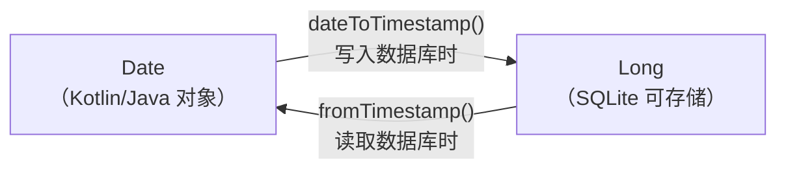
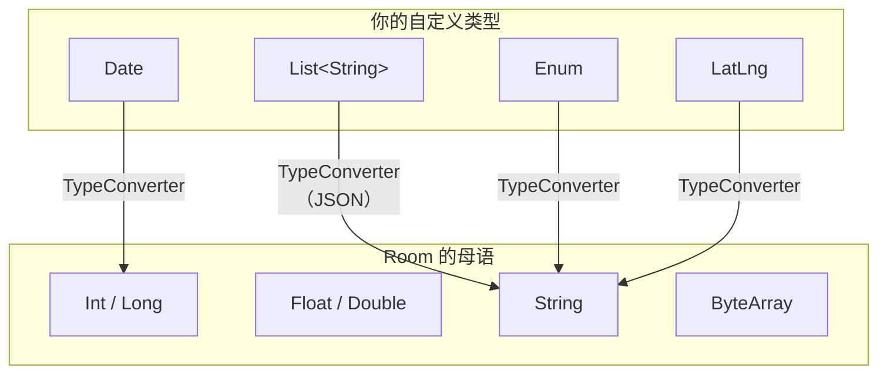
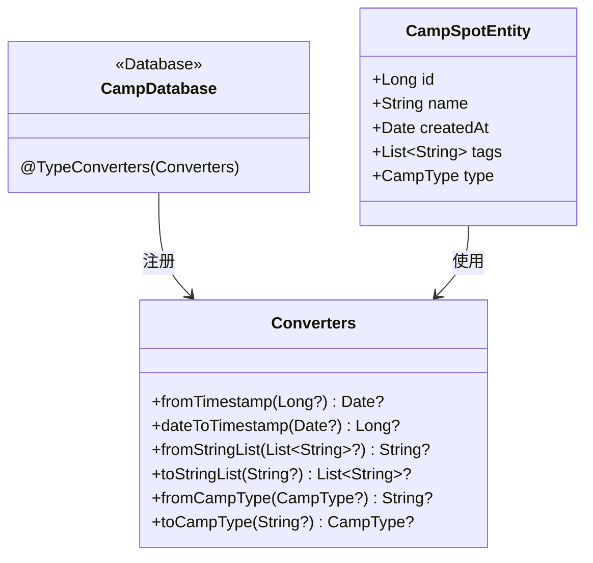

# 1.6.14 使用 Room 引用复杂数据

## 1.6.14 类型转换器：教 Room 听懂"外语"

午后的风把帐篷门帘吹得轻轻摆动，阳光在洛芙的键盘上跳跃，像几只金色的小精灵。她刚改完实体类，还没来及喝一口变凉的红茶，编译器就无情地甩出了一行红字。

```
error: Cannot figure out how to save this field into database.
```

“这次不是 SQL 拼写错误。”洛芙盯着屏幕，眉头皱得像被揉皱的草稿纸，“字段定义我也看了好几遍，到底是哪儿不对？”

“类型不对。”

希尔并没有抬头，她正坐在一截倒下的树干上，手里用瑞士军刀削着一根用来烤大福的树枝。木屑一片片落在枯草地上，发出细微的沙沙声。

“SQLite 是个很挑食的家伙。”黛琳合上手里的书，扶了扶眼镜，“它只吃五种东西：整型、浮点型、字符串、字节流，还有……没了。”

“但我这个是 `Date` 类型啊。”

“所以在它眼里，这就是‘不可食用物体’。”希尔把削好的树枝举起来晃了晃，尖端被削得尖尖的，“Room 需要一个翻译，告诉它怎么把这个奇怪的 `Date` 变成它能消化的东西。”

伊莎这时候正好端着刚热好的牛奶走过来，把杯子轻轻放在洛芙手边，热气在微凉的空气里打着转。

“这就是 **TypeConverter（类型转换器）**。”伊莎的声音温温柔柔的，像是在哄小孩子睡觉，“别怕，我们只要教它一次怎么‘切菜’，以后它自己就会做了。”

### 挑食的 SQLite

“让我们先看看 SQLite 的‘食谱’上到底有什么。”黛琳从背包里拿出一张折叠得整整齐齐的食材清单，摊平在桌子上。

“它其实只接受五种最基础的食材。”

| Room 能直接存储的类型 | 对应的 SQLite 类型 |
|---------------------|-------------------|
| `Int`, `Long`, `Short`, `Byte` | INTEGER（整数） |
| `Float`, `Double` | REAL（浮点数） |
| `String` | TEXT（文本） |
| `ByteArray` | BLOB（二进制数据） |
| `Boolean` | INTEGER (0 表示 false, 1 表示 true) |

“除了这几样，剩下的——`Date`、`List`、`Enum`、自定义类——都是它不认识的‘异国料理’。”

“所以我每次想存个 Date，还得自己把它做成 Long？”洛芙看着那一堆“不能吃”的红叉，有点泄气。

“做一次就行。”希尔把手里的树枝削出了一个漂亮的圆弧，“你只需要写一个**转换器 (TypeConverter)**，就像是给 Room 配一个随身翻译。你告诉它：‘Date 就是 Long，Long 就是 Date。’以后它再遇到 Date，就会自动按你的规则处理。”

### 编写 TypeConverter

"来看具体怎么做。"希尔打开编辑器。

```kotlin
// 代码片段 A：为 Date 类型编写 TypeConverter
// 原理：Date 本质上是一个时间戳（毫秒数），可以用 Long 表示
// Room 知道怎么存 Long，所以只需要教它 Date ↔ Long 的转换

class Converters {

    // Long → Date：从数据库读取时调用
    @TypeConverter
    fun fromTimestamp(value: Long?): Date? {
        return value?.let { Date(it) }
    }

    // Date → Long：写入数据库时调用
    @TypeConverter
    fun dateToTimestamp(date: Date?): Long? {
        return date?.time
    }
}
```

"两个方法，一来一回。"黛琳用笔在白板上画了一个双向箭头，一头写着"Date"，另一头写着"Long"。

"`@TypeConverter` 注解告诉 Room：'这是一个转换方法。'Room 看到它的参数类型和返回类型，就知道这条转换规则是 Date ↔ Long。"



> 图 1：TypeConverter 的双向转换。写入数据库时，Room 自动调用 dateToTimestamp() 把 Date 转成 Long；读取时自动调用 fromTimestamp() 把 Long 转回 Date。开发者无需手动调用。

"注意——两个方法都处理了 `null` 的情况。"洛芙发现了这个细节。

"对。因为数据库中的字段可能是 nullable 的。如果时间戳列允许为空，转换器也要能处理 null。"

### 注册 TypeConverter

"光写了 Converters 类还不够——你得告诉 Room 去用它。"希尔继续。

```kotlin
// 代码片段 B：在 @Database 类上注册 TypeConverters

@Database(
    entities = [CampSpotEntity::class],
    version = 1
)
@TypeConverters(Converters::class)  // 在这里注册！
abstract class CampDatabase : RoomDatabase() {
    abstract fun campSpotDao(): CampSpotDao
}
```

"`@TypeConverters` 注解放在数据库类上，那么这些转换器在**整个数据库**的所有 Entity 和 DAO 中都生效。"黛琳说。

"也可以放在更小的范围——"希尔补充道。

| @TypeConverters 放在 | 作用范围 |
|---------------------|---------|
| @Database 类上 | 所有 Entity 和 DAO |
| @Entity 类上 | 该 Entity 及其相关 DAO |
| @Dao 接口上 | 该 DAO 的所有方法 |
| 某个 @Dao 方法上 | 仅该方法 |

"推荐放在 @Database 上。一次注册，全局生效，最省心。"

### 使用 Date 字段

希尔按下运行键，那行刺眼的红色报错消失了。

“现在，你的 `Date` 对 Room 来说就是透明的了。”她指着屏幕上的一段新代码，“你在 Entity 里定义 `Date`，在 DAO 里用 `Date` 做查询参数——剩下的，Room 自动搞定。”

```kotlin
// 代码片段 C：在 Entity 和 DAO 中使用 Date 类型

@Entity(tableName = "camp_spot")
data class CampSpotEntity(
    // ...
    val createdAt: Date = Date(),   // 自动用 dateToTimestamp 转成 Long
    val lastVisited: Date? = null   // 自动处理 null
)

@Dao
interface CampSpotDao {
    // 按日期筛选
    // Room 会自动把既然 since 是 Date，那就调用 dateToTimestamp 转成 Long
    @Query("SELECT * FROM camp_spot WHERE createdAt >= :since")
    suspend fun findCreatedAfter(since: Date): List<CampSpotEntity>
}
```

“太狡猾了。”洛芙盯着那行简洁的查询语句，“它看着像是在操作对象，其实底下还在玩时间戳。”

“这就是抽象的艺术。”黛琳从书包里拿出一袋干果，“让我们再来点别的……比如一个标签列表？”

### 更多 TypeConverter 示例

"Date 只是一个例子。"黛琳在白板上列出了几个常见的场景。

```kotlin
// 代码片段 D：常见的 TypeConverter 集合

class Converters {

    // ---- Date ↔ Long ----
    @TypeConverter
    fun fromTimestamp(value: Long?): Date? = value?.let { Date(it) }

    @TypeConverter
    fun dateToTimestamp(date: Date?): Long? = date?.time

    // ---- List<String> ↔ String（JSON 序列化）----
    // 适用于：标签列表、图片 URL 列表等
    // 依赖：com.google.code.gson:gson（或 kotlinx.serialization）
    @TypeConverter
    fun fromStringList(value: List<String>?): String? {
        return value?.let { Gson().toJson(it) }
    }

    @TypeConverter
    fun toStringList(value: String?): List<String>? {
        return value?.let {
            val type = object : TypeToken<List<String>>() {}.type
            Gson().fromJson(it, type)
        }
    }

    // ---- Enum ↔ String ----
    // 适用于：状态、类别等有限选项
    @TypeConverter
    fun fromCampType(type: CampType?): String? = type?.name

    @TypeConverter
    fun toCampType(value: String?): CampType? = value?.let {
        try { CampType.valueOf(it) } catch (e: Exception) { null }
    }

    // ---- LatLng ↔ String ----
    // 适用于：地理坐标
    @TypeConverter
    fun fromLatLng(latLng: LatLng?): String? =
        latLng?.let { "${it.latitude},${it.longitude}" }

    @TypeConverter
    fun toLatLng(value: String?): LatLng? = value?.let {
        val parts = it.split(",")
        LatLng(parts[0].toDouble(), parts[1].toDouble())
    }
}

enum class CampType { FOREST, LAKE, MOUNTAIN, BEACH }
```

"总结一下规律——"黛琳走回来：

"任何复杂类型，你只需要找一个 Room 能理解的'中间类型'（Long、String、ByteArray），然后写一对互相转换的方法。"



> 图 2：TypeConverter 把自定义类型"翻译"成 Room 能理解的基本类型。每种自定义类型都需要找到一个合适的"中间类型"。

### @ProvidedTypeConverter：控制初始化

"还有一个高级用法。"黛琳的声音轻了一点。

"如果你的 TypeConverter 需要依赖注入——比如它需要一个 JSON 解析器的实例——你可以用 `@ProvidedTypeConverter` 注解。"

```kotlin
// 代码片段 E：使用 @ProvidedTypeConverter 注入依赖

// 加上 @ProvidedTypeConverter 后，Room 不再自动实例化这个类
// 你需要自己创建实例并传给 Room
@ProvidedTypeConverter
class JsonConverter(private val gson: Gson) {

    @TypeConverter
    fun fromTags(tags: List<String>?): String? = tags?.let { gson.toJson(it) }

    @TypeConverter
    fun toTags(json: String?): List<String>? = json?.let {
        val type = object : TypeToken<List<String>>() {}.type
        gson.fromJson(it, type)
    }
}

// 在创建数据库时手动传入实例
val gson = GsonBuilder().create()
val db = Room.databaseBuilder(context, CampDatabase::class.java, "camp_db")
    .addTypeConverter(JsonConverter(gson))  // 手动传入
    .build()
```

"这在使用 Hilt 或 Koin 等依赖注入框架时特别有用。"希尔补充，"你可以让框架管理 Gson 的生命周期，然后注入到 Converter 里。"

### 为什么 Room 不允许对象引用？

伊莎正在用一个小铁架把杯子架起来，底下点着了固体酒精。

“既然 `Date` 可以转换，那我能不能把 `City` 对象也直接放在 `CampSpot` 里？”洛芙突发奇想，“比如写个转换器，把整个 `City` 对象转成一个 JSON 字符串存进去？”

“你可以，但那是魔鬼的契约。”黛琳的脸色一沉。

“为什么？”

“想象一下，”希尔拍了拍身后的登山包，“如果我们要列一个‘背包里的物品’清单。正常的写法是：‘左侧袋：水壶’。这就够了。”

“但如果你写的是：‘左侧袋：那个装着 500ml 泉水、盖子上有划痕、产自 2023 年的蓝色水壶……’”

“太啰嗦了。”洛芙摇头。

“这在数据库里叫**冗余**。”黛琳接着说，“更可怕的是，如果你在 `CampSpot` 里直接引用了 `City` 对象——当你把营地从数据库拿出来的时候，Room 就必须顺便把城市也拿出来。如果城市里又引用了省份，省份引用了国家……”

“那我只是想看一眼营地名字，结果拽出了一整个世界？”

“这在服务端叫懒加载（Lazy Loading），在服务器上这很正常，因为无论怎么查都在后台。但在 Android 上，如果你在主线程访问 `spot.city`，却触发了一次数据库查询——”

“卡死。掉帧。ANR。”希尔做了个鬼脸。

“所以 Room **禁止**这样做。”伊莎轻轻搅动着热牛奶，“它强迫你只存一个轻飘飘的 ID（`cityId`）。如果你真的需要城市信息，请显式地写一个关联查询（`@Relation`）。你自己决定什么时候背起那个沉重的包，而不是让 Room 偷偷替你背上。”

希尔在屏幕上打下了一段对比代码，像是在给这个话题做一个结案陈词。

```kotlin
// 代码片段 F：轻量级引用 vs 重量级嵌套

// ❌ 错误：直接背着整个城市（Room 禁止！）
// @Entity data class CampSpot(val city: CityEntity)

// ✅ 正确：只拿着城市的门牌号（ID）
@Entity
data class CampSpot(
    @PrimaryKey val id: Long,
    val cityId: Long // <--- 轻飘飘的 ID
)

// 需要城市详情时，显式组装（按需加载）
data class CampSpotWithCity(
    @Embedded val spot: CampSpot,
    @Relation(parentColumn = "cityId", entityColumn = "id")
    val city: CityEntity
)
```

“这就是 Room 的哲学。”黛琳总结道，“**显式优于隐式**。它可能让你多写了几行代码，但它保证了你永远不会因为‘不知道背了什么’而被累死。”

太阳终于完全落到了山脊后面，只留下一层紫罗兰色的晚霞晕染着天空。林子里的鸟叫声渐渐歇了，取而代之的是篝火偶尔爆裂的“噼啪”声。

洛芙合上笔记本，伸了个大大的懒腰，骨节发出咔咔的轻响。

“感觉怎么样？”希尔把烤好的第一块大福递给她，外皮焦黄，里面软糯得流心。

“感觉……”洛芙接过热乎乎的大福，咬了一口，甜味在舌尖化开，“感觉我的代码变轻了。以前总想把所有东西都塞进一个类里，现在知道，原来把它们拆开、只留个 ID 联系，反而更轻松。”

伊莎笑着给每个人倒了一杯新煮的姜茶：“轻装上阵，才能走得更远嘛。”

风停了。白桦林的叶子安静地垂下来，像是在倾听这片刻的宁静。只有屏幕上那个光标还在脑海里闪烁，但已经不再是焦躁的红色报错，而是一盏指路的信号灯。

---

### 技术总结

> **类型转换器（Type Converter）** —— Room 的扩展机制。通过 `@TypeConverter` 注解定义自定义类型与 SQLite 基本类型之间的双向转换方法。Room 在编译期发现不认识的类型时，会自动查找匹配的 TypeConverter 并在运行时自动调用。配合 `@TypeConverters` 注解注册到 Database、Entity 或 DAO 级别。

#### 今日关键词

1. **TypeConverter**：用 `@TypeConverter` 注解标记的方法，负责在自定义类型与 SQLite 基本类型之间做双向转换。每对转换器包含两个方法——"存入"方向和"读出"方向。
2. **@TypeConverters**：注册转换器的注解。放在 @Database 类上可以全局生效，也可以放在 @Entity 或 @Dao 上限制作用范围。
3. **@ProvidedTypeConverter**：当 TypeConverter 需要依赖注入时使用。标记后 Room 不再自动实例化转换器，需要通过 `addTypeConverter()` 手动传入实例。
4. **对象引用禁止**：Room 不允许 Entity 中直接包含其他 Entity 的对象引用（如 `val author: Author`），以避免隐式懒加载在 UI 线程触发查询。
5. **中间类型**：TypeConverter 的核心模式——为每种自定义类型找一个 Room 理解的基本类型（Long、String、ByteArray）作为存储的中间表示。

#### 结构图



> 类图展示了 Converters 类提供多组双向转换方法，被注册到 CampDatabase 后供 CampSpotEntity 中的复杂类型字段使用。

#### 反模式与陷阱

1. **忘记处理 null**：TypeConverter 方法返回非 nullable 类型，但数据库中存了 null → 崩溃。
   * **修复**：TypeConverter 的参数和返回值都使用 nullable 类型（加 `?`）。

2. **用 JSON 序列化大型对象列表**：把一整个 List 序列化到一个列里，无法对列表内容做 SQL 查询和索引。
   * **修复**：如果需要查询列表中的元素，应该拆成独立的关联表。只有"整体存取"的场景才适合 JSON 列。

3. **TypeConverter 写了但忘记注册**：编译时仍然报"Cannot figure out how to save this field"。
   * **修复**：在 @Database 类上添加 `@TypeConverters(Converters::class)`。

4. **在 Entity 中直接嵌套另一个 Entity 对象**：编译错误。Room 不支持对象引用。
   * **修复**：使用外键 ID（`val cityId: Long`）+ `@Relation` 查询，或用 `@Embedded` 嵌入值类型。

5. **Enum 转换使用 ordinal 而不是 name**：如果 Enum 顺序变化，数据库中的旧数据会映射错误。
   * **修复**：使用 `name`（字符串）而非 `ordinal`（整数）作为存储值。

#### 设计哲学：翻译层的优雅

1. **适配器模式**：TypeConverter 就是经典的适配器模式——在两个不兼容的接口之间插入一层转换。Kotlin 对象世界和 SQLite 基本类型世界之间，一层薄薄的 TypeConverter 就打通了桥梁。
2. **显式优于隐式**：Room 禁止对象引用，强制开发者显式请求数据。这看起来多写了一点代码，但避免了隐式懒加载带来的性能陷阱。
3. **最小存储原则**：Date 用 Long、Enum 用 String、LatLng 用逗号分隔的字符串——选择最紧凑、最通用的中间表示。
4. **一次编写，到处使用**：TypeConverter 注册到 @Database 后，整个项目中所有 Entity 和 DAO 都能使用。DRY 原则的又一次体现。
5. **分层解耦**：Entity 专注于数据结构，Converter 专注于类型映射，DAO 专注于查询逻辑。每一层干好一件事，互不干扰。

---

#### 🏕️ 动手练习

#### Task 1 · Date TypeConverter (日期转换器) ★

**目标**：为 Date 类型编写 TypeConverter，在 Entity 中使用 Date 字段。

**你需要做的事**：
1. 编写 `Converters` 类，包含 Date ↔ Long 的双向转换。
2. 在 @Database 上注册。
3. Entity 中添加 `createdAt: Date` 字段。
4. 插入并查询，验证日期正确存储和读取。

**验收标准**：
- [ ] 编译通过，无 "Cannot figure out how to save" 错误
- [ ] 日期正确存储为 Long
- [ ] 从数据库读出的 Date 和写入的一致

---

#### Task 2 · List<String> TypeConverter (列表转换器) ★★

**目标**：用 JSON 序列化实现 List<String> 的存储。

**你需要做的事**：
1. 添加 Gson 依赖。
2. 编写 List<String> ↔ String 的 TypeConverter。
3. Entity 中添加 `tags: List<String>` 字段。
4. 存入 `["lake", "forest", "quiet"]`，读出并验证。

**验收标准**：
- [ ] 列表正确序列化为 JSON 字符串
- [ ] 从数据库读出的列表与原始列表一致
- [ ] null 值处理正确

---

#### Task 3 · Enum TypeConverter (枚举转换器) ★★

**目标**：为 Enum 类型编写 TypeConverter，使用 name 而非 ordinal。

**你需要做的事**：
1. 定义 `CampType` 枚举。
2. 编写 CampType ↔ String 的 TypeConverter。
3. 验证使用 `name` 存储，即使 Enum 顺序变了也不影响。

**验收标准**：
- [ ] Enum 以字符串形式存储
- [ ] 改变 Enum 成员顺序后旧数据仍能正确读取
- [ ] 无效字符串返回 null 而不是崩溃

---

#### Task 4 · DAO 中使用复杂类型参数 (Query with Custom Types) ★★★

**目标**：在 DAO 的 @Query 方法中使用 Date 作为查询参数。

**你需要做的事**：
1. 写一个 `findCreatedAfter(since: Date): List<CampSpotEntity>` 方法。
2. 写一个 `findByType(type: CampType): List<CampSpotEntity>` 方法。
3. 验证 Room 自动调用 TypeConverter 转换参数。

**验收标准**：
- [ ] Date 参数正确用于 WHERE 条件
- [ ] CampType 参数正确转换后用于查询
- [ ] 查询结果正确

---

#### Task 5 · @ProvidedTypeConverter 依赖注入 (Dependency Injection) ★★★★

**目标**：使用 @ProvidedTypeConverter 手动控制 Converter 初始化。

**你需要做的事**：
1. 标记 Converter 为 @ProvidedTypeConverter。
2. 通过构造函数注入 Gson 实例。
3. 用 `addTypeConverter()` 手动注册。
4. 验证 Converter 正常工作。

**验收标准**：
- [ ] Converter 不再被 Room 自动实例化
- [ ] 通过 addTypeConverter 手动传入实例
- [ ] 转换功能正常

---

#### Task 6 · 对象引用替代方案 (No Object References) ★★★

**目标**：理解 Room 禁止对象引用的原因，并用正确方式实现关联。

**你需要做的事**：
1. 尝试在 Entity 中直接包含另一个 Entity → 观察编译错误。
2. 改用外键 ID + @Relation 实现关联查询。
3. 对比两种方式的代码量和性能。

**验收标准**：
- [ ] 对象引用导致编译错误
- [ ] 使用 ID + @Relation 正确查询关联数据
- [ ] 理解：显式查询 > 隐式懒加载

---

#### Task 7 · Converter 作用范围控制 (Scope Control) ★★★

**目标**：测试 @TypeConverters 在不同位置注册时的作用范围。

**你需要做的事**：
1. 移除 @Database 上的 @TypeConverters。
2. 只在某个 @Entity 上注册 → 验证其他 Entity 无法使用。
3. 只在某个 @Dao 上注册 → 验证其他 DAO 无法使用。
4. 最后放回 @Database 上 → 全局生效。

**验收标准**：
- [ ] @Entity 级注册只对该 Entity 的 DAO 生效
- [ ] @Dao 级注册只对该 DAO 生效
- [ ] @Database 级注册全局生效

---

#### Task 8 · 自定义复杂类型：地理坐标 (LatLng Converter) ★★★★

**目标**：为自定义地理坐标类型编写 TypeConverter。

**你需要做的事**：
1. 定义 `LatLng(lat: Double, lng: Double)` 数据类。
2. 编写 LatLng ↔ String 的 TypeConverter。
3. Entity 中添加 `location: LatLng` 字段。
4. 按距离范围查询营地（在 SQL 中使用 CAST 和数学函数）。

**验收标准**：
- [ ] LatLng 正确序列化为 "lat,lng" 字符串
- [ ] 反序列化正确恢复两个坐标值
- [ ] 能在 DAO 查询中使用坐标相关条件

---

#### 面试热身

1. **Q1**：TypeConverter 的作用是什么？请举一个例子说明它解决了什么问题。
2. **Q2**：为什么 Room 不允许 Entity 之间有对象引用？这和 Hibernate/JPA 的做法有什么不同？
3. **Q3**：@TypeConverters 放在 @Database、@Entity、@Dao 上的作用范围有什么区别？
4. **Q4**：如果你把 List<String> 存成一个 JSON 列，有什么优缺点？什么时候应该改用关联表？
5. **Q5**：@ProvidedTypeConverter 的使用场景是什么？和普通 TypeConverter 有什么区别？

#### 参考实现要点

1. **nullable 安全**：TypeConverter 方法的参数和返回值都用 nullable 类型。数据库中的 NULL 值很常见。
2. **Enum 用 name 不用 ordinal**：ordinal 随成员顺序变化，name 是稳定的字符串标识。
3. **JSON 列的取舍**：整体存取 → JSON 列（简单但不可查）。需要查询内部元素 → 关联表（灵活但复杂）。
4. **全局注册**：把 @TypeConverters 放在 @Database 上，一次注册全局生效。避免遗漏。
5. **测试 Converter**：为 TypeConverter 编写单元测试，验证转换的正确性和 null 处理。

---

> 💡 TypeConverter 是 Room 世界的"翻译官"——它让 Kotlin 的丰富类型系统和 SQLite 的简单列类型之间无缝对接。记住两个原则：一，找到合适的中间类型；二，处理好 null。

---

### 🍭 洛芙的小小日记本

原来数据库也需要"翻译"。Date 变成 Long、List 变成 JSON 字符串、Enum 变成名字——两个世界之间，一层薄薄的转换就够了。我喜欢这种简洁。
