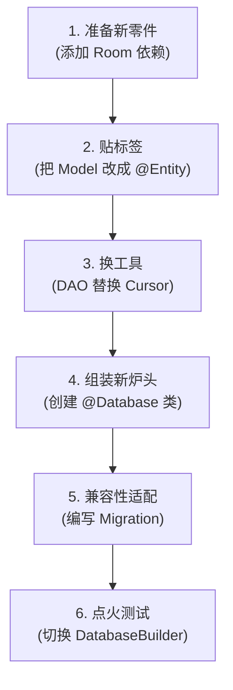
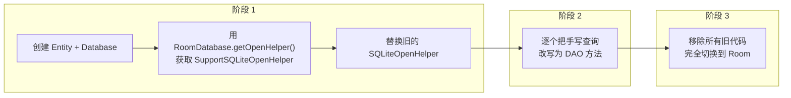
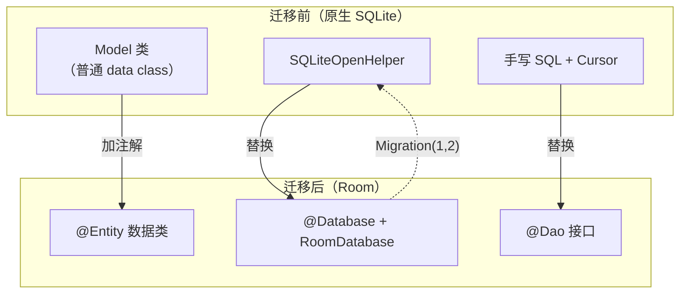

  problem_solved: 'Migrating legacy code safely'
  difficulty: 'Matching table/column names exactly'
  next_topic: '1.6.16 Raw SQLite'
---

# 1.6.15 从 SQLite 迁移到 Room

## 1.6.15 从 SQLite 到 Room：给老房子装上现代化系统

夕阳把湖面染成了陈旧的黄铜色。营地角落里，洛芙正跟一只看起来比她年纪还大的煤油炉较劲。这炉子是她在旧货市场淘来的，旋钮锈迹斑斑，每次点火都要小心翼翼地调节风门，还有一种随时会熄灭的危机感。

“就像这个该死的 `Cursor`。”洛芙松开满是铁锈味的手，懊恼地指着屏幕，“每次查数据都要手动 `moveToNext`，又要 `getColumnIndex`，稍微手抖写错一个列名以，程序就崩给我看。”

那是她两年前写的一个 App，至今还在用原生的 `SQLiteOpenHelper`。代码里充斥着原始的 SQL 拼接和令人头大的游标遍历。

“我想把它换成 Room。”洛芙看着旁边希尔那个一按就着的自动点火气炉，眼里全是羡慕，“但我不能丢掉以前的用户数据。那可是两年的回忆啊。”

“那就别换‘燃料罐’，只换‘炉头’。”希尔把她的气炉凑过来，咔哒一声打着了火，蓝色的火焰稳定而在跳动。

“什么意思？”

“你的 `camp.db` 数据库文件就是那个燃料罐。里面的数据（燃料）是好的，只是上面的取用装置（SQLiteOpenHelper）太老了。”黛琳从整理箱里拿出了四个不同颜色的收纳袋，“Room 其实只是一套更现代的‘炉头’。只要接口对得上，它完全可以直接拧在旧的燃料罐上使用。”

“真的不用把数据倒出来再灌进去？”

“一滴都不用漏。”伊莎笑着说，“我们来做一次‘无痛心脏移植’。”

### 现状：满手铁锈的代码

洛芙展示了她那一坨像生锈齿轮一样的旧代码。

```kotlin
// 这是洛芙旧项目里的代码（原生 SQLite 方式）
// 充满了手动操作的"铁锈味"

class CampDbHelper(context: Context)
    : SQLiteOpenHelper(context, "camp.db", null, 1) { // 👈 注意这个文件名

    override fun onCreate(db: SQLiteDatabase) {
        // 手写 SQL 建表，容易拼错
        db.execSQL("""
            CREATE TABLE camp_spot (
                id INTEGER PRIMARY KEY AUTOINCREMENT,
                name TEXT NOT NULL,
                city_id INTEGER NOT NULL,
                created_at INTEGER NOT NULL
            )
        """)
    }

    override fun onUpgrade(db: SQLiteDatabase, oldVersion: Int, newVersion: Int) {
        // 这里通常是一片混乱
    }
}

// 查询方法——每一次都要像拧老式旋钮一样小心
fun getAllSpots(db: SQLiteDatabase): List<CampSpot> {
    val cursor = db.rawQuery("SELECT * FROM camp_spot ORDER BY name", null)
    val spots = mutableListOf<CampSpot>()
    // 手动遍历游标，忘记 moveToNext 就会死循环
    while (cursor.moveToNext()) {
        spots.add(
            CampSpot(
                // 手动查列索引，如果不小心写错 "name" 就崩溃
                id = cursor.getLong(cursor.getColumnIndexOrThrow("id")),
                name = cursor.getString(cursor.getColumnIndexOrThrow("name")),
                cityId = cursor.getLong(cursor.getColumnIndexOrThrow("city_id")),
                createdAt = cursor.getLong(cursor.getColumnIndexOrThrow("created_at"))
            )
        )
    }
    cursor.close() // 忘记关就会内存泄漏
    return spots
}
```

“光是看着这一堆 `getColumnIndex` 我就已经手腕疼了。”希尔摇摇头。

### 迁移路线图

黛琳拿出四个不同颜色的收纳袋，开始把零件分类。

“我们分四步走。”她把零件排成一排，“先把旧零件（Model）换成新接口（Entity），再把旧工具（Cursor）换成新工具（DAO），最后——也是最关键的一步——把新炉头（Database）拧上去，同时告诉它怎么兼容旧燃料（Migration）。”



“这里面最容易炸的地方是——”希尔指着第二步，“**名字**。”

“名字？”

“Room 很严谨。它会去检查旧燃料罐上的接口名字（列名）。如果你的新 Entity 里写的名字和旧数据库里哪怕差一个字母，或者大小写不对——”希尔做了一个爆炸的手势，“砰。它会拒绝连接。”

### 步骤 1 & 2：给新零件贴这确的标签

添加依赖（Step 1）很简单，就像拆开快递包装。真正的挑战在于 Step 2：把旧的 `Model` 类改造成 Room 的 `@Entity`。

“看你的旧代码。”黛琳指着那个生锈的 `CampDbHelper`，“你建表的时候用了下划线命名法：`city_id`, `created_at`。”

“但我习惯用驼峰命名法写 Kotlin 代码。”洛芙说，“`cityId`, `createdAt`。”

“这就是冲突点。”希尔递给洛芙一个写着 `@ColumnInfo` 的不干胶标签，“你要用这个标签告诉 Room：‘嘿，虽然我在代码里叫它 `cityId`，但它对应数据库里的 `city_id`。’”

```kotlin
// 代码片段 B：让新 Entity 完美匹配旧 schema

// ---- 迁移前（普通 data class）----
data class CampSpot(
    val id: Long,
    val name: String,
    val cityId: Long,
    val createdAt: Long
)

// ---- 迁移后（Room Entity）----
// ⚠️ 关键规则：必须和旧数据库的 CREATE TABLE 语句完全对应！

@Entity(tableName = "camp_spot") // 表名也要对上！
data class CampSpotEntity(
    @PrimaryKey(autoGenerate = true)
    val id: Long = 0,

    @ColumnInfo(name = "name")
    val name: String,

    // 🔴 重点：必须显式指定列名，因为 Kotlin 是 cityId，而数据库里是 city_id
    @ColumnInfo(name = "city_id")
    val cityId: Long,

    @ColumnInfo(name = "created_at")
    val createdAt: Long
)
```

"**最关键的一点**——"黛琳在白板上画了一个粗体感叹号，"`tableName` 和每一个 `@ColumnInfo(name = ...)` 必须和旧数据库中的表名、列名**完全一致**。大小写、下划线，一个字符都不能差。"

"因为 Room 会对比你定义的 Entity 和实际数据库文件的 schema。如果不一致——"

"崩溃。"洛芙已经能接话了。

"没错。"黛琳微微点头。

"还有，如果你的 Kotlin 属性名和列名不一致（比如属性叫 `cityId`，列叫 `city_id`），就用 `@ColumnInfo(name = ...)` 把它们对应起来。"

### 步骤 3：创建 DAO

"接下来，把那些手写 SQL + Cursor 的方法替换成 DAO。"希尔开始改代码。

```kotlin
// 代码片段 C：创建 DAO 替换手写查询

// ---- 迁移前（手写 SQL + Cursor）----
fun getAllSpots(db: SQLiteDatabase): List<CampSpot> {
    val cursor = db.rawQuery("SELECT * FROM camp_spot ORDER BY name", null)
    val spots = mutableListOf<CampSpot>()
    while (cursor.moveToNext()) {
        spots.add(CampSpot(
            id = cursor.getLong(cursor.getColumnIndexOrThrow("id")),
            name = cursor.getString(cursor.getColumnIndexOrThrow("name")),
            // ... 逐个字段手动映射
        ))
    }
    cursor.close()
    return spots
}

// ---- 迁移后（Room DAO）----
@Dao
interface CampSpotDao {
    @Query("SELECT * FROM camp_spot ORDER BY name")
    suspend fun getAll(): List<CampSpotEntity>  

    @Query("SELECT * FROM camp_spot WHERE id = :id")
    suspend fun findById(id: Long): CampSpotEntity?

    @Insert(onConflict = OnConflictStrategy.REPLACE)
    suspend fun insert(spot: CampSpotEntity): Long

    @Update
    suspend fun update(spot: CampSpotEntity)

    @Delete
    suspend fun delete(spot: CampSpotEntity)

    @Query("SELECT * FROM camp_spot ORDER BY name")
    fun observeAll(): Flow<List<CampSpotEntity>>
}
```

"对比一下——"希尔把两段代码并排放在屏幕上。

| 对比项 | 原生 SQLite | Room DAO |
|-------|------------|---------|
| 查询定义 | 手写 SQL String | @Query 注解 |
| 结果映射 | 手动 Cursor 遍历 | 自动映射为 data class |
| 类型安全 | 运行时报错 | 编译时检查 |
| 资源管理 | 手动 cursor.close() | 自动管理 |
| 线程安全 | 自行处理 | suspend + Flow |
| 代码量 | ~20 行/方法 | ~2 行/方法 |

"从 20 行变成 2 行。"洛芙的眼睛睁大了。

### 步骤 4：创建 @Database 类

```kotlin
// 代码片段 D：定义 Database 类

@Database(
    entities = [CampSpotEntity::class],
    version = 2,          // 👈 必须升级！从 1 变成 2
    exportSchema = true
)
abstract class CampDatabase : RoomDatabase() {
    abstract fun campSpotDao(): CampSpotDao
}
```

"注意 `version = 2`，不是 1。"黛琳强调，"即使表结构没变，版本号也必须加一。因为 Room 需要在数据库里创建 `room_master_table`。"

### 步骤 5：编写空 Migration

"这是最关键的一步——告诉 Room 怎么从旧版本升到新版本。"

```kotlin
// 代码片段 E：空迁移（Empty Migration）
// 即使表结构没变，也要提供这个对象

// 因为表结构没有任何变化，所以 migrate() 方法是空的
// 它的存在只是为了告诉 Room：
// "从版本 1 到版本 2 的升级你不需要做任何 SQL 操作"
val MIGRATION_1_2 = object : Migration(1, 2) {
    override fun migrate(db: SupportSQLiteDatabase) {
        // 什么都不做！
        // 表结构没变，只是从 SQLiteOpenHelper 切换到 Room
    }
}
```

"空迁移？"洛芙有些意外，"什么都不写也算迁移？"

"是的。"黛琳的声音像在说一个精妙的设计，"迁移的意思是'我知道怎么从 A 版本走到 B 版本'。从 SQLiteOpenHelper 切到 Room，表结构没改——所以'走法'就是什么都不做。但你必须声明这条路存在，否则 Room 找不到从 V1 到 V2 的路径，会崩溃。"

"就像过一座桥——"伊莎轻声说，"桥的两头是同样的风景，但你必须走过去。不走，你就永远留在旧世界。"

### 步骤 6：更新数据库实例化

```kotlin
// 代码片段 F：用 Room.databaseBuilder 替换 SQLiteOpenHelper

// ---- 迁移前 ----
val dbHelper = CampDbHelper(context)
val db = dbHelper.writableDatabase
val spots = getAllSpots(db)

// ---- 迁移后 ----
val database = Room.databaseBuilder(
    context.applicationContext,
    CampDatabase::class.java,
    "camp.db"   // 🔴 必须和旧名字完全一致！错一个字就是开新库（数据丢失）
)
    .addMigrations(MIGRATION_1_2)   // 注册空迁移
    .build()

val spots = database.campSpotDao().getAll()
```

"**数据库文件名必须一致**——`camp.db`。"黛琳又一次强调，"Room 根据文件名找到旧数据库文件，执行迁移，然后接管。如果文件名不同，Room 会创建一个新的空数据库，旧数据就丢了。"

### 步骤 7：测试

"最后——测试。"黛琳说这个词的语气就像在说"空气和水"。

```kotlin
// 代码片段 G：测试迁移的正确性

@RunWith(AndroidJUnit4::class)
class SqliteToRoomMigrationTest {

    @get:Rule
    val helper = MigrationTestHelper(
        InstrumentationRegistry.getInstrumentation(),
        CampDatabase::class.java
    )

@Test
fun migrateFromSqliteToRoom() {
    // 1. 先用旧的方式创建一个 V1 数据库，塞点数据
    helper.createDatabase("camp.db", 1).apply {
        execSQL("INSERT INTO camp_spot (name, ...) VALUES ('星空湖畔', ...)")
        close()
    }

        // 2. 执行迁移到 V2
    val db = helper.runMigrationsAndValidate("camp.db", 2, true, MIGRATION_1_2)

    // 3. 看看数据还在不在
    val cursor = db.query("SELECT * FROM camp_spot WHERE name = '星空湖畔'")
    assertTrue(cursor.moveToFirst()) // ✅ 居然真的还在！
}
```

屏幕上弹出一个绿色的 `TEST PASSED`。

“通了！”洛芙跳了起来，“我的‘星空湖畔’还在！它活着过来了！”

“而且现在它住进了更现代化的 Room 豪宅。”伊莎笑着说，“再也不用手动关 Cursor 了。”

### 如果同时需要改表结构呢？

"如果你在迁移到 Room 的同时想加几个字段呢？"洛芙追问。

"那 Migration 就不是空的了——你需要在里面写真正的 SQL。"

```kotlin
// 代码片段 H：迁移到 Room 的同时修改表结构

val MIGRATION_1_2 = object : Migration(1, 2) {
    override fun migrate(db: SupportSQLiteDatabase) {
        // 趁迁移到 Room 的机会，加几个新列
        db.execSQL("ALTER TABLE camp_spot ADD COLUMN rating REAL NOT NULL DEFAULT 0.0")
        db.execSQL("ALTER TABLE camp_spot ADD COLUMN altitude INTEGER NOT NULL DEFAULT 0")
    }
}

// 对应的 Entity 要有这些新字段
@Entity(tableName = "camp_spot")
data class CampSpotEntity(
    @PrimaryKey(autoGenerate = true) val id: Long = 0,
    val name: String,
    @ColumnInfo(name = "city_id") val cityId: Long,
    @ColumnInfo(name = "created_at") val createdAt: Long,
    val rating: Double = 0.0,    // 新增
    val altitude: Int = 0         // 新增
)
```

### 渐进式迁移

"如果你的原生 SQLite 项目很大很复杂——几十个查询方法散落在各处——一次性全部迁移到 Room 可能不现实。"黛琳说。

"这时候你可以用**渐进式迁移**的策略。"



> 图 2：渐进式迁移策略。阶段 1 只替换 OpenHelper（让 Room 管理数据库文件），阶段 2 逐个替换查询方法，阶段 3 清理旧代码。

"阶段 1——你先创建 Room 的 Entity 和 Database 类，但不急着写 DAO。通过 `RoomDatabase.getOpenHelper()` 获取一个 `SupportSQLiteOpenHelper`，让旧代码继续用这个 Helper 做查询。这样 Room 先接管了数据库文件的管理，但查询逻辑暂时不变。"

```kotlin
// 代码片段 I：渐进式迁移——阶段 1

// Room 接管数据库管理，但暂时通过 OpenHelper 做旧式查询
val roomDatabase = Room.databaseBuilder(
    context, CampDatabase::class.java, "camp.db"
)
    .addMigrations(MIGRATION_1_2)
    .build()

// 获取 SupportSQLiteOpenHelper，像旧代码一样使用
val openHelper = roomDatabase.openHelper
val db = openHelper.writableDatabase

// 旧代码仍然可以这样查询（过渡期）
val cursor = db.rawQuery("SELECT * FROM camp_spot", null)
// ... 手动解析 Cursor
```

"阶段 2——你有空的时候，一个一个地把旧查询改成 DAO 方法。每改一个，测试一个。不用一口气全改完。"

"阶段 3——当所有查询都迁移到 DAO 之后，删掉旧的手工代码。干干净净。"

### 迁移检查清单

黛琳递给洛芙一张卡片：“这是最后的安全检查。在发布新版本之前，必须一项一项打钩。”

| 检查项 | 确认 |
|-------|------|
| Entity 的 tableName 与旧数据库表名一致？ | □ |
| Entity 的 @ColumnInfo(name) 与旧列名一致？ | □ |
| @Database 的 version 比旧版本大 1？ | □ |
| databaseBuilder 的数据库文件名与旧数据库一致？ | □ |
| Migration 已注册到 databaseBuilder？ | □ |
| Migration 中的 SQL（如有）与 Entity 定义一致？ | □ |
| 测试：旧数据迁移后仍然存在？ | □ |

洛芙把这张清单一字不落地抄进了笔记本。

---

暮色压低，帐篷里的灯一盏盏亮起来。洛芙把迁移检查清单勾完最后一项，长长呼了口气。
她躺在柔软的垫子上，听着帐篷外偶尔传来的虫鸣。

“以前我觉得‘迁移’就是把房子拆了重建，风险大得吓人。”洛芙看着帐篷顶上挂着的露营灯，它正发出稳定的暖光，“但其实它更像是……给老房子接上了自来水和天然气。”

“没错。”希尔的声音从睡袋另一头传来，带着困意，“水还是那些水，但你不用再去井里打水了。这就是架构升级的意义——让人变懒。”

洛芙翻了个身，手指无意识地在睡袋上画了一个圈。那种不用手动 `close()` 的轻松感，就像这充气垫一样，把她稳稳地托了起来。不再有内存泄漏的焦虑，不再有拼错 SQL 的提心吊胆。

远处溪流在夜色里持续发声，稳定而均匀。“晚安，Room。”她在心里轻轻说，“要把我的美梦存好哦。”

---

### 技术总结

> **从 SQLite 迁移到 Room** —— 将使用原生 `SQLiteOpenHelper` 的旧项目安全地升级到 Room 架构。核心步骤：将 Model 类转为 `@Entity`、手写查询替换为 DAO、`SQLiteOpenHelper` 替换为 `RoomDatabase`、版本号 +1 并提供 Migration（可以是空的）。迁移过程中数据库文件名和表/列名必须保持一致，确保用户数据不丢失。

#### 今日关键词

1. **SQLiteOpenHelper**：Android 原生的数据库管理类。手动编写 SQL、手动解析 Cursor、手动管理版本升级。Room 的前身。
2. **@Entity 替代 Model 类**：给旧 Model 类加上 `@Entity`、`@PrimaryKey`、`@ColumnInfo` 注解，tableName 和列名必须与旧数据库完全一致。
3. **DAO 替代手写 SQL**：用 `@Query`、`@Insert`、`@Update`、`@Delete` 注解替换手动 Cursor 操作。代码量大幅减少，类型安全由编译器保证。
4. **空 Migration**：当表结构不变、仅从 SQLiteOpenHelper 切换到 Room 时，Migration 的 `migrate()` 方法可以为空。但必须存在。
5. **渐进式迁移**：对于大型项目，可以分阶段迁移——先让 Room 接管数据库管理，再逐步替换查询方法。通过 `RoomDatabase.getOpenHelper()` 在过渡期使用旧式查询。

#### 结构图



> 迁移关系图。旧的三个组件分别被 Room 的三个组件替换，用 Migration 桥接版本升级。

#### 反模式与陷阱

1. **Entity 列名与旧数据库不一致**：Kotlin 属性名是 `cityId`，但旧数据库列名是 `city_id` → Room 校验失败。
   * **修复**：用 `@ColumnInfo(name = "city_id")` 显式指定列名。

2. **数据库文件名与旧项目不一致**：databaseBuilder 里写了 `camp_database` 但旧数据库文件叫 `camp.db` → Room 创建新的空数据库。
   * **修复**：文件名必须和旧数据库的文件名完全一致。

3. **版本号不增加**：从 SQLiteOpenHelper 切到 Room 时没有把 version +1 → Room 无法写入 room_master_table。
   * **修复**：version 至少加 1，并提供对应的 Migration。

4. **忘记提供 Migration**：version 加了但没写 Migration → Room 找不到迁移路径，崩溃。
   * **修复**：即使表结构不变，也要提供一个空 Migration。

5. **一次性迁移大型项目**：几十个查询一次性全改 → 引入大量 bug，难以定位。
   * **修复**：使用渐进式迁移，分阶段替换，每步都测试。

#### 设计哲学：无感升级

1. **用户无感**：迁移的最高标准是用户完全感觉不到。数据不丢、功能不变、速度不慢——只有开发者知道底层架构换了。
2. **渐进演化**：大型重构不要一步到位。分阶段迁移，每阶段可验证、可回退。
3. **名字即契约**：表名、列名、文件名——这些名字就是你和旧数据的契约。改了名字就等于撕毁契约。
4. **空操作也是操作**：空 Migration 看起来什么都没做，但它的存在本身就是一条声明："我知道从 V1 到 V2 该怎么走。"
5. **新功进旧屋**：Room 的编译期检查、自动映射、协程支持——这些"现代化设施"都可以装进老项目。技术债不是不能还，而是要找对方法。

---

#### 🏕️ 动手练习

#### Task 1 · 最小迁移 (Minimal Migration) ★

**目标**：把一个只有一张表的 SQLiteOpenHelper 项目迁移到 Room。

**你需要做的事**：
1. 创建一个使用 SQLiteOpenHelper 的简单 App（一张表、几条数据）。
2. 添加 Room 依赖，创建 Entity、DAO、Database。
3. 编写空 Migration，版本号 +1。
4. 运行 App，验证旧数据保留。

**验收标准**：
- [ ] 迁移后旧数据仍然存在
- [ ] Room 的 DAO 查询返回正确结果
- [ ] 空 Migration 正确执行

---

#### Task 2 · 列名映射 (@ColumnInfo) ★★

**目标**：处理 Kotlin 属性名和旧数据库列名不一致的情况。

**你需要做的事**：
1. 旧数据库用 snake_case 列名（`city_id`, `created_at`）。
2. Kotlin 属性用 camelCase（`cityId`, `createdAt`）。
3. 用 @ColumnInfo 做映射。
4. 验证查询正确。

**验收标准**：
- [ ] Entity 属性名和列名通过 @ColumnInfo 正确映射
- [ ] 编译通过，无 schema 错误
- [ ] 查询返回正确数据

---

#### Task 3 · 迁移同时加字段 (Migration with New Columns) ★★★

**目标**：在迁移到 Room 的同时添加新字段。

**你需要做的事**：
1. 在 Migration 中添加 ALTER TABLE 语句加新列。
2. Entity 中添加对应字段（有默认值）。
3. 验证旧数据保留 + 新列默认值正确。

**验收标准**：
- [ ] 旧数据完整保留
- [ ] 新列存在且默认值正确
- [ ] 可以对新列进行读写操作

---

#### Task 4 · 多表迁移 (Multi-Table Migration) ★★★

**目标**：迁移包含多张表（含外键关系）的旧项目。

**你需要做的事**：
1. 旧项目有 3 张表：城市、营地、打卡记录。
2. 为每张表创建 Entity，保持列名一致。
3. 提供 Migration。
4. 验证外键关系在 Room 中正常工作。

**验收标准**：
- [ ] 3 张表都正确迁移
- [ ] 外键约束生效
- [ ] 关联查询返回正确结果

---

#### Task 5 · 渐进式迁移实战 (Incremental Migration) ★★★★

**目标**：使用渐进式迁移策略，分阶段替换旧查询。

**你需要做的事**：
1. 阶段 1：创建 Room Database，但用 getOpenHelper() 继续旧式查询。
2. 阶段 2：将一半查询方法改为 DAO。
3. 阶段 3：将剩余查询全部改为 DAO，删除旧代码。
4. 每个阶段都测试。

**验收标准**：
- [ ] 阶段 1：Room 接管管理但旧式查询正常
- [ ] 阶段 2：新旧查询方式共存
- [ ] 阶段 3：完全使用 Room，旧代码已删除

---

#### Task 6 · Cursor vs DAO 代码量对比 (Code Comparison) ★★

**目标**：量化从 SQLite 迁移到 Room 带来的代码简化。

**你需要做的事**：
1. 用原生 SQLite 写 5 个查询方法（含 Cursor 解析）。
2. 用 Room DAO 写同样 5 个方法。
3. 对比总代码行数。
4. 对比错误可能性（编译期 vs 运行时）。

**验收标准**：
- [ ] 原生 SQLite 版本约 100+ 行
- [ ] Room DAO 版本约 20 行
- [ ] Room 版本编译期检查了 SQLite 版本无法检查的错误

---

#### Task 7 · 迁移测试 (Migration Test) ★★★

**目标**：使用 MigrationTestHelper 测试从 SQLite 到 Room 的迁移。

**你需要做的事**：
1. 配置 schema 导出。
2. 创建 V1 数据库（模拟旧 SQLiteOpenHelper 的格式）。
3. 执行 Migration(1, 2)。
4. 验证旧数据完整保留。

**验收标准**：
- [ ] 迁移前的数据完整保留
- [ ] Room 能正常打开并查询
- [ ] Schema 验证通过

---

#### Task 8 · TypeConverter + 迁移 (Migration with TypeConverter) ★★★★★

**目标**：迁移旧项目的同时引入 TypeConverter 支持新的数据类型。

**你需要做的事**：
1. 旧数据库的 `created_at` 存的是 Long（时间戳）。
2. 迁移到 Room 后，Entity 中使用 Date 类型 + TypeConverter。
3. 不需要改表结构（底层仍然是 Long）。
4. 验证 Date 类型的读写正确。

**验收标准**：
- [ ] Entity 使用 Date 类型而非 Long
- [ ] TypeConverter 正确转换
- [ ] 旧数据（Long 时间戳）能正确读取为 Date

---

#### 面试热身

1. **Q1**：从 SQLiteOpenHelper 迁移到 Room 时，为什么版本号必须增加？即使表结构没变？
2. **Q2**：什么是"空 Migration"？什么情况下可以使用？
3. **Q3**：迁移时如果 Entity 的列名和旧数据库不一致会怎样？怎么解决？
4. **Q4**：什么是渐进式迁移？它解决了什么问题？
5. **Q5**：Room 相比原生 SQLiteOpenHelper 的主要优势有哪些？

#### 参考实现要点

1. **列名完全一致**：`@ColumnInfo(name = ...)` 是你的好朋友。旧数据库用什么列名，Entity 就用什么列名。
2. **文件名完全一致**：`Room.databaseBuilder(context, Database, "camp.db")` 中的文件名必须和旧数据库一致。
3. **空 Migration 也要注册**：通过 `.addMigrations(MIGRATION_1_2)` 注册。Room 需要这条路径才能完成版本升级。
4. **测试迁移**：用 `MigrationTestHelper` 创建旧版本数据库，执行迁移，验证数据。
5. **渐进式迁移减少风险**：一次改太多容易出错。先替换数据库管理层，再逐步替换查询层。

---

> 💡 从 SQLite 到 Room 的迁移不是"推倒重来"——而是"无缝替换"。旧的数据库文件不动，旧的表结构不变，只是访问方式从手工变成了自动。用户感觉不到任何变化，但开发者的生活从此好了一百倍。

---

### 🍭 洛芙的小小日记本

给老项目装上 Room，就像给老房子通了自来水——以前每次要去井里打水，现在拧一下水龙头就好了。最开心的是，用户完全不知道我在幕后做了这些事。他们只管用，我来负责让一切变得更好。
