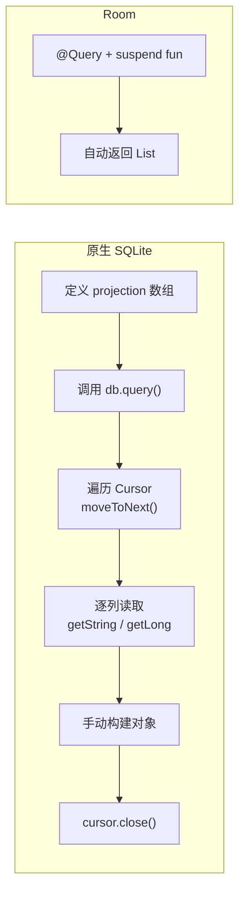
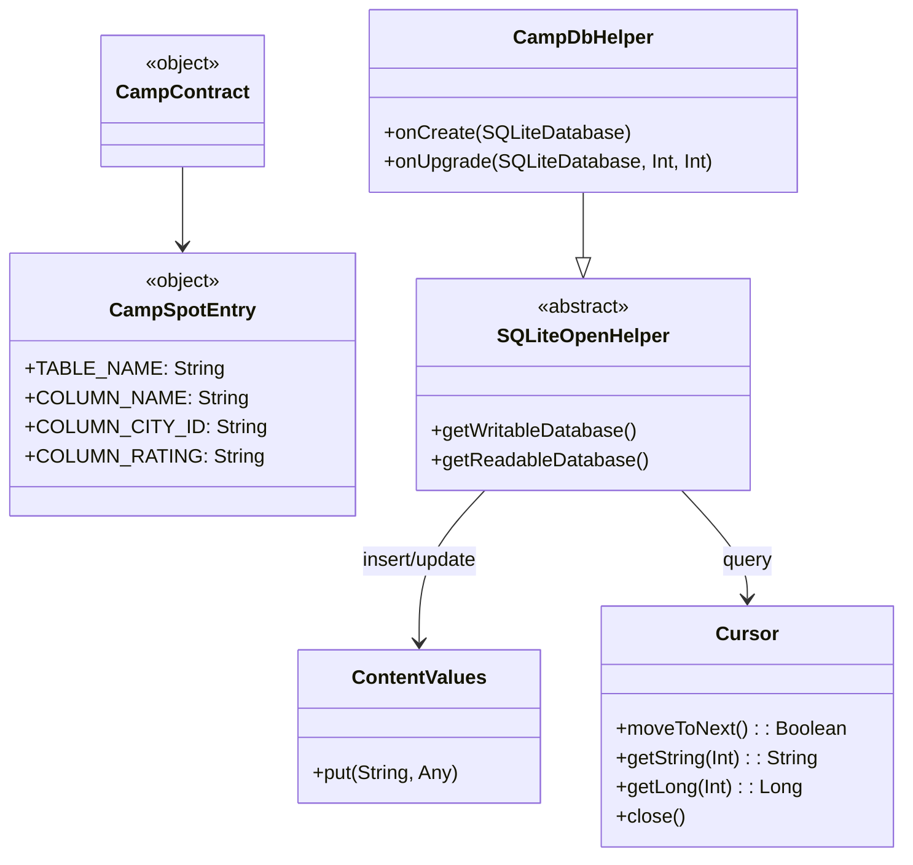

  problem_solved: 'Understanding the underlying mechanics of Room'
  difficulty: 'Verbose boilerplate code and manual resource management'
  next_topic: '1.7.1 Storage Use Cases'
---

# 1.6.16 使用 SQLite 保存数据

## 1.6.16 原生 SQLite：当你决定自己造轮子

清晨的阳光穿透薄雾，洒在沾满露珠的帐篷上。湖面像一块静止的蓝宝石，偶尔被跃起的鱼打破平静。

洛芙抱着一个沉甸甸的手摇磨豆机坐在天幕下，哈欠连天。她正费力地转动着手柄，金属磨盘发出枯燥的“咔咔”声，咖啡粉的香气在冷冽的晨风中一点点散开。

“为什么要用这个？”她停下来甩了甩酸痛的手腕，“昨晚那个胶囊咖啡机（Room）不是挺好用的吗？一键出液。”

希尔从晨雾中走来，手里拿着手冲壶：“胶囊机确实快，但如果你想知道咖啡原本的味道，或者修好一台坏掉的机器，你就得懂得怎么手动磨豆子。”

她指了指洛芙手里那个原始的磨豆机：“这就是今天的课题——**原生 SQLite**。它是 Room 的前身，是所有自动化背后的手工原理。虽然繁琐，但每一个齿轮的转动都在你掌控之中。”

黛琳坐在旁边的折叠椅上，正在检查她的相机：“而且，会用框架不等于理解成本。读老项目、排查底层问题、评估迁移风险，都需要你看得懂原生 SQLite。”

洛芙认命地继续转动手柄：“明白。那就从磨豆子——哦不，从底层规则开始。”

### 第一步：定义 Schema 和 Contract

"用原生 SQLite，第一步和 Room 一样——定义数据库的结构。Schema。"黛琳放下相机，拿起一支马克笔。晨光透过树叶的缝隙，斑驳地洒在她身后的白板上。

"区别是——在 Room 里你用 `@Entity` 注解，一句话就定义好了。这里你需要手动定义一个 **Contract 类**——它就是一个常量容器，存放表名和列名。就像一本字典，告诉所有代码：'嘿，表叫这个名字，列叫那个名字，别拼错了。'"

洛芙点了点头，手已经放到了键盘上。

```kotlin
// 代码片段 A：定义 Contract 类（Schema 契约）
// 作用：把表名和列名集中管理，避免硬编码字符串散落在代码各处

object CampContract {
    // 实现 BaseColumns 接口可以继承 _ID 主键常量
    object CampSpotEntry : BaseColumns {
        const val TABLE_NAME = "camp_spot"
        const val COLUMN_NAME = "name"
        const val COLUMN_CITY_ID = "city_id"
        const val COLUMN_RATING = "rating"
        const val COLUMN_CREATED_AT = "created_at"
    }
}

// 基于 Contract 定义 CREATE TABLE 和 DROP TABLE 语句
private const val SQL_CREATE_TABLE =
    "CREATE TABLE ${CampSpotEntry.TABLE_NAME} (" +
            "${BaseColumns._ID} INTEGER PRIMARY KEY AUTOINCREMENT," +
            "${CampSpotEntry.COLUMN_NAME} TEXT NOT NULL," +
            "${CampSpotEntry.COLUMN_CITY_ID} INTEGER NOT NULL," +
            "${CampSpotEntry.COLUMN_RATING} REAL NOT NULL DEFAULT 0.0," +
            "${CampSpotEntry.COLUMN_CREATED_AT} INTEGER NOT NULL)"

private const val SQL_DROP_TABLE =
    "DROP TABLE IF EXISTS ${CampSpotEntry.TABLE_NAME}"
```

"每个要存的值都对应一个常量。"洛芙看着代码，一行行对下来，像是在数一列排列整齐的小兵。"这样如果哪天我想改列名，只需要改一个地方——Contract 里面——而不用在代码的每个角落里搜索和替换。"

"正是如此。"黛琳微微扬起下巴，嘴角有一丝不易察觉的赞许。"这就是 Room 的 `@Entity` 在底层做的事——Room 在编译期读取你写的注解，帮你自动生成类似的 SQL 字符串。你省下的是手写这些 SQL 和管理常量的时间。而省下的时间，你可以用来喝一杯热可可。"

"或者犯少一半的 bug。"希尔在旁边小声嘀咕。

### 第二步：创建 SQLiteOpenHelper

"有了 Schema，接下来你需要一个**管家**——`SQLiteOpenHelper`。"希尔把烧开的水注入滤杯，热气腾腾地升起，"它负责三件事：创建数据库、打开数据库、处理版本升级。它就是你和 SQLite 数据库之间的中间人——所有的开门、关门、搬家，都由它来处理。"

```kotlin
// 代码片段 B：SQLiteOpenHelper——数据库的管家

class CampDbHelper(context: Context)
    : SQLiteOpenHelper(context, DATABASE_NAME, null, DATABASE_VERSION) {

    // 数据库第一次创建时调用
    override fun onCreate(db: SQLiteDatabase) {
        db.execSQL(SQL_CREATE_TABLE)
    }

    // 数据库版本升级时调用
    override fun onUpgrade(db: SQLiteDatabase, oldVersion: Int, newVersion: Int) {
        // 简单策略：删表重建（会丢数据！仅适合缓存型数据）
        db.execSQL(SQL_DROP_TABLE)
        onCreate(db)
    }

    // 数据库版本降级时调用
    override fun onDowngrade(db: SQLiteDatabase, oldVersion: Int, newVersion: Int) {
        onUpgrade(db, oldVersion, newVersion)
    }

    companion object {
        const val DATABASE_VERSION = 1
        const val DATABASE_NAME = "camp.db"
    }
}
```

"对比一下 Room——"黛琳在白板上画了两列，边画边解释，声音沉稳而有节奏，像是在读一首她很熟悉的诗。

| SQLiteOpenHelper | Room |
|-----------------|------|
| 手写 `CREATE TABLE` SQL | 自动从 @Entity 生成 |
| 手写 `onUpgrade` 逻辑 | @AutoMigration 或 Migration 类 |
| 手动管理数据库实例 | Room.databaseBuilder 单例模式 |
| `onCreate` + `onUpgrade` 回调 | 全部由 Room 框架管理 |

洛芙看着这张表，心里默默比较。每一行的差异都像是一块拼图——Room 那边的每一个自动化特性，在 SQLiteOpenHelper 这边都有一个手动的对应物。Room 并不是凭空变出来的魔法，而是把这些手动操作一个个包装起来，套上了类型安全和编译检查的外壳。

### 第三步：写入数据（Insert）

"接下来是写入数据。"黛琳说，"要插入一条记录，你需要用一个叫 `ContentValues` 的对象——它就像一个信封，你把每个列的值塞进去，然后交给数据库。"

洛芙想象了一下自己把一叠写好的明信片塞进信封的画面，觉得这个比喻很贴切。

```kotlin
// 代码片段 C：使用 ContentValues 插入数据

fun insertCampSpot(dbHelper: CampDbHelper, name: String, cityId: Long, rating: Double): Long {
    // 获取可写数据库
    val db = dbHelper.writableDatabase

    // ContentValues = 一个列名→值的映射
    val values = ContentValues().apply {
        put(CampSpotEntry.COLUMN_NAME, name)
        put(CampSpotEntry.COLUMN_CITY_ID, cityId)
        put(CampSpotEntry.COLUMN_RATING, rating)
        put(CampSpotEntry.COLUMN_CREATED_AT, System.currentTimeMillis())
    }

    // insert() 返回新行的 _ID，如果出错返回 -1
    val newRowId = db.insert(CampSpotEntry.TABLE_NAME, null, values)
    return newRowId
}
```

"Room 里只需要一行 `dao.insert(entity)` ——这背后就是这些代码。"洛芙恍然大悟，语气里带着一种"原来如此"的惊叹。

"返回 -1 表示失败——但不会告诉你为什么失败。"黛琳平静地补充，"Room 的 `@Insert` 方法至少会抛出有意义的异常。这就是'错误信号'的差距。"

### 第四步：读取数据（Query）

"读取数据是最复杂的部分。"希尔把冲好的咖啡递给洛芙，然后在晨风中伸了个懒腰，"因为你要手动遍历一个叫 **Cursor** 的东西——它像一个指针，指着查询结果的某一行。你每调用一次 `moveToNext()`，它就往下跳一行。"

"就像一个图书馆里的管理员，"伊莎说，"她不会把所有书一次性搬给你。她会站在书架前面，一次指一本——'你要这本吗？你要那本吗？'——你自己决定要不要拿。"

"拿完了还要记得跟她说'我走了'——也就是 `close()`。"希尔严肃地补充，"不然她会一直站在那里等你，占着位置不走。"

```kotlin
// 代码片段 D：使用 query() + Cursor 读取数据

fun getAllCampSpots(dbHelper: CampDbHelper): List<CampSpot> {
    val db = dbHelper.readableDatabase

    // 定义要查询的列（投影）
    val projection = arrayOf(
        BaseColumns._ID,
        CampSpotEntry.COLUMN_NAME,
        CampSpotEntry.COLUMN_CITY_ID,
        CampSpotEntry.COLUMN_RATING,
        CampSpotEntry.COLUMN_CREATED_AT
    )

    // 排序方式
    val sortOrder = "${CampSpotEntry.COLUMN_NAME} ASC"

    // 执行查询
    val cursor = db.query(
        CampSpotEntry.TABLE_NAME,   // 表名
        projection,                  // 列名数组
        null,                        // WHERE 子句（null = 全部）
        null,                        // WHERE 参数
        null,                        // GROUP BY
        null,                        // HAVING
        sortOrder                    // ORDER BY
    )

    // 手动遍历 Cursor，逐行逐列读取
    val spots = mutableListOf<CampSpot>()
    with(cursor) {
        while (moveToNext()) {
            spots.add(
                CampSpot(
                    id = getLong(getColumnIndexOrThrow(BaseColumns._ID)),
                    name = getString(getColumnIndexOrThrow(CampSpotEntry.COLUMN_NAME)),
                    cityId = getLong(getColumnIndexOrThrow(CampSpotEntry.COLUMN_CITY_ID)),
                    rating = getDouble(getColumnIndexOrThrow(CampSpotEntry.COLUMN_RATING)),
                    createdAt = getLong(getColumnIndexOrThrow(CampSpotEntry.COLUMN_CREATED_AT))
                )
            )
        }
    }
    cursor.close()  // 必须手动关闭！否则泄漏资源
    return spots
}
```

"看到了吧——"希尔指着那一大段 Cursor 操作，手指几乎要戳到屏幕上面去。"Room 里 `@Query("SELECT * FROM camp_spot") suspend fun getAll(): List<CampSpotEntity>` 一行就搞定的事，这里要写三十几行。而且你必须手动 `close()` Cursor，忘了就会泄漏文件描述符——泄漏多了，系统会拒绝给你的 App 分配新的资源，然后一切崩溃。"

洛芙在笔记本上重重地画了一道下划线——"cursor.close() 绝对不能忘"。然后她在旁边画了一个骷髅头的小图案，表示严重性。



> 图 1：原生 SQLite 查询 vs Room 查询。原生方式需要 6 个步骤，Room 只需要 1 行注解方法。

### 第五步：更新和删除

"更新和删除相对简单一些。"黛琳的声音平稳而清晰——她正坐在湖边的一块大石头上，手里拿着那杯温热的咖啡，看着远处的晨雾慢慢散去。

```kotlin
// 代码片段 E：更新数据

fun updateRating(dbHelper: CampDbHelper, spotId: Long, newRating: Double): Int {
    val db = dbHelper.writableDatabase

    val values = ContentValues().apply {
        put(CampSpotEntry.COLUMN_RATING, newRating)
    }

    // WHERE 子句：用 ? 占位符防止 SQL 注入
    val selection = "${BaseColumns._ID} = ?"
    val selectionArgs = arrayOf(spotId.toString())

    // 返回受影响的行数
    return db.update(CampSpotEntry.TABLE_NAME, values, selection, selectionArgs)
}

// 代码片段 F：删除数据

fun deleteCampSpot(dbHelper: CampDbHelper, spotId: Long): Int {
    val db = dbHelper.writableDatabase

    val selection = "${BaseColumns._ID} = ?"
    val selectionArgs = arrayOf(spotId.toString())

    // 返回被删除的行数
    return db.delete(CampSpotEntry.TABLE_NAME, selection, selectionArgs)
}
```

"更新和删除都用 `?` 占位符——这是防止 **SQL 注入** 的标准做法。"黛琳提醒道，语气严肃了几分。"什么是 SQL 注入呢？假设有一个搜索框，用户在里面输入 `'; DROP TABLE camp_spot; --`。如果你直接把用户输入拼接进 SQL 字符串，那数据库就真的会把整张表删掉。"

洛芙倒吸了一口凉气。

"但如果你用 `?` 占位符，SQLite 会把用户的输入当成一个普通的字符串值来处理——不会被解释为 SQL 语句的一部分。安全阀。"

"Room 里也是用 `:参数名` 占位符，原理一样——Room 帮你自动生成了这些防注入的代码，所以你甚至不需要想这个问题。"希尔补充说，声音里有一种"感谢 Room"的虔诚。

### 数据库连接管理

"最后一个重要的细节——连接管理。"黛琳走回来，给自己的杯子里续了一点热水，像一个老师讲到了"最后但同样重要"的部分。

"`getWritableDatabase()` 和 `getReadableDatabase()` 是**昂贵操作**——每次调用它们，系统可能需要打开文件、检查版本、执行迁移。数据库关闭后重新打开也需要时间。所以不要频繁开关——打开后保持连接，直到真正不再需要。"

洛芙若有所思地说："就像水龙头——你不会每洗一次手就把总阀门关了再开。你打开它，用完一天的水，晚上再关。"

"非常好的比喻。"黛琳的眼中倒映着清晨明亮的天空。

```kotlin
// 代码片段 G：数据库连接的生命周期管理

class CampActivity : AppCompatActivity() {
    private lateinit var dbHelper: CampDbHelper

    override fun onCreate(savedInstanceState: Bundle?) {
        super.onCreate(savedInstanceState)
        dbHelper = CampDbHelper(this)
        // 不要在这里 close()
    }

    override fun onDestroy() {
        // 在 Activity 销毁时关闭数据库
        dbHelper.close()
        super.onDestroy()
    }
}
```

"Room 帮你自动管理了这一切——通过单例模式保持连接，通过协程确保线程安全。但用原生 SQLite，你需要自己跟踪 Helper 的生命周期，自己决定什么时候开、什么时候关。多一份自由，也多一份责任。"

### 完整的 CRUD 对比表

洛芙拿出了她画满涂鸦的笔记本，一笔一划地画出了一张完整的对比表。

| 操作 | 原生 SQLite | Room |
|------|-----------|------|
| **创建表** | 手写 CREATE TABLE SQL | @Entity 自动生成 |
| **插入** | ContentValues + db.insert() | @Insert + suspend fun |
| **查询** | db.query() + Cursor 遍历 | @Query + 自动映射 |
| **更新** | ContentValues + db.update() | @Update + suspend fun |
| **删除** | db.delete() + WHERE 子句 | @Delete + suspend fun |
| **SQL 验证** | 运行时（可能崩溃） | 编译时（IDE 提示） |
| **线程安全** | 自行管理 | suspend / Flow 自动处理 |
| **代码量** | ~150 行实现 5 个方法 | ~20 行实现 5 个方法 |

阳光终于完全跃出了山脊，金色的光芒瞬间铺满了整个营地。鸟鸣声变得喧闹起来，新的一天正式开始了。洛芙把最后一列对比表补齐，停笔看了很久。

“原生 SQLite 不是难在 API，”她慢慢说，喝掉最后一口已经变凉的咖啡，“难在每一步都要自己负责：字符串、游标、线程、生命周期、异常。”

黛琳把相机收进包里：“所以理解底层，不是为了放弃 Room，而是为了在关键时刻知道风险在哪里、该怎么收口。”

洛芙合上本子，从椅子上跳起来，伸展了一下僵硬的四肢。阳光洒在她身上，暖洋洋的。她在心里把今天的结论写成一句话：懂得手动磨豆子的人，才最懂得品味咖啡。

---

### 技术总结

> **原生 SQLite API** —— Android 平台提供的底层数据库接口。通过 `SQLiteOpenHelper` 管理数据库创建和版本升级，通过 `ContentValues` 插入和更新数据，通过 `Cursor` 读取查询结果。它是 Room 的底层实现，但缺少编译时 SQL 验证和自动对象映射，代码量大且易出错。

#### 今日关键词

1. **Contract 类**：存放表名和列名常量的容器类。实现 `BaseColumns` 接口可继承 `_ID` 主键常量。集中管理字符串常量，避免硬编码。
2. **SQLiteOpenHelper**：数据库管家。提供 `onCreate()`（首次创建数据库时执行建表 SQL）和 `onUpgrade()`（版本升级时执行迁移逻辑）回调。
3. **ContentValues**：列名→值的键值映射。用于 `insert()` 和 `update()` 操作。类似于 Map<String, Any>。
4. **Cursor**：数据库查询结果的指针。通过 `moveToNext()` 逐行遍历，通过 `getString()` / `getLong()` 等方法逐列读取。必须手动 `close()`。
5. **SQL 注入防护**：使用 `?` 占位符和 `selectionArgs` 数组分离 SQL 和数据，防止恶意输入篡改查询逻辑。

#### 结构图



> 原生 SQLite 的核心组件关系。Contract 定义 schema，Helper 管理数据库生命周期，ContentValues 用于写入，Cursor 用于读取。

#### 反模式与陷阱

1. **忘记关闭 Cursor**：查询后不调用 `cursor.close()` → 资源泄漏，最终导致文件描述符耗尽。
   * **修复**：用 `use{}` 块或在 finally 中关闭。

2. **在 UI 线程执行数据库操作**：SQLiteOpenHelper 不会限制你在主线程操作 → ANR。
   * **修复**：用协程或线程池把数据库操作放到后台线程。

3. **硬编码表名和列名**：字符串散落在代码各处，改名时容易遗漏。
   * **修复**：使用 Contract 类统一管理常量。

4. **在 onUpgrade 中简单删表重建**：用户数据全部丢失。
   * **修复**：写正确的迁移 SQL（ALTER TABLE、CREATE TABLE 等）。

5. **不使用占位符参数**：直接拼接 SQL 字符串 → SQL 注入漏洞。
   * **修复**：使用 `?` 占位符 + `selectionArgs` 数组。

#### 设计哲学：知其然，知其所以然

1. **学底层是为了用好上层**：了解 Cursor 的痛苦，才能体会 Room 自动映射的价值。
2. **Room 不是魔法，它是代码生成**：Room 在编译期把你的 @Entity、@Query 注解转换成这些原生 SQLite 代码。
3. **约束即保护**：原生 SQLite 给你完全的自由——包括犯错的自由。Room 的编译时检查是一种保护。
4. **向后兼容**：很多遗留项目仍然使用原生 SQLite。理解它是维护老项目的必备技能。
5. **对比学习最有效**：把 Room 和原生 SQLite 放在一起对比，每一个 Room 特性都变得有意义。

---

#### 🏕️ 动手练习

#### Task 1 · Contract + Helper (基础搭建) ★

**目标**：定义 Contract 类并创建 SQLiteOpenHelper。

**你需要做的事**：
1. 定义 CampContract，包含表名和列名常量。
2. 创建 CampDbHelper，实现 onCreate 和 onUpgrade。
3. 验证数据库文件创建成功。

**验收标准**：
- [ ] Contract 类包含所有列名常量
- [ ] Helper 的 onCreate 成功建表
- [ ] 数据库文件出现在 /data/data/包名/databases/ 下

---

#### Task 2 · ContentValues 插入 (Insert) ★★

**目标**：使用 ContentValues 插入数据。

**你需要做的事**：
1. 创建 ContentValues 对象，填充列值。
2. 调用 db.insert() 插入。
3. 验证返回的 rowId > 0。

**验收标准**：
- [ ] 插入成功，返回有效 ID
- [ ] 数据写入数据库

---

#### Task 3 · Cursor 查询 (Query) ★★★

**目标**：使用 query() + Cursor 读取数据。

**你需要做的事**：
1. 定义 projection 数组。
2. 调用 db.query() 获取 Cursor。
3. 遍历 Cursor，构建对象列表。
4. 手动关闭 Cursor。

**验收标准**：
- [ ] 查询返回正确数据
- [ ] Cursor 已关闭
- [ ] 无资源泄漏

---

#### Task 4 · 带条件查询 (Filtered Query) ★★★

**目标**：使用 selection 和 selectionArgs 实现条件查询。

**你需要做的事**：
1. 按 city_id 筛选营地。
2. 按 rating 降序排序。
3. 使用 `?` 占位符防止 SQL 注入。

**验收标准**：
- [ ] 只返回匹配条件的记录
- [ ] 排序正确
- [ ] 使用了参数化查询

---

#### Task 5 · Update 和 Delete ★★

**目标**：实现数据的更新和删除。

**你需要做的事**：
1. 更新指定 ID 营地的 rating。
2. 删除指定 ID 的营地。
3. 验证返回的受影响行数。

**验收标准**：
- [ ] 更新后 rating 值改变
- [ ] 删除后记录不存在
- [ ] 返回正确的受影响行数

---

#### Task 6 · Room vs SQLite 完整对比 (Code Comparison) ★★★

**目标**：用两套 API 实现同样的 CRUD，感受差异。

**你需要做的事**：
1. 用原生 SQLite 实现完整 CRUD（5 个方法）。
2. 用 Room 实现完整 CRUD（5 个方法）。
3. 对比代码行数、错误可能性、开发体验。

**验收标准**：
- [ ] 两套 API 功能完全等价
- [ ] 原生 SQLite 显著更多代码
- [ ] 能说出 Room 的 3 个优势

---

#### Task 7 · onUpgrade 正确实现 (Proper Upgrade) ★★★★

**目标**：在 onUpgrade 中正确处理版本升级（不删表）。

**你需要做的事**：
1. V1→V2：用 ALTER TABLE 加列。
2. 验证旧数据保留。
3. 对比 Room 的 Migration。

**验收标准**：
- [ ] 升级后旧数据保留
- [ ] 新列存在且有默认值
- [ ] 无数据丢失

---

#### Task 8 · 事务操作 (Transaction) ★★★★

**目标**：使用 SQLite 事务批量插入数据。

**你需要做的事**：
1. 用 `db.beginTransaction()` / `setTransactionSuccessful()` / `endTransaction()` 包裹批量插入。
2. 对比有事务 vs 无事务的性能差异。
3. 验证事务回滚的行为。

**验收标准**：
- [ ] 有事务的批量插入显著更快
- [ ] 中途出错时事务回滚，数据一致
- [ ] 事务正确关闭

---

#### 面试热身

1. **Q1**：SQLiteOpenHelper 的 `onCreate` 和 `onUpgrade` 分别在什么时候被调用？
2. **Q2**：Cursor 为什么必须手动 close()？不关会怎样？
3. **Q3**：ContentValues 和 Map 有什么区别？为什么 SQLite 的 insert 和 update 用 ContentValues 而不是 Map？
4. **Q4**：原生 SQLite 和 Room 在 SQL 注入防护上有什么区别？
5. **Q5**：为什么 Android 官方推荐使用 Room 而非直接使用 SQLite API？

#### 参考实现要点

1. **始终使用 Contract 类**：表名和列名集中管理，不散落在代码里。
2. **Cursor 必须关闭**：用 `use{}` 或 try-finally 确保关闭。
3. **占位符防注入**：永远不要把用户输入拼接进 SQL 字符串。
4. **onUpgrade 不要删表**：正确的做法是 ALTER TABLE，保留用户数据。
5. **数据库操作放后台**：原生 SQLite 没有线程限制，但你应该自己确保不在主线程操作。

---

> 💡 原生 SQLite 是 Room 的"裸机模式"。了解它就像了解汇编语言——你不会每天用它，但当你看到 Room 的每一行注解时，你会知道它背后发生了什么。

---

### 🍭 洛芙的小小日记本

今天终于看到了 Room 的"底层源码"——原来每一个 @Query 背后都是一长串 Cursor 代码，每一个 @Insert 背后都是 ContentValues。Room 不是魔法，它是工程师们为我们写的礼物。再也不嫌 Room 的注解多了。
