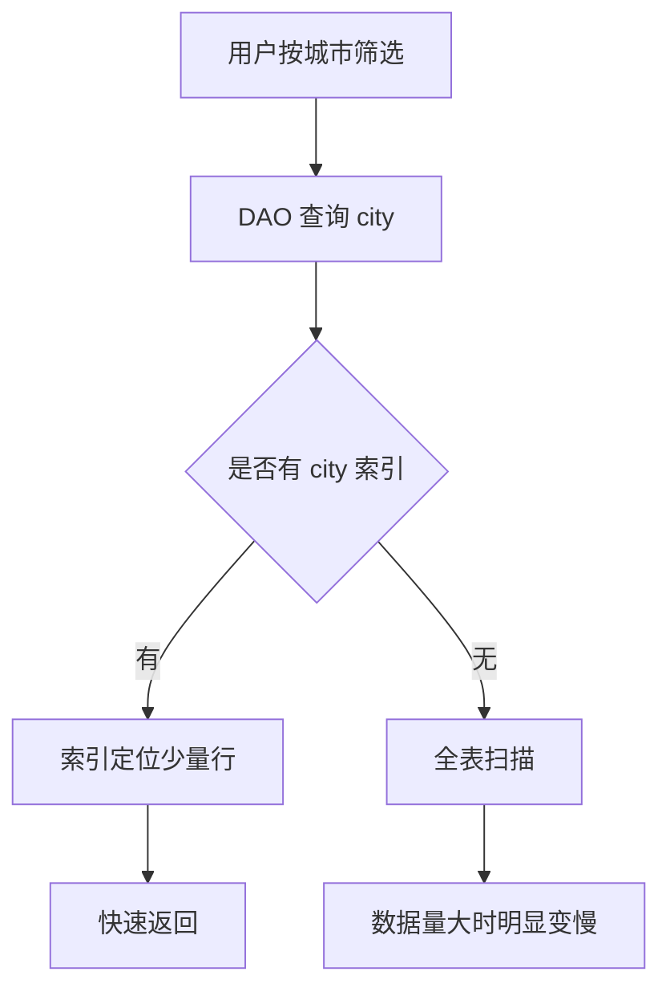

# 1.6.2 使用 Room 实体定义数据

山风刚拐过木屋转角，洛芙的电脑就发出一声短促的提示音。

不是成功那种清脆的“叮”。

是那种让人后背一凉的、编译失败前奏。

她正把昨晚的露营日记应用往前推一小步，想给每条日记加上“天气标签”和“心情贴纸”，结果模拟器一启动，列表就崩了。屏幕上滚出一行红字，像篝火里突然炸开的火星：

`Cannot figure out how to save this field into database.`

希尔正蹲在营地边缘系鞋带，听见洛芙“啊”的一声，抬头就知道出事了。她走过来把水壶放在桌上，没急着看报错，先看了洛芙的代码。

“你把 `Weather` 这个自定义类，直接塞进了 Entity 里？”

洛芙抿着嘴点头。

“还把 `isSelected` 这种只给 UI 用的状态，也塞进去了？”

洛芙又点头，点得更小心。

伊莎抱着毯子坐到一旁，轻声说：“实体像露营清单。要带进仓库的，和只在手里临时拿着的，要分开。”

黛琳把白板支起来，笔帽“咔哒”一声扣到尾部：“今天这节，不是修一个报错。是把 Room 的‘实体定义’一次打牢。实体写得好，后面 DAO、关系查询、迁移都会轻很多；实体写得乱，后面每一章都得还债。”

洛芙把电脑往中间一推，深吸一口带着松针味道的晨气：“来吧，我准备好了。”

“先记一句最短定义。”黛琳在白板上写下第一行字。

`Entity = 数据库表的蓝图。`

“Room 里的 `@Entity`，就是告诉编译器：这个类要落到 SQLite 里，变成一张表。类的字段变列，实例变行，主键负责唯一定位。”

她在白板上画出第一张图。

```mermaid
flowchart LR
    A[Kotlin Entity 类] --> B[@Entity 注解]
    B --> C[Room 编译期校验]
    C --> D[SQLite 表结构]
    D --> E[插入一行数据]
    D --> F[按列查询数据]
```

> 图 1 对应代码片段 A：从实体定义到落表的路径。

希尔把笔记本转向洛芙：“先从一份干净、能跑的实体开始。别贪多。”

```kotlin
// 代码片段 A：最小可用实体定义
// 依赖：androidx.room:room-runtime
@Entity(
    tableName = "camp_spot",
    indices = [
        Index("city"),
        Index(value = ["city", "visited_at"])
    ]
)
data class CampSpotEntity(
    @PrimaryKey(autoGenerate = true)
    val id: Long = 0L,

    @ColumnInfo(name = "spot_name")
    val name: String,

    val city: String,

    @ColumnInfo(defaultValue = "0")
    val favoriteCount: Int = 0,

    @ColumnInfo(name = "visited_at")
    val visitedAt: Long
) {
    // 只用于界面选中态，不写入数据库
    @Ignore
    var isSelected: Boolean = false
}
```

洛芙盯着代码看了几秒：“我好像懂了。`@Entity` 是在说‘我要入库’，`@Ignore` 是在说‘这个字段别入库’。”

“对。”黛琳点头，“你可以把它理解成两层行李。托运箱是数据库字段，随身包是运行时状态。`isSelected` 就是随身包，过安检不上传送带。”

伊莎笑着补了一句：“心情贴纸可以贴在日记本封面上，但不用刻在石碑里。”

洛芙被逗笑，手指也松下来：“那主键呢？为什么我每次都听你们强调主键？”

黛琳写下第二行：

`PrimaryKey = 每一行数据的身份证号。`

“没有主键，Room 不知道怎么唯一地找回某一条记录。你要改、要删、要做关系映射，都要靠它。最常见是单主键 `id`，也可以用复合主键。”

希尔顺手给了一个复合主键的版本，演示“同一个行程的第几天”这种天然组合身份。

```kotlin
// 代码片段 B：复合主键实体
@Entity(
    tableName = "trip_day",
    primaryKeys = ["tripId", "dayIndex"]
)
data class TripDayEntity(
    val tripId: Long,
    val dayIndex: Int,
    val note: String,
    val weather: String
)
```

“`tripId + dayIndex` 合在一起，才是唯一的一天。”希尔说，“这就像‘第 3 次露营的第 2 天’，单看任何一个都不够精确。”

洛芙一边记一边问：“那列名一定要改吗？`@ColumnInfo(name = "...")` 不写行不行？”

“能不写就不写，只有在你需要映射旧字段名、或者想统一 SQL 命名风格时再写。”黛琳说，“别为了‘看起来专业’把每个字段都加一遍注解。注解越多，迁移越累。”

晨雾又淡了一层，阳光落在白板边缘，细小灰尘在光里慢慢浮动。洛芙把自己的旧实体翻出来，对比着看，突然拍了下桌子：“我找到了！我之前把 `List<String>` 直接放进去了，Room 根本不知道怎么存。”

希尔竖了个大拇指：“这就是今天第一个坑。”

她把“坏味道实现”贴了出来。

```kotlin
// 代码片段 C-1：反模式（会触发编译错误）
@Entity(tableName = "bad_diary")
data class BadDiaryEntity(
    @PrimaryKey(autoGenerate = true)
    val id: Long = 0L,
    val title: String,
    val tags: List<String> // Room 默认不支持直接存 List<String>
)
```

“这种错误不是运行时炸，是编译期拦住你。”黛琳说，“这反而是 Room 的优点。它在你发版前就让你把坑填掉。”

“那怎么改？”洛芙问。

“两个方向。”希尔伸出两根手指，“第一，拆成关系表，后面章节会讲。第二，暂时转成字符串存储，用 `TypeConverter`。”

她把重构版本写出来。

```kotlin
// 代码片段 C-2：重构后（可编译）
class TagConverters {
    @TypeConverter
    fun fromTags(tags: List<String>): String = tags.joinToString("|")

    @TypeConverter
    fun toTags(raw: String): List<String> =
        if (raw.isBlank()) emptyList() else raw.split("|")
}

@TypeConverters(TagConverters::class)
@Entity(tableName = "diary")
data class DiaryEntity(
    @PrimaryKey(autoGenerate = true)
    val id: Long = 0L,
    val title: String,
    val tags: List<String>
)
```

伊莎把毯子往肩上拢了拢：“就像先把散装贴纸装进一个透明袋，再放进抽屉。抽屉只认识袋子，不认识满地飞的贴纸。”

洛芙点头：“听懂了。数据库列要‘可落地’。”

黛琳继续推进到第二个高频坑：“另一个常见问题是，字段明明只给页面用，却忘了 `@Ignore`，最后把临时状态写进库，造成脏数据。”

她又写了一组对比。

```kotlin
// 代码片段 D-1：反模式（UI 状态入库）
@Entity(tableName = "spot")
data class SpotEntityBad(
    @PrimaryKey(autoGenerate = true) val id: Long = 0L,
    val name: String,
    val city: String,
    val expanded: Boolean // 列表展开态，不该入库
)

// 代码片段 D-2：重构后（只持久化业务字段）
@Entity(tableName = "spot")
data class SpotEntityGood(
    @PrimaryKey(autoGenerate = true) val id: Long = 0L,
    val name: String,
    val city: String
) {
    @Ignore
    var expanded: Boolean = false
}
```

“数据库里只放‘事实’，别放‘当下 UI 情绪’。”黛琳说，“事实稳定，状态瞬时。混在一起，迟早错。”

洛芙把这句抄了三遍。

希尔趁热打铁，把查询性能也拉进来：“实体定义不是只管‘能不能存’，还管‘查起来快不快’。你常按 `city` 查，就该建索引。”

她画出第二张图。



> 图 2 对应代码片段 A 中 `indices` 配置，以及下面代码片段 E 的查询语句。

```kotlin
// 代码片段 E：按 city 查询的 DAO
@Dao
interface CampSpotDao {
    @Query(
        """
        SELECT * FROM camp_spot
        WHERE city = :city
        ORDER BY visited_at DESC
        """
    )
    suspend fun queryByCity(city: String): List<CampSpotEntity>
}
```

“所以索引不是装饰品，是你提前为未来查询付的‘路费’。”希尔说。

洛芙笑起来：“不建索引，就是让每次查询都徒步翻山。”

“正解。”希尔打了个响指。

中午前，四个人把草地上的折叠桌拼成了一个小实验台。洛芙说她怕自己“听懂了但没真懂”，想做个最小测试闭环。黛琳同意：“写测试。让证据说话。”

希尔把最小可运行测试模板敲出来，洛芙跟着一行一行敲。

```kotlin
// 代码片段 F：最小可运行的 Room 实体测试（instrumentation）
// 依赖：room-testing, junit4, androidx.test
@RunWith(AndroidJUnit4::class)
class CampSpotEntityTest {

    @Database(entities = [CampSpotEntity::class], version = 1, exportSchema = false)
    abstract class TestDb : RoomDatabase() {
        abstract fun dao(): CampSpotDaoForTest
    }

    @Dao
    interface CampSpotDaoForTest {
        @Insert
        suspend fun insert(entity: CampSpotEntity): Long

        @Query("SELECT * FROM camp_spot WHERE id = :id")
        suspend fun findById(id: Long): CampSpotEntity?
    }

    private lateinit var db: TestDb
    private lateinit var dao: CampSpotDaoForTest

    @Before
    fun setup() {
        val context = ApplicationProvider.getApplicationContext<Context>()
        db = Room.inMemoryDatabaseBuilder(context, TestDb::class.java)
            .allowMainThreadQueries() // 测试环境可用，生产代码不要这样做
            .build()
        dao = db.dao()
    }

    @After
    fun tearDown() {
        db.close()
    }

    @Test
    fun insert_and_query_entity_success() = runBlocking {
        val id = dao.insert(
            CampSpotEntity(
                name = "松林湖畔营地",
                city = "青山市",
                favoriteCount = 2,
                visitedAt = 1739836800000
            )
        )

        val row = dao.findById(id)
        assertThat(row).isNotNull()
        assertThat(row!!.name).isEqualTo("松林湖畔营地")
        assertThat(row.city).isEqualTo("青山市")
    }
}
```

洛芙按下运行，几秒后绿色通过条弹出来。她本能地把拳头握了一下，肩膀却慢慢松下来，像整个人终于和代码和解。

“这就是实体定义的完成态。”黛琳看着她说，“不是‘看起来差不多’，而是‘结构清楚、可编译、可验证、可维护’。”

伊莎把保温杯递给洛芙，杯壁温热：“你刚刚做的，不只是把字段写对了。你把‘记忆’和‘状态’分开了。一个负责长久，一个负责当下。”

洛芙望着屏幕里的那条数据，轻声说：“原来 Room 实体，不只是‘我想存什么’，还是‘我承诺以后怎么读、怎么改、怎么迁移’。”

风从林间穿过，帐篷边的风铃轻轻碰了一下，发出很薄的一声响。午后的光正好，桌上的白板笔滚到边缘，又被希尔一把按住。

她笑着说：“下一章，我们就去学 DAO，看看怎么优雅地把这些实体用起来。”

---

### 技术总结

> `@Entity` 是 Room 中把 Kotlin 类映射到 SQLite 表的核心注解。实体定义的质量，直接决定后续查询性能、迁移难度和代码可维护性。写实体时优先保证四件事：主键明确、字段可落地、临时状态隔离、查询路径可索引。

#### 今日关键词

1. `@Entity`：声明该类是 Room 表结构定义。
2. `@PrimaryKey`：定义唯一标识，可单键或复合键。
3. `@ColumnInfo`：列名与默认值配置。
4. `@Ignore`：标记不入库字段。
5. `@Index`：为高频筛选列加速查询。
6. `@TypeConverter`：把 Room 不直接支持的类型转换为可存储类型。

#### 核心机制定义

- 映射机制：Entity 类字段会映射为 SQLite 列，编译期完成语义校验。
- 约束机制：主键与列类型决定数据可写入性和唯一性。
- 性能机制：索引把“全表扫描”转为“有目标定位”。
- 边界机制：`@Ignore` 保证 UI 临时状态不污染持久化事实。

#### 结构图

```mermaid
flowchart LR
    A[实体字段设计] --> B[编译期校验]
    B --> C[数据库表结构]
    C --> D[DAO 查询]
    D --> E[UI 展示]
    E --> F[用户交互状态]
    F --> G[@Ignore 不入库]
```

#### 反模式与陷阱

1. 缺失主键：导致无法稳定更新和删除单条数据。
2. 直接存复杂类型：如 `List<String>`，未加转换器会编译失败。
3. UI 状态入库：例如 `expanded/isSelected`，会形成脏数据。
4. 高频查询无索引：数据量增长后查询明显变慢。
5. 注解滥用：无必要重命名全部列，增加迁移复杂度。

#### 设计建议

1. 先画数据模型再写实体：先确定“事实字段”与“临时字段”边界。
2. 先按查询场景建索引：从 DAO 查询语句反推实体 `indices`。
3. 每改实体都跑一次最小测试：保证字段变更可落地、可回读。
4. 保持命名稳定：减少未来迁移脚本复杂度。

### 🍬 动手练习

#### Task 1 · 实体清洗（基础）

目标：把一个混合了 UI 状态的实体重构为“只含持久化字段”的版本。  
验收：编译通过，`@Ignore` 字段不落库。

#### Task 2 · 复合主键建模（进阶）

目标：把“行程-天”模型设计为复合主键实体。  
验收：同一 `tripId` 下不同 `dayIndex` 可共存，重复组合写入被替换或拒绝（按策略验证）。

#### Task 3 · 索引收益验证（进阶）

目标：分别在“有索引”和“无索引”下执行 `city` 条件查询。  
验收：记录 1 万条数据后，对比平均查询耗时并输出结论。

#### Task 4 · 转换器实战（挑战）

目标：为 `List<String>` 标签字段实现 `TypeConverter` 并完成读写回环测试。  
验收：插入后查询出的标签顺序与内容一致。

> 学习建议：写 Entity 时先问自己三句——“这是不是长期事实？”“未来会按它查询吗？”“改动后我有测试兜底吗？”这三句能帮你避开大多数后期返工。

### 🍭 洛芙的小小日记本

今天终于懂了，实体不是“能存就行”的表格，而是应用记忆的骨架。字段一乱，后面全乱；字段站稳，心也稳了。
