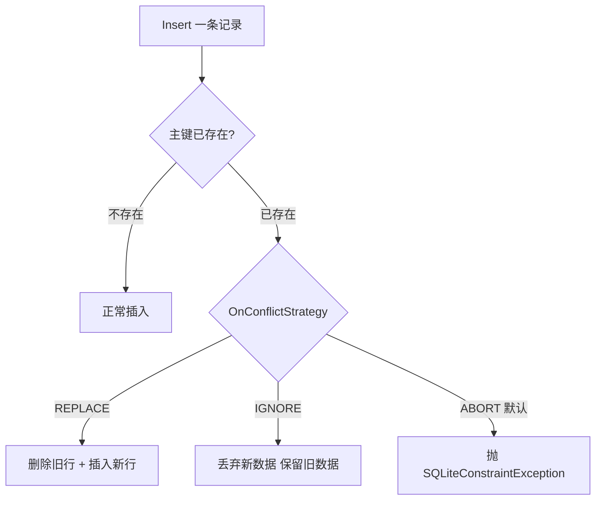
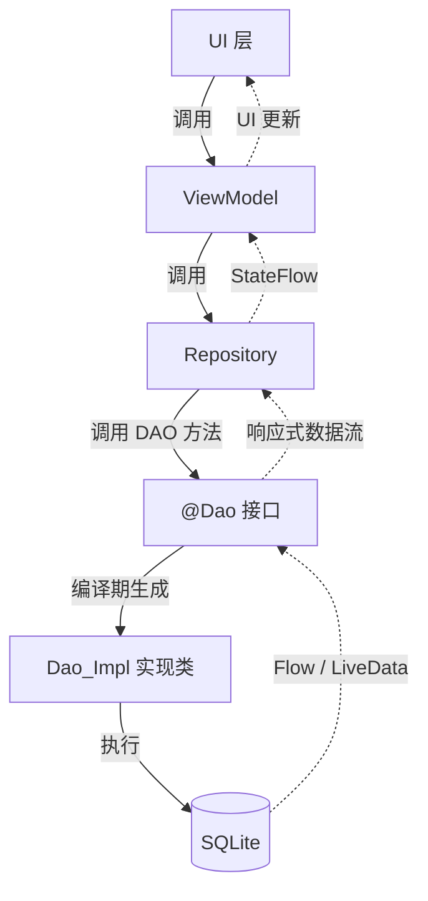

# 1.6.3 使用 Room DAO 访问数据

白板上的墨迹还没干透，希尔已经把笔帽扣回去了。

"实体写好了，"她说，"可你总不能把数据吹进数据库吧？"

洛芙撑着下巴，面前的 `CampSpotEntity` 安安静静地躺在编辑器里，像一张刚设计好的表格——每一列名称清楚、类型明确，可是表格上连半行数据都没有。她在上一节课已经学会了怎么"画蓝图"，但还不知道怎么"往蓝图里填内容、查内容、改内容、删内容"。

"我需要……一个管家？"洛芙试探着说。

"正解。"黛琳把白板翻到背面，写下两个大字：

**D A O**

"Data Access Object，数据访问对象。"她画了一条下划线，"如果说 Entity 是仓库里的货架结构，那 DAO 就是仓库管理员。你告诉管理员：'帮我放一箱苹果'、'帮我找出所有草莓'、'把上周的过期面包清掉'——他执行，你不用自己搬梯子。"

伊莎接话："而且这个管理员会在编译期就告诉你——'你写的入库单有个字拼错了'。不会等到货物砸在脚上才发现。"

### 最小的 DAO 长什么样？

希尔直接敲了一段最短的代码。

```kotlin
// 代码片段 A：最小可用 DAO
// 用 @Dao 注解标记一个接口，Room 会自动生成实现类
// 就像声明一份"管理员操作手册"
@Dao
interface CampSpotDao {

    // 插入一条营地记录
    // suspend：必须在协程或其他挂起函数中调用，防止阻塞主线程
    // 返回 Long：插入成功后返回该行的 rowId
    @Insert
    suspend fun insert(spot: CampSpotEntity): Long

    // 查询全部营地，按访问时间倒序
    // Flow<List<...>>：数据库内容一旦变化，会自动推送最新列表
    @Query("SELECT * FROM camp_spot ORDER BY visited_at DESC")
    fun observeAll(): Flow<List<CampSpotEntity>>
}
```

"就这么点？"洛芙惊讶地眨了眨眼。

"就这么点。"希尔笑了，"你声明意图，Room 帮你实现。这就是'约定优于配置'。"

黛琳把这个过程画成了一张图。


> 图 1：DAO 接口到实际数据库操作的编译期代码生成路径。

"注意这条虚线，"黛琳指着白板，"你写的 SQL 会在编译期被校验。拼错字段名、写错表名——全部在你按下 Build 的那一刻就拦住你，不会等到用户打开 App 才崩。"

### 四个基本动作：增删改查

"管理员会四个基本动作。"伊莎竖起四根手指。

"增：`@Insert`。删：`@Delete`。改：`@Update`。查：`@Query`。"

希尔把四个注解展开来讲，每个都配了一段最小代码。

```kotlin
// 代码片段 B：完整的 CRUD DAO
@Dao
interface CampSpotDao {

    // ──── 增（Create）────
    // onConflict 策略：如果插入的主键已存在，执行替换
    // OnConflictStrategy.REPLACE：用新数据覆盖旧数据
    // OnConflictStrategy.IGNORE：丢弃新数据，保留旧数据
    // OnConflictStrategy.ABORT（默认）：抛出异常，事务回滚
    @Insert(onConflict = OnConflictStrategy.REPLACE)
    suspend fun insert(spot: CampSpotEntity): Long

    // 一次插入多条记录
    // vararg：接受不定数量参数，也可以传 List
    @Insert(onConflict = OnConflictStrategy.REPLACE)
    suspend fun insertAll(vararg spots: CampSpotEntity)

    // ──── 删（Delete）────
    // Room 根据主键匹配要删除的行
    // 如果传入的对象主键在表里不存在，Room 不会报错，也不删除任何行
    // 返回 Int：成功删除的行数
    @Delete
    suspend fun delete(spot: CampSpotEntity): Int

    // ──── 改（Update）────
    // 同样根据主键匹配
    // 返回 Int：成功更新的行数
    @Update
    suspend fun update(spot: CampSpotEntity): Int

    // ──── 查（Read）────
    // 最简单的全量查询
    @Query("SELECT * FROM camp_spot ORDER BY visited_at DESC")
    fun observeAll(): Flow<List<CampSpotEntity>>

    // 按 id 查询单条
    // :id 是方法参数的绑定变量，Room 会自动安全地注入
    @Query("SELECT * FROM camp_spot WHERE id = :id")
    suspend fun findById(id: Long): CampSpotEntity?

    // 按城市筛选
    @Query("SELECT * FROM camp_spot WHERE city = :city ORDER BY visited_at DESC")
    fun observeByCity(city: String): Flow<List<CampSpotEntity>>

    // 按 id 删除（用 @Query 写 DELETE 语句，而不是 @Delete）
    // 当你手上只有 id 而没有完整对象时，这种方式更方便
    @Query("DELETE FROM camp_spot WHERE id = :id")
    suspend fun deleteById(id: Long)
}
```

洛芙一条条看下来，在笔记本上画了个表格。

"等等，"她皱眉，"`@Delete` 要传完整对象，可我有时候只知道 id 呀？"

"好问题。"希尔竖起大拇指，"两种删除方式各有适用场景。`@Delete` 适合你已经拿到了完整实体的情况，比如列表里长按一条记录删掉它。而 `@Query('DELETE ... WHERE id = :id')` 适合你只知道 id 的情况。两者结果一样，选哪个看你手上有什么。"

"就像拆帐篷，"伊莎比划着，"你可以把整个帐篷递给管理员说'帮我收了'，也可以说'把三号位的帐篷收了'——都行。"

### 冲突策略：当两条记录"撞车"

洛芙想了一会儿，问出了下一个问题："如果我插入一条营地，它的 id 已经存在了呢？"

"这就是 `OnConflictStrategy` 的工作。"黛琳在白板上画出三条路。



> 图 2：三种冲突策略在主键碰撞时的行为差异。

"REPLACE 适合'以最新为准'的场景，比如同步服务器数据。IGNORE 适合'先到先得'。ABORT 适合你必须确保不重复的场景——碰撞就报错，让你在代码里处理。"

洛芙点头："那日记应用一般用哪个？"

"如果是手机端自己创建的数据，用默认 ABORT 就好，因为 `autoGenerate = true` 的主键不会重复。如果是从服务器同步下来的数据，通常用 REPLACE。"黛琳说。

### 查询的"读心术"：参数绑定

"DAO 的灵魂其实是 `@Query`。"希尔说，"因为增删改有快捷注解，但真正复杂的操作都要写 SQL。好在 Room 让你写 SQL 时几乎不用拼字符串。"

```kotlin
// 代码片段 C：各种参数绑定方式

@Dao
interface CampSpotDao {

    // 1. 单参数绑定
    // :keyword 对应方法参数 keyword
    // '%' || :keyword || '%' 是 SQLite 的字符串拼接，实现模糊搜索
    @Query(
        """
        SELECT * FROM camp_spot
        WHERE spot_name LIKE '%' || :keyword || '%'
        ORDER BY visited_at DESC
        """
    )
    fun searchByName(keyword: String): Flow<List<CampSpotEntity>>

    // 2. 多参数绑定
    // 查询某个时间范围内、某个城市的营地
    @Query(
        """
        SELECT * FROM camp_spot
        WHERE city = :city
          AND visited_at BETWEEN :startTime AND :endTime
        ORDER BY visited_at DESC
        """
    )
    suspend fun queryByCityAndTime(
        city: String,
        startTime: Long,
        endTime: Long
    ): List<CampSpotEntity>

    // 3. 集合参数绑定
    // IN (:cityList) —— Room 会自动把 List 展开为 (?, ?, ?)
    @Query("SELECT * FROM camp_spot WHERE city IN (:cityList)")
    suspend fun queryByCities(cityList: List<String>): List<CampSpotEntity>
}
```

"注意，"黛琳用笔尖点了一下代码，"Room 的参数绑定是安全的。它不会像手写 SQL 拼接那样被 SQL 注入攻击。`:keyword` 会被当作纯数据处理，不会被解释为 SQL 指令。"

洛芙认真写下："Room 参数绑定 = 防注入 + 编译期校验。"

### 返回"部分列"：不是所有字段都要搬出来

"有时候你只想知道营地名称和城市，不想把整行数据都拉出来。"希尔说，"这时候你可以定义一个轻量的数据类，只包含你需要的列。"

```kotlin
// 代码片段 D：只返回部分列

// 专门用来接收"只有名称和城市"的查询结果
// 它不需要 @Entity 注解，只是一个普通的 data class
data class SpotBrief(
    // @ColumnInfo 的 name 必须和 SELECT 中的列名匹配
    @ColumnInfo(name = "spot_name") val name: String,
    val city: String
)

@Dao
interface CampSpotDao {
    // SELECT 只取两列，Room 会自动映射到 SpotBrief
    @Query("SELECT spot_name, city FROM camp_spot ORDER BY spot_name")
    suspend fun loadBriefs(): List<SpotBrief>
}
```

洛芙恍然大悟："我可以只搬客厅的台灯出来看，不用把整个房间都搬出来！"

"对。"伊莎笑了，"这在列表页特别有用。列表只显示标题和副标题，为什么要把正文、图片路径、创建时间全读出来呢？省内存又省 I/O。"

### 返回值的三种"脾气"

"DAO 方法的返回值，其实决定了数据的'推送方式'。"黛琳把三种常见模式列出来。

| 返回类型 | 行为 | 适用场景 |
|---------|------|---------|
| `suspend fun ...(): List<T>` | 调用一次，拿一次结果 | 只需要一次性加载的场景 |
| `fun ...(): Flow<List<T>>` | 数据库变化时自动推送新数据 | 列表页需要实时刷新 |
| `fun ...(): LiveData<List<T>>` | 同 Flow，但生命周期感知 | 和 XML 布局配合（非 Compose） |

"简单说，"希尔总结，"一次性的操作用 `suspend`；要一直听着变化的用 `Flow` 或 `LiveData`。"

"我上一章做的 `observeAll()` 返回的就是 `Flow`！"洛芙拍了一下桌子，"原来这就是'数据一变、列表自动刷新'的秘密！"

"没错。当你在另一个地方调用 `insert()` 或 `delete()`，返回 `Flow` 的查询会自动收到更新——不需要你手动再查一次。"

### @Transaction：要么全做，要么全不做

午后的阳光移到了白板另一边，空气里浮着淡淡的松脂味道。洛芙突然问了一个刁钻的问题。

"如果我要同时插入三条记录，插到第二条时突然断电了，会不会只成功了两条？"

"好问题。"黛琳眼睛一亮，"这就需要事务（Transaction）了。"

```kotlin
// 代码片段 E：使用 @Transaction 保证原子性

@Dao
interface CampSpotDao {

    @Insert
    suspend fun insert(spot: CampSpotEntity): Long

    // @Transaction：这个方法内的所有数据库操作是一个不可分割的整体
    // 要么全部成功提交，要么全部回滚（就像没发生过一样）
    @Transaction
    suspend fun replaceAllSpots(newSpots: List<CampSpotEntity>) {
        // 第一步：清空旧数据
        deleteAll()
        // 第二步：插入新数据
        // 如果第二步失败，第一步的清空也会被撤销
        for (spot in newSpots) {
            insert(spot)
        }
    }

    @Query("DELETE FROM camp_spot")
    suspend fun deleteAll()
}
```

"就像搬家，"伊莎抱着膝盖说，"要么所有的箱子都到新家了，要么一个也别搬。不能一半在旧家一半在新家。"

洛芙点头，在笔记本上郑重地写下："`@Transaction` = 全部成功，或全部失败。"

---

远处的湖面上，一只白鹭掠过水面，翅膀拍出微冷的风。洛芙把笔记本合上，靠在折叠椅背上，看着天空里高高的云层缓缓移动。

"DAO 比我想的简单，"她轻声说，"但又比我想的深。我以为'会写 SQL'就行了，没想到返回类型、冲突策略、事务这些设计才是真正难的部分。"

黛琳收起白板笔，声音很柔和："技术的'简单'不是因为它没难度，而是因为有人替你把难的部分藏在了编译器和框架后面。你的工作是理解那些设计选择——为什么用 `Flow` 而不是一次性返回，为什么用 `REPLACE` 而不是 `ABORT`。每一个选择背后都是一个故事。"

希尔伸了个懒腰，把空咖啡杯放到石头上，杯壁折射着午后的金色。"下一章，"她笑着说，"我们来给这些实体之间牵线搭桥——对象关系。"

风从松林深处穿过来，风铃又响了一声。这一次比上次清脆，像在答应什么。

---

### 技术总结

> **DAO（Data Access Object）** 是 Room 架构中负责定义数据库操作的接口层。通过 `@Dao` 注解声明接口，Room 在编译期自动生成实现类，将开发者写的 SQL 转换为类型安全、线程安全的数据库操作。DAO 方法的返回类型决定了数据的推送方式：`suspend` 函数用于一次性操作，`Flow` / `LiveData` 用于响应式数据流。

#### 今日关键词

1. **@Dao**：标记接口为数据访问对象，Room 自动生成实现。
2. **@Insert**：便捷插入注解，可配置 `OnConflictStrategy`。
3. **@Update**：按主键匹配并更新行，返回受影响行数。
4. **@Delete**：按主键匹配并删除行，返回受影响行数。
5. **@Query**：自由编写 SQL，编译期校验语法和字段。
6. **OnConflictStrategy**：冲突策略（`REPLACE` / `IGNORE` / `ABORT`）。
7. **@Transaction**：保证多个操作的原子性——全部成功或全部回滚。
8. **Flow\<List\<T\>\>**：响应式返回类型，数据变化时自动推送更新。

#### 结构图



> 图 3：DAO 在 MVVM 架构中的数据流位置。

#### 反模式与陷阱

1. **在主线程调用 suspend DAO 方法**：忘记在协程中调用。
   * **后果**：编译不通过（suspend 函数必须在协程里调用）。
   * **修复**：使用 `viewModelScope.launch { ... }` 或 `lifecycleScope.launch { ... }`。
2. **用 @Delete 但只传了 id**：`@Delete` 需要完整实体对象。
   * **后果**：编译错误。
   * **修复**：改用 `@Query("DELETE FROM ... WHERE id = :id")`。
3. **拼接 SQL 字符串**：手动拼接参数导致 SQL 注入风险。
   * **后果**：安全漏洞。
   * **修复**：始终使用 `:paramName` 参数绑定。
4. **多步操作不加 @Transaction**：先清空再插入，中途失败导致数据丢失。
   * **后果**：表被清空但新数据未写入。
   * **修复**：用 `@Transaction` 包裹多步操作。
5. **所有查询都返回 Flow**：一次性获取场景也用 Flow，增加不必要的观察开销。
   * **后果**：性能浪费。
   * **修复**：一次性操作用 `suspend fun`，需要观察变化才用 `Flow`。

#### 面试热身 (Interview Warm-up)

> 请尝试用自己的语言回答以下问题，能说清楚才是真的懂了。

1. **Q1**：`@Insert`、`@Update`、`@Delete` 这三个便捷注解底层是靠什么匹配数据库中的行？
2. **Q2**：`OnConflictStrategy.REPLACE` 和 `OnConflictStrategy.IGNORE` 分别适合什么业务场景？
3. **Q3**：DAO 方法返回 `Flow<List<T>>` 和 `suspend fun(): List<T>` 有什么区别？什么时候用哪个？
4. **Q4**：为什么说 Room 的 `@Query` 参数绑定比手写 SQL 拼接更安全？
5. **Q5**：`@Transaction` 注解解决了什么问题？如果不加会有什么风险？

#### 参考实现要点

1. **优先用便捷注解**：能用 `@Insert` / `@Update` / `@Delete` 解决的操作，不要写 `@Query`。代码更简洁，意图更清晰。
2. **复杂删除用 @Query**：当你只有 id 而没有完整对象时，`@Query("DELETE ... WHERE id = :id")` 比先查后删更高效。
3. **Flow 用于列表页**：需要实时反映数据库变化的 UI（如 RecyclerView 列表），返回 `Flow`。一次性操作（如检查某条记录是否存在）用 `suspend`。
4. **始终在子线程操作**：Room 默认禁止主线程访问数据库。所有 `suspend` DAO 方法必须在协程中调用。
5. **多步操作要原子化**：涉及"先删后插"或"先查后改"的逻辑，必须用 `@Transaction` 包裹，防止中间状态泄漏。

> 💡 **学习建议**：DAO 是你和数据库之间的"契约"。写 DAO 时请先想清楚三件事：这个操作是一次性的还是持续观察的？冲突了该怎么办？需不需要和其他操作绑在一起？把这三个问题回答清楚，DAO 就不会写错。

---

### 🏕️ 动手练习：仓库管理员上岗

#### Task 1 · 最小收发室 (First Shift) ★

**目标**：建立一个能插入和查询所有营地记录的 DAO，跑通最小闭环。

**你需要做的事**：
1. 复用上一章 (1.6.2) 的 `CampSpotEntity`。如果没有，先定义一个包含 `id`、`name`、`city`、`visitedAt` 的简单实体。
2. 创建 `CampSpotDao` 接口，包含：
   - `insert(spot: CampSpotEntity): Long`（用 `@Insert`）
   - `observeAll(): Flow<List<CampSpotEntity>>`（用 `@Query`）
3. 在 Database 类中注册该 DAO。
4. 在 Activity 的 `onCreate` 中，用协程插入一条测试数据，然后 `collect` 全部数据并打 Log。

**验收标准**：
- [ ] 编译通过
- [ ] Logcat 出现插入的数据
- [ ] 重新打开 App 后数据仍然存在

---

#### Task 2 · 精准投递 (Targeted Delivery) ★★

**目标**：实现按 id 查询和按城市筛选。

**你需要做的事**：
1. 在 DAO 中新增方法：
   ```kotlin
   @Query("SELECT * FROM camp_spot WHERE id = :id")
   suspend fun findById(id: Long): CampSpotEntity?
   ```
2. 再新增一个按城市筛选的方法，返回 `Flow`。
3. 在 Activity 中测试：先插入三条不同城市的数据，然后分别按 id 和城市查询，验证结果。

**验收标准**：
- [ ] `findById` 传入存在的 id 返回对象，不存在的 id 返回 null
- [ ] 按城市筛选只返回对应城市的数据

---

#### Task 3 · 老板换货 (Conflict Resolution) ★★★

**目标**：理解并验证三种冲突策略的区别。

**你需要做的事**：
1. 创建一个 `id = 1L` 的实体并插入（`autoGenerate` 设为 false 以便手动指定 id）。
2. 再创建一条相同 `id = 1L` 但 `name` 不同的实体。
3. 分别测试三种情况：
   - `@Insert(onConflict = OnConflictStrategy.REPLACE)` → 查询验证：name 是新值。
   - `@Insert(onConflict = OnConflictStrategy.IGNORE)` → 查询验证：name 是旧值。
   - `@Insert(onConflict = OnConflictStrategy.ABORT)` → 捕获异常。
4. 用以下工具代码捕获异常：
   ```kotlin
   try {
       dao.insertAbort(newSpot)
   } catch (e: android.database.sqlite.SQLiteConstraintException) {
       Log.e("ConflictTest", "ABORT 策略：主键冲突，抛出异常", e)
   }
   ```

**验收标准**：
- [ ] REPLACE 后 name 是新值
- [ ] IGNORE 后 name 仍是旧值
- [ ] ABORT 抛出 `SQLiteConstraintException`

---

#### Task 4 · 模糊搜索 (Fuzzy Finder) ★★★

**目标**：实现关键词搜索功能。

**你需要做的事**：
1. 在 DAO 中新增模糊查询方法：
   ```kotlin
   @Query(
       """
       SELECT * FROM camp_spot
       WHERE spot_name LIKE '%' || :keyword || '%'
          OR city LIKE '%' || :keyword || '%'
       ORDER BY visited_at DESC
       """
   )
   fun search(keyword: String): Flow<List<CampSpotEntity>>
   ```
2. 插入至少 5 条数据（包含"松林"、"湖畔"、"青山"等关键词）。
3. 在 Activity 中添加一个 EditText，监听文字变化时触发搜索。
4. 搜索为空时恢复全量列表。

**验收标准**：
- [ ] 输入"松"能找到"松林湖畔营地"
- [ ] 输入"青"能找到所有城市为"青山市"的记录
- [ ] 清空搜索框时显示所有数据

---

#### Task 5 · 原子换岗 (Atomic Swap) ★★★★

**目标**：使用 `@Transaction` 实现"清空并重新加载"功能。

**你需要做的事**：
1. 在 DAO 中创建一个 `@Transaction` 方法：
   ```kotlin
   @Transaction
   suspend fun replaceAll(newList: List<CampSpotEntity>) {
       deleteAll()
       for (spot in newList) {
           insert(spot)
       }
   }
   ```
2. 先插入 3 条旧数据。
3. 调用 `replaceAll()` 传入 2 条新数据。
4. 验证数据库中只剩 2 条新数据，旧数据全部被清除。
5. **思考题**：如果不加 `@Transaction`，在 `deleteAll()` 之后、`insert()` 之前 App 被系统杀死了，会发生什么？

**验收标准**：
- [ ] 调用后只剩新数据
- [ ] 旧数据完全清除
- [ ] 能用文字回答思考题

---

#### Task 6 · 轻装出行 (Travel Light) ★★★★

**目标**：使用部分列投影（POJO 映射），只查询需要的字段。

**你需要做的事**：
1. 定义一个不带 `@Entity` 的 data class：
   ```kotlin
   data class SpotBrief(
       @ColumnInfo(name = "spot_name") val name: String,
       val city: String
   )
   ```
2. 在 DAO 中新增方法：
   ```kotlin
   @Query("SELECT spot_name, city FROM camp_spot ORDER BY spot_name")
   suspend fun loadBriefs(): List<SpotBrief>
   ```
3. 在 Activity 中调用并打印结果，确认只拿到了 name 和 city 两个字段。
4. **对比实验**：分别用 `loadBriefs()` 和 `observeAll()`（返回完整实体）查询 1000 条数据，用 `System.nanoTime()` 对比耗时并打日志。

**验收标准**：
- [ ] `SpotBrief` 只包含 name 和 city，不包含 id、visitedAt 等字段
- [ ] 编译通过，查询结果正确
- [ ] 对比日志中能看到两种查询的耗时差异

---

#### Task 7 · 出库报告 (Inventory Report) ★★★★

**目标**：使用 `@Update` 和 `@Delete` 的返回值，获取实际受影响的行数。

**你需要做的事**：
1. 在 DAO 中确保 `update` 和 `delete` 方法返回 `Int`：
   ```kotlin
   @Update
   suspend fun update(spot: CampSpotEntity): Int

   @Delete
   suspend fun delete(spot: CampSpotEntity): Int
   ```
2. 插入一条数据，然后修改它的 `city` 字段并调用 `update()`，日志打印返回值（应为 1）。
3. 构造一个数据库中**不存在**的实体（id 随意），调用 `delete()`，日志打印返回值（应为 0）。
4. **思考**：为什么返回值很重要？把你的理解写成注释加在代码里。

**验收标准**：
- [ ] 更新存在的记录返回 1
- [ ] 删除不存在的记录返回 0
- [ ] 代码注释中写出了返回值的实际意义

---

#### Task 8 · 全能管理员 (Super Manager) ★★★★★

**目标**：综合运用本章所有知识，构建一个完整的 `CampSpotDao`。

**你需要做的事**：
1. 在一个 DAO 接口中实现以下全部方法：
   - `insert(spot)` —— 带 `REPLACE` 策略
   - `insertAll(vararg spots)` —— 批量插入
   - `update(spot): Int`
   - `delete(spot): Int`
   - `deleteById(id: Long)` —— 用 `@Query`
   - `deleteAll()`
   - `observeAll(): Flow<List<CampSpotEntity>>`
   - `findById(id: Long): CampSpotEntity?`
   - `observeByCity(city: String): Flow<List<CampSpotEntity>>`
   - `search(keyword: String): Flow<List<CampSpotEntity>>` —— 模糊搜索
   - `loadBriefs(): List<SpotBrief>` —— 部分列投影
   - `replaceAll(newList)` —— `@Transaction` 原子操作
2. 为每个方法写一条简洁的中文注释，说明它的用途。
3. 编写一个 instrumentation 测试类，至少覆盖 `insert → findById → update → delete → observeAll` 这五个核心链路。
4. 运行测试，确保全部通过。

**验收标准**：
- [ ] DAO 包含 12 个方法，编译通过
- [ ] 每个方法有中文注释
- [ ] 至少 5 个测试用例全部绿色通过
- [ ] 代码结构整洁，方法按"增-删-改-查"分组

---

### 🍭 洛芙的小小日记本

今天学了 DAO。原来写进数据库不是"塞进去就完了"，还要想"冲突了怎么办"、"要不要一直听着变化"、"多步操作要不要绑在一起"。每一个小注解的背后，都是一个关于"如果出错了怎么办"的故事。我觉得，编程越学越像在学做一个负责任的大人呢。
