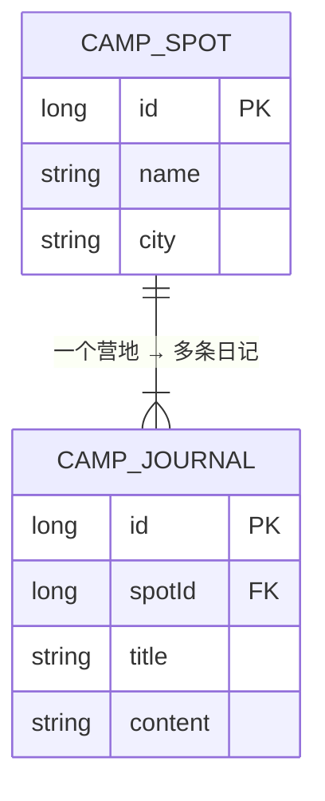
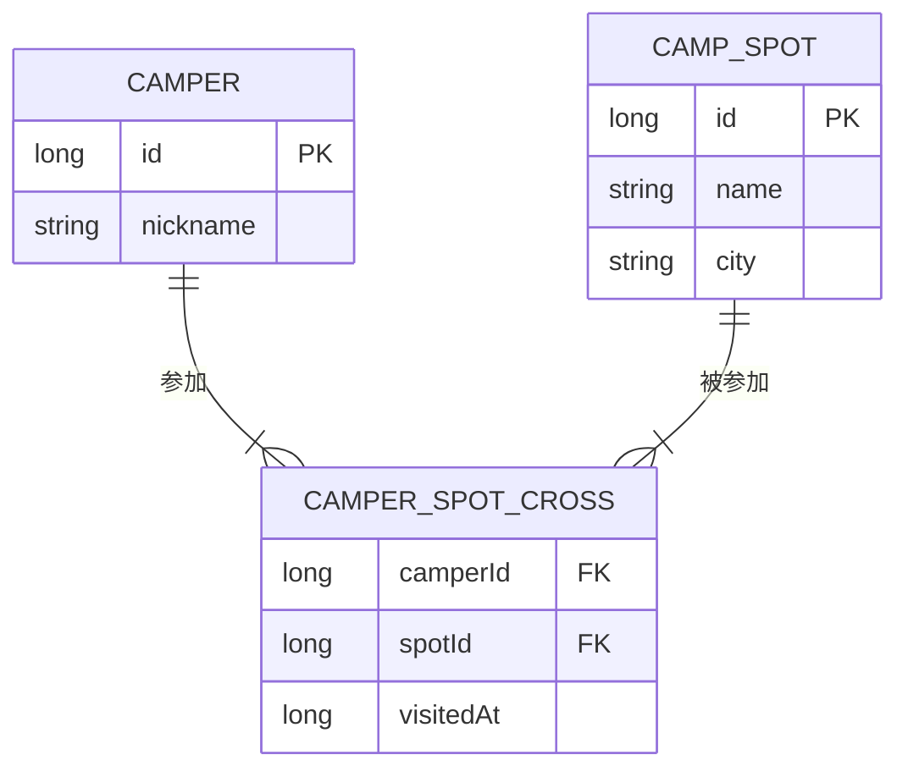
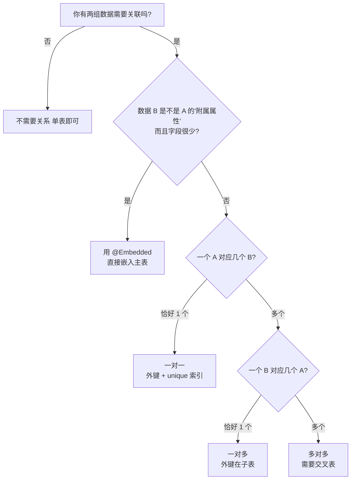
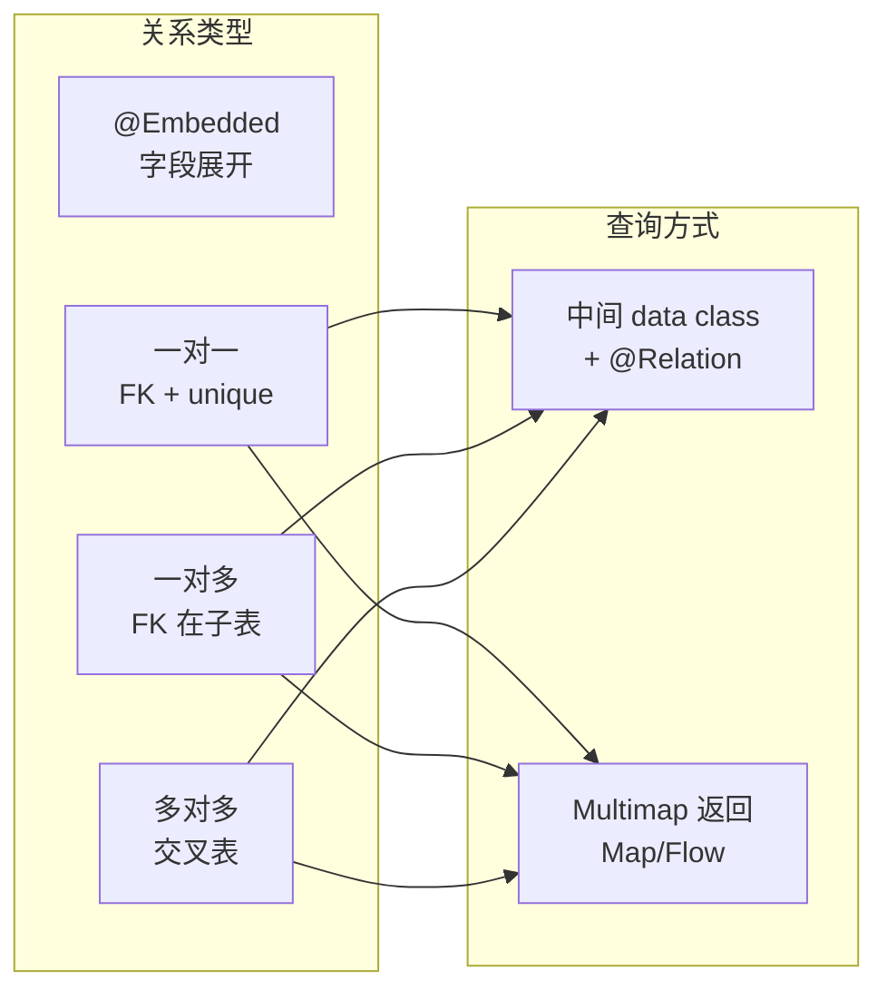

# 1.6.4 在对象之间选择关系类型

傍晚的营地比早晨多了一种颜色——金色。

夕阳从白桦林的间隙漏进来，照得草地上那块旧野餐布像一块铺了蜜糖的烤面饼。风铃在帐篷边缘发出短促而清亮的一声，好像在宣布："今天的甜点时间到了。"

洛芙正坐在那块野餐布上，双手抱着平板，表情介于"困惑"和"吃了柠檬"之间。

"我的营地数据存好了，DAO 也写好了，"她嘟囔着，把屏幕转向大家，"可是我想给每个营地加上'谁去过'——就是营友记录。结果我发现……我不知道该怎么把两张表连起来。"

她指着自己画在笔记本边缘的草图：一边是 `CampSpotEntity`，另一边是一个她刚想出来的 `CamperEntity`。两边之间画了一条虚线，虚线上方打了一个大大的问号。

希尔从保温杯里倒出大麦茶，杯口升起一缕淡淡的白烟。她看了一眼草图，忍住笑。

"你这条虚线，倒是很有艺术感。"

"我是认真的！"洛芙脸颊微微发红，"我在想……是不是把 camperId 直接塞进 CampSpotEntity 里就行了？"

"先别急。"黛琳站在白板前面，用记号笔在板面上写了一个问题——

**"一个营地可以有几个人去过？一个人可以去过几个营地？"**

洛芙歪着头想了想："一个营地当然可以有很多人去过呀。一个人……也可以去很多个营地。"

"那这就不是随便塞个 id 能解决的了。"黛琳笑了，"今天我们要聊的，就是数据之间的'关系类型'。这是数据库设计最核心的思维课——不是教你写哪个注解，而是教你**怎么想清楚数据之间的结构**。"

伊莎把毯子裹紧了一些（山里的傍晚降温快得像翻书），靠着帐篷柱子补充道："你可以把这想象成人际关系。有的人只有一个最好的朋友——一对一。有的人是一个班级里的老师，一个老师对很多学生——一对多。还有的像我们四个，互相都是露营搭档——多对多。"

洛芙眨了眨眼："数据库也有'社交关系'？"

"数据库就是一个沉默的社交网络。"希尔端着茶杯说，语气认真得像在陈述一条物理定律。

### 一对一：每个营地有且只有一个详细信息卡

"我们从最简单的开始。"黛琳在白板上画了两个方框。

"假设你的营地表 `CampSpotEntity` 存的是基本信息——名字、城市。可你还想给每个营地存一份详细介绍——描述文字、设施列表、夜间温度之类的。这些信息很长、很杂，不适合全塞在一张表里。"

"那就再开一张表？"洛芙试探地说。

"没错。"黛琳点头，"而且这两张表是**一对一**的关系——每个营地有且只有一份详情，每份详情只属于一个营地。"

```kotlin
// 代码片段 A：一对一关系的实体定义

// 表 1：营地基本信息
@Entity(tableName = "camp_spot")
data class CampSpotEntity(
    @PrimaryKey(autoGenerate = true)
    val id: Long = 0L,
    val name: String,
    val city: String,
    @ColumnInfo(name = "visited_at")
    val visitedAt: Long
)

// 表 2：营地详情（一对一）
// spotId 是外键，指向 camp_spot 表的 id
// 外键就像"身份证号的引用"—— 通过它你能准确找到对应的那条营地记录
@Entity(
    tableName = "camp_spot_detail",
    foreignKeys = [
        ForeignKey(
            entity = CampSpotEntity::class,
            parentColumns = ["id"],       // 被引用的表的主键
            childColumns = ["spotId"],     // 当前表中存储引用的列
            onDelete = ForeignKey.CASCADE  // 营地删了，详情跟着删
        )
    ],
    indices = [Index("spotId", unique = true)] // unique = true 保证一对一
)
data class CampSpotDetailEntity(
    @PrimaryKey(autoGenerate = true)
    val id: Long = 0L,
    val spotId: Long,          // 指向哪个营地
    val description: String,   // 营地描述
    val facilities: String,    // 设施（如"卫生间/烧烤架/停车场"）
    val nightTemp: Double      // 夜间平均温度（℃）
)
```

洛芙盯着 `ForeignKey` 看了好一会儿。"所以 `spotId` 就像一封介绍信，上面写着'我属于几号营地'？"

"非常准确。"希尔说，"而 `unique = true` 的索引保证了——每个营地最多只有一份详情。如果你试图给同一个营地插入两份详情，数据库会拒绝。"

"就像一个人的护照，"伊莎说，"一个人只能有一本，护照也只属于一个人。"

"等一下，"洛芙突然眯起眼睛，露出一种她在动脑筋时特有的表情——嘴角微微翘起，像一只正在追踪蝴蝶飞行轨迹的猫。"那如果我把详情直接变成营地的一个字段呢？不用两张表？"

黛琳赞赏地敲了一下白板："这就引出了另一个概念——`@Embedded`。"

### @Embedded：把小对象"溶"进大对象

"有时候你不想拆成两张表，因为数据量不大、查询也不复杂。这时候你可以用 `@Embedded`，把一个小对象的字段直接'展开'到主表的列里。"

```kotlin
// 代码片段 B：使用 @Embedded 嵌入地址信息

// 地址对象——不需要 @Entity 注解，它不是独立的表
// 它的字段会被"展开"，直接成为 CamperEntity 表中的列
data class Address(
    val street: String?,
    val state: String?,
    val city: String?,
    @ColumnInfo(name = "post_code")
    val postCode: Int = 0
)

// 营友实体
@Entity(tableName = "camper")
data class CamperEntity(
    @PrimaryKey(autoGenerate = true)
    val id: Long = 0L,
    val nickname: String,

    // @Embedded：把 Address 的所有字段"摊平"到 camper 表中
    // 最终表的列 = id + nickname + street + state + city + post_code
    // 优点：查询时不需要 JOIN，一次查出来
    // 缺点：如果地址逻辑很复杂，或者多个表都要用，考虑独立成表
    @Embedded
    val address: Address? = null
)
```

"也就是说，"洛芙用手指在空中比划，"数据库表里其实没有一列叫 'address'，而是有四列——street、state、city、post_code？"

"完全正确！`@Embedded` 是一种'拆包'，不是'打包'。"黛琳说。

伊莎举起一块饼干："想象你寄一个礼物盒给朋友。`@Embedded` 就是把盒子拆开，把里面的每件小礼物直接放进大行李箱的各个口袋里。朋友打开行李箱就能看到所有东西，不需要再找一个盒子打开它。"

洛芙笑了，鼻子皱起来："我终于能区分了——如果数据是'附属品'而且不复杂，用 `@Embedded` 嵌入；如果是独立的、有自己生命周期的数据，拆成另一张表。"

"说得真好。"希尔把茶杯举起来，像在敬酒。

### 一对多：一个营地被很多人写了日记

天色暗了一点，黛琳把头顶的营灯打开，暖黄的光晕落在白板上。

"好，接下来是最常见的关系——一对多。"

"比如一个营地可以有很多条露营日记，"洛芙抢答，"但每条日记只属于一个营地！"

"就是这个。"黛琳画了一个大方框、三个小方框，大方框用箭头指向三个小方框。



> 图 1：一对多关系的 ER 图——一个营地对应多条日记。

```kotlin
// 代码片段 C：一对多关系

// 日记表——每条日记通过 spotId 指向一个营地
@Entity(
    tableName = "camp_journal",
    foreignKeys = [
        ForeignKey(
            entity = CampSpotEntity::class,
            parentColumns = ["id"],
            childColumns = ["spotId"],
            onDelete = ForeignKey.CASCADE // 营地删了，对应日记也删
        )
    ],
    indices = [Index("spotId")] // 加索引：按 spotId 查会更快
)
data class CampJournalEntity(
    @PrimaryKey(autoGenerate = true)
    val id: Long = 0L,
    val spotId: Long,        // 外键：属于哪个营地
    val title: String,
    val content: String,
    val createdAt: Long = System.currentTimeMillis()
)

// 查询结果容器——一个营地 + 它的所有日记
// 这不是表，只是查询结果的"包装盒"
data class SpotWithJournals(
    @Embedded
    val spot: CampSpotEntity,

    // @Relation 告诉 Room：
    // 用 CampSpotEntity 的 id 去匹配 CampJournalEntity 的 spotId
    @Relation(
        parentColumn = "id",       // 父表的列
        entityColumn = "spotId"    // 子表的列
    )
    val journals: List<CampJournalEntity>
)
```

"这个 `SpotWithJournals` 真的好直观，"洛芙说，眼睛在暖黄灯光下闪着亮，"就像一个信封，里面装着营地和它所有的日记。"

"查询的时候也很简单。"希尔补充道。

```kotlin
// 代码片段 D：查询一对多关系的 DAO 方法

@Dao
interface CampSpotDao {
    // @Transaction 很重要！
    // 因为 Room 要执行两次查询（先查营地，再查日记），
    // 必须保证这两次查询之间数据不会被其他线程修改
    @Transaction
    @Query("SELECT * FROM camp_spot")
    fun observeSpotsWithJournals(): Flow<List<SpotWithJournals>>

    @Transaction
    @Query("SELECT * FROM camp_spot WHERE id = :spotId")
    suspend fun getSpotWithJournals(spotId: Long): SpotWithJournals?
}
```

洛芙把代码通读了一遍，突然停住了。

"希尔姐，为什么这里必须加 `@Transaction`？上一章我们用单表查询的时候没加呀。"

希尔放下茶杯，神情变得正式了一些："因为 `@Relation` 实际上会让 Room 发出**两条 SQL**——一条先查主表（营地），一条再用主表的 id 去子表（日记）里匹配数据。如果在这两条查询之间，另一个线程往日记表里插了一条新数据，你就会拿到不一致的结果。`@Transaction` 保证这两条查询在同一个事务里执行，中间不会被插队。"

"哦……"洛芙的眉头先紧后松，像在脑子里亲手解开了一个结，"所以**所有涉及关系查询的 DAO 方法，都应该加 @Transaction**！"

"正解。你可以把这条当作铁律写进笔记本。"黛琳说。

### 多对多：营友们和他们去过的营地

最后一缕夕阳从树梢退走，天空变成了深蓝渐紫的渐变色。远处的山线像剪纸一样贴在天幕上。

伊莎站起来活动了一下肩膀，然后突然说："洛芙，你、我、希尔、黛琳，我们四个人都去过多个营地，对吧？"

"当然。"

"那每个营地也被我们好几个人去过，对吧？"

洛芙瞪大了眼睛——那种"啊我明白了"的瞬间，像烟火在她的瞳孔里短暂亮了一下。

"这就是多对多！"

"聪明。"希尔的语气听起来像在夸一只成功跳上高台的猫（带着真心的赞叹和一点点好笑），"多对多不能靠一个外键解决，因为任何一方都不能独占另一方。**你需要第三张表——交叉表（Junction Table）**。"



> 图 2：多对多关系通过交叉表 `CAMPER_SPOT_CROSS` 实现。

黛琳在白板上画完图，转过身来："交叉表里每一行代表一个'谁去了哪个营地'的事实。比如'洛芙去了松林营地'是一行，'希尔去了松林营地'是另一行。"

```kotlin
// 代码片段 E：多对多关系的实体定义

// 营友表
@Entity(tableName = "camper")
data class CamperEntity(
    @PrimaryKey(autoGenerate = true) val id: Long = 0L,
    val nickname: String
)

// 交叉表（Junction Table / 关联表）
// 用复合主键：camperId + spotId 的组合必须唯一
// 这样同一个人对同一个营地只能有一条记录
@Entity(
    tableName = "camper_spot_cross",
    primaryKeys = ["camperId", "spotId"],
    foreignKeys = [
        ForeignKey(
            entity = CamperEntity::class,
            parentColumns = ["id"],
            childColumns = ["camperId"],
            onDelete = ForeignKey.CASCADE
        ),
        ForeignKey(
            entity = CampSpotEntity::class,
            parentColumns = ["id"],
            childColumns = ["spotId"],
            onDelete = ForeignKey.CASCADE
        )
    ],
    indices = [Index("camperId"), Index("spotId")]
)
data class CamperSpotCrossRef(
    val camperId: Long,
    val spotId: Long,
    val visitedAt: Long = System.currentTimeMillis()
)

// 查询结果：一个营友 + 她去过的所有营地
data class CamperWithSpots(
    @Embedded
    val camper: CamperEntity,

    @Relation(
        parentColumn = "id",
        entityColumn = "id",
        // associateBy 告诉 Room：
        // "通过 camper_spot_cross 这张交叉表来查找关系"
        associateBy = Junction(
            value = CamperSpotCrossRef::class,
            parentColumn = "camperId",  // 交叉表中对应 camper 的列
            entityColumn = "spotId"     // 交叉表中对应 spot 的列
        )
    )
    val spots: List<CampSpotEntity>
)

// 反向查询：一个营地 + 去过它的所有营友
data class SpotWithCampers(
    @Embedded
    val spot: CampSpotEntity,

    @Relation(
        parentColumn = "id",
        entityColumn = "id",
        associateBy = Junction(
            value = CamperSpotCrossRef::class,
            parentColumn = "spotId",
            entityColumn = "camperId"
        )
    )
    val campers: List<CamperEntity>
)
```

洛芙深吸一口气，傍晚的空气带着松针和泥土的微凉："这段代码比前面的长好多……但我居然看懂了。交叉表就像一个'签到本'，每一行记录了'谁在什么时间去了哪里'。`@Relation` 加 `@Junction` 是告诉 Room 怎么通过签到本把两边的人和营地配对。"

希尔看着她，眼神里有一种很温和的光："你进步了。真的。"

洛芙的耳朵尖微微发红，赶紧低头假装在看代码。

### Multimap：另一条路

"对了，"黛琳拍了一下手，"Room 2.4 以后还有一种更简洁的方式——**Multimap 返回类型**。你不需要创建 `CamperWithSpots` 这种中间类，直接在 DAO 的返回值里用 `Map` 就行。"

```kotlin
// 代码片段 F：Multimap 返回类型（Room 2.4+）
// 不需要定义中间 data class，直接返回 Map

@Dao
interface CamperSpotDao {
    // 返回 Map<CamperEntity, List<CampSpotEntity>>
    // Room 自动把 JOIN 的结果分组到 Map 里
    @Query(
        """
        SELECT * FROM camper
        INNER JOIN camper_spot_cross ON camper.id = camper_spot_cross.camperId
        INNER JOIN camp_spot ON camp_spot.id = camper_spot_cross.spotId
        """
    )
    fun loadCampersWithSpots(): Flow<Map<CamperEntity, List<CampSpotEntity>>>
}
```

洛芙的眼睛亮了："这也太简洁了！连中间类都不用建！"

"对。但要注意——Multimap 要求你自己写 JOIN 语句，SQL 会复杂一些。"希尔说，"两种方式各有优劣："

| 方式 | SQL 复杂度 | 代码复杂度 | 推荐场景 |
|------|-----------|-----------|---------|
| 中间 data class + `@Relation` | 低（Room 自动 JOIN） | 高（需要定义额外类） | 关系固定、多处复用 |
| Multimap 返回类型 | 高（需要手写 JOIN） | 低（不需要额外类） | 简单查询、只在一处使用 |

"如果你的关系查询只在一个地方用，Multimap 更轻便。如果很多地方都要用，中间类更清晰。"黛琳总结。

### 怎么选：决策分叉路

"说了这么多，"洛芙翻了翻笔记本，"我怎么知道什么时候用一对一、一对多、多对多、还是 `@Embedded` 呀？"

黛琳在白板上画了一棵决策树。



> 图 3：关系类型选择的决策树——从问题出发，不从注解出发。

洛芙盯着这棵树，嘴角慢慢上扬。

"这个图真好。以后我设计数据库之前，先来这棵树上走一遍，就不会乱了。"

"是的。"黛琳把笔帽扣好，"**先想关系，再写代码。** 不要先建表再想怎么连。那样就像你先买了三个不同尺寸的锅盖，然后到处找哪口锅能盖上。"

伊莎笑得趴在毯子上："这比喻太生动了，我的脑子里已经有三个锅盖在飞了。"

洛芙也笑了——大笑。那种笑声在山间的傍晚空气里传得很远，像松鼠跑过树枝时抖落的松果，清脆、短促、充满快活。

### 反模式：把关系硬塞进一张表

欢快的气氛还没散去，希尔忽然把脸一板，往白板上画了一个巨大的 ❌。

"我们来看一个'千万不要这样做'的例子。"

```kotlin
// 代码片段 G-1：反模式——把关联 id 和名字都硬塞进同一个实体
@Entity(tableName = "bad_journal")
data class BadJournalEntity(
    @PrimaryKey(autoGenerate = true) val id: Long = 0L,
    val title: String,
    val content: String,
    val spotName: String,       // 关联营地的名字直接存在日记里
    val camperNickname: String  // 写日记的人的昵称也直接存
)
```

"这有什么问题呢？"希尔看着洛芙。

洛芙想了几秒钟，然后像被弹簧弹起来一样拍了桌子："如果营地改名了呢？！我得找到所有日记里那个营地名字然后逐条改！"

"Bingo。"希尔给了一个简洁的认可，"这叫**数据冗余**。同一份信息存了多个副本，一改就要全部同步，否则就出现不一致。正确的做法是只存 `spotId`，查询时用关系 JOIN 读营地名。"

```kotlin
// 代码片段 G-2：重构后——只存外键 id
@Entity(tableName = "good_journal")
data class GoodJournalEntity(
    @PrimaryKey(autoGenerate = true) val id: Long = 0L,
    val title: String,
    val content: String,
    val spotId: Long,     // 只存引用，不存冗余数据
    val camperId: Long    // 同理
)
```

"只存 id，名字通过关系查。"洛芙认真地在笔记本上画了一条红线，"这就是 '**事实只存一份**' 的原则。"

---

天色已经完全暗下来了。帐篷里的灯光从缝隙里渗出来，像一个个发亮的琥珀方块。远处的山脊上方，有两三颗星星已经亮了，不是很耀眼，但正因为不耀眼，才显得格外真诚。

洛芙抱着膝盖坐在折叠椅上，目光从屏幕移到星空，又从星空移回屏幕。

"我今天学到的不只是技术，"她轻轻说，"我学到了一种思考方式。先问'它们之间是什么关系'，再决定'怎么建表'。"

黛琳收拾白板，声音带着一种温暖的确定："你以后会发现，所有好的架构设计，都从'关系梳理'开始。不管是数据库、模块之间、还是人与人之间。"

"说得好，"希尔站起来伸了个懒腰，把空杯子挂在背包侧面的扣环上，"明天我们就动手实现这些关系——先从一对一开始。"

伊莎裹着毯子哈了一口白气："今晚的星星少了一点，不过刚好够我们四个，一人一颗。"

洛芙笑了。笑的时候，风铃又响了一声——这回是两个声音叠在一起，一高一低，像在和声。

---

### 技术总结

> Room 不允许实体之间直接对象引用（不能在 Entity A 中直接引用 Entity B 的实例）。你需要通过外键（`ForeignKey`）和关系注解（`@Relation`、`@Junction`、`@Embedded`）来表达数据间的结构关系。关系类型的选择取决于业务语义：一对一、一对多和多对多各有适用场景，`@Embedded` 则用于把小型附属对象展开到主表中。

#### 今日关键词

1. **ForeignKey**：外键约束，通过引用主表的主键来建立表间连接。
2. **@Relation**：声明关系查询中父子表的映射列。
3. **@Embedded**：将子对象的字段展开到父表的列中，不建独立表。
4. **@Junction**：指定多对多关系的交叉表。
5. **一对一**：外键 + unique 索引，保证每条父记录最多一条子记录。
6. **一对多**：外键在子表，父记录可对应多条子记录。
7. **多对多**：需要交叉表（Junction Table），两端各自通过外键引用交叉表。
8. **Multimap**：Room 2.4+ 的简洁查询方式，直接返回 `Map<A, List<B>>`。

#### 结构图



> 图 4：四种关系类型与两种查询方式的组合选择。

#### 反模式与陷阱

1. **直接在实体中存关联数据的"名字"而不是 id**：数据冗余，改一处需改多处。
   * **修复**：只存外键 id，查询时 JOIN。
2. **缺少外键约束**：没有 `ForeignKey` 时，子表可以引用不存在的父表 id。
   * **修复**：始终声明外键，并设置 `onDelete` 策略。
3. **关系查询不加 @Transaction**：Room 发出两条 SQL，中间数据可能变化。
   * **修复**：所有使用 `@Relation` 的 DAO 方法都加 `@Transaction`。
4. **@Embedded 滥用**：把独立的、有生命周期的数据用 `@Embedded` 嵌入。
   * **修复**：只对"附属属性"（如地址、坐标）使用 `@Embedded`。
5. **多对多忘记建交叉表**：试图在某一方存 List<id>。
   * **修复**：使用独立的 Junction Table + `@Junction` 注解。

#### 面试热身 (Interview Warm-up)

> 请尝试用自己的语言回答以下问题，能说清楚才是真的懂了。

1. **Q1**：Room 中 `@Embedded` 和 `@Relation` 的区别是什么？分别适用于什么场景？
2. **Q2**：外键的 `onDelete = CASCADE` 是什么意思？如果不设置会怎样？
3. **Q3**：为什么多对多关系需要交叉表？直接在一方存 `List<Long>` 行不行？
4. **Q4**：使用 `@Relation` 查询时为什么必须加 `@Transaction`？
5. **Q5**：Multimap 返回类型和中间 data class 方式各有什么优缺点？

#### 参考实现要点

1. **先画 ER 图再写代码**：在编辑器之前先在纸上画关系图，确认清楚每组数据是一对一、一对多还是多对多。
2. **外键始终声明**：即使 SQLite 不强制，也要写 `ForeignKey`——它既是文档也是约束。
3. **@Relation 查询必加 @Transaction**：这是铁律，无例外。
4. **小附属数据用 @Embedded**：地址、坐标、尺寸这类"不会独立存在"的数据直接嵌入。
5. **交叉表额外字段**：交叉表可以存关系的"属性"（如到访时间、评分），不要只有两个 id。

> 💡 **学习建议**：设计数据关系时，先问自己"一个 A 对应几个 B？一个 B 又对应几个 A？"回答完这两个问题，走一遍决策树（图 3），再动手写代码。千万不要"先建一堆表，再想怎么连"。

---

### 🏕️ 动手练习：给数据牵线搭桥

#### Task 1 · 嵌入地址 (Address Card) ★

**目标**：用 `@Embedded` 给营友实体添加地址信息。

**你需要做的事**：
1. 定义一个 `Address` data class（包含 street、city、postCode）。
2. 在 `CamperEntity` 中用 `@Embedded` 引入 `Address`。
3. 插入一条带地址的营友数据，查询后验证地址字段正常回读。

**验收标准**：
- [ ] 数据库表中出现 street、city、post_code 列
- [ ] 查询结果的 `address.city` 等字段值正确

---

#### Task 2 · 一对一详情 (Spot Profile) ★★

**目标**：为营地创建一个一对一的详情表。

**你需要做的事**：
1. 定义 `CampSpotDetailEntity`，包含 `spotId`（外键）、description、facilities、nightTemp。
2. 外键设置 `onDelete = CASCADE`，索引设置 `unique = true`。
3. 定义 `SpotWithDetail` data class（`@Embedded` + `@Relation`）。
4. 写 DAO 方法查询某个营地及其详情。

**验收标准**：
- [ ] 一个营地只能有一份详情（第二次插入被拒绝）
- [ ] 删除营地后详情也被级联删除

---

#### Task 3 · 一对多日记 (Journal Collection) ★★★

**目标**：实现"一个营地对应多条日记"的完整链路。

**你需要做的事**：
1. 定义 `CampJournalEntity`，外键指向 `camp_spot` 的 id。
2. 定义 `SpotWithJournals`（`@Embedded` + `@Relation`）。
3. 在 DAO 中写 `@Transaction` + `@Query` 方法查询所有营地及其日记。
4. 插入 2 个营地，分别各写 3 条日记，验证查询结果。

**验收标准**：
- [ ] 每个 `SpotWithJournals` 包含正确数量的日记
- [ ] 日记的 `spotId` 与对应营地的 id 一致

---

#### Task 4 · 级联清理 (Cascade Cleanup) ★★★

**目标**：验证 `onDelete = CASCADE` 的行为。

**你需要做的事**：
1. 插入一个营地 + 3 条关联日记。
2. 删除该营地。
3. 查询日记表，确认关联日记已被自动删除。
4. **对照实验**：创建一个不设 `ForeignKey` 的版本，删除营地后查日记表——日记仍然存在（成为"孤儿数据"）。

**验收标准**：
- [ ] CASCADE 版：删除营地后日记为 0
- [ ] 无外键版：删除营地后日记仍存在

---

#### Task 5 · 多对多签到 (Multi-Visit) ★★★★

**目标**：实现"营友 ↔ 营地"的多对多关系。

**你需要做的事**：
1. 定义 `CamperEntity`、`CamperSpotCrossRef`（交叉表）。
2. 定义 `CamperWithSpots` 和 `SpotWithCampers`。
3. 插入 3 个营友、2 个营地，在交叉表中记录至少 4 条访问关系。
4. 分别查询"某营友去过的所有营地"和"某营地接待过的所有营友"。

**验收标准**：
- [ ] 双向查询结果正确
- [ ] 同一对 camperId + spotId 不能重复插入

---

#### Task 6 · Multimap 简写 (Map Shortcut) ★★★★

**目标**：用 Multimap 返回类型替代中间 data class 查询多对多关系。

**你需要做的事**：
1. 在 DAO 中写一个使用 `INNER JOIN` 的查询方法，返回 `Map<CamperEntity, List<CampSpotEntity>>`：
   ```kotlin
   @Query(
       """
       SELECT * FROM camper
       INNER JOIN camper_spot_cross ON camper.id = camper_spot_cross.camperId
       INNER JOIN camp_spot ON camp_spot.id = camper_spot_cross.spotId
       """
   )
   fun loadCampersWithSpots(): Flow<Map<CamperEntity, List<CampSpotEntity>>>
   ```
2. 用 `collect` 收集结果，打印每个营友及其对应的营地列表。
3. **对比**：和 Task 5 中使用 `@Relation + @Junction` 的方式对比代码量和可读性，写下你的结论。

**验收标准**：
- [ ] Multimap 查询结果与 Task 5 的结果一致
- [ ] 能用文字说明两种方式的优缺点

---

#### Task 7 · 关系决策练习 (Decision Tree) ★★★★

**目标**：对五个真实场景做出正确的关系类型判断。

**你需要做的事**：  
请不要写代码，只用文字回答以下问题，并说明理由：

1. **用户 ↔ 用户设置**（每个用户有且只有一份偏好设置）→ 你选什么关系？
2. **订单 ↔ 订单项**（一个订单有多个商品条目）→ 你选什么关系？
3. **学生 ↔ 课程**（一个学生可以选多门课，一门课有多个学生）→ 你选什么关系？
4. **营地 ↔ GPS 坐标**（坐标只有经度纬度，永远不会独立查询）→ 你选什么方式？
5. **文章 ↔ 标签**（一篇文章多个标签，一个标签被多篇文章使用）→ 你选什么关系？

**验收标准**：
- [ ] 每个问题给出了明确答案
- [ ] 每个答案给出了理由（不少于一句话）

---

#### Task 8 · 综合关系项目 (Camp Social Network) ★★★★★

**目标**：构建一个包含所有关系类型的小型"营地社交网络"数据库。

**你需要做的事**：
1. 定义以下表：
   - `CamperEntity`（营友，`@Embedded` 嵌入 `Address`）
   - `CampSpotEntity`（营地）
   - `CampSpotDetailEntity`（营地详情，一对一）
   - `CampJournalEntity`（日记，一对多：属于某营地）
   - `CamperSpotCrossRef`（交叉表，多对多：营友 ↔ 营地）
2. 定义查询容器：`SpotWithDetail`、`SpotWithJournals`、`CamperWithSpots`。
3. 在 Database 中注册所有表。
4. 编写一个测试类，按以下流程执行：
   - 插入 2 个营友（含地址）、2 个营地（含详情）、4 条日记、3 条访问记录。
   - 查询"某营友去过的所有营地及其详情"。
   - 查询"某营地的所有日记"。
   - 删除一个营地，验证详情和日记都被级联删除。
5. 所有测试通过。

**验收标准**：
- [ ] 5 张表全部定义正确，编译通过
- [ ] 查询结果正确
- [ ] 级联删除生效
- [ ] 测试全绿

---

### 🍭 洛芙的小小日记本

今天我学到了一件很美的事：数据之间也有"关系"。一对一像闺蜜，一对多像老师和学生，多对多像我们这群一起露营的朋友。最让我开心的是那棵决策树——以后我再也不用在"该怎么建表"这个问题上焦虑了。先想关系，再写代码。就像先想清楚要去哪座山，再决定带什么装备。🏕️
