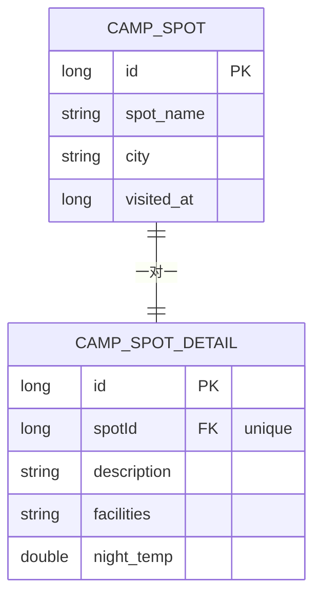
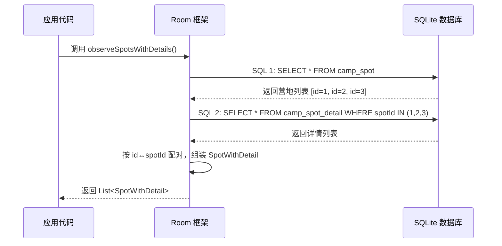
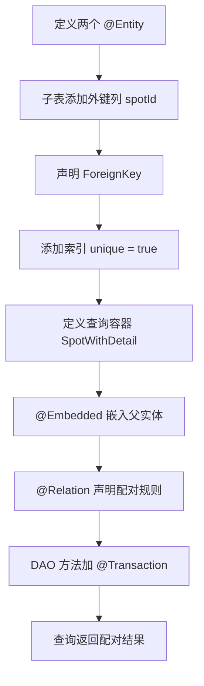

# 1.6.5 定义和查询一对一关系

## 1.6.5 一对一：给每个营地一张独一无二的身份证

清晨的山间营地有一种独特的安静——被薄雾、鸟鸣和远处溪水声填满了的静。

帐篷里的拉链被拉开了一小截，洛芙把脸贴在缝隙上往外看。白桦林的树干在薄雾中像一排排没擦干净的银色笔杆，树冠顶上，太阳还没露面，但天际线已经被染成一种温柔的灰蓝色——介于"还在睡"和"快要醒了"之间。

她打了个小小的哈欠，把笔记本从睡袋旁边抽出来。

昨晚的白板字迹还在脑子里:

> *"明天我们就动手实现这些关系——先从一对一开始。"*

那是希尔的声音。洛芙翻开笔记本最新一页，用力在标题栏写了一行字：

**「一对一关系 · 实战日」**

她刚写完，帐篷外面传来了一声清脆的"啪"——希尔把折叠桌的锁扣打开了。

"哟，你已经醒了？"希尔朝帐篷方向瞥了一眼，手里端着一杯刚冲好的挂耳咖啡，蒸汽在晨雾里弯弯曲曲地升起来，像一只正在学飞的透明蝴蝶。

洛芙钻出帐篷，头发还乱着，一根草茎不知何时粘在了她的发梢上。

"我昨晚翻来覆去在想一对一关系的事情，"她坐到折叠椅上，把草茎从头发上摘下来端详了一秒，然后弹飞了，"你说每个营地有且只有一份详情，每份详情也只属于一个营地——可是我还没真正动手写过。理论是理论，代码是代码。"

"说得很对。"黛琳不知什么时候已经坐在了折叠桌对面，膝盖上摊着笔记本电脑，屏幕亮度调得很低，在晨光里几乎看不出来。她的声音一如既往地沉稳，像一块永远放在正确位置的锚，"理论只是地图，代码才是脚下的路。今天我们就把地图上的'一对一'变成可以编译运行的真实代码。"

伊莎从帐篷里端了四杯热可可出来（她总是在别人不注意的时候准备好这些温暖的小东西），把它们挨个放在桌面上，热气在清晨的冷空气中升起四缕短短的白烟。

"走吧，"她微笑着，"让我们给每个营地做一张独一无二的身份证。"

### 第一步：定义两张表

黛琳把笔记本电脑的屏幕转向大家。屏幕上是两段代码——两个 `@Entity`。

"一对一关系的第一步很简单：你需要两张表。其中一张表（子表）里有一列存着另一张表（父表）的主键值。这一列叫做**外键**。"

```kotlin
// 代码片段 A：两张表的定义

// 父表：营地基本信息
@Entity(tableName = "camp_spot")
data class CampSpotEntity(
    @PrimaryKey(autoGenerate = true)
    val id: Long = 0L,

    @ColumnInfo(name = "spot_name")
    val name: String,

    val city: String,

    @ColumnInfo(name = "visited_at")
    val visitedAt: Long = System.currentTimeMillis()
)

// 子表：营地详情（一对一关系）
// ForeignKey：声明 spotId 是 camp_spot 表的 id 的外键引用
// onDelete = CASCADE：父记录删除时，子记录自动删除
// indices 中 unique = true：保证每个 spotId 只出现一次（即"一对一"而非"一对多"）
@Entity(
    tableName = "camp_spot_detail",
    foreignKeys = [
        ForeignKey(
            entity = CampSpotEntity::class,
            parentColumns = ["id"],
            childColumns = ["spotId"],
            onDelete = ForeignKey.CASCADE
        )
    ],
    indices = [Index(value = ["spotId"], unique = true)]
)
data class CampSpotDetailEntity(
    @PrimaryKey(autoGenerate = true)
    val id: Long = 0L,

    val spotId: Long,           // 外键列：指向 camp_spot 的 id

    val description: String,    // 营地描述

    val facilities: String,     // 设施列表，如 "卫生间/烧烤架/停车场"

    @ColumnInfo(name = "night_temp")
    val nightTemp: Double       // 夜间平均气温（℃）
)
```

洛芙盯着 `ForeignKey` 那块代码看了好几秒。

"所以 `spotId` 不只是一个普通的数字列——它是带着'承诺'的？"

"你可以这么理解。"黛琳的手指轻轻敲在键盘边框上，节奏缓慢，"普通的 `Long` 列，数据库不管你往里面填什么。但声明了 `ForeignKey` 之后，数据库会**检查**这个值是不是真的对应着 `camp_spot` 表里某条记录的 `id`。如果你试图插入一个 `spotId = 999` 但 `camp_spot` 里根本没有 `id = 999` 的记录，数据库会直接报错拒绝。"

"就像，"伊莎用手指绕着杯口的蒸汽画了一个圈，"你去邮局寄信，写了一个收件地址。如果那个地址不存在，邮局不是把信扔了——而是直接退回给你说'查无此人'。外键就是邮局的地址校验系统。"

洛芙"哦"了一声，眼睛亮了一下。

"那 `unique = true` 呢？"

"这是一对一的守护者。"希尔接过话，从挂耳咖啡杯上方露出半张脸，"如果没有 `unique = true`，同一个 `spotId` 可以出现两次、三次、无数次——那就变成了一对多。加了 `unique = true`，数据库保证：每个 `spotId` 只能出现一次。第二份详情试图挤进来的时候，就会被拒之门外。"



> 图 1：camp_spot 与 camp_spot_detail 的一对一 ER 图。spotId 上的 `unique` 约束保证了每个营地最多有一份详情。

洛芙仔细端详这张图，然后在笔记本上画了一个缩略版。

"好的，两张表我懂了。但是……我怎么一次性查出来一个营地加上它的详情？总不能先查营地，再用 `spotId` 去查详情，自己合在一起吧？"

黛琳嘴角微微上扬。那是一种"你的问题提得恰到好处"的表情。

### 第二步：定义查询结果容器

"你不需要手动合并。"黛琳新开了一个文件，"Room 提供了 `@Relation` 注解，专门做这件事。你只需要告诉 Room：'我想把这两张表配对，配对的根据是主表的 `id` 和子表的 `spotId`。'然后 Room 自动帮你写两条 SQL 并把结果合在一起。"

```kotlin
// 代码片段 B：查询结果容器（不是 @Entity，不对应表！）

// SpotWithDetail 是一个"包装盒"，把一个营地和它的详情打包在一起
// @Embedded：把 CampSpotEntity 的所有列拉入这个容器
// @Relation：告诉 Room 怎么去匹配子表
data class SpotWithDetail(
    @Embedded
    val spot: CampSpotEntity,

    @Relation(
        parentColumn = "id",       // 父表 CampSpotEntity 的主键列名
        entityColumn = "spotId"    // 子表 CampSpotDetailEntity 中引用父表的列名
    )
    val detail: CampSpotDetailEntity?
    // 注意：用 ? 可空类型，因为有可能某个营地还没有录入详情
)
```

洛芙的嘴巴张成了一个小小的"O"。

"就这么简单？我以为要写 JOIN 语句！"

"Room 帮你写了。"希尔打了一个响指，"这就是 `@Relation` 的好处——你不需要手写 JOIN，Room 会在编译期自动生成两条查询语句。但正因为是两条 SQL，你需要加 `@Transaction`。"

"对，这一点上一章我们说过了。"洛芙在笔记本上画了一个醒目的红圈，在里面写上 `@Transaction`。

### 第三步：写 DAO 查询方法

希尔把笔记本电脑接过来，手指在键盘上飞快地敲了一段代码。

"DAO 方法非常直观——"

```kotlin
// 代码片段 C：DAO 查询方法

@Dao
interface CampSpotDao {

    // 插入营地
    @Insert(onConflict = OnConflictStrategy.REPLACE)
    suspend fun insertSpot(spot: CampSpotEntity): Long

    // 插入详情
    @Insert(onConflict = OnConflictStrategy.REPLACE)
    suspend fun insertDetail(detail: CampSpotDetailEntity)

    // 查询所有营地及其详情（一对一）
    // @Transaction：保证两条内部 SQL 在同一个事务中执行
    // SELECT * FROM camp_spot 只查父表，@Relation 会自动触发子表查询
    @Transaction
    @Query("SELECT * FROM camp_spot ORDER BY visited_at DESC")
    fun observeSpotsWithDetails(): Flow<List<SpotWithDetail>>

    // 查询单个营地及其详情
    @Transaction
    @Query("SELECT * FROM camp_spot WHERE id = :spotId")
    suspend fun getSpotWithDetail(spotId: Long): SpotWithDetail?
}
```

"嗯，这段我有个疑问。"洛芙指着 `@Query("SELECT * FROM camp_spot ...")` 那行，"这里明明只写了从 camp_spot 查询，为什么能拿到 camp_spot_detail 的数据呢？"

这是一个极好的问题。伊莎用手指点了点代码中的 `@Relation` 信息。

"你可以想象 Room 在编译时看到了你的 `SpotWithDetail` 这个包装盒，它发现盒子里有一个打了 `@Relation` 标签的 `detail` 字段。于是 Room 心想：'哦，主人想要详情数据，parentColumn 是 id，entityColumn 是 spotId。'然后它偷偷地帮你多写了一条 SQL——"

黛琳在旁边补充，语气平静如水面：

"Room 实际上执行了两条 SQL：第一条是你写的 `SELECT * FROM camp_spot`，拿到所有营地的 id。第二条是 Room 自动生成的 `SELECT * FROM camp_spot_detail WHERE spotId IN (:ids)`，用第一条查出来的 id 集合作为参数。然后它把结果合并到一起，填入 `SpotWithDetail` 对象。"



> 图 2：Room 处理 `@Relation` 查询的内部流程——先查父表，再自动查子表，最后配对。这就是必须加 `@Transaction` 的原因：两条 SQL 之间数据不能被修改。

洛芙盯着时序图看了好一会儿，然后慢慢点头。晨雾在她身后的树林里正在退散，被阳光一点一点地"喝"掉。

"我明白了。Room 是个好管家——你告诉它关系规则，它帮你跑腿查数据，你只管收包裹。"

### 第四步：让代码跑起来

"光看不练假把式。"希尔把电脑转过来，代码已经写好了一段 Activity 里的调用逻辑。

"我们直接插入数据并验证查询结果。"

```kotlin
// 代码片段 D：在 Activity 或 ViewModel 中使用

// 步骤 1：插入一个营地，获得自动生成的 id
val spotId = dao.insertSpot(
    CampSpotEntity(
        name = "松林湖畔营地",
        city = "青山市"
    )
)

// 步骤 2：用这个 id 插入对应的详情
dao.insertDetail(
    CampSpotDetailEntity(
        spotId = spotId,
        description = "白桦林环绕的湖畔草地，晚上能看到银河",
        facilities = "卫生间/烧烤架/停车场/淋浴间",
        nightTemp = 12.5
    )
)

// 步骤 3：查询并打印
val result = dao.getSpotWithDetail(spotId)
Log.d("OneToOne", "营地: ${result?.spot?.name}")
Log.d("OneToOne", "详情: ${result?.detail?.description}")
Log.d("OneToOne", "设施: ${result?.detail?.facilities}")
Log.d("OneToOne", "夜温: ${result?.detail?.nightTemp}℃")
```

"运行一下看看？"洛芙凑过去看屏幕。

希尔按下运行按钮。几秒之后，Logcat 里出现了输出：

```
D/OneToOne: 营地: 松林湖畔营地
D/OneToOne: 详情: 白桦林环绕的湖畔草地，晚上能看到银河
D/OneToOne: 设施: 卫生间/烧烤架/停车场/淋浴间
D/OneToOne: 夜温: 12.5℃
```

洛芙用双手捂住了嘴——那种"哇它真的跑起来了"的惊喜表情，像是第一次看到露营地的湖面倒映星空。

"完美配对。"伊莎微笑着端起热可可。

### 第五步：验证"一对一"的唯一性

"现在我们来验证 `unique = true` 到底管不管用。"希尔的语气里带着一种实验者特有的期待，"我尝试给同一个营地插入第二份详情。"

```kotlin
// 代码片段 E：验证 unique 约束

// 第二份详情——spotId 和第一份一样
try {
    dao.insertDetail(
        CampSpotDetailEntity(
            spotId = spotId,  // 同一个营地！
            description = "这是第二份详情，不应该存在",
            facilities = "无",
            nightTemp = 0.0
        )
    )
} catch (e: android.database.sqlite.SQLiteConstraintException) {
    Log.e("OneToOne", "约束冲突：一个营地只能有一份详情！", e)
}
```

Logcat 输出：

```
E/OneToOne: 约束冲突：一个营地只能有一份详情！
            android.database.sqlite.SQLiteConstraintException:
            UNIQUE constraint failed: camp_spot_detail.spotId
```

"看到了吗？"希尔拍了一下桌面，凉飕飕的晨风被震出一小圈涟漪，"数据库直接拒绝了。`UNIQUE constraint failed` ——这就是 `unique = true` 在守卫一对一关系。如果没有这个约束，第二份详情会悄悄溜进去，你的数据就从'一对一'变成了'一对多'，而且你可能很久之后才发现bug。"

洛芙在笔记本上用力画了一条下划线：

> **unique = true 是一对一关系的门卫。没有它，一对一就是一句空话。**

### 反模式：把详情塞进主表——省了一张表，埋了一个隐患

"既然我懂了一对一，"洛芙放下笔，歪着头想了想，"那我有一个问题——为什么不直接把 description、facilities、nightTemp 全塞到 CampSpotEntity 里呢？这样不就不需要第二张表了吗？"

黛琳和希尔对视了一下。希尔先开口了。

"好问题。来，我给你看两个版本的对比。"

```kotlin
// 代码片段 F-1：反模式——全部硬塞进一张表
// 乍看简单，实际有三个问题

@Entity(tableName = "camp_spot_fat")
data class CampSpotFatEntity(
    @PrimaryKey(autoGenerate = true)
    val id: Long = 0L,
    val name: String,
    val city: String,
    val visitedAt: Long = System.currentTimeMillis(),

    // 详情字段直接放在主表里
    val description: String? = null,   // 经常为 null
    val facilities: String? = null,    // 经常为 null
    val nightTemp: Double? = null      // 经常为 null
)
```

"问题一，"希尔竖起一根手指，"**null 泛滥**。不是每个营地都有详情，大部分记录的这三个字段都是 null。你的表变得又宽又稀疏。"

"问题二，"黛琳竖起第二根手指，"**职责不清**。营地基本信息和营地详情是两组不同生命周期的数据。基本信息在创建营地时就确定了，详情可能后来才添加、还可能被编辑多次。混在一张表里，更新详情时不得不连基本信息一起加载。"

"问题三，"伊莎竖起第三根手指，声音轻柔但准确，"**无法独立进化**。将来如果详情要增加十个新字段（经度、纬度、评分、照片数量……），主表会被撑得越来越大。而如果是独立的子表，你只需要给子表加列，主表纹丝不动。"

```kotlin
// 代码片段 F-2：重构后——独立子表
// 职责分离，各自进化

// 主表：只存基本信息
@Entity(tableName = "camp_spot")
data class CampSpotEntity(
    @PrimaryKey(autoGenerate = true) val id: Long = 0L,
    val name: String,
    val city: String,
    val visitedAt: Long = System.currentTimeMillis()
)

// 子表：只存详情
@Entity(
    tableName = "camp_spot_detail",
    foreignKeys = [ForeignKey(
        entity = CampSpotEntity::class,
        parentColumns = ["id"],
        childColumns = ["spotId"],
        onDelete = ForeignKey.CASCADE
    )],
    indices = [Index(value = ["spotId"], unique = true)]
)
data class CampSpotDetailEntity(
    @PrimaryKey(autoGenerate = true) val id: Long = 0L,
    val spotId: Long,
    val description: String,
    val facilities: String,
    val nightTemp: Double
)
```

洛芙翻着笔记本，在"反模式"那一页画了一个交叉的红色大叉："所以原则是——**如果数据有独立的生命周期或可能独立扩展，就拆成独立的表；如果只是三两个附属小字段且不会独立存在，可以用 @Embedded 嵌入**。"

"精确。"黛琳说。阳光终于翻过了树梢，落在她的笔记本键盘上，把几个按键照得白亮。

### 用 Multimap 查询一对一

太阳升高了一些，薄雾彻底退散，露水在草叶上闪着碎钻一样的光。四个人的影子在折叠桌上拉长、缩短、又拉长，随着阳光角度的变化缓慢呼吸。

"顺便提一下，"黛琳说着打开一个新文件，"除了 `@Relation` 中间类的方式，你也可以用 Multimap 返回类型来查一对一。"

```kotlin
// 代码片段 G：Multimap 方式查询一对一
// 不需要定义 SpotWithDetail 中间类
// 直接返回 Map<CampSpotEntity, CampSpotDetailEntity>

@Dao
interface CampSpotDao {

    @Query(
        """
        SELECT * FROM camp_spot
        INNER JOIN camp_spot_detail
        ON camp_spot.id = camp_spot_detail.spotId
        """
    )
    fun loadSpotsWithDetails(): Flow<Map<CampSpotEntity, CampSpotDetailEntity>>
}
```

"这种方式不需要 SpotWithDetail 那个包装类，"黛琳说，"但你需要自己写 JOIN 语句，而且如果某个营地还没有详情，它不会出现在结果里——因为 `INNER JOIN` 只返回两边都有的配对。"

"而用 `@Relation` 的方式，"希尔补充，"如果 detail 声明为可空类型 `?`，那没有详情的营地也会出现在结果里，只是 detail 为 null。两种方式各有适用场景。"

| 方式 | 未配对数据的处理 | 代码量 | SQL 复杂度 |
|------|----------------|--------|-----------|
| `@Relation` 中间类 | 保留（detail 为 null） | 需定义中间类 | 低（Room 自动 JOIN） |
| Multimap (`Map<A, B>`) | 丢弃（INNER JOIN） | 无需中间类 | 高（手写 JOIN） |

洛芙记完表格，抬头看了看天空。一只山雀从白桦林里飞出来，划过她头顶的空气，翅膀尖在阳光里闪了一下。

### 级联删除的真实面貌

"还有一件事我想验证。"洛芙合上笔记本，双手放在桌面上，"昨天我们说过 `onDelete = CASCADE`，营地删了详情跟着删。我想亲眼看到它发生。"

"好。"希尔已经准备好了代码。

```kotlin
// 代码片段 H：级联删除验证

// 先确认数据存在
val before = dao.getSpotWithDetail(spotId)
Log.d("Cascade", "删除前：${before?.spot?.name} -> ${before?.detail?.description}")

// 删除营地
dao.deleteSpot(before!!.spot)

// 再查一次
val afterSpot = dao.findSpotById(spotId)
val afterDetail = dao.findDetailBySpotId(spotId)
Log.d("Cascade", "营地还在吗？ ${afterSpot != null}")
Log.d("Cascade", "详情还在吗？ ${afterDetail != null}")
```

```
D/Cascade: 删除前：松林湖畔营地 -> 白桦林环绕的湖畔草地，晚上能看到银河
D/Cascade: 营地还在吗？ false
D/Cascade: 详情还在吗？ false
```

"两条都消失了。"洛芙的声音里带着一种亲眼见证物理定律生效的满足感，"营地被删掉的瞬间，详情也像影子一样消失了。"

"如果不设 `onDelete = CASCADE` 呢？"伊莎轻声问。

"那详情就变成了孤儿。"希尔用手指在空气中画了一条断裂的线，"它还在数据库里占着空间，spotId 指向一个已经不存在的营地。这叫**孤儿数据**——你查不到它属于谁，删不掉它因为没人知道它的存在，但它就是在那里，默默地浪费着你的存储空间和查询效率。"

洛芙眉头皱了一下，然后舒展开来："所以 CASCADE 不只是方便——它是数据卫生的守护者。"

### 什么时候该用 @Embedded 代替一对一

"还有最后一个问题。"洛芙翻到笔记本的新一页，"昨天说过的 `@Embedded`——它和今天的'一对一外键'方案，怎么选？"

黛琳手指轻敲了两下桌面。

"记住一条简单的判断规则：**如果子数据没有自己的主键、不会被独立查询、字段很少（不超过三四个）**，用 `@Embedded`。其他情况——子数据有独立生命周期、可能被单独查询、字段会随时间增多——用一对一外键。"

| 判断维度 | `@Embedded` | 一对一外键 |
|---------|-------------|-----------|
| 子数据有主键？ | 否 | 是 |
| 需要独立查询子数据？ | 否 | 是 |
| 子数据字段数量 | 少（2-4个） | 多或会增长 |
| 生命周期和父数据一致？ | 是 | 不一定 |
| 级联删除需求？ | 自动（同一行） | 需要声明 CASCADE |

"这张表我要裱起来。"洛芙用力点了一下笔。

希尔笑了，端起已经凉掉的咖啡喝了一口："它算不上多复杂的决策——但做对了能省你日后一百行重构的工作量。"

---

太阳已经完全升起来了。白桦林的影子从长长的斜线变成了短短的深色方块。远处的湖面上浮着一层薄薄的水汽，像某种正在消散的梦境边缘。

洛芙靠在折叠椅的椅背上，把笔记本合起来抱在胸前。

"一对一关系，"她轻声说，像在对自己做一个总结，"两张表、一个外键、一个 unique 索引、一个 @Relation。就这四样东西，它们在一起的时候，就能保证数据世界里每一对关系都有且只有彼此。"

黛琳关上笔记本电脑的屏幕。阳光在她的镜片上闪了一下。

"数据关系和其他关系一样——不是配对了就完事了。你要想好如何查询它、如何保护它、出错了如何清理它。这才是工程师的责任。"

远处，山雀又叫了。这一次是两只，一高一低，像在对唱一首还没有名字的歌。

---

### 技术总结

> **一对一关系（One-to-One Relationship）** —— Room 中两张表之间的一种数据关系，每条父表记录恰好对应一条子表记录，反之亦然。通过外键（`ForeignKey`）建立引用，通过唯一索引（`unique = true`）保证"一对一"而非"一对多"，通过 `@Relation` 注解在查询时自动配对。

#### 今日关键词

1. **ForeignKey**：外键声明，告诉数据库子表的某列引用了父表的主键。功能包括引用完整性检查和级联操作。
2. **unique = true**：在索引上设置唯一约束，保证外键列不重复——这是区分一对一和一对多的关键。
3. **@Relation**：Room 注解，声明在查询结果容器中如何将子表数据和父表数据配对。需要指定 `parentColumn` 和 `entityColumn`。
4. **@Embedded**：将额外对象的字段展开到查询结果容器中，使父表数据可以被识别为一个完整对象。
5. **@Transaction**：保证关系查询的两条 SQL 在同一个事务中执行，避免数据不一致。
6. **CASCADE**：外键的 `onDelete` 策略之一，父记录删除时自动删除关联的子记录。
7. **Multimap 返回类型**：Room 2.4+ 的替代方案，直接返回 `Map<A, B>` 无需中间类，但需手写 JOIN。
8. **孤儿数据**：外键引用的父记录已删除，但子记录仍存在，导致数据不一致。

#### 结构图



> 图 3：实现一对一关系的完整步骤链——从实体定义到查询结果。

#### 反模式与陷阱

1. **忘记 `unique = true`**：索引不加唯一约束，"一对一"静默退化为"一对多"，直到上线后数据出错才发现。
   * **修复**：始终在外键列的索引上设置 `unique = true`。
2. **把大量可选字段硬塞进主表**：图省事不建子表，导致主表列膨胀、大量 null 值。
   * **修复**：超过 3-4 个可选字段时拆为独立子表，用一对一关系关联。
3. **关系查询不加 @Transaction**：两条内部 SQL 之间数据被修改，导致配对结果不一致。
   * **修复**：所有使用 `@Relation` 的 DAO 方法必须加 `@Transaction`（铁律）。
4. **不设 onDelete 策略**：删除父记录后子记录成为孤儿数据，浪费存储和查询效率。
   * **修复**：按业务需求设置 `onDelete = CASCADE`（最常用）或 `SET_NULL`。
5. **Multimap 查询丢失无配对数据**：`INNER JOIN` 默认只返回两边都有的配对，无详情的营地会消失。
   * **修复**：如需保留无详情的营地，改用 `LEFT JOIN` 或 `@Relation` 方式。

#### 设计哲学：职责分离与数据完整性

1. **单一职责**：每张表只负责一类数据。基本信息和详情天然属于不同的更新频率和生命周期。
2. **数据完整性优先于便利性**：外键+唯一索引增加了定义成本，但换来了数据库层面的自动校验。
3. **防御性设计**：CASCADE 不只是"方便"——它防止了孤儿数据的悄然积累。
4. **可演进性**：独立子表可以自由增减列，不影响主表结构。应用升级时的数据库迁移更简单。
5. **先设计后编码**：在写 `@Entity` 之前先画 ER 图确认关系类型，避免上线后才发现架构错误。

#### 面试热身 (Interview Warm-up)

> 请尝试用自己的语言回答以下问题，能说清楚才是真的懂了。

1. **Q1**：Room 中一对一关系和一对多关系在实体定义上的唯一区别是什么？
2. **Q2**：`@Relation` 查询为什么必须加 `@Transaction`？不加会怎样？
3. **Q3**：`onDelete = CASCADE` 和 `onDelete = SET_NULL` 分别适用于什么场景？
4. **Q4**：如果需要查询"某个营地的详情"，但该营地可能还没有录入详情，你应该在 `SpotWithDetail` 中把 `detail` 声明为什么类型？为什么？
5. **Q5**：什么情况下你会选择 `@Embedded` 而不是一对一外键？请举一个真实业务例子。

#### 参考实现要点

1. **外键列必须加索引**：没有索引的外键列在 JOIN 查询时会导致全表扫描；Room 在编译期会警告你。
2. **查Container 不需要 @Entity**：`SpotWithDetail` 只是查询结果的包装，不对应数据库表，不需要注册到 `@Database`。
3. **可空子表字段**：如果业务允许父记录没有子记录，子表类型声明为 `?`（如 `val detail: CampSpotDetailEntity?`）。
4. **测试级联行为**：用 instrumentation 测试验证插入→查询→删除→子表清空的完整链路。
5. **Multimap 用 LEFT JOIN 保留孤儿父记录**：`LEFT JOIN` 会返回不匹配的父记录（子表是 null），`INNER JOIN` 会丢弃它们。

> 💡 一对一关系的核心不在于注解本身，而在于意识到"两组数据虽然一一对应，但各有各的生命周期"这件事。学会在正确的时机拆表，是数据库设计能力的第一次进阶。

---

### 🏕️ 动手练习：一对一关系实战

#### Task 1 · 建表双人组 (Table Duo) ★

**目标**：定义 `CampSpotEntity` 和 `CampSpotDetailEntity` 两个实体。

**你需要做的事**：
1. 把代码片段 A 中的两个 `@Entity` 类复制到你的项目中。
2. 在 `@Database` 注解中注册这两个表。
3. 编译运行，确认没有报错。
4. 用 Android Studio 的 Database Inspector 查看生成的表结构。

**验收标准**：
- [ ] 两张表都出现在 Database Inspector 中
- [ ] camp_spot_detail 表有 spotId 列且有 UNIQUE 索引
- [ ] 编译通过无警告

---

#### Task 2 · 数据配对 (Data Pairing) ★★

**目标**：插入一个营地和它的详情，并用 `@Relation` 查询出来。

**你需要做的事**：
1. 定义 `SpotWithDetail` 查询容器（代码片段 B）。
2. 在 DAO 中写 `getSpotWithDetail(spotId: Long)` 方法（代码片段 C）。
3. 插入一个营地 + 对应详情（代码片段 D）。
4. 调用查询方法，用 Logcat 打印结果。

**验收标准**：
- [ ] Logcat 显示营地名称和详情描述
- [ ] detail 字段不为 null

---

#### Task 3 · 唯一性门卫 (Unique Guard) ★★

**目标**：验证 `unique = true` 阻止重复详情。

**你需要做的事**：
1. 给同一个营地（同一 spotId）插入第二份详情。
2. 用 try-catch 捕获异常。
3. 日志打印异常信息。

**验收标准**：
- [ ] 第二次插入抛出 `SQLiteConstraintException`
- [ ] 异常信息包含 `UNIQUE constraint failed`

---

#### Task 4 · 级联清理 (Cascade Sweep) ★★★

**目标**：验证 `onDelete = CASCADE` 的实际效果。

**你需要做的事**：
1. 插入一个营地 + 详情。
2. 删除该营地。
3. 查询 camp_spot_detail 表，确认详情也被删了。
4. **对照实验**：创建一个不设 ForeignKey 的版本，重复操作，确认详情变成"孤儿"。

**验收标准**：
- [ ] CASCADE 版：营地删除后详情为空
- [ ] 无外键版：营地删除后详情仍然存在
- [ ] 能用一句话解释为什么孤儿数据是坏事

---

#### Task 5 · 观察流 (Live Stream) ★★★

**目标**：使用 `Flow` 实时监听一对一关系数据的变化。

**你需要做的事**：
1. 在 DAO 中写 `observeSpotsWithDetails(): Flow<List<SpotWithDetail>>` 方法。
2. 在 Activity/ViewModel 中 collect 这个 Flow。
3. 插入一条营地+详情，观察 Flow 自动发出新数据。
4. 修改详情的 description，再观察 Flow 是否发出更新。

**验收标准**：
- [ ] 第一次 collect 拿到新插入的数据
- [ ] 修改详情后 collect 再次触发并拿到更新后的数据

---

#### Task 6 · Multimap 对比 (Map vs Relation) ★★★★

**目标**：用 Multimap 返回类型重新实现一对一查询，并与 `@Relation` 方式对比。

**你需要做的事**：
1. 在 DAO 中实现代码片段 G 的 Multimap 查询方法。
2. 分别用 `@Relation` 方式和 Multimap 方式查询同一组数据。
3. 比较两种方式的返回结果——特别关注"没有详情的营地"是否出现。
4. 写下两种方式的优缺点。

**验收标准**：
- [ ] Multimap 方式编译通过并返回正确结果
- [ ] 写出至少两条两种方式的对比结论

---

#### Task 7 · @Embedded vs 外键 (Embed or Split?) ★★★★

**目标**：用 `@Embedded` 重新实现营地+地址的关联，并与一对一外键方式做设计对比。

**你需要做的事**：
1. 定义一个 `Address` data class（street, city, postCode），不加 `@Entity`。
2. 在 `CamperEntity` 中用 `@Embedded` 嵌入 `Address`。
3. 插入一条带地址的营友数据，查询并验证。
4. 思考：如果 Address 未来需要增加到 10 个字段，还适合用 `@Embedded` 吗？把你的结论写成注释。

**验收标准**：
- [ ] 数据库表中出现 street、city、post_code 列（而不是 address 列）
- [ ] 查询结果的 address 字段值正确
- [ ] 代码注释写出了"什么时候该从 @Embedded 升级到独立表"

---

#### Task 8 · 一对一全链路测试 (Full Pipeline Test) ★★★★★

**目标**：编写 instrumentation 测试，覆盖一对一关系的完整生命周期。

**你需要做的事**：
1. 创建内存数据库（`Room.inMemoryDatabaseBuilder`）。
2. 编写以下测试用例：
   - 插入营地 + 详情 → 查询 → 验证配对正确
   - 插入相同 spotId 的第二份详情 → 验证抛异常
   - 删除营地 → 验证详情被级联删除
   - 插入营地但不插入详情 → 查询 → 验证 detail 为 null
   - 修改详情字段 → 查询 → 验证值已更新
3. 运行测试，确保全绿。

**验收标准**：
- [ ] 5 个测试用例全部通过
- [ ] 测试使用内存数据库，不影响真实数据
- [ ] 每个测试方法名清晰表达测试意图（如 `insertDuplicateDetailShouldThrow`）

---

### 🍭 洛芙的小小日记本

一对一关系的本质是"承诺"——外键是承诺的契约，unique 是承诺的唯一性，CASCADE 是承诺的连带责任。今天我亲手写出了承诺、也亲眼看到了违约时的报错。突然觉得，数据库比我想象的更讲信用呢。
