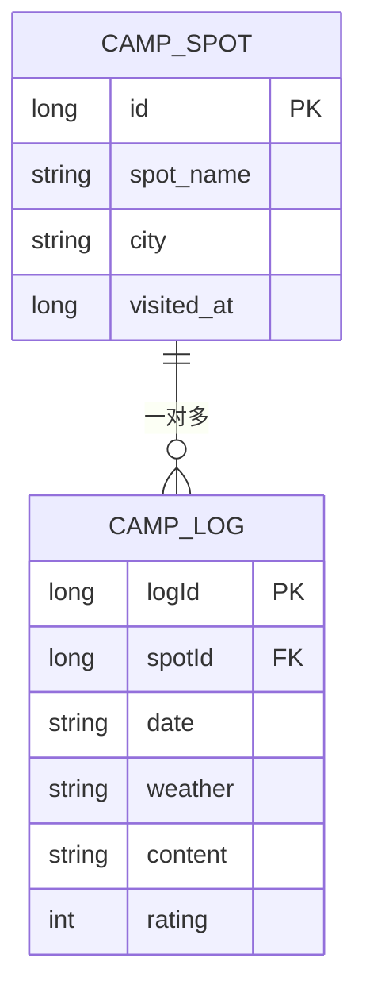
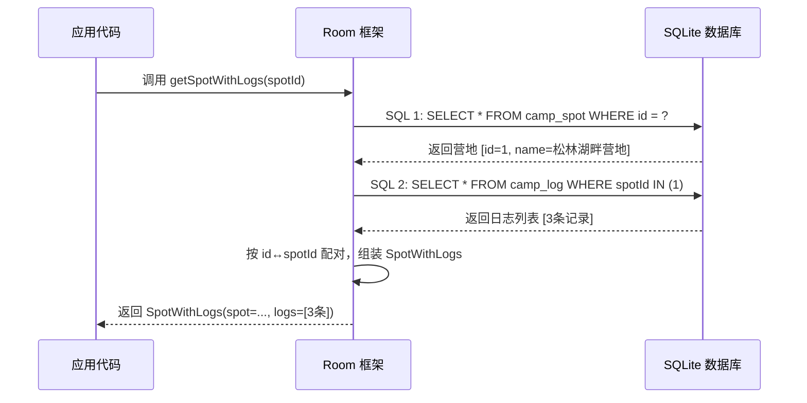
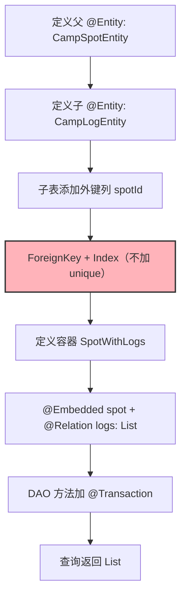

# 1.6.6 定义和查询一对多关系

## 1.6.6 一对多：一个营地，无数条故事

"出大麻烦了——！"

洛芙捧着电脑从帐篷里飞奔出来，惊动了午后白桦树隙里打盹的阳光。拖鞋踩在柔软的草地上发出“扑嗒扑嗒”的声音，她径直冲到正在溪边洗苹果的希尔面前，把屏幕怼了过去。

屏幕上全是刺眼的红色报错日志。

"我想给每个营地加上多条‘露营日志’，就像给同一个知己写很多封信一样对吧？" 洛芙苦恼地皱着鼻子，"所以我照着昨天学的‘一对一’关系，给日志表的 spotId 加上了 unique = true，结果它全线崩溃了！"

希尔咬了一口苹果，清脆的声响在溪水边格外分明。她盯着屏幕看了一秒，随后露出一个“原来如此”的明媚笑容。

"亲爱的洛芙，" 希尔把苹果搁在被溪水冲刷得圆润的石头上，甩了甩手上的水珠，"你给‘一对多’的外键加上了 unique？"

"对呀，昨天不就是这么写的吗？"

沉默了两秒。一只蜻蜓轻巧地掠过溪面，翅膀在正午的阳光里闪了一下。

"这就是你的 Bug 所在。" 希尔用指尖轻轻点了点屏幕上的代码，"昨天的 unique = true 是个守门员，它保证每个营地只能拥有一份详情。但今天你想要的是‘一对多’——一个营地容纳多条日志。你把守门员放在了‘一对多’的门口，它当然铁面无私地把你的第二条日志拦在了门外呀。"

洛芙的嘴巴张成了一个小小的“O”型，恍然大悟：

"所以……‘一对多’和‘一对一’的区别，就只是有没有 unique = true？"

"仅仅是这一个词的差别。" 黛琳不知何时已经走了过来。她在折叠椅上坐下，膝盖上依然摊着那台屏幕亮度调得很低的电脑，声音平静而笃定，"一对一是加了唯一锁的门，一对多是取掉了锁的同一扇门。Room 的 @Entity、ForeignKey、@Relation——所有注解写法几乎一模一样，唯一的区别就在索引（Index）的限制上。"

伊莎端着一碗刚切好的水果沙拉走过来，把碗放在折叠桌正中央。莓果的酸甜气息在正午热浪里弥漫开来。

"我来帮你梳理一下，"她说，用叉子叉起一颗蓝莓，"你可以把它想成这样：一对一，是每个人只能有一把专属钥匙，钥匙上刻着他的名字，不能重复；一对多，是一个教室有很多把椅子，每把椅子上都写着'属于这个教室'，但教室不限制有多少把椅子。外键列上的值可以重复。"

洛芙在笔记本上飞快地记了几个字："unique = 一对一的开关"。

"好。"她合上笔记本，深吸一口气，松针和草地的气息混在一起，"那我们从头来，正确地写一遍一对多。"

### 第一步：定义父表和子表

黛琳把屏幕转过来。

"营地表你已经有了。现在我们需要一张新表——`CampLogEntity`，记录每一次在某个营地的露营日志。一个营地可以有零条、一条、很多条日志。"

```kotlin
// 代码片段 A：一对多关系的两张表

// 父表：营地（复用之前的定义）
@Entity(tableName = "camp_spot")
data class CampSpotEntity(
    @PrimaryKey(autoGenerate = true)
    val id: Long = 0L,

    @ColumnInfo(name = "spot_name")
    val name: String,

    val city: String,

    @ColumnInfo(name = "visited_at")
    val visitedAt: Long = System.currentTimeMillis()
)

// 子表：露营日志
// ForeignKey：spotId 引用 camp_spot 的 id
// onDelete = CASCADE：营地删除时，所有日志自动清除
// 注意：索引不设 unique！这是一对多和一对一的唯一区别
@Entity(
    tableName = "camp_log",
    foreignKeys = [
        ForeignKey(
            entity = CampSpotEntity::class,
            parentColumns = ["id"],
            childColumns = ["spotId"],
            onDelete = ForeignKey.CASCADE
        )
    ],
    indices = [Index(value = ["spotId"])]  // 没有 unique = true！
)
data class CampLogEntity(
    @PrimaryKey(autoGenerate = true)
    val logId: Long = 0L,

    val spotId: Long,           // 外键列：指向 camp_spot 的 id

    val date: String,           // 日志日期，如 "2026-02-19"

    val weather: String,        // 天气，如 "晴/多云/阴/雨"

    val content: String,        // 日志正文

    val rating: Int             // 评分 1-5
)
```

"看到没？"希尔用手指敲了敲 `indices` 那一行，"昨天我们写的是 `Index(value = ["spotId"], unique = true)`。今天这里只有 `Index(value = ["spotId"])`——没有 `unique`。就这一个词的差别，数据库从'每个营地只能有一条记录'变成了'每个营地可以有无数条记录'。"

"但索引还是要加的？"洛芙问。

"必须加。"黛琳的语气很确定，"不加 `unique` 是允许重复，但索引本身还是需要的——它让数据库在按 `spotId` 查询时走索引扫描而不是全表扫描。Room 在编译期如果发现外键列没加索引，会直接给你一个警告。"

洛芙在笔记本的 `unique` 那个词上画了一个圆圈，在旁边标注：

> **有 unique → 一对一**
> **没有 unique → 一对多**
> **但无论哪种，索引本身都要加**



> 图 1：camp_spot 与 camp_log 的一对多 ER 图。注意连线符号 `||--o{`——左边的 `||` 表示"一个"，右边的 `o{` 表示"零个或多个"。spotId 上没有 unique 约束。

### 第二步：查询容器——List 取代单个对象

"接下来是查询容器。"黛琳新建了一个文件。

"昨天一对一的容器里，detail 是一个单独的对象：`val detail: CampSpotDetailEntity?`。今天一对多，子表变成了一个列表：`val logs: List<CampLogEntity>`。"

```kotlin
// 代码片段 B：一对多的查询结果容器

// SpotWithLogs 把一个营地和它的所有日志打包在一起
// 和一对一的 SpotWithDetail 结构几乎一样
// 唯一区别：@Relation 字段的类型是 List<CampLogEntity> 而不是 CampLogEntity?
data class SpotWithLogs(
    @Embedded
    val spot: CampSpotEntity,

    @Relation(
        parentColumn = "id",       // 父表 CampSpotEntity 的主键列名
        entityColumn = "spotId"    // 子表 CampLogEntity 中引用父表的列名
    )
    val logs: List<CampLogEntity>  // 一个营地对应多条日志
)
```

"注意看。"伊莎叉了一颗草莓放进嘴里，声音变得有点含糊但依然清晰，"一对一的时候，类型是 `CampSpotDetailEntity?`——一个可能为空的单独对象。一对多的时候，类型是 `List<CampLogEntity>`——一个列表。如果某个营地没有日志呢？列表就是空的 `emptyList()`，不是 null。"

"这个设计很贴心，"洛芙边写边说，"空列表比 null 好处理多了，不用到处写 `?.` 或者 `!!`。"

"是的。Room 的 `@Relation` 在一对多场景下永远返回非空列表。"黛琳简短地确认。正午的阳光从白桦林的树冠间漏下来，在她的键盘上投下一颗一颗细碎的光斑。

### 第三步：DAO 方法

希尔已经打好了 DAO 代码。

```kotlin
// 代码片段 C：一对多关系的 DAO

@Dao
interface CampLogDao {

    // 插入营地
    @Insert(onConflict = OnConflictStrategy.REPLACE)
    suspend fun insertSpot(spot: CampSpotEntity): Long

    // 插入日志
    @Insert
    suspend fun insertLog(log: CampLogEntity): Long

    // 批量插入日志
    @Insert
    suspend fun insertLogs(logs: List<CampLogEntity>)

    // 查询所有营地及其日志（一对多）
    // @Transaction：两条内部 SQL 必须在同一事务中执行
    @Transaction
    @Query("SELECT * FROM camp_spot ORDER BY visited_at DESC")
    fun observeSpotsWithLogs(): Flow<List<SpotWithLogs>>

    // 查询单个营地及其所有日志
    @Transaction
    @Query("SELECT * FROM camp_spot WHERE id = :spotId")
    suspend fun getSpotWithLogs(spotId: Long): SpotWithLogs?

    // 查询某个营地的日志数量
    @Query("SELECT COUNT(*) FROM camp_log WHERE spotId = :spotId")
    suspend fun getLogCount(spotId: Long): Int

    // 删除营地（CASCADE 会自动删除关联日志）
    @Delete
    suspend fun deleteSpot(spot: CampSpotEntity)
}
```

"和昨天几乎一模一样。"洛芙歪着头看了一遍，把代码从上到下扫了两遍，"@Transaction、@Query、@Relation——用的注解完全相同。真正的区别全在 Entity 的索引和容器的类型上。"

"你总结得很好。"黛琳的目光从屏幕移到洛芙脸上，停留了不到一秒——但那一秒里有一种很温和的赞许。

### 第四步：插入数据并验证

"来，我们插入一些数据看看效果。"希尔把笔记本电脑放到折叠桌上，给大家都能看到。

```kotlin
// 代码片段 D：插入数据并验证一对多查询

// 步骤 1：插入一个营地
val spotId = dao.insertSpot(
    CampSpotEntity(name = "松林湖畔营地", city = "青山市")
)

// 步骤 2：给这个营地插入三条日志
dao.insertLogs(listOf(
    CampLogEntity(
        spotId = spotId,
        date = "2026-02-15",
        weather = "晴",
        content = "第一次来这里，湖面倒映着白桦林，美得不像话",
        rating = 5
    ),
    CampLogEntity(
        spotId = spotId,
        date = "2026-02-16",
        weather = "多云",
        content = "今天试了钓鱼，一条没钓到但心情很好",
        rating = 4
    ),
    CampLogEntity(
        spotId = spotId,
        date = "2026-02-17",
        weather = "小雨",
        content = "雨天在帐篷里读书，听雨打在篷布上的声音",
        rating = 5
    )
))

// 步骤 3：查询并打印
val result = dao.getSpotWithLogs(spotId)
Log.d("OneToMany", "营地: ${result?.spot?.name}")
Log.d("OneToMany", "日志数量: ${result?.logs?.size}")
result?.logs?.forEachIndexed { index, log ->
    Log.d("OneToMany", "  日志${index + 1}: ${log.date} [${log.weather}] ${log.content}")
}
```

希尔按下运行按钮。正午的阳光照在屏幕上有点反光，她侧了侧角度。

Logcat 输出：

```
D/OneToMany: 营地: 松林湖畔营地
D/OneToMany: 日志数量: 3
D/OneToMany:   日志1: 2026-02-15 [晴] 第一次来这里，湖面倒映着白桦林，美得不像话
D/OneToMany:   日志2: 2026-02-16 [多云] 今天试了钓鱼，一条没钓到但心情很好
D/OneToMany:   日志3: 2026-02-17 [小雨] 雨天在帐篷里读书，听雨打在篷布上的声音
```

洛芙用力点了一下头，莓果沙拉的碗在桌面上被她碰到，晃了一下。

"三条日志都在！同一个 `spotId`，但全部成功插入了——因为没有 `unique` 约束。"

"现在你明白了为什么早上那个 bug 会发生？"希尔端起凉白开喝了一口。

"明白了。我把一对一的 `unique = true` 照搬到了一对多的场景，索引拒绝了第二条日志。"



> 图 2：Room 处理一对多 `@Relation` 的内部流程。与一对一完全相同——先查父表，再查子表，最后配对。唯一区别是子表查询可能返回多条记录，Room 把它们收集到 `List` 中。

### 一对一 vs 一对多：完整对比

"我觉得有必要把一对一和一对多做一个完整的对比。"洛芙翻开笔记本新的一页。

黛琳点了点头，在白板上画了一张表。

| 对比维度 | 一对一 | 一对多 |
|---------|--------|--------|
| `@Entity` 定义 | 子表外键列加 `unique = true` | 子表外键列**不加** `unique` |
| 索引 | `Index(value = ["spotId"], unique = true)` | `Index(value = ["spotId"])` |
| 查询容器类型 | `val detail: ChildEntity?` | `val logs: List<ChildEntity>` |
| 没有子数据时 | detail 为 `null` | logs 为 `emptyList()` |
| ForeignKey | 相同 | 相同 |
| @Relation 写法 | 相同 | 相同 |
| @Transaction | 相同 | 相同 |
| DAO 方法写法 | 相同 | 相同 |

"八个维度，六个完全一样。"洛芙数了一遍，"差别只在索引的 unique 和容器的类型上。"

"这就是 Room 设计的一致性。"伊莎微笑着用叉子戳了一颗覆盆子，"同一套注解系统，通过最小的差异表达不同的语义。你不需要学习新的 API，只需要理解语义的变化。"

### 反模式：在应用层手动管理一对多

"说到反模式，"希尔将啃完的苹果核准确地抛进远处的垃圾袋，擦了擦手。她的语气里带着点实战老手特有的狡黠，"我见过一种写法——有人偏偏不用 `@Relation`，非要在应用层手动查两次数据库，然后再手动合并。"

```kotlin
// 代码片段 E-1：反模式——手动查询 + 手动合并

// ❌ 不推荐：手动管理一对多关系
suspend fun getSpotWithLogsManually(spotId: Long): Pair<CampSpotEntity, List<CampLogEntity>>? {
    val spot = spotDao.findSpotById(spotId) ?: return null
    val logs = logDao.findLogsBySpotId(spotId)
    return Pair(spot, logs)
}
```

"这段代码确实能跑，" 希尔竖起三根手指，阳光在她的指尖跳跃，"但前面全是坑。"

"第一，没有事务保护。查营地和查日志是两条独立的 SQL。如果在这两步之间有人恰好删掉了一条日志，你拿到的数据就不一致了。

第二，不支持 Flow 自动更新。用 `@Relation` 配合 `Flow`，数据库一有风吹草动就会自动推送新列表。手动查询可做不到这份聪明。

第三，维护成本太高。实体类一旦加了新字段，你就得跟着改合并逻辑。把这些配对的脏活累活交给 Room 的编译期去自动检查，难道不香吗？"

```kotlin
// 代码片段 E-2：正确做法——用 @Relation 自动管理

// ✅ 推荐：Room 自动管理配对和事务
@Transaction
@Query("SELECT * FROM camp_spot WHERE id = :spotId")
suspend fun getSpotWithLogs(spotId: Long): SpotWithLogs?
// Room 编译期自动生成 SQL 2 的查询逻辑
// 两条 SQL 在同一事务中执行
// 返回的 SpotWithLogs 包含已配对的日志列表
```

洛芙在笔记本的反模式旁边用力画了一个大大的叉号，并批注：“手动合并 = 自找麻烦。”

### 级联删除在一对多中的力量

一阵微风拂过，白桦林的叶片发出细碎的沙沙声。午后的阳光逐渐变得温柔，褪去了正午的刺眼，慢慢偏向了柔和的浅金色。

"还记得昨天我们验证过的级联删除（CASCADE）吗？" 希尔抬起头，望着摇曳的树梢，"在一对多的场景下，CASCADE 的威力才真正显现出来。"

```kotlin
// 代码片段 F：一对多场景下的级联删除

// 确认数据
val before = dao.getSpotWithLogs(spotId)
Log.d("Cascade", "删除前：${before?.spot?.name} 有 ${before?.logs?.size} 条日志")

// 删除营地
dao.deleteSpot(before!!.spot)

// 查询日志
val remainingLogs = dao.getLogCount(spotId)
Log.d("Cascade", "删除后剩余日志数：$remainingLogs")
```

```
D/Cascade: 删除前：松林湖畔营地 有 3 条日志
D/Cascade: 删除后剩余日志数：0
```

"一个营地，三条日志，瞬间干干净净。" 希尔的声音里透着一种极客特有的满足感。

"一对一的时候，只是带走了一个伴侣，" 洛芙在笔记本上沙沙地记着，嘴角微微上扬，"一对多的时候，带走的是整个回忆的聚落。如果没有 CASCADE，删掉一个营地就会留下三条无家可归的‘孤儿日志’。"

伊莎轻声补充道："如果是个热门营地，可能有上百条日志。没有级联删除，万一中间程序崩溃，数据库里就会永远留下一堆无主的垃圾数据。这简直是一场灾难。"

### Multimap：不需要中间类的查询方式

"对了，" 黛琳修长的手指在键盘上敲击，打开了一个新的代码文件，"昨天提过的 Multimap 返回类型在一对多场景下也极其适用——甚至更自然，因为 `Map<Key, List<Value>>` 天然就是用来装载‘一对多’这种数据结构的。"

```kotlin
// 代码片段 G：Multimap 方式查询一对多
// 返回 Map<CampSpotEntity, List<CampLogEntity>>
// 不需要 SpotWithLogs 中间类

@Dao
interface CampLogDao {

    @Query(
        """
        SELECT * FROM camp_spot
        INNER JOIN camp_log
        ON camp_spot.id = camp_log.spotId
        ORDER BY camp_spot.visited_at DESC, camp_log.date ASC
        """
    )
    fun loadSpotsWithLogs(): Flow<Map<CampSpotEntity, List<CampLogEntity>>>
}
```

"INNER JOIN 的老问题还是一样的——" 洛芙敏锐地接上了话。

"是的，没有日志的营地会被无情地过滤掉，根本不会出现在结果里。" 黛琳微微颔首，赞许地看了洛芙一眼，"如果我们需要保留那些暂时还没有日志的营地，就得把 SQL 改成 LEFT JOIN。"

```kotlin
// 代码片段 G-2：LEFT JOIN 保留空日志营地

@Query(
    """
    SELECT * FROM camp_spot
    LEFT JOIN camp_log
    ON camp_spot.id = camp_log.spotId
    ORDER BY camp_spot.visited_at DESC
    """
)
fun loadAllSpotsWithLogs(): Flow<Map<CampSpotEntity, List<CampLogEntity>>>
```

"LEFT JOIN 就像一个宽容的怀抱，它会把所有营地都拥入其中。" 黛琳解释道，"没有日志的营地，在 Map 里只会对应一个空列表 `emptyList()`，这和 `@Relation` 注解的行为完美一致。"

| 查询方式 | 空日志营地 | 代码量 | 排序控制 |
|---------|-----------|--------|---------|
| `@Relation` 中间类 | 保留（空 List） | 需定义中间类 | 子表排序需额外手段 |
| Multimap + INNER JOIN | 丢弃 | 无需中间类 | 在 SQL 中直接控制 |
| Multimap + LEFT JOIN | 保留（空 List） | 无需中间类 | 在 SQL 中直接控制 |

"Multimap 的好处是排序可以直接在 SQL 里写，"希尔补充，"比如 `ORDER BY camp_log.date ASC` 让日志按时间正序排列。"

### 子表排序：@Relation 的隐藏痛点

"既然提到了排序，" 希尔挑了挑眉，这个熟悉的表情意味着前方有容易踩空的陷阱，"用 `@Relation` 查询一对多时，Room 在幕后自动生成的第二条 SQL 是这样的：`SELECT * FROM camp_log WHERE spotId IN (?)`。请注意——它没有 `ORDER BY`。"

```kotlin
// 代码片段 H：@Relation 不保证子表顺序的问题

// 你以为 logs 是按日期排列的？不一定。
// Room 自动生成的 SQL 不含 ORDER BY
val result = dao.getSpotWithLogs(spotId)
result?.logs?.forEach { log ->
    Log.d("Order", "${log.date}: ${log.content}")
}
// 输出顺序可能是插入顺序，也可能不是——SQLite 不保证没有 ORDER BY 的查询顺序
```

"那我的日志岂不是乱序的？" 洛芙停下了笔。

"没错，SQLite 从来不保证没有 `ORDER BY` 的查询结果顺序。" 黛琳竖起两根手指，"所以你有两个选择。第一，在应用层拿到数据后自己排序，比如用 Kotlin 优雅的 `.sortedBy { it.date }`。第二，放弃 `@Relation`，直接用刚才的 Multimap 加上手写 SQL，在 SQL 里通过 `ORDER BY` 把顺序安排得明明白白。"

```kotlin
// 代码片段 H-1：应用层排序
val sortedLogs = result?.logs?.sortedBy { it.date }
```

洛芙在笔记本上郑重地写下 `.sortedBy { it.date }`，并在旁边画了一颗醒目的小星星。

### 进阶：统计查询——数一数日志有多少条

午后的热气在草甸上方氤氲出一层极薄的雾气。伊莎端走了吃空的水果碗，换上了四杯沁人心脾的冰镇柚子茶。

"教你一个极其体贴的实战技巧。" 希尔端起玻璃杯，冰块在杯壁上碰撞出清脆的叮当声，"很多时候，我们不需要把所有的日志内容都翻出来，只想在列表上显示‘这个营地有几条记录’。这时候，杀鸡焉用牛刀？不需要 `@Relation`，一条简单的聚合查询就足够优雅了。"

```kotlin
// 代码片段 I：统计查询——搭配投影

// 只查营地名和日志数量，不加载完整日志内容
// 适用于列表页面，性能远优于加载全部日志

data class SpotLogCount(
    @ColumnInfo(name = "spot_name") val name: String,
    val city: String,
    val logCount: Int
)

@Dao
interface CampLogDao {
    @Query(
        """
        SELECT cs.spot_name, cs.city, COUNT(cl.logId) AS logCount
        FROM camp_spot cs
        LEFT JOIN camp_log cl ON cs.id = cl.spotId
        GROUP BY cs.id
        ORDER BY logCount DESC
        """
    )
    fun observeSpotLogCounts(): Flow<List<SpotLogCount>>
}
```

"LEFT JOIN 配合 GROUP BY 和 COUNT，" 黛琳平静地剖析着这段 SQL，"LEFT JOIN 确保了即使是 0 条日志的营地也能被统计到。在列表页面上，把几百条日志的文本全部加载进内存是非常鲁莽的行为。直接让数据库帮我们数好数量，然后只返回轻量级的 `SpotLogCount` 对象，才是明智之举。"

Logcat 输出：

```
D/Stats: 松林湖畔营地 (青山市) - 3条日志
D/Stats: 河谷温泉营地 (翠峰镇) - 1条日志
D/Stats: 星空草原营地 (月牙县) - 0条日志
```

"哇，" 洛芙的眼睛亮闪闪的，"数据库就像个尽职的图书管理员，直接把统计卡片递给了我。"

---

阳光开始倾斜，白桦林的影子在草地上拉长，像是琴谱上不规则的小节线。远处的湖面，两只野鸭安静地划水，荡开两道温柔的波纹。

洛芙靠在折叠椅背上，双手捧着那杯还透着凉意的柚子茶。

"一对多原来如此清晰，" 她轻声感慨，贴着干枫叶的笔记本安静地躺在膝盖上，"但正因为它简单，才更容易让人忽略那些致命的细节——一个多余的 `unique` 就能让一切停摆。"

黛琳站起身，阳光在她的发丝间跳跃。"最优雅的工程，不在于把代码写得多复杂，而在于清楚地知道哪里该简单，以及简单到什么程度还能保持绝对的正确。"

远处，野鸭扑棱着翅膀从湖面起飞，带起一串晶莹的水珠，在斜阳里闪烁了一下。而绿山墙般的营地里，关于代码的故事还在继续。

---

### 技术总结

#### 黛琳的学霸笔记

> **一对多关系（One-to-Many Relationship）** —— 数据库中最包容的关系美学。父表的一条记录可以孕育零条或多条子表记录。它与“一对一”的唯一分水岭在于：外键列的索引不设 `unique = true`，且查询容器中的子表类型为包容万物的 `List<T>`。

#### 核心知识游标

1. **一对多（One-to-Many）**：父表与子表 1:N 的映射。最常见的数据形态。
2. **Index（不含 unique）**：外键列的普通索引。它允许相同的外键值反复出现，同时指引数据库在查询时快速寻路。
3. **List\<T\>**：一对多查询的专用容器。Room 极具安全感地保证它永远返回非空列表，即便查无所获，也会递给你一个干净的 `emptyList()`。
4. **Flow\<List\<SpotWithLogs\>\>**：响应式数据流。像尽职的守夜人，任何父子表的数据微调，都会触发它自动向 UI 推送最新状态。
5. **LEFT JOIN**：最宽容的 SQL 连接。即便右表空空如也，左表的记录也会被完好无损地保留在结果中。
6. **GROUP BY + COUNT**：轻量级的聚合统计。在不唤醒沉重实体的情况下，优雅地清点出每个分组的数量。
7. **子查询无序（Subquery Ordering）**：`@Relation` 生成的子查询天然缺少 `ORDER BY`，不要对它的返回顺序抱有侥幸，请在应用层显式排序。

#### 逻辑脉络图



> 图 3：实现一对多关系的完整步骤链。那颗粉红色跳跃的心脏，正是那个取下了唯一锁的关键节点——不加 unique 的索引。

#### 希尔的避坑指南：反模式与陷阱

1. **生搬硬套的 `unique`**：将一对一的 `unique = true` 惯性带入一对多，会导致第二条数据撞在墙上，引发无情的 `SQLiteConstraintException`。
   - **正解**：老老实实写 `Index(value = ["spotId"])`。
2. **在应用层手工组装数据**：脱离了 `@Transaction` 的保护，分两次查询再在代码里合并，既容易遇到数据脏读，又享受不到 Flow 的自动更新。
   - **正解**：信任 `@Relation`，让 Room 在编译期为你织好安全网。
3. **盲目相信 `@Relation` 的顺序**：以为查出来的日志会自动按时间排好。
   - **正解**：SQLite 不相信默契。要么在拿到数据后用 `.sortedBy {}` 自己排，要么改写带 `ORDER BY` 的 Multimap SQL。
4. **列表页的内存灾难**：为了在页面上显示“有 3 条日志”，就把 3 条日志的完整文本全查出来。
   - **正解**：使用 `COUNT + GROUP BY` 的投影（Projection）查询，只拿你需要的那张数字卡片。
5. **裸奔的外键**：忘记给外键列加 `@Index`，导致每次联表查询都触发笨重的全表扫描。
   - **正解**：外键必带索引，这是数据库世界的铁律。

### 🏕️ 动手练习：营地实战探险 (Task)

夜幕降临，是时候动手验证你白天的所学了。请在你的代码编辑器里完成以下试炼，全部打钩才算通关哦。

#### Task 1 · 建表双打 (Table Pair) ★

**目标**：用 `@Entity` 搭建营地与日志的帐篷。

**你需要做的事**：
1. 复制教程中的 `CampSpotEntity` 和 `CampLogEntity` 到项目中。
2. 在 `@Database` 中注册这两张表。
3. 编译运行，打开 Database Inspector 确认 `camp_log` 表的 `spotId` 列拥有非 unique 的普通索引。

**验收**：
- [ ] 两张表成功在 Inspector 显现
- [ ] 索引正确且无 UNIQUE 标记
- [ ] 编译时没有收到 Room 的红黄牌警告

#### Task 2 · 日志轰炸 (Log Bombing) ★★

**目标**：向同一个营地倾泻多条记录，验证大门的宽容度。

**你需要做的事**：
1. 插入 1 个营地拿到 `spotId`。
2. 用批量插入方法，向这个 `spotId` 塞入至少 5 条日志。
3. 用 `@Relation` 方法查出该营地，打印出所有日志内容。

**验收**：
- [ ] Logcat 里整整齐齐列出 5 条日志
- [ ] 程序稳如泰山，没有抛出崩溃异常

#### Task 3 · 唯一的代价 (Unique Mistake) ★★

**目标**：亲手重现那个让洛芙在正午抓狂的 Bug。

**你需要做的事**：
1. 故意给子表的索引加上 `unique = true`。
2. 尝试给同一个营地插入第二条日志。
3. 围观 Logcat 里的血红色报错，然后改回正确代码。

**验收**：
- [ ] 成功触发 `SQLiteConstraintException`
- [ ] 去掉 unique 后一切恢复宁静
- [ ] 能向一只小黄鸭清晰解释报错原因

#### Task 4 · 级联风暴 (Cascade Storm) ★★★

**目标**：见证 CASCADE 席卷一切的清道夫威力。

**你需要做的事**：
1. 插入一个带有 5 条日志的营地。
2. 确认日志存在后，狠心调用 `deleteSpot()` 删除营地。
3. 查询那个 `spotId` 下的日志数量。

**验收**：
- [ ] 删除前日志数为 5
- [ ] 删除后日志数为 0
- [ ] 期间你没有写过哪怕一行删除日志的代码

#### Task 5 · 统计大师 (Stats Master) ★★★★

**目标**：用 COUNT 优雅地清点行囊，拒绝臃肿。

**你需要做的事**：
1. 定义只包含名称、城市和数量的 `SpotLogCount` 数据类。
2. 写一段 `LEFT JOIN + GROUP BY + COUNT` 的 SQL。
3. 准备 3 个营地（分别有 5 条、2 条、0 条日志），执行查询并按数量倒序打印。

**验收**：
- [ ] 3 个营地全在名单上（哪怕是 0 条日志那个）
- [ ] 列表按 5 -> 2 -> 0 的顺序排列
- [ ] 没有查出任何冗余的日志正文内容

### 🍭 洛芙的小小日记本

2026 年 2 月 19 日，晴转星空

原来，一对一和一对多之间，仅仅隔着一个微小的词汇。

有时候，决定命运的不是什么宏大的架构，而是藏在角落里的一个 `unique`。今天学到的不仅仅是数据库——希尔说得对，好的工程就是不给“多”加上“一”的枷锁，也不给自由设置没必要的门槛。

晚安，那些在数据库里安静躺着的日志。明天，我们要去认识更复杂的“多对多”了，听说那需要建一座叫做“交叉引用”的桥梁呢。
