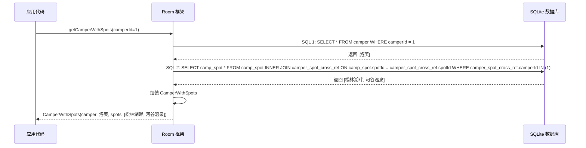
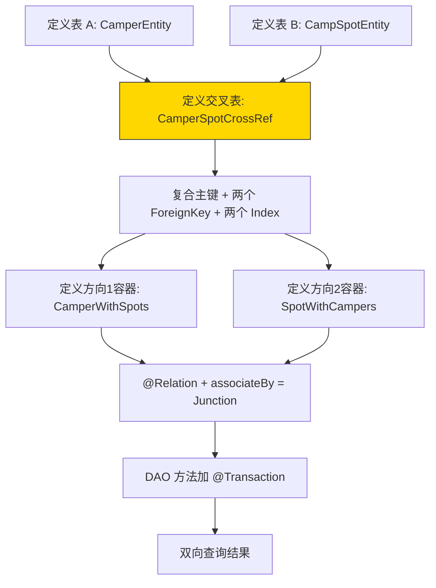

# 1.6.7 定义和查询多对多关系

## 1.6.7 多对多：签到本上的纵横交错

希尔随手把一块小木板抛到了折叠桌正中央。

"砰"的一声，四杯早茶的水面同时荡了一下。清晨的寒意还没完全退散，折叠桌面上凝着一层薄薄的雾气，木板砸落的地方露出一块干净的圆圈。

"这是什么？"洛芙歪头看了一眼。木板上用记号笔写着密密麻麻的字，横竖交错像一张棋盘。

"这，"希尔用食指敲了敲木板的角，"是我昨晚做的一块'签到本'。"

木板上画着一张表格——横行是四个人名（洛芙、黛琳、伊莎、希尔），纵列是三个营地名（松林湖畔、河谷温泉、星空草原）。交叉的格子里打着勾和叉：

|        | 松林湖畔 | 河谷温泉 | 星空草原 |
|--------|---------|---------|---------|
| 洛芙    | ✓       | ✓       |         |
| 黛琳    | ✓       |         | ✓       |
| 伊莎    | ✓       | ✓       | ✓       |
| 希尔    |         | ✓       | ✓       |

"一个营友可以去过很多个营地，一个营地也可以接待过很多个营友。"希尔的指尖从横行划到纵列，又从纵列划回来，"这就是**多对多**。"

洛芙看着木板，愣了三秒。

"等一下……"她慢慢抬起头，"一对一是一张子表有外键、加了 unique。一对多是一张子表有外键、不加 unique。但多对多——我该把外键放在哪？"

她拿起笔，在纸上画了两个方块——`CamperEntity` 和 `CampSpotEntity`。然后在两个方块之间画了一条线，在线的中间写了一个大大的问号。

"营友表里放 spotId？不行，一个营友去过很多个营地，一个外键装不下。营地表里放 camperId？也不行，一个营地接待过很多营友，一个外键也装不下。"

"到此为止，都是正确的。"黛琳端着杯子走过来，热气在冷空气中升起一小截白烟，"一对一和一对多只需要两张表——子表里有一列外键就够了。但多对多，两张表都装不下对方，所以你需要**第三张表**。"

"第三张表？"

"它有个正式名字，叫**交叉引用表**——cross-reference table。"伊莎搬了一把椅子坐到洛芙旁边，声音轻柔得像在讲一个童话的开头，"你可以把它想象成你面前这块签到本。签到本不是营友，也不是营地，它只是一张记录——谁在什么时候去了哪里。每一行是一个'配对'，把一个营友和一个营地绑在一起。"

洛芙在纸上的两个方块之间加了第三个小方块，里面写着：`CamperSpotCrossRef`。

"这个小方块里有两列——一个 `camperId`，一个 `spotId`。对吗？"

"对。"黛琳的声音平静如常，但眼角有一丝不易察觉的微笑，"这就是多对多的核心。"

### 第一步：定义三张表

黛琳打开笔记本电脑，屏幕上已经写好了三段代码。

```kotlin
// 代码片段 A：多对多关系的三张表

// 表 1：营友
@Entity(tableName = "camper")
data class CamperEntity(
    @PrimaryKey(autoGenerate = true)
    val camperId: Long = 0L,

    val name: String,

    val level: String   // 营友等级："新手/进阶/达人"
)

// 表 2：营地（复用之前的定义）
@Entity(tableName = "camp_spot")
data class CampSpotEntity(
    @PrimaryKey(autoGenerate = true)
    val spotId: Long = 0L,

    @ColumnInfo(name = "spot_name")
    val name: String,

    val city: String
)

// 表 3：交叉引用表（签到本）
// 复合主键：(camperId, spotId)，保证同一人对同一营地只签到一次
// 这张表不属于营友，也不属于营地——它只记录"配对关系"
@Entity(
    tableName = "camper_spot_cross_ref",
    primaryKeys = ["camperId", "spotId"],
    foreignKeys = [
        ForeignKey(
            entity = CamperEntity::class,
            parentColumns = ["camperId"],
            childColumns = ["camperId"],
            onDelete = ForeignKey.CASCADE
        ),
        ForeignKey(
            entity = CampSpotEntity::class,
            parentColumns = ["spotId"],
            childColumns = ["spotId"],
            onDelete = ForeignKey.CASCADE
        )
    ],
    indices = [
        Index(value = ["camperId"]),
        Index(value = ["spotId"])
    ]
)
data class CamperSpotCrossRef(
    val camperId: Long,
    val spotId: Long
)
```

"重点在第三张表。"黛琳用手指轻轻敲了敲代码框的边缘，然后逐条解释：

"第一，`primaryKeys = ["camperId", "spotId"]`——这是**复合主键**。两个字段组合在一起成为主键，意味着同一个 camperId + spotId 的组合只能出现一次。洛芙去松林湖畔，只能签到一次。"

"第二，两个 `ForeignKey`——一个指向 camper 表，一个指向 camp_spot 表。交叉表同时引用了两张主表的主键。"

"第三，两个 `Index`——每个外键列都要加索引，原因和前两天一样：查询效率和编译期检查。"

洛芙盯着代码看了一会儿，一只山雀落在帐篷顶上，发出一声短促的"啾"。

"所以这张交叉表本身不存储有意义的业务数据——它只是一个'连接器'？"

"大多数情况是这样，"希尔接过话，"但你也可以在交叉表里加额外的列，比如 `visitedAt: Long`（签到时间）、`rating: Int`（评分）。这些数据属于'这段关系本身'，不属于营友，也不属于营地。"

```mermaid
erDiagram
    CAMPER ||--o{ CAMPER_SPOT_CROSS_REF : "签到"
    CAMP_SPOT ||--o{ CAMPER_SPOT_CROSS_REF : "签到"
    CAMPER {
        long camperId PK
        string name
        string level
    }
    CAMP_SPOT {
        long spotId PK
        string spot_name
        string city
    }
    CAMPER_SPOT_CROSS_REF {
        long camperId FK-PK
        long spotId FK-PK
    }
```

> 图 1：多对多 ER 图。营友和营地不直接关联——它们通过交叉引用表 `camper_spot_cross_ref` 间接连接。一个营友可以有多条签到记录，一个营地也可以有多条签到记录。

### 第二步：查询容器——两个方向的读法

"多对多有一个有趣的特点，"伊莎用手指绕着杯口的蒸汽画了一个圈，"你可以从两个方向去读这段关系。"

"第一个方向：给我一个营友，查出她去过的所有营地。"
"第二个方向：给我一个营地，查出来过的所有营友。"

"所以我们需要两个查询容器。"黛琳打开新文件。

```kotlin
// 代码片段 B：两个方向的查询容器

// 方向 1：一个营友 → 她去过的所有营地
data class CamperWithSpots(
    @Embedded
    val camper: CamperEntity,

    @Relation(
        parentColumn = "camperId",      // 父表的主键
        entityColumn = "spotId",        // 子表的主键
        associateBy = Junction(CamperSpotCrossRef::class)
        // associateBy 告诉 Room：
        // "不要直接用外键匹配，请通过交叉表来配对"
    )
    val spots: List<CampSpotEntity>
)

// 方向 2：一个营地 → 来过的所有营友
data class SpotWithCampers(
    @Embedded
    val spot: CampSpotEntity,

    @Relation(
        parentColumn = "spotId",        // 父表的主键
        entityColumn = "camperId",      // 子表的主键
        associateBy = Junction(CamperSpotCrossRef::class)
    )
    val campers: List<CamperEntity>
)
```

"和一对一、一对多比较一下。"洛芙拿起笔，开始在笔记本上列差异。

"区别在于 `@Relation` 里多了一个 `associateBy = Junction(...)`。"希尔用指甲轻弹了一下屏幕边框，"一对一和一对多的时候，Room 直接用 `parentColumn` 和 `entityColumn` 从两张表里做匹配。但多对多的时候，两张主表之间没有直接的外键关系——Room 需要知道'去哪张表里找配对信息'，这就是 `Junction` 的作用。"

"可以把 Junction 想象成一个翻译官，"伊莎轻声说，"两个人说不同的语言，翻译官站在中间，把 A 的话翻给 B，把 B 的话翻给 A。交叉引用表就是关系世界里的翻译官。"

| 关系类型 | @Relation 中是否需要 Junction | 原因 |
|---------|---------------------------|------|
| 一对一 | 不需要 | 子表有直接外键指向父表 |
| 一对多 | 不需要 | 子表有直接外键指向父表 |
| 多对多 | **需要** | 两张主表之间没有直接外键，需要通过交叉表间接匹配 |

### 第三步：DAO 方法

"DAO 方法的写法和之前完全一样。"希尔的手指在键盘上跳跃。

```kotlin
// 代码片段 C：多对多关系的 DAO

@Dao
interface CamperSpotDao {

    // 插入营友
    @Insert(onConflict = OnConflictStrategy.REPLACE)
    suspend fun insertCamper(camper: CamperEntity): Long

    // 插入营地
    @Insert(onConflict = OnConflictStrategy.REPLACE)
    suspend fun insertSpot(spot: CampSpotEntity): Long

    // 插入签到记录（交叉引用）
    @Insert(onConflict = OnConflictStrategy.IGNORE)
    suspend fun insertCrossRef(crossRef: CamperSpotCrossRef)

    // 方向 1：查询营友及其去过的营地
    @Transaction
    @Query("SELECT * FROM camper WHERE camperId = :camperId")
    suspend fun getCamperWithSpots(camperId: Long): CamperWithSpots?

    // 方向 2：查询营地及其接待过的营友
    @Transaction
    @Query("SELECT * FROM camp_spot WHERE spotId = :spotId")
    suspend fun getSpotWithCampers(spotId: Long): SpotWithCampers?

    // 查询所有营友及其去过的营地
    @Transaction
    @Query("SELECT * FROM camper ORDER BY name")
    fun observeAllCampersWithSpots(): Flow<List<CamperWithSpots>>

    // 删除签到记录（取消某次签到）
    @Delete
    suspend fun deleteCrossRef(crossRef: CamperSpotCrossRef)
}
```

"注意 `insertCrossRef` 用了 `OnConflictStrategy.IGNORE`，"黛琳指着那一行说，"因为交叉表的复合主键保证了同一组合只出现一次。如果洛芙已经签到过松林湖畔了，再插入一次会被静默忽略，不会报错也不会覆盖。"

"这比用 REPLACE 更安全，"希尔补充，"REPLACE 会先删后插，如果交叉表将来加了额外列（比如签到时间），REPLACE 可能会丢失之前的数据。IGNORE 则什么都不做，干净利落。"

### 第四步：写入数据，双向查询

阳光终于翻过了帐篷顶部，把折叠桌照得暖洋洋的。雾气消散了，草叶上的露水开始蒸发，空气里弥漫着一种温润的泥土气息。

"让我们把签到本的数据敲进去。"希尔兴奋地搓了搓手。

```kotlin
// 代码片段 D：插入数据并双向查询

// 步骤 1：插入四个营友
val loveId = dao.insertCamper(CamperEntity(name = "洛芙", level = "新手"))
val dailinId = dao.insertCamper(CamperEntity(name = "黛琳", level = "达人"))
val yishaId = dao.insertCamper(CamperEntity(name = "伊莎", level = "达人"))
val hillId = dao.insertCamper(CamperEntity(name = "希尔", level = "进阶"))

// 步骤 2：插入三个营地
val pineId = dao.insertSpot(CampSpotEntity(name = "松林湖畔", city = "青山市"))
val hotspringId = dao.insertSpot(CampSpotEntity(name = "河谷温泉", city = "翠峰镇"))
val starId = dao.insertSpot(CampSpotEntity(name = "星空草原", city = "月牙县"))

// 步骤 3：插入签到记录（对应木板上的签到本）
dao.insertCrossRef(CamperSpotCrossRef(loveId, pineId))      // 洛芙 → 松林湖畔
dao.insertCrossRef(CamperSpotCrossRef(loveId, hotspringId))  // 洛芙 → 河谷温泉
dao.insertCrossRef(CamperSpotCrossRef(dailinId, pineId))     // 黛琳 → 松林湖畔
dao.insertCrossRef(CamperSpotCrossRef(dailinId, starId))     // 黛琳 → 星空草原
dao.insertCrossRef(CamperSpotCrossRef(yishaId, pineId))      // 伊莎 → 松林湖畔
dao.insertCrossRef(CamperSpotCrossRef(yishaId, hotspringId)) // 伊莎 → 河谷温泉
dao.insertCrossRef(CamperSpotCrossRef(yishaId, starId))      // 伊莎 → 星空草原
dao.insertCrossRef(CamperSpotCrossRef(hillId, hotspringId))  // 希尔 → 河谷温泉
dao.insertCrossRef(CamperSpotCrossRef(hillId, starId))       // 希尔 → 星空草原

// 步骤 4：方向 1 —— 查洛芙去过的营地
val loveResult = dao.getCamperWithSpots(loveId)
Log.d("M2M", "洛芙去过的营地：")
loveResult?.spots?.forEach { spot ->
    Log.d("M2M", "  ${spot.name} (${spot.city})")
}

// 步骤 5：方向 2 —— 查松林湖畔的访客
val pineResult = dao.getSpotWithCampers(pineId)
Log.d("M2M", "松林湖畔的访客：")
pineResult?.campers?.forEach { camper ->
    Log.d("M2M", "  ${camper.name} [${camper.level}]")
}
```

Logcat 输出：

```
D/M2M: 洛芙去过的营地：
D/M2M:   松林湖畔 (青山市)
D/M2M:   河谷温泉 (翠峰镇)
D/M2M: 松林湖畔的访客：
D/M2M:   洛芙 [新手]
D/M2M:   黛琳 [达人]
D/M2M:   伊莎 [达人]
```

"哇……"洛芙的声音很轻，但眼睛亮得像两颗晨星，"同样的数据，从两个方向都能读出来。我以营友身份查，得到营地列表。以营地身份查，得到营友列表。交叉表就像一个双面镜，从哪边看都能照到对方。"



> 图 2：Room 处理多对多查询的内部流程。第二条 SQL 通过 INNER JOIN 交叉引用表来找到所有匹配的营地。这就是 `@Junction` 在编译期指导 Room 生成的 SQL。

### 反模式：用逗号分隔的 ID 字符串模拟多对多

"我在网上看到过一种做法——"洛芙突然想起什么，抬起头，"有人在营友表里加一个 `visitedSpots: String`，里面存 `"1,2,3"` 这样的逗号分隔 ID。这样不也能表示一个营友去过多个营地吗？"

希尔差点呛到。

"千万别。"她放下水杯，语气很认真，"这是数据库设计中最经典的反模式之一，叫**违反第一范式**。"

```kotlin
// 代码片段 E-1：反模式——逗号分隔的 ID 字符串

// ❌ 绝对不推荐
@Entity(tableName = "camper_bad")
data class CamperBadEntity(
    @PrimaryKey val camperId: Long,
    val name: String,
    val visitedSpotIds: String  // "1,2,3" — 看着简单，实际是灾难
)
```

"问题一，"黛琳竖起手指，"**无法做 JOIN 查询**。你没办法写 SQL 把 `visitedSpotIds` 里的每个 ID 和 camp_spot 表JOIN 起来。你必须在应用层解析字符串、拆分出 ID 列表、然后逐个查询。"

"问题二，**无法用数据库约束保护数据完整性**。如果某个 spotId 被删了，这个字符串里的引用不会自动更新。你会留下一堆指向不存在营地的幽灵 ID。"

"问题三，**查询方向是单向的**。你可以从营友找到营地 ID 列表，但反过来——'哪些营友去过某个营地？'——你需要对所有营友的字符串做 LIKE 匹配，这是一场性能灾难。"

```kotlin
// 代码片段 E-2：正确做法——交叉引用表

// ✅ 推荐：使用交叉引用表
// 数据库保证参照完整性
// 支持双向 JOIN 查询
// CASCADE 自动清理
@Entity(
    primaryKeys = ["camperId", "spotId"],
    foreignKeys = [
        ForeignKey(entity = CamperEntity::class, parentColumns = ["camperId"], childColumns = ["camperId"], onDelete = ForeignKey.CASCADE),
        ForeignKey(entity = CampSpotEntity::class, parentColumns = ["spotId"], childColumns = ["spotId"], onDelete = ForeignKey.CASCADE)
    ]
)
data class CamperSpotCrossRef(
    val camperId: Long,
    val spotId: Long
)
```

| 对比维度 | 逗号字符串 | 交叉引用表 |
|---------|-----------|-----------|
| JOIN 查询 | 不可能 | 自然支持 |
| 双向查询 | 反向需 LIKE | 双向自然 |
| 参照完整性 | 无 | ForeignKey 保护 |
| 级联删除 | 无 | CASCADE 自动 |
| 存储效率 | 差（字符串解析开销） | 优（整数索引） |

### 交叉表里加额外数据

希尔拿起那块签到本木板，翻到背面——背面也有字。

"如果签到的时候你不仅要记录'谁去了哪里'，还要记录'什么时候去的'、'评分多少'，怎么办？"

"这些信息不属于营友，也不属于营地——它属于这次签到本身。"伊莎的声音从洛芙身后飘过来。

```kotlin
// 代码片段 F：带额外数据的交叉引用表

@Entity(
    tableName = "camper_spot_cross_ref",
    primaryKeys = ["camperId", "spotId"],
    foreignKeys = [
        ForeignKey(entity = CamperEntity::class, parentColumns = ["camperId"], childColumns = ["camperId"], onDelete = ForeignKey.CASCADE),
        ForeignKey(entity = CampSpotEntity::class, parentColumns = ["spotId"], childColumns = ["spotId"], onDelete = ForeignKey.CASCADE)
    ],
    indices = [Index("camperId"), Index("spotId")]
)
data class CamperSpotCrossRef(
    val camperId: Long,
    val spotId: Long,
    val visitedAt: Long = System.currentTimeMillis(),  // 签到时间
    val rating: Int = 0                                 // 本次评分
)
```

"额外的列（`visitedAt`、`rating`）不影响 `@Junction` 的工作，"黛琳说，"Room 在用 `Junction` 做配对时只看 `camperId` 和 `spotId` 两列。但这些额外数据你可以通过单独查询交叉表来获取。"

洛芙在笔记本上画了一条线，把交叉表的方块分成了上下两半：上半部分写着"配对键"，下半部分写着"关系附属数据"。

"上面是骨架，下面是血肉。"她自言自语。

### Multimap：多对多的另一种查法

午后的阳光已经从正白色变成了浅蜜色。白桦林的影子在草地上画出长长的斜线。

"和前两天一样，"黛琳打开新文件，"多对多也可以用 Multimap 返回类型来查询——直接返回 `Map<CamperEntity, List<CampSpotEntity>>`。"

```kotlin
// 代码片段 G：Multimap 方式查询多对多

@Dao
interface CamperSpotDao {

    // 从营友视角查
    @Query(
        """
        SELECT camper.*, camp_spot.*
        FROM camper
        INNER JOIN camper_spot_cross_ref AS ref ON camper.camperId = ref.camperId
        INNER JOIN camp_spot ON ref.spotId = camp_spot.spotId
        ORDER BY camper.name ASC
        """
    )
    fun loadCampersWithSpots(): Flow<Map<CamperEntity, List<CampSpotEntity>>>

    // 从营地视角查
    @Query(
        """
        SELECT camp_spot.*, camper.*
        FROM camp_spot
        INNER JOIN camper_spot_cross_ref AS ref ON camp_spot.spotId = ref.spotId
        INNER JOIN camper ON ref.camperId = camper.camperId
        ORDER BY camp_spot.spot_name ASC
        """
    )
    fun loadSpotsWithCampers(): Flow<Map<CampSpotEntity, List<CamperEntity>>>
}
```

"多对多的 Multimap 需要两次 INNER JOIN，"希尔用手指在空气中画了一条曲线，"第一次 JOIN 交叉表，第二次 JOIN 对面的主表。SQL 更长，但好处是不需要定义 `CamperWithSpots` 和 `SpotWithCampers` 中间类，也可以在 SQL 里直接控制排序和过滤。"

| 查询方式 | 优势 | 劣势 |
|---------|------|------|
| `@Relation` + `@Junction` | 代码简洁，Room 自动生成 SQL | 排序不可控，需中间类 |
| Multimap + 手写 JOIN | 完全控制 SQL，不需中间类 | SQL 更长，可读性稍低 |

"两种方式选哪种？"洛芙问。

"对于简单的多对多查询，`@Relation` + `@Junction` 更省事。"黛琳的回答干脆利落，"如果你需要在 SQL 里做复杂筛选（比如'只查今年签到过的营地'、'按签到时间排序'），用 Multimap + 手写 SQL 更灵活。"

### 级联删除在多对多中的双向性

"最后一个知识点。"希尔站起来伸了个懒腰，骨节发出轻微的"咔嗒"声。

"多对多的 CASCADE 比一对一和一对多更有趣——因为它是**双向的**。"

```kotlin
// 代码片段 H：多对多的双向级联删除

// 场景 1：删除一个营友
dao.deleteCamper(CamperEntity(camperId = loveId, name = "洛芙", level = "新手"))
// 结果：camper_spot_cross_ref 中所有 camperId = loveId 的记录被删除
// 但营地表不受影响——松林湖畔和河谷温泉还在，只是少了洛芙的签到记录

// 场景 2：删除一个营地
dao.deleteSpot(CampSpotEntity(spotId = pineId, name = "松林湖畔", city = "青山市"))
// 结果：camper_spot_cross_ref 中所有 spotId = pineId 的记录被删除
// 但营友表不受影响——洛芙、黛琳、伊莎还在，只是她们的松林湖畔签到记录没了
```

"CASCADE 只清理交叉表里的签到记录，不会波及另一张主表。"洛芙一边说一边在笔记本上画了一张示意图，"删营友 → 删她的签到 → 营地不受影响。删营地 → 删它的签到 → 营友不受影响。交叉表是个'缓冲区'。"

"非常好的理解。"黛琳合上笔记本电脑的盖子。阳光在她的镜片上闪了最后一下。

---

午后的微风从湖面掠过来，带着一丝潮湿的凉意。白桦林深处有什么鸟在叫——不是山雀，是一种更低沉、更悠长的声音，像在用喉音哼一首缓慢的歌。

洛芙把笔记本翻到最新一页，从头到尾看了一遍今天的笔记。三张表的方块被线条连在一起，旁边标满了注释和圈号。

"一对一，两张表，一个 unique。一对多，两张表，不加 unique。多对多，三张表，一个交叉引用。"她把笔合上，声音很轻，"所有的关系，都在表结构里。"

黛琳站在折叠桌旁收拾白板。她没有回头，但声音清晰地传过来：

"所有的架构决策，都在你提第一行代码之前。想清楚再建表，比建完表再改容易一百倍。"

希尔把签到本木板翻了个面，在空白处写了一行字："Day 4 · 多对多 · 完成。"然后把木板挂在帐篷的拉绳上，让它在微风里轻轻晃动。

远处，那只低沉歌唱的鸟安静了。湖面上的光从碎金变成了整片的暖橙色，像一块正在融化的太妃糖。

---

### 技术总结

> **多对多关系（Many-to-Many Relationship）** —— Room 中需要通过第三张**交叉引用表（cross-reference table）**来表达的数据关系。每条交叉表记录存储两个外键，分别指向两张主表的主键。查询时使用 `@Relation` 的 `associateBy = Junction(CrossRefClass::class)` 来告诉 Room 通过交叉表配对。

#### 今日关键词

1. **多对多（Many-to-Many）**：两张表之间的关系，A 的每条记录可以关联 B 的多条记录，B 的每条记录也可以关联 A 的多条记录。
2. **交叉引用表（Cross-Reference Table）**：专门用于存储多对多配对关系的第三张表。每行包含两个外键列，分别指向两张主表。也叫关联表（associative table / junction table）。
3. **复合主键（Composite Primary Key）**：`primaryKeys = ["camperId", "spotId"]`——两列组合成主键，保证同一组合只出现一次。
4. **@Junction**：Room 的注解参数，告诉 `@Relation` 通过指定的交叉引用类来寻找配对关系。
5. **associateBy**：`@Relation` 中的属性，接受一个 `Junction` 对象，指定交叉引用表的类名。
6. **IGNORE 策略**：`OnConflictStrategy.IGNORE`——当插入的记录违反约束（如复合主键重复）时，静默跳过，不报错也不覆盖。
7. **双向查询**：多对多关系可以从任一端查询：营友→营地 或 营地→营友，定义两个不同方向的查询容器即可。

#### 结构图



> 图 3：实现多对多关系的完整步骤链。金色高亮的交叉表是多对多独有的新元素。

#### 反模式与陷阱

1. **用逗号分隔的 ID 字符串模拟多对多**：无法 JOIN、无参照完整性、反向查询性能极差。
   * **修复**：使用交叉引用表，这是关系数据库的标准做法。

2. **交叉表忘记加复合主键**：允许重复配对（同一个人对同一个营地签到两次），导致查询结果出现重复。
   * **修复**：始终设置 `primaryKeys = ["camperId", "spotId"]`。

3. **交叉表的外键列忘记加索引**：JOIN 查询时触发全表扫描，Room 编译期会警告。
   * **修复**：为每个外键列添加 `@Index`。

4. **交叉表用 REPLACE 策略插入**：REPLACE 先删后插，如果交叉表有额外数据列（签到时间、评分），会丢失之前的数据。
   * **修复**：使用 `OnConflictStrategy.IGNORE` 静默跳过重复项。

5. **只定义单方向查询容器**：多对多的价值在于双向查询。只定义一个方向等于浪费了一半的关系表达能力。
   * **修复**：定义两个方向的查询容器（`CamperWithSpots` 和 `SpotWithCampers`）。

#### 设计哲学：第三张表的智慧

1. **关系不属于任何一方**：多对多的配对信息不存在营友表也不存在营地表里，它属于"关系本身"。交叉表是关系的独立存在。
2. **标准化优于黑魔法**：交叉引用表是关系数据库理论中的经典模式，存在了数十年。不要试图用非关系型的技巧（逗号字符串、JSON 字段）来模拟它。
3. **交叉表可以携带语义**：签到时间、评分、备注——这些"关系属性"天然属于交叉表，不应该被塞进任何一张主表。
4. **双向性是设计验证**：如果你定义的多对多关系只能从一个方向查询，说明你的交叉表设计可能有问题。双向查询是多对多正确性的试金石。
5. **CASCADE 保护交叉表的清洁**：删除主表记录时，CASCADE 自动清理交叉表中的孤儿配对，不需要应用层介入。

#### 面试热身 (Interview Warm-up)

> 请尝试用自己的语言回答以下问题，能说清楚才是真的懂了。

1. **Q1**：多对多关系为什么需要第三张表？直接在两张主表里加外键不行吗？
2. **Q2**：`@Junction` 在 `@Relation` 中的作用是什么？不加会怎样？
3. **Q3**：交叉引用表的复合主键的作用是什么？如果不设主键会怎样？
4. **Q4**：删除一个营友会发生什么？CASCADE 会影响到营地表吗？
5. **Q5**：用逗号分隔的 ID 字符串模拟多对多有哪些问题？请列出至少三条。

#### 参考实现要点

1. **交叉表必须注册到 @Database**：`CamperSpotCrossRef` 也是 `@Entity`，需要在 `@Database(entities = [...])` 中列出，否则 Room 编译失败。
2. **复合主键不用 @PrimaryKey 注解**：用 `@Entity(primaryKeys = ["a", "b"])` 而不是在字段上用 `@PrimaryKey`——后者只支持单列主键。
3. **两个方向的容器可以独立存在**：不需要同时定义 `CamperWithSpots` 和 `SpotWithCampers`，只定义业务需要的方向也可以。
4. **交叉表的额外列不影响 Junction**：Room 的 `@Junction` 只关注外键列，额外列可以正常添加和查询。
5. **多对多的 Flow 监听覆盖三张表**：任何一张主表或交叉表的数据变化都会触发 Flow 重新推送，确保 UI 实时更新。

> 💡 多对多是关系数据库中最复杂但也最优雅的关系类型。现实世界中到处都是多对多：学生与课程、标签与文章、用户与角色。掌握了交叉引用表的设计模式，你就拥有了表达任何复杂关系的工具。

---

### 🏕️ 动手练习：多对多关系实战

#### Task 1 · 三表联盟 (Triple Tables) ★

**目标**：定义 `CamperEntity`、`CampSpotEntity` 和 `CamperSpotCrossRef` 三张表。

**你需要做的事**：
1. 把代码片段 A 中的三个 `@Entity` 类复制到项目中。
2. 在 `@Database` 注解中注册**三张**表。
3. 编译运行，确认没有报错。
4. 用 Database Inspector 查看交叉表的结构。

**验收标准**：
- [ ] 三张表都出现在 Database Inspector 中
- [ ] 交叉表有复合主键 (camperId, spotId)
- [ ] 两个外键列都有索引

---

#### Task 2 · 签到打卡 (Check In) ★★

**目标**：插入营友、营地和签到记录，验证多对多关系的建立。

**你需要做的事**：
1. 插入至少 3 个营友和 3 个营地。
2. 插入至少 6 条交叉引用记录，形成交叉的签到关系。
3. 用 Database Inspector 查看交叉表内容。

**验收标准**：
- [ ] 交叉表中有 6 条以上记录
- [ ] 同一 camperId 出现在多行（同一人去了多个营地）
- [ ] 同一 spotId 出现在多行（同一营地接待了多人）

---

#### Task 3 · 双面镜 (Double Mirror) ★★★

**目标**：分别从营友视角和营地视角进行双向查询。

**你需要做的事**：
1. 定义 `CamperWithSpots` 和 `SpotWithCampers` 查询容器（代码片段 B）。
2. 在 DAO 中实现双方向查询方法（代码片段 C）。
3. 查询一个营友→打印她去过的营地。
4. 查询一个营地→打印来过的营友。

**验收标准**：
- [ ] 方向 1 返回正确的营地列表
- [ ] 方向 2 返回正确的营友列表
- [ ] 两个方向的数据一致（如果 A 去过 B，那么 B 也接待过 A）

---

#### Task 4 · 防重签名 (No Duplicates) ★★★

**目标**：验证复合主键和 IGNORE 策略防止重复签到。

**你需要做的事**：
1. 先插入一条 `CamperSpotCrossRef(camperId=1, spotId=1)`。
2. 再插入同一条记录。
3. 查询交叉表，确认只有一条记录。
4. 把策略改成 REPLACE，再试一次，观察有什么不同。

**验收标准**：
- [ ] IGNORE 策略下重复插入不报错，交叉表只有一条记录
- [ ] 理解 IGNORE 和 REPLACE 在交叉表场景下的区别

---

#### Task 5 · 级联缓冲 (Cascade Buffer) ★★★

**目标**：验证多对多场景下 CASCADE 只影响交叉表。

**你需要做的事**：
1. 插入数据形成多对多关系。
2. 删除一个营友。
3. 查询交叉表和营地表，确认营地没有被删除。
4. 反向操作：删除一个营地，确认营友没有被删除。

**验收标准**：
- [ ] 删除营友后，交叉表中对应记录消失，但营地表不受影响
- [ ] 删除营地后，交叉表中对应记录消失，但营友表不受影响

---

#### Task 6 · 带数据签到 (Rich Check-In) ★★★★

**目标**：在交叉引用表中添加额外数据列。

**你需要做的事**：
1. 给 `CamperSpotCrossRef` 添加 `visitedAt: Long` 和 `rating: Int` 列（代码片段 F）。
2. 插入带签到时间和评分的记录。
3. 查询某个营友去过的营地，同时获取签到的额外数据。
4. 思考：`@Junction` 查询能直接拿到 visitedAt 和 rating 吗？如果不能，怎么获取？

**验收标准**：
- [ ] 交叉表中有 visitedAt 和 rating 数据
- [ ] 理解 `@Junction` 只配对不返回交叉表额外数据
- [ ] 找到获取交叉表额外数据的方法

---

#### Task 7 · Multimap 多对多 (Map M2M) ★★★★

**目标**：用 Multimap 方式查询多对多关系。

**你需要做的事**：
1. 实现代码片段 G 的两个 Multimap 查询方法。
2. 调用并打印结果。
3. 对比 Multimap 和 `@Relation` + `@Junction` 方式的代码量和灵活性。

**验收标准**：
- [ ] Multimap 方式返回正确结果
- [ ] 写出两种方式的优缺点对比

---

#### Task 8 · 多对多全链路测试 (Full Pipeline Test) ★★★★★

**目标**：编写 instrumentation 测试覆盖多对多关系的完整生命周期。

**你需要做的事**：
1. 创建内存数据库。
2. 编写以下测试用例：
   - 插入营友+营地+交叉引用 → 方向1查询正确
   - 插入营友+营地+交叉引用 → 方向2查询正确
   - 重复插入交叉引用 → IGNORE 策略不报错
   - 删除营友 → 交叉表清理、营地不受影响
   - 删除营地 → 交叉表清理、营友不受影响
3. 全部测试通过。

**验收标准**：
- [ ] 5 个测试用例全部通过
- [ ] 测试覆盖双向查询和双向级联
- [ ] 每个测试方法名清晰表达测试意图

---

### 🍭 洛芙的小小日记本

多对多是我目前学过的最复杂的关系，但它的核心不过是"加了一张签到本"。签到本上每一行都是一次相遇。数据库里的关系，和人的关系一样——有时候需要第三者来帮忙记录。
