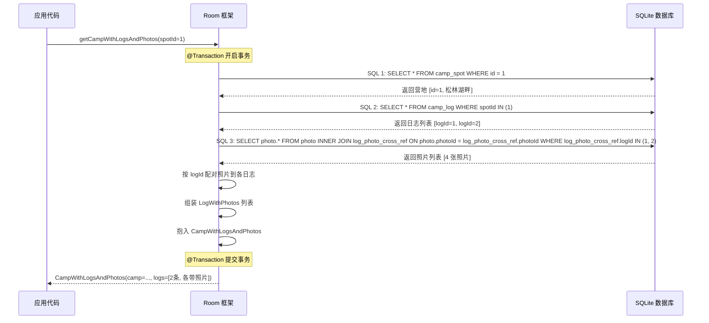
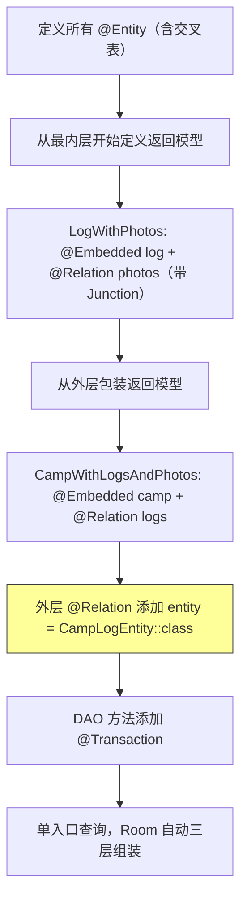

# 1.6.8 定义和查询嵌套关系

## 1.6.8 嵌套：当关系里还有关系

"等一下，怎么会有三层？"

洛芙盯着屏幕，眉头皱得像刚打了结的耳机线。她的手指停在键盘上方，悬了三秒，然后整个人往椅背一靠，发出一声短促的叹息。

上午的阳光从白桦林的间隙里泄下来，把溪边的石头照出一层暖蜜色的光晕。折叠桌上摆着四杯柠檬薄荷水——伊莎一大早切的，薄荷叶在冰水里打着卷，柠檬片贴着杯壁，像一枚枚被冻住的小太阳。

希尔叼着一根薄荷棒走过来，把笔记本往洛芙那边推了推。屏幕里是洛芙昨晚自己写的代码——三段嵌套的 for 循环，密密麻麻挤在一起，像一团解不开的毛线。

"我本来只想查一个营地的详细信息，"洛芙抓了抓头发，"结果需求变了：先查营地，再拿到这个营地下面所有的露营日志，再拿到每条日志关联的照片。营地 → 日志 → 照片。一层套一层，现在不是两层了，是三层。"

她停了半秒，把声音压得更低。

"我写成了三段循环查询……跑是能跑，但我自己看着都害怕。"

黛琳从她身后绕过来，手里端着柠檬水，视线落在那段代码上。她的表情没有变化——但洛芙已经学会读懂黛琳那种"我看到了问题但让你先说"的安静。

"你遇到的，"黛琳终于开口了，声音平静得像溪面上的倒影，"不是语法问题，也不是逻辑错误。你遇到的是——**你的数据本身就是有层级的，但你在用扁平的方式去读它**。"

"扁平的方式？"

"你写了三个查询方法，一个查营地，一个查日志，一个查照片。然后在应用层用循环把它们拼在一起。"黛琳把杯子放在桌上，走到白板前，拿起笔，"但其实 Room 自己可以帮你做这件事——你只需要告诉它：'关系里还有关系。'"

伊莎搬了一把椅子坐到洛芙旁边，声音轻柔得像在讲一个童话的下一页：

"你还记得露营收纳箱吗？大箱子里有小箱子，小箱子里还有分隔袋。你找一张照片不是直接翻整个箱子，而是：打开大箱子（营地）→ 取出小箱子（日志）→ 从口袋里拿出那张照片。数据的读取路径和收纳的层级完全对应。"

洛芙慢慢点头。

"所以我需要告诉 Room——'日志里面有照片，营地里面有日志（日志里面有照片）'？"

"对。"希尔把薄荷棒从嘴里拿出来，在空气中画了一个嵌套的圆圈，"这就叫**嵌套关系**——Nested Relationships。在 Room 的关系模型里再嵌入一个关系模型。"

洛芙在笔记本上把"嵌套关系"四个字圈了两圈，然后在旁边写下："关系里套关系。"

### 第一步：明确三层实体结构

"在动代码之前，先用一张图把整个结构压平到脑子里。"黛琳在白板上画了四个方块。

```mermaid
erDiagram
    CAMP_SPOT ||--o{ CAMP_LOG : "一对多"
    CAMP_LOG ||--o{ LOG_PHOTO_CROSS_REF : "签到"
    PHOTO ||--o{ LOG_PHOTO_CROSS_REF : "签到"
    CAMP_SPOT {
        long id PK
        string name
        string city
    }
    CAMP_LOG {
        long logId PK
        long spotId FK
        string date
        string content
    }
    PHOTO {
        long photoId PK
        string uri
        string caption
    }
    LOG_PHOTO_CROSS_REF {
        long logId FK-PK
        long photoId FK-PK
    }
```

> 图 1：三层嵌套关系的完整 ER 图。营地和日志是一对多（1.6.6 学过的），日志和照片是多对多（1.6.7 学过的，通过交叉表连接）。嵌套关系就是把这两层关系**组合**在一起。

洛芙看着图，用手指沿着箭头的方向划了一圈："顶层是营地，二层是日志，三层是照片。日志和照片之间用交叉表连起来——因为一条日志可以有多张照片，一张照片也可能出现在多条日志里。"

"完全正确。"黛琳放下白板笔，走回电脑前，"现在把实体代码稳住。"

```kotlin
// 代码片段 A：四张表的实体定义

// 表 1：营地（父表）
@Entity(tableName = "camp_spot")
data class CampSpotEntity(
    @PrimaryKey(autoGenerate = true)
    val id: Long = 0L,
    val name: String,
    val city: String
)

// 表 2：露营日志（中间层，一对多子表）
@Entity(
    tableName = "camp_log",
    foreignKeys = [
        ForeignKey(
            entity = CampSpotEntity::class,
            parentColumns = ["id"],
            childColumns = ["spotId"],
            onDelete = ForeignKey.CASCADE
        )
    ],
    indices = [Index("spotId")]
)
data class CampLogEntity(
    @PrimaryKey(autoGenerate = true)
    val logId: Long = 0L,
    val spotId: Long,
    val date: String,
    val content: String
)

// 表 3：照片（底层）
@Entity(tableName = "photo")
data class PhotoEntity(
    @PrimaryKey(autoGenerate = true)
    val photoId: Long = 0L,
    val uri: String,
    val caption: String
)

// 表 4：日志-照片交叉引用表（多对多的签到本）
// 复合主键 + 双 ForeignKey + 双 Index（和 1.6.7 一样）
@Entity(
    tableName = "log_photo_cross_ref",
    primaryKeys = ["logId", "photoId"],
    foreignKeys = [
        ForeignKey(
            entity = CampLogEntity::class,
            parentColumns = ["logId"],
            childColumns = ["logId"],
            onDelete = ForeignKey.CASCADE
        ),
        ForeignKey(
            entity = PhotoEntity::class,
            parentColumns = ["photoId"],
            childColumns = ["photoId"],
            onDelete = ForeignKey.CASCADE
        )
    ],
    indices = [
        Index("logId"),
        Index("photoId")
    ]
)
data class LogPhotoCrossRef(
    val logId: Long,
    val photoId: Long
)
```

"注意第四张表。"希尔用手指敲了敲屏幕上的 `LogPhotoCrossRef`，"它有两个 `ForeignKey`——一个指向 camp_log，一个指向 photo。两个外键列各有一个索引。这和昨天学的多对多交叉表**完全一致**。"

"如果我删除一条日志？"洛芙问。

"CASCADE 会清理 `log_photo_cross_ref` 里所有引用这条日志的配对记录——但照片本身还在。"黛琳回答，"再往上一层，如果删除营地，CASCADE 先删所有日志，删日志的过程中再清理交叉表。层层级联，自上而下。"

洛芙在笔记本上画了三个箭头：**DELETE 营地 → CASCADE 删日志 → CASCADE 删交叉记录（照片不动）**。

### 第二步：嵌套关系的返回模型——从内到外

"实体定义好了，接下来是最关键的——嵌套的返回模型。"黛琳新建了一个文件，手指在键盘上停了一拍，然后说了一句让洛芙后来在笔记本上画了星号的话：

"**从最内层开始定义，逐层向外扩展。**"

"先定义'日志 + 照片'，再把它嵌入'营地 + 日志们'。"

```kotlin
// 代码片段 B：嵌套关系的返回模型

// 第一层包装：一条日志 + 它关联的所有照片
// 日志和照片是多对多，所以需要 Junction
data class LogWithPhotos(
    @Embedded val log: CampLogEntity,
    @Relation(
        parentColumn = "logId",
        entityColumn = "photoId",
        associateBy = Junction(
            value = LogPhotoCrossRef::class,
            parentColumn = "logId",
            entityColumn = "photoId"
        )
    )
    val photos: List<PhotoEntity>
)

// 第二层包装：一个营地 + 它的所有日志（每条日志已经带着照片）
// 注意：这里 @Relation 的字段类型不是 List<CampLogEntity>
//       而是 List<LogWithPhotos>——Room 会自动递归填充内层关系
data class CampWithLogsAndPhotos(
    @Embedded val camp: CampSpotEntity,
    @Relation(
        entity = CampLogEntity::class,   // 关键参数！
        parentColumn = "id",
        entityColumn = "spotId"
    )
    val logs: List<LogWithPhotos>
)
```

洛芙眨了眨眼，盯着第二段代码看了五六秒。然后她的目光定在了一行上：`entity = CampLogEntity::class`。

"等一下。之前写一对多的时候，`@Relation` 里没有这个 `entity` 参数啊。为什么这里需要？"

这是个好问题。黛琳转过身来，表情认真了几分。

"因为之前一对多的时候，字段类型是 `List<CampLogEntity>`——Room 可以直接从泛型参数推断出对应的 Entity 是 `CampLogEntity`。但在嵌套关系里，字段类型是 `List<LogWithPhotos>`。"

她顿了一下，确保洛芙跟上了。

"`LogWithPhotos` 不是 `@Entity`。它是一个**返回模型**——一个组合类。Room 没办法从它推断出'我应该去查哪张表'。所以你必须用 `entity = CampLogEntity::class` **手动告诉 Room**：'嘿，这个关系对应的底层表是 camp_log。'"

"哦——！"洛芙的手指在笔记本上快速写下：

> **`entity = XxxEntity::class`**：当 `@Relation` 字段类型不是 Entity 本身（而是组合类如 `LogWithPhotos`）时，必须手动指定对应的 Entity 类，让 Room 知道该去查哪张表。

"这就是嵌套关系和普通关系在代码上最核心的差异。"希尔叼回薄荷棒，声音含含糊糊但很肯定，"多了一个 `entity` 参数。其他所有东西——`@Embedded`、`parentColumn`、`entityColumn`、`@Transaction`——全都一样。"

伊莎在旁边轻声说："就像你在收纳箱上贴了一个标签：'这个箱子是日志箱'。Room 看到标签就知道往哪里找了。"

### 第三步：DAO——单入口查询

"DAO 的写法极其简单。"希尔打开新文件。

```kotlin
// 代码片段 C：嵌套关系的 DAO

@Dao
interface CampNestedDao {

    // 查询单个营地的完整嵌套数据
    // Room 内部会发出多条 SQL，自动组装三层结构
    @Transaction
    @Query("SELECT * FROM camp_spot WHERE id = :spotId")
    suspend fun getCampWithLogsAndPhotos(spotId: Long): CampWithLogsAndPhotos?

    // 查询所有营地的完整嵌套数据
    @Transaction
    @Query("SELECT * FROM camp_spot ORDER BY id DESC")
    suspend fun getAllCampsWithNestedData(): List<CampWithLogsAndPhotos>

    // 响应式版本：任何层级的数据变化都会触发重新推送
    @Transaction
    @Query("SELECT * FROM camp_spot ORDER BY id DESC")
    fun observeAllCampsNested(): Flow<List<CampWithLogsAndPhotos>>
}
```

"你注意到了吗？"黛琳指着 `@Query` 那一行，"SQL 只写了 `SELECT * FROM camp_spot`——你只查了营地表。但 Room 会根据你的返回类型 `CampWithLogsAndPhotos`，**自动生成**查日志和查照片的 SQL。"

"这就是声明式编程的力量，"伊莎微微抬了一下下巴，"你告诉 Room'我想要什么结构'，它来决定'怎么查'。"

"但——"洛芙举起手，"Room 到底发了几条 SQL？是按什么顺序发的？"

"好问题。"希尔拿起白板笔，画了一张时序图。



> 图 2：Room 处理三层嵌套查询的内部执行流程。一共发了 **3 条 SQL**：查营地 → 查该营地的日志 → 通过交叉表查这些日志关联的所有照片。然后在内存中配对组装。整个过程在同一事务内完成。

洛芙仔细看着这张时序图，手指在笔记本上一条一条划过 SQL。

"三条 SQL，不管有多少条日志和照片，都是固定三条——不会像我之前写的那样，日志越多 SQL 越多。"

"正是。"黛琳的声音带了一丝少见的强调，"这就是嵌套关系和手动循环查询的**根本区别**。Room 用 `IN (...)` 一次性拉回所有需要的数据，而不是一条条循环。"

### 反模式：N+1 查询——你之前写的那段

希尔站起来，走到洛芙背后，轻轻拍了一下她的肩膀。

"来，把你昨晚写的那段代码翻出来。"

洛芙有点心虚地翻出旧代码。

```kotlin
// 代码片段 D-1：反模式——N+1 查询
// 问题：先查营地，再循环查每条日志，再循环查每条日志的照片
// 日志越多，SQL 次数越多，性能越差

suspend fun loadCampDetailBad(spotId: Long): CampDetailUi {
    val camp = campDao.findById(spotId) ?: return CampDetailUi.empty()
    val logs = logDao.findBySpotId(spotId)  // SQL 2

    val logItems = mutableListOf<LogItemUi>()
    for (log in logs) {
        // 每条日志单独查一次照片 → N 条日志 = N 次 SQL
        val photos = photoDao.findByLogId(log.logId)
        logItems += LogItemUi(log = log, photos = photos)
    }

    return CampDetailUi(camp = camp, logs = logItems)
}
// 如果有 50 条日志：1(营地) + 1(日志列表) + 50(每条日志的照片) = 52 条 SQL
// 如果有 200 条日志：1 + 1 + 200 = 202 条 SQL
```

黛琳扫了几行就点头："**N+1 查询**。这个名字的意思是：你先执行 1 条查询拿到 N 条结果，然后对每条结果再执行 1 条查询——总共 N+1 条 SQL。数据量小的时候感觉不到，数据量一大就是场灾难。"

"十条日志你可能还能忍，"希尔的语气像在描述一场她亲眼见过的事故，"一百条就开始明显卡顿，一千条直接 ANR（Application Not Responding）。"

"那用嵌套关系重写呢？"洛芙问。

```kotlin
// 代码片段 D-2：重构——用嵌套关系 + 单入口查询

suspend fun loadCampDetailGood(spotId: Long): CampDetailUi {
    val nested = campNestedDao.getCampWithLogsAndPhotos(spotId)
        ?: return CampDetailUi.empty()

    return CampDetailUi(
        camp = nested.camp,
        logs = nested.logs.map { logWithPhotos ->
            LogItemUi(log = logWithPhotos.log, photos = logWithPhotos.photos)
        }
    )
}
// 无论有多少条日志，始终只有 3 条 SQL
// Room 用 IN (...) 批量查询，在内存中配对
```

| 对比维度 | N+1 循环查询 | 嵌套关系单入口 |
|---------|-------------|-------------|
| SQL 次数 | 1 + 1 + N（N = 日志数） | 固定 3 条 |
| 50 条日志 | 52 条 SQL | 3 条 SQL |
| 200 条日志 | 202 条 SQL | 3 条 SQL |
| 事务保护 | 无 | @Transaction 自动 |
| Flow 支持 | 手动实现 | 原生支持 |
| 维护成本 | 高（手动配对逻辑） | 低（Room 自动生成） |

洛芙盯着对比表，深吸一口气。

"202 条 SQL 和 3 条 SQL……差距也太大了。"

"这就是为什么 Room 要提供嵌套关系，"黛琳的声音恢复了平常的平静，"它不是锦上添花，它是**性能必需品**。"

### 按需读取：嵌套不是默认

伊莎把薄荷叶从杯底捞出来，放在纸巾上。柠檬水的清香混着薄荷的凉意在空气里弥漫。

"我有一个问题，"洛芙抬起头，"这个嵌套模型太好用了——我能不能在所有页面都用 `CampWithLogsAndPhotos`？列表页也用它？"

三个人几乎同时摇了头。

"列表页只需要营地名和日志数量，"黛琳说，"如果你用嵌套模型，Room 会把每个营地的每条日志的每张照片全部加载到内存。十个营地、每个营地五十条日志、每条日志三张照片——那就是十五万条数据全拉上来，只为了显示十行列表。"

洛芙缩了缩脖子。

"列表页用 1.6.6 教过的 COUNT + GROUP BY 投影就够了，"希尔补充，"只拿统计数字，不拿完整内容。详情页才用嵌套关系，一次性拉完一个营地的全部层级。"

她在白板上写了一行字：

> **读取层级越深，越要明确展示目的。嵌套是有成本的选择，不是默认选项。**

"这个叫**按需读取**，"黛琳说着走到代码前，"不同的页面用不同粒度的查询。"

```kotlin
// 代码片段 E：不同页面用不同查询粒度

// 列表页：只查营地名 + 日志数量（轻量）
data class SpotSummary(
    @ColumnInfo(name = "name") val name: String,
    val city: String,
    val logCount: Int
)

@Query("""
    SELECT cs.name, cs.city, COUNT(cl.logId) AS logCount
    FROM camp_spot cs
    LEFT JOIN camp_log cl ON cs.id = cl.spotId
    GROUP BY cs.id
    ORDER BY logCount DESC
""")
fun observeSpotSummaries(): Flow<List<SpotSummary>>

// 详情页：嵌套查询，拉完整层级（重量）
@Transaction
@Query("SELECT * FROM camp_spot WHERE id = :spotId")
suspend fun getCampWithLogsAndPhotos(spotId: Long): CampWithLogsAndPhotos?
```

### 验证嵌套关系：最小可证伪测试

洛芙把笔帽咬在嘴里，含糊地说："我需要一个测试，证明这个三层嵌套真的按预期组装了。"

"好习惯。"希尔竖起大拇指。

```kotlin
// 代码片段 F：嵌套关系 instrumentation 测试

@RunWith(AndroidJUnit4::class)
class CampNestedRelationTest {

    private lateinit var db: AppDatabase
    private lateinit var nestedDao: CampNestedDao

    @Before
    fun setup() {
        val context = ApplicationProvider.getApplicationContext<Context>()
        db = Room.inMemoryDatabaseBuilder(context, AppDatabase::class.java)
            .allowMainThreadQueries()
            .build()
        nestedDao = db.campNestedDao()
    }

    @After
    fun teardown() {
        db.close()
    }

    @Test
    fun nested_relation_returns_logs_and_photos() = runBlocking {
        // 插入营地
        val campId = db.campDao().insert(
            CampSpotEntity(name = "松林湖畔", city = "青山市")
        )
        // 插入两条日志
        val log1 = db.logDao().insert(
            CampLogEntity(spotId = campId, date = "2026-02-18", content = "风很轻")
        )
        val log2 = db.logDao().insert(
            CampLogEntity(spotId = campId, date = "2026-02-19", content = "雨声入梦")
        )
        // 插入两张照片
        val photo1 = db.photoDao().insert(
            PhotoEntity(uri = "content://photo/1", caption = "晨雾")
        )
        val photo2 = db.photoDao().insert(
            PhotoEntity(uri = "content://photo/2", caption = "篝火")
        )
        // 建立交叉引用：日志1 关联 照片1 和 照片2，日志2 关联 照片2
        db.crossRefDao().insert(LogPhotoCrossRef(log1, photo1))
        db.crossRefDao().insert(LogPhotoCrossRef(log1, photo2))
        db.crossRefDao().insert(LogPhotoCrossRef(log2, photo2))

        // 查询嵌套结果
        val nested = nestedDao.getCampWithLogsAndPhotos(campId)

        // 验证三层结构
        assertThat(nested).isNotNull()
        assertThat(nested!!.camp.name).isEqualTo("松林湖畔")
        assertThat(nested.logs.size).isEqualTo(2)

        val firstLog = nested.logs.find { it.log.content == "风很轻" }!!
        assertThat(firstLog.photos.size).isEqualTo(2) // 两张照片

        val secondLog = nested.logs.find { it.log.content == "雨声入梦" }!!
        assertThat(secondLog.photos.size).isEqualTo(1) // 一张照片
        assertThat(secondLog.photos.first().caption).isEqualTo("篝火")
    }
}
```

希尔按下运行按钮。白桦林里传来啄木鸟的"嗒嗒嗒"声，像在给测试倒计时。

```
Tests passed: 1 of 1 test - 0.8s
```

洛芙看到绿色通过标记，明显松了一口气。她把电脑合上一半，又立刻掀开——像怕刚才那点理解会从屏幕里跑掉。

### 嵌套的边界：不是层数越多越好

午后的阳光从正白色偏向了浅金色。伊莎端着新的柠檬水走过来，杯底垫了一片香樟叶防滑。

"我再问一个问题。"洛芙抬起头，"如果我的数据不止三层呢？比如营地 → 日志 → 照片 → 标签？四层嵌套可以吗？"

"技术上可以。"黛琳的声音很谨慎，"Room 支持任意深度的嵌套。你可以定义 `PhotoWithTags`，然后在 `LogWithPhotos` 里把 `List<PhotoEntity>` 改成 `List<PhotoWithTags>`——再套一层。"

"但——"希尔把薄荷棒转了一圈，"层级越深，Room 发出的 SQL 越多，内存中配对的数据量越大，首次加载越慢。在实际项目里，三层已经是比较深了。再深的话，建议你在 UI 层做分页或懒加载，而不是一次全拉。"

"一个好的经验法则是，"伊莎轻声说，"**超过三层嵌套时，先问自己：用户真的需要一次看到所有层级的数据吗？**"

洛芙在笔记本上写下了一行小字：

> 嵌套深度 ≤ 3 层是舒适区。超过 3 层时考虑分页或懒加载。

### 嵌套关系结构的完整步骤

"最后让我画一张完整的步骤图。"希尔在白板上画了最后一张图。



> 图 3：实现嵌套关系的完整步骤链。黄色高亮的步骤是嵌套关系独有的新知识——必须用 `entity` 参数手动指定底层表。

洛芙看着白板上的三张图——ER 图、时序图、步骤图。

"我现在终于知道'嵌套关系'在解决什么了。它不是为了炫技，是为了**把业务里的层级语义，原封不动地带回代码里**。营地包含日志，日志包含照片——数据本身有层级，代码也应该有层级。"

她一字一句地说完，声音很轻但很稳。

黛琳端着杯子看着她，没有说话。沉默持续了大约三秒——然后她点了一下头，嘴角微微上翘了一丝弧度。这是她所有表情里最高等级的赞许。

"是。你不是在拼数据，你是在**还原现实结构**。"

伊莎笑着把一颗洗干净的小苹果推到洛芙手边："现实有层次，代码也可以有层次。"

希尔站起身伸了个懒腰，白桦叶影在她肩上晃了一下。她回头看了洛芙一眼。

"下一章异步 DAO，你会更喜欢的。因为今天学的嵌套关系和异步加载配在一起，会非常顺畅。"

洛芙咬着苹果，含糊地"嗯"了一声。

风从林子深处吹过来，掀起白板角落那张便签纸。便签上是她刚写下的新口诀：

**先建关系，再建返回模型，最后一条入口查询。**

一只松鼠从白桦树干上探出头，看了看折叠桌上那杯没喝完的柠檬水，又缩回去了。阳光在溪面上碎成满地的金片，像谁打翻了一整盒星星。

---

### 技术总结

> **嵌套关系（Nested Relationships）** —— Room 中通过多层 `@Relation` 组合，把三张或更多张表的跨层级数据一次性映射为结构化嵌套对象的建模方式。关键在于：①从最内层开始逐层定义返回模型；②当 `@Relation` 字段类型不是 Entity 而是组合类时，必须通过 `entity = XxxEntity::class` 手动指定底层表；③使用 `@Transaction` 保证多条 SQL 的组装一致性。

#### 今日关键词

1. **嵌套关系（Nested Relationships）**：在 `@Relation` 返回模型里再嵌入另一个带 `@Relation` 的模型，形成"关系里套关系"的多层结构。适合表达"父→子→孙"这类真实业务层级。
2. **entity 参数**：`@Relation` 的可选属性。当字段类型是组合类（如 `LogWithPhotos`）而不是 Entity 本身时，必须用 `entity = CampLogEntity::class` 手动指定底层 Entity，让 Room 知道该查哪张表。
3. **N+1 查询（N+1 Query）**：典型性能反模式——先执行 1 条查询拿到 N 条结果，再对每条结果执行 1 条查询，总共 N+1 条 SQL。嵌套关系用 `IN (...)` 批量查询替代循环，将 SQL 数固定为层数。
4. **按需读取**：根据页面需求选择不同粒度的查询。列表页用 COUNT 投影，详情页用嵌套全量加载。避免在不需要深层数据的场景使用嵌套查询。
5. **@Transaction**：嵌套关系查询必须加事务注解。Room 发出多条 SQL 来组装层级结果，事务保证不会在组装过程中读到不一致的中间状态。
6. **从内向外定义**：嵌套返回模型的定义顺序——先定义最内层的组合类（`LogWithPhotos`），再将其嵌入外层组合类（`CampWithLogsAndPhotos`）。

#### 结构图


#### 反模式与陷阱

1. **N+1 循环查询**：先查父表再循环查子表的每条记录，SQL 次数随数据量线性增长。50 条日志 = 52 条 SQL。
   * **修复**：使用嵌套关系 + 单入口 DAO 方法，SQL 次数固定为层数（3 层 = 3 条 SQL）。

2. **省略 @Transaction**：嵌套查询涉及多条 SQL。不加事务时，组装过程中数据可能被修改，导致结果不一致。
   * **修复**：嵌套关系的 DAO 方法必须加 `@Transaction`。

3. **列表页滥用深层嵌套**：在只需营地名和日志数的列表页使用 `CampWithLogsAndPhotos`，一次拉取全部层级数据，首屏变慢。
   * **修复**：列表页用 COUNT + GROUP BY 投影查询，详情页才用嵌套查询。

4. **`@Relation` 缺少 `entity` 参数**：当字段类型是组合类（非 Entity）时，Room 无法推断底层表，编译期报错。
   * **修复**：添加 `entity = CampLogEntity::class` 显式指定。

5. **交叉表缺少 ForeignKey 或索引**：交叉表没有外键则无级联保护，没有索引则 JOIN 时全表扫描。
   * **修复**：交叉表始终定义双 ForeignKey + 双 Index（与 1.6.7 标准一致）。

6. **嵌套超过三层不做限制**：层级越深，SQL 越多，内存配对数据量越大，首次加载越慢。
   * **修复**：超过三层时考虑分页、懒加载或分步查询。

#### 设计哲学：还原现实结构

1. **数据的层级是业务语义**：营地包含日志，日志包含照片——这不是技术决策，是现实世界的结构。嵌套关系让代码忠实反映这种层级。
2. **从内到外的建模顺序**：先定义最小粒度的关系组合，再逐层向外扩展。这保证了每一层都可以独立复用。
3. **查询粒度匹配使用场景**：不存在"万能查询"。列表页、详情页、统计页应该各自有专属的查询方法和返回模型。
4. **声明式 > 命令式**：告诉 Room "我想要什么结构"，让它决定"怎么查"。这比手写循环拼装更安全、更高效、更易维护。
5. **N+1 是关系查询的头号敌人**：在任何涉及多表关联的场景中，警惕循环查询。用批量 `IN (...)` 替代逐条 `WHERE id = ?`。

#### 面试热身 (Interview Warm-up)

> 请尝试用自己的语言回答以下问题，能说清楚才是真的懂了。

1. **Q1**：什么是嵌套关系？它和普通的一对多/多对多查询有什么区别？
2. **Q2**：`@Relation` 中的 `entity` 参数什么时候需要手动指定？不指定会怎样？
3. **Q3**：N+1 查询问题是什么？Room 的嵌套关系如何解决它？
4. **Q4**：为什么列表页不应该使用嵌套查询？你会用什么替代方案？
5. **Q5**：嵌套关系查询为什么必须加 `@Transaction`？不加会有什么风险？

#### 参考实现要点

1. **交叉表必须注册到 @Database**：`LogPhotoCrossRef` 是 `@Entity`，需要在 `@Database(entities = [...])` 中列出所有四张表。
2. **返回模型不需要注册到 @Database**：`LogWithPhotos` 和 `CampWithLogsAndPhotos` 不是 Entity，不需要注册。
3. **嵌套的 Flow 监听覆盖所有层级**：营地表、日志表、照片表、交叉表——任何一张表的数据变化都会触发 Flow 重新推送。
4. **`entity` 参数只需在外层 @Relation 指定**：内层 `LogWithPhotos` 的 `@Relation` 字段类型是 `List<PhotoEntity>`（是 Entity），不需要额外指定 `entity`。
5. **嵌套模型可以独立使用**：`LogWithPhotos` 可以单独用于"日志详情页"，不必总是通过 `CampWithLogsAndPhotos` 访问。层层组合，各层独立。

---

### 🏕️ 动手练习：嵌套关系实战

#### Task 1 · 四表建立 (Four Tables) ★

**目标**：定义营地、日志、照片、交叉引用四张表并注册到 Database。

**你需要做的事**：
1. 把代码片段 A 中的四个 `@Entity` 类复制到项目中。
2. 在 `@Database` 注解中注册四张表。
3. 编译运行，确认无错误无警告。
4. 用 Database Inspector 验证交叉表结构。

**验收标准**：
- [ ] 四张表全部出现在 Database Inspector 中
- [ ] `log_photo_cross_ref` 有复合主键和两个索引
- [ ] 编译通过且无 Room 相关警告

---

#### Task 2 · 内层包装 (Inner Wrapper) ★★

**目标**：定义 `LogWithPhotos` 返回模型，验证日志-照片的多对多嵌套。

**你需要做的事**：
1. 创建 `LogWithPhotos` 数据类（代码片段 B 的第一部分）。
2. 在 DAO 中添加方法查询单条日志及其照片。
3. 插入一条日志 + 两张照片 + 交叉引用记录。
4. 查询并打印结果。

**验收标准**：
- [ ] 查询返回的 `LogWithPhotos` 包含 2 张照片
- [ ] 照片内容正确
- [ ] 不插入照片时返回空列表

---

#### Task 3 · 外层包装 (Outer Wrapper) ★★★

**目标**：定义 `CampWithLogsAndPhotos`，实现完整三层嵌套查询。

**你需要做的事**：
1. 创建 `CampWithLogsAndPhotos` 数据类（代码片段 B 的第二部分）。
2. 注意添加 `entity = CampLogEntity::class` 参数。
3. 在 DAO 中添加 `getCampWithLogsAndPhotos()` 方法（代码片段 C）。
4. 插入完整数据（1 营地 + 2 日志 + 3 照片 + 交叉引用）并查询。

**验收标准**：
- [ ] 返回对象的 `camp` / `logs` / `photos` 三层完整
- [ ] 每条日志的照片数量正确
- [ ] `@Relation` 中有 `entity` 参数

**提示**：
```kotlin
// 如果忘记加 entity 参数，Room 编译时会报错：
// "Cannot figure out how to read this field from a cursor."
```

---

#### Task 4 · N+1 灭杀 (Kill N+1) ★★★

**目标**：对比 N+1 循环查询和嵌套关系的 SQL 次数差异。

**你需要做的事**：
1. 实现代码片段 D-1 的反模式写法。
2. 实现代码片段 D-2 的嵌套关系写法。
3. 插入 1 个营地 + 10 条日志 + 每条日志 2 张照片。
4. 分别运行两种方式，观察 Logcat 中的 SQL 次数。

**验收标准**：
- [ ] 反模式：1 + 1 + 10 = 12 条 SQL
- [ ] 嵌套关系：3 条 SQL
- [ ] 能用一段话解释 N+1 问题

**提示**：
```kotlin
// 在 Room Database Builder 中开启 SQL 日志：
Room.databaseBuilder(context, AppDatabase::class.java, "test.db")
    .setQueryCallback({ sql, args -> Log.d("SQL", sql) }, Executors.newSingleThreadExecutor())
    .build()
```

---

#### Task 5 · 按需裁剪 (On-Demand Trim) ★★★

**目标**：为列表页设计轻量查询，只返回营地名和日志数量，不加载照片。

**你需要做的事**：
1. 定义 `SpotSummary` 投影类（代码片段 E）。
2. 实现 COUNT + GROUP BY 查询。
3. 插入 3 个营地（分别有 5、2、0 条日志）。
4. 对比轻量查询和嵌套全量查询的结果差异。

**验收标准**：
- [ ] 轻量查询只返回 name、city、logCount
- [ ] 0 条日志的营地也出现在结果里
- [ ] 嵌套查询返回完整的三层数据（作为对照）

---

#### Task 6 · 级联瀑布 (Cascade Waterfall) ★★★★

**目标**：验证三层嵌套下 CASCADE 的级联传导效果。

**你需要做的事**：
1. 插入完整的三层数据。
2. 删除一个营地。
3. 检查日志表和交叉表是否被级联清理。
4. 检查照片表是否不受影响。

**验收标准**：
- [ ] 删除营地后，日志表中该营地的日志全部消失
- [ ] 交叉表中对应记录全部消失
- [ ] 照片表中的照片仍然存在（CASCADE 从 camp_log 到交叉表，不会传到 photo）

**提示**：
```kotlin
// CASCADE 链路：DELETE camp_spot → CASCADE 删 camp_log → CASCADE 删 cross_ref
// 但 cross_ref → photo 的 ForeignKey 是在 cross_ref 中定义的
// 删除 cross_ref 的行不会触发 photo 的 CASCADE
```

---

#### Task 7 · entity 参数实验 (Entity Param) ★★★★

**目标**：亲手体验不加 `entity` 参数时 Room 的编译错误。

**你需要做的事**：
1. 把 `CampWithLogsAndPhotos` 中的 `entity = CampLogEntity::class` 注释掉。
2. 编译项目，观察 Room 的错误信息。
3. 恢复 `entity` 参数，确认编译通过。
4. 记录错误信息，写出为什么需要这个参数。

**验收标准**：
- [ ] 去掉 `entity` 后 Room 报类似 "Cannot figure out how to read this field" 的错误
- [ ] 恢复后编译通过
- [ ] 能用一句话解释 `entity` 参数的作用

---

#### Task 8 · 嵌套全链路测试 (Full Nested Test) ★★★★★

**目标**：编写 instrumentation 测试，覆盖嵌套关系的完整生命周期。

**你需要做的事**：
1. 创建内存数据库。
2. 编写以下测试用例：
   - 三层数据完整插入 → 嵌套查询 → 验证每层数据正确
   - 营地无日志 → 嵌套查询 → 验证 `logs` 为空列表
   - 日志无照片 → 嵌套查询 → 验证内层 `photos` 为空列表
   - 删除营地 → 验证日志和交叉表被级联清理
   - 同一照片关联多条日志 → 验证照片在两个 `LogWithPhotos` 中都出现
3. 运行测试，确保全绿。

**验收标准**：
- [ ] 5 个测试用例全部通过
- [ ] 测试使用内存数据库，不影响真实数据
- [ ] 每个测试方法名清晰表达测试意图

---

> 💡 嵌套关系是 Room 关系建模的终极组合技——它不引入新注解，只是把前面学过的一对多和多对多**嵌套使用**。掌握它的关键不在于记住语法，而在于理解"数据有层级，查询也应该有层级"这个设计思想。下一步，试着在你的露营 App 里把"营地→日志→照片"这条链路跑通。

---

### 🍭 洛芙的小小日记本

今天把"营地→日志→照片"终于连通了。最有用的一句：先建关系，再建返回模型，再做单入口查询。202 条 SQL 压缩到 3 条的那一刻，突然觉得 Room 像是一个特别可靠的伙伴。
