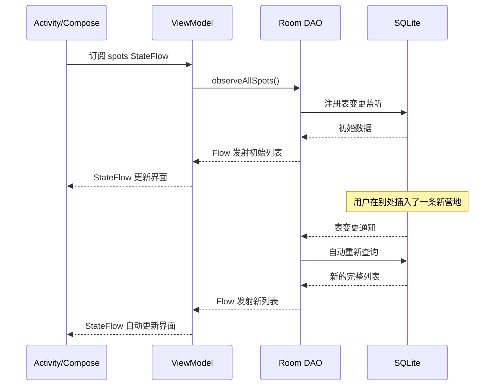
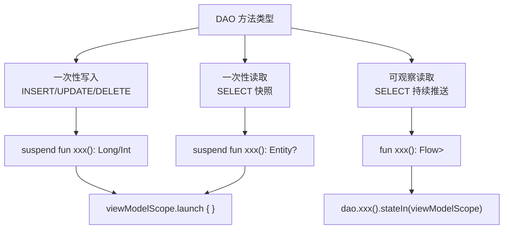

# 1.6.9 编写异步 DAO 查询

“动不了了！”

洛芙的惊呼声打破了清晨的宁静。她举着手机，屏幕画面定格在“星空湖畔”的详情页上，任凭她怎么狂点返回键，界面都像被冻住了一样，纹丝不动。

三秒钟后，一个白色的系统弹窗无情地跳了出来：

**App 停止运行**
(等待) (关闭应用)

“我只是...在 `onCreate` 里查了一下数据库...”洛芙委屈地看向围过来的三人，“代码明明和昨天写的一样。”

希尔接过去看了一眼 Logcat，上面的红色报错鲜红刺眼：`IllegalStateException: Cannot access database on the main thread`。

“破案了。”希尔打了个响指，“你试图在主线程里搬运大象。”

“搬运...大象？”

伊莎正在把刚煮好的咖啡倒进四个马克杯里，热气在清冷的空气中升腾起来。“主线程就像我们面前这条溪流，”她指着帐篷边潺潺的流水，“它负责把画面流畅地送到用户眼前。如果你把一块巨大的石头——也就是耗时的数据库查询——扔进溪水里，水流就会断流，画面就会卡死。”

“Android 系统为了防止你把溪水堵死，专门设了一个关卡。”黛琳接过咖啡，轻轻吹了一口气，“Room 检测到你在主线程查数据库，直接抛出异常让你崩溃。这其实是在保护你——与其卡死（ANR），不如直接告诉你路走错了。”

“那...石头该放哪？”洛芙看着报错，有点不知所措。

“放进支流里。”希尔在键盘上敲下了一个关键词，“我们需要**异步**。”

### 怎么选？
希尔把电脑推回给洛芙，屏幕上是一行等待完成的代码。
“异步不是一种魔法，它是一套工具箱。”希尔在白板上画了三个图标：一个闪电、一个照相机、还有一个摄像机。

“Room 把所有查询分成了三类，每一类都有对应的异步工具。”

“第一类：**闪电（一次性写入）**。”希尔指着闪电图标，“插入、更新、删除。动作快，做完就走，不需要回头。”

“第二类：**照相机（一次性读取）**。”她指了指相机，“`SELECT` 查询。咔嚓一下，拍下那一瞬间的数据快照。拍完之后，底片就不会变了——哪怕真实世界里的人已经走了。”

“第三类：**摄像机（可观察读取）**。”希尔的手指停在最后一个图标上，“这是 Room 最强大的功能。你不仅是查数据，而是在**监视**数据。只要数据库里的数据变了，屏幕上的画面就自动跟着变——就像摄像机把画面实时传到监视器上。”

洛芙看着这三个图标，若有所思：“那我之前的 `insert` 是闪电，`getSpot` 是照相机？”

“没错。”黛琳点头，“对于前两类（闪电和照相机），Kotlin 给你的武器是 `suspend`。对于第三类（摄像机），武器是 `Flow`。”


### suspend：一次性操作的异步武器

"先说 `suspend`。"希尔打开编辑器，指节在键盘边缘轻轻敲了两下。

"你在 DAO 方法前面加 `suspend` 关键字，Room 在编译期就知道：'这个方法不会在主线程执行。调用者必须在协程里调用它。'"

```kotlin
// 代码片段 A：suspend 标记的一次性 DAO 方法

@Dao
interface CampSpotDao {

    // 一次性写入：插入营地
    // suspend 告诉 Room：这个方法必须在协程中调用
    // Room 会自动在后台线程（Dispatchers.IO）执行数据库操作
    @Insert(onConflict = OnConflictStrategy.REPLACE)
    suspend fun insertSpot(spot: CampSpotEntity): Long

    // 一次性写入：批量更新
    @Update
    suspend fun updateSpots(vararg spots: CampSpotEntity): Int

    // 一次性写入：删除
    @Delete
    suspend fun deleteSpot(spot: CampSpotEntity): Int

    // 一次性读取：按 ID 查询
    // 返回快照，查完即止
    @Query("SELECT * FROM camp_spot WHERE id = :spotId")
    suspend fun findSpotById(spotId: Long): CampSpotEntity?

    // 一次性读取：按城市筛选
    @Query("SELECT * FROM camp_spot WHERE city IN (:cities)")
    suspend fun findSpotsByCities(cities: List<String>): List<CampSpotEntity>
}
```

"加了 `suspend` 之后，这些方法只能在**协程**里调用。"希尔竖起一根手指，"协程是 Kotlin 的一种轻量级并发工具——你可以把它理解成一个不会堵住主线程的'打工小精灵'。你让小精灵去后台查数据库，屏幕上的画面继续正常刷新，等小精灵查完了，你再拿结果更新界面。"

"听起来有点像多线程？"洛芙问。

"比多线程更轻。"黛琳简洁地说，"一个线程的开销是几百 KB 内存，一个协程只需要几十字节。你可以同时开上千个协程，但不建议同时开上千个线程。"

洛芙在笔记本上写下：**suspend = 只能在协程里调用 = 自动在后台线程执行 = 不堵主线程**。

### 在 ViewModel 中调用 suspend DAO

"那我在哪里创建协程呢？"洛芙举起手。

"在 ViewModel 里。"希尔翻到下一页代码。

```kotlin
// 代码片段 B：在 ViewModel 中调用 suspend DAO

class CampSpotViewModel(
    private val dao: CampSpotDao
) : ViewModel() {

    // viewModelScope：与 ViewModel 生命周期绑定的协程作用域
    // ViewModel 被销毁时，所有未完成的协程自动取消
    fun addSpot(name: String, city: String) {
        viewModelScope.launch {
            // 这行代码在后台线程执行，不会堵住 UI
            val id = dao.insertSpot(
                CampSpotEntity(name = name, city = city)
            )
            Log.d("Async", "插入成功，id = $id")
        }
    }

    // 一次性读取 + 更新 UI 状态
    private val _spotDetail = MutableStateFlow<CampSpotEntity?>(null)
    val spotDetail: StateFlow<CampSpotEntity?> = _spotDetail

    fun loadSpot(spotId: Long) {
        viewModelScope.launch {
            // suspend 函数在后台执行
            // 结果返回后自动切回主线程，安全更新 UI 状态
            _spotDetail.value = dao.findSpotById(spotId)
        }
    }
}
```

"注意 `viewModelScope.launch`，"黛琳用手指点了点那一行，眼睛没有离开屏幕，"这是 Jetpack 提供的一个**协程作用域**。它有两个好处：第一，协程默认在主线程启动，但 Room 的 suspend 方法会自动切换到 `Dispatchers.IO`（后台线程池）执行数据库操作；第二，当 ViewModel 被销毁时，所有通过 `viewModelScope` 启动的协程会自动取消，不会泄露。"

"不会泄露？"洛芙的眉毛挑了一下。

"就是说……"伊莎从帐篷里完全走出来，头发终于扎好了，扎成了一个松松的低马尾，"你启动了一个协程去查数据库。结果用户在查询完成之前按了返回键，Activity 被关掉了。如果没有 `viewModelScope`，那个协程还在后台默默跑着，查完以后试图更新一个已经不存在的界面——这就是泄露。有了 `viewModelScope`，Activity 一关，ViewModel 一销毁，协程立刻被取消。干干净净。"

洛芙在笔记本上画了一个小圈，里面写着"viewModelScope"，旁边标注了两个关键词：**后台执行** 和 **自动取消**。

### 反模式：在主线程直接调用 DAO

"我来给你看看如果不用 suspend 会怎样。"希尔的嘴角带着一种"接下来你会看到的东西很吓人"的微笑。

```kotlin
// 代码片段 C-1：反模式——主线程直接调用 DAO

// ❌ 错误示例：不加 suspend，直接在主线程调用

@Dao
interface BadDao {
    // 没有 suspend 关键字！
    @Query("SELECT * FROM camp_spot WHERE id = :spotId")
    fun findSpotByIdSync(spotId: Long): CampSpotEntity?
}

// 在 Activity 中直接调用
class CampActivity : AppCompatActivity() {
    override fun onCreate(savedInstanceState: Bundle?) {
        super.onCreate(savedInstanceState)

        // 主线程直接查询数据库 → Room 立刻抛出异常
        val spot = badDao.findSpotByIdSync(1L)
        // java.lang.IllegalStateException:
        // Cannot access database on the main thread since it may potentially
        // lock the UI for a long period of time.
    }
}
```

"Room 直接崩给你看。"希尔摊开手，"它不会让你有机会体验 ANR。"

```kotlin
// 代码片段 C-2：正确做法——用 suspend + 协程

// ✅ 正确：suspend DAO + viewModelScope

@Dao
interface GoodDao {
    @Query("SELECT * FROM camp_spot WHERE id = :spotId")
    suspend fun findSpotById(spotId: Long): CampSpotEntity?
}

class CampViewModel(private val dao: GoodDao) : ViewModel() {
    fun loadSpot(spotId: Long) {
        viewModelScope.launch {
            // 在后台线程执行查询
            val spot = dao.findSpotById(spotId)
            // 查询完成后自动回到主线程
            // 安全更新 UI
        }
    }
}
```

"两段代码做的事情完全一样——按 ID 查营地。"洛芙对比着看，"但一个会崩溃，一个不会。区别就是一个 `suspend` 和一个 `viewModelScope.launch`。"

"代价极低，收益极大。"黛琳简短地总结。晨光从树的缝隙里漏下来，在她键盘上投下斑驳的光影。

### Flow：可观察查询的异步魔法

"接下来是第二种异步——`Flow`。"希尔把屏幕往洛芙那边转了转。

"你已经用过很多次了。`fun observeSpotsWithLogs(): Flow<List<SpotWithLogs>>`——这种返回 `Flow` 的方法不是一次性快照，是**持续推送**。"

"Flow 不用加 suspend 吗？"洛芙注意到了一个细节。

"好问题！"希尔拍了一下大腿，"Flow 方法**不需要** `suspend` 关键字。因为 Flow 本身就是冷流——它不会在你调用的时候立即执行。它在你 `collect` 的时候才开始发射数据。"

```kotlin
// 代码片段 D：Flow 可观察查询

@Dao
interface CampSpotDao {

    // 可观察读取：返回 Flow
    // 不需要 suspend 关键字
    // 底层数据变化时自动推送新的列表
    @Query("SELECT * FROM camp_spot ORDER BY id DESC")
    fun observeAllSpots(): Flow<List<CampSpotEntity>>
}

// 在 ViewModel 中收集 Flow
class CampListViewModel(private val dao: CampSpotDao) : ViewModel() {

    // stateIn：把冷 Flow 转成热 StateFlow
    // SharingStarted.WhileSubscribed(5000)：
    //   订阅者消失后等 5 秒再停止收集（处理屏幕旋转等短暂中断）
    // emptyList()：初始值
    val spots: StateFlow<List<CampSpotEntity>> = dao.observeAllSpots()
        .stateIn(
            scope = viewModelScope,
            started = SharingStarted.WhileSubscribed(5_000),
            initialValue = emptyList()
        )
}
```

"等等，"洛芙停下笔，"我之前在 Activity 里直接写 `lifecycleScope.launch { flow.collect { ... } }` 也行吧？"

"行，但不优雅。"黛琳微微摇头，"在 ViewModel 里用 `stateIn` 把 Flow 转成 StateFlow，有几个好处。"

她竖起三根手指：

"第一，**屏幕旋转不会重新查询**。StateFlow 缓存了最新值，旋转后 Activity 重建时直接拿缓存，不触发新的数据库查询。"

"第二，**自动管理生命周期**。`WhileSubscribed(5000)` 意味着：当最后一个订阅者消失后，等 5 秒。如果 5 秒内没有新订阅者（说明用户真的离开了），停止收集 Flow。"

"第三，**UI 层只看 StateFlow 就行**。Compose 用 `collectAsStateWithLifecycle()`，传统 View 用 `lifecycleScope.launch { flow.collect {} }`——UI 层不需要知道数据来自 Room、来自网络还是来自本地缓存。"



> 图 2：Flow 可观察查询的完整数据流。UI 订阅 → ViewModel 收集 → DAO 监听 → 数据变化时自动重新查询并推送。整条链路是响应式的——UI 永远展示最新状态。

洛芙画着时序图，一只山雀落在帐篷拉绳上，"啾" 了一声又飞走了。

"所以 Flow 就像是——一根管道？数据从数据库那一端流进来，从 UI 那一端流出去？"

"而且管子是活的。"伊莎轻声接过话，把一杯新泡的柠檬水放在洛芙手边，"底下的水源变了，管子里的水流也跟着变。你不需要去问'水变了没有'——水自己会流到你面前。"

### suspend vs Flow：什么时候用哪个？

"那到底什么时候用 `suspend`，什么时候用 `Flow`？"洛芙的笔在两个词之间画了一条横线。

希尔掰了半块饼干丢进嘴里，嘎嘣一声，然后嘴角上扬。

"一句话规则——"

| 场景 | 用什么 | 理由 |
|------|-------|------|
| 插入 / 更新 / 删除 | `suspend` | 一次性操作，执行完就结束 |
| 按 ID 查详情 | `suspend` | 只需要当前快照 |
| 列表 / 监控 | `Flow` | 需要实时更新 |
| 搜索（输入一次查一次） | `suspend` | 每次搜索触发新查询 |
| 统计数字（如日志数量） | `Flow` | 数据变化时统计值要跟着变 |

"左边是'查完就走'的场景，右边是'一直盯着'的场景。"黛琳把总结写在白板上。

"如果你不确定，先问自己一个问题：**用户在看这个页面的时候，如果有人在后台改了数据，用户需要立刻看到变化吗？**"

"需要 → Flow。不需要 → suspend。"洛芙接口道。

"优秀。"黛琳眼角微微有了一丝弧线。

### 反模式：allowMainThreadQueries

"对了，"希尔突然想起什么，用饼干碎屑粘着的手指点了点空气，"你可能在网上看到过 `allowMainThreadQueries()` 这个方法。"

```kotlin
// 代码片段 E：危险的 allowMainThreadQueries

// ❌ 只用于单元测试，绝对不要在生产代码中使用！
val db = Room.databaseBuilder(context, AppDatabase::class.java, "app.db")
    .allowMainThreadQueries()   // 解除主线程限制
    .build()
```

"这行代码的意思是：'Room 啊，我知道在主线程查数据库很危险，但我就是要这么做。'"

"它确实能让 Room 不再抛异常，"黛琳的声音冷了半度，"但它不能阻止你的 App 卡死。主线程查询如果超过 5 秒，ANR 照样弹。如果查询只要几毫秒，用户可能察觉不到——但数据量哪天突然增长，几毫秒就变成几秒。"

"所以它存在的唯一理由是——"

"**单元测试**。"黛琳、希尔、伊莎异口同声。

洛芙在笔记本上把 `allowMainThreadQueries` 旁边画了一个骷髅头，标注："测试专用，生产禁止。"

### LiveData 与 Flow 的对比

午前的薄雾已经完全散了。阳光从正白色变成了暖黄色，溪面上的水汽蒸腾成一层轻纱，松鸟在林间追逐着，叫声尖细又快活。

"还有一个问题——"洛芙翻笔记本翻到了之前写的一些旧代码，"我看到有些教程用的是 `LiveData` 而不是 `Flow`。它们有什么区别？"

"LiveData 是 Android Jetpack 早期的响应式方案。"黛琳的声音变得学术了一些，"它和 Flow 的核心功能类似——都能在数据变化时自动通知 UI。但在现代 Android 开发中，**Kotlin Flow 是更推荐的选择**。"

```kotlin
// 代码片段 F：LiveData vs Flow 对比

// 方式 1：LiveData（旧方案，仍可使用但不推荐新代码使用）
@Query("SELECT * FROM camp_spot")
fun observeSpotsLiveData(): LiveData<List<CampSpotEntity>>

// 方式 2：Flow（推荐）
@Query("SELECT * FROM camp_spot")
fun observeSpotsFlow(): Flow<List<CampSpotEntity>>
```

| 对比维度 | LiveData | Flow |
|---------|----------|------|
| 依赖 | Jetpack Lifecycle | Kotlin 协程（语言级） |
| 线程切换 | 自动在主线程分发 | 需要在收集时指定 |
| 操作符 | 极少（map、switchMap） | 极丰富（map、filter、combine、debounce...） |
| 生命周期感知 | 内置 | 需配合 `collectAsStateWithLifecycle()` |
| 适用场景 | 传统 View 系统 | Compose + 传统 View |

"如果你的项目是 Compose，用 Flow。如果是传统 View 且已经大量使用 LiveData，不用急着全部迁移。"希尔给出了务实的建议，"但新写的代码推荐一律用 Flow。"

### 完整的异步 DAO 示例

"让我把今天所有的知识整合到一个完整的 DAO 里。"黛琳新建了一个文件。

```kotlin
// 代码片段 G：完整的异步 DAO

@Dao
interface CampSpotDao {

    // ── 一次性写入（suspend）──

    // 插入单条记录，返回自增 ID
    @Insert(onConflict = OnConflictStrategy.REPLACE)
    suspend fun insertSpot(spot: CampSpotEntity): Long

    // 批量插入
    @Insert
    suspend fun insertSpots(spots: List<CampSpotEntity>): List<Long>

    // 更新，返回受影响行数
    @Update
    suspend fun updateSpot(spot: CampSpotEntity): Int

    // 删除，返回受影响行数
    @Delete
    suspend fun deleteSpot(spot: CampSpotEntity): Int

    // ── 一次性读取（suspend）──

    // 按 ID 查询，返回可能为 null 的快照
    @Query("SELECT * FROM camp_spot WHERE id = :spotId")
    suspend fun findById(spotId: Long): CampSpotEntity?

    // 统计记录总数
    @Query("SELECT COUNT(*) FROM camp_spot")
    suspend fun countSpots(): Int

    // ── 可观察读取（Flow）──

    // 监听所有营地列表
    // 数据变化时自动推送新列表
    @Query("SELECT * FROM camp_spot ORDER BY id DESC")
    fun observeAllSpots(): Flow<List<CampSpotEntity>>

    // 监听单条记录
    // 该记录被更新或删除时推送新值
    @Query("SELECT * FROM camp_spot WHERE id = :spotId")
    fun observeSpotById(spotId: Long): Flow<CampSpotEntity?>
}
```

希尔按下运行按钮，Logcat 哗啦啦打出一串日志：

```
D/AsyncDAO: [IO线程] 插入营地 id=1
D/AsyncDAO: [IO线程] 插入营地 id=2
D/AsyncDAO: [主线程] 收到 Flow 推送：列表大小=2
D/AsyncDAO: [IO线程] 插入营地 id=3
D/AsyncDAO: [主线程] 收到 Flow 推送：列表大小=3
```

"看到线程名了吗？"希尔指着 `[IO线程]` 和 `[主线程]`，"插入操作在 IO 线程执行——不堵 UI。Flow 的推送在主线程接收——可以安全更新界面。Room + 协程自动帮你做了线程切换。"

洛芙盯着那串日志看了好一会儿，然后轻轻呼了一口气。

"我终于明白为什么之前写的代码能正常工作了——`suspend` 和 `Flow` 一直在保护我，只是我不知道。"

### distinctUntilChanged：过滤重复推送

"还有一个小技巧。"黛琳合上白板笔的盖子，声音里多了一丝教学之外的温和，"Flow 在底层表发生任何 INSERT、UPDATE 或 DELETE 时都会触发重新查询。但有时候数据变了，你查出来的结果和上一次完全一样——比如你监听的是营地 A，但别人改的是营地 B。这时候 Flow 会推送一个和之前完全相同的列表。"

"那不是白推了吗？"洛芙皱眉。

"是的。所以你可以加一个过滤器。"

```kotlin
// 代码片段 H：过滤重复推送

// distinctUntilChanged()：只有当新值和上一次推送的值不同时，才向下游发射
// 减少不必要的 UI 重绘
val spots: StateFlow<List<CampSpotEntity>> = dao.observeAllSpots()
    .distinctUntilChanged()   // 过滤完全相同的连续推送
    .stateIn(
        scope = viewModelScope,
        started = SharingStarted.WhileSubscribed(5_000),
        initialValue = emptyList()
    )
```

"就像一个门卫，"伊莎轻声说，"只有当门口的人换了，才通知你。如果同一个人在门口站了两次，门卫不会喊第二次。"

---

午后的阳光已经爬过了帐篷顶部，在折叠桌上画出一个暖色的长方形。可可杯里的热气消失了，但杯壁上还残留着一圈巧克力色的痕迹。

洛芙靠在椅背上，双手捧着笔记本。松针的清甜气息从林间飘过来，混着远处溪水轻轻撞击石头的"叮当"声。

"以前我以为数据库查询就是'查了就拿到结果'。"她的声音很轻，像在跟自己说话，"今天才知道，'查'这个动作本身也有讲究——在哪个线程查、查一次还是持续听、查完以后谁来取消。"

黛琳站起来，收起白板笔。阳光在她的肩膀上画了一条金色的窄线。

"异步不是可选项，"她说，"在 Android 里，它是和数据库打交道的**入场券**。不掌握它，你甚至无法写出一个不崩溃的 App。"

希尔把饼干袋卷好，往洛芙手边推了推。

"下一章，数据库视图。你会发现——有些查询太复杂了，每次都写太累。数据库视图可以帮你把复杂查询'冻结'成一张虚拟表，随时复用。"

伊莎把洛芙的柠檬水换了一杯新的，冰块碰着薄荷叶发出清脆的一声响。

"不急。今天的异步已经够你消化了。"

远处的溪水声变得更轻了——不是水变小了，是风向变了，把声音往另一个方向吹去。白桦林的叶子在斜阳里像一片一片的碎金箔，安安静静地晃着。

---

### 技术总结

> **异步 DAO 查询（Asynchronous DAO Queries）** —— Room 强制要求数据库访问不能在主线程执行，必须使用异步方式。Kotlin 中主要有两种方式：`suspend`（一次性操作，在协程中执行）和 `Flow`（可观察查询，数据变化时自动推送）。这确保了 UI 响应性，避免 ANR。

#### 今日关键词

1. **异步查询（Asynchronous Query）**：不在调用者的线程上直接执行的查询。Room 用 `suspend` 和 `Flow` 实现异步，确保数据库操作不堵塞主线程。
2. **suspend**：Kotlin 协程关键字。标记在 DAO 方法上，表示该方法必须在协程中调用。Room 自动将实际的 SQL 执行切换到后台线程（`Dispatchers.IO`）。
3. **Flow**：Kotlin 协程中的冷流（cold stream）。用在 DAO 的可观察读取方法上，不需要 `suspend`。当底层表数据变化时自动重新查询并发射新值。
4. **viewModelScope**：Jetpack 提供的协程作用域，与 ViewModel 生命周期绑定。ViewModel 销毁时自动取消所有未完成的协程，防止泄露。
5. **StateFlow**：Kotlin 协程中的热流。用 `stateIn()` 把冷 Flow 转成 StateFlow，缓存最新值，防止屏幕旋转时重新查询。
6. **distinctUntilChanged**：Flow 操作符。过滤连续相同的推送，减少不必要的 UI 重绘。
7. **ANR（Application Not Responding）**：主线程被阻塞超过 5 秒时，Android 系统弹出的无响应对话框。Room 禁止主线程数据库访问就是为了防止 ANR。

#### 结构图



#### 反模式与陷阱

1. **在主线程直接调用 DAO**：不加 `suspend`，在 Activity 的 `onCreate` 里直接查询，Room 抛出 `IllegalStateException`。
   * **修复**：DAO 方法加 `suspend`，调用处使用 `viewModelScope.launch { }`。

2. **使用 `allowMainThreadQueries()` 绕过限制**：虽然不会崩，但数据量增长后会导致 ANR。
   * **修复**：只在 `@Test` 中使用。生产代码一律使用 `suspend` + 协程。

3. **在 Activity 直接 `collect` Flow 而不处理生命周期**：Activity 进入后台后 Flow 仍在收集，浪费资源和可能的崩溃。
   * **修复**：ViewModel 中用 `stateIn()` 转成 StateFlow；UI 层用 `collectAsStateWithLifecycle()`。

4. **Flow 可观察查询加了 `suspend`**：Flow 方法不需要也不应该加 `suspend`，加了会导致编译错误。
   * **修复**：返回 `Flow<T>` 的方法不加 `suspend`。

5. **忽略 `distinctUntilChanged()`**：不相关的表变更触发大量重复推送，导致不必要的 UI 重绘。
   * **修复**：在 `stateIn()` 之前加 `.distinctUntilChanged()`。

6. **在协程中捕获异常不当**：`viewModelScope.launch` 内的异常如果不捕获，会导致整个协程作用域取消。
   * **修复**：在 `launch` 块内使用 `try-catch`，或使用 `CoroutineExceptionHandler`。

#### 设计哲学：异步是入场券

1. **主线程是 UI 的专属领地**：Android 的单线程 UI 模型决定了数据库、网络、文件 IO 必须在后台执行。这不是 Room 的规定，而是 Android 系统架构的根本约束。
2. **声明式优于命令式**：`suspend` 和 `Flow` 让你只需在方法签名上表达"这是异步的"，不需要手动创建线程、管理回调。Room 在编译期帮你生成线程切换代码。
3. **生命周期绑定**：`viewModelScope` 和 `WhileSubscribed` 确保协程和 Flow 的生命周期与 UI 组件一致，不会泄露也不会过早取消。
4. **Response → Reactive → Resilient**：从"请求-响应"（suspend）到"响应式"（Flow）到"抗干扰"（distinctUntilChanged + stateIn），异步的三个层级递进。
5. **默认安全**：Room 的主线程禁止策略是"默认安全"设计理念的体现——宁可让不安全的代码崩溃，也不让它悄悄伤害用户体验。

#### 面试热身 (Interview Warm-up)

> 请尝试用自己的语言回答以下问题，能说清楚才是真的懂了。

1. **Q1**：为什么 Room 禁止在主线程访问数据库？`allowMainThreadQueries()` 的唯一合法用途是什么？
2. **Q2**：`suspend` 和 `Flow` 在 DAO 中分别适用于什么场景？它们的关键区别是什么？
3. **Q3**：`viewModelScope` 解决了什么问题？如果不用它，直接用 `GlobalScope` 会怎样？
4. **Q4**：为什么 Flow 方法不需要加 `suspend` 关键字？
5. **Q5**：`distinctUntilChanged()` 解决什么问题？没有它会有什么影响？

#### 参考实现要点

1. **Room KTX 依赖**：使用 `suspend` 和 `Flow` 需要添加 `androidx.room:room-ktx` 依赖。
2. **viewModelScope 来自 Lifecycle KTX**：需要 `androidx.lifecycle:lifecycle-viewmodel-ktx` 依赖。
3. **collectAsStateWithLifecycle 来自 Compose Lifecycle**：Compose 项目需要 `androidx.lifecycle:lifecycle-runtime-compose` 依赖。
4. **Flow 的 stateIn 参数选择**：`WhileSubscribed(5_000)` 是推荐值——5 秒足够覆盖屏幕旋转，又不会长期保持无用的数据库监听。
5. **suspend 返回值的 null 安全**：`suspend fun findById(): Entity?` 返回 nullable 类型。如果记录不存在，Room 返回 null 而不是抛异常。在调用处务必处理 null 情况。

---

### 🏕️ 动手练习：异步 DAO 查询实战

#### Task 1 · 主线程崩溃体验 (Main Thread Crash) ★

**目标**：亲手体验 Room 禁止主线程数据库访问时抛出的异常。

**你需要做的事**：
1. 写一个不加 `suspend` 的 DAO 查询方法。
2. 在 Activity 的 `onCreate()` 中直接调用它。
3. 运行 App，观察崩溃日志。
4. 添加 `suspend`，用 `lifecycleScope.launch` 调用，确认正常。

**验收标准**：
- [ ] 未加 suspend 时抛出 `IllegalStateException`
- [ ] 错误信息包含 "Cannot access database on the main thread"
- [ ] 加 suspend + 协程后正常运行

**提示**：
```kotlin
// 崩溃关键字："Cannot access database on the main thread"
```

---

#### Task 2 · suspend 增删改查 (CRUD with suspend) ★★

**目标**：实现完整的 suspend CRUD 操作并在 ViewModel 中调用。

**你需要做的事**：
1. 在 DAO 中定义 insert / update / delete / findById 四个 suspend 方法。
2. 在 ViewModel 中用 `viewModelScope.launch` 调用它们。
3. 在 Logcat 中打印操作结果。

**验收标准**：
- [ ] 四个操作全部在后台线程执行（Logcat 显示 IO 线程）
- [ ] 没有 ANR 或主线程警告
- [ ] findById 正确返回插入的记录

**提示**：
```kotlin
viewModelScope.launch {
    val id = dao.insertSpot(CampSpotEntity(name = "测试", city = "测试市"))
    Log.d("Thread", "当前线程: ${Thread.currentThread().name}")
}
```

---

#### Task 3 · Flow 实时列表 (Live List with Flow) ★★

**目标**：用 Flow 实现营地列表的实时更新。

**你需要做的事**：
1. 在 DAO 中定义 `fun observeAllSpots(): Flow<List<CampSpotEntity>>`。
2. 在 ViewModel 中用 `stateIn()` 转成 StateFlow。
3. 在 UI 中 collect 并显示列表。
4. 插入一条新记录，观察列表自动更新。

**验收标准**：
- [ ] 初始列表正确显示
- [ ] 插入新记录后列表自动更新，不需要手动刷新
- [ ] 删除记录后列表也自动更新

---

#### Task 4 · allowMainThreadQueries 实验 (Danger Zone) ★★★

**目标**：对比 `allowMainThreadQueries()` 开启前后的行为差异。

**你需要做的事**：
1. 不加 `allowMainThreadQueries()`，在主线程调用同步 DAO → 观察崩溃。
2. 加上 `allowMainThreadQueries()`，同一段代码不再崩溃。
3. 插入 10000 条记录，在主线程查询全部 → 测量耗时。
4. 改用 suspend + 协程查询 → 对比 UI 流畅度。

**验收标准**：
- [ ] 理解 `allowMainThreadQueries` 不是解决方案
- [ ] 10000 条记录主线程查询时 UI 明显卡顿
- [ ] 异步查询 UI 完全流畅

**提示**：
```kotlin
val start = System.currentTimeMillis()
val list = dao.findAllSync() // 同步调用
val time = System.currentTimeMillis() - start
Log.d("Perf", "主线程查询耗时: ${time}ms")
```

---

#### Task 5 · 屏幕旋转不重查 (Rotation Survival) ★★★

**目标**：验证 StateFlow + stateIn 在屏幕旋转时不会重新查询数据库。

**你需要做的事**：
1. 在 DAO 的 Flow 查询中加日志打印。
2. 在 ViewModel 中用 `stateIn()` 转成 StateFlow。
3. 旋转屏幕，观察是否触发新的数据库查询。
4. 对比直接在 Activity 里 collect Flow 的情况。

**验收标准**：
- [ ] 用 StateFlow 时旋转屏幕不触发新查询
- [ ] 直接 collect Flow 时旋转屏幕触发新查询
- [ ] 理解 stateIn 的缓存作用

---

#### Task 6 · distinctUntilChanged 优化 (Filter Duplicates) ★★★★

**目标**：用 `distinctUntilChanged()` 减少不必要的 UI 重绘。

**你需要做的事**：
1. 监听营地 A 的 Flow。
2. 修改营地 B 的数据。
3. 不加 `distinctUntilChanged()` → 观察营地 A 的 Flow 是否被触发。
4. 加上 `distinctUntilChanged()` → 观察差异。

**验收标准**：
- [ ] 不加 filter 时，修改 B 会触发 A 的 Flow 推送
- [ ] 加了 distinctUntilChanged 后，A 的 Flow 不再重复推送相同数据
- [ ] 理解 Room Flow 的表级别通知机制

**提示**：
```kotlin
dao.observeSpotById(spotIdA)
    .distinctUntilChanged()
    .collect { Log.d("Flow", "收到推送: $it") }
```

---

#### Task 7 · LiveData 迁移 (LiveData to Flow) ★★★★

**目标**：将一个使用 LiveData 的 DAO 方法迁移为 Flow。

**你需要做的事**：
1. 写一个返回 `LiveData<List<CampSpotEntity>>` 的 DAO 方法。
2. 在 Activity 中用 `observe()` 收集。
3. 将返回类型改为 `Flow<List<CampSpotEntity>>`。
4. 在 ViewModel 中用 `stateIn()` 转换，在 UI 层 collect。
5. 对比两种方式的代码量和灵活性。

**验收标准**：
- [ ] LiveData 和 Flow 两种方式都能正确工作
- [ ] Flow 版本支持 distinctUntilChanged、map 等操作符
- [ ] 理解 Flow 比 LiveData 更灵活的原因

---

#### Task 8 · 异步查询全链路测试 (Full Async Test) ★★★★★

**目标**：编写测试验证 suspend 和 Flow 的异步行为。

**你需要做的事**：
1. 创建内存数据库（用 `allowMainThreadQueries()` 简化测试）。
2. 编写以下测试用例：
   - suspend 插入 → suspend 查询 → 验证数据正确
   - Flow 监听 → 插入数据 → 验证 Flow 推送新列表
   - Flow + distinctUntilChanged → 修改无关数据 → 验证不重复推送
   - suspend 删除 → 验证 Flow 推送更新后的列表
   - suspend 查询不存在的 ID → 验证返回 null
3. 运行测试，确保全绿。

**验收标准**：
- [ ] 5 个测试用例全部通过
- [ ] 测试中使用 `turbine` 或 `first()` 来验证 Flow 行为
- [ ] 每个测试方法名清晰表达测试意图

**提示**：
```kotlin
// 用 first() 获取 Flow 的第一次推送
val spots = dao.observeAllSpots().first()
assertThat(spots).hasSize(2)
```

---

> 💡 异步是 Android 数据库编程的基石——不是"可以加的优化"，而是"不加就崩溃的必需品"。掌握 `suspend` 和 `Flow` 之后，你写的每一个 DAO 方法都是安全的、不会卡死 UI 的。下一步，试着在你的露营 App 里把所有 DAO 方法都检查一遍：一次性操作用 suspend，需要实时更新的用 Flow。

---

### 🍭 洛芙的小小日记本

原来 suspend 和 Flow 一直在保护我，只是我之前不知道。今天最震撼的是那个对比：不加 suspend 直接崩，加了 suspend 一切正常。安全有时候就是这么一个关键词的事。
