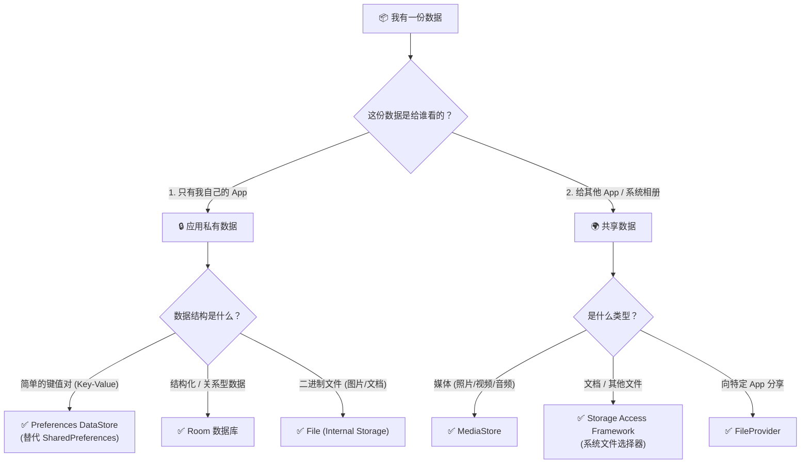

# 1.7.1 Android 存储用例与最佳实践

早饭后的营地是一片"有序的混乱"。

洛芙正对着地上一堆杂乱无章的装备发愁：湿漉漉的雨衣、没吃完的饼干、刚磨好的咖啡粉、还有几本旅游指南。她顺手抓起那袋咖啡粉，准备往装睡袋的大防水包里塞。

"停。"希尔像个守门员一样拦住了她，"你把咖啡粉和睡袋放一起？万一袋子破了，你就只能睡在一张巨大的'提神'床上了。"

"这就是为什么你需要**分类存储**。"黛琳站在一排大小不一的收纳箱面前，手里拿着标签机。阳光洒在她银灰色的发梢上，显得格外利落。"在 Android 里，数据就像这些装备。你不能把所有东西都往同一个地方塞——特别是不能把所有东西都塞进 `SharedPreferences` 或者 `External Storage`。"

伊莎正在把洗好的野果装进透明的保鲜盒里："每一类数据都有它最喜欢的'家'。给它们找对房子，它们才会乖乖听话。"

洛芙看着手里那袋无处安放的咖啡粉："但我怎么知道哪个是它的家？Android 的存储选项多得像露营车的抽屉——Room、DataStore、文件、MediaStore……"

"这正是我们现在要解决的。"黛琳按下标签机的打印键，吐出一张印着"你的决策树"的贴纸，贴在了白板上。

## 什么是存储决策？

"很多新手的问题在于——"希尔盘腿坐在草地上，随手捡起一颗松果扔进火堆，"只要能存进去就在行。比如用 SharedPrefs 存一整张 JSON 列表，或者在私有目录里存几百兆的视频。代码是能跑，但随着 App 变大，你会发现读取变慢、内存溢出，甚至被系统清理掉。"

"所以，我们需要一个**决策流程**。"黛琳拿起马克笔，"当你拿到一份数据时，问自己三个问题。"

她快速在白板上画出了核心的分叉路口：



> 圖 1：Android 存储决策树。这是选择存储方案的"地图"。

"看着这张图，"黛琳指着白板，"我们来把你地上的这一堆东西归类。"

### 场景一：私有且简单（Preferences DataStore）

"首先是这个。"洛芙举起一个小记事本，上面记着她的睡袋温标喜好："舒适温度 5℃，极限温度 -10℃。"

"这是**配置信息**。"伊莎说，"它很小，结构简单（Key-Value），而且只有你自己看。以前我们用这个——" 她指了指旁边一个破旧的侧袋，上面写着 `SharedPreferences`，"但它容易卡顿（ANR），而且不够安全。现在，我们用 **DataStore**。"

"DataStore 就像一个带拉链的防水侧袋，"希尔补充道，"它用协程（Coroutines）异步存取，不会阻塞主线程。如果你还在用 `commit()` 卡死 UI 线程，那是时候换包了。"

```kotlin
// 👎 反模式：在主线程使用 SharedPreferences
// sharedPrefs.edit().putBoolean("is_dark_mode", true).commit() // 可能会卡顿！

// 👍 最佳实践：使用 DataStore (异步 + 类型安全)
// context.dataStore.edit { settings ->
//     settings[IS_DARK_MODE] = true
// }
```

### 场景二：私有但复杂（Room）

"那这个呢？"洛芙指着那堆旅游指南，里面密密麻麻记着几百个营地的名字、评分、经纬度和评论。

"这是**结构化数据**。"黛琳立刻回答，"你需要查询（Query）。比如'找出评分大于 4.0 且距离我 50 公里以内的营地'。如果你把它存成文件或者 JSON，每次都要把整个文件读进内存再遍历，既慢又吃内存。"

"所以你需要 **Room**。"希尔把那样重的指南书装进了一个带有索引标签的硬壳箱子里，"数据库就是为查询而生的。不要试图用文件系统来模拟数据库的功能。"

"记住一条规则："黛琳严肃地说，"**如果你的数据需要被搜索、排序或过滤，请使用 Room。**"

### 场景三：私有大数据（File / Internal Storage）

洛芙拿起那包咖啡粉："这个其实……是一大包原始数据（Raw Data）。"

"或者是你下载的离线地图包、解压的游戏资源、或者临时的缓存图片。"伊莎接过咖啡粉，把它放进了一个密封罐，然后塞进背包的最底层，"这些是**二进制数据流**。它们不需要被查询，只需要被完整地读写。"

"这种就用 **File API**，存在 `context.filesDir` 或 `context.cacheDir` 里。"希尔提醒道，"别把这种大东西往数据库里塞（Blob），会让数据库肿得像个 200 斤的胖子。数据库存路径，磁盘存文件。"

### 场景四：共享媒体（MediaStore）

"最后是这张——"洛芙拿起刚才用拍立得拍的日出照片，照片还在慢慢显影，"我想发给妈妈看，或者发朋友圈。"

"这属于**共享媒体**。"黛琳把照片夹在营地显眼的展示绳上，"所有 App（微信、相册）都能看到它。在 Android 里，这叫 **MediaStore**。"

"以前我们可以随意在 SD 卡上乱写乱画，"希尔耸耸肩，"现在不行了。Android 10 以后有了**分区存储（Scoped Storage）**。你只能在自己的'私有领地'撒野。如果要往公共区域（相册、下载文件夹）放东西，必须通过系统 API（MediaStore 或 SAF）。"

"就像露营地的公共厨房，"伊莎打比方，"你不能把自己的脏锅乱扔，必须按规矩放在指定的地方。"

### 场景五：把选择权交给用户（SAF）

"如果你想编辑一个 Excel 表格，或者保存一个 PDF 供用户导出呢？"洛芙问。

"那就是 **SAF (Storage Access Framework)**。"黛琳说，"这就像你把东西交给'营地管理员'（系统文件选择器），由管理员去操作文件。用户最信任这个，因为他们清楚地知道你在动哪个文件。"

### 最佳实践与反模式

所有的东西都归位了。洛芙看着整整齐齐的营地，觉得心里舒坦多了。

"除了选对位置，还有几个使用规则。"黛琳在白板的角落里写下"生存法则"。

#### 1. 永远不要硬编码路径

"这是死罪。"希尔做了一个抹脖子的动作，"不要写 `/sdcard/downloads/` 这种代码。不同的手机、不同的 Android 版本，路径都不一样。一定要使用 `context.filesDir` 或 `Environment.getExternalStoragePublicDirectory()` 等 API。"

```kotlin
// ☠️ 死罪：硬编码路径
val file = File("/sdcard/myapp/data.txt") 

// ✅ 这里的建议：使用 Context 获取路径
val file = File(context.filesDir, "data.txt")
```

#### 2. 在后台线程做 I/O

"也是死罪。"希尔补充，"甚至比上面那个更严重。不管文件多小，只要涉及到磁盘读写（Disk I/O），都**必须**离开主线程。否则你的 App 会卡顿（Jank），甚至 ANR（无响应）。"

伊莎补充道："Room和 Datastore 默认就是在这个原则下设计的（Suspend 函数），但如果你用原生 File API，要记得用 `Dispatchers.IO`。"

#### 3. 及时清理缓存

"用完的垃圾要带走。"伊莎指了指挂在树上的垃圾袋，"存放在 `cacheDir` 里的临时文件，系统虽然在空间不足时会清理，但你不应该依赖系统。自己产生的垃圾（临时图片、下载残片），并在不再需要时自己删除。"

```kotlin
// ✅ 这里的建议：清理过期缓存
context.cacheDir.listFiles()?.forEach { file ->
    if (file.lastModified() < oneWeekAgo) {
        file.delete()
    }
}
```

#### 4. 权限最小化

"不要一上来就申请 `READ_EXTERNAL_STORAGE`。"黛琳说，"如果你只是想存一张照片到相册，或者读在这个应用里自己创建的文件，你根本**不需要任何存储权限**（在 Android 10+）。权限要得越少，用户越信任你。"

---

### 🏕️ 动手练习

#### Task 1 · 制定存储方案 (Design) ★

**目标**：为一个假想的"露营日记 App"设计存储架构。

**你需要做的事**：
1. 分析以下数据类型：
   - 用户偏好（夜间模式开关）
   - 日记正文（包含标题、日期、几千字的内容）
   - 日记里的照片（高清图）
   - 临时的缩略图缓存
2. **画出**或**列出**每种数据对应的存储 API（Room, DataStore, File, MediaStore）。
3. 解释为什么照片不直接存在 Room 数据库里。

**验收标准**：
- [ ] 偏好 -> DataStore / SharedPreferences
- [ ] 日记正文 -> Room
- [ ] 照片 -> File (应用私有) 或 MediaStore (如果是公开的)
- [ ] 缓存 -> cacheDir
- [ ] 解释了 Blob 对数据库性能的影响

**提示**：
> "数据库存目录，磁盘存内容。"

---

#### Task 2 · 获取正确的路径 (Context API) ★★

**目标**：练习使用 Context 获取各种标准目录。

**你需要做的事**：
1. 编写代码打印以下路径：
   - 内部存储私有目录 (`filesDir`)
   - 内部缓存目录 (`cacheDir`)
   - 外部存储私有目录 (`getExternalFilesDir`)
2. 在 Logcat 中观察它们的区别。

**验收标准**：
- [ ] 代码可运行且无硬编码字符串
- [ ] 理解 Internal vs External 的区别（后者可能被卸载）

```kotlin
// 参考
Log.d("Storage", "Internal: ${context.filesDir.absolutePath}")
Log.d("Storage", "External: ${context.getExternalFilesDir(null)?.absolutePath}")
```

---

#### Task 3 · 检查可用空间 (Disk Check) ★★

**目标**：在写入大文件前检查磁盘空间。

**你需要做的事**：
1. 使用 `StorageManager` 或 `File.usableSpace`。
2. 编写一个函数 `fun isSpaceEnough(bytes: Long): Boolean`。
3. 如果空间不足，抛出异常或返回 false。

**验收标准**：
- [ ] 成功获取可用字节数
- [ ] 逻辑正确处理空间不足的情况

---

### 面试热身

1.  **Q1**: 为什么现在不推荐使用 `SharedPreferences` 而推荐 `DataStore`？（提示：线程、类型安全、错误处理）
2.  **Q2**: 什么是 Android 的"分区存储"（Scoped Storage）？它的核心目的是什么？
3.  **Q3**: 如果我要写一个让用户下载 PDF 的功能，应该放在哪个目录下？需要什么权限？
4.  **Q4**: `commit()` 和 `apply()` 在 `SharedPreferences` 中有什么区别？

---

### 参考实现要点

1.  **分类原则**：小配置用 DataStore，结构化用 Room，文件流用 File，共享用 MediaStore。
2.  **不要阻塞 UI**：所有存储操作必须异步（Coroutines/Threads）。
3.  **权限最小化**：Android 10+ 访问自己创建的文件不需要权限。
4.  **不要硬编码**：始终使用 Context 方法获取路径。
5.  **流式处理**：读写大文件时使用 Stream，不要一次性把 100MB 读进内存。

---

> 💡 **学习建议**：存储不是"一次性"的工作。它是 App 的地基。现在的 Android（特别是 10+）对存储的规矩很多，这是为了保护用户隐私。别觉得麻烦，把这些规矩当成是整理收纳的艺术。

---

### 🍭 洛芙的小小日记本

今天把乱糟糟的代码"收纳"了一遍！原来 DataStore 是精致的小钱包，Room 是带索引的大书架，文件目录是储物箱。再也不用担心找不到东西，也不用担心把咖啡粉洒在睡袋上了！好的架构，就是给每样东西一个最合适的家。
