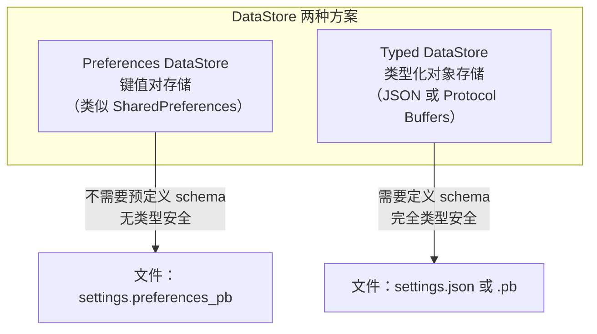
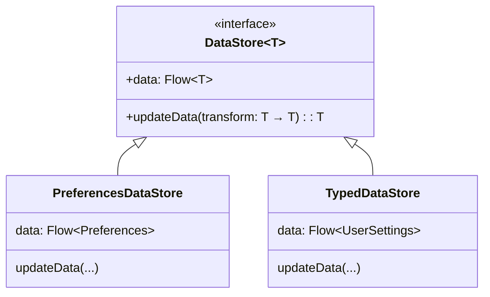
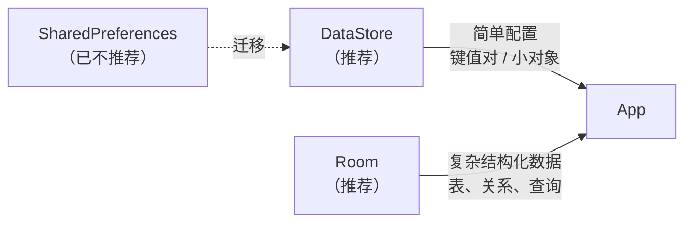
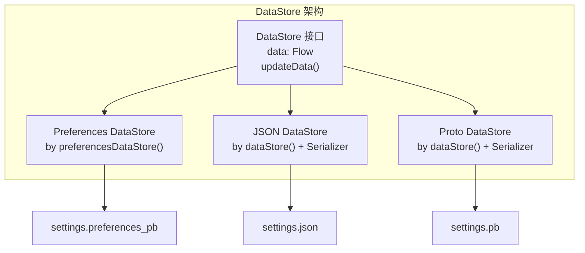

# 1.7.2 DataStore 概览

## 1.7.2 DataStore：给 SharedPreferences 的"退休信"

"装备分类"行动还在继续。

洛芙手里捏着那张写着"睡袋舒适温度：5℃"的便签纸，那是她刚才决定要放入"侧袋"（DataStore）的配置数据。

"所以……"她坐在折叠椅上，对着电脑屏幕发愣，"我要把这个侧袋缝到我的 App 里。但是，以前那个旧侧袋——`SharedPreferences`，真的不能用了吗？它就在手边，用起来多顺手啊。"

清晨的雾气已经散去，屏幕在阳光中泛着幽幽的蓝光。她指屏幕上那段她曾经引以为豪的代码：

```kotlin
// 洛芙的旧代码：不仅是顺手，甚至是肌肉记忆
val prefs = context.getSharedPreferences("settings", Context.MODE_PRIVATE)
prefs.edit().putBoolean("is_dark_mode", true).apply()
```

"那个旧侧袋已经漏了。"黛琳把清理出来的旧装备堆在一边，语气平静得像在陈述一个物理定律。"不仅漏，而且拉链还会卡住你的手指（UI 线程）。"

希尔递给洛芙一杯刚冲好的热可可，蒸气在深秋的冷空气里打着转："别舍不得了。我在上一家公司修过无数个因为 `SharedPrefs` 导致的 ANR（无响应）bug。那时候我就发誓，如果有替代品，我一定第一个把 `SharedPrefs` 扔进火堆。"

"这么严重？"洛芙接过杯子。

"比你想象的更严重。"黛琳竖起手指，开始清算旧账：

1. **没有线程安全保证**  
   `apply()` 看起来是异步的，但它会在 Activity/Service 进入 `onStop()` 时阻塞UI线程。数据稍微多一点，几百毫秒的卡顿会让用户以为 App 冻住了（ANR）。

2. **没有错误信号**  
   写入失败是静默的。就像寄了一封没有回执的信，你永远不知道对方是否收到。

3. **缺乏原子性**  
   多个 `putXxx()` 调用不是一体的。如果 App 在中间崩溃，数据可能只写了一半——省份写了，城市没写，留下一个残缺的记录。

4. **API 不一致**  
   读取是同步的，写入是异步的。这种混合模式是 Bug 的温床，特别是当数据还在后台排队时。

希尔苦笑，"我在上一个实习项目里踩了前三个，最后一个是看了别人踩的。"

"所以Google写了**Jetpack DataStore**——SharedPreferences的'继任者'。"黛琳吹了吹咖啡的热气，语气平淡得像在说一个理所当然的事实。"从头设计一个新方案，彻底解决这些问题。"

### DataStore 是什么？

"DataStore 是基于 **Kotlin Coroutines + Flow** 构建的数据存储方案。"黛琳说完，看了洛芙一眼，确认她还跟得上。"它用来存键值对，或者自定义的类型化对象。它有两种实现。"



> 图 1：DataStore 的两种实现。Preferences DataStore 存键值对，类似 SharedPreferences；Typed DataStore 存自定义类型的整个对象，支持 JSON 或 Protocol Buffers 序列化。

"这就回到了我们刚才的收纳比喻。"伊莎把两只不同风格的防水袋放在桌上：

1.  **Preferences DataStore**：就像一个**普通的收纳袋**。你往里面丢零散的小东西——一把钥匙（Key）、一枚硬币（Value）。没有固定的格子，只要 Key 对得上就能取出来。
2.  **Typed DataStore**：就像一个**定制的泡沫内衬箱**。每一个凹槽都是为了特定的物品（Object）设计的。你不能把相机塞进镜头的凹槽里。它严格、安全、仅仅有条。

黛琳在白板上画了一张对比表，边画边解释每一列的含义。

| 特性 | SharedPreferences | Preferences DataStore | Typed DataStore |
|------|------------------|----------------------|----------------|
| 线程安全 | ❌ 阻塞 UI | ✅ 协程 + Flow | ✅ 协程 + Flow |
| 事务性 | ❌ 非原子 | ✅ 原子读写 | ✅ 原子读写 |
| 错误处理 | ❌ 静默失败 | ✅ Flow 异常 | ✅ Flow 异常 |
| 类型安全 | ❌ 字符串 key | ❌ key 类型隐式 | ✅ 编译时检查 |
| 数据格式 | XML | Protobuf | JSON / Protobuf |
| 异步 API | 部分（apply） | 完全（Flow） | 完全（Flow） |
| 迁移支持 | — | ✅ 可从 SP 迁移 | ✅ |

洛芙看着这张表，嘴里的热可可突然不那么甜了。SharedPreferences那一列的❌太多了——她回想起自己在前几个项目中用 SharedPreferences 写的代码，突然觉得那些代码就像一栋没有烟雾报警器的房子——现在还没出事，只是因为运气好。

### Preferences DataStore

"先看最简单的——Preferences DataStore。"希尔清了清嗓子，从毛毯里彻底钻出来，开始认真地讲解。

#### 依赖配置

```kotlin
// 代码片段 A：添加 Preferences DataStore 依赖

// build.gradle.kts (Module: app)
dependencies {
    implementation("androidx.datastore:datastore-preferences:1.2.0")
}
```

#### 创建 DataStore

```kotlin
// 代码片段 B：创建 Preferences DataStore 实例

// 在 Kotlin 文件的顶层声明（不是在类内部！）
// 这确保了 DataStore 是单例——整个 App 只有一个实例
val Context.dataStore: DataStore<Preferences> by preferencesDataStore(
    name = "settings"   // 文件名，会自动加后缀
)
```

"为什么放在文件顶层？"洛芙问，杯子里的可可已经凉了一半但她完全没注意。

"因为DataStore的**第一条铁律**——**同一个文件永远不要创建多个DataStore实例**。"黛琳的声音严肃了起来，像是在背诵一条军规。"如果你在 Activity A 里创建了一个 DataStore 指向 settings 文件，又在 Activity B 里创建了另一个 DataStore 也指向同一个文件——DataStore会直接抛 `IllegalStateException`。两个人同时往同一个文件里写东西，会乱套的。用属性委托 + 顶层声明，就能保证全局唯一。"

"像单例模式——但Kotlin用属性委托帮你实现了。"洛芙恍然大悟。

#### 定义 Key

```kotlin
// 代码片段 C：定义 Preferences Key

// 每种基本类型都有对应的 Key 工厂方法
val DARK_MODE = booleanPreferencesKey("dark_mode")
val FONT_SIZE = intPreferencesKey("font_size")
val USER_NAME = stringPreferencesKey("user_name")
val VOLUME = floatPreferencesKey("volume")
val LAST_SYNC = longPreferencesKey("last_sync")
```

"Key是类型化的——`intPreferencesKey` 只能存 Int，`stringPreferencesKey` 只能存 String。这比 SharedPreferences 安全一些——SharedPreferences 允许你用同一个键名先存一个 String 再存一个 Int，然后运行时崩溃给你看。DataStore 的 Key 类型会在编译期就限制住你。"

#### 读取数据

```kotlin
// 代码片段 D：从 Preferences DataStore 读取数据

// 返回一个 Flow<Boolean>——数据变化时自动推送新值
fun isDarkModeFlow(context: Context): Flow<Boolean> =
    context.dataStore.data.map { preferences ->
        preferences[DARK_MODE] ?: false   // 如果 key 不存在，返回默认值
    }

// 在 ViewModel 中收集
class SettingsViewModel(private val context: Context) : ViewModel() {
    val isDarkMode: StateFlow<Boolean> =
        isDarkModeFlow(context)
            .stateIn(
                scope = viewModelScope,
                started = SharingStarted.WhileSubscribed(5_000),
                initialValue = false
            )
}
```

"看到没——`dataStore.data` 返回的是 `Flow<Preferences>`。"黛琳用笔在白板上画了一条波浪线，那条线在灯光里看起来像一条流动的小溪。"它是一个**数据流**。数据变了，Flow 会自动把新值推给所有订阅者。"

"和 Room 的 Flow 查询一样。"洛芙接上话，眼睛亮了起来。"数据层产生 Flow，ViewModel 转成 StateFlow，Compose 用 `collectAsStateWithLifecycle` 收集——整条管道。"

"完全一样。"黛琳露出了今天第一个微笑——很淡，像清晨薄雾中若隐若现的阳光。"一旦你理解了 Flow 这个模式，Room、DataStore、网络请求——所有数据源都是同一种写法。学一次，用三遍。"

#### 写入数据

```kotlin
// 代码片段 E：向 Preferences DataStore 写入数据

// updateData 是一个 suspend 函数，必须在协程中调用
// 它是事务性的——要么全部成功，要么全部回滚
suspend fun setDarkMode(context: Context, enabled: Boolean) {
    context.dataStore.updateData { preferences ->
        preferences.toMutablePreferences().also {
            it[DARK_MODE] = enabled
        }
    }
}

// 在 ViewModel 中调用
class SettingsViewModel(private val context: Context) : ViewModel() {
    fun toggleDarkMode(enabled: Boolean) {
        viewModelScope.launch {
            setDarkMode(context, enabled)
        }
    }
}
```

"`updateData` 的参数是一个 transform 函数——它接收当前的 Preferences，返回修改后的新 Preferences。"黛琳解释，"整个操作是**原子**的——如果在写入过程中 App 崩溃了，数据要么是旧值，要么是新值，绝对不会出现'写了一半'的中间状态。"

"SharedPreferences 做不到这一点。"希尔在旁边轻声说，语气里带着一种过来人的沉重。"我曾经遇到过一个线上bug——用户的设置项只存了一半，App 重启后状态混乱，花了我整整两天才定位到问题。如果当时用的是 DataStore 的原子写入，这个bug根本不会发生。"

### Typed DataStore（JSON 序列化）

"如果你要存一个**结构化的对象**而不是零散的键值对——就需要 Typed DataStore。"黛琳继续往前走，白板上开了一个新的区域。

"零散的键值对就像散落在抽屉里的便签纸——你知道每张纸上写了什么，但它们之间没有天然的联系。Typed DataStore 让你把所有便签纸整理成一封完整的信——有结构、有格式、有模板。"

"最常用的方式是 JSON 序列化——配合 `kotlinx.serialization` 库。"

#### 依赖和数据定义

```kotlin
// 代码片段 F：Typed DataStore（JSON）依赖和数据定义

// build.gradle.kts
plugins {
    id("org.jetbrains.kotlin.plugin.serialization") version "2.2.20"
}
dependencies {
    implementation("androidx.datastore:datastore:1.2.0")
    implementation("org.jetbrains.kotlinx:kotlinx-serialization-json:1.9.0")
}

// 定义要持久化的数据类
@Serializable
data class UserSettings(
    val isDarkMode: Boolean = false,
    val fontSize: Int = 14,
    val userName: String = "",
    val notificationsEnabled: Boolean = true
)
```

#### 创建 Serializer

```kotlin
// 代码片段 G：为 UserSettings 编写 Serializer

object UserSettingsSerializer : Serializer<UserSettings> {
    override val defaultValue: UserSettings = UserSettings()

    override suspend fun readFrom(input: InputStream): UserSettings {
        return try {
            Json.decodeFromString<UserSettings>(
                input.readBytes().decodeToString()
            )
        } catch (e: SerializationException) {
            throw CorruptionException("Cannot read UserSettings", e)
        }
    }

    override suspend fun writeTo(t: UserSettings, output: OutputStream) {
        output.write(
            Json.encodeToString(t).encodeToByteArray()
        )
    }
}
```

"Serializer 告诉 DataStore 怎么把你的对象变成字节流、从字节流变回对象。"黛琳指着代码说，"就像翻译官——DataStore只知道怎么读写字节，Serializer负责在字节和你的Kotlin对象之间做翻译。"

#### 创建、读取、写入

```kotlin
// 代码片段 H：Typed DataStore 的创建、读取和写入

// 创建——顶层声明
val Context.settingsDataStore: DataStore<UserSettings> by dataStore(
    fileName = "user_settings.json",
    serializer = UserSettingsSerializer
)

// 读取——返回 Flow
fun userNameFlow(context: Context): Flow<String> =
    context.settingsDataStore.data.map { settings ->
        settings.userName
    }

// 写入——使用 copy 更新
suspend fun updateUserName(context: Context, name: String) {
    context.settingsDataStore.updateData { settings ->
        settings.copy(userName = name)
    }
}
```

"看到区别了吗——"黛琳放下笔，转身面对洛芙。

| Preferences DataStore | Typed DataStore (JSON) |
|----------------------|----------------------|
| `preferences[KEY]` | `settings.属性名` |
| Key 类型松散 | data class 编译时类型安全 |
| 修改用 `toMutablePreferences()` | 修改用 `copy()` |
| 不需要 Serializer | 需要 Serializer |
| 适合简单配置 | 适合复杂配置 |

"用 `copy()` 更新——"洛芙点头，"因为 data class 是不可变的，copy 会创建一个新的对象。这保证了数据一致性，对不对？"

"完全正确。"黛琳的眼神里多了一分欣慰。像老师看到学生终于融会贯通时的那种表情——平静，但发自内心地高兴。

### DataStore 的核心 API



> 图 2：DataStore 接口非常精简——只有两个成员：`data`（Flow 读取）和 `updateData`（事务性写入）。Preferences DataStore 和 Typed DataStore 都实现这个接口。

"整个 DataStore 的 API 就这么简单——**只有两个方法**。"黛琳在白板上画了一个大大的"2"，用了两种颜色的笔描了一遍，确保洛芙不会忽略这个数字。

1. **`data: Flow<T>`** —— 读取数据的 Flow。数据变化时自动推送新值。
2. **`updateData(transform)`** —— 写入数据。接收一个 transform 函数，原子性地更新。

洛芙看着白板上那个大大的"2"，心里涌起一种说不清的感动。两个方法——就两个。这么简单的接口，背后却解决了 SharedPreferences 解决不了的四个大问题。少即是多，简约即是力量。她忽然想起了苹果公司的一句设计哲学——"Simplicity is the ultimate sophistication."

### DataStore 三条铁律

"用 DataStore 有三条必须遵守的规则——"黛琳的声音变得格外严肃，像法庭上宣读判决书的法官。

```
🚨 DataStore 三条铁律

1. 同一个文件永远不要创建多个 DataStore 实例
   → 否则 IllegalStateException

2. DataStore<T> 的泛型类型 T 必须是不可变的（immutable）
   → 否则数据一致性被破坏

3. 不要混用 SingleProcessDataStore 和 MultiProcessDataStore
   → 如果需要多进程访问，全部用 MultiProcessDataStore
```

"第一条——铁律中的铁律。"黛琳加重了语气。"同一个文件只能有一个 DataStore 实例。两个以上就出事。"

"第二条——你存的数据类型必须是不可变的。用 `val` 属性的 data class，不要用 `var`。因为 DataStore 内部会缓存你的对象——如果你在外面偷偷改了对象的属性，DataStore 缓存的值和文件里的值就不一致了。"

"第三条——如果你的 App 有多个进程（比如主进程和推送进程），要用 `MultiProcessDataStore`，不能和普通的 `SingleProcessDataStore` 混用。"

### 在 Compose 中使用

```kotlin
// 代码片段 I：在 Jetpack Compose 中使用 DataStore

@Composable
fun SettingsScreen(viewModel: SettingsViewModel = viewModel()) {
    val isDarkMode by viewModel.isDarkMode.collectAsStateWithLifecycle()

    Switch(
        checked = isDarkMode,
        onCheckedChange = { enabled ->
            viewModel.toggleDarkMode(enabled)
        }
    )
}
```

"和 Room + Flow + Compose 的模式完全一致——DataStore 产生 Flow，ViewModel 转成 StateFlow，Compose 用 `collectAsStateWithLifecycle` 收集。"希尔微笑着说，像是在介绍一位老朋友。"你已经在 Room 那边学过这条管道了——DataStore 只是换了一个数据源而已。同样的管道，不同的水。"

### 同步读取（紧急情况）

"如果你实在需要同步读取——比如在 Application.onCreate() 中初始化主题——可以用 `runBlocking`。"黛琳的语气半是允许半是警告，像一个医生在开一种有副作用的药。

```kotlin
// 代码片段 J：同步读取（应急方案）

// ⚠️ 不推荐——可能阻塞主线程
val settings = runBlocking {
    context.settingsDataStore.data.first()
}

// 更好的做法：在 onCreate 中预加载，后续同步读取就快了
override fun onCreate() {
    super.onCreate()
    lifecycleScope.launch {
        context.settingsDataStore.data.first()  // 预加载到内存缓存
    }
}
```

"`runBlocking` 会阻塞调用线程直到数据读取完毕。如果用在主线程，数据少还好，数据多就卡住了。"黛琳说，"能不用就不用。如果实在要用，提前在后台线程做一次预加载——第一次读取从磁盘来，之后的读取从内存缓存来，速度快得多。"

### 文件损坏处理

"最后一个特性——DataStore 还提供了**损坏处理**机制。"黛琳放下了咖啡杯，声音变得柔和了一些，像是在说一个体贴的设计。

"如果数据文件因为系统崩溃、存储空间不足、或者某个离谱的 bug 导致损坏了——DataStore 不会直接崩溃。它会调用你配置的损坏处理器，用默认值替换损坏的文件。像一个消防员——火灾发生时，它不是站在一旁干瞪眼，而是用默认值做一个紧急替补，让 App 至少能继续运行。"

```kotlin
// 代码片段 K：配置文件损坏处理器

val Context.settingsDataStore: DataStore<UserSettings> by dataStore(
    fileName = "user_settings.json",
    serializer = UserSettingsSerializer,
    corruptionHandler = ReplaceFileCorruptionHandler {
        UserSettings()  // 损坏时用默认值替代
    }
)
```

---

清晨的露水蒸发了，空气中弥漫着松针和被阳光晒暖的泥土的气息。木桌上的热可可早已凉透了，洛芙一口都没再喝——她完全沉浸在了这些新知识里，忘记了嘴边的杯子。

"SharedPreferences 我用了很久了，"她轻声说，声音里有一种发现自己一直在走弯路的惊讶和后悔。"第一次知道它有这么多问题。"

"技术债就是这样——"黛琳抿了一口咖啡，然后发现杯子也空了，便叹了口气把杯子放下。"你用的时候觉得很方便，两行代码搞定读写，多省事。等项目变大了、用户变多了，才发现坑——线程阻塞、数据不一致、静默失败。DataStore 从设计的第一天起就避免了这些坑：全异步、事务性、错误可追踪。"

希尔在旁边点头："而且 DataStore 可以和 Room 配合——简单的配置项用 DataStore，复杂的结构化数据用 Room。各司其职，互不干扰。就像厨房里的调料罐和冰箱——小东西放调料罐，大东西放冰箱。你不会把一整只鸡塞进调料罐吧？"

洛芙被这个比喻逗笑了。



> 图 3：存储方案选择。简单配置用 DataStore，复杂结构化数据用 Room。SharedPreferences 应迁移到 DataStore。

远处传来一声清脆的鸟叫，像一个小小的透明铃铛在树枝上摇晃。洛芙拿起笔记本，在 DataStore 那一页的最后，用她最认真的笔迹写道——

"两个方法就够了。一切从简的 API，是最高级的设计。"

她停了一会儿，又在下面加了一行：

"SharedPreferences，谢谢你过去的陪伴。但现在，是时候退休了。"

---

### 技术总结

> **Jetpack DataStore** —— SharedPreferences 的现代替代方案。基于 Kotlin Coroutines 和 Flow，提供完全异步、事务性的键值对或类型化对象存储。Preferences DataStore 存键值对，Typed DataStore（JSON/Proto）存自定义类型。核心 API 只有 `data`（读）和 `updateData`（写）。

#### 今日关键词

1. **Preferences DataStore**：键值对存储，类似 SharedPreferences 但基于 Flow。使用 `preferencesDataStore` 属性委托创建，用 `xxxPreferencesKey()` 定义类型化的 Key。
2. **Typed DataStore**：类型化对象存储。存储 `@Serializable` 数据类的完整对象。需要自定义 `Serializer<T>`。支持 JSON（`kotlinx.serialization`）和 Protocol Buffers。
3. **DataStore.data**：`Flow<T>` 属性，提供响应式数据读取。数据变化时，下游自动收到更新。
4. **updateData()**：事务性写入方法。接收 `(T) -> T` 的 transform 函数，在原子的 read-write-modify 操作中更新数据。
5. **ReplaceFileCorruptionHandler**：文件损坏时的恢复策略。用默认值替换损坏的文件，而不是崩溃。

#### 结构图



> DataStore 的三种实现共享同一个精简接口。文件格式不同，但读写 API 完全一致。

#### 反模式与陷阱

1. **创建多个 DataStore 实例指向同一文件**：两个实例冲突 → `IllegalStateException`。
   * **修复**：使用顶层属性委托确保单例。

2. **在 UI 线程用 `runBlocking` 读取 DataStore**：阻塞主线程 → ANR。
   * **修复**：用 Flow 异步读取；如必需同步读取，先在 `onCreate` 中异步预加载。

3. **DataStore 的泛型类型是可变对象**：修改已持久化的对象引用 → 数据一致性被破坏。
   * **修复**：使用不可变的 data class（`val` 属性 + `copy()`）。

4. **仍然用 SharedPreferences 存新功能的配置**：遗留债务持续增加。
   * **修复**：新功能一律使用 DataStore。旧代码逐步迁移。

5. **不配置 corruptionHandler**：文件损坏直接崩溃。
   * **修复**：配置 `ReplaceFileCorruptionHandler`，用默认值兜底。

#### 设计哲学：简约的力量

1. **只有两个方法**：`data`（读）和 `updateData`（写）。最精简的 API 设计。方法少，出错概率低。
2. **异步优先**：基于 Flow 的 API 天然线程安全。不需要开发者自己管线程。
3. **事务性保证**：`updateData` 的 transform 函数是原子操作。写入要么全部成功，要么全部回滚。
4. **类型安全分级**：Preferences DataStore 提供轻量的 Key 类型约束；Typed DataStore 提供完整的编译时类型检查。按需选择。
5. **渐进迁移**：支持从 SharedPreferences 迁移，不需要一次性重写。

---

#### 🏕️ 动手练习

#### Task 1 · Preferences DataStore 读写 (Basic CRUD) ★

**目标**：创建 Preferences DataStore 并实现基本的读写操作。

**你需要做的事**：
1. 添加依赖，创建 DataStore 实例。
2. 定义 `booleanPreferencesKey("dark_mode")`。
3. 用 `updateData` 写入 true。
4. 用 `data.map` 读取，验证值是 true。

**验收标准**：
- [ ] DataStore 实例是单例
- [ ] 写入成功
- [ ] 读取返回正确值

---

#### Task 2 · Typed DataStore + JSON (类型化存储) ★★★

**目标**：创建 JSON 序列化的 Typed DataStore。

**你需要做的事**：
1. 定义 `@Serializable data class UserSettings`。
2. 实现 `Serializer<UserSettings>`。
3. 创建 DataStore 实例。
4. 用 `updateData { it.copy(fontSize = 18) }` 修改。

**验收标准**：
- [ ] Serializer 正确序列化/反序列化
- [ ] data class 使用 copy() 更新
- [ ] 数据持久化到 JSON 文件

---

#### Task 3 · DataStore + Compose (UI 集成) ★★

**目标**：在 Compose UI 中展示和修改 DataStore 数据。

**你需要做的事**：
1. ViewModel 中把 DataStore Flow 转成 StateFlow。
2. Compose 中用 `collectAsStateWithLifecycle`。
3. Switch 控件控制暗色模式。

**验收标准**：
- [ ] UI 实时反映 DataStore 数据变化
- [ ] 切换开关后数据持久化
- [ ] 重启 App 后状态保持

---

#### Task 4 · SharedPreferences 对比 (Migration) ★★★

**目标**：对比 SharedPreferences 和 DataStore 的行为差异。

**你需要做的事**：
1. 用 SharedPreferences 写一个计数器。
2. 用 DataStore 写一个计数器。
3. 对比线程安全性、错误处理、API 风格。

**验收标准**：
- [ ] SharedPreferences 的 apply() 是异步但不可靠
- [ ] DataStore 的 updateData 是事务性的
- [ ] 列出至少 3 个 DataStore 的优势

---

#### Task 5 · 错误处理与损坏恢复 (Error Handling) ★★★

**目标**：测试 DataStore 的文件损坏恢复机制。

**你需要做的事**：
1. 配置 `ReplaceFileCorruptionHandler`。
2. 人为损坏数据文件。
3. 验证 DataStore 自动用默认值替换。

**验收标准**：
- [ ] 损坏后不崩溃
- [ ] 自动回退到默认值
- [ ] 恢复后可正常读写

---

#### Task 6 · 同步读取 (Synchronous Access) ★★★

**目标**：在需要同步读取的场景中安全使用 DataStore。

**你需要做的事**：
1. 用 `runBlocking { data.first() }` 同步读取。
2. 实现预加载策略（onCreate 中异步预加载）。
3. 对比预加载前后同步读取的耗时。

**验收标准**：
- [ ] 同步读取能正常工作
- [ ] 预加载后读取更快

---

#### Task 7 · 多 Key 管理 (Multiple Keys) ★★

**目标**：管理多个 Preferences Key。

**你需要做的事**：
1. 定义 5 个不同类型的 Key。
2. 在一个 `updateData` 调用中同时修改多个 Key。
3. 读取并验证所有值。

**验收标准**：
- [ ] 不同类型的 Key 正确存取
- [ ] 原子性修改多个 Key
- [ ] 默认值处理正确

---

#### Task 8 · DataStore + Room 协作 (Combined Storage) ★★★★

**目标**：在同一个 App 中同时使用 DataStore 和 Room。

**你需要做的事**：
1. DataStore 存用户偏好设置（暗色模式、字体大小）。
2. Room 存营地列表（结构化数据）。
3. UI 同时展示两者的数据。

**验收标准**：
- [ ] DataStore 存简单配置
- [ ] Room 存复杂结构化数据
- [ ] 两者互不干扰，各司其职

---

#### 面试热身

1. **Q1**：DataStore 和 SharedPreferences 有什么区别？为什么推荐用 DataStore？
2. **Q2**：Preferences DataStore 和 Typed DataStore 分别适合什么场景？
3. **Q3**：DataStore 的 `updateData` 方法为什么是事务性的？它的原子性是怎么保证的？
4. **Q4**：为什么同一个文件不能创建多个 DataStore 实例？
5. **Q5**：在什么情况下你会用 Room 而不是 DataStore？

#### 参考实现要点

1. **单例创建**：DataStore 实例用顶层属性委托创建，全局唯一。
2. **不可变数据**：Typed DataStore 的泛型类型必须是 immutable 的 data class。用 `copy()` 更新。
3. **Flow 驱动**：读取走 Flow，写入走 `updateData`。全异步，线程安全。
4. **兜底机制**：配置 `ReplaceFileCorruptionHandler`，防止文件损坏导致崩溃。
5. **选择存储方案**：简单键值对 → Preferences DataStore。类型化对象 → Typed DataStore (JSON/Proto)。复杂结构化数据 → Room。

---

> 💡 DataStore = SharedPreferences 的"Pro Max 版"。全异步、事务性、类型安全、错误可追踪。两个方法就够了——`data` 读，`updateData` 写。简约到极致的 API，是对复杂问题最优雅的回答。

---

### 🍭 洛芙的小小日记本

两个方法。一个读，一个写。整个 DataStore 的 API 就这么简单。但背后做到了 SharedPreferences 做不到的一切——线程安全、事务性、自动通知。最好的 API 不是功能多的，而是让你犯不了错的。今天给 SharedPreferences 写了一封退休信。感谢你的服务——但以后，请安心退休吧。
