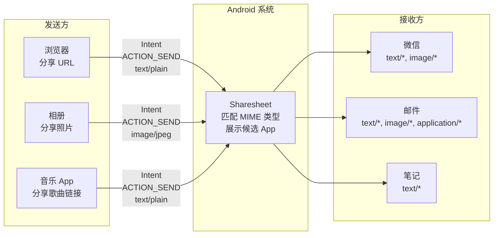
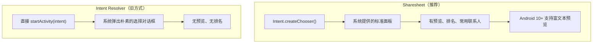
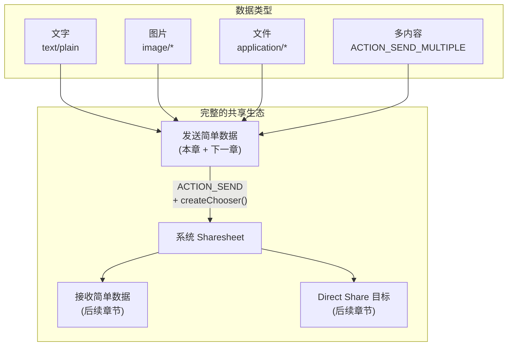
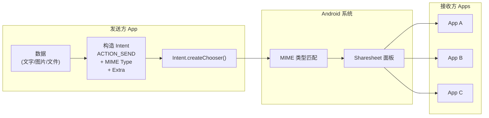

  problem_solved: 'Understanding the Sender-Receiver model'
  difficulty: 'Conceptualizing Intents as universal messages'
  next_topic: '1.8.2 Sending Simple Data'
---

# 1.8.1 关于共享简单数据

## 1.8.1 共享：让 App 不再是一座孤岛

午后的风有些倦怠，把草地吹出一层层金色的浅纹。阳光穿透湖边高高的芦苇丛，在洛芙的手机屏幕上投下细碎摇晃的光影。

她点开一篇营地攻略，顺手按下分享，Sharesheet 从底部弹起，像一张折叠好的精美菜单，上面列满了可以接收这份“礼物”的 App 名字。

“我明白怎么用它，”她把手机递给黛琳，手指无意识地绕着袖口，“但我很好奇——浏览器怎么知道手机里哪些 App 能接收这条链接？它们明明互不认识。”

黛琳接过手机：“它不知道。发送方只声明三件事：`Action`、`MIME Type`、`Extra`。系统根据 `intent-filter` 做匹配，再把候选交给用户。”

希尔补充：“这就是共享机制最重要的设计：发送方和接收方解耦。你不需要硬编码目标 App。”

伊莎坐在树荫里笑了一下：“接口清晰，关系就会清晰。今天先搭全景图，下一章再写发送代码。”

### 共享的两个角色

"共享这件事，永远有两个角色。"希尔走过来，手里拿着一根烤棉花糖的竹签，看起来像一根魔法棒。她在空中画了两个圆圈。

"第一个角色——**发送方（Sender）**。它拥有数据，想把数据交给别的 App。比如浏览器想分享一个 URL，相册想分享一张照片，音乐播放器想分享一首歌的链接。"

"第二个角色——**接收方（Receiver）。它告诉系统'我能处理某种类型的数据'。比如微信说'我能接收文字和图片'，邮件 App 说'我能接收文字、图片和附件'，笔记 App 说'我能接收文字'。"

> 图 1：Android 共享机制的核心流程。发送方通过 Intent 描述数据类型，系统通过 MIME 类型匹配合适的接收方，Sharesheet 展示给用户选择。

"发送方和接收方之间，完全不需要互相认识。"黛琳补充道，她的声音里有一种对这个设计的淡淡的欣赏。"浏览器不需要知道手机上装了哪些 App，微信也不需要知道是谁给它发的数据。它们之间的桥梁是 **Intent** 和 **MIME 类型**。"

### Intent：共享的信使

"Intent 你已经不陌生了——我们在前面用过它来启动 Activity。"黛琳继续。"但在共享场景下，Intent 扮演的角色更像一封**推荐信**。"

洛芙歪了歪脑袋："推荐信？"

"对。"黛琳在白板上画了一个信封的图案。"发送方不是直接把数据丢给接收方。它把数据包进一个 Intent 里，然后告诉系统：'这是一个 `ACTION_SEND` 类型的 Intent，数据类型是 `text/plain`，内容在 `EXTRA_TEXT` 里。请帮我找一个能处理的 App。'"

"系统收到这封推荐信之后，打开 Sharesheet，列出所有声称能处理 `text/plain` 的 App——然后让用户自己选。"

| Intent 组成 | 作用 | 示例 |
|------------|------|------|
| **Action** | 告诉系统"我想做什么" | `ACTION_SEND`（分享单个内容）, `ACTION_SEND_MULTIPLE`（分享多个内容）|
| **MIME Type** | 告诉系统"数据是什么类型" | `text/plain`, `image/jpeg`, `video/mp4`, `application/pdf` |
| **Extra** | 携带实际的数据 | `EXTRA_TEXT`（文字）, `EXTRA_STREAM`（文件 URI）, `EXTRA_SUBJECT`（标题）|

"这三个部分组合在一起，就是一封完整的推荐信。"

### MIME 类型：数据的身份证

"MIME 类型——Multipurpose Internet Mail Extensions——是一种标准的数据格式描述。"希尔把棉花糖吃完了，开始认真讲解。

"你可以把它想象成数据的**身份证**。每一种数据都有自己的 MIME 类型，告诉接收方'我是什么格式'。就像你去面试，门口保安会看你的身份证，确认你是被邀请的人之一。App 在 AndroidManifest 里声明能处理哪些 MIME 类型，系统就根据这些声明来匹配。"

| MIME 类型 | 含义 | 常见用途 |
|-----------|------|---------|
| `text/plain` | 纯文本 | URL、消息、备忘 |
| `text/html` | HTML 文本 | 网页内容、富文本 |
| `image/jpeg` | JPEG 图片 | 照片分享 |
| `image/png` | PNG 图片 | 截图、图标 |
| `image/*` | 任意图片 | 通配——接收所有图片格式 |
| `video/mp4` | MP4 视频 | 视频分享 |
| `application/pdf` | PDF 文档 | 文件分享 |
| `*/*` | 任意类型 | 通配——接收所有格式 |

"越具体的 MIME 类型越好。"黛琳提醒。"如果你要分享一张 JPEG 照片，就用 `image/jpeg`，不要用 `image/*`。越具体，系统匹配出来的候选 App 就越精准——用户看到的选项更有意义。"

### Sharesheet vs Intent Resolver

"等一下——"洛芙举起手，像课堂上提问的学生。"我记得有些 App 弹出来的分享界面长得不太一样。有的是那个漂亮的底部面板，有的是一个比较朴素的列表。它们有什么区别？"

"好问题。"黛琳点头。"Android 有两种分享界面——"

> 图 2：两种分享界面。Sharesheet 是官方推荐的方式，提供更好的用户体验。Intent Resolver 是旧方式，功能较少。

"**Sharesheet** 是用 `Intent.createChooser()` 创建的——它是系统精心设计的面板，有内容预览、常用联系人排名、Direct Share 目标。官方**强烈推荐**使用它。"

"**Intent Resolver** 是直接 `startActivity(intent)` 弹出来的那个简陋的对话框。它没有预览，没有排名，而且在某些设备上，如果用户之前选过'始终使用某个 App 打开'，它就不会再弹出来——用户失去了选择权。"

"简单来说——**永远用 `createChooser()`**。"黛琳总结。

### Android 共享的全景图

伊莎站了起来，走到白板前面，开始画一张更大的图。她画得很慢，每一根线条都干净而精确，像在用画笔写字。

> 图 3：共享相关章节的全景图。本章介绍概念，下一章讲"如何发送"，之后的章节讲"如何接收"和"Direct Share"。

"四个章节——一个完整的故事。"伊莎放下笔，轻声说。"发送、接收、Direct Share、还有文件共享。从今天开始，你会一步一步走过这个故事。"

---

白板上的流程图画满了箭头，洛芙把杯子里最后一口可可喝掉。她盯着图看了很久，终于把散乱概念串成一条线。

“共享机制不仅仅是某个 App 的功能，它更是一套通用的系统协议。”她低声总结，“只要 `Action`、`MIME Type`、`Extra` 对齐，哪怕是素未谋面的陌生应用，也能完美协作。”

黛琳合上白板笔，点了点头：“这就是平台能力的价值。规则统一，生态才能互通。”

风穿过树梢，带来一阵很轻的沙沙声。洛芙把明天的标题写在页脚：`ACTION_SEND`。

---

### 技术总结

> **共享简单数据** —— Android 提供的跨应用数据传递机制。通过 `Intent`（包含 `ACTION_SEND` / `ACTION_SEND_MULTIPLE`、MIME 类型和数据 Extra）描述数据，系统通过 **Sharesheet**（`Intent.createChooser()`）展示能处理该数据类型的所有 App。发送方和接收方互不依赖，通过 MIME 类型松耦合匹配。

#### 今日关键词

1. **Android Sharesheet**：系统提供的标准分享界面。通过 `Intent.createChooser()` 调用。支持内容预览、常用联系人排名、Direct Share 目标。官方推荐的唯一分享界面。
2. **Intent（共享场景）**：数据的"推荐信"。包含 Action（做什么）、MIME Type（什么格式）、Extra（实际数据）三部分。`ACTION_SEND` 分享单个内容，`ACTION_SEND_MULTIPLE` 分享多个内容。
3. **MIME 类型**：数据的身份证。格式为 `大类/子类`（如 `text/plain`、`image/jpeg`）。发送方用它描述数据格式，系统用它匹配接收方。越具体越好。
4. **发送方（Sender）**：拥有数据并发起分享的 App。构造 Intent，调用 `createChooser()`，启动 Sharesheet。
5. **接收方（Receiver）**：在 AndroidManifest 中声明能处理特定 MIME 类型的 App。系统自动将其列入 Sharesheet。

#### 结构图

> 共享的完整流程：数据 → Intent → Chooser → 系统匹配 → Sharesheet → 用户选择 → 接收方。

#### 反模式与陷阱

1. **不使用 createChooser()**：直接 startActivity(intent) → Intent Resolver 功能少，且可能被用户设置的默认 App 拦截。
   * **修复**：始终用 `Intent.createChooser()` 创建 Sharesheet。

2. **MIME 类型过于宽泛**：用 `*/*` 匹配所有 App → 候选列表混乱，用户体验差。
   * **修复**：使用最具体的 MIME 类型（`image/jpeg` 而非 `image/*`）。

3. **自己实现分享目标列表**：在 App 内部硬编码"分享到微信/QQ/邮件" → 维护成本高，无法覆盖用户安装的所有 App。
   * **修复**：用系统 Sharesheet，它自动列出所有合适的 App。

4. **忽视 ActionProvider**：官方已**不推荐**使用 ActionProvider 在 App 内展示分享操作。
   * **修复**：使用 Sharesheet。

5. **发送方和接收方直接耦合**：让 App A 直接调用 App B 的特定 Activity 来分享 → 紧耦合，App B 不在就崩溃。
   * **修复**：通过 Intent + MIME Type 松耦合匹配。

#### 设计哲学：松耦合的优雅

1. **发送方不需要知道接收方**：通过 MIME 类型隐式匹配，App 之间零依赖。
2. **系统是中间人**：Sharesheet 充当"邮局分拣中心"，负责匹配和展示。
3. **用户拥有选择权**：系统展示所有候选 App，由用户决定给谁。
4. **标准协议胜过私有接口**：Intent + MIME Type 是全Android通用的语言，任何 App 都能参与。
5. **渐进式学习**：先理解概念（本章），再写代码发送（下一章），再学习接收（之后的章节）。

---

#### 🏕️ 动手练习

#### Task 1 · 观察 Sharesheet (Explore) ★

**目标**：观察不同 App 的 Sharesheet 行为。

**你需要做的事**：
1. 打开浏览器，点击分享按钮，观察 Sharesheet。
2. 打开相册，分享一张照片，观察 Sharesheet。
3. 比较两次 Sharesheet 中候选 App 的不同。

**验收标准**：
- [ ] 能解释为什么两次候选 App 列表不同
- [ ] 理解 MIME 类型决定了候选列表

---

#### Task 2 · MIME 类型分类 (Classification) ★

**目标**：理解常见的 MIME 类型。

**你需要做的事**：
1. 列出 5 种 text/* MIME 类型。
2. 列出 3 种 image/* MIME 类型。
3. 解释通配符 `*/*` 的含义和风险。

**验收标准**：
- [ ] 能正确分类 MIME 类型
- [ ] 理解具体 vs 通配的差异

---

#### Task 3 · Intent 构成分析 (Intent Anatomy) ★★

**目标**：分析共享 Intent 的三个核心组成部分。

**你需要做的事**：
1. 画出一个分享文字链接的 Intent 结构图。
2. 画出一个分享图片的 Intent 结构图。
3. 对比它们的 Action、MIME Type 和 Extra 的差异。

**验收标准**：
- [ ] Intent 三部分清晰
- [ ] 文字用 EXTRA_TEXT，图片用 EXTRA_STREAM
- [ ] MIME Type 正确

---

#### Task 4 · Sharesheet vs Intent Resolver (Comparison) ★★★

**目标**：对比 Sharesheet 和 Intent Resolver 的差异。

**你需要做的事**：
1. 用 `createChooser()` 启动 Sharesheet，观察行为。
2. 用直接 `startActivity()` 启动 Intent Resolver，观察行为。
3. 记录两者在预览、排名、默认选择方面的差异。

**验收标准**：
- [ ] Sharesheet 有预览和排名
- [ ] Intent Resolver 功能较少
- [ ] 理解为什么推荐 Sharesheet

---

#### Task 5 · 发送方 vs 接收方 (Roles) ★★

**目标**：理解共享的两个角色。

**你需要做的事**：
1. 列出 3 个常见的发送方 App 和它们分享的数据类型。
2. 列出 3 个常见的接收方 App 和它们接受的数据类型。
3. 画出一个发送方→系统→接收方的流程图。

**验收标准**：
- [ ] 发送方和接收方角色清晰
- [ ] 理解系统在中间的匹配作用

---

#### Task 6 · 设计一个分享功能 (Design) ★★★

**目标**：为一个露营日记 App 设计分享功能。

**你需要做的事**：
1. 确定要分享的数据（日记文字 + 照片）。
2. 选择合适的 MIME 类型。
3. 选择 ACTION_SEND 还是 ACTION_SEND_MULTIPLE。
4. 画出用户操作的流程图。

**验收标准**：
- [ ] 数据类型和 MIME 类型匹配
- [ ] 选择了正确的 Action
- [ ] 用户流程清晰

---

#### Task 7 · AndroidManifest 声明 (Receiver Config) ★★★

**目标**：研究接收方如何在 AndroidManifest 中声明能处理的数据类型。

**你需要做的事**：
1. 查阅官方文档，找到 intent-filter 的声明方式。
2. 写出一个能接收 text/plain 的 intent-filter。
3. 写出一个能接收 image/* 的 intent-filter。

**验收标准**：
- [ ] intent-filter 包含 ACTION_SEND
- [ ] MIME 类型正确声明
- [ ] 理解 category DEFAULT 的作用

---

#### Task 8 · 全局视角 (System Thinking) ★★★★

**目标**：从系统角度理解 Android 共享生态。

**你需要做的事**：
1. 画出一个包含 5 个 App 的共享网络图。
2. 标注每个 App 是发送方、接收方还是两者兼备。
3. 标注它们支持的 MIME 类型。
4. 解释为什么这种松耦合设计优于直接调用。

**验收标准**：
- [ ] 网络图展示了多对多关系
- [ ] 松耦合的优势清晰
- [ ] 能解释 MIME 类型在匹配中的作用

---

#### 面试热身

1. **Q1**：Android 的 Sharesheet 和 Intent Resolver 有什么区别？为什么推荐 Sharesheet？
2. **Q2**：什么是 MIME 类型？它在共享中起什么作用？
3. **Q3**：发送方如何不依赖接收方就能完成分享？
4. **Q4**：为什么不建议在 App 内自己实现分享目标列表？
5. **Q5**：ACTION_SEND 和 ACTION_SEND_MULTIPLE 有什么区别？

#### 参考实现要点

1. **始终用 createChooser()**：不要直接 startActivity(intent)。
2. **MIME 类型越具体越好**：`image/jpeg` > `image/*` > `*/*`。
3. **发送方零依赖**：不需要知道手机上装了哪些 App。
4. **接收方声明能力**：在 AndroidManifest 的 intent-filter 中声明。
5. **系统是匹配者**：Sharesheet 负责匹配和展示，App 不需要自己做。

---

> 💡 Android 的共享机制就像一个全球邮政系统——你写好信、贴好邮编（MIME 类型）、投进邮箱（Intent），邮局（系统）会帮你送到。你不需要知道收件人家在哪条路上——你只需要知道邮编。

---

### 🍭 洛芙的小小日记本

今天发现了一个优雅的设计——Android 的 App 之间不需要互相认识就能互相分享数据。它们就像一群不认识的旅行者，在同一个车站等车——每个人手里举着一块牌子（MIME 类型），系统负责把去同一个方向的人配到一起。太美了。
