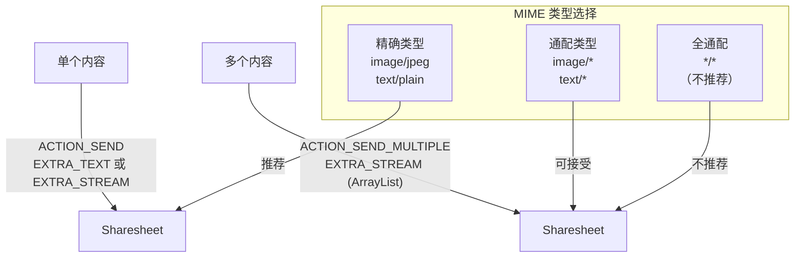
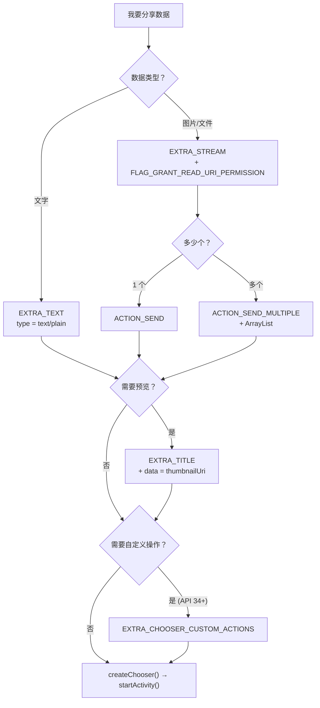
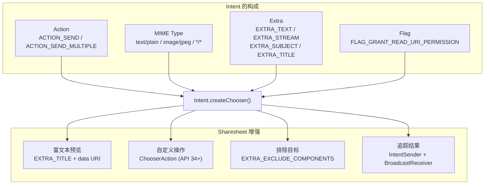

# 1.8.2 向其他应用发送简单数据

## 1.8.2 ACTION_SEND：写好一封推荐信

傍晚的篝火刚刚升起，橘红色的火苗舔舐着干燥的桦木，发出令人安心的噼啪声。空气里弥漫着松脂燃烧的香气。洛芙坐在折叠椅上，膝盖上摊着昨天那张画满箭头的共享全景图，火光在纸面上跳跃。

“概念我都懂了，”她用手指沿着图上的线条划过，“今天晚上，我想把这些发送流程变成真正能跑的代码。”
 
希尔拿着一根长长的铁签子坐到她身旁，签子尖端的棉花糖正慢慢转着圈：“那我们就顺着火光的节奏来吧。先是简单的文字，再是单张图片，接着是一整套图集——一步一步来。”

### 分享文字内容

"如果你想把一段文字（比如一个 URL、一句话、一段营地评价）分享给其他 App——只需要三步。"

```kotlin
// 代码片段 A：分享文字——最基础的共享操作

fun shareText(context: Context, text: String) {
    // 第 1 步：构造 Intent
    val sendIntent = Intent().apply {
        action = Intent.ACTION_SEND          // 我想"发送"
        putExtra(Intent.EXTRA_TEXT, text)     // 这是我要发的内容
        type = "text/plain"                   // 内容格式是纯文本
    }

    // 第 2 步：创建 Sharesheet（而不是直接 startActivity）
    val shareIntent = Intent.createChooser(sendIntent, null)

    // 第 3 步：启动
    context.startActivity(shareIntent)
}
```

“Action、Extra、Type——这就构成了一封完整的推荐信。”洛芙轻声自语，手指敲下了最后一行代码。

她按下运行按钮。手机屏幕轻轻震动了一下，底部弹出了那个熟悉的半透明面板——Sharesheet。列表里整整齐齐地排列着 Telegram、邮件、微信、蓝牙……像是一群随时待命的信使。

“看，它真的自动找到了所有能处理 `text/plain` 的居民。”洛芙的眼睛亮晶晶的，那是理论在现实中开花结果时的喜悦。

"注意——"黛琳的声音从篝火对面传来，她的脸庞被火光照得忽明忽暗。"传给 `createChooser()` 的第二个参数是一个可选的标题文字。以前有些 App 会传 `\"分享到...\"`，但从 Android 10 开始，系统会忽略这个标题——所以直接传 `null` 就好。"

她停了一下，又补充道："还有——你可以加一些额外的 Extra 来丰富分享内容。"

```kotlin
// 代码片段 B：带更多信息的文字分享

fun shareRichText(context: Context) {
    val sendIntent = Intent().apply {
        action = Intent.ACTION_SEND
        putExtra(Intent.EXTRA_TEXT, "https://camp-review.app/spot/12345")
        putExtra(Intent.EXTRA_SUBJECT, "推荐一个超棒的露营地")   // 邮件主题
        putExtra(Intent.EXTRA_TITLE, "星空湖畔营地")             // 预览标题
        // 邮件收件人
        putExtra(Intent.EXTRA_EMAIL, arrayOf("friend@example.com"))
        type = "text/plain"
    }
    context.startActivity(Intent.createChooser(sendIntent, null))
}
```

“EXTRA_SUBJECT 主要是给邮件类 App 准备的礼物——如果用户选择了邮件，它会自动填入主题栏。EXTRA_EMAIL 也是同理。”希尔解释道，手里的棉花糖签子在空中划出一道弧线，“如果用户选了微信或 Telegram，这些额外的礼物可能会被礼貌地忽略——但绝不会导致错误。”

“所以 Extra 是**温柔的暗示**，而不是强制的命令。”洛芙总结道。

“漂亮的说法。”黛琳赞许地点头。

### 分享二进制内容（图片）

“文字只是热身，接下来我们试试更有质感的东西——图片。”黛琳坐直了身子，火光映在她的眼镜片上，折射出锐利的光芒。

```kotlin
// 代码片段 C：分享一张图片

fun shareImage(context: Context, imageUri: Uri) {
    val shareIntent = Intent().apply {
        action = Intent.ACTION_SEND
        putExtra(Intent.EXTRA_STREAM, imageUri)  // 图片的 URI
        type = "image/jpeg"                      // MIME 类型
        addFlags(Intent.FLAG_GRANT_READ_URI_PERMISSION) // 授权读取
    }
    context.startActivity(Intent.createChooser(shareIntent, null))
}
```

"几个关键区别——"黛琳竖起手指，火光在她的指尖跳动。

| 文字分享 | 图片分享 |
|---------|---------|
| `EXTRA_TEXT` 存放文字内容 | `EXTRA_STREAM` 存放 URI |
| `type = "text/plain"` | `type = "image/jpeg"` |
| 不需要权限 | 需要 `FLAG_GRANT_READ_URI_PERMISSION` |

“**`FLAG_GRANT_READ_URI_PERMISSION`** ——把这行代码刻在你的脑子里。”黛琳的声音严肃起来，“你的 App 的私有目录是你的私人领地，别的 App 默认是闯不进来的。加上这个 Flag，你就在送出 URI 的同时，附赠了一张临时的通行证。”

她停顿了一下，打了个比方：“就像你给朋友寄了一把储物柜的钥匙，但如果没跟门卫打招呼，朋友拿着钥匙也进不了大门。这个 Flag 就是那声招呼，至关重要。”

洛芙在笔记本上用红笔重重圈住了 `FLAG_GRANT_READ_URI_PERMISSION`，在旁边认真地画了一把复古的小钥匙。

### 分享多个内容

“如果你贪心一点，想一次分享九宫格照片呢？”希尔咬了一口棉花糖，甜味似乎让她的心情很好，“这时候你需要升级你的 Action。”

```kotlin
// 代码片段 D：分享多张图片

fun shareMultipleImages(context: Context, imageUris: List<Uri>) {
    val shareIntent = Intent().apply {
        action = Intent.ACTION_SEND_MULTIPLE    // 注意：不是 ACTION_SEND
        putParcelableArrayListExtra(
            Intent.EXTRA_STREAM,
            ArrayList(imageUris)                // URI 列表
        )
        type = "image/*"                        // 通配——混合图片类型
        addFlags(Intent.FLAG_GRANT_READ_URI_PERMISSION)
    }
    context.startActivity(Intent.createChooser(shareIntent, null))
}
```

“Action 必须切换到 `ACTION_SEND_MULTIPLE`，”希尔提醒道，“而且因为现在是一沓照片，Extra 得换个大一点的容器——用 `putParcelableArrayListExtra` 放入一个 URI 列表。”

“MIME 类型呢？”洛芙追问。

“如果所有图片都是 JPEG，你可以用 `image/jpeg`。如果有 JPEG 也有 PNG，就用 `image/*`——这是一个通配符，表示‘所有的图片我都要’。当然，如果你疯了，想同时分享文本、图片和 PDF，那就只能用 `*/*`，但官方**强烈不推荐**这样做，因为接收方会困惑得不知所措。”



> 图 1：ACTION_SEND vs ACTION_SEND_MULTIPLE，以及 MIME 类型的精确度选择。

### 富文本预览

“从 Android 10 开始，Sharesheet 学会了展示**预览**。”黛琳翻开了一页新的笔记，纸张在火光下泛黄，“你可以给分享内容加上标题和缩略图——这样用户在 Sharesheet 面板上就能一眼看到自己要分享什么，而不是对着冷冰冰的链接发呆。”

```kotlin
// 代码片段 E：添加富文本预览

fun shareWithPreview(context: Context, url: String, thumbnailUri: Uri) {
    val shareIntent = Intent.createChooser(
        Intent().apply {
            action = Intent.ACTION_SEND
            putExtra(Intent.EXTRA_TEXT, url)

            // 预览标题——显示在 Sharesheet 顶部
            putExtra(Intent.EXTRA_TITLE, "星空湖畔露营攻略")

            // 缩略图——通过 ClipData 传递
            // thumbnailUri 必须来自 FileProvider 或 ContentProvider
            clipData = ClipData.newUri(context.contentResolver, "Thumbnail", thumbnailUri)
            flags = Intent.FLAG_GRANT_READ_URI_PERMISSION
            type = "text/plain"
        },
        null  // Chooser 标题（已弃用，传 null）
    )
    context.startActivity(shareIntent)
}
```

“以前的 Sharesheet 只有冷冰冰的 URL，但现在我们可以给它穿上漂亮的礼服。”希尔的手指在空中勾勒出一个方框，“标题、缩略图——让用户在分享的那一刻，心情是明亮的。”

“不过要注意礼仪，”黛琳补充道，语气不容置疑，“缩略图的 URI 必须来自 `FileProvider` 或 `ContentProvider`。Android 7.0 之后，直接把裸露的 `file://` 路径扔给别人是不礼貌且危险的，系统会直接抛出 `FileUriExposedException`。要学会包装你的数据。”

### 自定义操作（Android 14+）

“在 Android 14 里，我们甚至可以定制 Sharesheet 的门面。”黛琳翻开新的一页，眼神里透着对新技术的欣赏，“你可以添加自定义操作按钮——比如‘复制链接’或者‘稍后阅读’。这是你的 App 在系统舞台上的独角戏。”

```kotlin
// 代码片段 F：自定义 Sharesheet 操作（Android 14+）

@RequiresApi(Build.VERSION_CODES.UPSIDE_DOWN_CAKE)
fun shareWithCustomAction(context: Context, text: String) {
    val sendIntent = Intent(Intent.ACTION_SEND).apply {
        putExtra(Intent.EXTRA_TEXT, text)
        type = "text/plain"
    }

    // 创建自定义操作
    val customAction = ChooserAction.Builder(
        Icon.createWithResource(context, R.drawable.ic_copy),
        "复制链接",
        PendingIntent.getBroadcast(
            context,
            0,
            Intent(context, CopyLinkReceiver::class.java).apply {
                putExtra("url", text)
            },
            PendingIntent.FLAG_IMMUTABLE or PendingIntent.FLAG_UPDATE_CURRENT
        )
    ).build()

    val shareIntent = Intent.createChooser(sendIntent, null).apply {
        putExtra(Intent.EXTRA_CHOOSER_CUSTOM_ACTIONS, arrayOf(customAction))
    }

    context.startActivity(shareIntent)
}
```

洛芙想象着 Sharesheet 顶部出现那枚精致的小图标：“所以这不干扰正常的分享流程，只是多了一种选择？”

“正是如此。”黛琳微笑着点头，“它就像在繁忙的邮局大厅里，专门为你开辟了一个 VIP 快速窗口。既不占道，又格外方便。”

### 排除特定目标

“有时候你得学会‘避嫌’——比如用户在你的 App 内部点了分享按钮，你不希望你的 App 自己又跳出来出现在候选列表里。”

```kotlin
// 代码片段 G：排除特定分享目标

fun shareExcludingSelf(context: Context, text: String) {
    val sendIntent = Intent(Intent.ACTION_SEND).apply {
        putExtra(Intent.EXTRA_TEXT, text)
        type = "text/plain"
    }

    val shareIntent = Intent.createChooser(sendIntent, null).apply {
        // 排除自己的 App
        val excludedComponents = arrayOf(
            ComponentName(context.packageName, "com.example.app.ShareActivity")
        )
        putExtra(Intent.EXTRA_EXCLUDE_COMPONENTS, excludedComponents)
    }

    context.startActivity(shareIntent)
}
```

"只排除你自己控制的组件——不要排除别人的 App。"黛琳严肃地说。"那是用户的选择权。"

### 获取分享结果

“最后一个高级技巧——你可以像侦探一样，知道用户到底选了哪个 App 来接收你的礼物。”

```kotlin
// 代码片段 H：监听用户的分享选择

fun shareAndTrack(context: Context, text: String) {
    val sendIntent = Intent(Intent.ACTION_SEND).apply {
        putExtra(Intent.EXTRA_TEXT, text)
        type = "text/plain"
    }

    // 创建一个 PendingIntent 来接收结果
    val pendingIntent = PendingIntent.getBroadcast(
        context,
        0,
        Intent(context, ShareResultReceiver::class.java),
        PendingIntent.FLAG_MUTABLE or PendingIntent.FLAG_UPDATE_CURRENT
    )

    // 把 PendingIntent 的 IntentSender 传给 createChooser
    val shareIntent = Intent.createChooser(
        sendIntent,
        null,
        pendingIntent.intentSender  // 第三个参数！
    )

    context.startActivity(shareIntent)
}

// BroadcastReceiver 接收用户的选择
class ShareResultReceiver : BroadcastReceiver() {
    override fun onReceive(context: Context, intent: Intent) {
        // 获取用户选择的目标 App 的 ComponentName
        val chosenComponent: ComponentName? =
            intent.getParcelableExtra(Intent.EXTRA_CHOSEN_COMPONENT)
        Log.d("Share", "用户选择了: ${chosenComponent?.flattenToString()}")
    }
}
```

“这对于了解你的用户非常有价值。”希尔吹凉了第二颗棉花糖，外皮焦脆，内里绵软，“知道了用户喜欢把照片发给微信还是保存到云盘，你就能更懂他们的习惯。虽然系统会自动排序，但掌握这些数据，就像掌握了营地里风的流向。”

"注意 `PendingIntent.FLAG_MUTABLE`——"黛琳提醒道。"结果里的 `EXTRA_CHOSEN_COMPONENT` 是系统在运行时才填入的，所以 PendingIntent 必须是可变的（mutable）。如果你用了 `FLAG_IMMUTABLE`，系统就无法写入结果。"

### 完整的发送决策流程

洛芙在笔记本上画了一张决策流程图，用不同颜色的笔标注了每个分支。



> 图 2：发送数据的完整决策流程。从数据类型开始，到最终 createChooser()。

---

夜色终于完全笼罩了湖面，只有这一方篝火温暖如春。洛芙合上笔记本，看着上面整整齐齐列出的函数名：`shareText`、`shareImage`、`shareMultipleImages`、`shareAndTrack`。

“这感觉就像搭帐篷，”她轻声感叹，“骨架搭好了，不管是盖上防雨布还是挂上彩灯，都随心所欲。”

“结构就是自由。”黛琳简洁地总结。

希尔举起最后一根烤得完美的棉花糖，像举起奖杯：“今晚的技术验收通过！明天，我们去河对岸，看看怎么‘接收’这些漂流瓶。”

---

### 技术总结

> **向其他应用发送简单数据** —— 通过 `Intent.ACTION_SEND`（单内容）或 `ACTION_SEND_MULTIPLE`（多内容）构造分享 Intent，设置 MIME 类型和数据 Extra，用 `Intent.createChooser()` 启动系统 Sharesheet。支持文字（`EXTRA_TEXT`）、二进制内容（`EXTRA_STREAM` + URI）、富文本预览（`EXTRA_TITLE` + 缩略图）、自定义操作（Android 14+）和分享结果追踪。

#### 今日关键词

1. **ACTION_SEND**：分享单个内容的 Intent Action。搭配 `EXTRA_TEXT`（文字）或 `EXTRA_STREAM`（文件 URI）使用。
2. **ACTION_SEND_MULTIPLE**：分享多个内容的 Intent Action。搭配 `putParcelableArrayListExtra(EXTRA_STREAM, uriList)` 使用。
3. **FLAG_GRANT_READ_URI_PERMISSION**：临时授权接收方读取你的 App 的私有 URI。分享图片/文件时必加。
4. **EXTRA_TITLE + 缩略图**：为 Sharesheet 添加富文本预览（Android 10+）。标题通过 `EXTRA_TITLE`，缩略图通过 Intent 的 `data` 属性。
5. **ChooserAction（Android 14+）**：在 Sharesheet 顶部添加自定义操作按钮。通过 `EXTRA_CHOOSER_CUSTOM_ACTIONS` 传入。

#### 结构图



> 发送 Intent 的完整结构。左侧是 Intent 的基本构成，右侧是 Sharesheet 的可选增强功能。

#### 反模式与陷阱

1. **分享图片不加 FLAG_GRANT_READ_URI_PERMISSION**：接收方读不到 URI → `SecurityException`。
   * **修复**：分享文件/图片时始终添加此 Flag。

2. **使用 file:// URI 分享文件**：Android 7.0+ 直接抛 `FileUriExposedException`。
   * **修复**：使用 `FileProvider` 生成 `content://` URI。

3. **ACTION_SEND 发多个文件**：只会传递第一个文件，其余丢失。
   * **修复**：多文件使用 `ACTION_SEND_MULTIPLE`。

4. **MIME 类型与实际数据不匹配**：声称 `image/jpeg` 但实际传了 PNG → 接收方解析失败。
   * **修复**：用 `ContentResolver.getType(uri)` 获取真实 MIME 类型。

5. **监听分享结果时用 FLAG_IMMUTABLE**：系统无法写入 `EXTRA_CHOSEN_COMPONENT` → 收不到结果。
   * **修复**：使用 `FLAG_MUTABLE`。

#### 设计哲学：统一骨架，灵活变体

1. **一个骨架，多种变体**：所有分享操作都是 Action + Type + Extra → createChooser → startActivity。变的只是内容。
2. **权限最小化**：`FLAG_GRANT_READ_URI_PERMISSION` 只授予临时的、只读的、单次的权限。不会让接收方永久访问你的文件。
3. **预览提升信任**：富文本预览让用户确认"我正在分享什么"——减少误操作。
4. **自定义不干扰**：ChooserAction 是额外选项，不替代系统推荐的候选 App。
5. **追踪但不控制**：你可以知道用户选了哪个 App，但不能强制用户选某个 App。尊重选择权。

---

#### 🏕️ 动手练习

#### Task 1 · 分享纯文本 (Share Text) ★

**目标**：实现最基础的文字分享功能。

**你需要做的事**：
1. 创建一个 Button，点击后分享一段文字。
2. 使用 `ACTION_SEND` + `EXTRA_TEXT` + `text/plain`。
3. 用 `createChooser()` 启动 Sharesheet。

**验收标准**：
- [ ] Sharesheet 弹出
- [ ] 选择 App 后文字正确传递
- [ ] 使用了 createChooser 而非直接 startActivity

---

#### Task 2 · 分享带主题的文字 (Rich Text) ★★

**目标**：分享文字并附带主题和收件人。

**你需要做的事**：
1. 添加 `EXTRA_SUBJECT` 作为邮件主题。
2. 添加 `EXTRA_EMAIL` 作为收件人。
3. 验证邮件 App 自动填充了主题和收件人。

**验收标准**：
- [ ] 邮件 App 自动填充主题
- [ ] 其他 App 忽略多余的 Extra 但不崩溃

---

#### Task 3 · 分享一张图片 (Share Image) ★★★

**目标**：分享一张图片给其他 App。

**你需要做的事**：
1. 从相册获取一张图片的 URI。
2. 使用 `EXTRA_STREAM` + `image/jpeg`。
3. 添加 `FLAG_GRANT_READ_URI_PERMISSION`。

**验收标准**：
- [ ] 接收方能看到图片
- [ ] 没有 SecurityException
- [ ] 使用了 content:// URI（不是 file://）

---

#### Task 4 · 分享多张图片 (Share Multiple) ★★★

**目标**：一次分享多张图片。

**你需要做的事**：
1. 使用 `ACTION_SEND_MULTIPLE`。
2. 用 `putParcelableArrayListExtra` 传 URI 列表。
3. 选择合适的通配 MIME 类型。

**验收标准**：
- [ ] 多张图片全部传递
- [ ] 使用了 ACTION_SEND_MULTIPLE
- [ ] MIME 类型合理

---

#### Task 5 · 添加富文本预览 (Rich Preview) ★★★

**目标**：在 Sharesheet 中显示标题和缩略图。

**你需要做的事**：
1. 设置 `EXTRA_TITLE` 作为预览标题。
2. 用 `ClipData.newUri()` 设置缩略图 URI。
3. 验证 Sharesheet 显示了预览。

**验收标准**：
- [ ] Sharesheet 顶部显示标题
- [ ] 缩略图正确显示
- [ ] 需要 Android 10+ 设备

---

#### Task 6 · 排除自身 App (Exclude Self) ★★★

**目标**：从 Sharesheet 中排除自己的 App。

**你需要做的事**：
1. 用 `EXTRA_EXCLUDE_COMPONENTS` 排除自己的 ComponentName。
2. 验证自己的 App 不在候选列表中。

**验收标准**：
- [ ] 自己的 App 不在 Sharesheet 中
- [ ] 其他 App 正常显示

---

#### Task 7 · 追踪分享结果 (Track Result) ★★★★

**目标**：知道用户选择了哪个 App 来接收分享。

**你需要做的事**：
1. 创建 BroadcastReceiver。
2. 用 PendingIntent 监听 Chooser 的结果。
3. 在 Receiver 中读取 `EXTRA_CHOSEN_COMPONENT`。

**验收标准**：
- [ ] Receiver 收到了用户的选择
- [ ] PendingIntent 使用了 FLAG_MUTABLE
- [ ] Log 中显示了选中的 ComponentName

---

#### Task 8 · 自定义 Sharesheet 操作 (Custom Action) ★★★★★

**目标**：在 Sharesheet 顶部添加自定义操作按钮（需要 Android 14+）。

**你需要做的事**：
1. 创建 `ChooserAction`。
2. 配置图标、标签和 PendingIntent。
3. 通过 `EXTRA_CHOOSER_CUSTOM_ACTIONS` 传入。

**验收标准**：
- [ ] Sharesheet 顶部显示自定义操作
- [ ] 点击按钮触发 PendingIntent
- [ ] 需要 API 34+ 设备

---

#### 面试热身

1. **Q1**：ACTION_SEND 和 ACTION_SEND_MULTIPLE 的使用场景有什么区别？
2. **Q2**：为什么分享图片时必须添加 FLAG_GRANT_READ_URI_PERMISSION？
3. **Q3**：什么是 Sharesheet 的富文本预览？如何实现？
4. **Q4**：如何知道用户在 Sharesheet 中选择了哪个 App？
5. **Q5**：为什么不建议使用 file:// URI 来分享文件？

#### 参考实现要点

1. **文字用 EXTRA_TEXT，文件用 EXTRA_STREAM**：不要搞混。
2. **MIME 类型与数据一致**：JPEG 图片用 `image/jpeg`，不要用 `image/png`。
3. **分享文件时必加 FLAG_GRANT_READ_URI_PERMISSION**：否则接收方没有权限。
4. **使用 FileProvider 生成 URI**：不要暴露 `file://` 路径。
5. **追踪结果时 PendingIntent 必须 MUTABLE**：系统需要写入 EXTRA_CHOSEN_COMPONENT。

---

> 💡 分享是 App 之间最古老也最优雅的交互方式。它不需要 API Key，不需要 SDK 集成，不需要服务器中转——只需要一个 Intent，一个 MIME 类型，和用户的一次点击。

---

### 🍭 洛芙的小小日记本

晚风把湖水的味道吹进了帐篷。

今天我最大的收获，是发现了代码世界里的“骨架之美”。`ACTION_SEND` 就像是一具完美的骨骼，Extra 填充了血肉，MIME 类型赋予了它身份。只要掌握了这个结构，通过一点点参数的变化，就能长出各种各样的形态。

从最初觉得神秘的“黑盒”，到如今能亲手构建的一封封“信件”，这种掌控感真好。

晚安，Android。晚安，仍在传输中的每一个比特。
