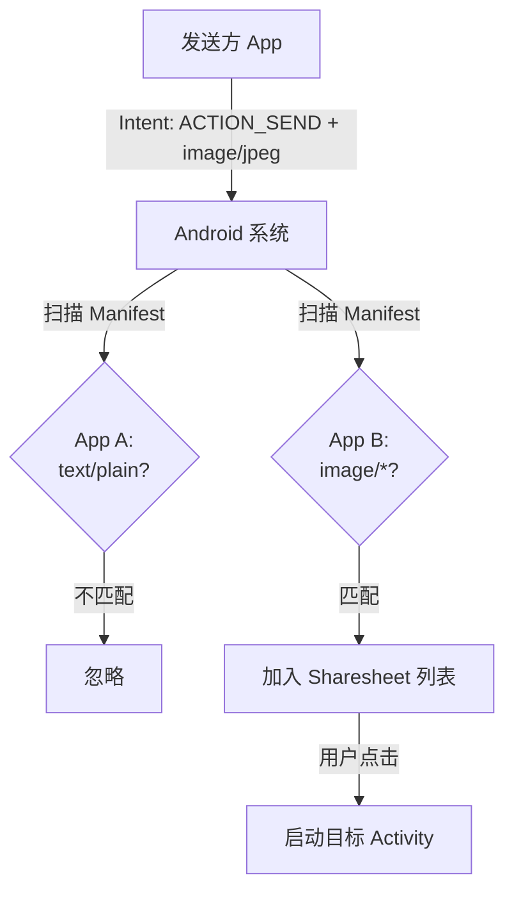
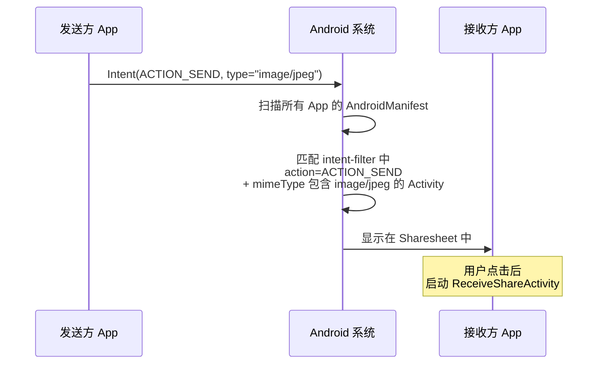
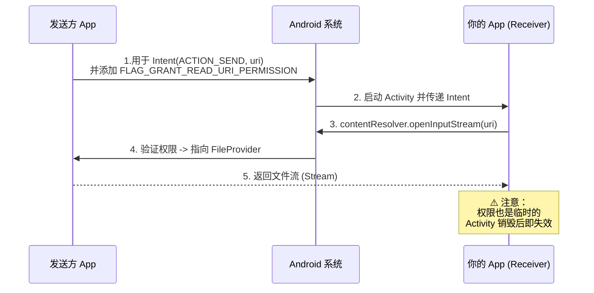
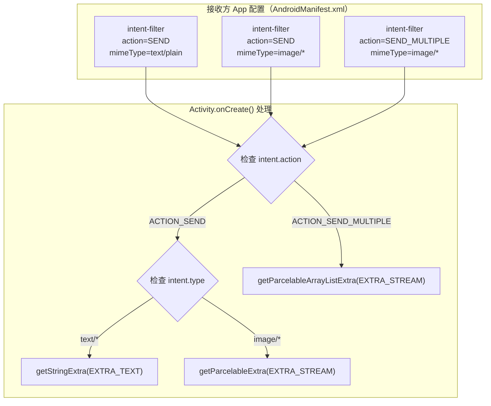

# 1.8.3 从其他应用接收简单数据

## 1.8.3 接收信封的那扇门

晨雾还没完全散去，帐篷外的草叶上挂着细密的露珠。洛芙抱着一杯热可可坐在折叠桌前，屏幕的微光照亮了她有些困倦但专注的脸。

"昨天学会了怎么把信寄出去，今天该学怎么收信了。"她对着刚从帐篷里钻出来的黛琳晃了晃杯子，"我要让我们的 App 能出现在别人的 Sharesheet 列表里。"

黛琳一边整理着被露水打湿的袖口，一边坐到她对面："接收端的核心逻辑和发送端是**镜像对称**的。发送端负责把数据封装进 Intent，接收端就得负责声明自己能拆开什么样的 Intent。"

"这需要在 `AndroidManifest` 里挂个牌子，对吧？"洛芙把键盘拉近了一些。

### 精确的门牌号：MIME 类型

"不仅是挂牌子，还要写清楚你接收什么。"黛琳指着那堆还没熄灭的篝火余烬，"如果你只说'我接收东西'，那别人可能会把垃圾、石头或者情书都扔给你。你得精确定义——比如，只接收`text/*`或者`image/*`。"

洛芙点了点头，在新建的文档里敲下了几行分类笔记：

| MIME 大类 | 常见子类型 | 场景举例 |
|----------|----------|----------|
| `text/*` | `text/plain`、`text/html` | 接收文字笔记、网页链接 |
| `image/*` | `image/jpeg`、`image/png` | 接收照片进行美化 |
| `video/*` | `video/mp4` | 接收视频进行剪辑 |
| `*/*` | (所有类型) | **一般不建议使用**，除非你是文件管理器 |

"这里的逻辑很直接——"黛琳的声音在清晨显得格外清冽，"如果你的 App 是个画板，就不要声明接收 `text/plain`。用户分享一段文字时如果看见画板 App 出现在列表里，点击后却发现无法处理，这种体验是灾难性的。"

### 声明 Intent Filter

"在 `AndroidManifest.xml` 中，我们用 `<intent-filter>` 标签来告诉系统这一规则。"黛琳在白板上画了一个简单的流程图，"系统在构建 Sharesheet 时，会拿发送过来的 Intent 和所有 App 的 Filter 做匹配。"



"看图，"黛琳用笔尖点了点 `Check2` 的位置，"只有当 Action 和 MIME Type 同时匹配时，你的门才会打开。"

这时候，希尔那一头乱糟糟的卷发终于从睡袋里探了出来。她显然已经醒了一会儿了，只是懒得动。听到这里，她伸手够到了放在地上的笔记本电脑，噼里啪啦地敲了一段代码投屏过去，连眼睛都没完全睁开。

```xml
<!-- AndroidManifest.xml -->
<activity android:name=".ui.ReceiveShareActivity">

    <!-- 场景 A：接收纯文本 -->
    <!-- 就像一个只能塞进信纸的扁平信箱口 -->
    <intent-filter>
        <action android:name="android.intent.action.SEND" />
        <category android:name="android.intent.category.DEFAULT" />
        <data android:mimeType="text/plain" />
    </intent-filter>

    <!-- 场景 B：接收单张图片 -->
    <intent-filter>
        <action android:name="android.intent.action.SEND" />
        <category android:name="android.intent.category.DEFAULT" />
        <data android:mimeType="image/*" />
    </intent-filter>

    <!-- 场景 C：接收多张图片（注意 Action 变了） -->
    <intent-filter>
        <action android:name="android.intent.action.SEND_MULTIPLE" />
        <category android:name="android.intent.category.DEFAULT" />
        <data android:mimeType="image/*" />
    </intent-filter>

</activity>
```

"三个 `<intent-filter>`，分别对应三个场景——接收文字、接收单张图片、接收多张图片。"黛琳逐一指着屏幕。

洛芙盯着代码看了一会儿，手指在空气中比划着什么。"所以 `<action>` 对应 `ACTION_SEND` 或 `ACTION_SEND_MULTIPLE`——跟发送端用的 Action 一模一样？"

"对。这就是 Intent 系统的**对称性**——"黛琳的语气里带着一种数学老师发现学生开窍时特有的满足感。



> 图 1：Intent 的匹配过程。系统在 Sharesheet 中只展示声明了匹配 `intent-filter` 的 App。

"每一个 `<intent-filter>` 就是你在系统门卫那里登记的一张**接待名片**。"伊莎接过话，她的声音在晨雾中听起来柔软得像棉花糖。"你告诉门卫：'凡是拿着文字信封来的，请带到我这里。凡是带着图片包裹的——也带过来。'如果来的人拿的是视频，而你的名片上没写'我接收视频'——门卫就不会把这个人领到你面前。"

洛芙的笔尖在本子上停了一下。"那如果我想接收**所有类型**呢？"

"`*/*`——万能匹配。但不推荐。"希尔的声音从帐篷里传出来——她显然早就醒了但一直躲在睡袋里听。"因为这样你会收到**一切**——文字、图片、视频、PDF、Excel 表格、甚至别人的通讯录文件。你的 App 真的能处理这些吗？"

"说得对……还是精确一点好。"洛芙在笔记本上写下——`不要用 */*，除非你真的准备好了处理所有格式`。

### 处理接收到的内容

"声明好了 intent-filter 之后——当用户在 Sharesheet 里选择了你的 App，系统就会启动你的 Activity。接下来你需要在 Activity 里**读取 Intent 中的数据**。"

希尔终于从帐篷里钻出来，头发乱糟糟的，但眼神已经亮了起来。她走到黛琳身旁，接过笔记本，噼里啪啦地打起字来。

```kotlin
// 代码片段 A：在 Activity 中处理接收到的共享数据

class ReceiveShareActivity : AppCompatActivity() {

    override fun onCreate(savedInstanceState: Bundle?) {
        super.onCreate(savedInstanceState)
        setContentView(R.layout.activity_receive_share)

        // 根据 Intent 的 action 分支处理
        when {
            // 场景 1：接收单个内容（ACTION_SEND）
            intent?.action == Intent.ACTION_SEND -> {
                if ("text/plain" == intent.type) {
                    // 接收文字
                    handleReceivedText(intent)
                } else if (intent.type?.startsWith("image/") == true) {
                    // 接收单张图片
                    handleReceivedImage(intent)
                }
            }

            // 场景 2：接收多个内容（ACTION_SEND_MULTIPLE）
            intent?.action == Intent.ACTION_SEND_MULTIPLE
                    && intent.type?.startsWith("image/") == true -> {
                // 接收多张图片
                handleReceivedMultipleImages(intent)
            }

            // 场景 3：其他方式启动（例如从桌面图标）
            else -> {
                // 正常启动逻辑
            }
        }
    }

    // 处理接收到的文字
    private fun handleReceivedText(intent: Intent) {
        // 对应的，发送端用的 key 是 EXTRA_TEXT
        intent.getStringExtra(Intent.EXTRA_TEXT)?.let { text ->
            // 在 UI 上显示接收到的文字
            // 例如：填入编辑框、显示预览
            Log.d("Share", "收到文字: $text")
        }
    }

    // 处理接收到的单张图片
    private fun handleReceivedImage(intent: Intent) {
        // 图片是流数据，放在 EXTRA_STREAM 里
        // API 33+ 建议使用 getParcelableExtra(key, clazz)
        val imageUri = if (Build.VERSION.SDK_INT >= Build.VERSION_CODES.TIRAMISU) {
            intent.getParcelableExtra(Intent.EXTRA_STREAM, Uri::class.java)
        } else {
            @Suppress("DEPRECATION")
            intent.getParcelableExtra(Intent.EXTRA_STREAM)
        }
        
        imageUri?.let { uri ->
            Log.d("Share", "收到图片 URI: $uri")
            // ⚠️ 警告：不要在主线程读取 ContentProvider！
        }
    }

    // 处理接收到的多张图片
    private fun handleReceivedMultipleImages(intent: Intent) {
        // 多图是 ArrayList<Uri>
        val imageUris = if (Build.VERSION.SDK_INT >= Build.VERSION_CODES.TIRAMISU) {
            intent.getParcelableArrayListExtra(Intent.EXTRA_STREAM, Uri::class.java)
        } else {
            @Suppress("DEPRECATION")
            intent.getParcelableArrayListExtra(Intent.EXTRA_STREAM)
        }

        imageUris?.forEach { uri ->
            Log.d("Share", "收到图片组: $uri")
        }
    }
}
```

"注意到了吗？"黛琳指着 `handleReceivedImage` 方法，"你拿到的只是一个 `Uri`。这个 Uri 是通过 `FileProvider` 授予的一次性访问权。你并不拥有那个文件，你只有一张临时的'借阅证'。"

### 坏味道 vs 好味道

希尔坐直了身子，把电脑屏幕转向洛芙，"但我见过太多新手写出这种**自杀式代码**。"

她快速敲了一段代码，并在上面打了个大大的红叉。

```kotlin
// ❌ [反模式] 危险的接收逻辑
class BadReceiveActivity : AppCompatActivity() {
    override fun onCreate(savedInstanceState: Bundle?) {
        super.onCreate(savedInstanceState)
        
        // 💀 致命错误 1：没有检查 Action，假设所有人都是来分享图片的
        // 如果用户是从桌面图标启动 App，intent.action 是 MAIN，下面会崩溃
        
        // 💀 致命错误 2：在主线程读取 IO
        // 如果图片有 10MB，界面会直接卡死 (ANR)
        val imageUri = intent.getParcelableExtra<Uri>(Intent.EXTRA_STREAM)
        val bitmap = BitmapFactory.decodeStream(contentResolver.openInputStream(imageUri!!)) // !! 也是大忌
        
        imageView.setImageBitmap(bitmap)
    }
}
```

"看到了吗？"希尔指着屏幕，"这段代码假设了世界是完美的——假设 Intent 里一定有数据，假设文件一定能读出来，假设图片很小。但在现实中，这会导致 `NullPointerException` 或者 `ANR`。"

各种惨痛的崩溃场景在洛芙脑海里闪过。她缩了缩脖子："那正确的做法是？"

"防御。全方位的防御。"希尔删掉了那段代码，重新写下了一段优雅的实现。

```kotlin
// ✅ [推荐] 防御式接收逻辑
class ReceiveShareActivity : AppCompatActivity() {
    // ... onCreate 见上文 ...

    private fun handleReceivedImage(intent: Intent) {
        val imageUri = if (Build.VERSION.SDK_INT >= Build.VERSION_CODES.TIRAMISU) {
            intent.getParcelableExtra(Intent.EXTRA_STREAM, Uri::class.java)
        } else {
            @Suppress("DEPRECATION")
            intent.getParcelableExtra(Intent.EXTRA_STREAM)
        }
        
        if (imageUri == null) {
            finish() // 没数据就退出
            return
        }

        // 2. 切到 IO 线程处理流数据
        lifecycleScope.launch(Dispatchers.IO) {
            try {
                // 3.再次验证 MIME 类型（信任 ContentResolver 而非 Intent）
                val type = contentResolver.getType(imageUri)
                if (type?.startsWith("image/") == true) {
                    contentResolver.openInputStream(imageUri)?.use { stream ->
                        val bitmap = BitmapFactory.decodeStream(stream)
                        // 4. 切回主线程更新 UI
                        withContext(Dispatchers.Main) {
                            imageView.setImageBitmap(bitmap)
                        }
                    }
                }
            } catch (e: Exception) {
                Log.e("Share", "读取失败", e) // 兜底异常
            }
        }
    }
}
```

### 运行输出

希尔打开了两个模拟器窗口，演示了一个完整的收发流程。

```
// 发送方 App 日志
D/Share: 分享文字: "今晚星空超美！推荐这个营地 https://camp.app/1234"

// 接收方 App 日志
D/Share: 收到文字: 今晚星空超美！推荐这个营地 https://camp.app/1234

// 发送方 App 分享图片
D/Share: 分享图片 URI: content://com.sender.fileprovider/images/sunset.jpg

// 接收方 App 接收图片
D/Share: 收到图片 URI: content://com.sender.fileprovider/images/sunset.jpg
D/Share: 实际 MIME 类型: image/jpeg
D/Share: 图片大小: 2.3 MB
D/Share: 正在后台线程加载...
D/Share: 图片加载完成，显示到 ImageView
```

"五道防线，"希尔伸出沾着一点饼干屑的五根手指，逐一弯下，"判 Action、判空、切线程、验 MIME、Catch 异常。少一道，你的 App 就在裸奔。"

### 全链路安全视角

这时，一直坐在角落里削苹果的伊莎突然停下了手中的小刀。

"还有一件事，"她把一片切好的苹果递给洛芙，语气像刀锋一样平静而简单，"关于那个 `Uri`。"

"那个 Uri 就像是我给你的一张临时通行证。"伊莎解释道，"发送方通过 `FileProvider` 生成它，并赋予了临时的读权限。你并不拥有文件，你只是被允许看一眼。"

黛琳在白板上补全了最后一张图，清晰地展示了数据是如何跨越进程边界流动的。



"看图 2，"黛琳指着中间的 System 节点，"这个权限是绑定在 `Intent` 上的。如果你的 Activity 结束了，或者你想把这个 Uri 存下来以后再用——对不起，通行证过期了。如果你需要持久化，必须把文件内容**复制**到你自己的私有目录里。"

晨风吹过，卷起几片落叶。洛芙合上电脑，感觉自己刚刚像是设计了一座戒备森严的堡垒——不仅要大门敞开欢迎朋友，还要在玄关装满安检设备。

"开放，通过协议；"她在心里默念，"安全，通过校验。"

### 让用户认出你的 App

黛琳推了推眼镜。"还有一个细节——当你的 App 出现在 Sharesheet 里时，用户看到的是你的**图标和名称**。这两个来自 `AndroidManifest.xml` 的 `<application>` 标签。"

```xml
<!-- AndroidManifest.xml 中的应用标识 -->
<application
    android:icon="@mipmap/ic_launcher"    <!-- Sharesheet 中显示的图标 -->
    android:label="@string/app_name"      <!-- Sharesheet 中显示的名称 -->
    ...>
```

"从 **Android 10** 开始，Sharesheet **只使用** `<application>` 标签上的图标——即使你在 `<activity>` 或 `<intent-filter>` 上设了不同的图标，也会被忽略。"

"所以要确保你的 App 图标足够有辨识度——"伊莎从毛毯里探出手来，举起自己的手机晃了晃。"用户在 Sharesheet 里看到一排图标，要在一秒钟内认出你的 App。图标不好看、不清晰——用户就会跳过你。"

---

### 技术总结

> **从其他应用接收简单数据（Receive simple data from other apps）** —— 通过在 `AndroidManifest.xml` 中为 Activity 声明 `<intent-filter>`（指定 `ACTION_SEND`/`ACTION_SEND_MULTIPLE` 和 `mimeType`），使 App 成为 Sharesheet 的候选接收方。在 Activity 的 `onCreate()` 中通过 `getIntent()` 获取共享数据，用 `getStringExtra(EXTRA_TEXT)` 接收文字、`getParcelableExtra(EXTRA_STREAM)` 接收文件 URI。

#### 今日关键词

1.  **Intent Filter**：接收端的声明书。必须包含 `<action>` (`SEND`/`SEND_MULTIPLE`)、`<category>` (`DEFAULT`) 和 `<data>` (`mimeType`)。
2.  **对称性**：发送端 `putExtra(EXTRA_TEXT)` $\leftrightarrow$ 接收端 `getStringExtra(EXTRA_TEXT)`。
3.  **临时权限**：接收到的 URI 依赖 `FLAG_GRANT_READ_URI_PERMISSION`，生命周期短暂。如果需要长期使用，必须将文件**复制**到本地。
4. **MIME 类型匹配**：系统通过 `<data android:mimeType="...">` 筛选能处理对应格式的 App。支持通配符如 `image/*`。
5. **EXTRA_TEXT**：文字分享时存放内容的 Extra 键。用 `getStringExtra()` 取出。
6. **EXTRA_STREAM**：文件分享时存放 URI 的 Extra 键。单文件用 `getParcelableExtra()`，多文件用 `getParcelableArrayListExtra()`。
7. **ContentResolver.getType()**：获取 URI 对应的真实 MIME 类型。比 `intent.type` 更可信。
8. **应用标识**：Sharesheet 显示的图标和名称来自 `<application>` 标签的 `android:icon` 和 `android:label` 属性。

#### 反模式与陷阱

| 错误做法 (Anti-Pattern) |后果 | 正确姿势 |
|---|---|---|
| **不检查 Action** | 从桌面启动 App 时崩溃 (NPE) | `if (intent.action == ACTION_SEND) ...` |
| **主线程读取 IO** | 界面卡死 (ANR) | 使用 `Dispatchers.IO` 或 `Worker` |
| **信任 intent.type** | 可能被恶意欺骗 (如 .exe 伪装成 .jpg) | 使用 `contentResolver.getType(uri)` 验证 |
| **使用 `*/*` 类型** | 出现在所有分享列表，体验极差 | 精确声明 `image/*` 或 `text/plain` |

#### 结构图：接收端决策树



> 接收方的完整处理流程：manifest 声明 → action 分支 → type 分支 → 对应 handler。

#### 反模式与陷阱

1. **不检查 intent.action 就直接读取 Extra**：如果 Activity 是从桌面图标启动的，`EXTRA_TEXT` 和 `EXTRA_STREAM` 可能为 null → 空指针崩溃。
   * **修复**：先用 `when` 或 `if` 判断 `intent?.action`，只有 `ACTION_SEND` 时才读取分享数据。

2. **在主线程解码大图片**：`BitmapFactory.decodeStream()` 是 I/O + CPU 密集操作 → ANR（Application Not Responding）。
   * **修复**：使用 `lifecycleScope.launch(Dispatchers.IO)` 在后台线程处理，完成后 `withContext(Dispatchers.Main)` 更新 UI。

3. **信任 intent.type 而不验证**：发送方可能将 PNG 文件标记为 `image/jpeg`，导致解析错误。
   * **修复**：用 `contentResolver.getType(uri)` 获取真实类型。

4. **使用 `!!` 强制解包 Extra**：`EXTRA_STREAM` 可能为 null（发送方实现不完善）→ 崩溃。
   * **修复**：使用 `?.let {}` 或 `?: return` 安全处理空值。

5. **声明 `*/*` 接收所有类型**：App 出现在每一个分享操作中 → 用户体验差，收到无法处理的数据类型。
   * **修复**：只声明 App 能实际处理的 MIME 类型。

#### 设计哲学：防御式编程

1. **永远不信任外来输入**：来自其他 App 的 Intent 数据可能缺失、错误、恶意。每一步都要验证。
2. **精确声明能力**：只在 `intent-filter` 中声明 App 真正能处理的 MIME 类型，不要贪多。
3. **后台处理二进制数据**：图片、视频等大文件必须在后台线程处理，主线程只做 UI 更新。
4. **优雅降级**：数据异常时显示友好的错误提示，而不是崩溃。
5. **品牌辨识度**：App 的图标和名称是用户在 Sharesheet 中认出你的唯一线索——设计要清晰、有辨识度。

---

#### 🏕️ 动手练习

#### Task 1 · 挂上信箱（Manifest） ★

**目标**：让你的 App 出现在文字分享的 Sharesheet 中。

**你需要做的事**：
1. 在 `AndroidManifest.xml` 中为一个 Activity 添加 `<intent-filter>`。
2. 声明 `ACTION_SEND` + `text/plain`。
3. 从另一个 App 分享文字，确认你的 App 出现在候选列表中。

**验收标准**：
- [ ] 分享文字时你的 App 出现在 Sharesheet 中
- [ ] intent-filter 包含 action、category、data 三个元素
- [ ] category 为 `DEFAULT`

**提示**：
```xml
<intent-filter>
    <action android:name="android.intent.action.SEND" />
    <category android:name="android.intent.category.DEFAULT" />
    <data android:mimeType="text/plain" />
</intent-filter>
```

---

#### Task 2 · 读取接收到的文字 ★★

**目标**：在 Activity 中读取并显示接收到的文字。

**你需要做的事**：
1. 在 `onCreate()` 中检查 `intent.action == Intent.ACTION_SEND`。
2. 用 `getStringExtra(Intent.EXTRA_TEXT)` 取出文字。
3. 显示在一个 `TextView` 中。

**验收标准**：
- [ ] 文字正确显示
- [ ] 处理了 null 情况
- [ ] 先检查 action 再读取 Extra

**提示**：
```kotlin
if (intent?.action == Intent.ACTION_SEND && intent.type == "text/plain") {
    intent.getStringExtra(Intent.EXTRA_TEXT)?.let { text ->
        textView.text = text
    }
}
```

---

#### Task 3 · 接收图片并显示 ★★★

**目标**：接收其他 App 分享的图片并在 ImageView 中显示。

**你需要做的事**：
1. 声明 `ACTION_SEND` + `image/*` 的 intent-filter。
2. 用 `getParcelableExtra(Intent.EXTRA_STREAM)` 获取 URI。
3. 在后台线程用 `BitmapFactory.decodeStream()` 解码。

**验收标准**：
- [ ] 图片正确显示
- [ ] 解码在后台线程进行
- [ ] 有异常捕获

**提示**：
```kotlin
lifecycleScope.launch(Dispatchers.IO) {
    contentResolver.openInputStream(uri)?.use { stream ->
        val bitmap = BitmapFactory.decodeStream(stream)
        withContext(Dispatchers.Main) { imageView.setImageBitmap(bitmap) }
    }
}
```

---

#### Task 4 · 接收多张图片 ★★★

**目标**：接收多张图片并在 RecyclerView 中展示。

**你需要做的事**：
1. 声明 `ACTION_SEND_MULTIPLE` + `image/*`。
2. 用 `getParcelableArrayListExtra(Intent.EXTRA_STREAM)` 获取 URI 列表。
3. 用 RecyclerView + Adapter 展示所有图片。

**验收标准**：
- [ ] 多张图片全部显示
- [ ] 使用了 ACTION_SEND_MULTIPLE 对应的取值方法
- [ ] 每张图片在后台线程加载

---

#### Task 5 · MIME 类型验证 ★★★

**目标**：接收文件时验证真实 MIME 类型。

**你需要做的事**：
1. 接收到 URI 后，用 `contentResolver.getType(uri)` 获取真实类型。
2. 与预期类型比对。
3. 不匹配时显示错误提示。

**验收标准**：
- [ ] 使用了 `contentResolver.getType()` 而非 `intent.type`
- [ ] MIME 不匹配时有友好提示
- [ ] 不会崩溃

**提示**：
```kotlin
val actualType = contentResolver.getType(uri)
if (actualType?.startsWith("image/") != true) {
    showError("不支持的格式: $actualType")
    return
}
```

---

#### Task 6 · 异常安全处理 ★★★★

**目标**：对所有异常场景做防护。

**你需要做的事**：
1. 处理 URI 为 null 的情况。
2. 处理 SecurityException（权限不足）。
3. 处理 FileNotFoundException（文件不存在）。
4. 所有异常显示用户友好的 Toast 提示。

**验收标准**：
- [ ] null URI 不崩溃
- [ ] SecurityException 有提示
- [ ] FileNotFoundException 有提示
- [ ] 在后台线程处理，异常回到主线程显示

---

#### Task 7 · 同时支持文字和图片 ★★★★

**目标**：一个 Activity 同时接收文字和图片。

**你需要做的事**：
1. 声明两个 `intent-filter`（分别对应 text/plain 和 image/*）。
2. 在 `onCreate()` 中用 `when` 分支。
3. 文字显示在 TextView，图片显示在 ImageView。

**验收标准**：
- [ ] 文字和图片分别正确处理
- [ ] UI 根据内容类型动态切换
- [ ] 有两个独立的 intent-filter

---

#### Task 8 · 双向演示：发送 + 接收 ★★★★★

**目标**：在同一个 App 中实现发送和接收，验证完整链路。

**你需要做的事**：
1. 复用上一章的发送代码。
2. 添加接收端 Activity + intent-filter。
3. 用两个模拟器或同设备两个 Activity 演示完整的发送→接收流程。

**验收标准**：
- [ ] 发送端正确构造 Intent
- [ ] 接收端出现在 Sharesheet 中
- [ ] 数据从发送端完整传递到接收端
- [ ] 发送端和接收端使用相同的 EXTRA 键

---

#### 面试热身

1. **Q1**：一个 App 要成为 Sharesheet 的候选接收方，需要在 manifest 中配置什么？
2. **Q2**：接收文字和接收图片时，分别用什么方法从 Intent 中取出数据？
3. **Q3**：为什么不应该在主线程解码图片？如何把它移到后台线程？
4. **Q4**：`contentResolver.getType(uri)` 和 `intent.type` 的区别是什么？为什么前者更可靠？
5. **Q5**：如果你声明了 `*/*` 的 intent-filter，会带来什么问题？

#### 参考实现要点

1. **声明精确的 MIME 类型**：只声明 App 能处理的类型，不用 `*/*`。
2. **检查 action 再处理**：Activity 可能从桌面或其他途径启动，不一定带有分享数据。
3. **后台线程处理二进制数据**：`Dispatchers.IO` + `withContext(Main)` 更新 UI。
4. **验证真实 MIME 类型**：用 `contentResolver.getType()` 而非信任发送方声明的类型。
5. **App 图标和名称**：从 Android 10 起，Sharesheet 只使用 `<application>` 标签的图标。

---

> 💡 接收分享数据只需要两步：在 manifest 里放一张名片，在 Activity 里安全地拆信封。但"安全地拆"比"拆"重要得多——因为你永远不知道信封里装的是什么。

---

### 🍭 洛芙的小小日记本

今天希尔说了一句很有哲理的话："处理外来 Intent 就像吃别人递来的蘑菇，哪怕看起来再像无毒的平菇，下锅前最好也先化验一下。"

以后写代码要记住：`catch` 块不是为了掩盖错误，而是为了在世界崩塌时，还能给用户留一扇逃生的门。
