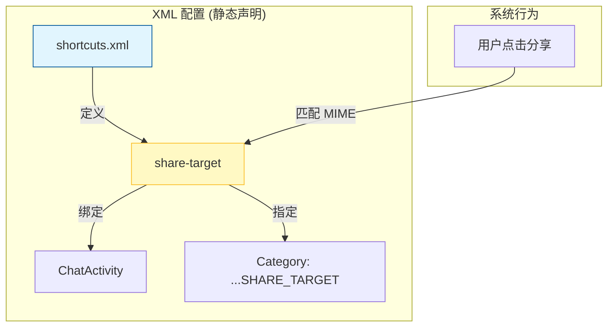
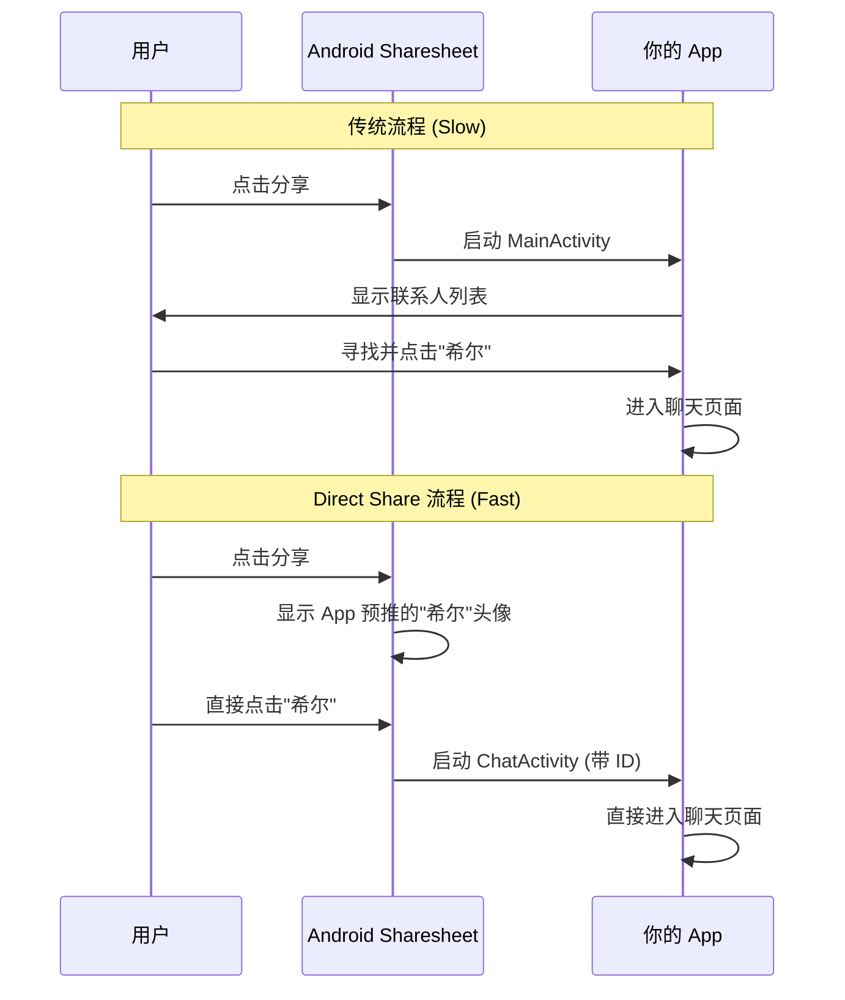
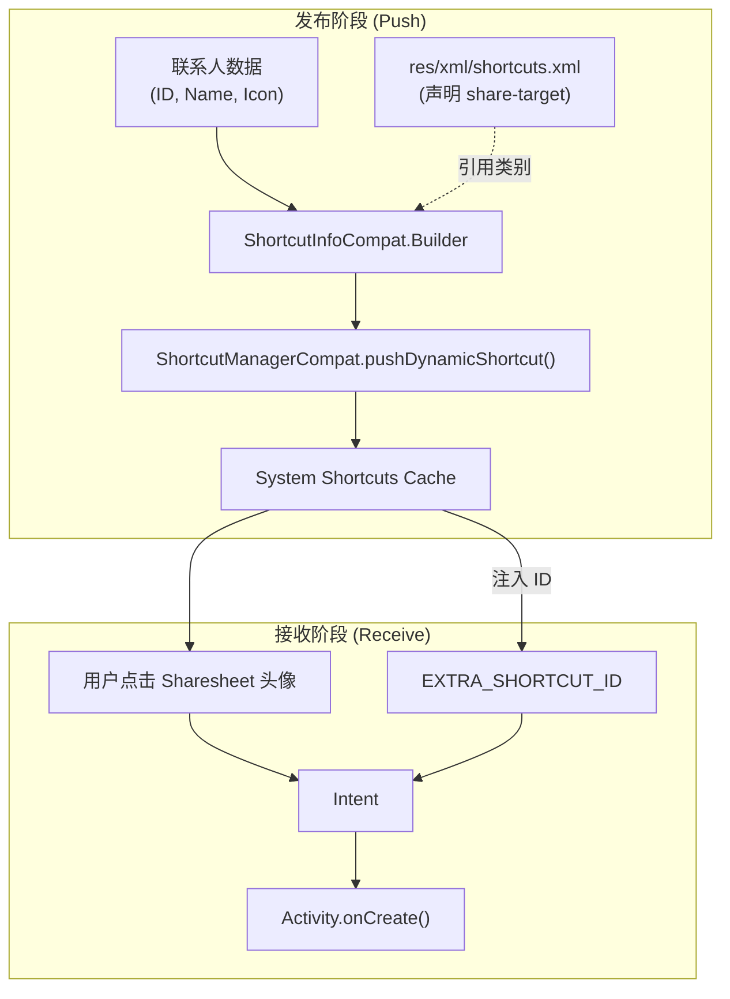

# 1.8.4 提供 Direct Share 目标

## 1.8.4 直达内心的捷径

午后的阳光把本栖湖晒得暖洋洋的，湖面上跳跃着无数细碎的金箔。栈桥的木板经过一整个夏天的暴晒，此刻散发着一种干燥而安心的松木香气。

洛芙盘腿坐在栈桥尽头，脚踝边放着半个浸在湖水里的冰镇西瓜。她举着手机，眉头紧锁，手指在屏幕上焦躁地划来划去。

“怎么了？”伊莎坐在她身后的露营椅上，手里捧着一杯依然冒着凉气的麦茶，声音像湖水一样平静。

“即便拍到了完美的画面……”洛芙叹了口气，把手机屏幕转向伊莎。屏幕上定格着一只刚刚停在芦苇尖上的红蜻蜓，翅膀的纹理清晰可见，“想发给希尔看，可是按下分享按钮后，我要在一堆乱七八糟的 App图标里找聊天软件，点进去，再从几百个联系人里搜‘希尔’……等我发出去，蜻蜓早就飞到湖对岸去了。”

伊莎微微倾身，看着洛芙繁琐的操作路径。“不仅是蜻蜓飞走了，分享的那种‘冲动’也飞走了，是吗？”

“对！就是这种感觉！”洛芙抓起一片西瓜狠狠咬了一口，“为什么不能像魔法一样，点一下分享，希尔的头像就直接跳出来，让我‘咻’地一下把照片扔给她？”

“可以的哦。”

栈桥另一头传来书页翻动的声音。黛琳合上手里的《系统架构之美》，推了推眼镜。逆光中，她的轮廓显得格外柔和，但语气依然是不容置疑的精准。“那叫做 **Direct Share**，让目标主动出现在你手边。”

### 直达捷径的入场券

黛琳赤脚踩在温热的木板上，走了过来。她没有直接讲代码，而是指着那半个漂在水里的西瓜。

“想象一下，洛芙。如果这个西瓜是你要分享的数据。现在的做法是，你得先找到‘切瓜刀具箱’（App），打开它，选一把刀，再决定分给谁。”黛琳蹲下身，用手指在水面上划出一道直线，“Direct Share 的逻辑是——希尔、我、伊莎，我们早就拿着盘子站在旁边了。你只要把西瓜递过来就行。”

“听起来很棒，但系统怎么知道你们站在哪里？”洛芙问。

“我们需要先发一张‘入场券’。”黛琳打开随身携带的平板，调出一份 XML 文件，“首先，你得告诉 Android 系统：你的 App 有能力处理某种类型的分享，并且允许把特定的联系人提升到 VIP席位（Sharesheet 顶部）。”

“这叫做 **Sharing Shortcuts** 的声明。”

洛芙凑过去，看着屏幕上的代码。

```xml
<!-- res/xml/shortcuts.xml -->
<?xml version="1.0" encoding="utf-8"?>
<shortcuts xmlns:android="http://schemas.android.com/apk/res/android">
    <!-- 
      声明一个 share-target（分享目标）。
      这就像是在 Android 系统里注册了一个“传送门”。
    -->
    <share-target android:targetClass="com.example.camp.ui.ChatActivity">
        
        <!-- 定义这扇门能通过什么样的数据（西瓜？还是照片？） -->
        <data android:mimeType="text/plain" />
        <data android:mimeType="image/*" />
        
        <!-- 
          设置暗号（Category）。
          只有对得上这个暗号的动态捷径，才能走这扇门。
        -->
        <category android:name="com.example.camp.category.SHARE_TARGET" />
    </share-target>
</shortcuts>
```

“看图 1 的结构，”黛琳手指在屏幕上虚画了一个框，“`targetClass` 就是当用户点击头像时，系统要启动的那个 Activity。通常是你的聊天页面。”



“这个 `category`……”洛芙指着那行代码，“是必须要写的吗？”

“必须。”伊莎插话道，她把麦茶递给黛琳，“这就像是露营地的‘预约暗号’。只有手里拿着写有 `com.example.camp.category.SHARE_TARGET` 暗号入场券的人（Shortcut），系统才会放行进入这个分享通道。”

洛芙点了点头：“懂了。XML 是搭好了门，Activity 是门后的房间，Category 是门锁。”

### 制作一个个鲜活的人

“门搭好了，现在我们需要把人‘推’进去。”

远处湖面上传来哗啦一声水响，希尔像一条银色的鱼一样钻出水面。她抹了一把脸上的水，在那件宽大的速干T恤上擦了擦手，大步走上栈桥。“呼——水温刚好！你们在聊 Direct Share？”

她一屁股坐在洛芙旁边，湿漉漉的头发甩出几滴水珠，落在洛芙的手背上，凉丝丝的。“别光听黛琳讲理论。不管是希尔还是伊莎，在代码里都只是一个 **Object**。你要把我们包装成 `ShortcutInfo` 推送给系统。”

希尔从口袋里（天知道她游泳时为什么还带着防水袋）掏出手机，熟练地敲击着屏幕。

“注意看，这是重点。Android 10 以后，我们不再是被动等待系统来查询（那是老旧的 `ChooserTargetService`，慢得像蜗牛），而是**主动推送**（Push）。这叫 `Dynamic Shortcuts`。”

```kotlin
// 代码位置：ContactRepository.kt 或相关 ViewModel

/**
 * 将联系人发布为 Direct Share 的捷径
 * 建议在确保联系人数据加载完毕，或者用户刚和某人互动过之后调用
 */
fun pushDynamicShortcut(context: Context, contact: Contact) {
    // 1. 准备头像。系统喜欢圆形的、带有人脸特征的图标
    val icon = IconCompat.createWithBitmap(contact.avatarBitmap)

    // 2. 构建“人”的格调 (Person 对象)
    // 这是 Android 9+ 的要求，为了让系统知道这不仅仅是个按钮，而是一个人类
    val person = Person.Builder()
        .setName(contact.name)
        .setKey(contact.id) // 唯一标识，很重要！
        .setIcon(icon)
        .build()

    // 3. 构建“捷径” (ShortcutInfo)
    val shortcut = ShortcutInfoCompat.Builder(context, contact.id)
        .setShortLabel(contact.name)    // 在图标下显示的简短名字
        .setLongLabel("发送给 ${contact.name}") // 长按可能显示的详细名字
        .setIcon(icon)
        .setPerson(person) // 把灵魂注入捷径
        
        // 关键点！必须包含我们在 XML 里定义的 Category
        .setCategories(setOf("com.example.camp.category.SHARE_TARGET"))
        
        // 点击头像后，系统要发射的 Intent
        .setIntent(
            Intent(context, ChatActivity::class.java).apply {
                action = Intent.ACTION_VIEW
                putExtra("contact_id", contact.id) // 告诉 Activity 打开谁的会话
            }
        )
        
        // 极其重要：设置为长效捷径。
        // 这样即使 App 被杀后台，这个头像也能在 Sharesheet 存活很久。
        .setLongLived(true) 
        .build()

    // 4. 推送到系统
    // 就像把名片硬塞进系统的口袋里
    ShortcutManagerCompat.pushDynamicShortcut(context, shortcut)
}
```

洛芙盯着直到看完最后一行，眉头才舒展开。“`setLongLived(true)`……长生不老？”

“差不多。”希尔咬了一口西瓜，含糊不清地说，“系统缓存也是有脾气的。如果不设为 LongLived，可能你刚发完照片，过半小时再想发，我的头像就不见了。设了它，系统就会把你常用的联系人缓存起来，就算你重启过手机，我有很大几率还在。”

“还有那个 `setPerson`。”伊莎的声音轻柔地补充，“这不仅是为了显示。现在的 Android 系统很聪明，它会分析你和这个 `Person` 的亲密度。如果你经常给希尔发消息，系统就会自动把她的排名往前提。这是一个**以此人为中心**的设计。”

### 终点：处理那份心意

“好，现在假设我已经按下了那个写着‘希尔’名字的按钮。”洛芙指着虚空中的一点，“那一瞬间发生了什么？”

“那一瞬间，”黛琳接过话茬，她在白板（不知何时她又把便携白板立在栈桥栏杆旁了）上画了一条飞跃的弧线，“系统捕获了你的点击，封装了一个 `Intent`，直接投递到了你在 XML 里注册的 `ChatActivity`。”

“区别在于，”她用马克笔重重地点了一下，“这个 Intent 里多了一把钥匙。”

```kotlin
// 代码位置：ChatActivity.kt

override fun onCreate(savedInstanceState: Bundle?) {
    super.onCreate(savedInstanceState)
    setContentView(R.layout.activity_chat)

    // 检查 Intent 里是否藏着捷径 ID
    // ShortcutManagerCompat.EXTRA_SHORTCUT_ID 指向我们在 Builder 里设置的 id
    val shortcutId = intent.getStringExtra(ShortcutManagerCompat.EXTRA_SHORTCUT_ID)

    if (shortcutId != null) {
        // Case A: 用户是从 Direct Share 点击头像进来的
        Log.d("Camp", "直达目标！联系人ID: $shortcutId")
        
        // 立即加载与该联系人的聊天记录，不要有任何中间页面
        viewModel.loadChat(shortcutId)
        
        // 处理同时传过来的分享内容（图片、文字等）
        handleSharedContent(intent)
        
    } else {
        // Case B: 用户是从桌面图标点进来的，或者普通分享进来没选人
        // 显示联系人列表让用户选
    }
}
```

“看图 2 的时序，”黛琳指着图表，“Direct Share 省略了最耗时的‘在 App 内选人’（Selection UI）这一步。”



### 陷阱：被遗忘的更新

“但是，这里有个坑。”希尔把吃完的瓜皮精准地抛进远处的垃圾桶（虽然差点砸到边沿），拍了拍手。

“什么坑？”

“如果我改名了呢？或者我换头像了？”希尔指了指自己的脸，“又或者，你其实已经把伊莎拉黑了（伊莎微笑着眯起眼），但 Sharesheet 顶端还显示着她，甚至排在第一个，这不是很尴尬吗？”

洛芙想象了一下那个画面：明明已经绝交的朋友，每次分享时还笑嘻嘻地挂在最显眼的位置。“呃，那是恐怖故事。”

“所以，**更新**至关重要。”黛琳总结道，“每当联系人数据发生变化，或者用户删除了好友，你必须立即调用 `removeDynamicShortcuts` 或 `updateShortcuts`。不要让过期的捷径成为幽灵。”

```kotlin
// 这种事情要勤快做
ShortcutManagerCompat.removeDynamicShortcuts(context, listOf(blockedUserId))
```

### 尾声

太阳开始偏西，湖面上的碎金变成了沉静的橘红色。微风拂过，芦苇丛发出沙沙的响声，像是无数行代码在低语。

洛芙看着手机。按照她们教的方法，她刚刚成功配置了 Direct Share。再次点击分享那张蜻蜓照片时，Sharesheet 弹起，第一排第一个，正是希尔那张笑得灿烂的头像。

没有任何犹豫，她点击了那个头像。

没有搜索，没有等待，没有多余的确认弹窗。屏幕直接切入到了与希尔的对话框，照片已经静静地躺在那里的发送队列中。

“感觉怎么样？”伊莎问，她正在收拾茶具，瓷器碰撞发出清脆的声音。

洛芙轻轻按下了发送键。“感觉……就像我刚刚只是稍微抬了下手，就把这一瞬间的秋天，递到了朋友手里。”

“所谓技术，”黛琳合上书，望着远处被夕阳染红的山峦，“最高级的形态，就是让‘距离’消失。”

---

### 技术总结

> **提供 Direct Share 目标 (Providing Direct Share Targets)** —— 利用 **Sharing Shortcuts API**，将应用内的特定目标（如联系人）直接“推送”到 Android 系统分享面板（Sharesheet）的顶部。这是一种通过预先发布动态捷径（Dynamic Shortcuts）来缩短用户操作路径的机制。

#### 今日关键词

1.  **Shortcuts XML**：静态配置文件，定义 `share-target`，充当应用与系统分享面板之间的协议接口。
2.  **Dynamic Shortcuts**：动态捷径。由 App 在运行时主动通过 `ShortcutManagerCompat` 推送给系统，用于通过 Google 的预测算法展示,按需发布，数量有限（通常每 Activity 4 个）。
3.  **Person API**：构建与 shortcuts 关联的人物模型，提供语义信息（如这是一个人，不仅仅是一个入口），提高系统排序的准确度。
4.  **LocusId**：轨迹 ID（高级特性），帮助系统关联 Content Capture 和 Shortcut，实现更智能的排序。
5.  **setLongLived(true)**：将捷径标记为长效，允许系统缓存并在 App 停止运行后依然保留在 Sharesheet 中。
1. **Direct Share**：直接分享给特定联系人的机制，出现在 Sharesheet 顶部。
2. **ShortcutManagerCompat**：管理捷径的核心兼容类。用于发布（push）、移除和更新捷径。
4. **Target Class**：在 `shortcuts.xml` 中定义的、负责接收 Direct Share Intent 的 Activity。
5. **EXTRA_SHORTCUT_ID**：系统在 Intent 中附加的额外信息，告诉 App 用户点击了哪个捷径 ID。

#### 结构图



> **左侧是发布**：App 主动把捷径推给系统。**右侧是接收**：用户点击后，系统把 Shortcut ID 塞进 Intent 发回给 App。

#### 反模式与陷阱

*   **🚫 陷阱 1：主线程 IO**
    *   **现象**：在 UI 线程（如 `onResume`）中直接构建 Bitmap 并推送 Shortcut，导致界面卡顿。
    *   **修正**：**始终**在后台线程（如 `Default` 或 `IO` Dispatcher）中处理图片加载和 Shortcut 推送。
*   **🚫 陷阱 2：滥用 `push`**
    *   **现象**：每次 App 启动都无脑 Push 所有好友。
    *   **修正**：仅在数据变化或用户发生互动（发送消息）时更新。系统会自动学习频率，不需要你每次都全量推。
*   **🚫 陷阱 3：MIME 类型不匹配**
    *   **现象**：XML 里只写了 `text/plain`，结果用户分享图片时，头像死活出不来。
    *   **修正**：确保 `shortcuts.xml` 中的 `<data>` 标签覆盖了你支持的所有 MIME 类型（支持通配符如 `image/*`）。

#### 设计哲学：推模式 (Push Model)

早期的 Android (6.0-9.0) 使用 `ChooserTargetService` 的"拉模式"（Pull）——Sharesheet 弹出时才去问 App "你有那些人？"，导致 Sharesheet 弹出极其缓慢。
现在的 Sharing Shortcuts 使用"推模式"（Push）——App 平时就把人推给系统缓存着。用的时候直接拿。
**预先计算，以空间换时间** —— 这是提升用户体验的经典策略。

---

### 🏕️ 动手练习

#### Task 1 · 搭建传送门 (XML Configuration)

**目标**：配置项目以支持 Direct Share 协议。

**你需要做的事**：
1.  在 `res/xml/` 目录下新建 `shortcuts.xml`。
2.  定义 `<share-target>`，将目录指向你的 `SharingActivity` 或 `MainActivity`。
3.  设置 Category 名称为 `com.example.camp.shortcut.SHARE`。
4.  在 `AndroidManifest.xml` 的主 Activity 标签内添加 `<meta-data android:name="android.app.shortcuts" android:resource="@xml/shortcuts" />`。

**验收标准**：
- [ ] 编译无报错。
- [ ] 此时运行 App 尚看不到效果，但基础设施已就绪。

#### Task 2 · 推送你的第一个好友 (Push Dynamic Shortcut)

**目标**：在代码中构建并推送一个捷径。

**你需要做的事**：
1.  在 App 启动或按钮点击事件中，开启一个协程。
2.  创建一个 `Person` 对象，命名为 "Luo Fu"。
3.  创建一个 `ShortcutInfoCompat`，ID 设为 "user_luofu"，关联上面的 Person，并添加 Task 1 中定义的 Category。
4.  调用 `ShortcutManagerCompat.pushDynamicShortcut()`。

**验收标准**：
- [ ] 随便找一张照片点击分享。
- [ ] 分享面板（Sharesheet）顶部出现 "Luo Fu" 的头像和名字。

#### Task 3 · 接住这颗球 (Handle Intent)

**目标**：正确处理点击捷径后的跳转逻辑。

**你需要做的事**：
1.  修改 `SharingActivity` 的 `onCreate`。
2.  判断 `intent.getStringExtra(ShortcutManagerCompat.EXTRA_SHORTCUT_ID)` 是否等于 "user_luofu"。
3.  如果是，弹出 Toast："Direct Share from Luo Fu!"。

**验收标准**：
- [ ] 点击头像 -> 显示 "直达..."
- [ ] 点击 App 图标 -> 显示 "普通分享"

---

#### Task 4 · 更新捷径频率 ★★★★

**目标**：模拟聊天频率影响排序。

**你需要做的事**：
1. 创建两个按钮 "给 A 发信" 和 "给 B 发信"。
2. 点击按钮时，重新 `push` 对应的捷径。
3. 观察 Sharesheet 中 A 和 B 的位置变化。

**验收标准**：
- [ ] 最近点击的人排在前面
- [ ] 排序是动态更新的

---

#### 面试热身

1. **Q1**：Direct Share 和普通分享的区别是什么？对用户体验有什么提升？
2. **Q2**：为什么 Android 10 废弃了 `ChooserTargetService` 改用 Sharing Shortcuts？（提示：推 vs 拉）
3. **Q3**：`setLongLived(true)` 的作用是什么？为什么对通讯类 App 很重要？
4. **Q4**：如果用户点击了 Direct Share 捷径，Activity 收到的 Intent 里会多出什么信息？
5. **Q5**：同一个联系人捷径，既可以用于 Direct Share，也可以用于 Launcher 长按菜单吗？（提示：是的，只要配置正确）

#### 参考实现要点

1. **XML 配置必须匹配**：代码里的 `category` 必须和 XML 里的完全一致，差一个字母都不行。
2. **Person 对象**：虽然是可选的，但加上 `setPerson()` 能让系统更好地理解这个捷径代表"人"，有助于系统层面的优化。
3. **Intent Action**：捷径里的 Intent Action 通常设为 `ACTION_VIEW` 或自定义 Action，以便和普通的 `ACTION_SEND` 区分开（虽然靠 ID 也可以区分）。

---

> 💡 即使是数字世界，也是讲究"关系"的。Direct Share 就是你和用户之间、用户和朋友之间那条被精心维护的红线。

---

### 🍭 洛芙的小小日记本

今天把希尔的头像“钉”在了我的分享面板上。
以前每次想分享好看的云彩给她，总要划好久屏幕，有时候划着划着，就把那朵云彩给忘了。
现在好了，看到美好的事物，点一下，她就在那里。
原来代码里写的 `setLongLived(true)`，翻译成人类的语言，就是“我想一直记得你”的意思呀。
