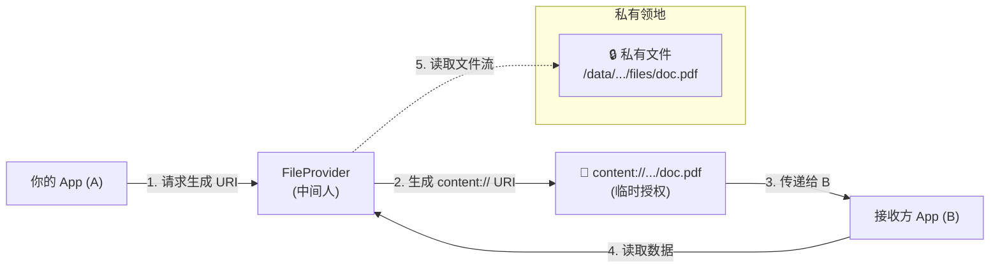
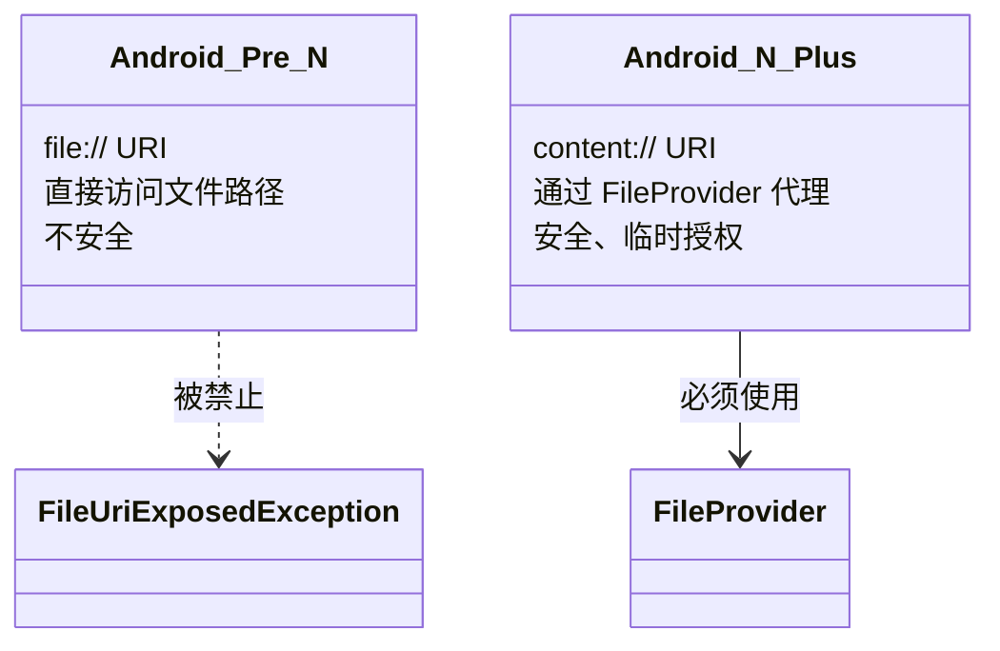

# 1.9.1 关于文件共享

## 1.9.1 这一次，不再是简单的信封

雨是从午后开始下的。起初只是落在帐篷顶上的几声闷响，很快就变成了连绵不绝的淅沥声。整个营地被笼罩在一片灰蓝色的雨雾中，远处的山峦像水墨画一样晕染开来。

四个女孩躲在最大的天幕帐篷下。雨水顺着天幕的边缘汇成细流，滴滴答答地落在排水沟里。篝火生不起来，只能点了一盏复古的煤油灯，温暖的黄光在湿润的空气里晕开一圈光晕。

洛芙手里捧着一杯热姜茶，看着外面的雨幕发呆。"前两天我们发的都是只有几行字的信，或者一张小小的照片。那如果……我想把整个行李箱寄出去呢？"

"行李箱？"伊莎正用毛巾擦着淋湿的头发，转过头来。

"我是说文件。"洛芙解释道。"比如一个 PDF 文档，一个数据库备份，或者一段很长的录音。它们实实在在地存在我的私有目录里。我想把它们给别的 App 用——比如让 PDF 阅读器打开我的文档。"

黛琳把手里的书合上，发出一声轻响。如果不算雨声，这大概是帐篷里最清晰的声音了。

"那你不能直接把行李箱扔过去。"她说。"因为你的帐篷（App 私有目录）是上了锁的。别的 App 进不来，你也扔不出去。"

### 为什么 file:// 是禁忌

"在 Android 7.0 之前，"希尔盘腿坐在防潮垫上，正在摆弄她的无人机模型，"我们确实是直接扔的。我们给别的 App 一个以 `file://` 开头的路径——比如 `file:///data/user/0/com.camp/files/map.pdf`。这就相当于把那个 App 的人叫到你的帐篷门口，把钥匙给他，说'你自己进去拿'。"

"听起来挺方便的啊。"洛芙说。

"听起来是。"黛琳的声音平静而严厉。"但这意味着你把私有目录的绝对路径暴露了。而且，接收方 App 可能没有权限读取那个文件——因为 Linux 文件系统的权限是隔离开的。导致的结果就是：崩溃，或者是安全漏洞。"

"所以 Android 7.0 之后，系统没收了这种'直接扔钥匙'的权利。"希尔做了一个"咔嚓"的手势。"如果你试图通过 Intent 传递 `file://` URI，App 会直接崩溃，抛出 `FileUriExposedException`。这一招叫'严防死守'。"

### content:// ：安全的通行证

"那我要怎么给？"洛芙问。

"不给钥匙，给通行证。"

黛琳从笔记本里调出一张图。

> 图 1：FileProvider 的代理机制。不再直接暴露文件路径，而是通过 content:// URI 提供受控访问。

"我们引入了一个中间人——`FileProvider`。"黛琳解释道。"它是 Android 系统的一个特殊组件，也是 `ContentProvider` 的子类。它的工作就是把你的私有文件，包装成一个安全的、临时的 `content://` URI。"

伊莎凑过来，看着那张图。"就像……如果你想让朋友看你的日记，你不会把日记本的钥匙给她，甚至不会让她进你的房间。你会把日记复印一页，盖上一个'仅限今天阅读'的章，然后通过门缝递给她。"

"不仅如此。"希尔补充道，"这个 `content://` URI 对接收方来说是透明的。他们不需要知道文件在你的哪个目录下，也不需关心你的文件系统权限。他们只看到一个可以读取的流。"

### 安全的代价与收益

洛芙喝了一口姜茶，暖意顺着喉咙流下去。"听起来变复杂了。我要多配置一个 Provider，还要生成 URI。"

"安全从来都不是免费的。"黛琳说。"但这是值得的。"

她伸出一根手指，在满是雾气的玻璃灯罩上划了一道线。

"第一，**封装性**。你既然是开发者，就该知道暴露绝对路径有多丑陋。"
"第二，**生命周期控制**。你授予的权限是临时的。当接收方的 Activity 关闭，或者直到重启设备，这个权限就会失效。钥匙会自动销毁。"
"第三，**通用性**。无论你的文件是在内部存储、外部存储还是缓存区，`FileProvider` 给出的 URI 格式都是统一的。"

雨声似乎小了一些。帐篷外的世界依旧是模糊的灰蓝色，但帐篷里却因为这盏灯而显得格外清晰。

"所以，"洛芙放下杯子，眼神变得坚定起来，"如果我想在这个雨天把一份地图分享给隔壁帐篷的人，我不能喊告诉他地图藏在我的枕头底下。我要通过 FileProvider 开具一张通行证。"

"正解。"希尔打了个响指。"准备好配置你的第一个通行证发行中心了吗？"

---

### 技术总结

> **关于文件共享 (About File Sharing)** —— 在 Android 7.0 (API 24) 及以上版本，严禁在应用间传递 `file://` URI（会触发 `FileUriExposedException`）。必须使用 **FileProvider** 生成 `content://` URI。FileProvider 提供了安全的、临时的文件访问授权，避免了暴露应用私有路径和权限问题。

#### 今日关键词

1. **FileUriExposedException**：当试图通过 Intent 分享 `file://` URI 时抛出的异常。是 Android 强制推行安全共享的手段。
2. **content:// URI**：内容 URI。指向一个通过 ContentProvider（如 FileProvider）管理的数据，而不是文件系统的绝对路径。
3. **FileProvider**：`ContentProvider` 的一个特殊子类，专门用于安全地共享应用私有文件。
4. **临时权限**：通过 `Intent.FLAG_GRANT_READ_URI_PERMISSION` 授予接收方对 content URI 的临时访问权。

#### 结构图

#### 设计哲学：从所有权到访问权

以前的共享是**转让所有权**（给你文件名，你随便搞）。
现在的共享是**授予访问权**（给你一个凭证，你可以读，但你不知道它在哪）。
这是现代操作系统沙箱机制的必然演进。

---

#### 🏕️ 动手练习

#### 🏕️ 动手练习

#### Task 1 · 制造一个崩溃 ★

**目标**：亲身体验 `FileUriExposedException`。

**你需要做的事**：
1. 创建一个 `Intent(Intent.ACTION_VIEW)`。
2. 使用 `Uri.fromFile(file)` 生成一个 `file://` URI。
3. 尝试启动这个 Activity。

**验收标准**：
- [ ] App 崩溃
- [ ] Logcat 中看到 `FileUriExposedException`

---

#### Task 2 · 版本差异观察 ★★

**目标**：观察不同 Android 版本的行为。

**你需要做的事**：
1. 修改 `targetSdkVersion` 为 23 (Android 6.0)。
2. 再次运行 Task 1 的代码。
3. 观察是否还会崩溃。

**验收标准**：
- [ ] 理解为什么旧版本不崩溃（StrictMode 策略差异）
- [ ] 恢复 `targetSdkVersion` 为最新

---

#### Task 3 · 绘制安全图谱 ★★

**目标**：在白板或纸上绘制文件共享流程。

**你需要做的事**：
1. 画出你的 App、接收方 App 和 FileProvider 的关系。
2. 标注出 "私有目录"、"虚拟路径" 和 "Content URI"。

**验收标准**：
- [ ] 图示清晰包含了三个角色
- [ ] 理解 URI 是如何映射到真实文件的

---

#### 面试热身

1. **Q1**：为什么 Android 7.0 之后不能用 `file://` URI 分享文件了？会发生什么？
2. **Q2**：FileProvider 的核心作用是什么？它是如何保护文件安全的？
3. **Q3**：`content://` URI 和 `file://` URI 在外观上有什么区别？（提示：前者包含 Authority，后者包含绝对路径）
4. **Q4**：如果你的 App 只需要支持 Android 6.0，还需要用 FileProvider 吗？（提示：为了兼容性和未来迁移，强烈建议使用）
5. **Q5**：FileProvider 是 ContentProvider 的子类吗？这对我们配置 Manifest 有什么启示？

---

> 💡 雨天是帐篷最封闭的时候，也是最需要安全感的时候。FileProvider 就是那个守在门口，只允许持票人通过的忠诚卫士。

---

### 🍭 洛芙的小小日记本

雨还在下。我知道了我的文件不能随便"扔"出去。虽然配置 FileProvider 听起来有点繁琐，但在这样一个雨夜，知道自己的小秘密都被好好地锁在帐篷里，只在需要的时候发一张通行证出去，这种感觉其实……挺安心的。这就是黛琳姐说的"秩序的美感"吧？
