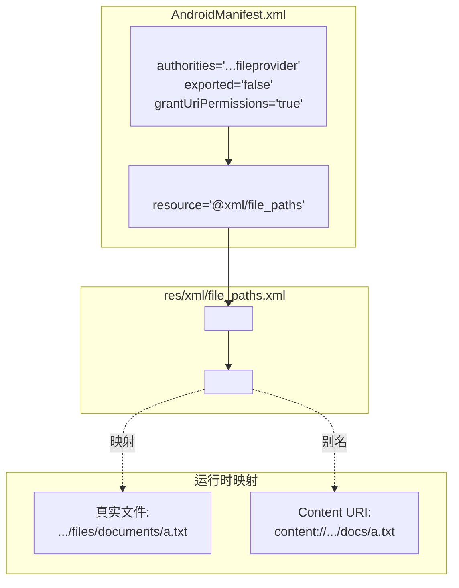

# 1.9.2 设置文件共享

## 1.9.2 哨塔与通行证名录

煤油灯的光有些摇曳，因为偶尔会有风从天幕的缝隙里钻进来。黛琳把灯芯稍微调大了一些，金色的光圈立刻稳定下来。

"建立一个安全的哨塔——也就是 FileProvider，需要两个步骤。"她从防水袋里拿出一张新的白纸，铺在防潮垫上。"第一步，去 Manifest 注册这个哨塔的存在；第二步，给它一份可以放行的区域地图。"

### Step 1: 在 Manifest 中注册卫兵

"我们在 `AndroidManifest.xml` 里声明一个 `<provider>`。"希尔把键盘推给洛芙。"这个卫兵的名字是固定的——`androidx.core.content.FileProvider`。但他的代号（Authority）必须是你独有的。"

```xml
<!-- AndroidManifest.xml -->
<application>
    ...
    <!-- 声明 FileProvider -->
    <provider
        android:name="androidx.core.content.FileProvider"
        android:authorities="com.example.camp.fileprovider"
        android:exported="false"
        android:grantUriPermissions="true">
        
        <!-- 关联可共享路径的配置 -->
        <meta-data
            android:name="android.support.FILE_PROVIDER_PATHS"
            android:resource="@xml/file_paths" />
    </provider>
</application>
```

洛芙一边敲代码，一边听着黛琳的解说。

"注意看 `android:authorities`。"黛琳的手指停在屏幕上。"通常我们用 `包名.fileprovider`。这就是你在整个 Android 系统的**唯一识别码**。如果两个 App 用了相同的 Authority，后面安装的那个会安装失败。"

"还有 `android:exported="false"`。"伊莎凑近看了看，"这是不是说，这个卫兵不对外开放？"

"没错。"希尔打了个响指。"这正是 FileProvider 安全的地方。它**不是**一个公共澡堂，谁都能进来。它是私有的，只有持有我们将要发放的临时通行证（URI）的人，才能被它放行。所以必须是 `false`。"

"那 `grantUriPermissions="true"` 呢？"洛芙问。

"那是允许临时授权的关键。只有设为 `true`，你在 Intent 里加的那个 Flag (`FLAG_GRANT_READ_URI_PERMISSION`) 才会生效。"

### Step 2: 绘制通行地图 (file_paths.xml)

"注册完卫兵，但他现在很懵。"黛琳笑了笑，虽然笑容很淡。"因为你还没告诉他：你帐篷里的哪些区域是可以让外人进的？是客厅？还是卧室？还是只有门口的脚垫？"

"我们需要在 `res/xml/` 目录下建一个新文件——通常叫 `file_paths.xml`。"

```xml
<!-- res/xml/file_paths.xml -->
<paths xmlns:android="http://schemas.android.com/apk/res/android">
    
    <!-- 1. 内部存储空间 (files/) -->
    <!-- 对应 Context.getFilesDir() -->
    <!-- path="." 表示整个 files/ 目录 -->
    <!-- name="my_docs" 是 URI 里的别名 -->
    <files-path name="my_docs" path="." />

    <!-- 2. 内部缓存空间 (cache/) -->
    <!-- 对应 Context.getCacheDir() -->
    <cache-path name="my_cache" path="images/" />

    <!-- 3. 外部私有空间 (external files) -->
    <!-- 对应 Context.getExternalFilesDir() -->
    <external-files-path name="my_external" path="export/" />

</paths>
```

洛芙看着这些标签，觉得像是某种神秘的符咒。

"这一步叫 **指定共享目录**。"希尔解释道。"如果不在这里声明，FileProvider 就会拒绝生成任何 URI。比如你试图分享一个在 `files/secret/` 下的文件，但你在 xml 里只开放了 `files/images/`，那么——崩！`IllegalArgumentException`。"

"那 `name` 属性是干嘛的？"洛芙指着 `name="my_docs"`。

"那是为了**隐藏真实路径**。"伊莎的声音听起来像是在念诗。"真实路径是 `/data/user/0/com.camp/files/report.pdf`，太直白了，像是不穿衣服出门。用了这个配置后，生成的 URI 会变成：`content://com.example.camp.fileprovider/my_docs/report.pdf`。"

"看！"黛琳指着那个 URI。"外人只看到 `my_docs` 这个假名。他们不知道你的文件系统结构。这就是安全感。"

### 路径映射关系表

为了让洛芙更明白，希尔画了一张对照表。

| XML 标签 | 对应的真实目录 (Java/Kotlin) | 示例真实路径 |
| :--- | :--- | :--- |
| `<files-path>` | `context.filesDir` | `/data/.../files/` |
| `<cache-path>` | `context.cacheDir` | `/data/.../cache/` |
| `<external-path>` | `Environment.getExternalStorageDirectory()` | `/storage/emulated/0/` |
| `<external-files-path>` | `context.getExternalFilesDir(null)` | `/storage/.../Android/data/.../files/` |
| `<external-cache-path>` | `context.getExternalCacheDir()` | `/storage/.../Android/data/.../cache/` |

"最常用的是前两个。"黛琳总结道。"记住，**最小权限原则**。如果你只想分享图片，就在 `path` 里写 `images/`，别写 `.`（代表根目录）。只开放你需要开放的那一小块区域。"

### 严丝合缝的闭环

雨还在下，落在帐篷上的声音变得有节奏起来，像某种古老的鼓点。

洛芙看着屏幕上的两段配置——一段在 Manifest，一段在 XML。它们像两块拼图，严丝合缝地扣在一起。

"Manifest 是大门，XML 是房间地图。"她自言自语道。"只有在大门登记过的卫兵，拿着合法的房间地图，才能把我的文件安全地送出去。"

"而且，"希尔补充道，"一旦你改了 authorities 字符串，记得代码里生成 URI 的地方也要改。它们是**强绑定**的。如果 Manifest 里是 `.fileprovider`，代码里写成了 `.provider`，那一瞬间就会崩溃。"

"精确。"黛琳点头称赞。"就像魔法阵的每一个符号都不能错。错一个，魔法不仅失效，还会反噬（Crash）。"

洛芙缩了缩脖子。"听起来好危险。"

"这就是程序员的浪漫啊！"希尔大笑起来，声音在雨夜里格外响亮。"在悬崖边跳舞，但只要步步精准，我们就永远不会掉下去！"

---

### 技术总结

> **设置文件共享 (Setting up file sharing)** —— 配置 FileProvider 需要两步：(1) 在 `AndroidManifest.xml` 中注册 `<provider>`，设置 `authorities` 和 `exported="false"`，并关联 `<meta-data>`；(2) 创建 `res/xml/file_paths.xml`，使用 `<files-path>`、`<cache-path>` 等标签指定允许共享的**子目录**。这构建了一个从"虚拟路径"到"真实文件系统路径"的安全映射。

#### 今日关键词

1. **android:authorities**：Provider 的唯一标识。通常为 `applicationId + ".fileprovider"`。
2. **file_paths.xml**：定义可共享目录的 XML 配置文件。
3. **<files-path>**：映射内部存储 `files/` 目录。
4. **path 属性**：指定要共享的子目录。`path="."` 表示整个目录。
5. **name 属性**：URI 路径中的别名（虚拟目录名），用于隐藏真实路径。

#### 结构图



#### 反模式与陷阱

1. **Authority 冲突**：直接复制粘贴代码，使用了硬编码的 `com.example.fileprovider`。导致无法安装（如果设备上已有另一个 App 用了这个 Authority）。
   * **修复**：使用 `${applicationId}.fileprovider` 或确保包名唯一。
   
2. **exported="true"**：FileProvider 不应公开。会导致安全漏洞。
   * **修复**：必须设为 `false`，配合 `grantUriPermissions="true"` 使用。
   
3. **XML 路径配置错误**：试图分享一个不在 XML 定义范围内的文件。
   * **后果**：生成 URI 时抛出 `IllegalArgumentException: Failed to find configured root`。
   
4. **path 写死为绝对路径**：XML 不支持绝对路径。只能是相对路径。

---

#### 🏕️ 动手练习

#### Task 1 · 注册 FileProvider ★

**目标**：在 Manifest 中添加 `<provider>` 标签。

**你需要做的事**：
1. 打开 `AndroidManifest.xml`。
2. 复制粘贴 `<provider>` 模板。
3. 修改 authorities 为你的包名后缀。
4. 添加 meta-data 引用。

**验收标准**：
- [ ] 编译无报错
- [ ] exported="false"
- [ ] grantUriPermissions="true"

---

#### Task 2 · 配置 file_paths.xml ★★

**目标**：创建一个只允许分享 `images/` 目录的配置。

**你需要做的事**：
1. 新建 `res/xml/file_paths.xml`。
2. 添加 `<files-path>`。
3. 设置 `path="images/"`，`name="my_imgs"`。

**验收标准**：
- [ ] 文件位置正确
- [ ] 仅开放了 images 目录，未开放根目录

---

#### Task 3 · 验证 Authority 唯一性 ★★★

**目标**：确保你的 Authority 不会和别人冲突。

**你需要做的事**：
1. 检查 `build.gradle` 中的 `applicationId`。
2. 确认 Manifest 里的 authorities 字符串包含了这个 ID。
3. (可选) 尝试安装两个 authorities 相同的 App，观察错误。

**验收标准**：
- [ ] Authority 是唯一的

---

#### Task 4 · 尝试越界访问 (Crash Test) ★★★★

**目标**：理解为什么必须配置 path。

**你需要做的事**：
1. 在 XML 里只配置 `images/`。
2. 在代码里尝试分享一个 `files/documents/` 下的文件。
3. 运行，观察崩溃日志。

**验收标准**：
- [ ] 捕获到 `IllegalArgumentException`
- [ ] 理解错误原因

---

#### 面试热身

1. **Q1**：在 `file_paths.xml` 中，`path` 和 `name` 属性分别代表什么含义？
2. **Q2**：如果我想分享 SD 卡上的文件，应该用哪个 XML 标签？
3. **Q3**：为什么 FileProvider 的 `exported` 属性必须是 `false`？如果设为 `true` 会怎样？
4. **Q4**：`meta-data` 在这里起到了什么作用？
5. **Q5**：如果我的 App 有两个 FileProvider，会有问题吗？（提示：只要 Authority 不同就没问题，但通常不需要）

---

> 💡 即使是虚拟的哨塔，也需要最严谨的建造图纸。每一个字符，都是安全基石的一部分。

---

### 🍭 洛芙的小小日记本

今天学会了搭建哨塔。我在 Manifest 里写下了那一串 XML，感觉像是在给我的 App 签署一份安保协议。希尔说得对，在代码的悬崖上跳舞，我们需要绝对的精准。这种"只有在这个列表里的路径才能通行"的严苛规则，在雨夜里反而让人觉得无比可靠。
