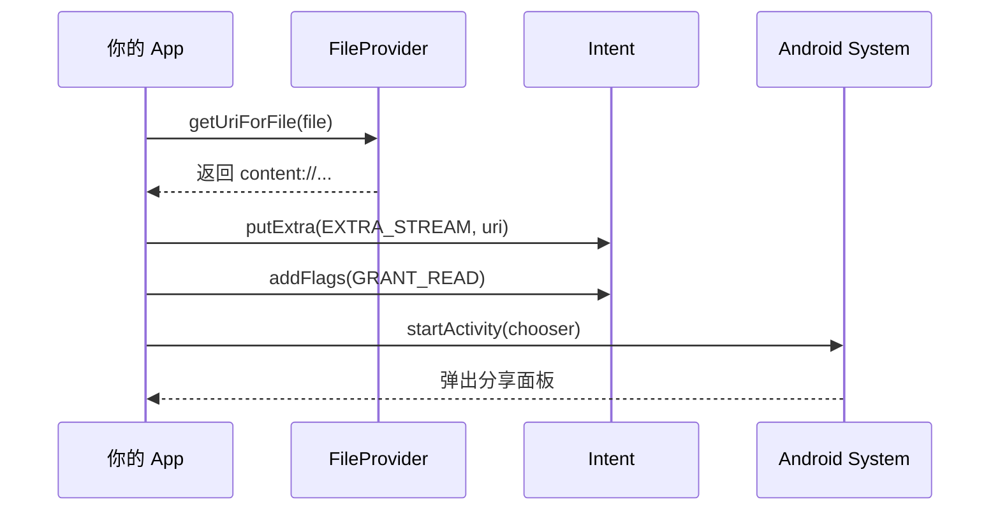

# 1.9.3 共享文件

## 1.9.3 发放通行证的仪式

雨终于停了。空气里弥漫着湿润泥土和青草的味道。虽然篝火已经被浇灭，但煤油灯的光依然温暖而坚定。

黛琳把笔记本转过来，屏幕上是一个新建的 Kotlin 文件。"哨塔建好了，地图画好了。现在，我们要开始发放真正的通行证了。"

她指着屏幕上的三个步骤，语气像是在传授某种古老的咒语：
1. **获取文件**：找到那个藏在私有目录里的宝藏。
2. **生成 URI**：让 FileProvider 给它盖章。
3. **授权与分发**：把盖了章的 URI 交给别人。

### Step 1: 找到那个文件

"首先，你要确定你要分享什么。"希尔从背包里拿出一个密封的防水袋，里面装着一张手绘地图。"假设这个文件叫 `map.png`，它静静地躺在你的 `files/images/` 目录下。"

```kotlin
// 1. 获取私有目录下的文件对象
val imagePath = File(context.filesDir, "images")
val newFile = File(imagePath, "map.png")
```

"这一步很简单。"洛芙点头。"就是找到那个文件对象。"

### Step 2: 盖章生成 URI

"接下来是最关键的一步。"黛琳的声音变得郑重起来。"不要直接把 `newFile` 给别人。我们要用 FileProvider 把它转换成一个 `content://` URI。"

```kotlin
// 2. 使用 FileProvider 生成 content URI
// authority 必须与 AndroidManifest.xml 中声明的一致
val contentUri: Uri = FileProvider.getUriForFile(
    context,
    "com.example.camp.fileprovider",  // Authority
    newFile                           // 文件对象
)
```

"这一行代码执行后，"伊莎指着屏幕，"系统会去查阅你在 `file_paths.xml` 里的配置。如果 `newFile` 所在的路径在白名单里，它就会生成一张通行证，比如：`content://com.example.camp.fileprovider/my_imgs/map.png`。"

"如果不在白名单里呢？"洛芙问。
"卫兵会当场把你拦下——抛出 `IllegalArgumentException`。"

### Step 3: 该谁看了？

"拿到了通行证，你得决定给谁看。"希尔把手里的防水袋递给洛芙。"你可以指定给某一个特定的 App，也可以像撒传单一样发给所有人。"

#### 方式 A：通过 Intent 发送给特定 App

"如果你知道对方是谁（比如系统相机，或者 PDF 阅读器），就创建一个 Intent。"

```kotlin
val intent = Intent(Intent.ACTION_SEND)
intent.type = "image/png"
intent.putExtra(Intent.EXTRA_STREAM, contentUri)

// 关键！授予临时读取权限
intent.addFlags(Intent.FLAG_GRANT_READ_URI_PERMISSION)
```

洛芙盯着最后一行代码。"这一行……就是那个'临时授权'？"

"对。"黛琳点头。"没有这一行，对方拿着 URI 去敲门，FileProvider 也会冷冷地拒绝：'抱歉，你虽然知道地址，但没有被授权访问。'"

#### 方式 B：生成 ClipData (针对 Android 10+)

"如果是在 Android 10 或者更复杂的场景下，"希尔补充道，"更好的做法是用 `ClipData`。它能更稳健地携带权限。"

```kotlin
intent.clipData = ClipData.newRawUri("A shared file", contentUri)
intent.addFlags(Intent.FLAG_GRANT_READ_URI_PERMISSION | Intent.FLAG_GRANT_WRITE_URI_PERMISSION)
```

### 接收方的视角

"当接收方收到这个 Intent 时，"伊莎闭上眼睛描述道，"他们拿到的是一个 URI。他们不需要知道这个文件到底在你的手机的哪个角落。他们只需要调用 `contentResolver.openInputStream(uri)`，数据就会源源不断地流出来。"

"就像……"洛芙看着手里的煤油灯，"我把光分享出去了，但没人能拿走我的灯。"

"非常精准。"黛琳赞许地点头。"通过 `FileProvider`，你分享的是**内容 (Content)**，而不是**容器 (File System)**。"

### 完整的发送代码

为了让洛芙彻底明白，希尔快速敲出了一段完整的代码。

```kotlin
fun shareFile(context: Context) {
    try {
        // 1. 准备文件
        val file = File(context.filesDir, "images/map.png")
        if (!file.exists()) {
            Toast.makeText(context, "文件不存在！", Toast.LENGTH_SHORT).show()
            return
        }

        // 2. 生成 URI
        val uri = FileProvider.getUriForFile(
            context,
            "${context.packageName}.fileprovider", // 使用包名动态获取
            file
        )

        // 3. 构造 Intent
        val intent = Intent(Intent.ACTION_SEND).apply {
            type = "image/png"
            putExtra(Intent.EXTRA_STREAM, uri)
            addFlags(Intent.FLAG_GRANT_READ_URI_PERMISSION)
        }

        // 4. 启动 Sharesheet
        context.startActivity(Intent.createChooser(intent, "分享地图给..."))

    } catch (e: IllegalArgumentException) {
        Log.e("Share", "FileProvider 配置错误", e)
    }
}
```

"记住这个模板。"希尔说。"以后无论你需要分享什么——日志、图片、崩溃报告——只需要改改文件名和 MIME 类型，这段代码就能通用。"

夜深了，雨后的空气格外清新。帐篷外的虫鸣声此起彼伏，像是为这节课奏响的散场曲。洛芙把那段代码保存下来，就像小心翼翼地收藏起一张珍贵的藏宝图。

---

### 技术总结

> **共享文件 (Sharing a file)** —— 通过 `FileProvider.getUriForFile()` 将 `File` 对象转换为 `content://` URI，然后将其放入 Intent 中（通常作为 `EXTRA_STREAM`）。必须为 Intent 添加 `FLAG_GRANT_READ_URI_PERMISSION` 标志，以便接收方 App 获得临时访问权限。

#### 今日关键词

1. **FileProvider.getUriForFile()**：核心静态方法，用于生成安全的 Content URI。
2. **Intent.FLAG_GRANT_READ_URI_PERMISSION**：必须添加的 Flag，否则接收方无法读取文件。
3. **Intent.ACTION_SEND**：最常用的分享 Action。
4. **Intent.createChooser()**：创建一个选择器，让用户选择接收 App。

#### 结构图



#### 反模式与陷阱

1. **忘记 addFlags**：这是新手最常犯的错误。生成了 URI 但没给权限，接收方打开失败。
   * **修复**：始终检查 `intent.addFlags(Intent.FLAG_GRANT_READ_URI_PERMISSION)`。
   
2. **Authority 写死**：在 Manifest 里用了包名，代码里却硬编码了字符串。一旦包名改了就崩溃。
   * **修复**：使用 `BuildConfig.APPLICATION_ID + ".fileprovider"` 或 `context.packageName + ".fileprovider"`。
   
3. **文件不存在**：试图分享一个还没写完或不存在的文件。
   * **修复**：在分享前检查 `file.exists()`。

---

#### 🏕️ 动手练习

#### Task 1 · 编写 ShareHelper 工具类 ★

**目标**：封装分享逻辑。

**你需要做的事**：
1. 创建一个 `ShareHelper` 单例或对象。
2. 编写 `shareImage(context: Context, file: File)` 方法。
3. 在方法内部实现 URI 生成和 Intent 发送。

**验收标准**：
- [ ] 包含完整的 try-catch
- [ ] 动态获取 Authority

---

#### Task 2 · 触发一次分享体验 ★★

**目标**：验证完整流程。

**你需要做的事**：
1. 在 App 启动时写入一张图片到 `files/images/test.png`。
2. 在界面上放一个按钮 "分享图片"。
3. 点击按钮，调用 Task 1 的方法。
4. 在弹出的 Sharesheet 里选微信或 Telegram，看能否发送成功。

**验收标准**：
- [ ] 接收方 App 能收到并显示图片
- [ ] 没有崩溃

---

#### Task 3 · 故意犯错：去掉 Flag ★★★

**目标**：验证 Flag 的必要性。

**你需要做的事**：
1. 注释掉 `intent.addFlags(...)` 这一行。
2. 再次尝试分享。
3. 观察接收方 App 的表现（通常是一个空白图片或加载失败）。

**验收标准**：
- [ ] 确认分享失败
- [ ] 深刻理解权限的作用

---

#### 面试热身

1. **Q1**：`FileProvider.getUriForFile()` 的第二个参数 authority 起什么作用？一定要和 Manifest 里的一样吗？
2. **Q2**：如果不加 `FLAG_GRANT_READ_URI_PERMISSION`，接收方 App 能读取文件吗？为什么？
3. **Q3**：如何一次性分享多个文件？（提示：`ACTION_SEND_MULTIPLE` + `ArrayList<Uri>`）
4. **Q4**：`ClipData` 在文件分享中扮演什么角色？
5. **Q5**：生成的 `content://` URI 是永久有效的吗？什么时候失效？

---

> 💡 每一个 URI 都是一份信任的契约。你不仅是在传输数据，更是在传输那份"允许你查看"的承诺。

---

### 🍭 洛芙的小小日记本

今天把那个"地图"分享出去了！而且是分享给了真正的地图 App。看着另一个 App 打开了我私有目录里的图片，感觉真的像变魔术一样。黛琳说得对，权限控制不是为了限制我们，而是为了让我们能够**放心地**分享。只有明确了界限，才会有真正的自由。
