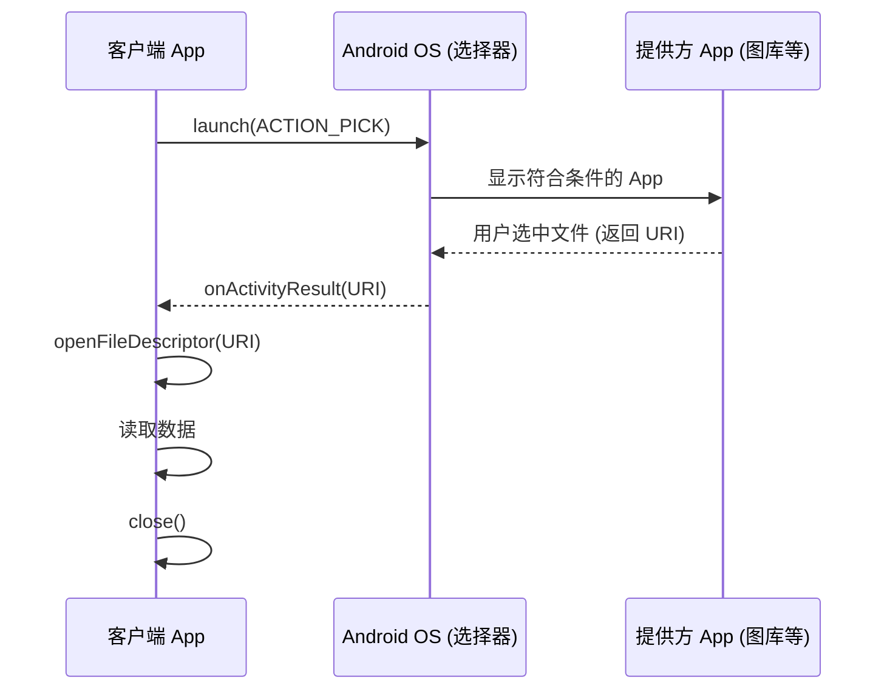

# 1.9.4 请求共享文件

## 1.9.4 向图书馆发起借阅申请

晨光微熹，露水还未干透。洛芙伸了个懒腰，走出帐篷。今天的任务角色反转了——前两天她忙着搭建哨塔、发放通行证，是一个"提供者"。今天，她要变成一个"请求者"。

"就像如果你想看书，不必非得自己印一本书。"伊莎坐在折叠椅上，手里捧着那本厚厚的《魔法药剂学》。"你可以去图书馆借。你只需要告诉图书管理员：'我想借一本关于草药的书'。"

"在 Android 世界里，"黛琳接过话头，她的声音和晨风一样清爽。"这叫做 **请求共享文件**。你的 App 不是文件的拥有者，而是去请求别的 App（比如图库、文件管理器）给你一个文件。"

### 发起请求：ACTION_PICK

"首先，你要大声说出你的需求。"希尔敲击着键盘，屏幕上出现了一个 Intent 构建过程。

```kotlin
// 1. 创建请求文件的 Intent
val requestFileIntent = Intent(Intent.ACTION_PICK).apply {
    type = "image/png"  // 我想要一张 PNG 图片
}
```

"这里用的是 `ACTION_PICK`。"黛琳解释道。"意思就是：'请帮我挑一个东西'。系统会弹出一个选择器，列出所有能提供 `image/png` 的 App（比如相册）。"

"也可以用 `ACTION_GET_CONTENT`，"希尔补充道，"它更像是一个通用的'获取内容'请求，通常会唤起系统的文件选择器。不管用哪个，核心逻辑是一样的：**把选择权交给用户**。"

### 现代化的等待：ActivityResultLauncher

"只要发出请求就行了吗？"洛芙问。

"不，你还得准备好接收结果。"伊莎合上书。"就像你在图书馆填了借阅单，得在柜台等着管理员把书递给你。"

"在旧的 Android 时代，我们用 `startActivityForResult`。"希尔做了一个鬼脸。"由于各种嵌套和回调地狱，那个方法已经被软废弃了。现在，我们用更优雅的 **Activity Result API**。"

```kotlin
class RequestFileActivity : AppCompatActivity() {

    // 1. 注册一个"结果接收器"
    // StartActivityForResult() 是一个预定义的协约
    private val requestFileLauncher = registerForActivityResult(
        ActivityResultContracts.StartActivityForResult()
    ) { result ->
        // 3. 这里是回调：当用户选好文件返回时执行
        if (result.resultCode == Activity.RESULT_OK) {
            // 获取返回的数据（Intent）
            result.data?.data?.let { returnUri ->
                // 拿到了！returnUri 就是那本书的借阅证
                Log.d("FileRequest", "获取到文件 URI: $returnUri")
                
                // 赶紧读取它
                readSharedFile(returnUri)
            }
        }
    }

    // 2. 在需要的时候发射请求
    fun requestFile() {
        val intent = Intent(Intent.ACTION_PICK).apply { type = "image/png" }
        requestFileLauncher.launch(intent)
    }
}
```

洛芙看着代码结构。"这比以前清晰多了！先注册接收器，再发射请求，最后在回调里处理。"

"没错。"黛琳点头。"接收器必须在 `onCreate` 或者 `onStart` 之前注册——也就是在界面还没完全展示出来之前，就要把柜台搭好。"

### 读取借来的书：FileDescriptor

"拿到了 URI，然后呢？"洛芙问。"我能直接把它当 `File` 对象用吗？"

"绝对不行！"希尔几乎是跳了起来。"千万别试图把 URI 转换成 File 路径。那个路径可能是虚拟的，甚至可能是加密的。你只能通过 `ContentResolver` 去读取它的**流**。"

"或者，如果你需要更底层的访问，"黛琳沉稳地说，"可以使用 `ParcelFileDescriptor`。它就像是一个文件句柄。"

```kotlin
fun readSharedFile(uri: Uri) {
    try {
        /*
         * openFileDescriptor() 返回一个 ParcelFileDescriptor
         * mode "r" 表示只读
         */
        val inputPFD: ParcelFileDescriptor? = 
            contentResolver.openFileDescriptor(uri, "r")

        inputPFD?.use { pfd ->
            // 获取标准的文件描述符
            val fd = pfd.fileDescriptor
            
            // 剩下的就是标准的 Java IO 操作了
            // 例如：用 BitmapFactory 解码图片
            val bitmap = BitmapFactory.decodeFileDescriptor(fd)
            imageView.setImageBitmap(bitmap)
        }
    } catch (e: FileNotFoundException) {
        e.printStackTrace()
        Log.e("FileRequest", "文件没找到！")
    }
}
```

"看，"伊莎指着 `use { ... }` 代码块。"借来的书是要还的。`use` 会自动帮你关闭文件描述符。如果你不关，就像借了书不还，图书馆的大门（文件句柄资源）总有一天会被你占满，然后——崩！应用崩溃。"

### 权限的有效期

"这个 URI 能用多久？"洛芙问。

"通常来说，只要结果 Intent 还活着，权限就有效。"黛琳解释道。"但为了安全，最好在获取到 URI 后**立即读取**你需要的数据。不要试图把这个 URI 存到数据库里留着下周用——到时候它可能只是一个过期的废纸。"

洛芙点了点头。晨光已经完全铺满了营地，草地上的露珠消失了，取而代之的是温暖的干燥气息。

"如果你真的想长期持有，"希尔补充道，"可以试试 `takePersistableUriPermission`，但这通常是针对文档树（Document Tree）的操作，那是另一个话题了。对于普通的 `ACTION_PICK`，**现拿现用**是最好的策略。"

洛芙看着手中的平板，想象着无数个 App 就像无数个小小的图书馆。它们通过 Intent 互相连接，通过 URI 互相借阅。没有围墙，只有规则。这种自由而有序的感觉，真的很好。

---

### 技术总结

> **请求共享文件 (Requesting a shared file)** —— 客户端 App 通过 `ACTION_PICK` 或 `ACTION_GET_CONTENT` 启动系统选择器，请求用户选择文件。使用 `Activity Result API` (`registerForActivityResult`) 接收返回的 URI。获取 URI 后，通过 `ContentResolver.openFileDescriptor(uri, "r")` 获取文件句柄进行读取。

#### 今日关键词

1. **ACTION_PICK**：请求用户从数据源中选择一个项目（如图片）。
2. **Activity Result API**：现代 Android 获取 Activity 返回结果的标准方式，替代 `startActivityForResult`。
3. **ParcelFileDescriptor**：文件描述符的包装类，用于底层文件访问。
4. **contentResolver.openFileDescriptor()**：通过 URI 获取文件描述符的核心方法。
5. **try-use-close**：文件操作必须确保流/描述符被关闭，否则导致资源泄漏。

#### 结构图



#### 反模式与陷阱

1. **URI 转 File 路径**：试图通过 `uri.getPath()` 获取真实路径并创建 `File` 对象。这是无效的，通常会失败或崩溃。必须使用 `ContentResolver`。
2. **忘记关闭 FD**：`ParcelFileDescriptor` 是稀缺资源。不关闭会导致 "Too many open files" 崩溃。
   * **修复**：使用 Kotlin 的 `.use {}` 自动关闭。
3. **在主线程读取**：大文件读取会阻塞 UI。
   * **修复**：务必在 `Dispatchers.IO` 中执行读取操作。

---

#### 🏕️ 动手练习

#### Task 1 · 搭建请求界面 ★

**目标**：创建一个按钮触发文件选择。

**你需要做的事**：
1. 在布局中放置一个 Button "选择图片" 和一个 ImageView。
2. 在 Activity 中绑定点击事件。
3. 注册 `ActivityResultLauncher`。

**验收标准**：
- [ ] 点击按钮能弹出系统的图片选择器

---

#### Task 2 · 读取并显示图片 ★★

**目标**：处理返回的 URI。

**你需要做的事**：
1. 在回调中获取 `result.data?.data` (URI)。
2. 使用 `contentResolver.openFileDescriptor()` 读取。
3. 将 Bitmap 显示在 ImageView 上。

**验收标准**：
- [ ] 选中的图片能正确显示在 App 里
- [ ] 使用了 `use {}` 自动关闭流

---

#### Task 3 · 异常处理 ★★★

**目标**：处理用户取消选择的情况。

**你需要做的事**：
1. 在回调中判断 `resultCode`。
2. 如果不是 `RESULT_OK`，Toast 提示 "用户取消选择"。
3. 尝试选择一个损坏的文件（如果有条件模拟），捕获 `FileNotFoundException`。

**验收标准**：
- [ ] 取消选择时 App 不崩溃且有提示

---

#### 面试热身

1. **Q1**：为什么现在推荐用 Activity Result API 而不是 `startActivityForResult`？（提示：解耦、类型安全）
2. **Q2**：拿到 URI 后，为什么不能直接用 `new File(uri.path)`？
3. **Q3**：`ParcelFileDescriptor` 和 `InputStream` 有什么区别？什么时候用哪个？（提示：FD 更底层，适合传给 Native 层或 BitmapFactory）
4. **Q4**：`openFileDescriptor` 的 mode 参数 `"r"` 代表什么？还能传什么？
5. **Q5**：如果我想一次请求多个文件，Intent 应该怎么改？（提示：`EXTRA_ALLOW_MULTIPLE`）

---

> 💡 借书的礼仪：有借有还，阅后即焚（指及时释放资源）。做一个有礼貌的 App，系统才会喜欢你。

---

### 🍭 洛芙的小小日记本

今天学会了向别人"借书"。原来 App 之间的交流这么像人类的社交——礼貌地请求，耐心地等待，最后心怀感激地使用。而且，不用关心对方书房的钥匙在哪，只要拿到书就好。这种"接口编程"的思想，放在生活里，大概就是所谓的"君子之交淡如水"吧？
