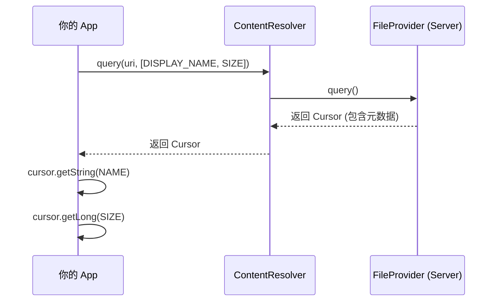

# 1.9.5 获取文件信息

## 1.9.5 借阅卡的隐藏信息

"拿到这本书（URI）之后，"希尔晃了晃手里的一张 SD 卡，"你其实还不知道它叫什么名字，也不知道它有多大。"

洛芙愣了一下。"URI 里不是写着吗？`.../my_imgs/map.png`。"

"那是假名！"黛琳和希尔异口同声地喊道。

黛琳叹了口气，指着刚才那个 `file_paths.xml`。"记得吗？我们在 XML 里配置了 `name="my_imgs"` 来隐藏真实路径。同理，URI 的最后一部分也不一定是真实的文件名。更重要的是，流的大小你是看不出来的。"

"所以，"伊莎把一杯茶放在桌上，"我们需要向 ContentProvider 再次询问：'请告诉我这张借阅卡对应的书，它的真名是什么？它有多重？'"

### 获取 MIME 类型

"第一步，确认它的类型。"黛琳说。" although Intent 通常会告诉你类型，但最准确的方法是问 ContentResolver。"

```kotlin
val mimeType = contentResolver.getType(returnUri)
Log.d("FileInfo", "文件类型: $mimeType")
```

"这个方法会根据此时此刻的文件状态返回类型。"黛琳解释道。"比如，FileProvider 会自动根据文件扩展名判断它是 `image/png` 还是 `application/pdf`。"

### 获取文件名和大小

"第二步，获取元数据。"希尔打开了一个数据库查询界面。"ContentProvider 的神奇之处在于，它不仅能提供文件流，还能像数据库一样被**查询**。"

```kotlin
// 1. 定义你想查询的列：显示名称，文件大小
val projection = arrayOf(
    OpenableColumns.DISPLAY_NAME,
    OpenableColumns.SIZE
)

// 2. 执行查询 (query)
contentResolver.query(
    returnUri,
    projection,
    null, null, null
)?.use { cursor ->
    // 3. 移动游标到第一行
    if (cursor.moveToFirst()) {
        // 4. 获取列索引
        val nameIndex = cursor.getColumnIndex(OpenableColumns.DISPLAY_NAME)
        val sizeIndex = cursor.getColumnIndex(OpenableColumns.SIZE)

        // 5. 读取数据
        val name = cursor.getString(nameIndex)
        val size = cursor.getLong(sizeIndex)

        Log.d("FileInfo", "文件名: $name, 大小: $size bytes")
    }
}
```

洛芙看着那段 `cursor` 代码，觉得有点眼熟。"这看起来像是在查 SQLite 数据库？"

"本质上就是一样的！"希尔打了个响指。"ContentProvider 就是数据库和文件的统一接口。你用 SQL 的思维去查文件信息，完全没问题。"

"注意 `OpenableColumns`。"伊莎提醒道。"这是 Android 定义的标准列名。所有规范的 FileProvider（包括系统的图库、Google Drive）都必须支持这两个列。"

### 为什么要查大小？

"查文件名我能理解，用来显示在 UI 上。"洛芙问。"但为什么要查大小？直接读流不就知道了吗？"

"为了防患于未然。"黛琳严肃地说。"如果用户选了一个 2GB 的视频，而你的 App 试图把它读进内存……Boom。OOM（Out Of Memory）。"

"所以，"希尔补充道，"先查大小。如果太大，就给用户弹个提示：'文件过大，请忍一下'，或者开启流式传输，而不是一次性读完。"

阳光透过树叶洒在键盘上，代码里的 `returnUri` 像是通往另一个世界的钥匙。洛芙意识到，每一个简单的 URI 背后，都藏着一个丰富的信息世界，等待着有心人去叩问。

---

### 技术总结

> **获取文件信息 (Retrieving file information)** —— 由于 Content URI 可能不包含真实文件名，且无法直接获取文件大小，必须通过 `ContentResolver.query()` 查询元数据。标准的查询列包括 `OpenableColumns.DISPLAY_NAME`（文件名）和 `OpenableColumns.SIZE`（文件大小）。

#### 今日关键词

1. **ContentResolver.getType()**：获取 URI 对应的 MIME 类型。
2. **ContentResolver.query()**：像查询数据库一样查询文件元数据。
3. **OpenableColumns**：包含标准列名 `DISPLAY_NAME` 和 `SIZE` 的常量类。
4. **Cursor**：查询结果的游标，使用前需 `moveToFirst()`，使用后需 `close()`（或用 `use`）。

#### 结构图



#### 反模式与陷阱

1. **解析 URI 字符串获取文件名**：错误做法！很多 URI（如云端文件）是哈希值，不包含文件名。
   * **修复**：必须用 `query` + `DISPLAY_NAME`。
2. **在主线程查询**：虽然通常很快，但如果 URI 指向网络文件（如 Google Drive），查询可能会阻塞。
   * **修复**：在后台线程执行 query。
3. **未检查 cursor.moveToFirst()**：查询结果可能为空。直接 `getString` 会抛出异常。

---

#### 🏕️ 动手练习

#### Task 1 · 完善文件选择器 ★

**目标**：在上一章的基础上，显示选中文件的名字和大小。

**你需要做的事**：
1. 接收到 URI 后，调用一个辅助方法 `getFileInfo(uri)`。
2. 在方法里执行 query。
3. 将文件名和大小（格式化为 KB/MB）显示在 TextView 上。

**验收标准**：
- [ ] 选中图片后，界面显示正确的文件名和大小

#### Task 2 · 类型检查 ★★

**目标**：确保只处理特定类型的文件。

**你需要做的事**：
1. 使用 `contentResolver.getType(uri)`。
2. 如果类型不是 `image/*`，提示用户"仅支持图片"并拒绝处理。

**验收标准**：
- [ ] 选中非图片文件时，给出错误提示

#### Task 3 · 大文件警告 ★★★

**目标**：模拟大文件处理逻辑。

**你需要做的事**：
1. 设置一个阈值（比如 1MB）。
2. 在查询到 size 后，如果超过阈值，用红色字体显示大小，并弹出 Toast "文件较大，加载可能较慢"。

**验收标准**：
- [ ] 大文件显示警告 UI

---

#### 面试热身

1. **Q1**：为什么不能通过解析 URI 字符串来获取文件名？
2. **Q2**：`ContentResolver.query` 返回的 Cursor 需要关闭吗？如果不关闭会怎样？
3. **Q3**：`OpenableColumns.SIZE` 返回的单位是什么？（提示：字节 bytes）
4. **Q4**：如果查询结果 Cursor 为 null 或者 moveToFirst 返回 false，说明什么？
5. **Q5**：`getType` 和 `query` 可以在主线程调用吗？（提示：严格来说都不建议，可能有 IPC 或网络耗时）

---

### 🍭 洛芙的小小日记本

原来文件也有"身份证"。以前我只管拿着用，现在学会了先看一眼它的身份证（查询元数据）。知道它叫什么、有多大、是什么类型，这不仅仅是技术上的严谨，更像是一种对他人的尊重——在了解你之前，我不会随意打扰（读取）你。
